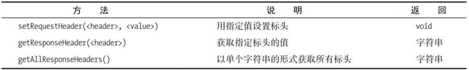
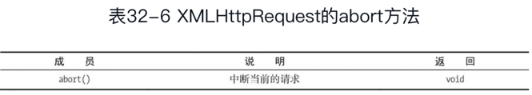
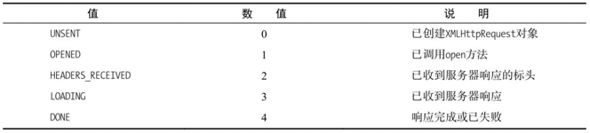
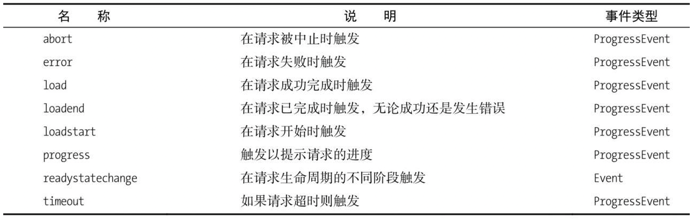
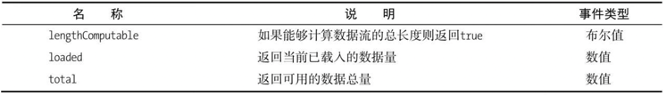
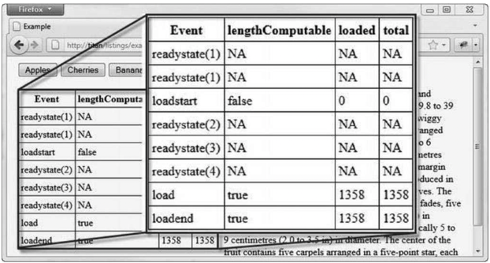
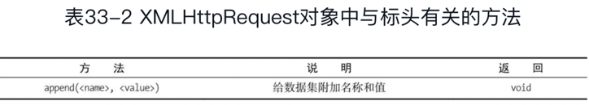
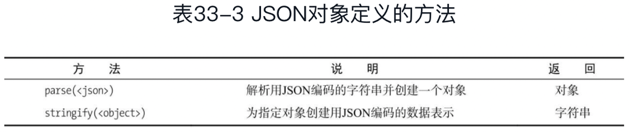
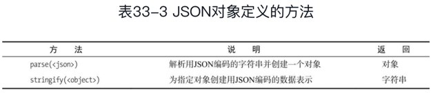
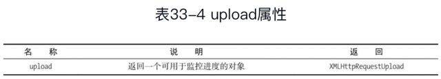

# 本章所有例子都是关于从服务器上获取数据的。
第32章 使用Ajax（第Ⅰ部分）																												
* Ajax是现代Web应用程序开发的一项关键工具。																												
它让你能向服务器异步发送和接收数据，然后用JavaScript解析。																												
Ajax是Asynchronous JavaScript and XML（异步JavaScript与XML）的缩写。																												
这个名称诞生于XML还是数据传输首选格式的时期，不过，我后面会谈到，这种情形已不复存在。																												
* Ajax核心规范的名称继承于你用来建立和发起请求的JavaScript对象：XMLHttpRequest。																												
* 这一规范有两个等级。																												
	1. 所有主流浏览器都实现了第一级（Level 1），它代表了基础级别的功能。																											
	2. 第二级（Level 2）扩展了最初的规范，																											
	纳入了额外的事件和一些功能来让它更容易与form元素协作，																											
	并且支持一些相关的规范（例如**CORS**，我会在本章后面加以介绍）。


在这一章里，																												
## 我会讲解Ajax的基础知识，
## 向你展示如何创建、配置和执行简单的请求。
### 32.4 获取和设置标头
XMLHttpRequest对象让你可以设置发送给服务器的请求标头（Header）和读取服务器响应里的标头。																										
表32-5介绍了与标头有关的方法。
    
#### 32.4.1 覆盖请求的HTTP方法
通常不需要添加或修改Ajax请求里的标头。浏览器知道需要发送些什么，服务器也知道如何进行响应。																									
不过，有几种情况例外。																									
* 第一种是X-HTTP-Method-Override标头。																								
HTTP标准通常被用于在互联网上请求和传输HTML文档，它定义了许多方法。																								
大多数人都知道GET和POST，因为它们的使用最为广泛。																								
不过还存在其他一些方法（包括PUT和DELETE），这些HTTP方法用来给向服务器请求的URL赋予意义，而且这种用法正在呈现上升趋势。																								
	* 举个例子，假如你想查看某条用户记录，就可以生成这样一个请求：																							
	```javascript
  httpRequest.open("GET", "http://myserver/records/freeman/adam");
	```     																							
	这里只展示了HTTP方法和请求的URL。要使这个请求能顺利工作，服务器端必须有应用程序能理解这个请求，并将它转变成一段合适的数据以发送回服务器。																							
	* 如果想删除数据，可以这么写：
	```javascript
	httpReqeust.open("DELETE", "http://myserver/records/freeman/adam");									
	```														
	此处的关键在于通过HTTP方法表达出你想让服务器做什么，而不是把它用某种方式编码进URL。																							
	这是一种被称为RESTful API的趋势的一部分。																							
	RESTful API还包括哪些元素尚处在频繁和激烈的争论之中，我在这里就不参与了。																							
		* 以这种方式使用HTTP方法的问题在于：																						
		许多主流的Web技术只支持GET和POST，而且不少防火墙只允许GET和POST请求通过。																						
		有一种惯用做法可以规避这个限制，就是使用X-HTTP-Method-Override标头来指定想要使用的HTTP方法，但形式上是再发送一个POST请求。																						
		代码清单32-6对此进行了演示。																						
		问题4. 设置Ajax请求的标头																						
		解决方法：使用setRequestHeader方法																						
		代码清单：32-6 ~ 32-7		
		```html																				
		<!DOCTYPE HTML>																						
		<html>																						
			<head>																					
				<title>Example</title>																				
			</head>																					
			<body>																					
				<div>																				
					<button>Apples</button>																			
					<button>Cherries</button>																			
					<button>Bananas</button>																			
				</div>																				
				<div id="target">Press a button</div>																				
				<script>																				
					var buttons = document.getElementsByTagName("button");																			
					for(var i = 0; i < buttons.length; i++) {																			
						buttons[i].onclick = handleButtonPress;																		
					}																			
					function handleButtonPress(e){																			
						var httpRequest = new XMLHttpRequest();																		
						httpRequest.onreadystatechange = handleResponse;																		
						httpRequest.open("GET", e.target.innerHTML + ".html");																		
						httpRequest.setRequestHeader("X-HTTP-Method-Override", "DELETE");																		
						httpRequest.send();																		
					}																			
																								
					function handleResponse(e){																			
						if(e.target.readyState == XMLHttpRequest.DONE && e.target.status == 200) {																		
							document.getElementById("target").innderHTML = e.target.respnseText;																	
						}																		
					}																			
				</script>																				
			</body>																					
		</html>			
		```																			
		在这个例子中，我用XMLHttpRequest对象上的setRequestHeader方法来表明我想让这个请求以HTTP DELETE方法的形式进行处理。																						
		请注意我在调用open方法之后才设置了这个标头。																						
		如果你试图在open方法之前使用setRequestHeader方法，XMLHttpRequest对象就会抛出一个错误。																						
		* 覆盖HTTP方法需要服务器端的Web应用程序框架能理解X-HTTP-Method-Override这个惯例，并且你的服务器端应用程序要设置成能寻找和理解那些用得较少的HTTP方法。																						

#### 32.4.2 禁用内容缓存
第二个可以添加到Ajax请求上的有用标头是Cache-Control，它在编写和调试脚本时尤其有用。																									
一些浏览器会缓存通过Ajax请求所获得的内容，在浏览会话期间不会再请求它。																									
对我在这一章所使用的例子而言，意味着apples.html、cherries.html和bananas.html上的改动不会立即反映到浏览器中。																									
代码清单32-7展示了可以如何设置标头来避免这一点。		
```javascript																							
...																									
function handleButtonPress(e){																									
	var httpRequest = new XMLHttpRequest();																								
	httpRequest.onreadystatechange = handleResponse;																								
	httpRequest.open("GET", e.target.innerHTML + ".html");																								
	httpRequest.setRequestHeader("Cache-Control", "no-cache");																								
	httpRequest.send();																								
}																									
...		
```																							
设置标头值的方式和之前的例子一样，但这次用到的标头是Cache-Control，而你想要的值是no-cache。																									
放置这条语句后，如果通过Ajax请求的内容发生了改变，就会在下一次请求文档时体现出来。																									
* 32.4.3 读取响应标头																									
可以通过getResponseHeader和getAllResponseHeaders方法来读取服务器响应某个Ajax请求时发送的HTTP标头。																									
在大多数情况下，你不需要关心标头里有什么，因为它们是浏览器和服务器之间交互事务的组成部分。																									
代码清单32-8展示了如何使用这些属性。																									
问题5. 读取服务器响应的标头																									
解决方法：使用getResponseHeader和getAllResponseHeaders方法																									
代码清单：32-8			
```html																						
<!DOCTYPE HTML>																									
<html>																									
	<head>																								
		<title>Example</title>																							
		<style>																							
			#allheaders, #ctheader {																						
				border: medium solid black;																					
				padding: 2px;																					
				margin: 2px;																					
			}																						
		</style>																							
	</head>																								
	<body>																								
		<div>																							
			<button>Apples</button>																						
			<button>Cherries</button>																						
			<button>Bananas</button>																						
		</div>																							
		<div id="ctheader"></div>																							
		<div id="allheaders"></div>																							
		<div id="target">Press a button</div>																							
		<script>																							
			var buttons = document.getElementsByTagName("button");																						
			for(var i = 0; i < buttons.length; i++) {																						
				buttons[i].onclick = handleButtonPress;																					
			}																						
			var httpRequest = new XMLHttpRequest();																						
			function handleButtonPress(e){																						
				httpRequest.onreadystatechange = handleResponse;																					
				httpRequest.open("GET", e.target.innerHTML + ".html");																					
				httpRequest.send();																					
			}																						
																									
			function handleResponse(e){																						
				if(httpRequest.readyStats == 2) {																					
					document.getElementById("allheaders").innerHTML = httpRequest.getAllResponseHeaders();																				
					document.getElementById("ctheader").innerHTML = httpRequest.getResponseHeader("Content-Type");																				
				} else if(httpRequest.readyState ==4 && e.target.status == 200) {																					
					document.getElementById("target").innderHTML = e.target.respnseText;																				
				}																					
			}																						
		</script>																							
	</body>																								
</html>		
```																							
响应标头在readyState变成HEADERS_RECEIVED（数值为2）时就可以使用了。																									
标头是服务器在响应时首先发送回来的信息，因此你可以在内容本身就绪前先读取它们。																									
在这个例子里，我通过getResponseHeader和getAllResponseHeaders方法获取了标头，然后将某一个标头（Content-Type）和其他所有标头的值分别设为两个div元素的内容。																									
																										
### 32.6 中止请求
XMLHttpRequest对象定义了一个让你可以中止请求的方法，如表32-6所示。
																					
为了演示这个功能，我修改了fruitselector.js这段Node.js脚本来引入一个10秒延迟		
```javascript																								
var http = require('http');																										
http.createServer(function(req, res){																										
	console.log("[200] " + req.method + "to " + req.url);																									
	res.statusCode = 200;																									
	res.setHeader("Content-Type", "text/html");																									
	setTimeout(function(){																									
		var origin = req.headers["origin"];																								
		if(origin.indexOf("titan") > -1) {																								
			res.setHeader("Access-Control-Allow-Origin", orgin);																							
		}																								
		res.write('<html><head><title>Fruit Total</titl></head><body>');																								
		res.write('<p>');																								
		res.write('You selected ' + req.url.substing(1));																								
		res.write('</p></body></html>');																								
		res.end();																								
	}, 10000);																									
}).listen(8080);								
```																		
当服务器接收到一个请求后，它会先写入初始的响应标头，暂停10秒钟后再完成整个响应。																										
代码清单32-14展示了如何在浏览器上使用XMLHttpRequest的中止功能。																										
问题7. 中止一个请求																										
代码清单：解决方法：使用<span class="s10">abort</span>方法																										
32-13、32-14						
```html																				
<!DOCTYPE HTML>																										
<html>																										
	<head>																									
		<title>Example</title>																								
	</head>																									
	<body>																									
		<div>																								
			<button>Apples</button>																							
			<button>Cherries</button>																							
			<button>Bananas</button>																							
		</div>																								
		<div>																								
			<button id="abortbutton">Abort</button>																							
		</div>																								
		<div id="target">Press a button</div>																								
		<script>																								
			var buttons = document.getElementsByTagName("button");																							
			for(var i = 0; i < buttons.length; i++) {																							
				buttons[i].onclick = handleButtonPress;																						
			}																							
			var httpRequest;																							
			function handleButtonPress(e){																							
				if(e.target.id == "abortbutton"){																						
					httpRequest.abort();																					
				} else {																						
					httpRequest = new XMLHttpRequest();																					
					httpRequest.onreadystatechange = handleResponse;																					
					httpRequest.onabort = handleAbort;																					
					httpRequest.open("GET", "http://titan:8080/" + e.target.innerHTML);																					
					httpRequest.send();																					
					document.getElementById("target").innerHTML = httpRequest.responseText;																					
				}																						
			}																							
																										
			function handleResponse(e){																							
				if(e.target.readyState == XMLHttpRequest.DONE && e.target.status == 200) {																						
					document.getElementById("target").innderHTML = e.target.respnseText;																					
				}																						
			}																							
			funciton handleAbort(){																							
				document.getElementById("target").innerHTML = "Request Aborted";																						
			}																							
		</script>																								
	</body>																									
</html>
```																										
我给文档添加了一个Abort（中止）按钮，它通过调用XMLHttpRequest对象上的<span class="s11">abort</span>方法来中止进行中的请求。因为我在服务器端引入了一段延迟，所以有充足的时间来执行它。																										
XMLHttpRequest通过<span class="s10">abort</span>事件和<span class="s10">readystatechange</span>事件给出中止信号。在这个例子中，我响应了<span class="s10">abort</span>事件，并更新了id为target的div元素中的内容，以此标明请求已被中止。																										

## 我会向你展示如何将事件作为请求的进度信号，
* 32.1 Ajax起步																										
问题1：发起一个Ajax请求																										
解决方案：创建一个XMLHttpRequest对象，然后调用open和send方法																										
代码清单：32-1 ~ 32-3																										
Ajax的关键在于XMLHttpRequest对象，而理解这个对象的最佳方式是看个例子。
	```html																										
	<!DOCTYPE HTML>																									
	<html>																									
		<head>																								
			<title>Example</title>																							
		</head>																								
		<body>																								
			<div>																							
				<button>Apples</button>																						
				<button>Cherries</button>																						
				<button>Bananas</button>																						
			</div>																							
			<div>																							
				<div id="target">Press a button</div>																						
			</div>																							
			<script>																							
				var buttons = document.getElementsByTagName("button");																						
				for(var i = 0; i < buttons.length; i++) {																						
					buttons[i].onclick = handleButtonPress;																					
				}																						
				function handleButtonPress(e){																						
					var httpRequest = new XMLHttpRequest();																					
					httpRequest.onreadystatechange = handleResponse;																					
					httpRequest.open("GET", e.target.innerHTML + ".html");																					
					httpRequest.send();																					
				}																						
																										
				function handleResponse(e){																						
					if(e.target.readyState == XMLHttpRequest.DONE && e.target.status == 200) {																					
						document.getElementById("target").innderHTML = e.target.respnseText;																				
					}																					
				}																						
			</script>																							
		</body>																								
	</html>	
	```																								
	随着用户点击各个水果按钮，浏览器会异步执行并取回所请求的文档，而主文档不会被重新加载。这就是典型的Ajax行为。																									
	* 如果把注意力移到脚本上，你就能明白这一切是如何实现的。																									
		* 首先是handleButtonPress函数，脚本会调用它以响应button控件的click事件																								
			* 第一步是创建一个新的XMLHttpRequest对象。																							
			与之前在DOM中见过的大多数对象不同，																							
				* 你并非通过浏览器定义的某个全局变量来访问这类对象，																						
				* 而是使用关键词new																						
			* 下一步是给<span class="s10">readystatechange</span>事件设置一个事件处理器。																							
			这个事件会在请求过程中被多次触发，向你提供事情的进展情况。																							
			我会在本章后面讨论这个事件（以及其他由XMLHttpRequest对象定义的事件）。																							
			我将on<span class="s10">readystatechange</span>属性的值设为handleResponse，稍后会讨论这个函数：httpRequest.on<span class="s10">readystatechange</span> = handleResponse;																							
			* 现在你可以告诉XMLHttpRequest对象你想要做什么了。																							
			使用open方法来指定HTTP方法（在这里是GET）和需要请求的URL																							
				* 我在这里展示的是open方法最简单的形式。																						
				你还可以给浏览器提供向服务器发送请求时使用的认证信息，																						
				就像这样：
				```javascript
				httpRequest.open("GET", e.target.innerHTML + ".html", true,"adam", "secret")
				```																					
				最后两个参数是应当发送给服务器的用户名和密码。																						
				剩下的那个参数指定了该请求是否应当异步执行。它应该始终被设置为true。																						
				* 根据用户按下的button来生成请求的URL。																						
				如果按的是Apples按钮，就请求Apples.html这个URL。																						
					* 浏览器可以足够智能地处理相对URL，它会在需要时使用当前文档的地址。																					
					在这个例子中，我的主文档是从`http://titan/listings/example.html`这个URL上载入的，																					
					因此Apples.html会被当成`http://titan/listings/Apples.html`。																					
					这些URL在你的环境里会有所不同，但效果是一样的。																					
				* 为你的请求选择正确的HTTP方法是很重要的。																						
					* 正如我在第12章所说的，GET请求适用于安全的交互行为，就是那些你可以反复发起而不会带来副作用的请求。																					
					* POST请求适用于不安全的交互行为，意思是每一个请求都会导致服务器端发生某种变化，而重复的请求可能会带来问题。																					
					虽然还有一些别的HTTP方法，但GET和POST是使用最为广泛的，广泛到如果你想用其他方法，就必须使用32.4.1节描述的惯例来确保你的请求能通过防火墙。																					
			* 这个函数的最后一步是调用send方法																							
			我在这个例子里没有向服务器发送任何数据，所以send方法无参数可用。																							
			我会在这一章的后面向你展示如何发送数据，但在这个简单的示例中，你只是从服务器请求HTML文档。																							
	* 32.1.1 处理响应																									
	一旦脚本调用了send方法，浏览器就会在后台发送请求到服务器。																									
	因为请求是在后台处理的，所以Ajax依靠事件来通知你这个请求的进展情况。																									
	在这个例子中，我用handleResponse函数处理这些事件：																									
		* 当<span class="s10">readystatechange</span>事件被触发后，浏览器会把一个Event对象传递给指定的处理函数。																								
		这个Event对象我在第30章介绍过，target属性则会被设为与此事件关联的XMLHttpRequest。																								
		* 多个不同的阶段会通过<span class="s10">readystatechange</span>事件传递信号，																								
		你可以读取XMLHttpRequest.readyState属性的值来确定当前处理的是哪一个。																								
		表32-2展示了这个属性的各个值。
            
                * DONE状态并不意味着请求成功，它只代表请求已完成。																							
			可以通过status属性获得HTTP状态码，它会返回一个数值（比如，200这个值代表成功）。																							
			只有结合readyState和status属性的值才能够确定某个请求的结果。																							
			* 在handleResponse函数里可以看到我怎样检查这两个属性。																							
			只有当readyState的值为DONE并且status的值为200时我才会设置div元素的内容。																							
			用XMLHttpRequest.responseText属性获得服务器发送的数据																							
			* responseText属性会返回一个字符串，代表从服务器上取回的数据。																							
			我用这个属性来设置div元素innerHTML属性的值，以显示被请求文档的内容。																							
			这些就构成了一个简单的Ajax示例：用户点击一个按钮，浏览器在后台向服务器请求一个文档，当它到达时你处理一个事件，并显示被请求文档的内容。																							
	* 这些就构成了一个简单的Ajax示例：用户点击一个按钮，浏览器在后台向服务器请求一个文档，当它到达时你处理一个事件，并显示被请求文档的内容。																									
	* 32.1.2 主流中的异类：应对Opera																									
																										
* 32.2 使用Ajax事件																										
	* 建立和探索一个简单的示例之后，你现在可以开始深入了解XMLHttpRequest对象支持的功能，以及如何在你的请求中使用它们了。																									
		* 起点就是第二级规范里定义的那些额外事件。																								
		你已经见过其中一个了：<span class="s10">readystatechange</span>。它是从第一级转过来的，其他还有一些，如表32-3所示。
		
		    * 这些事件大多数会在请求的某一个特定时点上触发。																							
			<span class="s10">readystatechange</span>（之前介绍过）和<span class="s10">progress</span>这两个事件是例外，它们可以多次触发以提供进度更新。																							
			* 除了<span class="s10">readystatechange</span>之外，表中展示的其他事件都定义于XMLHttpRequest规范的第二级。																							
			在我编写本书时，浏览器对这些事件的支持程度不一。																							
			比如，Firefox浏览器有着最完整的支持，Opera完全不支持它们，而Chrome支持其中的一些，但是所使用的方式并不符合规范。																							
			* 考虑到第二级事件的实现还不到位，<span class="s10">readystatechange</span>是目前唯一能可靠追踪请求进度的事件。																							
			* 调度这些事件时，浏览器会对<span class="s10">readystatechange</span>事件使用常规的Event对象（在第30章介绍过），对其他事件则使用ProgressEvent对象。																							
			ProgressEvent对象定义了Event对象的所有成员，并增加了表32-4中介绍的这些成员。
					
			问题2. 使用一次性事件追踪请求的进度																							
			解决方法：使用第二级的事件，比如onload、onloadstart和onloadend																							
			代码清单：32-4																							
			代码清单32-4展示了如何使用这些事件。我使用Firefox浏览器进行展示，因为它的实现方式最为完整和正确。		
			```html																					
			<!DOCTYPE HTML>																							
			<html>																							
				<head>																						
					<title>Example</title>																					
					<style>																					
						table {																				
							margin: 10px;																			
							border-collapse: collapse;																			
							float: left;																			
						}																				
						div {																				
							margin: 10px;																			
						}																				
						td, th {																				
							padding: 4px;																			
						}																				
					</style>																					
				</head>																						
				<body>																						
					<div>																					
						<button>Apples</button>																				
						<button>Cherries</button>																				
						<button>Bananas</button>																				
					</div>																					
					<table id="events" border="1"></table>																					
					<div>																					
						<div id="target">Press a button</div>																				
					</div>																					
					<script>																					
						var buttons = document.getElementsByTagName("button");																				
						for(var i = 0; i < buttons.length; i++) {																				
							buttons[i].onclick = handleButtonPress;																			
						}																				
						var httpRequest;																				
						function handleButtonPress(){																				
							clearEventDetails();																			
							httpRequest = new XMLHttpRequest();																			
							httpRequest.onreadystatechange = handleResponse;																			
							httpRequest.onerror = handleError;																			
							httpRequest.onload = handleLoad;																			
							httpRequest.onloadend = handleLoadEnd;																			
							httpRequest.onloadstart = handleLoadStart;																			
							httpRequest.onprogress = handleProgress;																			
							httpRequest.open("GET", e.target.innerHTML + ".html");																			
							httpRequest.send();																			
						}																				
						function handleResponse(e){																				
							displayEventDetails("readystate(" + httpRequest.readyState + ")");																			
							if(httpRequest.readyState == 4 && httpRequest.status == 200) {																			
								document.getElementById("target").innerHTML = httpRequest.responseText;																		
							}																			
						}																				
						function handleError(e) { displayEventDetails("error", e);}																				
						function handleLoad(e) { displayEventDetails("load", e); }																				
						function handleLoadEnd(e) { displayEventDetails("loadend", e); }																				
						function handleLoadStart(e) { displayEventDetails("loadstart", e); }																				
						function handleProgress(e) { displayEventDetails("progress", e); }																				
						function clearEventDetails() {																				
							document.getElementById("events").innerHTML += 																			
							"<tr><th>Event</th><th>lengthComputable</th>"																			
							=+ "<th>loaded</th><th>total</th></tr>"																			
						}																				
						function displayEventDetails(eventName, e) {																				
							if(e) {																			
								document.getElementById("events").innerHTML += 																		
								"<tr><td>" + eventName + "</td><td>" + e.lengthComputable + "</td><td>" + e.loaded + "</td></td>" + e.total + "</td></tr>";																		
							} else {																			
								document.getElementById("events").innerHTML += 																		
								"<tr><td>" + eventName + "</td><td>NA</td><td>NA</td><td>NA</td></tr>";																		
							}																			
						}																				
					</script>																					
				</body>																						
			</html>	
			```	
 		

## 如何处理请求和应用程序错误
32.3 处理错误																										
* 有三种方式可以处理这些错误，如代码清单32-5所示。																									
问题3. 探测和处理错误 																									
解决方法：响应错误事件，或者使用try...catch语句																									
代码清单：32-5				
```html																					
<!DOCTYPE HTML>																									
<html>																									
	<head>																								
		<title>Example</title>																							
	</head>																								
	<body>																								
		<div>																							
			<button>Apples</button>																						
			<button>Cherries</button>																						
			<button>Bananas</button>																						
			<button>Cucumber</button>																						
			<button id="badhost">Bad Host</button>																						
			<button id="badurl">Bad URL</button>																						
		</div>																							
		<div id="target">Press a button</div>																							
		<div id="errormsg"></div>																							
		<div id="statusmsg"></div>																							
		<script>																							
			var buttons = document.getElementByTagName("button");																						
			for(var i = 0; i < buttons.length; i++) {																						
				buttons[i].onclick = handleButtonPress;																					
			}																						
			function handleButtonPress(e) {																						
				var httpRequest = new XMLHttpRequest();																					
				httpRequest.onreadystatechange = handleResponse;																					
				httpRequest.onerror = handleError;																					
				try {																					
					switch(e.target.id) {																				
						case "badhost":																			
							httpRequest.open("GET", "http://a.nodomain/doc.html");																		
							beak;																		
						case "badurl":																			
							httpRequest.open("GET", "http://");																		
							break;																		
						default:																			
							httpRequest.open("GET", e.target.innerHTML + ".html");																		
							break;																		
					}																				
					httpRequest.send();																				
				}																					
				catch(error){																					
					displayErrorMsg("try/catch", error.message);																				
				}																					
			}																						
			function handleResponse(){																						
				if(httpRequest.readyState == 4) {																					
					var target = document.getElementById("target");																				
					if(httpRequest.status == 200) {																				
						target.innerHTML = httpRequest.responseText;																			
					} else {																				
						document.getElementById("statusmsg").innerHTML = "Status:" + httpRequest.status + " " + httpRequest.statusText;																			
					}																				
				}																					
			}																						
			function handleError(e){																						
				displayErrorMsg("Error event", httpRequest.status + httpRequest.statusText);																					
			}																						
			function displayErrorMsg(src, msg){																						
				document.getElementById("errormsg").innerHTML = src + ": " + msg;																					
			}																						
			function clearMessages(){																						
				document.getElementById("errormsg").innerHTML = "";																					
				document.getElementById("statusmsg").innerHTML = "";																					
			}																						
		</script>																							
	</body>																								
</html>	
```																								
* 使用Ajax时必须留心两类错误。它们之间的区别源于视角不同。

### 第一类错误是从XMLHttpRequest对象的角度看到的问题：
	某些因素阻止了请求发送到服务器，例如DNS无法解析主机名，连接请求被拒绝，或者URL无效。  

#### 32.3.1 处理设置错误
你需要处理的第一类问题是向XMLHttpRequest对象传递了错误的数据，																							
* 比如格式不正确的URL。它们极其容易发生在生成基于用户输入的URL时。																						
为了模拟这类问题，我给示例文档添加了一个标签为Bad URL（错误的URL）的button。																						
这是一种会阻止请求执行的错误，而XMLHttpRequest对象会在发生这类事件时抛出一个错误。这就意味着你需要用一条try...catch语句来围住设置请求的代码																						
	* catch子句让你有机会从错误中恢复。																					
	可以选择提示用户输入一个值，也可以回退至默认的URL，或是简单地丢弃这个请求。																					
	在这个例子中，我仅仅调用了displayErrorMsg函数来显示错误消息。		

### 第二类问题是从应用程序的角度看到的问题，而非XMLHttpRequest对象。
它们发生于请求成功发送至服务器，服务器接受请求、进行处理并生成响应，但该响应并不指向你期望的内容时。																								
举个例子，如果你请求的URL不存在，这类问题就会发生。	 

																						
第二类错误发生在请求已生成，但其他方面出错时。	

#### 32.3.2 处理请求错误	
* 为了模拟这类问题，我给示例添加了一个标签为Bad Host（错误的主机）的按钮																							
	* 这个URL存在两个问题。																						
		* 第一个问题是主机名不能被DNS解析，因此浏览器无法生成服务器连接。																					
		这个问题直到XMLHttpRequest对象开始生成请求时才会变得明显，因此它会以两种方式发出错误信号。																					
			* 如果你注册了一个error事件的监听器，浏览器就会向你的监听函数发送一个Event对象。																				
			当这类错误发生时，你能从XMLHttpRequest对象获得何种程度的信息取决于浏览器，遗憾的是，大多数情况下你会得到值为0的status和空白的statusText值。																				
			* ???XMLHttpRequest通过<span class="s10">readystatechange</span>事件给出信号。																				
		* 第二个问题是URL和生成请求的脚本具有不同的来源，在默认情况下这是不允许的。																					
		你通常只能向载入脚本的同源URL发送Ajax请求。																					
		浏览器报告这个问题时可能会抛出Error或者触发error事件，不同浏览器的处理方式不尽相同。																					
		不同浏览器还会在不同的时点检查来源，这就意味着你不一定总是能看到浏览器对同一个问题突出显示。																					
		你可以使用跨站资源规范（**CORS**, Cross-Origin Resource Sharing）来绕过同源限制，参见32.5节。				


#### 32.3.3 处理应用程序错误
最后一类错误发生于请求成功完成（从XMLHttpRequest对象的角度看），但没有返回你想要的数据时。																							
为了制造这类问题，我添加了一个说明标签为Cucumber（黄瓜）的button。																							
按下这个按钮会生成类似于Apples、Cherries和Bananas按钮那样的请求URL，但是服务器上不存在cucumber.html这个文档。																							
这一过程本身没有错误（因为请求已成功完成），你需要根据status属性来确定发生了什么。																							
当你请求某个不存在的文档时，你会获得404这个状态码，它的意思是服务器无法找到请求的文档。																							
你可以看到我是如何处理200（意思是OK）以外的状态码的																							

## 如何跨源发起请求。
32.5 生成跨源Ajax请求																											
* 默认情况下，浏览器限制脚本只能在它们所属文档的来源内生成Ajax请求。																										
你应该还记得，来源由URL中的协议、主机名和端口号组成。																										
这就意味着当我从`http://titan`载入一个文档后，文档内含的脚本通常无法生成对`http://titan:8080`的请求，因为第二个URL的端口号是不同的，所以处于文档来源之外。																										
从一个来源到另一个来源的Ajax请求被称为跨源请求（cross-origin request）。																										
* 这一策略的目的是降低跨站脚本攻击（cross-site scripting，简称CSS）的风险，即诱导浏览器（或用户）执行恶意脚本。																										
CSS攻击不属于本书的讨论范围，但维基百科上有一篇文章很好地介绍了这个主题：`http://en.wikipedia.org/wiki/Cross-site_scripting`。																										
* 这个策略的问题在于它一刀切地禁止了跨源请求。																										
这就导致人们使用一些非常丑陋的手段来诱使浏览器生成违反这一策略的请求。																										
* 幸好，跨源资源共享（Cross-Origin Resource Sharing, **CORS**）规范提供了一种合法的方式来生成跨源请求。																										
跨源请求规范（**CORS**），它是一组请求标头，让脚本能对另一个来源生成Ajax请求。																										
这是一种有用的技巧，只是你需要有给服务器响应添加标头的能力。																										
这个高级主题要求读者拥有一些HTTP标头的基本知识。																										
因为本书是关于HTML5的，所以我不会深入谈及HTTP的细节。																										
如果你不熟悉HTTP，建议你跳过这一节。																										
	作为准备，让我们来看一下想要解决的问题。																									
	问题6. 发起跨源Ajax请求										

### 解决方法：设置服务器响应里的Access-Control-Allow-Origin标头
代码清单：32-9 ~ 32-12																									
代码清单32-9展示了一个HTML文档，它包含的脚本会尝试生成跨源请求。																		
```html							
<!DOCTYPE HTML>																									
<html>																									
	<head>																								
		<title>Example</title>																							
	</head>																								
	<body>																								
		<div>																							
			<button>Apples</button>																						
			<button>Cherries</button>																						
			<button>Bananas</button>																						
		</div>																							
		<div id="target">Press a button</div>																							
		<script>																							
			var buttons = document.getElementsByTagName("button");																						
			for(var i = 0; i < buttons.length; i++) {																						
				buttons[i].onclick = handleButtonPress;																					
			}																						
			var httpRequest;																						
			function handleButtonPress(e){																						
				httpRequest = new XMLHttpRequest();																					
				httpRequest.onreadystatechange = handleResponse;																					
				httpRequest.open("GET", "http://titan:8080/" + e.target.innerHTML);																					
				httpRequest.send();																					
			}																						
																									
			function handleResponse(e){																						
				if(httpRequest.readyState == 4 && e.target.status == 200) {																					
					document.getElementById("target").innderHTML = e.target.respnseText;																				
				}																					
			}																						
		</script>																							
	</body>																								
</html>	
```																								
	* 这个例子中的脚本扩展了用户所按按钮的内容，把它附加到`http://titan:8080`上，然后尝试生成一个Ajax请求（如http://titan:8080/Apples）。																								
	我会从`http://titan/listings/example.html`载入此文档，这就意味着脚本正在试图生成一个跨源请求。																								
	* 脚本尝试连接的服务器运行的是Node.js。																								
	代码清单32-10展示了代码，我把它保存在一个名为fruitselector.js的文件里。（获取Node.js的细节请参见第2章。）
	```javascript																								
	var http = require("http");																								
	http.createServer(function(req, res){																								
		console.log("[200]" + req.method + "to" + req.url);																							
		res.writeHead(200, "OK", { "Content-Type": "text/html" });																							
		res.write('<html><head><title>Fruit Total</title></head><body>');																							
		res.write('<p>');																							
		res.write('You selected ' + req.url.substring(1));																							
		res.write('</p></body></html>');																							
		res.end();																							
	}).listen(8080);		
	```																						
	这是一个非常简单的服务器：它根据客户端请求的URL生成一小段HTML文档。																								
	举例来说，如果客户端请求了http://titan:8080/Apples，那么服务器就会生成并返回下列HTML文档：					
	```html																			
	<html>																								
		<head>																							
			<title>Fruit Total</title>																						
		</head>																							
		<body>																							
			<p>You selected Apples</p>																						
		</body>																							
	</html>		
	```																						
	* 按照现在这个样子，example.html里的脚本无法从服务器获取它想要的数据。																								
	解决方法是为服务器返回浏览器的响应信息添加一个标头，如代码清单32-11所示。
	```javascript																								
	var http = require('http');																								
	http.createServer(function(req, res){																								
		console.log("[200]" + req.method + "to" + req.url);																							
		res.writeHead(200, "OK", { 																							
			Content-Type: "text/html",																						
			Access-Control-Allow-Origin: "http://titan"																						
		});																							
		res.write('<html><head><title>Fruit Total</title></head><body>');																							
		res.write('<p>');																							
		res.write('You selected ' + req.url.substring(1));																							
		res.write('</p></body></html>');																							
		res.end();																							
	}).listen(8080);			
	```																					
	Access-Control-Allow-Origin标头指定了某个来源应当被允许对此文档生成跨源请求。																								
	如果标头里指定的来源与当前文档的来源匹配，浏览器就会加载和处理该响应所包含的数据。																								
	* 给服务器响应添加这个标头之后，example.html文档中的脚本就能够请求和接收来自服务器的数据了																								
	* 支持**CORS**要求浏览器必须在联系服务器和获取响应标头之后应用跨源安全策略，这就意味着即使响应因为缺少必要的标头或指定了不同的域而被丢弃，请求也已被发送过了。																								
	这种方式和没有实现**CORS**的浏览器非常不同，后者只会简单地阻挡请求，不会去联系服务器。

### 32.5.1 使用Origin请求标头
	作为**CORS**的一部分，浏览器会给请求添加一个Origin标头以注明当前文档的来源。																									
	可以通过它来更灵活地设置Access-Control-Allow-Origin标头的值，如代码清单32-12所示。
	```javascript																									
	var http = require('http');																									
	http.createServer(function(req, res){																									
		console.log("[200]" + req.method + "to " + req.url);																								
		res.statusCode = 200;																								
		res.setHeader("Content-Type", "text/html");																								
		var origin = req.headers["origin"];																								
		if(origin.indexOf("titan") > -1){																								
			res.setHeader("Access-Control-Allow-Origin", origin);																							
		}																								
		res.write('<html><head><title>Fruit Total</title></head><body>');																								
		res.write('<p>');																								
		res.write('You selected ' + req.url.substring(1));																								
		res.write('</p></body></html>');																								
		res.end();																								
	}).listen(8080);
	```
	我修改了服务器端的脚本，让它只有在请求包含Origin标头并且值里有titan时才设置Access-Control-Allow-Origin响应标头。																									
	这是一种非常粗略的请求来源检查方式，但你可以根据具体项目的上下文环境来调整这种方式，使它更加精确。																									
	* 还可以把Access-Control-Allow-Origin标头设置成一个星号（*），																									
	意思是允许任意来源的跨源请求。																									
	使用这个设置之前应该仔细考虑这么做的安全隐患。																									
	* 32.5.2 高级**CORS**功能																									
	**CORS**规范定义了许多额外的标头，可用于精细化控制跨域请求，包括限制请求能够使用的HTTP方法。																									
	这些高级功能需要进行一次预先请求（preflight request），即浏览器先向服务器发送一个请求来确定有哪些限制，然后再发送请求来获取数据本身。																									
	本书编写过程中，这些高级功能尚未被可靠地实现。																									
																										
# 下一章则都是关于发送数据的，特别是表单数据，
因为它是Ajax最常见的用途之一。																												
第32章 使用Ajax（第Ⅰ部分）																												
在这一章里，我将继续介绍Ajax的工作方式																												
## 如何向客户端发送数据
发送表单和文件是Ajax的两个常见用途，它们能让Web应用程序创建出更丰富的用户体验。																												
### 表单数据收集方式
#### 1. 最典型的情况是从客户端发送表单数据，即用户在form元素所含的各个input元素里输入的值。																												
	* 33.1 准备向服务器发送数据																											
	Ajax最常见的一大用途是向服务器发送数据。																											
	代码清单33-1展示了一张简单的表单，它将会成为本章这一部分的基础。我把这段HTML保存在一个名为example.html的文件里。	
	```html																										
	<!DOCTYPE html>																											
	<html>																											
		<head>																										
			<title>Example</titl>																									
			<style>																									
				.table { display: table; }																								
				.row { display: table-row; }																								
				.cell { display: table-cell; padding: 5px; }																								
				.label { text-align: right; }																								
			</style>																									
		</head>																										
		<body>																										
			<form id="fruitform" method="post" action="http://titan:8080/form">																									
				<div class="table">																								
					<div class="row">																							
						<div class="cell label">Bananas: </div>																						
						<div class="cell"><input name="bananas" value="2"/></div>																						
					</div>																							
					<div class="row">																							
						<div class="cell label">Apples:</div>																						
						<div class="cell"><input name="apples" value="5"/></div>																						
					</div>																							
					<div class="row">																							
						<div class="cell label">Cherries:</div>																						
						<div class="cell"><input name="cherries" value="20"/></div>																						
					</div>																							
					<div class="row">																							
						<div class="cell label">Total:</div>																						
						<div id="results" class="cell">0 items</div>																						
					</div>																							
					<button id="submit" type="submit">Submit Form</button>																							
			</form>																									
		</body>																										
	</html>	
	```																										
	这个例子中的表单包含三个input元素和一个提交button。																											
	这些input元素让用户可以指定三种不同种类的水果各自要订购多少，button则会将表单提交给服务器。																											
	要了解这些元素的更多信息，请参见第12章、第13章和第14章。																											
																												
	* 33.1.1 定义服务器																											
	我们需要为这些示例创建处理请求的服务器。我再一次使用了Node.js。代码清单33-2展示了fruitcalc.js里的脚本。	
	```javascript																										
	var http = require('http');																											
	var querystring = require('querystring');																											
	var multipart = require('multipart');																											
	function writeResponse(res, data){																											
		var total = 0;																										
		for(fruit in data){																										
			total += Number(data[fruit]);																									
		}																										
		res.writeHead('200', 'OK', {																										
			"Content-Type": "text/html",																									
			"Access-Control-Allow-Origin": "http://titan"																									
		});																										
		res.write('<html><head><title>Fruit Total</title></head><body>');																										
		res.write('<p>' + total + ' items orderd</p></body></html>');																										
		res.end();																										
		}																										
	}																											
	http.createServer(function(req, res){																											
		console.log("[200] " + req.method + " to " + req.url);																										
		if(req.method == "OPTIONS"){																										
			res.writeHead("200", "OK", {																									
				"Access-Control-Allow-Headers": "Content-Type",																								
				"Access-Control-Allow-Methods": "*",																								
				"Access-Control-Allow-Origin": "*"																								
			})																									
			res.end();																									
		} else if(req.url == '/form' && req.method == 'POST') {																										
			var dataObj = new Object();																									
			var contentType = req.headers["content-type"];																									
			var fullBody = "";																									
			if(contentType){																									
				if(contentType.indexOf("application/x-www-form-urlencoded") > -1){																								
					req.on("data", function(chunk){																							
						fullBody += chunk.toString();																						
					});																							
					req.on("end", function(){																							
						var dBody = querystring.parse(fullBody);																						
						dataObj.bananas = dBody["bananas"];																						
						dataObj.apples = dBody["apples"];																						
						dataObj.cherries = dBody["cherries"];																						
						writeResponse(res, dataObj);																						
																												
					});																							
				} else if(contentType.indexOf("application/json" > -1){																								
					req.on("data", function(chunk){																							
						fullBody += chunk.toString();																						
					});																							
					req.on("end", function(){																							
						dataObj = JSON.parse(fullBody);																						
						writeResponse(res, dataObj);																						
					});																							
				} else if(contentType.indexOf("multipart/form-data") > -1) {																								
					var partName;																							
					var partType;																							
					var parser = new multipart.parser();																							
					parser.boundary = "--" + req.headers["content-type"].substring(30);																							
					parser.onpartbegin = funciton(part){																							
						partName = part.name;																						
						partType = part.contentType;																						
						part.ondata = function(data){																						
							if(partName != "file" {																					
								dataObj[partName] = data;																				
							}																					
						};																						
						req.on("data", function(chunk){																						
							parser.write(chunk);																					
						});																						
						req.on("end", function(){																						
							writeResponse(res, dataObj);																					
						}																						
					}																							
				}																								
			}																									
		}																										
	}).listen(8080);	
	```																										
		* 我将脚本中需要加以注意的那一部分进行了加粗：writeResponse函数。																										
		这个函数会在提取请求的表单值之后调用，它负责生成对浏览器的响应。																										
		当前，这个函数会创建简单的HTML文档（如代码清单33-3所展示的），但我们会在本章后面处理不同格式时修改并增强这个函数。																										
		代码清单33-3 writeResponse函数生成的简单HTML文档	
		```html																									
		<html>																										
			<head>																									
				<title>Fruit Total</titl>																								
			</head>																									
			<body>																									
				<p>27 items ordered</p>																								
			</body>																									
		</html>
		```																										
			* 这个响应很简单，但它是一个不错的开始。它实现的效果是让服务器计算出了用户通过form中各个input元素所订购的水果总数。服务器端脚本的其余部分负责解码客户端用Ajax发送的各种可能的数据格式。																									
			* 可以像这样启动服务器程序：																									
			`bin\node.ext fruitcalc.js	`																								
			* 这段脚本的目标使用范围仅限于这一章。																									
			它不是一种通用的服务器，我也不建议你将它的任何部分用于生产服务。																									
			本章后续的示例绑定了许多假定和便捷做法，其脚本也不适合用于任何正式的用途。																									
																												
	* 33.1.2 理解问题所在																											
	图33-1清楚地描述了我想要用Ajax解决的问题。当你提交表单后，浏览器会在新的页面显示结果。这意味着两点：																											
		* 用户必须等待服务器处理数据并生成响应；																										
		* 所有文档上下文信息都丢失了，因为结果是作为新文档进行显示的。																										
	这就是应用Ajax的理想情形了。																											
	可以异步生成请求，这样用户就能在表单被处理时继续与文档进行交互。																											
																												
	* 33.2 发送表单数据																											
	向服务器发送数据的最基本方式是自己收集并格式化它。																											
	问题1. 向服务器发送表单数据																											
	解决方法：用DOM获得各个值，然后以URL编码格式连接它们																											
	代码清单：33-4																											
	代码清单33-4展示了添加到example.html的一段脚本，它用的就是这种方式。	
	```html																										
	<!DOCTYPE html>																											
	<html>																											
		<head>																										
			<title>Example</title>																									
			<style>																									
				.table { display: table; }																								
				.row { display: table-row; }																								
				.cell { display: table-cell; padding: 5px; }																								
				.label { text-align: right; }																								
			</style>																									
		</head>																										
		<body>																										
			<form id="fruitform" method="post" action="http://titan:8080/form:>																									
				<div class="table">																								
					<div class="row">																							
						<div class="cell label">Bananas: </div>																						
						<div class="cell"><input name="bananas" value="2"/></div>																						
					</div>																							
					<div class="row">																							
						<div class="cell label">Apples:</div>																						
						<div class="cell"><input name="apples" value="5"/></div>																						
					</div>																							
					<div class="row">																							
						<div class="cell label">Cherries:</div>																						
						<div class="cell"><input name="cherries" value="20"/></div>																						
					</div>																							
					<div class="row">																							
						<div class="cell label">Total:</div>																						
						<div id="results" class="cell">0 items</div>																						
					</div>																							
				</div>																								
				<button id="submit" type="submit">Submit Form</button>																								
			</form>																									
			<script>																									
				document.getElementById("submit").onclick = handleButtonPress;																								
				var httpRequest;																								
																												
				function handleButtonPress(e){																								
					e.preventDefault();																							
					var form = document.getElementById("fruitform");																							
					var formData = "";																							
					var inputElements = document.getElementsByTagName("input");																							
					for(var i = 0; i < inputElements.length; i++){																							
						formData += inputElements[i].name + "=" + inputElements[i].value + "&";																						
					}																							
					httpRequest = new XMLHttpRequest();																							
					httpRequest.onreadystatechange = handleResponse;																							
					httpRequest.open("POST", form.action);																							
					httpRequest.setRequestHeader("Content-Type", "application/x-www-url-encoded");																							
					httpRequest.send(formData);																							
				}																								
				function handleResponse(){																								
					if(httpRequest.readyState == 4 && httpRequest.status == 200){																							
						document.getElementById("result").innerHTML = httpRequest.responseText;																						
					}																							
				}																								
			</script>																									
		</body>																										
	</html>	
	```																										
所有的动作都发生在handleButtonPress函数里，脚本会调用这个函数来响应button元素的点击事件。																										
    * 我所做的第一件事是调用Event对象（由浏览器指派给此函数）上的preventDefault方法。																									
    第30章介绍过这个方法，解释了有些事件带有关联的默认行为。																									
    对表单里的button元素而言，其默认行为是用常规的非Ajax方式提交表单。																									
    我不想让它发生，所以调用了preventDefault方法。																									
        * 我喜欢在事件处理函数的开头调用preventDefault方法，因为这能让调试变得更容易。																								
        如果我在函数的最后调用这个方法，脚本里任何未捕捉到的错误都会导致执行终止并启动默认行为。																								
        这一切发生得如此之快，你可能完全无法在浏览器的脚本控制台中看到错误细节。																								
    * 下一步是收集并格式化各个input元素的值																									
    我用DOM获取了input元素的集合，然后创建了一个字符串，内含各个元素的name和value属性。																									
    name和value之间用等号（=）分隔，各个input元素之间则用&符号分隔。结果看上去就像这样：																									
    bananas=2&apples=5&cherries=20&																									
        * 如果回顾第12章，你会看到这是编码表单数据的默认方式，即application/x-www-form-urlencoded编码。																								
        虽然它是form元素使用的默认编码，但却不是Ajax的默认编码，因此我需要添加一个标头来告诉服务器准备接收哪一种数据格式																								
    * 脚本的其余部分是常规的Ajax请求，它们和前一章里的很相似，但有几处不同。																									
        * 首先，我在调用XMLHttpRequest对象上的open方法时用了HTTP的POST方法。																								
        这是一条原则：数据必须通过POST方法发送给服务器，而不是GET方法。																								
        通过读取HTMLFormElement的action属性获得了请求需要发送的URL																								
        form的行为会产生一个跨域请求，我用前一章介绍的**CORS**技巧在服务器端对它进行了处理。																								
        * 第二点值得注意的是我把想要发送给服务器的字符串作为参数传递给send方法																								
    * 当得到服务器返回的响应信息时，我用DOM给id为results的div元素设置了内容。																									
    服务器响应表单提交后返回的HTML文档会显示在同一页上，而且该请求是异步执行的。																									
    这样做的效果比刚开始要好多了。																									
                    																					
#### 2. 33.3 使用FormData对象发送表单数据																												
另一种更简洁的表单数据收集方式是使用一个FormData对象，它是在XMLHttpRequest的第二级规范中定义的。																												
在编写本书过程中，Chrome、Safari和Firefox浏览器已经支持FormData对象了，但Opera和Internet Explorer还不支持[插图]。																												
	* 33.3.1 创建FormData对象																											
	问题2. 在不使用DOM的情况下编码和发送表单数据																											
	解决方法：使用FormData对象																											
	代码清单：33-5																											
	创建FormData对象时可以传递一个HTMLFormElement对象（在第31章介绍过），这样表单里所有元素的值都会被自动收集起来。																											
	代码清单33-5提供了一个示例。此代码清单只展示了脚本部分，因为HTML部分没有变化。	
	```html																										
	...																											
	<script>																											
	document.getElementById("submit").onclick = handleButtonPress;																											
	var httpRequest;																											
	function handleButtonPress(e){																											
		e.preventDefault();																										
		var form = document.getElementById("fruitForm");																										
		var formData = new FormData(form);																										
		httpRequest = new XMLHttpRequest();																										
		httpRequest.onreadystatechange = handleResponse;																										
		httpRequest.open("POST", form.action);																										
		httpRequest.send(formData);																										
	}																											
	function handleResponse(){																											
		if(httpRequest.readyState == 4 && httpRequest.status == 200){																										
			document.getElementById("result").innerHTML = httpRequest.responseText;																									
		}																										
	}																											
	</script>																											
	...				
	```																							
	关键的变化是使用了FormData对象																											
	其他需要注意的地方是我不再设置Content-Type标头的值了。如果使用FormData对象，数据总是会被编码为multipart/form-data（第12章介绍过）。																											
																												
	* 33.3.2 修改FormData对象																											
	FormData对象定义了一个方法，它允许你给要发送到服务器的数据添加名称/值对。																											
	表33-2介绍了这个方法。
    
    问题3. 发送额外的表单值或选择性发送表单数据																											
	解决方法：使用FormData对象的append方法																											
	代码清单：33-6																											
	可以用append方法增补从表单中收集的数据，也可以在不使用HTMLFormElement的情况下创建FormData对象。																											
	这就意味着可以使用append方法来选择向客户端发送哪些数据值。																											
	代码清单33-6对此进行了演示。我又一次只展示了脚本元素，因为其他的HTML元素没有变化。	
	```html																										
	...																											
	<script>																											
		document.getElementById("fruitform").onclick = handleButtonPress;																										
		var httpRequest;																										
		function handleButtonPress(e){																										
			e.preventDefault();																									
			var form = document.getElementById("fruitform");																									
			var formData = new FormData();																									
			var inputElements = document.getElementsByTagName("input");																									
			for(var i = 0; i < inputElemnts.length; i++){																									
				if(inputElements[i].name != "cherries"){																								
					formData.append(inputElements[i].name, inputElements[i].value);																							
				}																								
			}																									
			httpRequest.onreadystatechange = handleResponse;																									
			httpRequest.open("POST", form.action);																									
			httpRequest.send(formData);																									
		}																										
		function handleResponse(){																										
			if(httpRequest.readyState == 4 && httpRequest.status == 200){																									
				document.getElementById("result").innerHTML = httpRequest.responseText;																								
			}																									
		}																										
	</script>																											
	...				
	```																							
	在这段脚本里，我创建FormData对象时并没有提供HTMLFormElement对象。																											
	随后我用DOM找到文档里所有的input元素，并为那些name属性的值不是cherries的元素添加名称/值对。																											
	从图33-3可以看到它的效果，其中服务器返回的总数值不包括用户提供的cherries数值。
    
 																				
#### 3. 33.4 发送JSON数据																												
Ajax不止用来发送表单数据，几乎可以发送任何东西，包括JavaScript对象表示法（JavaScript Object Notation, JSON）数据，而它已经成为一种流行的数据格式了。																												
    * Ajax扎根于XML，但这一格式很繁琐。当你运行的Web应用程序必须传输大量XML文档时，繁琐就意味着带宽和系统容量方面的实际成本。																												
    * JSON经常被称为XML的“脱脂”替代品。																												
    JSON易于阅读和编写，比XML更紧凑，而且已经获得了令人难以置信的广泛支持。																												
    JSON发源于JavaScript，但它的发展已经超越了JavaScript，被无数的程序包和系统理解并使用。																												
    以下是一个简单的JavaScript对象用JSON表达的样子：	
    ```javascript																											
    { "bananas": "2", "apples": "5", "cherries": "20" }																												
    ```
    这个对象有三个属性：bananas、apples和cherries。这些属性的值分别是2、5和20。																												
        * JSON的功能不如XML丰富，但对许多应用程序来说，那些功能是用不到的。																											
        JSON简单、轻量和富有表现力。																											
        代码清单33-7演示了发送JSON数据到服务器有多简单。																											
        问题4. 发送JSON数据																											
        解决方法：使用JSON.stringify方法，并设置请求的内容类型为application/json																											
        代码清单：33-7	
        ```html																										
        ...																											
        <script>																											
            document.getElementById("submit").onclick = handleButtonPress;																										
            var httpRequest;																										
            function handleButtonPress(e){																										
                e.preventDefault();																									
                var form = document.getElementById("fruitform");																									
                var formData = new Object();																									
                var inputElements = document.getElementsByTagName("input");																									
                for(var i = 0; i < inputElements.length; i++){																									
                    formData[inputElements[i].name] = inputElements[i].value;																								
                }																									
                httpRequest = new XMLHttpRequest();																									
                httpRequest.onreadystatechange = handleResponse;																									
                httpRequest.open("POST", form.action);																									
                httpRequest.setRequestHeader("Content-Type", "application/json");																									
                httpRequest.send(JSON.stringify(formData));																									
                                                                                                                    
            }																										
            function handleResponse(){																										
                if(httpRequest.readyState == 4 && httpRequest.status == 200){																									
                    document.getElementById("result").innerHTML = httpRequest.responseText;																								
                }																									
            }																										
        </script>																											
        ...		
        ```																									
        在这段脚本里，我创建了一个新的Object，并定义了一些属性来对应表单内各个input元素的name属性值。																											
        我可以使用任何数据，但input元素很方便，而且能和之前的例子保持一致。																											
        为了告诉服务器我正在发送JSON数据，把请求的Content-Type标头设为application/json																											
            * 用JSON对象与JSON格式进行相互的转换。																										
            （大多数浏览器能直接支持这个对象，但你也可以用下面网址里的脚本来给旧版浏览器添加同样的功能：`https://github.com/douglascrockford/JSON-js/blob/master/json2.js`。）																										
            JSON对象提供了两个方法：
            
            我使用了stringify方法，然后把结果传递给XMLHttpRequest对象的send方法。																										
            这个例子中只有数据的编码方式发生了变化。提交文档表单的效果还是一样的。																										
                        																							
### 33.5 发送文件
可以使用FormData对象和type属性为file的input元素向服务器发送文件。																												
当表单提交时，FormData对象会自动确保用户选择的文件内容与其他的表单值一同上传。																												
问题5. 向服务器发送文件																												
解决方法：给表单添加一个type为file的input元素，并使用FormData对象																												
代码清单：33-8																												
代码清单33-8展示了如何以这种方式使用FormData对象。																												
* 在尚未支持FormData对象的浏览器里用Ajax上传文件是有难度的。																												
当前有许多修补和变通方法可供使用：其中一些利用了Flash，另一些则有着复杂的程序，需要提交表单到隐藏的iframe元素里。																												
它们都带有严重的缺陷，应该谨慎使用。		
	```html																										
	<!DOCTYPE html>																											
	<html>																											
		<head>																										
			<title>Example</titl>																									
			<style>																									
				.table { display: table; }																								
				.row { display: table-row; }																								
				.cell { display: table-cell; padding: 5px; }																								
				.label { text-align: right; }																								
			</style>																									
		</head>																										
		<body>																										
			<form id="fruitform" method="post" action="http://titan:8080/form">																									
				<div class="table">																								
					<div class="row">																							
						<div class="cell label">Bananas: </div>																						
						<div class="cell"><input name="bananas" value="2"/></div>																						
					</div>																							
					<div class="row">																							
						<div class="cell label">Apples:</div>																						
						<div class="cell"><input name="apples" value="5"/></div>																						
					</div>																							
					<div class="row">																							
						<div class="cell label">Cherries:</div>																						
						<div class="cell"><input name="cherries" value="20"/></div>																						
					</div>																							
					<div class="row">																							
						<div class="cell label">File:</div>																						
						<div class="cell"><input type="file" name="file" /></div>																						
					</div>																							
					<div class="row">																							
						<div class="cell label">Total:</div>																						
						<div id="results" class="cell">0 items</div>																						
					</div>																							
					<button id="submit" type="submit">Submit Form</button>																							
			</form>																									
			<script>																									
				document.getElementById("submit").onclick = handleButtonPress;																								
				var httpRequest;																								
				function handleButtonPress(e){																								
					e.preventDefault();																							
					var form = document.getElementById("fruitform");																							
					var formData = new FormData(form);																							
					httpRequest = new XMLHttpRequest();																							
					httpRequest.onreadystatechange = handleResponse;																							
					httpRequest.open("POST", form.action);																							
					httpRequest.send(formData);																							
				}																								
				function handleResponse(){																								
					if(httpRequest.readyState == 4 && httpRequest.status == 200){																							
						document.getElementById("result").innerHTML = httpRequest.responseText;							s															
					}																							
				}																								
			</script>																									
		</body>																										
	</html>		
	```																									
	在这个例子里，最明显的变化发生在form元素身上。																											
	添加了input元素后，FormData对象就会上传用户所选的任意文件。从图33-4可以看到添加后的效果。																											
	* 第37章会向你展示如何使用拖放API，让用户能够从操作系统拖入要上传的文件，而不是使用文件选择器。																											


## 如何监视向服务器发送数据的进度
33.6 追踪上传进度																												
可以在数据发送到服务器时追踪它的进度。																												
问题6. 跟踪向服务器上传数据的进度																												
解决方法：使用XMLHttpRequestUpload对象																												
代码清单：33-9																												
具体的做法是使用XMLHttpRequest对象的upload属性，如表33-4所示。	
																									
* upload属性返回的XMLHttpRequestUpload对象只定义了注册事件处理器所需的属性，这些事件在前一章介绍过：																												
	* on<span class="s10">progress</span>																											
	* onload等																											
	代码清单33-9展示了如何用这些事件来向用户显示上传进度。
	```html																											
	<!DOCTYPE html>																											
	<html>																											
		<head>																										
			<title>Example</titl>																									
			<style>																									
				.table { display: table; }																								
				.row { display: table-row; }																								
				.cell { display: table-cell; padding: 5px; }																								
				.label { text-align: right; }																								
			</style>																									
		</head>																										
		<body>																										
			<form id="fruitform" method="post" action="http://titan:8080/form">																									
				<div class="table">																								
					<div class="row">																							
						<div class="cell label">Bananas: </div>																						
						<div class="cell"><input name="bananas" value="2"/></div>																						
					</div>																							
					<div class="row">																							
						<div class="cell label">Apples:</div>																						
						<div class="cell"><input name="apples" value="5"/></div>																						
					</div>																							
					<div class="row">																							
						<div class="cell label">Cherries:</div>																						
						<div class="cell"><input name="cherries" value="20"/></div>																						
					</div>																							
					<div class="row">																							
						<div class="cell label">File:</div>																						
						<div class="cell"><input type="file" name="file" /></div>																						
					</div>																							
					<div class="row">																							
						<div class="cell label">Progress:</div>																						
						<div class="cell"><progress id="prog" value="0"/></div>																						
					</div>																							
					<div class="row">																							
						<div class="cell label">Total:</div>																						
						<div id="results" class="cell">0 items</div>																						
					</div>																							
					<button id="submit" type="submit">Submit Form</button>																							
			</form>																									
			<script>																									
				document.getElementById("submit").onclick = handleButtonPress;																								
				var httpRequest;																								
				function handleButtonPress(e){																								
					e.preventDefault();																							
					var form = document.getElementById("fruitform");																							
					var progress = document.getElementById("prog");																							
					var formData = new FormData(form);																							
					httpRequest = new XMLHttpRequest();																							
					var upload = httpRequest.upload;																							
					upload.onprogress = function(e){																							
						progress.max = e.total;																						
						progress.value = e.loaded;																						
					}																							
					upload.onload = function(e){																							
						progress.value = 1;																						
						progress.max = 1;																						
					}																							
					httpRequest.onreadystatechange = handleResponse;																							
					httpRequest.open("POST", form.action);																							
					httpRequest.send(formData);																							
				}																								
				function handleResponse(){																								
					if(httpRequest.readyState == 4 && httpRequest.status == 200){																							
						document.getElementById("result").innerHTML = httpRequest.responseText;																						
					}																							
				}																								
			</script>																									
		</body>																										
	</html>		
	```																									
	在这个例子中，我添加了一个progress元素（在第15章介绍过），然后用它向用户提供数据上传进度信息。																											
	通过读取XMLHttpRequest.upload属性获得了一个XMLHttpRequestUpload对象，并注册了一些函数以响应<span class="s10">progress</span>和load事件。																											
	浏览器不会给出小数据量传输的进度信息，因此测试这个例子的最佳方式是选择一个大文件。																											
	图33-5展示了把一个电影文件发送到服务器的过程。																											
																												
## 如何处理服务器响应Ajax请求时传回的不同响应格式。
33.7 请求并处理不同内容类型																												
* 到目前为止，所有Ajax示例返回的都是一个完整的HTML文档，里面包含了head、title和body元素。这些元素都是多余的信息，考虑到实际从服务器上传输过来的数据其实很少，有用信息和无用信息的比率并不理想。																												
* 幸好，你不必返回完整的HTML文档。事实上，根本无需返回HTML。																												
接下来的几节会向你展示如何处理不同类型的数据，以及如何在这么做的同时降低Ajax请求带来的多余的数据量。																												
### 33.7.1 接收HTML片段
最简单的改变是让服务器返回一个HTML片段，而不是整个文档。																												
问题7. 从服务器接收HTML片段																												
解决方法：读取responseText属性																												
代码清单：33-10、33-11																												
要做到这一点，首先需要修改Node.js服务器脚本里的writeResponse函数，如代码清单33-10所示。	
```javascript																											
...																												
function writeResponse(res, data){																												
	var total = 0;																											
	for(fruit in data){																											
		total += Number(data[fruit]);																										
	}																											
	res.writeHead(200, "OK", {																											
		"Content-Type": "text/html",																										
		"Access-Control-Allow-Origin": "http://titan"																										
	});																											
	res.write("You ordered <b>" + total + "</b> items");																											
	res.end();																											
}																												
...				
```																								
相对于形式完整的文档，现在的服务器只会发送一小段HTML。代码清单33-11展示了客户端的HTML文档。		
```html																										
	<!DOCTYPE html>																											
	<html>																											
		<head>																										
			<title>Example</titl>																									
			<style>																									
				.table { display: table; }																								
				.row { display: table-row; }																								
				.cell { display: table-cell; padding: 5px; }																								
				.label { text-align: right; }																								
			</style>																									
		</head>																										
		<body>																										
			<form id="fruitform" method="post" action="http://titan:8080/form">																									
				<div class="table">																								
					<div class="row">																							
						<div class="cell label">Bananas: </div>																						
						<div class="cell"><input name="bananas" value="2"/></div>																						
					</div>																							
					<div class="row">																							
						<div class="cell label">Apples:</div>																						
						<div class="cell"><input name="apples" value="5"/></div>																						
					</div>																							
					<div class="row">																							
						<div class="cell label">Cherries:</div>																						
						<div class="cell"><input name="cherries" value="20"/></div>																						
					</div>																							
					<div class="row">																							
						<div class="cell label">Total:</div>																						
						<div id="results" class="cell">0 items</div>																						
					</div>																							
					<button id="submit" type="submit">Submit Form</button>																							
			</form>																									
			<script>																									
				document.getElementById("submit").onclick = handleButtonPress;																								
				var httpRequest;																								
				function handleButtonPress(e){																								
					var form = document.getElementById("fruitform");																							
					var formData = new Object();																							
					var inputElements = document.getElementsByTagName("input");																							
					for(var i = 0; i < inputElements.length; i+=){																							
						formData[inputElement[i].name] = inputElement[i].value;																						
					}																							
					httpRequest = new XMLHttpRequest();																							
					httpRequest.onreadystatechange = handleResponse;																							
					httpRequest.open("POST", form.action);																							
					httpRequest.setRequestHeader("Content-Type", "application/json");																							
					httpRequest.send(JSON.stringify(formData));																							
				}																								
				function handleResponse(){																								
					if(httpRequest.readyState == 4 && httpRequest.status == 200){																							
						document.getElementById("result").innerHTML = httpRequest.responseText;																						
					}																							
				}																								
			</script>																									
		</body>																										
	</html>	
	```																										
	* 我移除了一些最近添加的文件上传和进度监控代码。将数据以JSON格式发送给服务器，然后接收一个HTML片段作为回应（但我用来向服务器发送数据的格式和从服务器上收到的数据格式之间并无关联）。																											
	* 我有服务器的控制权，于是我确保Content-Type标头被设置成text/html，以此告诉浏览器它处理的是HTML（尽管它获得的数据不以DOCTYPE或html元素开头）。																											
	问题8. 覆盖服务器发送的MIME类型																											
	解决方法：使用overrideMimeType方法																											
	代码清单：33-12																											
	如果想覆盖Content-Type标头并自己指定数据类型，可以使用overrideMimeType方法，如代码清单33-12所示。
	```html																											
		<script>																										
			document.getElementById("submit").onclick = handleButtonPress;																									
			var httpRequest;																									
			function handleButtonPress(e){																									
				e.preventDefault();																								
				var form = document.getElementById("fruitform");																								
				var fromData = new Object();																								
				var inputElements = document.getElementsByTagName("input");																								
				for(var i = 0; i < inputElements.length; i++){																								
					formData[inputElements[i].name] = inputElements[i].value;																							
				}																								
				httpRequest = new XMLHttpRequest();																								
				httpRequest.onreadystatechange = handleResponse;																								
				httpRequest.open("POST", form.action);																								
				httpRequest.setRequestHeader("Content-Type", "application/json");																								
				httpRequest.send(JSON.stringify(formData));																								
			}																									
			function handleResponse(){																									
				if(httpRequest.readyState == 4 && httpRequest.status == 200){																								
					document.getElementById("result").innerHTML = httpRequest.responseText;																							
				}																								
			}																									
		</script>		
		```																								
		如果服务器归类数据的方式不是你想要的，指定数据类型就很有用了。																										
		在你想传输来自文件的内容片段，但服务器预先定义了应当如何设置Content-Type标头的时候，最容易出现这种情况。																										
																												
### 33.7.2 接收XML数据
XML在Web应用程序里的流行程度已今非昔比，大多数情况下都被JSON所取代。																												
话虽如此，处理XML数据的能力仍然可以派上用场，特别是在处理旧数据源的时候。																												
代码清单33-13展示了向浏览器发送XML所需的服务器端脚本改动。																												
问题9. 从服务器接收XML																												
解决方法：使用responseXML属性																												
代码清单：33-13、33-14		
```javascript																										
function writeResponse(res, data){																												
	var total = 0;																											
	for(fruit in data){																											
		total += Number(data[fruit]);																										
	}																											
	res.writeHead(200, "OK", {																											
		"Content-Type": "application/xml",																										
		"Access-Control-Allow-Origin": "http://titan"																										
	});																											
	res.write("<? xml version='1.0' ?>");																											
	res.write("<fruitorder total='" + total + "'>");																											
	for(fruit in data){																											
		res.write("<item name='" + fruit + "'quantity='" + data[fruit] + "'/>")																										
		total += Number(data[fruit]);																										
	}																											
	res.write("</fruitorder>");																											
	res.edn();																											
}		
```																										

修订后的函数生成了一个简短的XML文档，就像这个：
		
```																									
<? xml version='1.0'? >																											
<fruitorder total='27'>																											
    <item name='bananas' quantity='2' />																										
    <item name='apples' quantity='5' />																										
    <item name='cherries' quantity='20' />																										
</fruitorder>	
```	
																									
* 这是我需要在客户端显示的信息的一个超集，但它的格式无法再用DOMinnerHTML属性简单显示了。																											
幸好，XMLHttpRequest对象让你能够轻松处理XML，这并不奇怪，因为XML正是Ajax里的x。																											
代码清单33-14展示了如何在浏览器上使用XML。	
```html																										
<script>																											
    document.getElementById("submit".onclick = handleButtonPress;																										
    var httpRequest;																										
    function handleButtonPress(e){																										
        e.preventDefault();																									
        var form = document.getElementById("fruitform");																									
        var formData = new Object();																									
        var inputElements = document.getElementByTagName("input");																									
        for(var i = 0; i < inputElements.length; i++){																									
            formData[inputElements[i].name] = inputElements[i].value;																								
        }																									
        httpRequest = new XMLHttpRequest();																									
        httpRequest.onreadystatechange = handleResponse;																									
        httpRequest.open("POST", form.action);																									
        httpRequest.setRequestHeader("Content-Type", "application/json");																									
        httpRequest.send(JSON.stringify(formData));																									
    }																										
    function handleResponse(){																										
        if(httpRequest.readyState == 4 && httpRequest.status == 200){																									
            httpRequest.overrideMimeType("application/xml");																								
            var xmlDoc = httpRequest.responseXML;																								
            var val = xmlDoc.getElementsByTagName("fruitorder")[0].getAttribute("total");																								
            document.getElementById("results").innerHTML = "You ordered " + val + " items"; 																								
        }																									
    }																										
</script>	
```																										
    * 所有为处理XML数据所做的改动都位于脚本的handleResponse函数内。																										
    当请求成功完成后，我所做的第一件事就是覆盖响应的MIME类型																										
    * 所有为处理XML数据所做的改动都位于脚本的handleResponse函数内。																										
    但是，在使用XML片段时，很重要的一点是要明确告知浏览器你正在处理XML，否则XMLHttpRequest对象不会正确支持responseXML属性。																										
    * responseXML属性是responseText的替代属性。																										
    它解析接收到的XML，然后将其作为一个Document对象返回。																										
    之后你就可以采用这种技巧在XML里导航了，方法是使用针对HTML的DOM功能（在第26章介绍过）																										
    * 这条语句获取了第一个fruitorder元素里的total属性值，随后我用它和innerHTML属性一起向用户显示出结果																										
* 比较DOM里的HTML和XML																											
    * 是时候承认一些事了。在本书的第四部分，我有意弥合了HTML、XML和DOM之间的联系。这一部分介绍的所有导航和处理HTML文档元素的功能都可以用于处理XML。																										
    * 事实上，代表HTML元素的那些对象都源于一些从XML支持中产生的核心对象。																										
    在大多数情况下，对本书的大多数读者来说，HTML支持才是重点。																										
    如果你正在使用XML，或许应该花些时间研读核心XML支持，它的定义可以在这里找到：`www.w3.org/standards/techs/dom`。																										
    * 话虽如此，如果你所做的事大量涉及XML，可能应该考虑换一种编码策略。XML很繁琐，而且浏览器执行复杂处理的能力并不总让人满意。像JSON这样定制并简化过的格式也许能更好地为你服务。																										
																												
### 33.7.3 接收JSON数据
一般来说，JSON数据比XML更容易处理，因为你最终会得到一个JavaScript对象，可以用核心语言功能来查询和操作它。																												
问题10. 从服务器接收JSON数据																												
代码清单：解决方法：使用JSON.parse方法																												
33-15、33-16																												
代码清单33-15展示了生成JSON响应所需的服务器端脚本修改。																												
```javascript
function writeResponse(res, data){																												
	var total = 0;																											
	for(fruit in data){																											
		total += Number(data[fruit]);																										
	}																											
	data.total = total;																											
	var jsonData = JSON.stringify(data);																											
	res.writeHead(200, "OK", {																											
		"Content-Type": "application/json",																										
		"Access-Control-Allow-Origin": "http://titan"																										
	});																											
	res.write(jsonData);																											
	res.end();																											
}			
```																									
就生成JSON响应而言，我要做的仅仅是定义一个对象（它作为data参数传递到函数中）的total属性，然后通过JSON.stringify用字符串表示这个对象。																												
服务器会发送响应给浏览器，就像这样：	
```javascript																											
{ "bananas": "2", "apples": "5", "cherries": "20", "total": 27 }		
```																										
代码清单33-16展示了让浏览器处理这个响应所需的脚本修改。			
```javascript																									
document.getElementById("submit").onclick = handleButtonPress;																												
var httpRequest;																												
function handleButtonPress(e){																												
	e.preventDefault();																											
	var form = document.getElementById("fruitform");																											
	var formData = new Object();																											
	var inputElements = document.getElementsByTagName("input");																											
	for(var i = 0; i < inputElements.length; i++){																											
		formData[inputElements[i].name] = inputElements[i].value; 																										
	}																											
	httpRequest = new XMLHttpRequest();																											
	httpRequest.onreadystatechange = handleResponse;																											
	httpRequest.open("POST", form.action);																											
	httpRequest.setRequestHeader("Content-Type", "application/json");																											
	httpRequest.send(JSON.stringify(formData));																											
}																												
function handleResponse(){																												
	if(httpRequest.readyState == 4 && httpRequest.status == 200){																											
		var data = JSON.parse(httpRequest.responseText);																										
		document.getElementById("results").innerHTML = "You ordered " + data.total + " items";																										
																												
	}																											
}	
```	

JSON极其易于使用，就像这两份代码清单所演示的那样。这种易用性，加上表示方法的紧凑性，正是JSON变得如此流行的原因。																												
