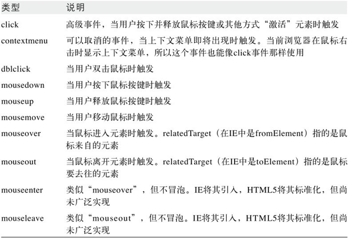

第17章 事件处理																						
* 客户端JavaScript程序采用了异步事件驱动编程模型（13.3.2节有介绍）。																						
在这种程序设计风格下，当文档、浏览器、元素或与之相关的对象发生某些有趣的事情时，Web浏览器就会产生事件（event）。																						
如果JavaScript应用程序关注特定类型的事件，那么它可以注册当这类事件发生时要调用的一个或多个函数。																						
* 请注意，这种风格并不只应用于Web编程，所有使用图形用户界面的应用程序都采用了它，它们静待某些事情发生（即，它们等待事件发生），然后它们响应。																						
																						
# 事件（event）
请注意，事件本身并不是一个需要定义的技术名词。																						
事件就是Web浏览器通知应用程序发生了什么事情。																						
事件不是JavaScript对象，不会出现在程序源代码中。																						
会有一些事件相关的对象出现在源代码中，它们需要技术说明																						
																						
# 事件类型（event type）是一个用来说明发生什么类型事件的字符串。																	
* 由于事件类型只是一个字符串，因此实际上有时会称之为事件名字（eventname），我们用这个名字来标识所谈论的特定类型的事件。																						
* 现代浏览器支持许多事件类型，17.1节会有一个概述。  
它没有介绍任何单个事件的详细信息，而是告诉大家Web应用中有哪些事件类型可以使用。  
这一节交叉引用了本书的其他部分内容，用于演示一些事件实战。	  																				
17.1 事件类型																						
## 17.1.1 传统事件类型
* 在Web初期，客户端程序员只能使用少部分事件，比如“<span class="event">load</span>”、“<span class="s1">click</span>”、“<span class="s2">mouseover</span>”等																					
这些传统事件类型在所有浏览器中都得到了很好的支持，																						
17.1.1节主要介绍这些内容。																						
处理鼠标、键盘、HTML表单和<span class="object">Window</span>对象的事件都是Web应用中最常用的，它们已经存在很长的时间并得到了广泛的支持。																						
### 1.表单事件
回到Web和JavaScript的早期，表单和超链接都是网页中最早支持脚本的元素。																						
这就意味着表单事件是所有事件类型中最稳定且得到良好支持的那部分。																						
	* <span class="s1">submit</span>和<span class="s1">reset</span>事件																					
		当提交表单和重置表单时，<form>元素会分别触发<span class="s1">submit</span>和<span class="s1">reset</span>事件。																				
		通过**事件处理程序**能取消<span class="s1">submit</span>和<span class="s1">reset</span>事件的默认操作，某些<span class="s1">click</span>事件也是如此。																				
	* <span class="s1">click</span>事件																					
		当用户和类按钮表单元素（包括单选按钮和复选框）交互时，它们会发生<span class="s1">click</span>事件。																				
		通过**事件处理程序**能取消<span class="s1">submit</span>和<span class="s1">reset</span>事件的默认操作，某些<span class="s1">click</span>事件也是如此。																				
	* <span class="s1">change</span>事件																					
		当用户通过输入文字、选择选项或选择复选框来改变相应表单元素的状态时，这些通常维护某种状态的表单元素会触发<span class="s1">change</span>事件。																				
		对于文本输入域，只有用户和表单元素完成交互并通过Tab键或单击的方式移动焦点到其他元素上时才会触发<span class="s1">change</span>事件。																				
	* <span class="s1">focus</span>和<span class="s1">blur</span>事件																					
		响应通过键盘改变焦点的表单元素在得到和失去焦点时会分别触发<span class="s1">focus</span>和<span class="s1">blur</span>事件。																				
		<span class="s1">focus</span>和<span class="s1">blur</span>事件不会**冒泡**，但其他所有表单事件都可以。																				
		<span class="s5">IE</span>定义了<span class="s1-1">focusin</span>和<span class="s1-1">focusout</span>事件可以**冒泡**，它们可以用于替代<span class="s1">focus</span>和<span class="s1">blur</span>事件。																				
		jQuery库（见第19章）为不支持<span class="s1-1">focusin</span>和<span class="s1-1">focusout</span>事件的浏览器模拟了这两个事件，同时3级DOM事件规范也正在标准化它们。																				
	* <span class="s1">input</span>事件																					
		最后注意，无论用户何时输入文字（通过键盘或剪切和粘贴）到`<textarea>`和其他文本输入表单元素，除<span class="s5">IE</span>外的浏览器都会触发<span class="s1">input</span>事件。																				
		不像<span class="s1">change</span>事件，每次文字插入都会触发<span class="s1">input</span>事件。																				
		遗憾的是，<span class="s1">input</span>事件的<span class="object">事件对象</span>没有指定输入文本的内容。																				
		稍后介绍的<span class="s1-1">textinput</span>事件将会成为这个事件的有用替代方案。																				
		15.9.3节涵盖了所有表单相关事件的详细信息。	


																						
### 2.<span class="object">Window</span>事件
<span class="object">Window</span>事件是指事件的发生与浏览器窗口本身而非窗口中显示的任何特定文档内容相关。																						
但是，这些事件中有一些会和文档元素上发生的事件同名。																						
* <span class="event">load</span>事件																					
	是这些事件中最重要的一个
	"<span class="event">load</span>"表示文档（或某个其他资源）从网络上加载完毕。																				
	当文档和其所有外部资源（比如图片）完全加载并显示给用户时就会触发它。																				
	有关<span class="event">load</span>事件的讨论贯穿整个第13章。																				
	<span class="event-1">DOMContentLoaded</span>和<span class="event-1">readystatechange</span>是<span class="event">load</span>事件的替代方案，当文档和其元素为操作准备就绪，但外部资源完全加载完毕之前，浏览器就会尽早触发它们。																				
	17.4节有这些与文件加载相关事件的示例。																				
	17.4 文档加载事件——文档加载和准备就绪事件																				
	* 现在已经介绍了JavaScript事件处理的基本原理，我们将开始深入探索具体事件类别，本节将从文档<span class="event">load</span>事件开始。																				
	* 大部分Web应用都需要Web浏览器通知它们文档加载完毕和为操作准备就绪的时间。																				
	<span class="object">Window</span>对象的<span class="event">load</span>事件就是为了这个目的，第13章详细地讨论过它，同时那章的示例13-5使用了onLoad（）工具函数。																				
	<span class="event">load</span>事件直到文档和所有图片加载完毕时才发生。																				
	然而，在文档完全解析之后但在所有图片全部加载完毕之前开始运行脚本通常是安全的，所以如果基于“<span class="event">load</span>”发生之前的事件触发脚本会提升Web应用的启动时间。																				
	* 当文档加载解析完毕且所有延迟（deferred）脚本都执行完毕时会触发<span class="event-1">DOMContentLoaded</span>事件，此时图片和异步（async）脚本可能依旧在加载，但是文档已经为操作准备就绪了。																				
	（13.3.1节介绍过延迟脚本和异步脚本。）																				
	Firefox引入了这个事件，然后它被包括Microsoft的<span class="s5">IE</span>9在内的所有其他浏览器厂商采用。																				
	尽管其名字中有“DOM”，并属于3级DOM事件标准的一部分，但HTML5标准化了它。																				
	* 正如13.3.4节所述，document.<span class="key">readyState</span>属性随着文档加载过程而变。																				
	在<span class="s5">IE</span>中，每次状态改变都伴随着<span class="object">Document</span>对象上的<span class="event-1">readystatechange</span>事件，当<span class="s5">IE</span>接收到“<span class="key-value">complete</span>”状态时使用这个事件来做判断是可行的。																				
	HTML5标准化了<span class="event-1">readystatechange</span>事件，但它仅在<span class="event">load</span>事件之前立即触发，所以目前尚不清楚监听“<span class="event-1">readystatechange</span>”取代“<span class="event">load</span>”会带来多大好处。																				
	* 例17-1定义了whenReady（）函数，它非常像示例13-5的onLoad（）函数。																				
	当文档为操作准备就绪时，传递给whenReady（）的函数将会作为<span class="object">Document</span>对象的方法调用。																				
	和之前的onLoad（）函数不同，whenReady（）监听<span class="event-1">DOMContentLoaded</span>和<span class="event-1">readystatechange</span>事件，而使用<span class="event">load</span>事件仅仅是为了兼容那些不支持之前事件的较老浏览器。																				
	接下来本节及后面章节的一些例子都使用whenReady（）函数。																				
		* 例17-1：当文档准备就绪时调用函数	
		    ```javascript
			/*																		
			 * 传递函数给whenReady()，当文档解析完毕且为操作准备就绪时，																		
			 * 函数将作为文档对象的方法调用																		
			 * DOMContentLoaded、readystatechange或load事件发生时会触发注册函数																		
			 * 一旦文档准备就绪，所有函数都将被调用，任何传递给whenReady()的函数都将立即调用																		
			 */																		
			var whenReady = (function(){    // 这个函数返回whenReady()函数																		
				var funcs = []; // 当获得事件时，要运行的函数																	
				var ready = false; // 当触发事件处理程序时，切换到true																	
				// 当文档准备就绪时，调用事件处理程序																	
				function handler(e){																	
					// 如果已经运行过一次，只需要返回																
					if(ready) return;																
																					
					// 如果发生<span class="event-1">readystatechange</span>事件，																
					// 但其状态不是“complete”的话，那么文档尚未准备好																
					if(e.type === "<span class="event-1">readystatechange</span>" && document.readyState !== "complete")  return;																
																					
					// 运行所有注册函数																
					// 注意每次都要计算funcs.length，																
					// 以防这些函数的调用可能会导致注册更多的函数																
					for(var i = 0; i < funcs.length; i++){																
						funcs[i].call(document);															
					}																
																					
					// 现在设置ready标识为true，并移除所有函数																
					ready = true;																
					funcs = null;																
				}																	
																					
				// 为接收到的任何事件注册处理程序																	
				if(document.addEventListener){																	
					document.addEventListener("DOMContentLoaded", handler, false);																
					document.addEventListener("<span class="event-1">readystatechange</span>", handler, false);																
					document.addEventListener("load", handler, false);																
				}																	
				else if(document.attachEvent){																	
					document.attachEvent("on<span class="event-1">readystatechange</span>", handler);																
					window.attachEvent("onload", handler);																
				}																	
				// 返回whenReady()函数																	
				return function whenReady(f){																	
					if(ready) f.call(documennt); // 若准备完结，只需要运行它																
					else funcs.push(f);  // 否则，加入队列等候																
				}																	
			}());			
            ```	


* <span class="event">unload</span>事件																					
	和<span class="event">load</span>相对，当用户离开当前文档转向其他文档时会触发它。																				
	<span class="event">unload</span>**事件处理程序**可以用于保存用户的状态，但它不能用于取消用户转向其他地方。																				
* <span class="event">beforeunload</span>事件和<span class="event">unload</span>类似，但它能提供询问用户是否确定离开当前页面的机会。																				
	如果<span class="event">beforeunload</span>的处理程序返回字符串，那么在新页面加载之前，字符串会出现在展示给用户确认的对话框上，这样用户将有机会取消其跳转而留在当前页上。		


* <span class="object">Window</span>对象的on<span class="event">error</span>属性																					
	有点像**事件处理程序**，当JavaScript出错时会触发它。																				
	但是，它不是真正的**事件处理程序**，因为它能用不同的参数来调用。																				
	更多详细信息请看14.6节。																				
	* 像``元素这样的单个文档元素也能为<span class="event">load</span>和<span class="event">error</span>事件注册处理程序。																				
	当外部资源（例如图片）完全加载或发生阻止加载的错误时就会触发它们。		


* 某些浏览器也支持<span class="event">abort</span>事件																					
	（HTML5将其标准化），当图片（或其他网络资源）因为用户停止加载进程而导致失败就会触发它。																				
* 前面介绍的表单元素的<span class="s1">focus</span>和<span class="s1">blur</span>事件																					
	也能用做<span class="object">Window</span>事件，当浏览器窗口从操作系统中得到或失去键盘焦点时会触发它们。																				
* 最后，当用户调整浏览器窗口大小或滚动它时会触发<span class="event">resize</span>和<span class="event">scroll</span>事件。																					
	<span class="event">scroll</span>事件也能在任何可以滚动的文档元素上触发，比如那些设置CSS的overflow属性（见16.2.6节）的元素。																				
	传递给<span class="event">resize</span>和<span class="event">scroll</span>**事件处理程序**的<span class="object">事件对象</span>是一个非常普通的<span class="object">Event</span>对象，它没有指定调整大小或发生滚动的详细信息属性，但可以通过15.8节介绍的技术来确定新窗口的尺寸和滚动条的位置。																				
																						
### 3.<span class="s2">鼠标事件</span>
* 当用户在文档上移动或单击鼠标时都会产生<span class="s2">鼠标事件</span>。																						
这些事件在鼠标指针所对应的最深嵌套元素上触发，但它们会**冒泡**直到文档最顶层。																						
																				
    * 用户每次移动或拖动鼠标时，会触发<span class="s2">mousemove</span>事件。
    "<span class="s2">mousemove</span>"表示用户移动鼠标																						
        这些事件的发生非常频繁，所以<span class="s2">mousemove</span>**事件处理程序**一定不能触发计算密集型任务。																					
    * 当用户按下或释放鼠标按键时，会触发<span class="s2">mousedown</span>和<span class="s2">mouseup</span>事件。																						
        通过注册<span class="s2">mousedown</span>和<span class="s2">mousemove</span>**事件处理程序**，可以探测和响应鼠标的拖动。																					
        合理地这样做能够**捕获**<span class="s2">鼠标事件</span>，甚至当鼠标从开始元素移出时我们都能持续地接受到<span class="s2">mousemove</span>事件。																					
        17.5节包含一个处理拖动的示例。  
        17.5 <span class="s2">鼠标事件</span>
        * 与鼠标相关的事件有不少，表17-1全部把它们列出了。
        
        除“<span class="s2-1">mouseenter</span>”和“<span class="s2-1">mouseleave</span>”外的所有<span class="s2">鼠标事件</span>都能**冒泡**。																					
        链接和提交按钮上的<span class="s1">click</span>事件都有默认操作且能够阻止。																					
        可以取消上下文菜单事件来阻止显示上下文菜单，但一些浏览器有配置选项导致不能取消上下文菜单。
    * 某些浏览器只在单击左键时才触发<span class="s1">click</span>事件，所以如果需要探测其他键的单击需要监听<span class="s2">mousedown</span>和<span class="s2">mouseup</span>事件。																				
    * 通常<span class="s2">contextmenu</span>事件发生的标志是右击，但如上所述，当事件发生时可能无法阻止上下文菜单的显示。	
* 鼠标<span class="object">事件对象</span>的属性
    * 传递给鼠标**事件处理程序**的<span class="object">事件对象</span>有<span class="key">clientX</span>和<span class="key">clientY</span>属性，																				
    它们指定了鼠标指针相对于包含窗口的坐标。  
    加入窗口的滚动偏移量（见示例15-8）就可以把鼠标位置转换成文档坐标。																				
    * <span class="key">altKey</span>、<span class="key">ctrlKey</span>、<span class="key">metaKey</span>和<span class="key">shiftKey</span>属性指定了当事件发生时是否有各种键盘辅助键按下。																				
    例如，这让你能够区分普通单击和按着Shift键的单击。																				
    button属性指定当事件发生时哪个鼠标按键按下，但是，不同浏览器给这个属性赋不同的值，所以它很难用，更多详细信息请看<span class="object">Event</span>参考页。																				
    																			
    * 鼠标<span class="object">事件对象</span>有一些其他的鼠标特定属性，但它们并不常用，具体请看<span class="object">Event</span>参考页的列表。																				

* 例17-2展示了JavaScript函数drag（），它会在<span class="s2">mousedown</span>**事件处理程序**中调用，其允许用户拖放绝对定位的文档元素。																				
    drag（）能够在DOM和<span class="s5"><span class="s5">IE</span>事件模型</span>中运行。																				
    drag（）接受两个参数。																				
    * 第一个是要拖动的元素，																			
    它可以是发生<span class="s2">mousedown</span>事件的元素或包含元素（例如，你可能允许用户拖动的元素看起来像标题栏，而拖动的包含元素像窗口）。然而，无论是哪种情况，它必须是使用CSS position属性绝对定位的文档元素。																			
    * 第二个参数是触发<span class="s2">mousedown</span>事件的<span class="object">事件对象</span>。																			
    下面是一个使用drag（）的简单例子，它定义了用户在按下Shift键时能够拖动的``：																			
    ```	
        ```																	
    * drag（）函数把<span class="s2">mousedown</span>事件发生的位置转换为文档坐标，这是为了计算鼠标指针到正在移动的元素左上角之间的距离。																				
    示例15-8使用getScrollOffsets（）帮助坐标转换。然后，drag（）注册了接着<span class="s2">mousedown</span>事件发生的<span class="s2">mousemove</span>和<span class="s2">mouseup</span>事件的**事件处理程序**。<span class="s2">mousemove</span>**事件处理程序**用于响应文档元素的移动，而<span class="s2">mouseup</span>**事件处理程序**用于注销自己和<span class="s2">mousemove</span>**事件处理程序**。																				
    * 值得注意的是<span class="s2">mousemove</span>和<span class="s2">mouseup</span>处理程序注册为**捕获** **事件处理程序**。这是因为用户可能移动鼠标比其后的文档元素更快，如果这种情况发生，某些<span class="s2">mousemove</span>事件会发生在原始<span class="s8">目标</span>元素之外。没有**捕获**，这些事件将无法分派正确的处理程序。<span class="s5">IE事件模型</span>无法像<span class="s6">标准事件模型</span>那样提供事件**捕获**，但它在这种情况下有一个专门用于**捕获**<span class="s2">鼠标事件</span>的<span class="method">setCapture（）</span>方法。下面的示例代码会展示它是如何工作的。																				
    * 最后，注意drag（）中定义的moveHandler（）和upHandler（）函数。由于在嵌套的作用域中定义它们，因此它们能使用drag（）的参数和本地变量，这将大大简化它们的实现。																				
    * 例17-2：拖动文档元素	
        
```javascript																			
/** 																				
 * Drag.js: 拖动绝对定位的HTML元素																				
 *																				
 * 这个模块定义了一个drag()函数，它用于mousedown事件处理程序的调用																				
 * 随后的mousemove事件将移动指定元素，mouseup事件将终止拖动																				
 * 这些实现能同标准和IE两种事件模型一起工作																				
 * 它需要用到本书其他地方介绍的getScrollOffsets()方法																				
 * 																				
 * 参数：																				
 *																				
 * elementToDrag：接收mousedown事件的元素或某些包含元素																				
 * 它必须是绝对定位的元素																				
 * 它的style.left和style.top值将随着用户的拖动而改变																				
 *																				
 * event：mousedown事件对象																				
 **/																				
function drag(elementToDrag, event){																				
    // 初始鼠标位置，转换为文档坐标																			
    var scroll = getScrollOffsets(); // 来自其他地方的工具函数																			
    var startX = event.clientX + scroll.x;																			
    var startY = event.clientY + scroll.y;																			
                                                                                
    // 在文档坐标下，待拖动元素的初始位置																			
    // 因为elementToDrag是绝对定位的																			
    // 所以我们可以假设它的offsetParent就是文档的body元素																			
    var origX = elementToDrag.offsetLeft;																			
    var origY = elementToDrag.offsetTop;																			
                                                                                
    // 计算mousedown事件和元素左上角之间的距离																			
    // 我们将它另存为鼠标移动的距离																			
    var deltaX = startX - origX;																			
    var deltaY = startY - origY;																			
                                                                                
    // 注册用于响应接着mousedown事件发生的mousemove和mouseup事件的事件处理程序																			
    if(document.addEventListener){  // 标准事件模型																			
        // 在document.对象上注册捕获事件处理程序																		
        document.addEventListener("mousemove", moveHandler, true);																		
        document.addEventListener("mouseup", upHandler, true);																		
    }																			
    else if(document.attachEvent){  // 用于IE5~8的IE事件模型																			
        // 在IE事件模型中，																		
        // 捕获事件是通过调用元素上的setCapture()捕获它们																		
        elementToDrag.setCapture();																		
        elementToDrag.attachEvent("onmousemove", moveHandler);																		
        elementToDrag.attachEvent("onmouseup", upHandler);																		
        // 作为mouseup事件看待鼠标捕获的丢失																		
        elementToDrag.attachEvent("onlosecapture", upHandler);																		
    }																			
    // 我们处理了这个事件，不让任何其他元素看到它																			
    if(event.stopPropagation) event.stopPropagation(); // 标准模型																			
    else event.cancelBubble = true; // IE																			
                                                                                
    // 现在阻止任何默认操作																			
    if(event.preventDefault) event.preventDefault();  // 标准模型																			
    else event.returnValue = false; // IE																			
                                                                                
                                                                                
    /** 																			
     * 当元素正在被拖动时，这就是捕获mousemove事件的处理程序																			
     * 它用于移动这个元素																			
     **/																			
    function moveHandler(e){																			
        if(!e) e = window.event: // IE事件模型																		
                                                                                
        // 移动这个歹毒到当前鼠标位置，																		
        // 通过滚动条的位置和初始单击的偏移量来调整																		
        var scroll = getScrollOffsets();																		
        elementToDrag.style.left = (e.clientX + scroll.x - deltaX) + "px";																		
        elementToDrag.style.top = (e.clientY + scroll.y - deltaY) + "px";																		
                                                                                
        // 同时不让任何其他元素看到这个事件																		
        if(e.stopPropagation) e.stopPropagation(); // 标准																		
        else e.cancelBubble = true; // IE																				
    }																			
                                                                                
    /**																			
     * 这是捕获在拖动结束时发生的最终mouseup事件的处理程序																			
     **/																			
    function upHandler(e){																			
        if(!e) e = window.event; // IE事件模型																		
        // 注销捕获事件处理程序																		
        if(document.removeEventListener) { // DOM事件模型																		
            document.removeEventListener("mouseup", upHandler, true);																	
            document.removeEventListener("mousemove", moveHandler, true);																	
        } else if(document.detachEvent){ // IE5 + 事件模型																		
            elementToDrag.detachEvent("onlosecapture", upHandler);																	
            elementToDrag.detachEvent("onmousemove", moveHandler);																	
            elementToDrag.releaseCapture();																	
        }																		
        // 并且不让事件进一步传播																		
        if(e.stopPropagation) e.stopPropagation();  // 标准模型																		
        else e.cancelBubble = ture;  // IE
    }																			
}		
```	
        
下面的代码展示了在HTML文件中如何使用drag（）（它是示例16-2带拖动功能的简化版）：		
```html																		
<script src="getScrollOffsets.js"></script> <!-- drag()需要这个-->																				
<script src="Drag.js"></script>  <!-- 定义drag() -->																				
<!-- 要拖动的元素  -->																				
<div style="position:absolute; left:100px; top:100px; width:250px;background-color:white;border:solid black;">																				
<!-- 通过“标题栏”拖动整个元素，注意onmousedown属性-->																				
<div style="background-color:gray; border-bottom:dotted black; padding:3px; font-family: sans-serif; font-weight: bold;"																				
    onmousedown="drag(this.parentNode, event);">																			
    拖动我<!--标题栏的内容--》																			
</div>																				
    <!-- 可拖动元素的内容-->																			
    <p>这是一个测试。测试中，测试中，测试中，</p><p>测试</p>																			
    <p>测试</p>																			
</div>		
```																		
* 这里的关键是内部`<div>`元素的on<span class="s2">mousedown</span>属性。注意，它使用this.parentNode指定整个容器元素将被拖动。																				
                                                                                                    
* 在<span class="s2">mousedown</span>和<span class="s2">mouseup</span>事件队列之后，浏览器也会触发<span class="s1">click</span>事件。																						
之前介绍过<span class="s1">click</span>事件是独立于设备的表单事件，																						
但实际上它不仅仅在表单元素上触发，																				
它可以在任何文档元素上触发，																				
同时传递拥有之前介绍的所有鼠标相关额外字段的<span class="object">事件对象</span>。																				
* 如果用户在相当短的时间内连续两次单击鼠标按键，跟在第二个<span class="s1">click</span>事件之后是<span class="s2">dblclick</span>事件。																						
* 在显示菜单之前，它们通常会触发<span class="s2">contextmenu</span>事件，																						
    当单击鼠标右键时，浏览器通常会显示上下文菜单（context menu）。																					
    而取消这个事件就可以阻止菜单的显示。																					
    这个事件也是获得鼠标右击通知的简单方法。																					
* 当用户移动鼠标指针从而使它悬停到新元素上时，浏览器就会在该元素上触发<span class="s2">mouseover</span>事件。																						
* 当鼠标移动指针从而使它不再悬停在某个元素上时，浏览器就会在该元素上触发<span class="s2">mouseout</span>事件。																						
    对于这些事件，<span class="object">事件对象</span>将有<span class="key">relatedTarget</span>属性指明这个过程涉及的其他元素。																					
    到<span class="object">Event</span>参考页查看<span class="key">relatedTarget</span>属性的<span class="s5">IE</span>等效属性。																					
* <span class="s2">mouseover</span>和<span class="s2">mouseout</span>事件和这里介绍的所有<span class="s2">鼠标事件</span>一样会**冒泡**。																					
    但这通常不方便，因为当触发<span class="s2">mouseout</span>**事件处理程序**时，你不得不检查鼠标是否真的离开<span class="s8">目标</span>元素还是仅仅是从这个元素的一个子元素移动到另一个。																					
    正因为如此，<span class="s5">IE</span>提供了这些事件的不**冒泡**版本<span class="s2-1">mouseenter</span>和<span class="s2-1">mouseleave</span>。																					
    JQuery模拟非<span class="s5">IE</span>的浏览器中这些事件的支持（见第19章），同时3级DOM事件规范把它们标准化了。																					
* 当用户滚动鼠标滚轮时，浏览器触发<span class="s2">mousewheel</span>事件（或在Firefox中是<span class="s2">DOMMouseScroll</span>事件）。																						
    传递的<span class="object">事件对象</span>属性指定滚轮转动的大小和方向。																					
    3级DOM事件规范正在标准化一个更通用的多维<span class="s2-1">wheel</span>事件，一旦实现将取代<span class="s2">mousewheel</span>和<span class="s2">DOMMouseScroll</span>事件。																					
    17.6节包含一个<span class="s2">mousewheel</span>事件示例。	
    17.6 鼠标滚轮事件
    * 所有的现代浏览器都支持鼠标滚轮，并在用户滚动滚轮时触发事件。浏览器通常使用鼠标滚轮滚动或缩放文档，但可以通过取消<span class="s2">mousewheel</span>事件来阻止这些默认操作。																						
    * 有一些互用性问题影响滚轮事件，但编写跨平台的代码依旧可行。在写本章时，除Firefox之外的所有浏览器都支持“<span class="s2">mousewheel</span>”事件，但Firefox使用“<span class="s2">DOMMouseScroll</span>”，而3级DOM事件规范草案建议使用事件名“<span class="s2-1">wheel</span>”替代“<span class="s2">mousewheel</span>”。除了事件名的不同，向各种事件传递的<span class="object">事件对象</span>也使用了不同的属性名来指定滚轮发生的旋转量。最后注意，基础硬件也会导致鼠标滚轮之间的区别。某些硬件允许向前向后的一维滚动，而另一些（尤其是在Mac上）也允许向左向右滚动（在这些鼠标上，“滚轮”其实是轨迹球）。3级DOM规范草案甚至包括支持三维鼠标“滚轮”，除了上下左右，它还能报告顺时针或逆时针旋转。																						
    * 传递给“<span class="s2">mousewheel</span>”**处理程序**的<span class="object">事件对象</span>有wheelDelta属性，其指定用户滚动滚轮有多远。远离用户方向的一次鼠标滚轮“单击”的wheelDelta值通常是120，而接近用户方向的一次“单击”的值是-120[插图]。在Safari和Chrome中，为了支持使用二维轨迹球而非一维滚轮的Apple鼠标，除了wheelDelta属性外，<span class="object">事件对象</span>还有wheelDeltaX和wheelDeltaY，而wheelDelta和wheelDeltaY的值一直相同。																						
        * 这里的“单击”指的是滚动滚轮的最小单位，所以我们得到的wheelDelta值都是120的整数倍，正负值表示滚轮的两个方向，其最小值皆为120.																					
    * 在Firefox中，可以使用非标准的<span class="s2">DOMMouseScroll</span>事件取代<span class="s2">mousewheel</span>，使用<span class="object">事件对象</span>的detail属性取代wheelDelta。但是，detail属性值的缩放比率和正负符号不同于wheelDelta，detail值乘以-40和wheelDelta值相等。																						
    * 在写本章时，3级DOM事件规范草案标准定义了<span class="s2-1">wheel</span>事件作为<span class="s2">mousewheel</span>和<span class="s2">DOMMouseScroll</span>的标准版本。传递给<span class="s2-1">wheel</span>**事件处理程序**的<span class="object">事件对象</span>将有deltaX、<span class="key">deltaY</span>和<span class="key">deltaZ</span>属性，以指定三个维度的旋转。这些值必须乘以-120才和<span class="s2">mousewheel</span>事件的wheelDelta值和正负符号相匹配。																						
    * 对于所有这些事件类型来说，其<span class="object">事件对象</span>就像鼠标<span class="object">事件对象</span>：它包括鼠标指针的坐标和键盘辅助键的状态。																						
    * 例17-3演示了如何使用鼠标滚轮事件和如何实现跨平台的互用性。它定义了enclose（）函数在一个较大的内容元素（比如图片）周围包装了一个指定尺寸的“窗体”或“视口”，并定义了鼠标滚轮**事件处理程序**让用户既能在视口内移动内容元素也能调整视口大小。可以像下面这样在代码中使用enclose（）函数：																						
        codecodecode																					
                                                                                            
    * 为了能够在所有常用浏览器中正确地工作，例17-3必须执行一些浏览器测试（参见13.4.5节）。这个示例提前使用了3级DOM事件规范草案，包括在代码中使用了<span class="s2-1">wheel</span>事件，当浏览器实现它时即可使用[插图]。它也包含未来的一些证明，当Firefox开始支持<span class="s2-1">wheel</span>或<span class="s2">mousewheel</span>事件时就停止使用<span class="s2">DOMMouseScroll</span>。注意，例17-3也是演示元素几何形状和CSS定位技术的示例，这些技术会在15.8节和16.2.1节中说明。																						
        codecodecode																					

* 传递给鼠标**事件处理程序**的<span class="object">事件对象</span>有属性集，																						
    * 它们描述了当事件发生时鼠标的位置和按键状态，																					
        * <span class="key">clientX</span>和<span class="key">clientY</span>属性指定了鼠标在窗口坐标中的位置，																				
        * button和which属性指定了按下的鼠标键是哪个。																				
        * 无论如何请看<span class="object">Event</span>参考页，因为这些属性难以简单使用。																				
    * 也指明当时是否有任何辅助键按下。																					
        * 当键盘辅助键按下时，对应的属性<span class="key">altkey</span>、<span class="key">ctrlKey</span>、<span class="key">metaKey</span>和<span class="key">shiftKey</span>会设置为true。																				
        * 而对于<span class="s1">click</span>事件，detail属性指定了其是单击、双击还是三击。																				
																		
																						
																						
																						
																						
																						
																						
																						
																						
																						
																						
																						
																						
																						
																						
																						
																						
																						
																						
																						
																						
																						
																						
																						
### 4.键盘事件
* 当键盘聚焦到Web浏览器时，用户每次按下或释放键盘上的按键时都会产生事件。																					
键盘快捷键对于操作系统和浏览器本身有特殊意义，它们经常被操作系统或浏览器“吃掉”并对JavaScript**事件处理程序**不可见。																					
无论任何文档元素获取键盘焦点都会触发键盘事件，并且它们会**冒泡**到<span class="object">Document</span>和<span class="object">Window</span>对象。																					
如果没有元素获得焦点，可以直接在文档上触发事件。																					
* 传递给键盘**事件处理程序**的<span class="object">事件对象</span>有																					
	keyCode字段，它指定按下或释放的键是哪个。																				
	除了keyCode，键盘<span class="object">事件对象</span>也有<span class="key">altKey</span>、<span class="key">ctrlKey</span>、<span class="key">metaKey</span>和<span class="key">shiftKey</span>，描述键盘辅助键的状态。																				
* <span class="s3-1">keydown</span>和<span class="s3-1">keyup</span>事件																					
	是低级键盘事件，无论何时按下或释放按键（甚至是辅助键）都会触发它们。	
	"<span class="s3-1">keydown</span>”表示键盘上某个键被按下																		
* 当<span class="s3-1">keydown</span>事件产生可打印字符时，在<span class="s3-1">keydown</span>和<span class="s3-1">keyup</span>之间会触发另外一个<span class="s3-1">keypress</span>事件。																					
	当按下键重复产生字符时，在<span class="s3-1">keyup</span>事件之前可能产生很多<span class="s3-1">keypress</span>事件。																				
	<span class="s3-1">keypress</span>是较高级的文本事件，其<span class="object">事件对象</span>指定产生的字符而非按下的键。																				
* 所有浏览器都支持<span class="s3-1">keydown</span>、<span class="s3-1">keyup</span>和<span class="s3-1">keypress</span>事件，但有一些互用性问题，																					
	因为<span class="object">事件对象</span>的keyCode属性值从未标准化过。																				
	3级DOM事件规范尝试解决之前的互用性问题，但尚未实施。																				
	17.9节包含处理<span class="s3-1">keydown</span>事件的示例，17.8节包含处理<span class="s3-1">keypress</span>事件的示例。																				
	* 17.9 键盘事件 																				
		* 当用户在键盘上按下或释放按键时，会发生<span class="s3-1">keydown</span>和<span class="s3-1">keyup</span>事件。它们由辅助键、功能键和字母数字键产生[插图]如果用户按键时间足够长会导致它开始重复，那么在<span class="s3-1">keyup</span>事件到达之前会收到多个<span class="s3-1">keydown</span>事件。																			
			* 辅助键（modifier key）一般是指Shift键、Ctrl（control）键、Alt键、AltGr(Alternate Graphic）键、Super键（Window键盘上指Window键，Mac OS键盘指的是Command键，Sun键盘指的是Meta键）和Fn键（Funciton，常见于笔记本键盘），更多细节请看`http://en.wikipedia.org/wiki/Computer_keyboard`。功能键（function key）一般是指类似F1、F2这些以F加数字组成的键，更多细节请看`http://en.wikipedia.org/wiki/Function_Keys`。																		
		* 类似鼠标<span class="object">事件对象</span>，键盘<span class="object">事件对象</span>有<span class="key">altKey</span>、<span class="key">ctrlKey</span>、<span class="key">metaKey</span>和<span class="key">shiftKey</span>属性，当事件发生时，如果对应的辅助键被按下，那么它们会被设置为true。																			
		* <span class="s3-1">keydown</span>和<span class="s3-1">keyup</span>事件及keyCode属性已经使用了十多年，但从未标准化。3级DOM事件规范草案标准化了<span class="s3-1">keydown</span>和<span class="s3-1">keyup</span>事件类型，但没有尝试标准化keyCode。相反，																			
		* 它定义了新属性key，它会以字符串的形式包含键名。如果按键对应的是一个可打印字符，那么key属性将仅仅是这个可打印字符。如果按键是功能键，那么key属性将是像“F2”、“Home”或“Left”这样的值。																			
		* 在写本章时，3级DOM事件的key属性尚未在任何浏览器中实现。但是，像Safari和Chrome这类基于Webkit的浏览器为这些事件的<span class="object">事件对象</span>定义了一个keyIdentifier属性。类似key，keyIdentifier是字符串而非数字，并且对于功能键，它是像“Shift”、“Enter”这样有用的值。对于可打印字符，该属性保存了这个字符的Unicode编码的字符串表示形式，其用处要小一些。例如，对于A键，它是“U+0041”。																			
		* 例17-8定义了一个Keymap类，把像“PageUp”、“Alt_Z”和“ctrl+alt+shift+F5”这些按键标识符映射到JavaScript函数，这些函数会作为按键的响应而调用。以JavaScript对象的形式把按键的绑定传给Keymap（）构造函数，在对象中属性名是按键标识符，而属性值是**处理程序**函数。使用bind（）和unbind（）方法添加和移除绑定。使用install（）方法在HTML元素（通常是<span class="object">Document</span>对象）上配置Keymap。通过在元素上注册<span class="s3-1">keydown</span>**事件处理程序**配置Keymap。每次键被按下，**处理程序**检查是否有与按键相关的函数。如果有，就调用它。在<span class="s3-1">keydown</span>**事件处理程序**中如果能定义3级DOM事件的key属性就会优先使用它。如果没有，它会查找Webkit的keyIdentifier属性然后使用它。否则，它退回使用不标准的keyCode属性。例17-8开头有段很长的注释来解释这个模块的更多详细信息。																			
		* 例17-8：键盘快捷键的Keymap类																			
		codecodecode																			
																					
																					
																						
## 在写本章时，浏览器所支持的事件数量正在快速地增长，这些新事件有3个来源：
随着Web平台发展到包括更强大的API，事件集合随之越来越大，没有单个标准能定义完整的事件集合。																						
### 1. 17.1.2 DOM事件
* 3级DOM事件（DOM Level 3 Events）规范，经过长期的停滞之后，在W3C的主持下又开始焕发生机。																					
17.1.2节介绍DOM事件。																					
* W3C开发3级DOM事件规范已经长达十年之久。																					
	在写本章时，它已经做了大量修订使其适合当前浏览器的现状，现在终于处于标准化的“最后征集工作草案”（last callworking draft）阶段。																				
	它标准化了前面介绍的许多传统事件，同时增加了这里介绍的一些新事件。																				
	这些新事件类型尚未得到广泛支持，一旦标准确定，我们就期望浏览器厂商能实现它们。																				
* 3级DOM事件规范																					
	* 标准化了不**冒泡**的<span class="s1-1">focusin</span>和<span class="s1-1">focusout</span>事件来取代**冒泡**的<span class="s1">focus</span>和<span class="s1">blur</span>事件，																				
	* 标准化了**冒泡**的<span class="s2-1">mouseenter</span>和<span class="s2-1">mouseleave</span>事件来取代不**冒泡**的<span class="s2">mouseover</span>和<span class="s2">mouseout</span>事件。																				
	* 此版本的标准也弃用了大量由2级DOM事件规范定义但未得到广泛实现的事件类型。																				
	* 浏览器依旧允许产生像DOMActivate、DOMFocusIn和DOMNodeInserted这样的事件，但它们不再必要，同时本书的文档也不会列出它们																				
		在名字中使用“DOM"的唯一常用事件就是<span class="event-1">DOMContentLoaded</span>。																			
		这个事件由Mozilla引入，但绝不属于DOM事件标准的一部分。																			
* 3级DOM事件规范中新增内容有																					
	* 通过<span class="s2-1">wheel</span>事件对二维鼠标滚轮提供标准支持																				
		<span class="s2-1">wheel</span>事件的**处理程序**接收到的<span class="object">事件对象</span>除了所有普通<span class="s2">鼠标事件</span>属性，																			
		还有<span class="key">deltaX</span>、<span class="key">deltaY</span>和deltaZ属性来报告三个不同的鼠标滚轴。																			
		大多数鼠标滚轮是一维或两维的，并不使用deltaZ。																			
		更多关于<span class="s2">mousewheel</span>事件的内容请参见17.6节。																			
	* 通过<span class="s1-1">textinput</span>事件和传递新<span class="object">KeyboardEvent</span>对象作为参数给<span class="s3-1">keydown</span>、<span class="s3-1">keyup</span>和<span class="s3-1">keypress</span>的**事件处理程序**来给文本输入事件提供更好的支持。																				
	* 如上所述，3级DOM事件规范定义了<span class="s3-1">keypress</span>事件，但不赞成使用它而使用称为<span class="s1-1">textinput</span>的新事件。																				
		传递给<span class="s1-1">textinput</span>**事件处理程序**的<span class="object">事件对象</span>不再有难以使用的数字keyCode属性值，而有指定输入文本字符串的data属性。																			
		<span class="s1-1">textinput</span>事件不是键盘特定事件，无论通过键盘、剪切和粘贴、拖放等方式，每当发生文本输入时就会触发它。																			
		规范定义了<span class="object">事件对象</span>的<span class="key">inputMethod</span>属性和一组代表各种文本输入种类的常量（键盘、粘贴、拖放、手写和语音识别等）。																			
		在写本章时，Safari和Chrome使用混合大小写的textInput来支持这个事件版本，其<span class="object">事件对象</span>有data属性但没有inputMethed属性。																			
		17.8节包含使用textInput事件的示例。																			
		* 17.8 文本事件——文本输入事件																			
			* 浏览器有3个传统的键盘输入事件。
                * <span class="s3-1">keydown</span>事件和<span class="s3-1">keyup</span>事件是低级事件，下一节会介绍。
                不过，<span class="s3-1">keypress</span>事件是较高级的事件，它表示产生了一个可打印字符。
                * 3级DOM事件规范草案定义一个更通用的<span class="s1-1">textinput</span>事件，不管来源（例如：键盘、粘贴或拖放形式的数据传输、亚洲语言输入法、声音或手写识别系统），无论何时用户输入文本时都会触发它。在写本章时，<span class="s1-1">textinput</span>事件尚未得到支持，但Webkit浏览器支持一个非常类似的“textInput”（使用大写字母I）事件。																		
			* 建议中的<span class="s1-1">textinput</span>事件和已经实现的textInput事件都传递一个简单的<span class="object">事件对象</span>，它有一个用于保存输入文本的<span class="key">data</span>属性。（另一个属性<span class="key">inputMethod</span>是建议用于指定输入源，但它尚未实现。）对于键盘输入，<span class="key">data</span>属性通常只保存单个字符，但其他输入源通常可能包含多个字符。																		
			* 通过<span class="s3-1">keypress</span>事件传递的对象更加混乱。一个<span class="s3-1">keypress</span>事件表示输入的单个字符。<span class="object">事件对象</span>以数字Unicode编码的形式指定字符，所以必须用String.fromCharCode（）把它转换成字符串。在大多数浏览器中，<span class="object">事件对象</span>的keyCode属性指定了输入字符的编码。但是由于历史的原因，Firefox使用的是charCode属性。大多数浏览器只在当产生可打印字符时触发<span class="s3-1">keypress</span>事件。但是Firefox在产生非打印字符时也触发<span class="s3-1">keypress</span>事件。为了检测这种情况（这样就能忽略非打印字符），可以查找有charCode属性但值为0的<span class="object">事件对象</span>。																		
			* 可以通过取消<span class="s1-1">textinput</span>、textInput和<span class="s3-1">keypress</span>事件来阻止字符输入，这意味着可以使用这些事件来过滤输入。  
            例如，你可能想阻止用户在只接受数字数据的域中输入字母。  
            例17-6是一段不唐突的JavaScript代码模块，它恰好实现了这种过滤。它查找有额外属性（非标准）data-allowed-chars的`<input type=text>`元素。  
            这个模块在这类文本输入域上注册了<span class="s1-1">textinput</span>、textInput和<span class="s3-1">keypress</span>事件的**处理程序**来限制用户只能输入出现在许可属性值中的字符。  
            例17-6顶部注释的开头部分包含使用这个模块的一些HTML代码示例。																		
			* 例17-6：过滤用户输入																		
			codecodecode																		
			* <span class="s3-1">keypress</span>和<span class="s1-1">textinput</span>事件是在新输入的文本真正插入到聚焦的文档元素前触发，这就是这些**事件处理程序**能够取消事件和阻止文本插入的原因。  
            浏览器也实现了在文本插入到元素后才触发的input事件类型input。  
            虽然这些事件不能取消，不能指定其<span class="object">事件对象</span>中的最新文本，但它们能以某种形式提供元素文本内容发生改变的通知。  
            例如，如果想确保输入框中输入的任何文本都是大写，那么可以像如下这样使用input事件：																		
			```html
			姓氏：<input type="text" oninput="this.value = this.value.toUpperCase();">		
			```																
			* HTML5标准化了<span class="s1">input</span>事件，除<span class="s5">IE</span>外的所有浏览器都支持它。  
            在<span class="s5">IE</span>中，可以使用不标准的<span class="s1">propertychange</span>事件检测文本输入元素的value属性改变来实现相似的效果。例17-7展示可以用一种跨平台的方式强制所有输入都大写。																		
			* 例17-7：使用<span class="s1">propertychange</span>事件探测文本输入																		
			codecodecode																		
																					
																					
* 新DOM标准通过在<span class="object">事件对象</span>中加入新的<span class="key">key</span>和<span class="key">char</span>属性来简化<span class="s3-1">keydown</span>、<span class="s3-1">keyup</span>和<span class="s3-1">keypress</span>事件，这些属性都是字符串。																					
	* 对于产生可打印字符的键盘事件，<span class="key">key</span>和<span class="key">char</span>值将等于生成的文本。																				
	* 对于控制键，<span class="key">key</span>属性将会是像标识键的“Enter”、“Delete”和“Left”这样的字符串，而<span class="key">char</span>属性将是null，或对于像Tab这样的控制键有一个字符编码，它将是按键产生的字符串。																				
	在写本章时，尚未有浏览器支持<span class="key">key</span>和<span class="key">char</span>属性，但如果<span class="key">key</span>属性实现了，例17-8将使用它。																				
																					
																						
### 2. 17.1.3 HTML5事件
* HTML5规范及相关衍生规范的大量新API定义了新事件，比如																					
	* 历史管理																				
	* 拖放																				
	* 跨文档通信																				
	* 视频和音频的播放																				
	17.1.3节会概述这些事件。																				
* HTML5及相关标准定义了大量新的Web应用API（见第22章），其中许多API都定义了事件。																					
* 本节列出并简要介绍这些HTML5和Web应用事件。																					
其中一些事件现在已经可以开始使用，但更详细的信息在本书的其他地方，																					
另外一些尚未得到广泛实现，也没有详细文档。	
																				
#### 广泛推广的HTML5特性之一是加入用于播放音频和视频的`<audio>`和`<video>`元素
这些元素有长长的事件列表，它们触发各种关于网络事件、数据缓冲状况和播放状态的通知：																						
* canplay																					
* loadeddata																					
* playing																					
* stalled																					
* canplaythrough																					
* loadedmetadata																					
* <span class="event">progress</span>																					
* suspend																					
* durationchange																					
* <span class="event">loadstart</span>																					
* ratechange																					
* timeupdate																					
* emptied																					
* pause																					
* seeked																					
* volumechange																					
* ended																					
* play																					
* seeking																					
* waiting																					
* 传递给媒体**事件处理程序**的<span class="object">事件对象</span>普通且没有特殊属性，																						
	target属性用于识别<audio>和<video>元素																					
		然而这些元素有许多相关的属性和方法。																				
21.2节有更多关于这些元素及其属性和事件的详细内容。																						
																						
#### HTML5的拖放API
允许JavaScript应用参与基于操作系统的拖放操作，实现Web和原生应用间的数据传输
* 该API定义了如下7个事件类型：																						
	* <span class="event-1">dragstart</span>																					
	* drag																					
	* <span class="event-1">dragend</span>																					
	* <span class="event-1">dragenter</span>																					
	* dragover																					
	* dragleave																					
	* drop																					
	触发<span class="event-1">拖放事件</span>的<span class="object">事件对象</span>和通过<span class="s2">鼠标事件</span>发送的对象类似，																					
    其附加属性<span class="key">dataTransfer</span>持有<span class="object">DataTransfer</span>对象，它包含关于传输的数据和其中可用的格式的信息。																		

* 17.7节将对HTML5拖放API进行说明和演示。																						
17.7 <span class="event-1">拖放事件</span>																						
* 例17-2展示了如何在应用中响应鼠标拖动。使用像那样的技术允许在网页中拖起和“放置”元素，但真正的“拖放”是另一回事。拖放（**Drag-and-Drop**，**DnD**）是在“<span class="s7">拖放源</span>（drag source）”和“<span class="s8">拖放目标</span>（droptarget）”之间传输数据的用户界面，它可以存在相同应用之间也可是不同应用之间。																						
	* 拖放是复杂的人机交互，用于实现拖放的API总是很复杂：																					
		* 它们必须和底层OS结合，使它们能够在不相关的应用间工作。																				
		* 它们必须适用于“移动”、“复制”和“链接”数据传输操作，允许<span class="s7">拖放源</span>和<span class="s8">拖放目标</span>通过设置限制允许的操作，然后让用户选择（通常使用键盘辅助键）许可设置。																				
		* 它们必须为<span class="s7">拖放源</span>提供一种方式指定待拖动的图标或图像。																				
		* 它们必须为<span class="s7">拖放源</span>和<span class="s8">拖放目标</span>的**DnD**交互过程提供基于事件的通知。																				
* 在Microsoft在<span class="s5">IE</span>的早期版本引入了**DnD** API。它并不是精心设计且良好归档的API，但其他浏览器都尝试复制它，且HTML5标准化了类似<span class="s5">IE</span> **DnD**API的东西并增加了使API更易于使用的新特性。在写本章时，这些新的易于使用的**DnD** API尚未实现，所以本节包括了<span class="s5">IE</span> API来表示对HTM5标准祝福。																						
* <span class="s5">IE</span> **DnD** API难以使用以及当前浏览器的不同实现使得无法共同使用API一些较复杂的部分，但它允许Web应用像普通的桌面应用一样参与应用间**DnD**。浏览器一直能够实现简单的**DnD**。如果在Web浏览器中选择了文本，非常容易把文本拖到字处理器中。同时如果在字处理器中选择一个URL，你能把它拖到浏览器中并使浏览器访问这个URL。本节演示了如何创建自定义<span class="s7">拖放源</span>和自定义<span class="s8">拖放目标</span>，前者传输数据而不是其文本内容，后者以某种方式响应拖放数据而不是仅显示它。																						
* **DnD**总是基于事件且JavaScript API包含两个事件集，
    * 一个在<span class="s7">拖放源</span>上触发
    * 另一个在<span class="s8">拖放目标</span>上触发。
    所有传递给**DnD** **事件处理程序**的<span class="object">事件对象</span>都类似鼠标<span class="object">事件对象</span>，另外它拥有<span class="key">dataTransfer</span>属性。这个属性引用<span class="object">DataTransfer</span>对象，该对象定义**DnD** API的方法和属性。																						
* <span class="s7">拖放源</span>事件相当简单，我们就从它们开始。  
任何有HTML <span class="key">draggable</span>属性的文档元素都是<span class="s7">拖放源</span>。当用户开始用鼠标在<span class="s7">拖放源</span>上拖动时，浏览器并没有选择元素内容，相反，它在这个元素上触发<span class="event-1">dragstart</span>事件。这个事件的**处理程序**就调用<span class="key">dataTransfer</span>. setData（）指定当前可用的<span class="s7">拖放源</span>数据（和数据类型）。（当新的HTML5 API实现时，可以用<span class="key">dataTransfer</span>.items.add（）代替。）这个**事件处理程序**也可以设置<span class="key">dataTransfer</span>. effectAllowed来指定支持“移动”、“复制”和“链接”传输操作中的几种，同时它可以调用<span class="key">dataTransfer</span>.setDragImage（）或<span class="key">dataTransfer</span>.addElement（）（在那些支持这些方法的浏览器中）指定图片或文档元素用做拖动时的视觉表现。																						
* 在拖动的过程中，浏览器在<span class="s7">拖放源</span>上触发拖动事件。如果想更新拖动图片或修改提供的数据，可以监听这些事件，但一般不需要注册“拖动”**事件处理程序**。																						
* 当放置数据发生时会触发<span class="event-1">dragend</span>事件。如果<span class="s7">拖放源</span>支持“移动”操作，它就会检查<span class="key">dataTransfer</span>.dropEffect去看看是否实际执行了移动操作。如果执行了，数据就被传输到其他地方，你应该从<span class="s7">拖放源</span>中删除它。																						
* 实现简单的自定义<span class="s7">拖放源</span>只需要<span class="event-1">dragstart</span>事件。例17-4就是这样的例子，它在`<span>`元素中用“hh:mm”格式显示当前时间，并每分钟更新一次时间。假设这是示例要做的一切，用户能选择时钟中显示的文本，然后拖动这个时间。但在这个例子中JavaScript代码通过设置时钟元素的<span class="key">draggable</span>属性为true和定义on<span class="event-1">dragstart</span>**事件处理程序**函数来使得时钟成为自定义<span class="s7">拖放源</span>。**事件处理程序**使用<span class="key">dataTransfer</span>.setData（）指定一个完整的时间戳字符串（包括日期、秒和时区信息）作为待拖动的数据。它还调用<span class="key">dataTransfer</span>. setDragIcon（）指定待拖动的图片（一个时钟图标）。																						
* 例17-4：一个自定义<span class="s7">拖放源</span>																						
codecodecode																						
* <span class="s8">拖放目标</span>比<span class="s7">拖放源</span>更棘手。  
任何文档元素都可以是<span class="s8">拖放目标</span>，这不需要像<span class="s7">拖放源</span>一样设置HTML属性，只需要简单地定义合适的**事件监听程序**。（但是使用新的HTML5 **DnD** API，将可以在<span class="s8">拖放目标</span>上定义dropzone属性来取代定义后面介绍的一部分**事件处理程序**。）有4个事件在<span class="s8">拖放目标</span>上触发。当拖放对象（dragged object）进入文档元素时，浏览器在这个元素上触发<span class="event-1">dragenter</span>事件。<span class="s8">拖放目标</span>应该使用<span class="key">dataTransfer</span>.types属性确定拖放对象的可用数据是否是它能理解的格式。（也可以检查<span class="key">dataTransfer</span>. effectAllowed确保<span class="s7">拖放源</span>和<span class="s8">拖放目标</span>同意使用移动、复制和链接操作中的一个。）如果检查成功，<span class="s8">拖放目标</span>必须要让用户和浏览器都知道它对放置感兴趣。可以通过改变它的边框或背景颜色来向用户反馈。令人吃惊的是，<span class="s8">拖放目标</span>通过取消事件来告知浏览器它对放置感兴趣。																						
* 如果元素不取消浏览器发送给它的<span class="event-1">dragenter</span>事件，浏览器将不会把它作为这次拖放的<span class="s8">拖放目标</span>，并不会向它再发送任何事件。但如果<span class="s8">拖放目标</span>取消了<span class="event-1">dragenter</span>事件，浏览器将发送dragover事件表示用户继续在目标上拖动对象。再一次令人吃惊的是，<span class="s8">拖放目标</span>必须监听且取消所有这些事情来表明它继续对放置感兴趣。如果<span class="s8">拖放目标</span>想指定它只允许移动、复制或链接操作，它应该使用dragover**事件处理程序**来设置dataTransfrer.dropEffect。																						
* 如果用户移动拖放对象离开通过取消事件表明有兴趣的<span class="s8">拖放目标</span>，那么在<span class="s8">拖放目标</span>上将触发dragleave事件。这个事件的**处理程序**应该恢复元素的边框或背景颜色或取消任何其他为响应<span class="event-1">dragenter</span>事件而执行的可视化反馈。遗憾的是，<span class="event-1">dragenter</span>和dragleave事件会**冒泡**，如果<span class="s8">拖放目标</span>内部有嵌套元素，想知道dragleave事件表示拖放对象从<span class="s8">拖放目标</span>离开到目标外的事件还是到目标内的事件非常困难。																						
* 最后，如果用户把拖放对象放置到<span class="s8">拖放目标</span>上，在<span class="s8">拖放目标</span>上会触发drop事件。这个事件的**处理程序**应该使用<span class="key">dataTransfer</span>.getData（）获取传输的数据并做一些适当的处理。另外，如果用户在<span class="s8">拖放目标</span>放置一或多个文件，<span class="key">dataTransfer</span>.files属性将是一个<span class="s5">类数组</span>的File对象。（见例18-11的说明。）使用新的HTML5 API，drop**事件处理程序**将能遍历<span class="key">dataTransfer</span>.items[]的元素去检查文件和非文件数据。																						
* 例17-5演示如何使<ul>元素成为<span class="s8">拖放目标</span>，同时如何使它们中的<li>元素成为<span class="s7">拖放源</span>。这个示例是一段不唐突的JavaScript[插图]代码，它查找class属性包含“dnd”的<ul>元素，在它找到的此类列表上注册**DnD** **事件处理程序**。这些**事件处理程序**使列表本身成为<span class="s8">拖放目标</span>，在这个列表上放置的任何文本会变成新的列表项并插入到列表尾部。这些**事件处理程序**也监听列表项的拖动，使得每个列表项的文本可用于传输。<span class="s7">拖放源</span>**事件处理程序**允许“复制”和“移动”操作，并在移动操作下放置对象时会删除原有列表项。（但是，请注意并不是所有的浏览器都支持移动操作。）																						
	* 英文为Unobtrusive Javascript，在网页中编写JavaScript的一种通用方法。详细内容请看`http://en.wikipedia.org/wiki/Unobtrusive_JavaScript`																			
* 例17-5：作为<span class="s8">拖放目标</span>和<span class="s7">拖放源</span>的列表																						
codecodecode																						
																						
																						
#### HTML5定义了历史管理机制（见22.2节），它允许Web应用同浏览器的返回和前进按钮交互
这个机制涉及的事件是<span class="event-1">hashchange</span>和<span class="event-1">popstate</span>。																					
这些事件是类似<span class="event">load</span>和<span class="event">unload</span>的生命周期通知事件																					
它在<span class="object">Window</span>对象上触发而非任何单独的文档元素。																					
																						
#### HTML5为HTML表单定义了大量的新特性。
* 除了标准化前面介绍的表单输入事件外，																					
* HTML5也定义了表单验证机制，包括																					
    当验证失败时在表单元素上会触发<span class="s1-1">invalid</span>事件。																				
    除Opera外的浏览器厂商已经慢慢实现HTML5的新表单特性和事件，但本书没有涵盖它们。																				
																						
#### HTML5包含了对离线Web应用的支持（见20.4节），它们可以安装到本地应用缓存中
* 相关的两个最重要事件是<span class="event-1">offline</span>和<span class="event-1">online</span>，																					
    无论何时浏览器失去或得到网络连接都会在<span class="object">Window</span>对象上触发它们。																				
* 标准还定义了大量其他事件来通知应用下载进度和应用缓存更新：																					
    * <span class="event-1">cached</span>																				
    * <span class="event-1">checking</span>																				
    * <span class="event-1">downloading</span>																				
    * <span class="event-1">error</span>																				
    * <span class="event-1">noupdate</span>																				
    * <span class="event-1">obsolete</span>																				
    * <span class="event-1">progress</span>																				
    * <span class="event-1">updateready</span>																				
        																			
#### 很多新Web应用API都使用<span class="event-1">message</span>事件进行异步通信。
* 跨文档通信API（见22.3节）允许一台服务器上的文档脚本能和另一台服务器上的文档脚本交换消息。																					
其工作受限于同源策略（见13.6.2节）这一安全方式。																					
* 发送的每一条消息都会在接收文档的<span class="object">Window</span>上触发<span class="event-1">message</span>事件。																					
    * 传递给**处理程序**的<span class="object">事件对象</span>包含data属性，																				
        它有保存信息内容以及用于识别消息发送者的source属性和origin策略。																			
    * <span class="event-1">message</span>事件的使用方式与使用Web Worker（见13.6.2节）通信、通过Server-Sent事件（见18.3节）和WebSocket（见22.9节）进行网络通信相似。																				
																						
#### HTML5及相关标准定义了一些不在窗口、文档和文档元素的对象上触发的事件。
* XMLHttpRequest规范第2版和FileAPI规范都定义了一系列事件来跟踪异步I/O的进度。																					
* 它们在<span class="object">XMLHttpRequest</span>或<span class="object">FileReader</span>对象上触发事件。																					
  * 每次读取操作都是以<span class="event">loadstart</span>事件开始，																				
  * 接着是<span class="event">progress</span>和																				
  * <span class="event">loadend</span>事件。																				
    * 此外，每个操作仅在最终<span class="event">loadend</span>事件之前会有<span class="event">load</span>、<span class="event">error</span>或<span class="event-1">abort</span>事件。																					
更多详细信息请参见18.1.4节和22.6.5节。																					
																						
#### 最后，HTML5及相关标准定义了少量庞杂的事件类型。
* 在<span class="object">Window</span>对象上发生的Web存储（见20.1节）API定义了storage事件（在<span class="object">Window</span>对象上）																					
    用于通知存储数据的改变。																				
* HTML5也标准化了最早由Microsoft在<span class="s5">IE</span>中引入的beforeprint和afterprint事件。																					
    当文档打印之前或之后立即在<span class="object">Window</span>对象上触发这些事件，它提供了打印文档时添加或删除类似日期或时间等内容的机会。																				
    这些事件不应该用于处理打印文档的样式，因为CSS媒体类型更适合这个用途。																				
																						
### 3. 17.1.4 触摸屏和移动设备事件
* 基于触摸和支持JavaScript的移动设备的出现，比如iPhone，它们需要定义新的触摸和手势事件类型。在17.1.4节会看到一些针对Apple产品的例子。	
    * 运行在Apple的iPhone和iPad设备上的Safari所产生的手势和<span class="event-1">触摸事件</span>																				
        1. Safari产生的手势事件用于两个手指的缩放和旋转手势。																			
            当手势开始时生成gesturestart事件，																		
            而手势结束时生成gestureend事件。																		
            在这两个事件之间是跟踪手势过程的<span class="event-1">gesturechange</span>事件队列。																		
            * 这些事件传递的<span class="object">事件对象</span>有数字属性<span class="key">scale</span>和<span class="key">rotation</span>。																			
                * <span class="key">scale</span>属性是两个手指之间当前距离和初始距离的比值。																		
                    “捏紧”手势的<span class="key">scale</span>值小于1.0																	
                    “撑开”手势的<span class="key">scale</span>值大于1.0																	
                * <span class="key">rotation</span>属性是指从事件开始手指旋转的角度，它以度为单位，正值表示按照顺时针方向旋转。																		
            * 手势事件是高级事件，用于通知已经翻译的手势。																			
        2. 如果想实现自定义手势，你可以监听低级<span class="event-1">触摸事件</span>。																		
            当手指触摸屏幕时会触发<span class="event-1">touchstart</span>事件，																	
            当手指移动时会触发<span class="event-1">touchmove</span>事件，																	
            而当手指离开屏幕时会触发<span class="event-1">touchend</span>事件。																	
            * 不像<span class="s2">鼠标事件</span>，<span class="event-1">触摸事件</span>并不直接报告触摸的坐标。																		
            * 相反，<span class="event-1">触摸事件</span>传递的<span class="object">事件对象</span>有一个																		
                <span class="key">changedTouches</span>属性，																	
                该属性是一个<span class="s5">类数组</span>对象，其每个元素都描述触摸的位置。																
    * 还包括用户旋转这些设备时产生的<span class="method">orientationchange</span>事件。																				
        当设备允许用户从竖屏旋转到横屏模式时会在<span class="object">Window</span>对象上触发<span class="method">orientationchange</span>d事件，																			
        该事件传递的<span class="object">事件对象</span>本身没有用。																			
        但是，在移动版的Safari中，<span class="object">Window</span>对象的orientation属性能给出当前方位，其值是0、90、180或-90。																			
                                                                                    
* 强大的移动设备的广泛采用（特别是使用触摸屏的那些设备）需要建立新的事件类别。																					
在许多情况下，触摸屏事件映射到传统的事件类型（比如<span class="s1">click</span>和srcoll），但不是每次和触摸屏UI的交互都能仿效鼠标，也不是所有的触摸都可以当做<span class="s2">鼠标事件</span>处理。																					
                                                             
* 在写本章时，这些事件尚未标准化，但W3C已经开始用Apple的<span class="event-1">触摸事件</span>作为起点制定“<span class="event-1">触摸事件</span>规范”。																					
本书第四部分并没有记录这些事件，但你可以在Apple的开发者中心（http://developer.apple.com/）查询更多信息。																					
                                                                                    
* 注意，许多新事件类型尚未广泛实现，定义它们的标准也依旧处于草案阶段。																					
接下来的几节将概述这些事件，但不会列出详细信息。																					
* 本章剩下的部分将全面涵盖事件处理模型，及大量已经得到良好支持的事件应用示例。																					
如果大概理解了事件的工作原理，那么就能轻松地处理作为新WebAPI定义和实现的新事件类型。																					
																						
# 事件分类
事件大致可以分成几类，了解这些分类将有助于理解和组织如下长长的事件列表：																						
## 依赖于设备的输入事件
有些事件和特定输入设备直接相关，比如鼠标和键盘。包括诸如																						
* 传统事件类型：																					
    * “<span class="s2">mousedown</span>”																				
    * “<span class="s2">mousemove</span>”																				
    * “<span class="s2">mouseup</span>”																				
    * “<span class="s3-1">keydown</span>”																				
    * “<span class="s3-1">keypress</span>”																				
    * “<span class="s3-1">keyup</span>”																				
* 新的<span class="event-1">触摸事件</span>类型：																					
    * “<span class="event-1">touchmove</span>”																				
    * “<span class="event-1">gesturechange</span>”
																				
## 独立于设备的输入事件
有些输入事件没有直接相关的特定输入设备。例如，																						
* <span class="s1">click</span>事件																					
    * 表示激活了链接、按钮或其他文档元素，这通常是通过鼠标单击实现，																				
    * 但也能通过键盘或触摸感知设备上的手势来实现。																				
* 尚未广泛实现的<span class="s1-1">textinput</span>事件就是一个独立于设备的输入事件，																					
    * 它既能取代按键事件并支持键盘输入，																				
    * 也可以取代剪切和粘贴与手写识别的事件。	
																			
## 用户界面事件
用户界面事件是较高级的事件，通常出现在定义Web应用用户界面的HTML表单元素上。包括																						
* 文本输入域获取键盘焦点的<span class="s1">focus</span>事件																					
* 用户改变表单元素显示值的change事件																					
* 用户单击表单中的“提交”按钮的<span class="s1">submit</span>事件	
																				
## 状态变化事件
有些事件不是由用户活动而是由网络或浏览器活动触发，用来表示某种生命周期或相关状态的变化。																						
### <span class="object">Window</span>对象上会发生<span class="event">load</span>事件
当文档完全加载时，在<span class="object">Window</span>对象上会发生<span class="event">load</span>事件，这可能是这类事件中最常用的。																						
在13.3.4节讨论过的<span class="event-1">DOMContentLoaded</span>事件与此类似。																						
### popstate事件
HTML5历史管理机制会（见22.2节）触发popstate事件来响应浏览器的后退按钮。
### online和offline事件
HTML5离线Web应用API（见20.4节）包括online和offline事件。
### <span class="event-1">readystatechange</span>事件
第18章将展示当向服务器请求的数据准备就绪时，如何利用<span class="event-1">readystatechange</span>事件得到通知。
### “loadstart”、“progress”和“loadend”事件
类似地，用于读取用户选择本地文件的新API（见22.6.5节）使用像“loadstart”、“progress”和“loadend”事件来实现I/O过程的异步通知。
## 特定API事件
HTML5及相关规范定义的大量Web API都有自己的事件类型。																											
### 拖放API
（见17.7节）定义了诸如
* “<span class="event-1">dragstart</span>”																									
* “<span class="event-1">dragenter</span>”																									
* “dragover”																									
* “drop”事件																									
* 应用程序想自定义<span class="s7">拖放源</span>（drag source）或<span class="s8">拖放目标</span>（drop target）就必须处理这些相关事件。																									
### HTML5的`<video>`和`<audio>`元素（见21.2节）
定义一长串像
* “waiting”																									
* “playing”																									
* “seeking”																									
* “volumechange”等相关事件																									
这些事件通常仅用于Web应用，这些Web应用希望为视频和音频的播放定义自定义控件。																									
## 计时器和错误**处理程序**
已经在第14章介绍过的计时器（timer）和错误**处理程序**（error handler）属于客户端JavaScript异步编程模型的部分，并有相似的事件。																										
虽然本章不会讨论计时器和错误**处理程序**，但思考它们同事件处理之间的关系是有益的，所以在本章的语境中重读14.1节和14.6节会发现很有趣。

# **事件处理程序**（event handler）或**事件监听程序**（eventlistener）是处理或响应事件的函数
																											
* 包括HTML5规范在内的一些资料基于它们注册的方式从技术上区分**处理程序**（handler）和监听程序（listener），但本书视这两个技术术语为同义词。																											
* 应用程序通过指明事件类型和<span class="s8">事件目标</span>，在Web浏览器中注册它们的**事件处理程序**函数。																											
当在特定的<span class="s8">目标</span>上发生特定类型的事件时，浏览器会调用对应的**处理程序**																											
当对象上注册的**事件处理程序**被调用时，我们有时会说浏览器“触发”（fire、trigger）和“派发”（dispatch）了事件。																											
有很多注册**事件处理程序**的方法，17.2节和17.3节会详细说明**处理程序**的注册和调用。																											
在17.1节之后，接着两节会介绍如何注册**事件处理程序**和浏览器如何调用这些**事件处理程序**。																											
由于JavaScript事件模型的历史演变和<span class="s5">IE</span> 9之前版本缺乏对标准的支持，因此这两个主题可能会超出想象的复杂。																											
																											
## 17.2 注册**事件处理程序**
注册**事件处理程序**有两种基本方式。																											
但复杂的是，每种技术都有两个版本。																											
																											
### 1. 第一种方式出现在Web初期
给<span class="s8">事件目标</span>对象或文档元素设置属性
17.2.2 设置HTML标签属性为**事件处理程序**																											
#### 对于文档元素，可以在HTML中直接设置相应属性。																											
用于设置的文档元素**事件处理程序**属性（property）也能换成对应HTML标签的属性（attribute）。																											
如果这样做，属性值应该是JavaScript代码字符串。																											
这段代码应该是**事件处理程序**函数的主体，而非完整的函数声明。																											
也就是说，HTML**事件处理程序**代码不应该用大括号包围且使用function关键字作为前缀。例如：																											
```<button onclick="alert('Thank you');">点击这里</button>```																											
* 如果HTML**事件处理程序**属性包含多条JavaScript语句，要记住必须																											
使用分号分隔这些语句																										
或断开属性值使其跨多行。																										
* 某些事件类型通常直接在浏览器而非任何特定文档元素上触发。																											
    * 在JavaScript中，这些**事件处理程序**在<span class="object">Window</span>对象上注册。																										
	* 在HTML中，会把它们放到<body>标签上，但浏览器会在<span class="object">Window</span>对象上注册它们。																										
    * 下面是HTML5规范草案定义的这类**事件处理程序**的完整列表：																									
        * onafterprint																								
        * on<span class="s1">focus</span>																								
        * ononline																								
        * on<span class="event">resize</span>																								
        * onbeforeprint																								
        * onhashchange																								
        * onpagehide																								
        * onstorage																								
        * onbeforeunload																								
        * onload																								
        * onpageshow																								
        * onundo																								
        * on<span class="s1">blur</span>																								
        * onmessage																								
        * onpopstate																								
        * onunload																								
        * onerror																								
        * onoffline																								
        * onredo																								
                    																					
* 当指定一串JavaScript代码作为HTML**事件处理程序**属性的值时，浏览器会把代码串转换为类似如下的函数中：
	```javascript																											
	function(event) {																										
		with(document) {																									
			with(this.form || {}) {																								
				with(this) {																							
					/* 这里是编码*/																						
				}																							
			}																								
		}																									
	}			
	```																							
	如果浏览器支持ES5，它将在非严格模式下定义这个函数（见5.7.3节）。																										
	当仔细研究17.3节的**事件处理程序**调用时，我们将看到关于event参数和with语句的更多内容。																										
* 客户端编程的通用风格是保持HTML内容和JavaScript行为分离，遵循这条规则的程序员应禁止（或至少避免）使用HTML**事件处理程序**属性，因为这些属性直接混合了JavaScript和HTML。																											


#### 17.2.1 设置JavaScript对象属性为**事件处理程序**
注册**事件处理程序**最简单的方式就是通过设置<span class="s8">事件目标</span>的属性为所需**事件处理程序**函数。																											
按照约定，**事件处理程序**属性的名字由“on”后面跟着事件名组成：onclick、on<span class="s1">change</span>、onload、onmouseover等。																											
注意这些属性名是区分大小写的，所有都是小写，即使事件类型是由多个词组成（比如“<span class="event-1">readystatechange</span>”）。																											
下面是两个**事件处理程序**注册示例：
```javascript																											
// 设置Window对象的onload属性为一个函数																											
// 该函数是事件处理程序：当文档加载完毕时调用它																											
window.onload=function() {																											
	// 查找一个<form>元素																										
	var elt = document.getElementById("shipping_address");																										
	// 注册事件处理程序函数																										
	// 在表单提交之前调用它																										
	elt.onsubmit = function() {																										
		return validate(this);																									
	}																										
}							
```																				
这种**事件处理程序**注册技术适用于所有浏览器的所有常用事件类型。																											
一般情况下，所有广泛实现的Web API定义的事件都允许通过设置**事件处理程序**属性来注册处理程序。																											
**事件处理程序**属性的缺点是其设计都是围绕着假设每个<span class="s8">事件目标</span>对于每种事件类型将最多只有一个**处理程序**。																											
如果想编写能够在任意文档中都能使用的脚本库代码，更好的方式是使用一种不修改或覆盖任何已有注册**处理程序**的技术（比如<span class="method">addEventListener（）</span>）。																											


																								
### 2. 第二种方式更新并且更通用，是将**事件处理程序**传递给对象或元素的一个方法

#### 17.2.3 <span class="method">addEventListener（）</span>
* 可以在JavaScript代码中设置**事件处理程序**为对象属性，																											
	对于通过方法调用的**处理程序**注册，有一个标准方法，命名为<span class="method">addEventListener（）</span>，																										
	除<span class="s5">IE</span>8及以前版本之外，所有浏览器都支持这种方式，																										
* 在除<span class="s5">IE</span>8及之前版本外的所有浏览器都支持的<span class="s6">标准事件模型</span>中，任何能成为<span class="s8">事件目标</span>的对象——这些对象包括																											
	* <span class="object">Window</span>对象																										
	* <span class="object">Document</span>对象																										
	* 所有文档元素																										
* 都定义了一个名叫<span class="method">addEventListener（）</span>的方法，																											
使用这个方法可以为<span class="s8">事件目标</span>注册**事件处理程序**。																											
	* <span class="method">addEventListener（）</span>接受三个参数。																										
		1. 第一个是要注册**处理程序**的事件类型，这个事件类型（或名字）是字符串，但它不应该包括用于设置**事件处理程序**属性的前缀“on”。																									
		2. 第二个参数是当指定类型的事件发生时应该调用的函数。																									
		3. 最后一个参数是布尔值。																									
			通常情况下，会给这个参数传递false。																								
			如果相反传递了true，那么函数将注册为**捕获** **事件处理程序**，并在事件不同的调度阶段调用。																								
			17.3.6节涵盖事件**捕获**。																								
			你应该可以忽略第三个参数并无须传递false，同时规范最终应该会改变从而允许这么做，但在写本章时，忽略这个参数会在当前某些浏览器中出错。																								
																											
* 下面这段代码在`<button>`元素上注册了click事件的两个**处理程序**。注意所用两个技术之间的不同：
	```html																											
	<button id="my button">click me</button>																										
	<script>																										
		var b = document.getElementById("mybutton");																									
		b.onclick = function() {																									
			alert("Thanks for clicking me!");																								
		};																									
		b.addEventListener("click", function() {																									
			alert("Thanks again!");																								
		}, false);																									
	</script>								
	```																		
	* 用“click”作为第一个参数调用<span class="method">addEventListener（）</span>不会影响onclick属性的值。																										
	* 在前面的代码中，单击按钮会产生两个alert（）对话框。																										
	更重要的是，能通过多次调用<span class="method">addEventListener（）</span>为同一个对象注册同一事件类型的多个**处理程序**函数。																										
	* 当对象上发生事件时，所有该事件类型的注册**处理程序**都会按照注册的顺序调用。																										
	* 使用相同的参数在同一个对象上多次调用<span class="method">addEventListener（）</span>是没用的，																										
		**处理程序**仍然只注册一次，																									
		同时重复调用也不会改变调用**处理程序**的顺序。																									
					
																						
##### <span class="method">removeEventListener（）</span>方法
相对<span class="method">addEventListener（）</span>的是<span class="method">removeEventListener（）</span>
它同样有三个参数，																										
从对象中删除**事件处理程序**函数而非添加，它常用于临时注册**事件处理程序**，然后不久就删除它。																										
例如，当你要得到<span class="s2">mousedown</span>事件时，可以为<span class="s2">mousemove</span>和mouseup事件注册临时**捕获** **事件处理程序**来看看用户是否拖动鼠标。																										
当mouseup事件到来后，可以注销这些**事件处理程序**。																										
在这种情况下，**事件处理程序**移除代码如下所示：	
```javascript																										
document.removeEventListener("mousemove", handleMouseMove, true);																										
document.removeEventListener("mouseup", handleMouseUp, true);
```																										
																											
#### <span class="method">attachEvent（）</span>
##### <span class="method">detachEvent（）</span>
* <span class="s5">IE</span>9之前的<span class="s5">IE</span>不支持<span class="method">addEventListener（）</span>和<span class="method">removeEventListener（）</span>。
* <span class="s5">IE</span>5及以后版本定义了类似的方法<span class="method">attachEvent（）</span>和<span class="method">detachEvent（）</span>。																											
<span class="method">attachEvent（）</span>和<span class="method">detachEvent（）</span>方法的工作原理与<span class="method">addEventListener（）</span>和<span class="method">removeEventListener（）</span>类似，但有如下例外：																											
    * <span class="s5">IE</span>方法的第一个参数使用了带“on”前缀的**事件处理程序**属性名，而非没有前缀的事件类型。																											
        例如，当给<span class="method">addEventListener（）</span>传递“click”时，要给<span class="method">attachEvent（）</span>传递“onclick”。																										
    * 因为<span class="s5">IE事件模型</span>不支持事件**捕获**，所以<span class="method">attachEvent（）</span>和<span class="method">detachEvent（）</span>要求只有两个参数：																											
        事件类型																										
        **处理程序**函数																										
    * <span class="method">attachEvent（）</span>允许相同的**事件处理程序**函数注册多次。																											
        当特定的事件类型发生时，注册函数的调用次数和注册次数一样。																										
* 经常可以看到的**事件处理程序**注册代码是在支持<span class="method">addEventListener（）</span>的浏览器中就调用它，否则就用<span class="method">attachEvent（）</span>：			
	```javascript																								
	var b = document.getElementById("mybutton");																										
	var handler = function() {																										
		alert("Thanks!");																									
	};																										
	if(b.addEventListener)																										
		b.addEventListener("click", handler, false);																									
	else if(b.attachEvent)																										
		b.attachEvent("onclick", handler);		
	```																								
																											
## 17.3 **事件处理程序**的调用
一旦注册了**事件处理程序**，浏览器就会在指定对象上发生指定类型事件时自动调用它。																											
本节会详细介绍**事件处理程序**的调用，说明																											
### 17.3.1 **事件处理程序**的参数
* 通常调用**事件处理程序**时把<span class="object">事件对象</span>作为它们的一个参数（有一个例外，后面会介绍）。																											
<span class="object">事件对象</span>的属性提供了有关事件的详细信息。																											
例如，type属性指定了发生的事件类型。																											
17.1节提到了各种事件类型的一些其他<span class="object">事件对象</span>属性。																											
* 在<span class="s5">IE</span>8及以前版本中，通过设置属性注册**事件处理程序**，当调用它们时并未传递<span class="object">事件对象</span>。																											
取而代之，需要通过全局对象window.event来获得<span class="object">事件对象</span>。																											
出于互通性，你能像如下那样编写**事件处理程序**，这样如果没有参数就使用window.event：					
```javascript																						
function handler(event)[																											
	event = event || window.event;																										
	// 处理程序代码出现在这里																										
}		
```																									
	* 向使用<span class="method">attachEvent（）</span>注册的**事件处理程序**传递<span class="object">事件对象</span>，但它们也能使用window. event。																										
* 记得17.2.2节中的介绍，当通过设置HTML属性注册**事件处理程序**时，浏览器会把JavaScript编码转换到一个函数中。																											
非<span class="s5">IE</span>浏览器使用event参数来构造函数，而<span class="s5">IE</span>在构造函数时没有要求参数。																											
如果在这样的函数中使用event标识符，那么引用的正是window. event。																											
在这两种情况下，HTML**事件处理程序**都能作为event引用<span class="object">事件对象</span>。																											
																											
																											
### 17.3.2 **事件处理程序**的运行环境——调用上下文（this值）
当通过设置属性注册**事件处理程序**时，这看起来好像是在文档元素上定义了新方法：
```javascript																											
e.onclick = function(){ /* 处理程序代码 */ };				
```																							
* **事件处理程序**在<span class="s8">事件目标</span>上定义，所以它们作为这个对象的方法来调用（后面会介绍一个和<span class="s5">IE</span>相关的例外）并不出人意料。																											
这就是说，在**事件处理程序**内，this关键字指的是<span class="s8">事件目标</span>。																											
* 甚至当使用<span class="method">addEventListener（）</span>注册时，调用的**处理程序**使用<span class="s8">事件目标</span>作为它们的this值。																											
但是，对于<span class="method">attachEvent（）</span>来讲这是不对的：使用<span class="method">attachEvent（）</span>注册的**处理程序**作为函数调用，它们的this值是全局（<span class="object">Window</span>）对象。																											
可以用如下代码来解决这个问题：		
```javascript																									
/*																											
 * 在指定的事件目标上注册用于处理指定类型事件的指定处理程序函数																											
 * 确保处理程序一直作为事件目标的方法调用																											
 */																											
function addEvent(target, type, handler){																											
	if(target.addEventListener){																										
		target.addEventListener(type, handler, false);																									
	} else {																										
		target.attachEvent("on" + type, function(event){																									
			// 把处理程序作为事件目标的方法调用，																								
			// 传递事件对象 																								
			return handler.call(target, event);																								
		});																									
	}																										
}			
```																								
注意使用这个方法注册的**事件处理程序**不能删除，因为传递给<span class="method">attachEvent（）</span>的包装函数没有保留下来传递给<span class="method">detachEvent（）</span>。																											
																											
### 17.3.3 **事件处理程序**的作用域
* 像所有的JavaScript函数一样，**事件处理程序**从词法上讲也是作用域。																											
它们在其定义时的作用域而非调用时的作用域中执行，并且它们能存取那个作用域中的任何一个本地变量。																											
例如，之前的addEvent（）函数就证明过。																											
* 但是，通过HTML属性来注册**事件处理程序**是一个例外。																											
它们被转换为能存取全局变量的顶级函数而非任何本地变量。																											
但因为历史原因，它们运行在一个修改后的作用域链中。																											
通过HTML属性定义的**事件处理程序**能好像本地变量一样使用<span class="s8">目标</span>对象、容器<form>对象（如果有）和<span class="object">Document</span>对象的属性。																											
17.2.2节展示了如何从HTML**事件处理程序**属性中创建**事件处理程序**函数，以及其代码近似于使用with语句修改后的作用域链。																											
* HTML属性最不自然的地方包括冗长的代码串和修改后的作用域链允许有用的快捷方式。																											
可以使用tagName替代this.tagName，使用getElementById（）替代document. getElementById（）。																											
并且，对于`<form>`中的文档元素，能通过ID引用任何其他的表单元素，例如，用zipcode替代this.form.zipcode。																											
* 另一方面，HTML**事件处理程序**中修改的作用域链是陷阱之源，																											
因为作用域链中每个对象的属性在全局对象中都有相同名字的属性。																											
	* 例如，由于<span class="object">Document</span>对象定义（很少使用）open（）方法，																										
	因此HTML**事件处理程序**想调用<span class="object">Window</span>对象的open（）方法就必须显式地写window.open而不是open。																										
	表单有类似的问题但破坏性更大，因为表单元素的名字和ID在包含的表单元素上定义属性（见15.9.1节）。																										
	例如，如果表单包含一个ID是“location”的元素，那么要是表单的所有HTML**事件处理程序**想引用window的location对象，就必须使用window.location而不能是location。																										
																											
### 17.3.4 **事件处理程序**的返回值——**事件处理程序**返回值的意义
* 通过设置对象属性或HTML属性注册**事件处理程序**的返回值有时是非常有意义的。																											
通常情况下，返回值false就是告诉浏览器不要执行这个事件相关的默认操作。																											
例如，表单提交按钮的onclick**事件处理程序**能返回false阻止浏览器提交表单。（当用户的输入在客户端验证失败时，这是有用的。）																											
类似地，如果用户输入不合适的字符，输入域上的onkeypress**事件处理程序**能通过返回false来过滤键盘输入。（例17-6就是用这种方式过滤键盘输入。）																											
* <span class="object">Window</span>对象的onbeforeunload**事件处理程序**的返回值也非常有意义。																											
当浏览器将要跳转到新页面时触发这个事件。																											
如果**事件处理程序**返回一个字符串，那么它将出现在询问用户是否想离开当前页面的标准对话框中。																											
* 理解**事件处理程序**的返回值只对通过属性注册的**处理程序**才有意义这非常重要。																											
接下来我们将看到使用<span class="method">addEventListener（）</span>或<span class="method">attachEvent（）</span>注册**事件处理程序**转而必须调用preventDefault（）方法或设置<span class="object">事件对象</span>的returnValue属性。																											
																											
### 17.3.5 调用顺序
文档元素或其他对象可以为指定事件类型注册多个**事件处理程序**。																											
当适当的事件发生时，浏览器必须按照如下规则调用所有的**事件处理程序**：																											
* 通过设置对象属性或HTML属性注册的**处理程序**一直优先调用。																											
* 使用<span class="method">addEventListener（）</span>注册的**处理程序**按照它们的注册顺序调用																											
2级DOM事件规范并未定义调用顺序，但当前的浏览器都是按照注册顺序调用所有**事件处理程序**，并且3级DOM事件规范草案标准化了这种行为。																											
* 使用<span class="method">attachEvent（）</span>注册的**处理程序**可能按照任何顺序调用，所以代码不应该依赖于调用顺序。																											
遗憾的是，这些内容中的一部分在<span class="s5">IE</span>8及以前版本中和在其他浏览器中是不同的。																											
																											
### 17.3.6 事件传播
除了介绍单个**处理程序**如何调用，本节也会说明事件传播的机制，即单个事件如何能在原始<span class="s8">事件目标</span>和文档的容器元素上触发多个**处理程序**的调用。																											
事件传播（event propagation）是浏览器决定哪个对象触发其**事件处理程序**的过程。																											
* 当<span class="s8">事件目标</span>是<span class="object">Window</span>对象或其他一些单独对象（比如XMLHttpRequest）时，浏览器简单地通过调用对象上适当的**处理程序**响应事件。																											
    * 对于单个对象的特定事件（比如<span class="object">Window</span>对象的load事件），必须是不能传播的。																											
* 当<span class="s8">事件目标</span>是文档或文档元素时，情况比较复杂。																											
    * 在调用在<span class="s8">目标</span>元素上注册的事件处理函数后，大部分事件会“**冒泡**”到DOM树根。																											
    调用<span class="s8">目标</span>的父元素的**事件处理程序**，然后调用在<span class="s8">目标</span>的祖父元素上注册的**事件处理程序**。																											
    这会一直到<span class="object">Document</span>对象，最后到达<span class="object">Window</span>对象。																											
    事件**冒泡**为在大量单独文档元素上注册**处理程序**提供了替代方案，即在共同的祖先元素上注册一个**处理程序**来处理所有的事件。																											
    例如，可以在`<form>`元素上注册“<span class="s1">change</span>”**事件处理程序**来取代在表单的每个元素上注册“<span class="s1">change</span>”**事件处理程序**。																											
    * 发生在文档元素上的大部分事件都会**冒泡**，值得注意的例外是<span class="s1">focus</span>、<span class="s1">blur</span>和<span class="event">scroll</span>事件。																											
    * 文档元素上的load事件会**冒泡**，但它会在<span class="object">Document</span>对象上停止**冒泡**而不会传播到<span class="object">Window</span>对象。																											
    只有当整个文档都加载完毕时才会触发<span class="object">Window</span>对象的load事件。																											
																											
#### 事件传播的阶段：
##### 1. 第一个阶段甚至发生在<span class="s8">目标</span>**处理程序**调用之前，称为“**捕获**”阶段。
* 回顾之前<span class="method">addEventListener（）</span>把一个布尔值作为其第三个参数。																										
如果这个参数是true，那么**事件处理程序**被注册为**捕获** **事件处理程序**，它会在事件传播的第一个阶段调用。   
而事件**捕获**只能用于以<span class="method">addEventListener（）</span>注册且第三个参数是true的**事件处理程序**中。这意味着事件**捕获**无法在<span class="s5">IE</span>9之前的<span class="s5">IE</span>中使用，所以在写本章时，它还不是通用的技术。																												
																								
* 事件传播的**捕获**阶段像反向的**冒泡**阶段。																									
最先调用<span class="object">Window</span>对象的**捕获** **处理程序**，然后是<span class="object">Document</span>对象的**捕获** **处理程序**，接着是body对象的，再然后是DOM树向下，以此类推，直到调用<span class="s8">事件目标</span>的父元素的**捕获** **事件处理程序**。																									
在<span class="s8">目标</span>对象本身上注册的**捕获** **事件处理程序**不会被调用。																									
* 事件**捕获**提供了在事件没有送达<span class="s8">目标</span>之前查看它们的机会。																									
事件**捕获**能用于程序调试，或用于后面介绍的事件取消技术，过滤掉事件从而使<span class="s8">目标</span>**事件处理程序**绝不会被调用。																									
事件**捕获**常用于处理鼠标拖放，因为要处理<span class="event-1">拖放事件</span>的位置不能是这个元素内部的子元素。请看例17-2。
																									
##### 2. <span class="s8">目标</span>对象本身的**事件处理程序**调用是第二个阶段。																										

##### 3. 事件**冒泡**是事件传播的第三个“阶段”。
* 事件**冒泡**得到广泛的支持，它能用在包括<span class="s5">IE</span>在内的所有浏览器中，且无论**事件处理程序**用哪种方式注册（除非它们被注册为**捕获** **事件处理程序**）。																										

#### 事件传播的形式：

##### 1. 在文档树上向上传播或“**冒泡**”（bubble）
当文档元素上发生某个类型的事件时，然而，它们会在文档树上向上传播或“**冒泡**”（bubble）。																										
如果用户移动鼠标指针到超链接上，在定义这个链接的`<a>`元素上首先会触发<span class="s2">mousemove</span>事件，																										
然后是在容器元素上触发这个事件，也许是`<p>`元素、`<div>`元素或<span class="object">Document</span>对象本身。																										
有时，在<span class="object">Document</span>或其他容器元素上注册单个**事件处理程序**比在每个独立的<span class="s8">目标</span>元素上都注册**处理程序**要更方便。																										
* **事件处理程序**能通过调用方法或设置<span class="object">事件对象</span>属性来阻止事件传播，这样它就能停止**冒泡**且将无法在容器元素上触发**处理程序**。																										
17.3.6节会详细介绍事件传播。																										
																											
##### 2. 事件**捕获**（eventcapturing）
在容器元素上注册的特定**处理程序**有机会在事件传播到真实<span class="s8">目标</span>之前拦截（或“**捕获**”）它。																										
<span class="s5">IE</span> 8及之前版本不支持事件**捕获**，所以不常用它。																										
但是，当处理鼠标<span class="event-1">拖放事件</span>时，**捕获**或“夺取”<span class="s2">鼠标事件</span>的能力是必需的，例17-2会展示如何实现这种能力。																										
																											
### 17.3.7 事件取消
																											
#### 三种取消技术：

##### 1. 17.3.4节介绍了用属性注册的**事件处理程序**的返回值能用于取消事件的浏览器默认操作。
																											
##### 2. 在支持<span class="method">addEventListener（）</span>的浏览器中，也能通过调用<span class="object">事件对象</span>的preventDefault（）方法取消事件的默认操作。
																											
##### 3. 不过，在<span class="s5">IE</span>9之前的<span class="s5">IE</span>中，可以通过设置<span class="object">事件对象</span>的returnValue属性为false来达到同样的效果。																											
下面的代码假设一个**事件处理程序**，它使用全部三种取消技术：	
  ```javascript																										
	function cancelHandler(event){																										
		var event = event || window.event; // 用于IE																									
																											
		/* 这里是处理事件的代码 */																									
																											
		// 现在取消事件相关的默认行为																									
		if(event.preventDefault) event.preventDefault(); // 标准技术																									
		if(event.returnValue) event.returnValue = false; // IE																									
		return false; // 用于处理使用对象属性注册的处理程序																									
	}							
	```																			
* 当前的DOM事件模型草案定义了<span class="object">Event</span>对象属性<span class="key">defaultPrevented</span>。																											
它尚未得到广泛支持，但其目的是常态下这个属性是false，但如果<span class="method">preventDefaut（）</span>被调用则它将变成true																											
	* 第19章的jQuery<span class="object">事件对象</span>有一个defultPrevented()方法而非属性																										
* 取消事件相关的默认操作只是事件取消中的一种，我们也能取消事件传播。																											
  * 在支持<span class="method">addEventListener（）</span>的浏览器中，可以调用<span class="object">事件对象</span>的一个<span class="method">stopPropagation（）</span>方法以阻止事件的继续传播。																											
    如果在同一对象上定义了其他**处理程序**，剩下的**处理程序**将依旧被调用，但调用<span class="method">stopPropagation（）</span>之后任何其他对象上的**事件处理程序**将不会被调用。																											
    <span class="method">stopPropagation（）</span>方法可以在事件传播期间的任何时间调用，它能工作在**捕获**期阶段、<span class="s8">事件目标</span>本身中和**冒泡**阶段。																											
    * <span class="s5">IE</span>9之前的<span class="s5">IE</span>不支持<span class="method">stopPropagation（）</span>方法。																											
    相反，<span class="s5">IE</span><span class="object">事件对象</span>有一个<span class="key">cancelBubble</span>属性，设置这个属性为true能阻止事件进一步传播。																											
    （<span class="s5">IE</span>8及之前版本不支持事件传播的**捕获**阶段，所以**冒泡**是唯一待取消的事件传播。）																											
* 当前的DOM事件规范草案在<span class="object">Event</span>对象上定义另一个方法，命名为<span class="method">stopImmediatePropagation（）</span>。																											
类似<span class="method">stopPropagation（）</span>，这个方法阻止了任何其他对象的事件传播，但也阻止了在相同对象上注册的任何其他**事件处理程序**的调用。																											
在写本章时，某些浏览器支持<span class="method">stopImmediatePropagation（）</span>，但另外的都不支持。一些像jQuery和YUI之类的工具库定义了跨平台的<span class="method">stopImmediatePropagation（）</span>方法。																											
																											
# <span class="s8">事件目标</span>（event target）是发生的事件或与之相关的对象。																											
当讲事件时，我们必须同时指明类型和<span class="s8">目标</span>。																											
例如，window上的load事件或`<button>`元素的click事件。																											
* 在客户端的JavaScript应用程序中，																											
	* 最常见的<span class="s8">事件目标</span>																										
		* <span class="object">Window</span>对象																									
		* <span class="object">Document</span>对象																									
		* Element对象																									
	* 但某些事件是由其他类型的对象触发。																										
		例如，第18章会介绍由XMLHttpRequest对象触发的<span class="event-1">readystatechange</span>事件。																									
																											
# <span class="object">事件对象</span>（event object）是与特定事件相关且包含有关该事件详细信息的对象。
* <span class="object">事件对象</span>作为参数传递给**事件处理程序**函数。																										
    不包括<span class="s5">IE</span>8及之前版本，在这些浏览器中有时仅能通过全局变量event才能得到																									
* 所有的<span class="object">事件对象</span>都有用来指定事件类型的type属性和指定<span class="s8">事件目标</span>的target属性。																										
    在<span class="s5">IE</span>8及之前版本中用srcElement而非target。																									
* 每个事件类型都为其相关<span class="object">事件对象</span>定义一组属性。																										
    * 例如，<span class="s2">鼠标事件</span>的相关对象会包含鼠标指针的坐标																									
    键盘事件的相关对象会包含按下的键和辅助键的详细信息。																									
    * 许多事件类型仅定义了像type和target这样少量的标准属性，就无法获取许多其他有用的信息。																									
    对于这些事件而言，只是事件简单地发生，无法得到事件的详细信息。																									
* 本章没有专门的小节来介绍<span class="object">Event</span>对象，而是在介绍特定事件类型时会说明<span class="object">事件对象</span>的属性。																										
在第四部分描述特定事件类型时会解释<span class="object">事件对象</span>的属性																										
* 标准为不同的事件类型定义了<span class="object">事件对象</span>接口的等级层次。																										
    * 例如，Event接口定义了无额外详细信息的基础事件，																									
    * MouseEvent子接口定义了在传递<span class="s2">鼠标事件</span>的<span class="object">事件对象</span>中有用的附加字段																									
    * KeyEvent子接口定义了可用于键盘事件的字段。																									
    * 在本书中，第四部分把所有的常用事件接口都并入到<span class="object">Event</span>参考页。																									
                    																					
																											
# 一些事件有与之相关的默认操作																											
例如，当超链接上发生click事件时，浏览器的默认操作是按照链接加载新页面。																											
**事件处理程序**可以通过返回一个适当的值、调用<span class="object">事件对象</span>的某个方法或设置<span class="object">事件对象</span>的某个属性来阻止默认操作的发生。这有时称为“取消”事件，																											
17.3.6节会介绍它。
