# HTTP 报文
> 《HTTP权威指南》

第3章　HTTP 报文				
HTTP 是因特网的信使				
HTTP 报文就是它用来搬东西的包裹了				
HTTP 报文是在 HTTP 应用程序之间发送的数据块。	 
这些数据块  
* 以一些文本形式的元信息（meta-information）开头，这些信息描述了报文的内容及含义
* 后面跟着可选的数据部分  	
	
##核心问题
### [报文是如何流动的](#http1)
### [HTTP 报文的三个组成部分](#http2)
### [请求和响应报文之间的区别](#http3)
### [请求报文支持的各种功能（方法）](#http4)
### [和响应报文一起返回的各种状态码](#http5)
<span id="http1"></span>
## 报文流  
这些报文在客户端、服务器和代理之间流动。  
术语“流入”、“流出”、“上游”及“下游”都是用来描述报文方向的。  
* 报文流入源端服务器  
报文流入源端服务器，工作完成之后，会流回用户的 Agent 代理中  
HTTP 使用术语流入（inbound）和流出（outbound）来描述事务处理（transaction）的方向。

* 报文向下游流动				
不管是请求报文还是响应报文，所有报文都会向下游（downstream）流动			
所有报文的发送者都在接收者的上游（upstream）。			
术语“上游”和“下游”都只与发送者和接收者有关。我们无法区分报文是发送给源端服务器的还是发送给客户端的，因为两者都是下游节点。			
对请求报文来说，代理 1 位于代理 3 的上游，但对响应报文来说，它就位于代理 3 的下游 1。			


<span id="http2"></span>
## HTTP报文的三个组成部分：
HTTP报文是简单的格式化数据块。																																
每条报文都包含一条来自客户端的请求，或者一条来自服务器的响应。																																
它们由三个部分组成：	
### 1. 起始行（start line）  
   * 对报文进行描述的
   * 由行分隔的 ASCII 文本  
   所有的 HTTP 报文都以一个起始行作为开始。
   																											
### 2. 首部（header）块  
   * 包含属性的  
   * 由行分隔的 ASCII 文本												
   * 每行都以一个由两个字符组成的**行终止序列**作为结束，其中包括：  
      1. 一个回车符（ASCII 码 13）  
      2. 一个换行符（ASCII 码 10）	      
         * 这个**行终止序列**可以写做**CRLF**。
         * 首部是由一个空行（**CRLF**）结束的，表示了首部列表的结束和实体主体部分的开始。																														
         * 需要指出的是，尽管 HTTP 规范中说明应该用 **CRLF** 来表示行终止，但稳健的应用程序也应该接受单个换行符作为行的终止。有些老的，或不完整的 HTTP 应用程序并不总是既发送回车符，又发送换行符。
   * 每个 HTTP 首部都有一种简单的语法：
      * 名字后面跟着冒号（ ：）	
      * 然后跟上可选的空格	
      * 再跟上字段值	
      * 最后是一个 CRLF	
   * 跟在起始行后面的就是零个、一个或多个 HTTP 首部字段																															
   * 首部给出了一些与主体有关的信息。  																															
   HTTP 首部字段向请求和响应报文中添加了一些附加信息。本质上来说，它们只是一些名 / 值对的列表。																															
   * 可以有零个或多个首部																															
   * 有些 HTTP 版本，比如 HTTP/1.1，要求有效的请求或响应报文中必须包含特定的首部。		
   * 首部延续行					
    将长的首部行分为多行可以提高可读性，多出来的每行前面至少要有一个空格或制表符（tab）				
    
       ```
       HTTP/1.0 200 OK				
       Content-Type: image/gif				
       Conent-Length: 8572				
       Server: Test Server				
             Version 1.0	
       ```
     
   响应报文里包含了一个 Server 首部，其值被划分成了多个延续行。				
    该首部的完整值为 Test Server Version 1.0。				
    本章稍后将简要介绍所有的 HTTP 首部。附录 C 提供了所有首部更为详细的参考。	
   * 首部和方法配合工作，共同决定了客户端和服务器能做什么事情。				
       本节快速介绍了使用标准 HTTP 首部及一些没有在 HTTP/1.1 规范（RFC 2616）中明确定义的首部的目的				
       附录 C 对所有这些首部进行了更详细的总结。				
       在请求和响应报文中都可以用首部来提供信息，有些首部是某种报文专用的，有些首部则更通用一些。					
																													
   * 首部分类										
	HTTP 规范定义了几种首部字段。  						
	应用程序也可以随意发明自己所用的首部。									
	HTTP 首部可以分为以下五类：
	  
#### 1. 通用首部  
既可以出现在请求报文中，也可以出现在响应报文中。  
	这些是客户端和服务器都可以使用的通用首部。							
	可以在客户端、服务器和其他应用程序之间提供一些非常有用的通用功能。							
	有些首部提供了与报文相关的最基本的信息，它们被称为通用首部。							
	它们像和事佬儿一样，不论报文是何类型，都为其提供一些有用信息。							
	例如，不管是构建请求报文还是响应报文，创建报文的日期和时间都是同一个意思，因此提供这类信息的首部对这两种类型的报文来说也是通用的。							
##### 通用的信息性首部
<table>
    <tr>
        <td>Connection</td>
        <td>允许客户端和服务器指定与请求/响应连接有关的选项</td>
    </tr>
    <tr>
        <td>Date</td>
        <td>提供日期和时间标志，说明报文是什么时间创建的 <br>
        Date 首部就是一个通用首部，每一端都可以用它来说明构建报文的时间和日期<br>
        Date: Tue, 3 Oct 1974 02:16:00 GMT<br>
        Date: Tue,30ct 1997 02:16:03 GMT<br>
        服务器产生响应的日期<br>
        </td>
    </tr>
    <tr>
        <td>MIME-Version</td>
        <td>给出了发送端使用的MIME版本</td>
    </tr>
    <tr>
        <td>Trailer</td>
        <td>如果报文采用了分块传输编码（chunked transfer encoding）方式，就可以用这个首部列出位于报文拖挂（trailer）部分的首部集合<br>
        15.6.3 节详细探讨了分块传输编码。
        </td>
    </tr>
    <tr>
        <td>Transfer-Encoding</td>
        <td>告知接收端为了保证报文的可靠传输，对报文采用了什么编码方式</td>
    </tr>
    <tr>
        <td>update</td>
        <td>给出了发送端可能想要“升级”使用的新版本或协议</td>
    </tr>
    <tr>
        <td>via</td>
        <td>显示了报文经过的中间节点（代理、网关）</td>
    </tr>
</table>	

##### 通用缓存首部
HTTP/1.0 引入了第一个允许 HTTP 应用程序缓存对象本地副本的首部，这样就不需要总是直接从源端服务器获取了。															
最新的 HTTP 版本有非常丰富的缓存参数集。															
第 7 章深入讨论了缓存。															
基本的缓存首部：	
<table>
    <tr>
        <td>Cache-Control</td>
        <td>用于随报文传送缓存指示</td>
    </tr>
    <tr>
        <td>Pragma</td>
        <td>另一种随报文传送指示的方式，但并不专用于缓存<br>
        从技术角度来看，Pragma 是一种请求首部。从未被指定用于响应首部。<br>
        由于经常被错误地用于响应首部，很多客户端和代理都会将 Pragma 解释为响应首部，但其确切语义并未得到很好地定义。<br>
        任何情况下 Cache-Control 的使用都优于 Pragma。
        </td>
    </tr>
</table>
    	
#### 2. 请求首部													
   提供更多有关请求的信息。												
	从名字中就可以看出，请求首部是请求报文特有的。												
	它们为服务器提供了一些额外信息，比如客户端希望接收什么类型的数据。												
	请求首部是只在请求报文中有意义的首部。												
	用于说明是谁或什么在发送请求、请求源自何处，或者客户端的喜好及能力。												
	服务器可以根据请求首部给出的客户端信息，试着为客户端提供更好的响应。
##### 请求的信息性首部
<table>
<tr>
    <td>Client-IP</td>
    <td>提供了运行客户端的机器的IP地址<br>
    RFC 2616 没有定义 Client-IP 和 UA-* 首部，但很多 HTTP 客户端应用程序都实现了这两个首部。</td>
</tr>
<tr>
    <td>From</td>
    <td>提供了客户端用户的E-mail地址<br>
    使用 RFC 822 E-mail 地址格式
    </td>
</tr>
<tr>
    <td>Host</td>
    <td>给出了接收请求的服务器的主机名和端口号</td>
</tr>
<tr>
    <td>Referer</td>
    <td>提供了包含当前请求URI的文档的URL</td>
</tr>
<tr>
    <td>UA-Color</td>
    <td>提供了与客户端显示器的显示颜色有关的信息</td>
</tr>
<tr>
    <td>UA-CPU</td>
    <td>给出了客户端CPU的类型或制造商</td>
</tr>
<tr>
    <td>UA-Disp</td>
    <td>提供了与客户端显示器（屏幕）能力有关的信息</td>
</tr>
<tr>
    <td>UA-OS</td>
    <td>给出了运行在客户端机器上的操作系统名称及版本</td>
</tr>
<tr>
    <td>UA-Pixels</td>
    <td>提供了客户端显示器的像素信息</td>
</tr>
<tr>
    <td>User-Agent</td>
    <td>将发起请求的应用程序名称告知服务器<br>
    尽管有些客户端实现了 UA-* 首部，但我们认为 UA-* 首部是有副作用的。不应该将内容，尤其是HTML，局限于特定的客户端配置。</td>
</tr>
</table>	
##### Accept首部
Accept 首部为客户端提供了一种将其喜好和能力告知服务器的方式，包括它们想要什么，可以使用什么，以及最重要的，它们不想要什么。											
这样，服务器就可以根据这些额外信息，对要发送的内容做出更明智的决定。											
Accept 首部会使连接的两端都受益。											
客户端会得到它们想要的内容，服务器则不会浪费其时间和带宽来发送客户端无法使用的东西。
<table>
    <tr>
        <td>Accept</td>
        <td>告诉服务器能够发送哪些媒体类型<br>
        下面的 Accept 首部就用来告知服务器客户端会接受与其请求相符的任意媒体类型：<br>
        Accept: */*<br>
        Accept: image/gif, image/jpeg, text/html<br>
        客户端可以接收GIF图片和JPEG图片以及HTML
        </td>
    </tr>
    <tr>
        <td>Accept-Charset</td>
        <td>告诉服务器能够发送哪些字符集</td>
    </tr>
    <tr>
        <td>Accpet-Encoding</td>
        <td>告诉服务器能够发送哪些编码方式</td>
    </tr>
    <tr>
        <td>Accept-Language</td>
        <td>告诉服务器能够发送哪些语言</td>
    </tr>
    <tr>
        <td>TE</td>
        <td>告诉服务器可以使用哪些扩展传输编码<br>
        更多有关 TE 首部的内容请参见 15.6.2 节。
        </td>
    </tr>
</table>
##### 条件请求首部
有时客户端希望为请求加上某些限制。											
比如，如果客户端已经有了一份文档副本，就希望只在服务器上的文档与客户端拥有的副本有所区别时，才请求服务器传输文档。											
通过条件请求首部，客户端就可以为请求加上这种限制，要求服务器在对请求进行响应之前，确保某个条件为真。											
<table>
    <tr>
        <td>Expect</td>
        <td>允许客户端列出某请求所要求的服务器行为</td>
    </tr>
    <tr>
        <td>If-Match</td>
        <td>如果实体标记与文档当前的实体标记相匹配，就获取这份文档<br>
        更多有关实体标记的内容请参见第 7 章。标记本质上就是某版本资源的标识符。</td>
    </tr>
    <tr>
        <td>If-Modified-Since</td>
        <td>除非在某个指定的日期之后资源被修改过，否则就限制这个请求</td>
    </tr>
    <tr>
        <td>If-None-Match</td>
        <td>如果提供的实体标记与当前文档的实体标记不相符，就获取文档</td>
    </tr>
    <tr>
        <td>If-Range</td>
        <td>允许对文档的某个范围进行条件请求</td>
    </tr>
    <tr>
        <td>If-Unmodified-Since</td>
        <td>除非在某个指定日期之后资源没有被修改过，否则就限制这个请求</td>
    </tr>
    <tr>
        <td>Range</td>
        <td>如果服务器支持范围请求，就请求资源的指定范围<br>
        更多有关 Range 首部的内容请参见 15.9 节
        </td>
    </tr>
</table>
##### 安全请求首部
HTTP 本身就支持一种简单的机制，可以对请求进行质询 / 响应认证。											
这种机制要求客户端在获取特定的资源之前，先对自身进行认证，这样就可以使事务稍微安全一些。											
我们会在第 14 章讨论这种质询 / 响应机制，同时还会对在 HTTP 之上实现的其他安全机制进行讨论。											
<table>
    <tr>
        <td>Authorization</td>
        <td>包含了客户端提供给服务器，以便对其自身进行认证的数据</td>
    </tr>
    <tr>
        <td>Cookie</td>
        <td>客户端用它向服务器传送一个令牌——它并不是真正的安全首部，但确实隐含了安全功能<br>
        RFC 2616 并没有定义 Cookie 首部，在第 11 章详细讨论了该首部。</td>
    </tr>
    <tr>
        <td>Cookie2</td>
        <td>用来说明请求端支持的cookie版本，参见11.6.7节</td>
    </tr>
</table>
##### 代理请求首部
随着因特网上代理的普遍应用，人们定义了几个首部来协助其更好地工作。											
第 6 章对这些首部进行了详细的讨论。		
<table>
    <tr>
        <td>Max-Forward</td>
        <td>在通往源端服务器的路径上，将请求转发给其他代理或网关的最大次数——与TRACE方法一同使用<br>
        参见 6.6.2 节。</td>
    </tr>
    <tr>
        <td>Proxy-Authorization</td>
        <td>与Authorization首部相同，但这个首部是在与代理进行认证时使用的</td>
    </tr>
    <tr>
        <td>Proxy-Connection</td>
        <td>与Connection首部相同，但这个首部是在与代理建立连接时使用的</td>
    </tr>
</table>
            									
#### 3. 响应首部  
提供更多有关响应的信息。													
响应报文有自己的首部集，以便为客户端提供信息（比如，客户端在与哪种类型的服务器进行交互）。													
响应报文有自己的响应首部集。													
响应首部为客户端提供了一些额外信息，比如谁在发送响应、响应者的功能，甚至与响应相关的一些特殊指令。这些首部有助于客户端处理响应，并在将来发起更好的请求。													
##### 响应的信息性首部
 <table>
    <tr>
        <td>Age</td>
        <td>（从最初创建开始）响应持续时间<br>
        暗示响应是通过中间节点，很可能是从代理的缓存传送过来的。</td>
    </tr>
    <tr>
        <td>Public</td>
        <td>服务器为其资源支持的请求方法列表<br>
        Public 首部是在 RFC 2068 中定义的，但在最新的 HTTP 定义（RFC 2616）中并没有出现。
        </td>
    </tr>
    <tr>
        <td>Retry-After</td>
        <td>如果资源不可用的话，在此日期或时间重试</td>
    </tr>
    <tr>
        <td>Server</td>
        <td>服务器应用程序软件的名称和版本<br>
        下列 Server 首部就用来告知客户端它在与一个版本 1.0 的 Tiki-Hut 服务器进行交互：<br>
        Server: Tiki-Hut/1.0</td>
    </tr>
    <tr>
        <td>Title</td>
        <td>对HTML文档来说，就是HTML文档的源端给出的标题<br>
        RFC 2616 并没有定义 Title 首部。请参见原始的 HTTP/1.0 草案定义（http://www.w3.org/Protocols/HTTP/HTTP2.html）。</td>
    </tr>
    <tr>
        <td>Warning</td>
        <td>比原因短语中更详细一些的警告报文</td>
    </tr>
 </table>
 
##### 协商首部
如果资源有多种表示方法——比如，如果服务器上有某文档的法语和德语译稿，HTTP/1.1 可以为服务器和客户端提供对资源进行协商的能力。												
第 17 章详细讨论了协商。												
这里列出了几个首部，服务器可以用它们来传递与可协商资源有关的信息。
    <table>
        <tr>
            <td>Accept-Ranges</td>
            <td>对此资源来说，服务器可接受的范围类型</td>
        </tr>
        <tr>
            <td>Vary</td>
            <td>服务器查看的其他首部的列表，可能会使响应发生变化；<br>
            也就是说，这是一个首部列表，服务器会根据这些首部的内容挑选出最适合的资源版本发送给客户端
            </td>
        </tr>
    </table>
    
##### 安全响应首部
我们已经看到过安全请求首部了，本质上这里说的就是 HTTP 的质询 / 响应认证机制的响应侧。												
我们会在第 14 章对安全问题进行详细的讨论。												
现在这里介绍的是一些基本的质询首部。												
<table>
    <tr>
        <td>Proxy-Authenticate</td>
        <td>来自代理的对客户端的质询列表</td>
    </tr>
    <tr>
        <td>Set-Cookie</td>
        <td>不是真正的安全首部，但隐含有安全功能；可以在客户端设置一个令牌，以便服务器对客户端进行标识<br>
        Set-Cookie 和 Set-Cookie2 都是扩展首部，参见第 11 章。</td>
    </tr>
    <tr>
        <td>Set-Cookie2</td>
        <td>与Set-Cookie类似，RFC 2965 Cookie定义；参见11.6.7节</td>
    </tr>
    <tr>
        <td>WWW-Authenticate</td>
        <td>来自服务器的对客户端的质询列表</td>
    </tr>
</table>
        											    																
#### 4. 实体首部 
描述主体的长度和内容，或者资源自身。
实体首部指的是用于应对实体主体部分的首部。										
有很多首部可以用来描述 HTTP 报文的负荷。										
由于请求和响应报文中都可能包含实体部分，所以在这两种类型的报文中都可能出现这些首部。										
实体首部提供了有关实体及其内容的大量信息，从有关对象类型的信息，到能够对资源使用的各种有效的请求方法。										
总之，实体首部可以告知报文的接收者它在对什么进行处理。										
##### 实体的信息性首部
<table>
<tr>
    <td>Allow</td>
    <td>列出了可以对此实体执行的请求方法</td>
</tr>
<tr>
    <td>Location</td>
    <td>告知客户端实体实际上位于何处；用于将接收端定向到资源的（可能是新的）位置（URL）上去</td>
</tr>
</table>	
							
##### 内容首部
内容首部提供了与实体内容有关的特定信息，说明了其类型、尺寸以及处理它所需的其他有用信息。									
比如，Web 浏览器可以通过查看返回的内容类型，得知如何显示对象。									
<table>
    <tr>
        <td>Content-Base</td>
        <td>解析主体中的相对URL时使用的基础URL<br>
        RFC 2616 中没有定义 Content-Base 首部。</td>
    </tr>
    <tr>
        <td>Content-Encoding</td>
        <td>对主体执行的任意编码方式</td>
    </tr>
    <tr>
        <td>Content-Language</td>
        <td>理解主体时最适宜使用的自然语言</td>
    </tr>
    <tr>
        <td>Content-Length</td>
        <td>主体的长度或尺寸<br>
        说明了主体有多大，在这里就只有 19 个字节。<br>
        Content-length: 15040<br>
        实体的主体部分包含了15 040字节的数据</td>
    </tr>
    <tr>
        <td>Content-Location</td>
        <td>资源实际所处的位置</td>
    </tr>
    <tr>
        <td>Content-MD5</td>
        <td>主体的MD5校验和</td>
    </tr>
    <tr>
        <td>Content-Range</td>
        <td>在整个资源中此实体表示的字节范围</td>
    </tr>
    <tr>
        <td>Content-Type</td>
        <td>这个主体的对象类型<br>
        可以用实体首部来说明实体主体部分的数据类型。<br>
        说明了主体是什么——在这个例子中，就是纯文本文档。<br>
        Content-Type: text/html; charset=iso-latin-1<br>
            通过 Content-Type 首部告知应用程序，数据是以 iso-latin-1 字符集表示的 HTML 文档<br>
        Content-type: image/gif<br>
            实体的主体部分是一个GIF图片
        </td>
    </tr>
</table>

##### 实体缓存首部
通用的缓存首部说明了如何或什么时候进行缓存。									
实体的缓存首部提供了与被缓存实体有关的信息——比如，验证已缓存的资源副本是否仍然有效所需的信息，以及更好地估计已缓存资源何时失效所需的线索。									
第 7 章深入讨论了 HTTP 请求和响应的缓存。在那里我们会再次看到这些首部。									
<table>
    <tr>
        <td>ETag</td>
        <td>与此实体相关的实体标记<br>
        实体标记本质上来说就是某个特定资源版本的标识符。</td>
    </tr>
    <tr>
        <td>Expires</td>
        <td>实体不再有效，要从原始的源端再次获取此实体的日期和时间</td>
    </tr>
    <tr>
        <td>Last-Modified</td>
        <td>这个实体最后一次被修改的日期和时间</td>
    </tr>
</table>
        
#### 5. 扩展首部
规范中没有定义的新首部。		
扩展首部是非标准的首部，由应用程序开发者创建，但还未添加到已批准的 HTTP 规范中去。		
即使不知道这些扩展首部的含义，HTTP 程序也要接受它们并对其进行转发。												
    															
   
### 3. （实体/报文的）主体（body/entity-body）
   * 可选的、包含数据的	
   * 可以包含文本或二进制数据，也可以为空					
   * 实体的主体或报文的主体（或者就称为主体）是一个可选的数据块。																	
   	 实体的主体部分包含一个由任意数据组成的数据块。																	
   * 并不是所有的报文都包含实体的主体部分，有时，报文只是以一个 CRLF 结束。																	
   	 注意，一组 HTTP 首部总是应该以一个空行（仅 CRLF）结束，甚至即使没有首部和实体的主体部分也应如此。但由于历史原因，很多客户端和服务器都在没有实体的主体部分时，（错误地）省略了最后的 CRLF。为了与这些流行但不符合规则的实现进行互通，客户端和服务器都应该接受那些没有最后那个 CRLF 的报文。																	
   	 第 15 章详述了实体。																	
   * 实体的主体是 HTTP 报文的负荷，就是 HTTP 要传输的内容。																	
   	 HTTP 报文可以承载很多类型的数字数据：图片、视频、HTML 文档、软件应用程序、信用卡事务、电子邮件等。																	    							


<span id="http3"></span>
## 报文的语法
所有的 HTTP 报文都可以分为两类：
### 1. 请求报文（request message）
请求报文会向 Web 服务器请求一个动作。							
请求报文的格式：
```
<method><request-URL><version>							
<headers>							
<entity-body>	
```
	
* 请求行							
请求报文的起始行说明了要做些什么。						
请求报文请求服务器对资源进行一些操作。	
所有这些字段都由空格符分隔。					
请求报文的起始行，或称为请求行，包含了：	
<span id="http4"></span>	
#### 方法（method）
客户端希望服务器对资源执行的动作。
是一个单独的词，比如 GET、HEAD 或 POST。
本章稍后将详细介绍方法。
这个方法描述了服务器应该执行的操作
请求的起始行以方法作为开始，方法用来告知服务器要做些什么。
##### HTTP 规范中定义了一组常用的请求方法
* 安全方法  
HTTP 定义了一组被称为安全方法的方法。  	
安全方法并不一定是什么动作都不执行的（实际上，这是由 Web 开发者决定的）。	  
使用安全方法的目的就是当使用可能引发某一动作的不安全方法时，允许HTTP应用程序开发者通知用户。  	
GET 方法和 HEAD 方法都被认为是安全的，这就意味着使用 GET 或 HEAD 方法的 HTTP 请求都不会产生什么动作。
* 并不是所有服务器都实现了所有 7 种方法。			
	如果一台服务器要与 HTTP 1.1 兼容， 那么只要为其资源实现 GET 方法和 HEAD 方法就可以了。		
* 即使服务器实现了所有这些方法，这些方法的使用很可能也是受限的。			
	例如，支持 DELETE 方法或 PUT 方法（本节稍后介绍）的服务器可能并不希望任何人都能够删除或存储资源。这些限制通常都是在服务器的配置中进行设置的，因此会随着站点和服务器的不同而有所不同。						
###### GET
负责从服务器获取一个文档	
是否包含主体：否			
不产生动作，在这里意味着 HTTP 请求不会在服务器上产生什么结果。				
GET 是最常用的方法。				
通常用于请求服务器发送某个资源。				
HTTP/1.1 要求服务器实现此方法。	
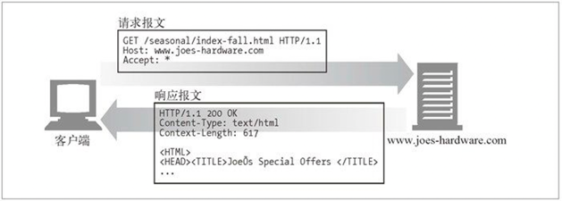	
###### HEAD
只从服务器获取文档的首部  	
是否包含主体：否			
HEAD 方法与 GET 方法的行为很类似，但服务器在响应中只返回首部，不会返回实体的主体部分。			
这就允许客户端在未获取实际资源的情况下，对资源的首部进行检查。  			
* 使用 HEAD，可以：			
	* 在不获取资源的情况下了解资源的情况（比如，判断其类型）；		
	* 通过查看响应中的状态码，看看某个对象是否存在；		
	* 通过查看首部，测试资源是否被修改了。		
服务器开发者必须确保返回的首部与GET请求所返回的首部完全相同。			
遵循 HTTP/1.1 规范，就必须实现 HEAD 方法。			
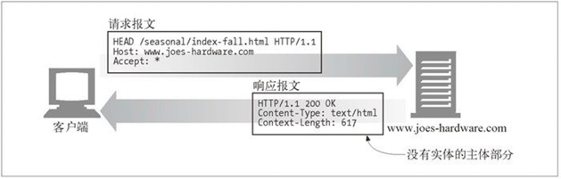

###### PUT
将请求的主体部分存储在服务器上	
是否包含主体：是  			
与 GET 从服务器读取文档相反，PUT 方法会向服务器写入文档。				
PUT 用于向服务器上的资源（例如文件）中存储数据。				
有些发布系统允许用户创建 Web 页面，并用 PUT 直接将其安装到 Web 服务器上去				
PUT 方法的语义就是让服务器用请求的主体部分来创建一个由所请求的 URL 命名的新文档，或者，如果那个 URL 已经存在的话，就用这个主体来替代它。				
因为 PUT 允许用户对内容进行修改，所以很多 Web 服务器都要求在执行 PUT 之前，用密码登录。				
在第 12 章中可以读到更多有关密码认证的内容。				
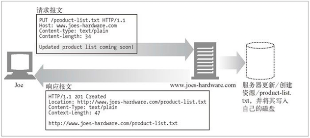


###### POST
会向服务器发送需要处理的数据	
是否包含主体：是 		
POST 方法起初是用来向服务器输入数据的			
* 实际上，通常会用它来支持 HTML 的表单。			
	表单中填好的数据通常会被送给服务器，然后由服务器将其发送到它要去的地方（比如，送到一个服务器网关程序中，然后由这个程序对其进行处理）。		
	图 3-10 显示了一个用 POST 方法发起 HTTP 请求——向服务器发送表单数据——的客户端。
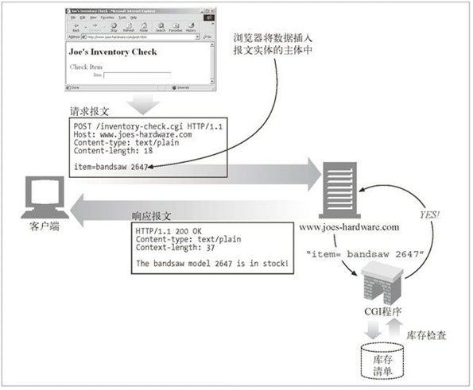	

###### TRACE	
对可能经过代理服务器传送到服务器上去的报文进行追踪	
是否包含主体：否  				
* 客户端发起一个请求时，这个请求可能要穿过					
   * 防火墙				
   * 代理				
   * 网关				
   * 或其他一些应用程序				
每个中间节点都可能会修改原始的 HTTP 请求。					
TRACE 方法允许客户端在最终将请求发送给服务器时，看看它变成了什么样子。					
* TRACE 请求会在目的服务器端发起一个“环回”诊断。					
	行程最后一站的服务器会弹回一条 TRACE 响应，并在响应主体中携带它收到的原始请求报文。				
	这样客户端就可以查看在所有中间 HTTP 应用程序组成的请求 / 响应链上，原始报文是否，以及如何被毁坏或修改过					
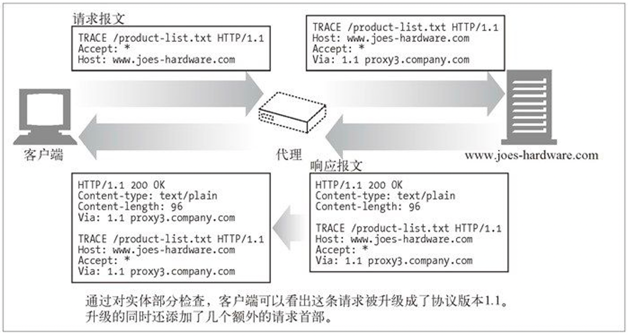
TRACE 方法主要用于诊断；也就是说，用于验证请求是否如愿穿过了请求 / 响应链。它也是一种很好的工具，可以用来查看代理和其他应用程序对用户请求所产生效果。				
* 尽管 TRACE 可以很方便地用于诊断，但它确实也有缺点，				
	它假定中间应用程序对各种不同类型请求（不同的方法——GET、HEAD、POST等）的处理是相同的。			
	很多 HTTP 应用程序会根据方法的不同做出不同的事情——比如，代理可能会将 POST 请求直接发送给服务器，而将 GET 请求发送给另一个 HTTP 应用程序（比如 Web 缓存）。			
	TRACE 并不提供区分这些方法的机制。			
	通常，中间应用程序会自行决定对 TRACE 请求的处理方式。			
TRACE 请求中不能带有实体的主体部分。				
TRACE 响应的实体主体部分包含了响应服务器收到的请求的精确副本。				

###### OPTIONS
决定可以在服务器上执行哪些方法，用于确定 Web 服务器的一般功能，或者 Web 服务器处理特定资源的能力
是否包含主体：否  			
OPTIONS 方法请求 Web 服务器告知其支持的各种功能。			
可以询问服务器通常支持哪些方法，或者对某些特殊资源支持哪些方法。（有些服务器可能只支持对一些特殊类型的对象使用特定的操作）。			
这为客户端应用程序提供了一种手段，使其不用实际访问那些资源就能判定访问各种资源的最优方式。			
	
	
###### DELETE
从服务器上删除一份文档	
是否包含主体：否 	
DELETE 方法所做的事情就是请服务器删除请求 URL 所指定的资源。		
* 但是，客户端应用程序无法保证删除操作一定会被执行。		
	因为 HTTP 规范允许服务器在不通知客户端的情况下撤销请求。	
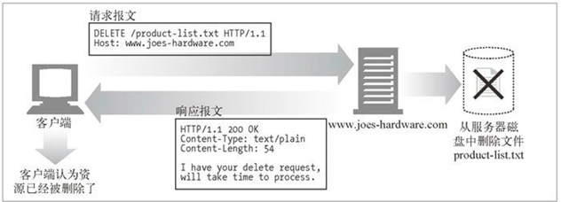
				
##### 扩展方法
而且，由于 HTTP 设计得易于扩展，所以除了这些方法之外，其他服务器可能还会实现一些自己的请求方法。这些附加的方法是对 HTTP 规范的扩展，因此被称为扩展方法。						
HTTP 被设计成字段可扩展的，这样新的特性就不会使老的软件失效了。						
扩展方法指的就是没有在 HTTP/1.1 规范中定义的方法。						
服务器会为它所管理的资源实现一些 HTTP 服务，这些方法为开发者提供了一种扩展这些 HTTP 服务能力的手段。						
  * 并不是所有的扩展方法都是在正式规范中定义的，认识到这一点很重要。						
  	如果你定义了一个扩展方法，很可能大部分 HTTP 应用程序都无法理解。					
  	同样，你的 HTTP 应用程序也可能会遇到一些其他应用程序在用的，而它并不理解的扩展方法。
  	* 在这些情况下，最好对扩展方法宽容一些。					
  	* 如果能够在不破坏端到端行为的情况下将带有未知方法的报文传递给下游服务器的话，代理应尝试传递这些报文。				
  	* 如果可能破坏端到端行为，则应以 501 Not Implemented（无法实现）状态码进行响应。				
  	* 最好按惯例“对所发送的内容要求严一点，对所接收的内容宽容一些”来处理扩展方法（以及一般的 HTTP 扩展）。				
  * 一些常见的扩展方法实例（Web发布扩展方法示例）：						
这些方法就是 WebDAV HTTP 扩展（参见第 19 章）包含的所有方法，这些方法有助于通过HTTP 将 Web 内容发布到 Web 服务 器上去。					

|方　　法|描　　述|
| :--- | :--- |	
|LOCK|允许用户“锁定”资源——比如，可以在编辑某个资源的时候将其锁定，以防别人同时对其进行修改|											
|MKCOL|允许用户创建资源|											
|COPY|便于在服务器上复制资源|											
|MOVE|在服务器上移动资源|
   
#### 请求 URL（request-URL）
请求 URL 描述了要对哪个资源执行这个方法。  
命名了所请求资源，或者 URL 路径组件的完整 URL。  
如果直接与服务器进行对话，只要 URL 的路径组件是资源的绝对路径，通常就不会有什么问题——服务器可以假定自己是 URL 的主机 / 端口。  
第 2 章详细地介绍了 URL 的语法。  
#### HTTP 的版本（version）
用来告知服务器，客户端使用的是哪种 HTTP  
在 HTTP/1.0 之前，并不要求请求行中包含 HTTP 版本号。  
报文所使用的 HTTP 版本，其格式看起来是这样的：  
```HTTP/<major>.<minor>```  
其中主要版本号（major）和次要版本号（minor）都是整数。  
本章稍后会详细说明 HTTP 的版本问题。  
版本号会以 HTTP/x.y 的形式出现在请求和响应报文的起始行中。  
为 HTTP 应用程序提供了一种将自己所遵循的协议版本告知对方的方式。  
使用版本号的目的是为使用 HTTP 的应用程序提供一种线索，以便互相了解对方的能力和报文格式。  
* 版本号说明了应用程序支持的最高 HTTP 版本。  
但 HTTP/1.0 应用程序在解释包含 HTTP/1.1 的响应时，会认为这个响应是个 1.1 响应，而实际上这只是响应应用程序所使用的协议等级，在这些情况下，版本号会在应用程序之间造成误解。http://httpd.apache.org/docs-2.0/misc/known_client_problems.html 上有更多在 Apache 与客户端之间出现此问题的案例。"
* 版本号不会被当作小数来处理。
版本中的每个数字（比如 HTTP/1.0 中的 1 和 0）都会被当作一个单独的数字来处理。  
因此，在比较 HTTP 版本时，每个数字都必须单独进行比较，以便确定哪个版本更高。  
比如，HTTP/2.22 就比 HTTP/2.3 的版本要高，因为 22 比 3 大。  
* 版本0.9的报文
HTTP 版本 0.9 是 HTTP 协议的早期版本。  
是当今 HTTP 所拥有的请求及响应报文的鼻祖，但其协议要简单得多  
HTTP/0.9 报文也由请求和响应组成，但请求中只包含方法和请求 URL，响应中只包含实体。  
它没有版本信息（它是第一个，而且是当时唯一的版本），没有状态码或原因短语，也没有首部。  
但这种简单协议无法提供更多的灵活性，也无法实现本书中描述的大部分 HTTP 特性和应用。  
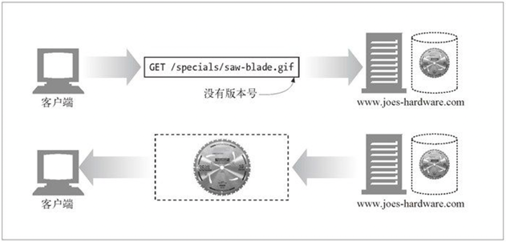


### 2. 响应报文（response message）
响应报文会将请求的结果返回给客户端。
这是响应报文的格式（注意，只有起始行的语法有所不同）：
<version><status><reason-phrase>
<headers>
<entity-body>
* 响应行
响应报文的起始行说明发生了什么。		
响应报文承载了状态信息和操作产生的所有结果数据，将其返回给客户端。		
所有这些字段都由空格符进行分隔。		
在 HTTP/1.0 之前，并不要求在响应中包含响应行。		
响应报文的起始行，或称为响应行，包含了：		
#### 响应报文使用的 HTTP 版本
<span id="http5"></span>
#### 状态码（status-code）
本章稍后提供了 HTTP 规范定义的状态码及其含义的完整列表。
状态码则用来告诉客户端，发生了什么事情。
状态码位于响应的起始行中。
会返回一个数字状态和一个可读的状态。
数字码便于程序进行差错处理，而原因短语则更便于人们理解。
状态码为客户端提供了一种理解事务处理结果的便捷方式。
尽管并没有实际的规范对原因短语的确切文本进行说明，本节还是列出了一些原因短语示例。我们所列的是 HTTP/1.1 规范推荐使用的原因短语。
##### 数字状态码
这三位数字描述了请求过程中所发生的情况。
每个状态码的第一位数字都用于描述状态的一般类别（“成功”、“出错”等）。
当前的 HTTP 版本只为每类状态定义了几个代码。随着协议的发展，HTTP 规范中会正式地定义更多的状态码。
如果收到了不认识的状态码，可能是有人将其作为当前协议的扩展定义的。可以根据其所处范围，将它作为那个类别中一个普通的成员来处理。
可以通过三位数字代码对不同状态码进行分类。
###### 信息性状态码（信息提示）	
100～199  
HTTP/1.1 向协议中引入了信息性状态码。  
这些状态码相对较新，关于其复杂性和感知价值存在一些争议。  
* 100～101
####### 100   Continue
说明收到了请求的初始部分，请客户端继续。发送了这个状态码之后，服务器在收到请求之后必须进行响应。更多信息请参见附录C中的Expect首部介绍  
100 Continue 状态码尤其让人糊涂。				
它的目的是对这样的情况进行优化：HTTP 客户端应用程序有一个实体的主体部分要发送给服务器，但希望在发送之前查看一下服务器是否会接受这个实体。  				
这可能会给 HTTP 程序员带来一些困扰，因此在这里进行了比较详细（它如何与客户端、服务器和代理进行通信）的讨论。				
* 客户端与100 Continue				  
	如果客户端在向服务器发送一个实体，并且愿意在发送实体之前等待 100 Continue 响应，那么，客户端就要发送一个携带了值为 100 Continue 的 Expect 请求首部（参见附录 C）。  			
	如果客户端没有发送实体，就不应该发送 100 Continue Expect 首部，因为这样会使服务器误以为客户端要发送一个实体。			
	从很多方面来看，100 Continue 都是一种优化。			
	客户端应用程序只有在避免向服务器发送一个服务器无法处理或使用的大实体时，才应该使用 100 Continue。			
	由于起初对 100 Continue 状态存在一些困惑（而且以前有些实现在这里出过问题），因此发送了值为 100 Continue 的 Expect 首部的客户端不应该永远在那儿等待服务器发送 100 Continue 响应。超时一定时间之后，客户端应该直接将实体发送出去。  			
	实际上，客户端程序的实现者也应该做好应对非预期 100 Continue 响应的准备（这很烦人，但确实如此）。有些出错的 HTTP 应用程序会不合时宜地发送这个状态码。			
* 服务器与100 Continue				
	如果服务器收到了一条带有值为 100 Continue 的 Expect 首部的请求，它会用 100 Continue 响应或一条错误码来进行响应（参见表 3-9 4xx）。			
	服务器永远也不应该向没有发送 100 Continue 期望的客户端发送 100 Continue 状态码。			
	但如前所述，有些出错的服务器可能会这么做。			
	如果出于某种原因，服务器在有机会发送 100 Continue 响应之前就收到了部分（或全部）的实体，就说明客户端已经决定继续发送数据了，这样，服务器就不需要发送这个状态码了。但服务器读完请求之后，还是应该为请求发送一个最终状态码（它可以跳过 100 Continue 状态）。			
	最后，如果服务器收到了带有 100 Continue 期望的请求，而且它决定在读取实体的主体部分之前（比如，因为出错而）结束请求，就不应该仅仅是发送一条响应并关闭连接，因为这样会妨碍客户端接收响应（参见 4.7.4 节）。			
* 代理与100 Continue				
	如果代理从客户端收到了一条带有 100 Continue 期望的请求，它需要做几件事情。			
	* 如果代理知道下一跳服务器（在第 6 章中讨论）是 HTTP/1.1 兼容的，或者并不知道下一跳服务器与哪个版本兼容，它都应该将 Expect 首部放在请求中向下转发。		
	* 如果它知道下一跳服务器只能与 HTTP/1.1 之前的版本兼容，就应该以 417 Expectation Failed 错误进行响应。还有一种合理的方法，是向客户端先返回 100 Continue，在向服务器转发请求时，删掉 Expect 首部。（译者注）		
	如果代理决定代表与 HTTP/1.0 或之前版本兼容的客户端，在其请求中放入 Expect 首部和 100 Continue 值，那么，（如果它从服务器收到了 100 Continue 响应）它就不应该将 100 Continue 响应转发给客户端，因为客户端可能不知道该拿它怎么办。			
	代理维护一些有关下一跳服务器及其所支持的 HTTP 版本的状态信息（至少要维护那些最近收到过请求的服务器的相关状态）是有好处的，这样它们就可以更好地处理收到的那些带有 100 Continue 期望的请求了。			
####### 101   Switching Protocols
说明服务器正在根据客户端的指定，将协议切换成Update首部所列的协议

###### 成功状态码（成功）	
200～299  
客户端发起请求时，这些请求通常都是成功的。  
服务器有一组用来表示成功的状态码，分别对应于不同类型的请求。  
* 200～206
####### 200   OK
成功。请求的所有数据都在响应主体中。请求没问题，实体的主体部分包含了所请求的资源					
####### 201   Created
用于创建服务器对象的请求（比如，PUT）。					
响应的实体主体部分中应该包含各种引用了已创建的资源的URL，					
Location首部包含的则是最具体的引用。更多有关Location首部的信息参见表3-21。
服务器必须在发送这个状态码之前创建好对象					
####### 202   Accepted
请求已被接受，但服务器还未对其执行任何动作。					
不能保证服务器会完成这个请求；这只是意味着接受请求时，它看起来是有效的。
服务器应该在实体的主体部分包含对请求状态的描述，或许还应该有对请求完成时间的估计（或者包含一个指针，指向可以获取此信息的位置）					
####### 203   Non-Authoritative Information
实体首部（更多有关实体首部的信息参见3.5.4节）包含的信息不是来自于源端服务器，而是来自资源的一份副本。					
如果中间节点上有一份资源副本，但无法或者没有对它所发送的与资源有关的元信息（首部）进行验证，就会出现这种情况。
这种响应码并不是非用不可的；如果实体首部来自源端服务器，响应为200状态的应用程序就可以将其作为一种可选项使用					
####### 204   No Content
响应报文中包含若干首部和一个状态行，但没有实体的主体部分。	
主要用于在浏览器不转为显示新文档的情况下，对其进行更新（比如刷新一个表单页面）					
####### 205   Reset Content
另一个主要用于浏览器的代码。
负责告知浏览器清除当前页面中的所有HTML 表单元素					
####### 206   Partial Content
成功执行了一个部分或Range（范围）请求。
稍后我们会看到，客户端可以通过一些特殊的首部来获取部分或某个范围内的文档——这个状态码就说明范围请求成功了。					
更多有关Range首部的内容参见15.9节。
206响应中必须包含Content-Range、Date以及ETag或Content-Location首部				


###### 重定向状态码（表示资源已经被移走了）
300～399		
重定向状态码要么告知客户端使用替代位置来访问他们所感兴趣的资源，		
* 要么就提供一个替代的响应而不是资源的内容。		
	如果资源已被移动，可发送一个重定向状态码和一个可选的 Location 首部来告知客户端资源已被移走，以及现在可以在哪里找到它（参见图 3-14）。	
	这样，浏览器就可以在不打扰使用者的情况下，透明地转入新的位置了。	
总之，在对那些包含了重定向状态码的非 HEAD 请求进行响应时，最好要包含一个实体，并在实体中包含描述信息和指向（多个）重定向 URL 的链接
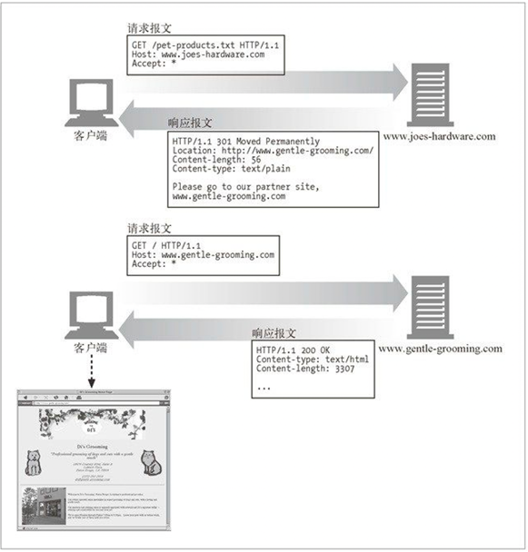		
* 可以通过某些重定向状态码对资源的应用程序本地副本与源端服务器上的资源进行验证。				
	比如，HTTP 应用程序可以查看其资源的本地副本是否仍然是最新的，或者在源端服务器上资源是否被修改过。			
	图 3-15 显示了一个这样的例子。			
	客户端发送了一个特殊的 If-Modified-Since 首部，说明只读取 1997 年 10 月之后修改过的文档。			
	这个日期之后，此文档并未被修改过，因此，服务器回送了一个 304 状态码，而不是文档的内容。			
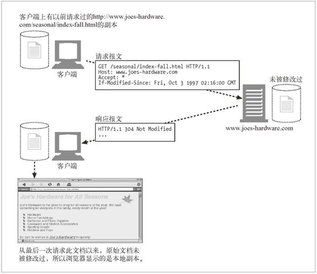
* 300～305
####### 300   Multiple Choices				
客户端请求一个实际指向多个资源的URL时会返回这个状态码，比如服务器上有某个HTML文档的英语和法语版本。			
返回这个代码时会带有一个选项列表；这样用户就可以选择他希望使用的那一项了。			
有多个版本可用时，客户端需要沟通解决，更多与此有关的信息请参见第17章。			
服务器可以在Location首部包含首选URL			
####### 301   Moved Permanently				
在请求的URL已被移除时使用。
响应的Location首部中应该包含资源现在所处的URL			
####### 302	  Found				
与301状态码类似；			
但是，客户端应该使用Location首部给出的URL来临时定位资源。			
将来的请求仍应使用老的URL			
####### 303   See Other				
告知客户端应该用另一个URL来获取资源。			
新的URL位于响应报文的 Location 首部。			
其主要目的是允许POST请求的响应将客户端定向到某个资源上去			
####### 304	   Not Modified				
客户端可以通过所包含的请求首部，使其请求变成有条件的。			
更多有关条件首部的内容请参见第3章。			
如果客户端发起了一个条件GET请求，而最近资源未被修改的话，就可以用这个状态码来说明资源未被修改。			
带有这个状态码的响应不应该包含实体的主体部分			
####### 305	  Use Proxy				
用来说明必须通过一个代理来访问资源；代理的位置由Location首部给出。			
很重要的一点是，客户端是相对某个特定资源来解析这条响应的，不能假定所有请求，甚至所有对持有所请求资源的服务器的请求都通过这个代理进行。			
如果客户端错误地让代理介入了某条请求，可能会引发破坏性的行为，而且会造成安全漏洞			
####### 306	  （未使用）				
当前未使用			
####### 307   Temporary Redirect
与301状态码类似；			
但客户端应该使用Location首部给出的URL来临时定位资源。			
将来的请求应该使用老的URL			
* 302、303 和 307 状态码之间存在一些交叉。这些状态码的用法有着细微的差别，大部分差别都源于 HTTP/1.0 和 HTTP/1.1 应用程序对这些状态码处理方式的不同。							
	当 HTTP/1.0 客户端发起一个 POST 请求，并在响应中收到 302 重定向状态码时，它会接受 Location 首部的重定向 URL，并向那个 URL 发起一个 GET 请求（而不会像原始请求中那样发起 POST 请求）。  						
	HTTP/1.0 服务器希望 HTTP/1.0 客户端这么做——如果 HTTP/1.0 服务器收到来自 HTTP/1.0 客户端的 POST 请求之后发送了 302 状态码，服务器就期望客户端能够接受重定向 URL，并向重定向的 URL 发送一个 GET 请求。  						
	问题出在 HTTP/1.1。						
	HTTP/1.1 规范使用 303 状态码来实现同样的行为（服务器发送 303 状态码来重定向客户端的 POST 请求，在它后面跟上一个 GET 请求）。						
	为了避开这个问题，HTTP/1.1 规范指出，对于 HTTP/1.1 客户端，用 307 状态码取代 302 状态码来进行临时重定向。						
	这样服务器就可以将 302 状态码保留起来，为 HTTP/1.0 客户端使用了。						
	这样一来，服务器要选择适当的重定向状态码放入重定向响应中发送，就需要查看客户端的 HTTP 版本了。						
###### （客户端错误状态码）表示客户端的请求出错了	
400～499		
* 有时客户端会发送一些服务器无法处理的东西，比如		
   * 格式错误的请求报文	
   * 最常见的是，请求一个不存在的 URL	
很多客户端错误都是由浏览器来处理的，甚至不会打扰到你。		
只有少量错误，比如 404，还是会穿过浏览器来到用户面前。
* 400～415
####### 400	   Bad Request
用于告知客户端它发送了一个错误的请求			
####### 401   Unauthorized（未授权）
需要输入用户名和密码			
与适当的首部一同返回，在这些首部中请求客户端在获取对资源的访问权之前，对自己进行认证。			
更多有关认证的内容请参见 12.1节			
####### 402	   Payment Required
现在这个状态码还未使用，但已经被保留，以作未来之用			
####### 403	   Forbidden
用于说明请求被服务器拒绝了。			
如果服务器想说明为什么拒绝请求，可以包含实体的主体部分来对原因进行描述。			
但这个状态码通常是在服务器不想说明拒绝原因的时候使用的			
####### 404	   Not Found（未找到）
服务器无法找到所请求URL对应的资源			
用于说明服务器无法找到所请求的URL。			
通常会包含一个实体，以便客户端应用程序显示给用户看			
####### 405	   Method Not Allowed
发起的请求中带有所请求的URL不支持的方法时，使用此状态码。			
应该在响应中包含Allow首部，以告知客户端对所请求的资源可以使用哪些方法。			
更多有关Allow首部的信息请参见3.5.4节			
####### 406	   Not Acceptable
客户端可以指定参数来说明它们愿意接收什么类型的实体。			
服务器没有与客户端可接受的URL相匹配的资源时，使用此代码。			
通常，服务器会包含一些首部，以便客户端弄清楚为什么请求无法满足。			
更多信息请参见第17章			
####### 407	   Proxy Authentication Required
与401状态码类似，但用于要求对资源进行认证的代理服务器			
####### 408	   Request Timeout
如果客户端完成请求所花的时间太长，服务器可以回送此状态码，并关闭连接。			
超时时长随服务器的不同有所不同，但通常对所有的合法请求来说，都是够长的			
####### 409    Conflict
用于说明请求可能在资源上引发的一些冲突。			
服务器担心请求会引发冲突时，可以发送此状态码。			
响应中应该包含描述冲突的主体			
####### 410	   Gone
与404类似，只是服务器曾经拥有过此资源。
主要用于Web站点的维护，这样服务器的管理者就可以在资源被移除的情况下通知客户端了			
####### 411   Length Required
服务器要求在请求报文中包含Content-Length首部时使用。			
更多有关Content-Length首部的信息请参见3.5.4节			
####### 412   Precondition Failed
客户端发起了条件请求，且其中一个条件失败了的时候使用。			
客户端包含了Expect首部时发起的就是条件请求。			
更多有关Expect首部的内容请参见附录C中Expect部分			
####### 413	   Request Entity Too Large
客户端发送的实体主体部分比服务器能够或者希望处理的要大时，使用此状态码			
####### 414	   Request URI Too Long
客户端所发请求中的请求URL比服务器能够或者希望处理的要长时，使用此状态码			
####### 415	   Unsupported Media Type
服务器无法理解或无法支持客户端所发实体的内容类型时，使用此状态码			
####### 416	   Requested Range Not Satisfiable
请求报文所请求的是指定资源的某个范围，而此范围无效或无法满足时，使用此状态码			
####### 417	   Expectation Failed
请求的Expect请求首部包含了一个期望，但服务器无法满足此期望时，使用此状态码。			
更多有关Expect首部的内容请参见附录C中Expect部分
如果代理或其他中间应用程序有确切证据说明源端服务器会为某请求产生一个失败的期望，就可以发送这个响应状态码

###### （服务器错误状态码）表示服务器出错了	
500～599	
有时客户端发送了一条有效请求，服务器自身却出错了。	
这可能是客户端碰上了服务器的缺陷，或者服务器上的子元素，比如某个网关资源，出了错。	
* 代理尝试着代表客户端与服务器进行交流时，经常会出现问题。	
	代理会发布 5XX 服务器错误状态码来描述所遇到的问题（参见第 6 章）。
* 500～505
####### 500   Internal Server Error
服务器遇到一个妨碍它为请求提供服务的错误时，使用此状态码
####### 501   Not Implemented
客户端发起的请求超出服务器的能力范围（比如，使用了服务器不支持的请求方法）时，使用此状态码
####### 502   Bad Gateway
作为代理或网关使用的服务器从请求响应链的下一条链路上收到了一条伪响应（比如，它无法连接到其父网关）时，使用此状态码
####### 503   Service Unavailable
用来说明服务器现在无法为请求提供服务，但将来可以。
更多有关Retry-After首部的信息请参见3.5.3节
####### 504   Gateway Timeout
与状态码408类似，只是这里的响应来自一个网关或代理，它们在等待另一服务器对其请求进行响应时超时了
####### 505   HTTP Version Not Supported
服务器收到的请求使用了它无法或不愿支持的协议版本时，使用此状态码。
有些服务器应用程序会选择不支持协议的早期版本
##### 描述操作状态的文本形式的原因短语（reason-phrase）
	
请求和响应报文的基本报文结构相同。	
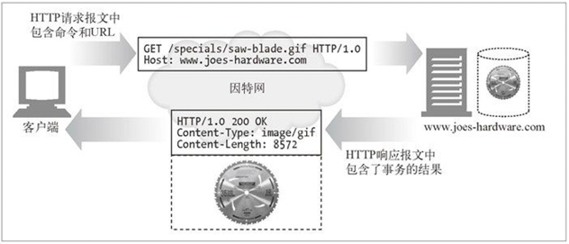	
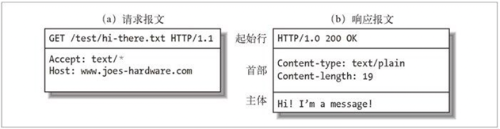	
	
				

  * get/post的区别     
