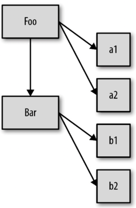
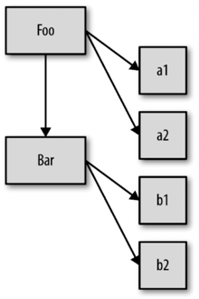
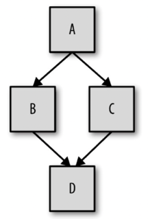

第二部分 this和对象原型																																		
# 第1章 关于this
this关键字是一个很特别的关键字，被自动定义在所有函数的作用域中。																																		
在交流过程中很难区分我们到底把“this”当作代词还是当作关键字。

## 那this到底有用在哪里呢？——（why）为什么要使用this

* 如果不使用this，那就需要给identify()和speak()显式传入一个上下文对象。
	
    ```javascript																																
    function identify(context) {																																	
        return context.name.toUpperCase();																																
    }																																	
    function speak(context) {																																	
        var greeting = "Hello, I'm " + identify(context);																																
        console.log(greeting);																																
    }																																	
    identify(you);				// READER																													
    speak(me);				// hello, I'm KYLE		
    ```																											
    * 这段代码可以在不同的上下文对象（me和you）中重复使用函数identify()和speak()，不用针对每个对象编写不同版本的函数。																																	
* this提供了一种更优雅的方式来隐式“传递”一个对象引用，因此可以将API设计得更加简洁并且易于复用。																																	
* 随着你的使用模式越来越复杂，显式传递上下文对象会让代码变得越来越混乱，使用this则不会这样。当我们介绍对象和原型时，你就会明白函数可以自动引用合适的上下文对象有多重要。																																	
	```javascript
	function identify() {																																	
		return this.name.toUpperCase();																																
	}																																	
	function speak() {																																	
		var greeting = "Hello, I'm " + identify.call(this);																																
		console.log(greeting);																																
	}																																	
	var me = {																																	
		name: "Kyle"																																
	};																																	
	var you = {																																	
		name: "Reader"																																
	};																																	
	identify.call(me);					// KYLE																												
	identify.call(you);					// READER																												
	speak.call(me);					// Hello，我是KYLE																												
	speak.call(you);					// Hello，我是READER
	```

this的含义和工作原理

## 一些关于this的错误认识：
																																		
### （1）指向函数自身
```javascript
function foo(num) {																																
    console.log("foo: " + num);																															
    this.count++;									// 记录foo被调用的次数																						
                                        // 但是函数内部代码this.count中的this并不是指向那个函数对象，所以虽然属性名相同，根对象却并不相同																						
                                        // 这段代码在无意中创建了一个全局变量count（原理参见第2章），它的值为NaN																						
}																																
foo.count = 0;										// 执行foo.count = 0时，的确向函数对象foo添加了一个属性count。																						
                                                                                                                                
var i;																																
for(i = 0; i < 10; i++) {																																
    if(i > 5) {																															
        foo(i);																														
    }																															
}																																
// foo: 6																																
// foo: 7																																
// foo: 8																																
// foo: 9																																
                          // foo被调用了多少次？																						
console.log(foo.count);	  // 0	
```																					
																																	
#### ① 词法作用域
许多开发者并不会深入思考为什么this的行为和预期的不一致，也不会试图回答那些很难解决但却非常重要的问题。他们只会回避这个问题并使用其他方法来达到目的，比如创建另一个带有count属性的对象。
```javascript
function foo(num) {																															
	console.log("foo: " + num);																														
	data.count++;									// 记录foo被调用的次数																					
}																															
																															
var data = {																															
	count: 0																														
}																															
																															
var i;																															
for(i = 0; i < 10; i++) {																															
	if(i > 5) {																														
		foo(i);																													
	}																														
}																															
// foo: 6																															
// foo: 7																															
// foo: 8																															
// foo: 9																															
										// foo被调用了多少次？																					
console.log(data.count);										// 4	
```																				
																															
从函数对象内部引用它自身：																																
	为什么需要从函数内部引用函数自身呢？																															
	· 常见的原因是递归（从函数内部调用这个函数）																															
	· 可以写一个在第一次被调用后自己解除绑定的事件处理器																															
既然把函数看作一个对象（JavaScript中的所有函数都是对象），那就可以在调用函数时存储状态（属性的值）。这是可行的，但是在本书即将介绍的许多模式中你会发现，除了函数对象还有许多更合适存储状态的地方。																																
#### ② 通过一个指向函数对象的词法标识符（变量）来引用它
```javascript
function foo() {																															
	foo.count = 4;									// 第一个函数被称为具名函数，在它内部可以使用foo来引用自身。																					
}																															
function foo(num) {										// 记录foo被调用的次数																					
	console.log("foo: " + num);																														
	foo.count++;									// 这种方法同样回避了this的问题，并且完全依赖于变量foo的词法作用域。																					
}																															
foo.count = 0;																															
var i;																															
for(i = 0; i < 10; i++) {																															
	if(i > 5) {																														
		foo(i);																													
	}																														
}																															
// foo: 6																															
// foo: 7																															
// foo: 8																															
// foo: 9																															
										// foo被调用了多少次																					
console.log(foo.count);										// 4	
```																				
																															
* 传入setTimeout(..)的回调函数没有名称标识符（这种函数被称为匿名函数），因此无法从函数内部引用自身	
	```javascript																														
	setTimeout(function() {																														
		...																													
	}, 10);																												```		

* 使用arguments. callee来引用当前正在运行的函数对象，已经被弃用，不应该再使用它。																															
																																
#### ③ 强制this指向foo函数对象：
```javascript
function foo(num) {																															
	console.log("foo: " + num);																														
	this.count++;									// 记录foo被调用的次数																					
}										// 注意，在当前的调用方式下，this确实指向foo																					
foo.count = 0;																															
var i;																															
fo(i = 0; i < 10; i++) {																															
	if(i > 5) {																														
		foo.call(foo, i);								// 使用call(..)可以确保this指向函数对象foo本身																					
	}																														
}																															
// foo: 6																															
// foo: 7																															
// foo: 8																															
// foo: 9										// foo被调用了多少次？																					
console.log(foo.count);										// 4	
```																				
																																
																																
### （2）指向函数的词法作用域
这个问题有点复杂，因为在某种情况下它是正确的，但是在其他情况下它却是错误的。																																
this在任何情况下都不指向函数的词法作用域。																																
每当你想要把this和词法作用域的查找混合使用时，一定要提醒自己，这是无法实现的。																																
在JavaScript内部，作用域确实和对象类似，可见的标识符都是它的属性。但是作用域“对象”无法通过JavaScript代码访问，它存在于JavaScript引擎内部。
```javascript																								
function foo() {																																
	var a = 2;																															
	this.bar();						// 通过this.bar()来引用bar()函数。调用bar()最自然的方法是省略前面的this，直接使用词法引用标识符。																									
							// 试图（但是没有成功）跨越边界，使用this来隐式引用函数的词法作用域																									
}																																
function bar() {																																
	console.log(this.a);						// 试图使用this联通foo()和bar()的词法作用域，从而让bar()可以访问foo()作用域里的变量a。这是不可能实现的，使用this不可能在词法作用域中查到什么。																									
}																																
foo();							// ReferenceError: a is not defined
```																									
																																
																																	
## this到底是如何工作的
																																		
this是在运行时进行绑定的，并不是在编写时绑定，它的上下文取决于函数调用时的各种条件。																																	
this的绑定和函数声明的位置没有任何关系，只取决于函数的调用方式。																																	
当一个函数被调用时，会创建一个活动记录（有时候也称为执行上下文）。																																	
这个记录会包含函数在哪里被调用（调用栈）、函数的调用方式、传入的参数等信息。this就是这个记录的一个属性，会在函数执行的过程中用到。																																	
																																		
# 第2章 this全面解析
## 如果要判断一个运行中函数的this绑定，就需要找到这个函数的直接调用位置。
如何寻找函数的调用位置，从而判断函数在执行过程中会如何绑定this。																																	
调用位置就是函数在代码中被调用的位置（而不是声明的位置）。																																	
通常来说，寻找调用位置就是寻找“函数被调用的位置”，但是做起来并没有这么简单，因为某些编程模式可能会隐藏真正的调用位置。																																	
最重要的是要分析调用栈（就是为了到达当前执行位置所调用的所有函数）。																																	
我们关心的调用位置就在当前正在执行的函数的前一个调用中。																																	
你必须找到调用位置，然后判断需要应用下面四条规则中的哪一条。																																	
																																
### 查看调用栈的方法：
#### （1）你可以把调用栈想象成一个函数调用链。但是这种方法非常麻烦并且容易出错。

```javascript	
function baz() {																															
	// 当前调用栈是：baz																														
	// 因此，当前调用位置是全局作用域																														
	console.log("baz");																														
	bar();																														
}																															
function bar() {																															
	// 当前调用栈是baz -> bar																														
	// 因此，当前调用位置在baz中																														
	console.log("bar");																														
	foo();																														
}																															
function foo() {																															
	// 当前调用栈是baz -> bar -> foo																														
	// 因此，当前调用位置在bar中																														
	console.log("foo");																														
}																															
baz();		// baz的调用位置
```											

#### （2）使用浏览器的调试工具
在工具中给foo()函数的第一行代码设置一个断点，或者直接在第一行代码之前插入一条debugger;语句。																															
运行代码时，调试器会在那个位置暂停，同时会展示当前位置的函数调用列表，这就是你的调用栈。																															
因此，如果你想要分析this的绑定，使用开发者工具得到调用栈，然后找到栈中第二个元素，这就是真正的调用位置。

## 四条规则
找到之后就可以顺序应用下面这四条规则来判断this的绑定对象。																																		
一定要注意，有些调用可能在无意中使用默认绑定规则。如果想“更安全”地忽略this绑定，你可以使用一个DMZ对象，比如ø =Object.create(null)，以保护全局对象。																																		
### （1）new绑定——由new调用？绑定到新创建的对象。
* JavaScript中new的机制实际上和面向类的语言完全不同：																																	
	* 在传统的面向类的语言中，“构造函数”是类中的一些特殊方法，使用new初始化类时会调用类中的构造函数。																																
		something = new MyClass(..);																															
	* 在JavaScript中，构造函数只是一些使用new操作符时被调用的函数。																																
		它们并不会属于某个类，也不会实例化一个类。实际上，它们甚至都不能说是一种特殊的函数类型，它们只是被new操作符调用的普通函数而已。																															
		Number(..)作为构造函数时的行为。当Number在new表达式中被调用时，它是一个构造函数：它会初始化新创建的对象。																															
		包括内置对象函数（比如Number(..)，详情请查看第3章）在内的所有函数都可以用new来调用，这种函数调用被称为构造函数调用。																															
		实际上并不存在所谓的“构造函数”，只有对于函数的“构造调用”。																															
* 使用new来调用函数，或者说发生构造函数调用时，会自动执行下面的操作：																																	
	* （1）创建（或者说构造）一个全新的对象。																																
	* （2）这个新对象会被执行[[Prototype]]连接。													第5章会详细介绍它。																			
	* （3）这个新对象会绑定到函数调用的this。																																
	* （4）如果函数没有返回其他对象，那么new表达式中的函数调用会自动返回这个新对象。		
		```javascript																														
		function foo(a) {																															
			this.a = a;																														
		}																															
		var bar = new foo(2);						// 使用new来调用foo(..)时，我们会构造一个新对象并把它绑定到foo(..)调用中的this上。																									
		console.log(bar.a);						// 2	
		```																								
																																		
### （2）显式绑定——由call或者apply（或者bind）调用？绑定到指定的对象。
* 函数的call(..)和apply(..)方法
	如果我们不想在对象内部包含函数引用，而想在某个对象上强制调用函数。
	它们的第一个参数是一个对象，是给this准备的，接着在调用函数时将其绑定到this。因为你可以直接指定this的绑定对象，因此我们称之为显式绑定。
	```javascript		
	function foo() {																																
		console.log(this.a);																															
	}																																
	var obj = {																																
		a: 2																															
	};																																
																																	
	foo.call(obj);				// 2   
	```
	通过foo.call(..)，我们可以在调用foo时强制把它的this绑定到obj上。																												
																																	
	严格来说，JavaScript的宿主环境有时会提供一些非常特殊的函数，它们并没有这两个方法。																																
	但是这样的函数非常罕见，JavaScript提供的绝大多数函数以及你自己创建的所有函数都可以使用call(..)和apply(..)方法。																																
																																	
	如果你传入了一个原始值（字符串类型、布尔类型或者数字类型）来当作this的绑定对象，这个原始值会被转换成它的对象形式（也就是new String(..)、new Boolean(..)或者new Number(..)）。这通常被称为“装箱”。																																
	JavaScript中的“所有”函数都有一些有用的特性（这和它们的[[Prototype]]有关）。																																
																																	
* 硬绑定（函数的bind方法）																																	
	显式绑定的变种可以固定this，来解决之前提出的隐式丢失this绑定问题
	```javascript		
	function foo() {																																
		console.log(this.a);																															
	}																																
	var obj = {																																
		a: 2																															
	};																																
	var bar = function() {						// 创建了函数bar()																										
		foo.call(obj);					// 在它的内部手动调用了foo.call(obj)，因此强制把foo的this绑定到了obj																										
	};																																
	bar();						// 2																										
	setTimeout(bar, 100);						// 2 无论之后如何调用函数bar，它总会手动在obj上调用foo。这种绑定是一种显式的强制绑定，因此我们称之为硬绑定。																										
	bar.call(window);						// 2  硬绑定的bar不可能再修改它的this 	
	```																									
																																	
	* 硬绑定的应用场景：																																
	* ① 创建一个包裹函数，负责接收参数并返回值	
	```javascript	
		function foo(something) {																															
			console.log(this.a, something);																														
			return this.a + something;																														
		}																															
		var obj = {																															
			a: 2																														
		};																															
		var bar = function() {											// 包裹函数bar																				
			return foo.apply(obj, arguments);																														
		};																															
		var b = bar(3);											// 2 3																				
		console.log(b);											// 5	
		```																			
																																	
	* ② 创建一个可以重复使用的辅助函数
		```javascript																																
		function foo(something) {																															
			console.log(this.a, something);																														
			return this.a + something;																														
		}																															
		function bind(fn, obj) {											// 简单的辅助绑定函数																				
			return function() {										// “裸”辅助函数bind																				
				return fn.apply(obj, arguments);																													
			};																														
		}																															
		var obj = {																															
			a: 2																														
		};																															
		var bar = bind(foo, obj);																															
		var b = bar(3);											// 2 3																				
		console.log(b);											// 5	
		```																			
		这种bind(..)是一种polyfill代码（polyfill就是我们常说的刮墙用的腻子，polyfill代码主要用于旧浏览器的兼容，比如说在旧的浏览器中并没有内置bind函数，因此可以使用polyfill代码在旧浏览器中实现新的功能），对于new使用的硬绑定函数来说，这段polyfill代码和ES5内置的bind(..)函数并不完全相同（后面会介绍为什么要在new中使用硬绑定函数）。由于polyfill并不是内置函数，所以无法创建一个不包含．prototype的函数，因此会具有一些副作用。如果你要在new中使用硬绑定函数并且依赖polyfill代码的话，一定要非常小心。																															
	* ③ 由于硬绑定是一种非常常用的模式，所以ES5提供了内置的方法Function.prototype.bind																
		```javascript																
		function foo(something) {																															
			console.log(this.a, something);																														
			return this.a + something;																														
		}																															
		var obj = {																															
			a: 2																														
		};																															
		var bar = foo.bind(obj);											// bind(..)会返回一个硬编码的新函数，它会把你指定的参数设置为this的上下文并调用原始函数。																				
													// Function.prototype.bind(..)会创建一个新的包装函数，这个函数会忽略它当前的this绑定（无论绑定的对象是什么），并把我们提供的对象绑定到this上。																				
		var b = bar(3);											// 2 3																				
		console.log(b);											// 5	
		```																			
																																	
* 绑定例外——软绑定																																	
	硬绑定这种方式可以把this强制绑定到指定的对象（除了使用new时），防止函数调用应用默认绑定规则。																																
	问题在于，硬绑定会大大降低函数的灵活性，使用硬绑定之后就无法使用隐式绑定或者显式绑定来修改this。																																
	如果可以给默认绑定指定一个全局对象和undefined以外的值，那就可以实现和硬绑定相同的效果，同时保留隐式绑定或者显式绑定修改this的能力。																																
	```javascript
	if(!Function.prototype.softBind) {																																
		Function.prototype.softBind = function(obj) {													// 除了软绑定之外，softBind(..)的其他原理和ES5内置的bind(..)类似。																		
			var fn = this;																														
			var curried = [].slice.call(arguments, 1);											// 捕获所有curried参数																			
			var bound = function() {							// 它会对指定的函数进行封装																							
				return fn.apply(																													
								(!this || this === (window || global)) ? obj : this,													// 首先检查调用时的this，如果this绑定到全局对象或者undefined，那就把指定的默认对象obj绑定到this，否则不会修改this。												
								curried.concat.apply(curried, arguments)												// 此外，这段代码还支持可选的柯里化（详情请查看之前和bind(..)相关的介绍）。													
								);																									
			}																														
			bound.protoype = Object.create(fn.prototype);																														
			return bound;																														
		};																															
	}																																
																																	
	function foo() {																																
		console.log("name: " + this.name);																															
	}																																
	var obj = { name: "obj" },																																
		obj2 = { name: "obj2" },																															
		obj3 = { name: "obj3" };																															
	var fooOBJ = foo.softBind(obj);																																
	fooOBJ();									// name: obj   但如果应用默认绑定，则会将this绑定到obj。																							
	obj2.foo = foo.softBind(obj);																																
	obj2.foo();									// name: obj2 <-----看！！！  软绑定版本的foo()可以手动将this绑定到obj2或者obj3上																							
	fooOBJ.call(obj3);									// name: obj3 <-----看！！！																							
	setTimeout(obj2.foo, 10);									// name: obj <----应用了软绑定																					
	```		
																																	
* 绑定例外——被忽略的this																																	
	如果你把null或者undefined作为this的绑定对象传入call、apply或者bind，这些值在调用时会被忽略，实际应用的是默认绑定规则	
	```javascript	
	function foo() {																																
		console.log(this.a);																															
	}																																
	var a = 2;																																
	foo.call(null);				// 2	
	```																											
	什么情况下你会传入null呢？																																
	* ① 一种非常常见的做法是使用apply(..)来“展开”一个数组，并当作参数传入一个函数								
		```javascript																								
		function foo(a, b) {																															
			console.log("a:" + a + ",b:" + b);																														
		}																															
		foo.apply(null, [2, 3]);								// a:2, b:3  把数组“展开”成参数																						
		```	
		在ES6中，可以用．.．操作符代替apply(..)来“展开”数组，foo(...[1,2])和foo(1,2)是一样的，这样可以避免不必要的this绑定。																															
	* ② bind(..)可以对参数进行柯里化（预先设置一些参数），这种方法有时非常有用
		```javascript																																
		var bar = foo.bind(null, 2);								// 使用bind(..)进行柯里化																							
		bar(3);								// a:2, b:3				
		```																			
		在ES6中没有柯里化的相关语法，因此还是需要使用bind(..)																															
	这两种方法都需要传入一个参数当作this的绑定对象。如果函数并不关心this的话，你仍然需要传入一个占位值，这时null可能是一个不错的选择																																
	总是使用null来忽略this绑定可能产生一些副作用。如果某个函数确实使用了this（比如第三方库中的一个函数），那默认绑定规则会把this绑定到全局对象（在浏览器中这个对象是window），这将导致不可预计的后果（比如修改全局对象）。这种方式可能会导致许多难以分析和追踪的bug。

	* 更安全的this																																
	一种“更安全”的做法是传入一个特殊的对象，把this绑定到这个对象不会对你的程序产生任何副作用。																																
	就像网络（以及军队）一样，我们可以创建一个“DMZ”（demilitarized zone，非军事区）对象——它就是一个空的非委托的对象（委托在第5章和第6章介绍）。																																
	在忽略this绑定时总是传入一个DMZ对象																																
	因为任何对于this的使用都会被限制在这个空对象中，不会对全局对象产生任何影响。	
	```javascript																															
	function foo(a, b) {																																
		console.log("a:" + a + ",b:" + b):																															
		var Ø = Object.create(null);								// 我们的DMZ空对象																							
										// 在JavaScript中创建一个空对象最简单的方法都是Object.create(null)（详细介绍请看第5章）。																							
										// Object.create(null)和{}很像，但是并不会创建Object.prototype这个委托，所以它比{}“更空”																							
										// 使用变量名ø不仅让函数变得更加“安全”，而且可以提高代码的可读性，因为ø表示“我希望this是空”，这比null的含义更清楚。																							
										// ø 数学中表示空集合符号的小写形式，Option-o																							
		foo.apply(Ø, [2, 3]);								// 把数组展开成参数																							
										// a:2, b:3																							
		var bar = foo.bind(Ø, 2);								// 使用bind(..)进行柯里化																							
		bar(3);								// a:3, b:3	
		```																						
																																	
*  API调用的“上下文”																																	
	第三方库的许多函数，以及JavaScript语言和宿主环境中许多新的内置函数，都提供了一个可选的参数，通常被称为“上下文”（context），其作用和bind(..)一样，确保你的回调函数使用指定的this。
	```javascript																																
	function foo(el) {																																
		console.log(el, this.id);																															
	}																																
	var obj = {																																
		id: "awesome"																															
	};																																
	[1, 2, 3].forEach(foo, obj);							// 调用foo(..)时把this绑定到obj																									
								// 这些函数实际上就是通过call(..)或者apply(..)实现了显式绑定，这样你可以少写一些代码。																									
								// 1 awesome 2 awesome 3 awesome	
	```																								
																																	
### （3）隐式绑定——由上下文对象调用？绑定到那个上下文对象。
隐式绑定时，我们必须在一个对象内部包含一个指向函数的属性，并通过这个属性间接引用函数，从而把this间接（隐式）绑定到这个对象上。																																	
* 调用位置是否有上下文对象，																																	
	或者说是否被某个对象拥有或者包含，不过这种说法可能会造成一些误导。需要注意的是foo()的声明方式，及其之后是如何被当作引用属性添加到obj中的。但是无论是直接在obj中定义还是先定义再添加为引用属性，这个函数严格来说都不属于obj对象。	
	```javascript																															
	function foo() {																																
		console.log(this.a);						// 因为调用foo()时this被绑定到obj，因此this.a和obj.a是一样的。																									
	}																																
	var obj = {																																
		a: 2,																															
		foo: foo																															
	};																																
	obj.foo();			// 2   然而，调用位置会使用obj上下文来引用函数，因此你可以说函数被调用时obj对象“拥有”或者“包含”它。																													
				// 无论你如何称呼这个模式，当foo()被调用时，它的前面确实加上了对obj的引用。当函数引用有上下文对象时，隐式绑定规则会把函数调用中的this绑定到这个上下文对象。		
	```																											
																																	
* 对象属性引用链中只有上一层或者说最后一层在调用位置中起作用	
	```javascript																																
	function foo() {																																
		console.log(this.a);																															
	}																																
	var obj2 = {																																
		a: 42,																															
		foo: foo																															
	}																																
	var obj1 = {																																
		a: 2,																															
		obj2: obj2																															
	};																																
	obj1.obj2.foo();					// 42
	``` 																											
																																	
																																	
* 绑定例外——间接引用（隐式丢失）																																	
#### ① 在某些场景下this的绑定行为会出乎意料，你认为应当应用其他绑定规则时，实际上应用的可能是默认绑定规则。
	你有可能（有意或者无意地）创建一个函数的“间接引用”，在这种情况下，调用这个函数会应用默认绑定规则。																																
	间接引用最容易在赋值时发生：
	```javascript																																
	function foo() {																																
		console.log(this.a);																															
	}																																
	var a = 2;																																
	var o = { a: 3, foo: foo };																																
	var p = { a: 4 };																																
	o.foo();					// 3																											
	(p.foo = o.foo)();					// 2 赋值表达式p.foo = o.foo的返回值是目标函数的引用，因此调用位置是foo()而不是p.foo()或者o.foo()。	
	```																										
																																	
#### ② 一个最常见的this绑定问题就是被隐式绑定的函数会丢失绑定对象
也就是说它会应用默认绑定，从而把this绑定到全局对象或者undefined上，取决于是否是严格模式。

```javascript																																
function foo() {																																
	console.log(this.a);																															
}																																
var obj = {																																
	a: 2,																															
	foo: foo																															
};																																
var bar = obj.foo;							// 函数别名！																									
var a = "oops, global";							// a是全局对象的属性																									
bar();							// "oops, global"    虽然bar是obj.foo的一个引用，但是实际上，它引用的是foo函数本身，因此此时的bar()其实是一个不带任何修饰的函数调用，因此应用了默认绑定。	
```

回调函数丢失this绑定是非常常见的：																																	
#### ③ 一种更微妙、更常见并且更出乎意料的情况发生在传入回调函数时
```javascript																																
function foo() {																																
	console.log(this.a);																															
}																																
function doFoo(fn) {							// fn其实引用的是foo																									
	fn();						// 调用位置																									
}																																
var obj = {																																
	a: 2,																															
	foo: foo																															
};																																
var a = "oops, global";							// a是全局对象的属性																									
doFoo(obj.foo);							// "oops, global"   参数传递其实就是一种隐式赋值，因此我们传入函数时也会被隐式赋值	
```																								
																																	
#### ④ 如果把函数传入语言内置的函数而不是传入你自己声明的函数，结果是一样的
```javascript																																	
function foo() {																																
	console.log(this.a);																															
}																																
var obj = {																																
	a: 2,																															
	foo: foo																															
}																																
var a = "oops, global";								// a是全局对象的属性																								
setTimeout(obj.foo, 100);								// "oops, global"
```																								
																																
* JavaScript环境中内置的setTimeout()函数实现和下面的伪代码类似：
	```javascript																																
	function setTimeout(fn, delay) {																															
		// 等待delay毫秒																														
		fn();		// 调用位置																												
	}																															
	```
																																
除此之外，还有一种情况this的行为会出乎我们意料：调用回调函数的函数可能会修改this。在一些流行的JavaScript库中事件处理器常会把回调函数的this强制绑定到触发事件的DOM元素上。																																
无论是哪种情况，this的改变都是意想不到的，实际上你无法控制回调函数的执行方式，因此就没有办法控制调用位置以得到期望的绑定。																																
																																	
### （4）默认绑定——默认：在严格模式下绑定到undefined，否则绑定到全局对象。
首先要介绍的是最常用的函数调用类型：独立函数调用。																																	
可以把这条规则看作是无法应用其他规则时的默认规则。																																	
this的绑定规则完全取决于调用位置																																	
#### ① 全局对象
* 只有foo()运行在非strict mode下时，默认绑定才能绑定到全局对象	
	```javascript																															
	function foo() {																															
		console.log(this.a)						// 函数调用时应用了this的默认绑定，因此this指向全局对象。																								
	}																															
	var a = 2;			// 声明在全局作用域中的变量（比如var a = 2）就是全局对象的一个同名属性。它们本质上就是同一个东西，并不是通过复制得到的，就像一个硬币的两面一样。																												
	foo();			// 2    foo()是直接使用不带任何修饰的函数引用进行调用的，因此只能使用默认绑定，无法应用其他规则。
	```																												
																																
* 在严格模式下调用foo()则不影响默认绑定，this还是能绑定到全局对象			
	```javascript																													
	function foo() {																															
		console.log(this.a);																														
	}																															
	var a = 2;																															
	(function() {																															
		"use strict";																														
		foo();					// 2  对于默认绑定来说，决定this绑定对象的并不是调用位置是否处于严格模式，																									
	})();			
	```																												
																																	
#### ② undefined
* 如果使用严格模式（strict mode），则不能将全局对象用于默认绑定，因此this会绑定到undefined	
	```javascript																															
	funciton foo() {																															
		"use strict";					// 而是函数体是否处于严格模式。如果函数体处于严格模式，this会被绑定到undefined，否则this会被绑定到全局对象。																									
		cosole.log(this.a);																														
	}																															
	var a = 2;																															
	foo();						// TypeError: this is undefined		
	```																							
																																	
通常来说你不应该在代码中混合使用strict模式和非strict模式。整个程序要么严格要么非严格。																																	
然而，有时候你可能会用到第三方库，其严格程度和你的代码有所不同，因此一定要注意这类兼容性细节。

### 多条规则都可用时它们的优先级如何排列
#### ① 默认绑定的优先级是四条规则中最低的
#### ② 显式绑定优先级 > 隐式绑定，也就是说在判断时应当先考虑是否可以存在显式绑定。
```javascript																																
function foo() {																																
	console.log(this.a);																															
}																																
var obj1 = {																																
	a: 2,																															
	foo: foo																															
};																																
var obj2 = {																																
	a: 3,																															
	foo: foo																															
};																																
obj1.foo();						// 2																										
obj2.foo();						// 3																										
obj1.foo.call(obj2);						// 3																										
obj2.foo.call(obj1);						// 2		
```																								
																																	
#### ③ new绑定 > 隐式绑定
```javascript																															
function foo(something) {																																
	this.a = something;																															
}																																
var obj1 = {																																
	foo: foo																															
};																																
var obj2 = {};																																
																																
obj1.foo(2);																																
console.log(obj1.a);						// 2																										
																																
obj1.foo.call(obj2, 3);																																
console.log(obj2.a);						// 3																										
																																
var bar = new obj1.foo(4);																																
console.log(obj1.a);						// 2																										
console.log(bar.a);						// 4	
```																									
																																	
#### ④ new > 显式绑定（硬绑定）
new和call/apply无法一起使用，因此无法通过new foo.call(obj1)来直接进行测试。但是我们可以使用硬绑定来测试它俩的优先级。																																
bar被硬绑定到obj1上，但是new bar(3)并没有像我们预计的那样把obj1.a修改为3。相反，new修改了硬绑定（到obj1的）调用bar(..)中的this。	
```javascript																															
function foo(something) {																																
	this.a = something;																															
}																																
var obj = {};																																
																																
var bar = foo.bind(obj1);																																
bar(2);																																
console.log(obj1.a);						// 2																										
																																
var baz = new bar(3);																																
console.log(obj1.a);						// 2																										
console.log(baz.a);						// 3 
```
因为使用了new绑定，我们得到了一个名字为baz的新对象，并且baz.a的值是3。																										
																																
实际上，ES5中内置的Function.prototype.bind(..)更加复杂。																																
下面是MDN提供的一种bind(..)实现：	
```javascript																															
if(!Function.prototype.bind) {																																
	Function.prototype.bind= function(oThis) {																															
		if(typeof this !== "function") {																														
			// 与ECMAScript 5最接近的																													
			// 内部IsCallable函数 																													
			throw new TypeError("Function.prototype.bind - what is trying " + "to be bound is not callable");																													
		}																														
		var aArgs = Array.prototype.slice.all(arguments, 1),																														
			fToBind = this,																													
			fNOP = function() {},																													
			fBound = function() {										// new修改this的相关代码																			
				return fToBind.apply((this instanceof fNOP && oThis ? this : oThis), aArgs.concat(Array.prototype.slice.call(arguments));																												
			};																													
		fNOP.prototype = this.prototype;											// 这段代码会判断硬绑定函数是否是被new调用，如果是的话就会使用新创建的this替换硬绑定的this。																			
		fBound.prototype = new fNOP();																														
		return fBound;																														
	};																															
}																														
```		
																																
之所以要在new中使用硬绑定函数，主要目的是预先设置函数的一些参数，这样在使用new进行初始化时就可以只传入其余的参数。																																
bind(..)的功能之一就是可以把除了第一个参数（第一个参数用于绑定this）之外的其他参数都传给下层的函数（这种技术称为“部分应用”，是“柯里化”的一种）。																			
```javascript													
function foo(p1, p2) {																															
	this.val = p1 + p2;																														
}																															
// 之所以使用null是因为在本例中我们并不关心硬绑定的this是什么																															
// 反正使用new时this 会被修改 																															
var bar = foo.bind(null, "p1");																															
var baz = new bar("p2");																															
baz.val;			// p1p2		
```																										
																																	
###  判断this
根据优先级来判断函数在某个调用位置应用的是哪条规则。可以按照下面的顺序来进行判断：																																		
#### （1）函数是否在new中调用（new绑定）？
如果是的话this绑定的是新创建的对象。	
```javascript																															
var bar = new foo()		
```																														
#### （2）函数是否通过call、apply（显式绑定）或者硬绑定调用？
如果是的话，this绑定的是指定的对象。	
```javascript																															
var bar = foo.call(obj2)		
```																														
#### （3）函数是否在某个上下文对象中调用（隐式绑定）？
如果是的话，this绑定的是那个上下文对象。		
```javascript																														
var bar = obj1.foo()		
```																														
#### （4）如果都不是的话，使用默认绑定。
如果在严格模式下，就绑定到undefined，否则绑定到全局对象。	
```javascript																															
var bar = foo()	
```																															
																																	
																																		
## this词法
* ES6中的箭头函数并不会使用四条标准的绑定规则，而是根据当前的词法作用域来决定this，具体来说，箭头函数会继承外层函数调用的this绑定（无论this绑定到什么）。																																	
这其实和ES6之前代码中的self = this机制一样。																																	
* 之前介绍的四条规则已经可以包含所有正常的函数。																																	
ES6中介绍了一种无法使用这些规则的特殊函数类型：箭头函数																																	
箭头函数并不是使用function关键字定义的，而是使用被称为“胖箭头”的操作符=>定义的。																																	
箭头函数不使用this的四种标准规则，而是根据外层（函数或者全局）作用域来决定this。																																	
* 箭头函数的词法作用域：	
```javascript																																
function foo() {																																	
	// 返回一个箭头函数																																
	return (a) => {																																
		// this继承自foo()																															
		console.log(this.a);																															
	};																																
}																																	
var obj1 = {																																	
	a: 2																																
};																																	
var obj2 = {																																	
	a: 3																																
};																																	
var bar = foo.call(obj1);																																	
bar.call(obj2);				// 2，不是3！	
```																												
foo()内部创建的箭头函数会捕获调用时foo()的this。																																	
由于foo()的this绑定到obj1, bar（引用箭头函数）的this也会绑定到obj1，箭头函数的绑定无法被修改。（new也不行！）																																	
* 箭头函数最常用于回调函数中，例如事件处理器或者定时器：
```javascript																																	
function foo(){																																	
	setTimeout(()=>{																																
		// 这里的this在词法上继承自foo()																															
		console.log(this.a);																															
	}, 100);																																
																																	
	var obj = {																																
		a: 2																															
	}																																
}																																	
foo.call(obj);  // 2		
```																															
* 箭头函数可以像bind(..)一样确保函数的this被绑定到指定对象，																																	
* 此外，其重要性还体现在它用更常见的词法作用域取代了传统的this机制。																																	
实际上，在ES6之前我们就已经在使用一种几乎和箭头函数完全一样的模式。

```javascript
function foo(){																																	
	var self = this; // lexical capture of this																																
	setTimeout(funciton(){																																
		console.log(self.a);																															
	}, 100);																																
}																																	
																																	
var obj = {																																	
	a: 2																																
};																																	
foo.call(obj);  // 2		
```																															
虽然self = this和箭头函数看起来都可以取代bind(..)，但是从本质上来说，它们想替代的是this机制。																																	
* 如果你经常编写this风格的代码，但是绝大部分时候都会使用self = this或者箭头函数来否定this机制，那你或许应当：																																	
	1. 只使用词法作用域并完全抛弃错误this风格的代码																																
	2. 完全采用this风格，在必要时使用bind(..)，尽量避免使用self =this和箭头函数。																																
	当然，包含这两种代码风格的程序可以正常运行，但是在同一个函数或者同一个程序中混合使用这两种风格通常会使代码更难维护，并且可能也会更难编写。


# 第3章 对象
在第1章和第2章中，我们介绍了函数调用位置的不同会造成this绑定对象的不同。							
但是对象到底是什么，为什么我们需要绑定它们呢？本章会详细介绍对象。							
							
## 3.1 语法
对象可以通过两种形式定义：							
### 1. 声明（文字）形式
对象的文字语法大概是这样		
```javascript					
var myObj = {							
	key: value						
	// ...						
}				
```

### 2. 构造形式
构造形式大概是这样：	
```javascript						
var myObj = new Object();							
myObj.key = value;		
```					
* 构造形式和文字形式生成的对象是一样的。							
* 唯一的区别是，							
	* 在文字声明中你可以添加多个键/值对，						
	* 但是在构造形式中你必须逐个添加属性。						
* 用上面的“构造形式”来创建对象是非常少见的，一般来说你会使用文字语法，绝大多数内置对象也是这样做的（稍后解释）。							
							
## 3.2 类型
对象是JavaScript的基础。							
在JavaScript中一共有六种主要类型（术语是“语言类型”）：							
对象是6个（或者是7个，取决于你的观点）基础类型之一。							

### 注意，简单基本类型（string、boolean、number、null和undefined）本身并不是对象。

#### string
幸好，在必要时语言会自动把字符串字面量转换成一个String对象，也就是说你并不需要显式创建一个对象。							
JavaScript社区中的大多数人都认为能使用文字形式时就不要使用构造形式。							
思考下面的代码：							
```javascript
var strPrimitive = "I am a string";							
console.log(strPrimitive.length); // 13							
console.log(strPrimitive.charAt(3)); // m		
```					
使用以上两种方法，我们都可以直接在字符串字面量上访问属性或者方法，之所以可以这样做，是因为引擎自动把字面量转换成String对象，所以可以访问属性和方法。							

#### number
同样的事也会发生在数值字面量上，							
如果使用类似42.359.toFixed(2)的方法，引擎会把42转换成new Number(42)。							
#### boolean

对于布尔字面量来说也是如此。							

---------------------							
####  null
null有时会被当作一种对象类型，但是这其实只是语言本身的一个bug，即对null执行typeof null时会返回字符串"object"。							
实际上，null本身是基本类型。							
原理是这样的，不同的对象在底层都表示为二进制，在JavaScript中二进制前三位为0的话会被判断为object类型，null的二进制表示是全0，自然前三位也是0，所以执行typeof时会返回“object”							
#### undefined
null和undefined没有对应的构造形式，它们只有文字形式。							
### object
* 有一种常见的错误说法是“JavaScript中万物皆是对象”，这显然是错误的。							
* 实际上，JavaScript中有许多特殊的对象子类型，我们可以称之为复杂基本类型。

#### 内置对象
JavaScript中还有一些对象子类型，通常被称为内置对象。							
#####  String
#####  Number
#####  Boolean
有些内置对象的名字看起来和简单基础类型一样，不过实际上它们的关系更复杂，我们稍后会详细介绍。							
* 这些内置对象从表现形式来说很像其他语言中的类型（type）或者类（class），比如Java中的String类。						
* 但是在JavaScript中，它们实际上只是一些内置函数。						
这些内置函数可以当作构造函数（由new产生的函数调用——参见第2章）来使用，从而可以构造一个对应子类型的新对象。						
* 举例来说：	
	```javascript					
	var strPrimitive = "I am a string";					
	typeof strPrimitive; // "string"					
	stPrimitivie instanceof String; // false					
						
	var strObject = new String("I am a string");					
	typeof strObject; // "object"					
	strObject instanceof String; // true					
						
	// 检查sub-type对象					
	Object.prototype.toString.call(strObject); // [object String]
	```

	* 在之后的章节中我们会详细介绍Object.prototype.toString..．是如何工作的，					
	不过简单来说，我们可以认为子类型在内部借用了Object中的toString()方法。					
	从代码中可以看到，strObject是由String构造函数创建的一个对象。					
	* 原始值"I am a string"并不是一个对象，它只是一个字面量，并且是一个不可变的值。					
	如果要在这个字面量上执行一些操作，比如获取长度、访问其中某个字符等，那需要将其转换为String对象。					
* 在某些情况下，相比用文字形式创建对象，构造形式可以提供一些额外选项。						
由于这两种形式都可以创建对象，所以我们首选更简单的文字形式。						
建议只在需要那些额外选项时使用构造形式。						
---------------------		

#####  Object
#####  Function
函数就是对象的一个子类型（从技术角度来说就是“可调用的对象”）。
JavaScript中的函数是“一等公民”，因为它们本质上和普通的对象一样（只是可以调用），所以可以像操作其他对象一样操作函数（比如当作另一个函数的参数）。							
对象有包括function在内的子类型，不同子类型具有不同的行为，比如内部标签[object Array]表示这是对象的子类型数组。	

#####  Array
数组也是对象的一种类型，具备一些额外的行为。
数组中内容的组织方式比一般的对象要稍微复杂一些。							

#####  RegExp

对于Object、Function、Array和RegExp（正则表达式）来说，无论使用文字形式还是构造形式，它们都是对象，不是字面量。	

---------------------		

#####  Date
相反，Date只有构造，没有文字形式。							
#####  Error
Error对象很少在代码中显式创建，一般是在抛出异常时被自动创建。							
也可以使用`new Error(..)`这种构造形式来创建，不过一般来说用不着。							
							
## 3.3 内容
* 对象的内容是由一些存储在特定命名位置的（任意类型的）值组成的，我们称之为属性。							
对象就是键/值对的集合。							
							
* 需要强调的一点是，当我们说“内容”时，似乎在暗示这些值实际上被存储在对象内部，但是这只是它的表现形式。							
在引擎内部，这些值的存储方式是多种多样的，一般并不会存在对象容器内部。							
存储在对象容器内部的是这些属性的名称，它们就像指针（从技术角度来说就是引用）一样，指向这些值真正的存储位置。							
* 可以通过．propName或者["propName"]语法来获取属性值。							
思考下面的代码：	
```javascript						
var myObject = {							
	a: 2						
}							
myObject.a; // 2							
myObject["a"]; // 2		
```					
	* 如果要访问myObject中a位置上的值，我们需要使用．操作符或者[]操作符。						
		* .a语法通常被称为“属性访问”,					
		*  ["a"]语法通常被称为“键访问”。					
		实际上它们访问的是同一个位置，并且会返回相同的值2，所以这两个术语是可以互换的。					
		在本书中我们会使用最常见的术语“属性访问”。					
	* 这两种语法的主要区别在于						
		* ．操作符要求属性名满足标识符的命名规范，					
		* 而[".."]语法可以接受任意UTF-8/Unicode字符串作为属性名。					
		举例来说，如果要引用名称为"Super-Fun! "的属性，那就必须使用["Super-Fun! "]语法访问，因为Super-Fun！并不是一个有效的标识符属性名。					
* 此外，由于[".."]语法使用字符串来访问属性，所以可以在程序中构造这个字符串，比如说：				
```javascript			
var myObject = {							
	a: 2						
};							
var idx;							
if(wantA){							
	idx = "a";						
}							
// 之后							
console.log(myObject[idx]);  // 2			
```				
	* 在对象中，属性名永远都是字符串。						
	如果你使用string（字面量）以外的其他值作为属性名，那它首先会被转换为一个字符串。						
	即使是数字也不例外，虽然在数组下标中使用的的确是数字，但是在对象属性名中数字会被转换成字符串，所以当心不要搞混对象和数组中数字的用法：		
	```javascript				
	var myObject = {};						
							
	myObject[true] = "foo";						
	myObject[3] = "bar";						
	myObject[myObject] = "baz";						
							
	myObject["true"]; // "foo"						
	myObject["3"]; // "bar"						
	myObject["[object object]"]; // "baz"
	```						
							
	* 如果你需要通过表达式来计算属性名，						
		* 那么我们刚刚讲到的myObject[..]这种属性访问语法就可以派上用场了，
		如可以使用myObject[prefix +name]。					
		但是使用文字形式来声明对象时这样做是不行的。					
		* ES6增加了可计算属性名，可以在文字形式中使用[]包裹一个表达式来当作属性名：

```javascript
var prefix = "foo";					
					
var myObject = {					
	[prefix + "bar"]: "hello",				
	[prefix + "baz"]: "world"				
};					
					
myObject["foobar"];  // hello					
myObject["foobaz"]; // world		
```
* 可计算属性名最常用的场景可能是ES6的符号（Symbol），本书中不作详细介绍。				
不过简单来说，它们是一种新的基础数据类型，包含一个不透明且无法预测的值（从技术角度来说就是一个字符串）。				
一般来说你不会用到符号的实际值（因为理论上来说在不同的JavaScript引擎中值是不同的），所以通常你接触到的是符号的名称，比如Symbol. Something（这个名字是我编的）：

```javascript
var myObject = {				
	[Symbol.Something]: "hello world"			
}				
```
							
							
* 3.3.2 属性与方法							
	* 如果访问的对象属性是一个函数，有些开发者喜欢使用不一样的叫法以作区分。						
	由于函数很容易被认为是属于某个对象，在其他语言中，属于对象（也被称为“类”）的函数通常被称为“方法”，因此把“属性访问”说成是“方法访问”也就不奇怪了。						
	有意思的是，JavaScript的语法规范也做出了同样的区分。						
	* 从技术角度来说，函数永远不会“属于”一个对象，所以把对象内部引用的函数称为“方法”似乎有点不妥。						
	确实，有些函数具有this引用，有时候这些this确实会指向调用位置的对象引用。但是这种用法从本质上来说并没有把一个函数变成一个“方法”，因为this是在运行时根据调用位置动态绑定的，所以函数和对象的关系最多也只能说是间接关系。						
	* 无论返回值是什么类型，每次访问对象的属性就是属性访问。如果属性访问返回的是一个函数，那它也并不是一个“方法”。						
	属性访问返回的函数和其他函数没有任何区别（除了可能发生的隐式绑定this，就像我们刚才提到的）。						
	举例来说：			
	```javascript			
	function foo(){						
		console.log("foo");					
	}						
	var someFoo = foo; // 对foo的变量引用						
							
	var myObject = {						
	 	someFoo: foo					
	};						
							
	foo; // function foo(){ .. }						
	someFoo; // function foo(){ .. }						
	myObject.someFoo; // foo(){ .. }	
	```					
		* someFoo和myObject.someFoo只是对于同一个函数的不同引用，并不能说明这个函数是特别的或者“属于”某个对象。如果foo()定义时在内部有一个this引用，那这两个函数引用的唯一区别就是myObject.someFoo中的this会被隐式绑定到一个对象。无论哪种引用形式都不能称之为“方法”。					
		* 或许有人会辩解说，函数并不是在定义时成为方法，而是在被调用时根据调用位置的不同（是否具有上下文对象——详见第2章）成为方法。即便如此，这种说法仍然有些不妥。					
	* 最保险的说法可能是，“函数”和“方法”在JavaScript中是可以互换的。						
	* ES6增加了super引用，一般来说会被用在class中（参见附录A）。						
	super的行为似乎更有理由把super绑定的函数称为“方法”。						
	但是再说一次，这些只是一些语义（和技术）上的微妙差别，本质是一样的。						
	* 即使你在对象的文字形式中声明一个函数表达式，这个函数也不会“属于”这个对象——它们只是对于相同函数对象的多个引用。
	```javascript						
	var myObject  = {						
		foo: function(){					
			console.log("foo");				
		}					
	};						
							
	var someFoo = myObject.foo;						
	someFoo; // function foo(){ .. }						
	myObject.foo;  // function foo(){ .. }	
	```					
							
* 3.3.3 数组							
	* 数组也支持[]访问形式，不过就像我们之前提到过的，数组有一套更加结构化的值存储机制（不过仍然不限制值的类型）。						
	数组期望的是数值下标，也就是说值存储的位置（通常被称为索引）是非负整数，比如说0和42：					
	```javascript	
	var myArray = ["foo", 42, "bar"];						
	myArray.length; // 3						
	myArray[0]; // "foo"						
	myArray[2]; // "bar"		
	```				
	* 数组也是对象，所以虽然每个下标都是整数，你仍然可以给数组添加属性：
	```javascript						
	var myArray = ["foo", 42, "bar"];						
	myArray.baz = "baz";						
	myArray.length; // 3						
	myArray.baz; // "baz"				
	```		
		* 可以看到虽然添加了命名属性（无论是通过．语法还是[]语法），数组的length值并未发生变化。					
		* 注意：如果你试图向数组添加一个属性，但是属性名“看起来”像一个数字，那它会变成一个数值下标（因此会修改数组的内容而不是添加一个属性）	
		```javascript				
		var myArray = ["foo", 42, "bar"];					
		myArray["3"] = "baz";					
		myArray.length; // 4					
		myArray[3]; // "baz"			
		```		
	* 你完全可以把数组当作一个普通的键/值对象来使用，并且不添加任何数值索引，但是这并不是一个好主意。						
	数组和普通的对象都根据其对应的行为和用途进行了优化，所以最好只用对象来存储键/值对，只用数组来存储数值下标/值对。						
							
* 3.3.4 复制对象							
	* JavaScript初学者最常见的问题之一就是如何复制一个对象。						
	看起来应该有一个内置的copy()方法，是吧？						
	实际上事情比你想象的更复杂，因为我们无法选择一个默认的复制算法。						
	举例来说，思考一下这个对象：		
	```javascript				
	function anotherFunction(){ /* .. */ }						
							
	var anotherObject = {						
		c: true					
	};						
							
	var anotherArray = [];						
							
	var myObject = {						
		a: 2,					
		b: anotherObject, // 引用，不是复本！					
		c: anotherArray, // 另一个引用！					
		d: anotherFunction					
	};						
	anotherArray.push(anotherObject, myObject);	
	```					
	* 如何准确地表示myObject的复制呢？						
		* 首先，我们应该判断它是浅复制还是深复制。					
			* 对于浅拷贝来说，复制出的新对象中a的值会复制旧对象中a的值，也就是2，但是新对象中b、c、d三个属性其实只是三个引用，它们和旧对象中b、c、d引用的对象是一样的。				
			* 对于深复制来说，除了复制myObject以外还会复制anotherObject和anotherArray。				
			这时问题就来了，anotherArray引用了anotherObject和myObject，所以又需要复制myObject，这样就会由于循环引用导致死循环。				
			* 我们是应该检测循环引用并终止循环（不复制深层元素）？还是应当直接报错或者是选择其他方法？				
		* 除此之外，我们还不确定“复制”一个函数意味着什么。					
		有些人会通过toString()来序列化一个函数的源代码（但是结果取决于JavaScript的具体实现，而且不同的引擎对于不同类型的函数处理方式并不完全相同）。					
		* 那么如何解决这些棘手问题呢？					
		许多JavaScript框架都提出了自己的解决办法，但是JavaScript应当采用哪种方法作为标准呢？					
		在很长一段时间里，这个问题都没有明确的答案。					
			* 对于JSON安全（也就是说可以被序列化为一个JSON字符串并且可以根据这个字符串解析出一个结构和值完全一样的对象）的对象来说，有一种巧妙的复制方法：				
			var newObj = JSON.parse(JSON.stringify(someObj));				
			当然，这种方法需要保证对象是JSON安全的，所以只适用于部分情况。				
			* 相比深复制，浅复制非常易懂并且问题要少得多，所以ES6定义了Object.assign(..)方法来实现浅复制。				
			Object.assign(..)方法的第一个参数是目标对象，之后还可以跟一个或多个源对象。				
			它会遍历一个或多个源对象的所有可枚举（enumerable，参见下面的代码）的自有键（ownedkey，很快会介绍）并把它们复制（使用=操作符赋值）到目标对象，最后返回目标对象，就像这样：			
			```javascript	
			var newObj = Object.assign({}, myObject);				
							
			newObj.a; // 2				
			newObj.b === anotherObject; // true				
			newObj.c === anotherArray; // true				
			newObj.d === anotherFunction; // true		
			```		
			下一节会介绍“属性描述符”以及Object.defineProperty(..)的用法。				
			但是需要注意的一点是，由于Object.assign(..)就是使用=操作符来赋值，所以源对象属性的一些特性（比如writable）不会被复制到目标对象。				
							
### 3.3.5 属性描述符
* 在ES5之前，JavaScript语言本身并没有提供可以直接检测属性特性的方法，比如判断属性是否是只读。						
* 但是从ES5开始，所有的属性都具备了属性描述符。						
属性的特性可以通过属性描述符来控制，比如writable和configurable。

						
思考下面的代码：		
```javascript				
var myObject = {						
	a: 2					
};						
Object.getOwnPropertyDescriptor(myObject, "a");						
// {						
//	value: 2,					
//	writable: true,					
//	enumerable: true,					
//	configurable: true					
// }			
```			
	* 这个普通的对象属性对应的属性描述符（也被称为“数据描述符”，因为它只保存一个数据值）可不仅仅只是一个2。它还包含另外三个特性：					
		* writable（可写）				
		* enumerable（可枚举）				
		* configurable（可配置）				
* 在创建普通属性时属性描述符会使用默认值，我们也可以使用Object.defineProperty(..)来添加一个新属性或者修改一个已有属性（如果它是configurable）并对特性进行设置。						
举例来说：				
```javascript		
var myObject = {};						
Object.defineProperty(myObject, "a", {						
	value: 2,					
	writable: true,					
	configurable: true,					
	enumberable: true					
});						
myObject.a; //2			
```			
我们使用defineProperty(..)给myObject添加了一个普通的属性并显式指定了一些特性。然而，一般来说你不会使用这种方式，除非你想修改属性描述符。					

#### 1. Writable
writable决定是否可以修改属性的值。		
```javascript					
var myObject = {};							
Object.defineProperty(myObject, "a", {							
	value: 2						
	writable: false, // 不可写！						
	configurable: true,						
	enumerable: true						
});							
myObject.a = 3;							
myObject.a; // 2		
```					
我们对于属性值的修改静默失败（silently failed）了。							
* 如果在严格模式下，这种方法会出错：	
```javascript					
"use strict";						
var myObject = {};						
Object.defineProperty(myObject, "a", {						
	value: 2					
	writable: false, // 不可写！					
	configurable: true,					
	enumerable: true					
});						
myObject.a = 3; // TypeError		
```				
TypeError错误表示我们无法修改一个不可写的属性。						
* 之后我们会介绍getter和setter，不过简单来说，你可以把writable:false看作是属性不可改变，相当于你定义了一个空操作setter。						
严格来说，如果要和writable:false一致的话，你的setter被调用时应当抛出一个TypeError错误。						
							
#### 2. Configurable
只要属性是可配置的，就可以使用defineProperty(..)方法来修改属性描述符：
```javascript							
var myObject = {							
	a: 2						
};							
myObject.a = 3;							
myObject.a; // 3							
							
Object.defineProperty(myObject, "a", {							
	value: 4,						
	writable: true,						
	configurable: false, // 不可配置！						
	enumerable: true						
});							
							
myObject.a; //4							
myObject.a = 5;							
myObject.a; // 5							
							
Object.defineProperty(myObject, "a", {							
	value: 6,						
	writable: true,						
	configurable: true,						
	enumerable: true						
});  // TypeError		
```					
* 最后一个defineProperty(..)会产生一个TypeError错误，不管是不是处于严格模式，尝试修改一个不可配置的属性描述符都会出错。							
注意：如你所见，把configurable修改成false是单向操作，无法撤销！							
	* 要注意有一个小小的例外：即便属性是configurable:false，我们还是可以把writable的状态由true改为false，但是无法由false改为true。						
* 除了无法修改，configurable:false还会禁止删除这个属性：

```javascript					
var myObject = {							
	a: 2						
};							
myObject.a; // 2							
delete myObject.a;							
myObject.a; // undefined							
							
Object.defineProperty(myObject, "a", {							
	value: 2,						
	writable: true,						
	configurable: false,						
	enumerable: true						
});							
myObject.a; // 2							
delete myObject.a;							
myObject.a; // 2			
```				

如你所见，最后一个delete语句（静默）失败了，因为属性是不可配置的。
* 在本例中，delete只用来直接删除对象的（可删除）属性。						
如果对象的某个属性是某个对象/函数的最后一个引用者，对这个属性执行delete操作之后，这个未引用的对象/函数就可以被垃圾回收。						
但是，不要把delete看作一个释放内存的工具（就像C/C++中那样），它就是一个删除对象属性的操作，仅此而已		

#### 3. Enumerable
这里我们要介绍的最后一个属性描述符（还有两个，我们会在介绍getter和setter时提到）是enumerable。							
* 从名字就可以看出，这个描述符控制的是属性是否会出现在对象的属性枚举中，比如说for..in循环。						
如果把enumerable设置成false，这个属性就不会出现在枚举中，虽然仍然可以正常访问它。						
相对地，设置成true就会让它出现在枚举中。						
* 用户定义的所有的普通属性默认都是enumerable:true，这通常就是你想要的。						
但是如果你不希望某些特殊属性出现在枚举中，那就把它设置成enumerable:false。						
* 稍后我们会详细介绍可枚举性，这里先提示一下。						
						
* 枚举						
之前介绍enumerable属性描述符特性时我们简单解释过什么是“可枚举性”，现在详细介绍一下：						
	* 区分属性是否可枚举：					
		1. myObject.b确实存在并且有访问值，但是却不会出现在for..in循环中（尽管可以通过in操作符来判断是否存在）。				
		原因是“可枚举”就相当于“可以出现在对象属性的遍历中”。
		```javascript				
		var myObject = {};				
		Object.defineProperty(				
			myObject,			
			"a",			
			// 让a像普通属性一样可以枚举			
			{			
				enumerable: true, 		
				value: 2		
			}			
		);				
		Object.defineProperty(				
			myObject,			
			"b",			
			// 让b不可枚举			
			{			
				enumerable: false,		
				value: 3		
			}			
		);				
		myObject.b; // 3				
		("b" in myObject); // true				
		myObject.hasOwnProperty("b"); // true				
						
		// ......				
						
		for(var k in myObject){				
			console.log(k, myObject[k]);			
		}				
		// "a" 2				
		```
			* 在数组上应用for..in循环有时会产生出人意料的结果，			
				* 因为这种枚举不仅会包含所有数值索引，		
				* 还会包含所有可枚举属性。		
				最好只在对象上应用for..in循环，如果要遍历数组就使用传统的for循环来遍历数值索引。		
		2. 也可以通过另一种方式来区分属性是否可枚举：			
		```javascript	
		var myObject = {};				
		Object.defineProperty(				
						
			myObject,			
			"a",			
			// 让a像普通属性一样可以枚举			
			{			
				enumerable: true,		
				value: 2		
			}			
		);				
		Object.defineProperty(				
			myObject,			
			"b",			
			// 让b不可枚举			
			{			
				enumerable: false,		
				value: 3		
			}			
		);				
		myObject.propertyIsEnumerable("a"); // true				
		myObject.propertyIsEnumerable("b"); // false				
		Object.keys(myObject); // ["a"]				
		Object.getOwnPropertyNames(myObject); // ["a", "b"]		
		```		
			* propertyIsEnumerable(..)会检查给定的属性名是否直接存在于对象中（而不是在原型链上）并且满足enumerable:true。			
			* Object.keys(..)会返回一个数组，包含所有可枚举属性，			
			* Object.getOwnPropertyNames(..)会返回一个数组，包含所有属性，无论它们是否可枚举。			
				* in和hasOwnProperty(..)的区别在于是否查找[[Prototype]]链，		
					* （目前）并没有内置的方法可以获取in操作符使用的属性列表（对象本身的属性以及[[Prototype]]链中的所有属性，参见第5章）。	
					不过你可以递归遍历某个对象的整条[[Prototype]]链并保存每一层中使用Object.keys(..)得到的属性列表——只包含可枚举属性。	
				* 然而，Object.keys(..)和Object.getOwnPropertyNames(..)都只会查找对象直接包含的属性。

						
### 3.3.6 不变性
此外，可以使用Object.preventExtensions(..)、Object.seal(..)和Object.freeze(..)来设置对象（及其属性）的不可变性级别。							
* 有时候你会希望属性或者对象是不可改变（无论有意还是无意）的，在ES5中可以通过很多种方法来实现。							
很重要的一点是，所有的方法创建的都是浅不变性，也就是说，它们只会影响目标对象和它的直接属性。如果目标对象引用了其他对象（数组、对象、函数，等），其他对象的内容不受影响，仍然是可变的：							
	* 在JavaScript程序中很少需要深不可变性。						
	有些特殊情况可能需要这样做，但是根据通用的设计模式，如果你发现需要密封或者冻结所有的对象，那你或许应当退一步，重新思考一下程序的设计，让它能更好地应对对象值的改变。		
```javascript				
myImmutableObject.foo; // [1, 2, 3]							
myImmutableObject.foo.push(4);							
myImmutableObject.foo; // [1, 2, 3, 4]		
```					
* 假设代码中的myImmutableObject已经被创建而且是不可变的，但是为了保护它的内容myImmutableObject.foo，你还需要使用下面的方法让foo也不可变。

#### 1. 对象常量
结合writable:false和configurable:false就可以创建一个真正的常量属性（不可修改、重定义或者删除）：
```javascript							
var myObject = {};							
Object.defineProperty(myObject, "FAVORITE NUMBER", {							
	value: 42,						
	writable: false,						
	configurable: false						
}):							
```

#### 2. 禁止扩展
如果你想禁止一个对象添加新属性并且保留已有属性，可以使用Object.preventExtensions(..)：							
```javascript
var myObject = {};							
	a: 2						
};							
Object.preventExtendsions(myObject);							
							
myObject.b = 3;							
myObject.b; // undefined							
	* 在非严格模式下，创建属性b会静默失败。						
	* 在严格模式下，将会抛出TypeError错误。		
```				
							
#### 3. 密封
Object.seal(..)会创建一个“密封”的对象，							
这个方法实际上会在一个现有对象上调用Object.preventExtensions(..)并把所有现有属性标记为configurable:false。							
所以，密封之后							
* 不仅不能添加新属性，						
* 也不能重新配置或者删除任何现有属性						
* 虽然可以修改属性的值						
							
#### 4. 冻结
Object.freeze(..)会创建一个冻结对象，							
这个方法实际上会在一个现有对象上调用Object.seal(..)并把所有“数据访问”属性标记为writable:false，这样就无法修改它们的值。							
这个方法是你可以应用在对象上的级别最高的不可变性，它会禁止对于对象本身及其任意直接属性的修改							
（不过就像我们之前说过的，这个对象引用的其他对象是不受影响的）。	

* 你可以“深度冻结”一个对象，具体方法为，						
	* 首先在这个对象上调用Object.freeze(..)，					
	* 然后遍历它引用的所有对象并在这些对象上调用Object.freeze(..)。					
	但是一定要小心，因为这样做有可能会在无意中冻结其他（共享）对象。											
							
* 3.3.7 [[Get]]							
访问属性时，引擎实际上会调用内部的默认[[Get]]操作（在设置属性值时是[[Put]]）, [[Get]]操作会检查对象本身是否包含这个属性，如果没找到的话还会查找[[Prototype]]链（参见第5章）。							
属性访问在实现时有一个微妙却非常重要的细节，思考下面的代码：
```javascript							
var myObject = {							
	a: 2						
};							
myObject.a; // 2				
```			
myObject.a是一次属性访问，但是这条语句并不仅仅是在myObjet中查找名字为a的属性，虽然看起来好像是这样。							
	* 在语言规范中，myObject.a在myObject上实际上是实现了[[Get]]操作（有点像函数调用：[[Get]]()）。						
		* 对象默认的内置[[Get]]操作首先在对象中查找是否有名称相同的属性，如果找到就会返回这个属性的值。					
		* 然而，如果没有找到名称相同的属性，按照[[Get]]算法的定义会执行另外一种非常重要的行为。					
		我们会在第5章中介绍这个行为（其实就是遍历可能存在的[[Prototype]]链，也就是原型链）。					
		* 如果无论如何都没有找到名称相同的属性，那[[Get]]操作会返回值undefined：		
		```javascript			
		var myObject = {					
			a: 2				
		};					
		myObject.b; // undefined	
		```				
			* 注意，这种方法和访问变量时是不一样的。				
				* 如果你引用了一个当前词法作用域中不存在的变量，而是会抛出一个ReferenceError异常			
				* 并不会像对象属性一样返回undefined，			
			* 从返回值的角度来说，这两个引用没有区别——它们都返回了undefined。				
			然而，尽管乍看之下没什么区别，实际上底层的[[Get]]操作对myObject.b进行了更复杂的处理。
			```javascript				
			var myObject = {				
				a: undefined			
			};				
			myObject.a; // undefined				
			myObject.b; // undefined		
			```		
			由于仅根据返回值无法判断出到底变量的值为undefined还是变量不存在，所以[[Get]]操作返回了undefined。不过稍后我们会介绍如何区分这两种情况。				
							
* 3.3.8 [[Put]]							
既然有可以获取属性值的[[Get]]操作，就一定有对应的[[Put]]操作。							
你可能会认为给对象的属性赋值会触发[[Put]]来设置或者创建这个属性。但是实际情况并不完全是这样。							
* [[Put]]被触发时，实际的行为取决于许多因素，包括对象中是否已经存在这个属性（这是最重要的因素）。							
	* 如果已经存在这个属性，[[Put]]算法大致会检查下面这些内容。						
		1. 属性是否是访问描述符（参见3.3.9节）？如果是并且存在setter就调用setter。					
		2. 属性的数据描述符中writable是否是false？如果是，在非严格模式下静默失败，在严格模式下抛出TypeError异常。					
		3. 如果都不是，将该值设置为属性的值。					
	* 如果对象中不存在这个属性，[[Put]]操作会更加复杂。						
	我们会在第5章讨论[[Prototype]]时详细进行介绍。						
							
### 属性不一定包含值

#### 和“数据描述符”相对

#### 当你给一个属性定义getter、setter或者两者都有时，这个属性会被定义为“访问描述符”。
它们可能是具备getter/setter的“访问描述符”。							
* 3.3.9 Getter和Setter							
对象默认的[[Put]]和[[Get]]操作分别可以控制属性值的设置和获取。							
在语言的未来/高级特性中，有可能可以改写整个对象（不仅仅是某个属性）的默认[[Get]]和[[Put]]操作。这已经超出了本书的讨论范围，但是将来“你不知道的JavaScript”系列丛书中有可能会对这个问题进行探讨。							
* 在ES5中可以使用getter和setter部分改写默认操作，但是只能应用在单个属性上，无法应用在整个对象上。							
	* getter是一个隐藏函数，会在获取属性值时调用。						
	* setter也是一个隐藏函数，会在设置属性值时调用。						
							
* 对于访问描述符来说，JavaScript会忽略它们的value和writable特性，取而代之的是关心set和get（还有configurable和enumerable）特性。							
	* 不管是对象文字语法中的get a() { .. }，还是defineProperty(..)中的显式定义，二者都会在对象中创建一个不包含值的属性，对于这个属性的访问会自动调用一个隐藏函数，它的返回值会被当作属性访问的返回值：
	```javascript						
	var myObject = {						
		// 给a定义一个getter					
		get a(){					
			return 2;				
		}					
	};						
	Object.defineProperty(						
		myObject,  // 目标对象					
		 "b",     //属性名					
		 {   // 描述符					
			// 给b设置一个getter				
			get: function() { return this.a * 2}, // 确保b会出现在对象的属性列表中				
			enumerable: true				
		}					
	);						
	myObject.a; // 2						
	myObject.b; // 4	
	```					
		* 由于我们只定义了a的getter，所以对a的值进行设置时set操作会忽略赋值操作，不会抛出错误。					
		* 而且即便有合法的setter，由于我们自定义的getter只会返回2，所以set操作是没有意义的。	
		```javascript				
		var myObject = {					
			// 给a定义一个getter				
			get a(){				
				return 2;			
			}				
		};					
		myObject.a = 3;					
		myObject.a; // 2		
		```			
							
* 为了让属性更合理，还应当定义setter，和你期望的一样，setter会覆盖单个属性默认的[[Put]]（也被称为赋值）操作。							
通常来说getter和setter是成对出现的（只定义一个的话通常会产生意料之外的行为）：				
```javascript			
var myObject = {							
	// 给a定义一个getter						
	get a(){						
		return this.a;					
	},						
	// 给a定义一个setter						
	set a(val){						
		this.a = val * 2;					
	}						
};							
myObject.a = 2;							
myObject.a; // 4		
```					
在本例中，实际上我们把赋值（[[Put]]）操作中的值2存储到了另一个变量a中。							
名称a只是一种惯例，没有任何特殊的行为——和其他普通属性一样。							
							
* 3.3.10 存在性							
前面我们介绍过，如myObject.a的属性访问返回值可能是undefined，但是这个值有可能是属性中存储的undefined，也可能是因为属性不存在所以返回undefined。那么如何区分这两种情况呢？							
	* 我们可以在不访问属性值的情况下判断对象中是否存在这个属性：
	```javascript						
	var myObject = {						
		a: 2					
	};						
							
	("a" in myObject); // true						
	("a" in myObject); // false						
							
	myObject.hasOwnProperty("a"); // true						
	myObject.hasOwnProperty("b"); // false	
	```					
							
		* in操作符会检查属性是否在对象及其[[Prototype]]原型链中（参见第5章）。					
		 看起来in操作符可以检查容器内是否有某个值，但是它实际上检查的是某个属性名是否存在。					
		对于数组来说这个区别非常重要，4 in[2, 4, 6]的结果并不是你期待的True，因为[2, 4, 6]这个数组中包含的属性名是0、1、2，没有4。					
		* 相比之下，hasOwnProperty(..)只会检查属性是否在myObject对象中，不会检查[[Prototype]]链。					
		在第5章讲解[[Prototype]]时我们会详细介绍这两者的区别。					
		* 所有的普通对象都可以通过对于Object.prototype的委托（参见第5章）来访问hasOwnProperty(..)，					
		但是有的对象可能没有连接到Object.prototype（通过Object. create(null)来创建——参见第5章）。					
		在这种情况下，形如myObejct.hasOwnProperty(..)就会失败。					
		这时可以使用一种更加强硬的方法来进行判断：Object.prototype.hasOwnProperty. call(myObject, "a")，它借用基础的hasOwnProperty(..)方法并把它显式绑定（参见第2章）到myObject上。					
							
## 3.4 遍历
### for..in循环可以用来遍历对象的可枚举属性列表（包括[[Prototype]]链）。
此外，属性可以是可枚举或者不可枚举的，这决定了它们是否会出现在for..in循环中。							
### 但是如何遍历属性的值呢？
#### 对于数值索引的数组来说，可以使用标准的for循环来遍历值：
使用for..in遍历对象是无法直接获取属性值的，因为它实际上遍历的是对象中的所有可枚举属性，你需要手动获取属性值。			
```javascript			
var myArray = [1, 2, 3];						
for(var i = 0; i < myArray.length; i++){						
	console.log(myArray[i]);					
}						
// 1 2 3						
```
这实际上并不是在遍历值，而是遍历下标来指向值，如myArray[i]。						
遍历数组下标时采用的是数字顺序（for循环或者其他迭代器），但是遍历对象属性时的顺序是不确定的，在不同的JavaScript引擎中可能不一样。因此，在不同的环境中需要保证一致性时，一定不要相信任何观察到的顺序，它们是不可靠的。						
#### ES5中增加了一些数组的辅助迭代器，包括forEach(..)、every(..)和some(..)。
每种辅助迭代器都可以接受一个回调函数并把它应用到数组的每个元素上，唯一的区别就是它们对于回调函数返回值的处理方式不同。						
* forEach(..)会遍历数组中的所有值并忽略回调函数的返回值。					
* every(..)会一直运行直到回调函数返回false（或者“假”值）, 					
* some(..)会一直运行直到回调函数返回true（或者“真”值）。					
every(..)和some(..)中特殊的返回值和普通for循环中的break语句类似，它们会提前终止遍历。		

#### 那么如何直接遍历值而不是数组下标（或者对象属性）呢？幸好，ES6增加了一种用来遍历数组的for..of循环语法（如果对象本身定义了迭代器的话也可以遍历对象）：
你可以使用ES6的for..of语法来遍历数据结构（数组、对象，等等）中的值，for..of会寻找内置或者自定义的@@iterator对象并调用它的next()方法来遍历数据值。
```javascript						
var myArray = [1, 2, 3];						
for(var v of myArray){						
	console.log(v);					
}						
// 1						
// 2						
// 3		
```				
for..of循环首先会向被访问对象请求一个迭代器对象，然后通过调用迭代器对象的next()方法来遍历所有返回值。						
数组有内置的@@iterator，因此for..of可以直接应用在数组上。						
#### 我们使用内置的@@iterator来手动遍历数组，看看它是怎么工作的：
```javascript
var myArray = [1, 2, 3];						
var it = myArray[Symbol.iterator]();						
it.next(); // { value: 1, done: false }						
it.next(); // { value: 2, done: false }						
it.next(); // { value: 3, done: false }						
it.next(); // { done: true }	
```					
* 我们使用ES6中的符号Symbol.iterator来获取对象的@@iterator内部属性。					
之前我们简单介绍过符号（Symbol，参见3.3.1节），跟这里的原理是相同的。					
引用类似iterator的特殊属性时要使用符号名，而不是符号包含的值。					
此外，虽然看起来很像一个对象，但是@@iterator本身并不是一个迭代器对象，而是一个返回迭代器对象的函数——这点非常精妙并且非常重要。					
* 如你所见，调用迭代器的next()方法会返回形式为{ value: .. , done: .. }的值，					
	* value是当前的遍历值，				
	* done是一个布尔值，表示是否还有可以遍历的值。				
	注意，和值“3”一起返回的是done:false，乍一看好像很奇怪，你必须再调用一次next()才能得到done:true，从而确定完成遍历。这个机制和ES6中发生器函数的语义相关，不过已经超出了我们的讨论范围。				

#### 和数组不同，普通的对象没有内置的@@iterator，所以无法自动完成for..of遍历。
之所以要这样做，有许多非常复杂的原因，不过简单来说，这样做是为了避免影响未来的对象类型。						
当然，你可以给任何想遍历的对象定义@@iterator						
* 我们使用Object.defineProperty(..)定义了我们自己的@@iterator（主要是为了让它不可枚举），不过注意，我们把符号当作可计算属性名（本章之前有介绍）。

```javascript				
var myObject = {					
	a: 2,				
	b: 3				
};					
Object.defineProperty(myObject, Symbol.iterator, {					
	enumerable: false,				
	writable: false,				
	configurable: true,				
	value: function(){				
		var o = this;			
		var idx = 0;			
		var ks = Object.keys(o);			
		return {			
			next: function(){		
				return {	
					value: o[ks[idx++]],
					done: (idx > ks.length)
				}	
			}		
		};			
	}				
});					
					
// 手动遍历myObject					
var it = myObject[Symbol.iterator]();					
it.next(); // { value: 2, done: false }					
it.next(); // { value: 3, done: false }					
it.next(); // { value: undefined, done: true }					
					
// 用for..of遍历myObject					
for(var v of myObject){					
	console.log(v);				
}					
// 2					
// 3	
```			

for..of循环每次调用myObject迭代器对象的next()方法时，内部的指针都会向前移动并返回对象属性列表的下一个值（再次提醒，需要注意遍历对象属性/值时的顺序）。					
					
* 此外，也可以直接在定义对象时进行声明			
```javascript		
var myObject = {a:2, b:3, [Symbol.iterator]:function() { /＊ .. ＊/ } }
	```			
							
#### 代码中的遍历非常简单，只是传递了属性本身的值。
不过只要你愿意，当然也可以在自定义的数据结构上实现各种复杂的遍历。						
对于用户定义的对象来说，结合for..of循环和自定义迭代器可以组成非常强大的对象操作工具。						
* 比如说，一个Pixel对象（有x和y坐标值）列表可以按照距离原点的直线距离来决定遍历顺序，也可以过滤掉“太远”的点，等等。					
只要迭代器的next()调用会返回{ value:.. }和{ done: true }, ES6中的for..of就可以遍历它。					
* 实际上，你甚至可以定义一个“无限”迭代器，它永远不会“结束”并且总会返回一个新值（比如随机数、递增值、唯一标识符，等等）。					
你可能永远不会在for..of循环中使用这样的迭代器，因为它永远不会结束，你的程序会被挂起：

```javascript			
var randoms = {					
	[Symbol.iterator]: function(){				
		return {			
			next: function(){		
				return { value: Math.random() };	
			}		
		};			
	}				
};					
var randoms pool = [];					
for(var n of randoms){					
	randoms pool.push(n);				
					
	// 防止无限运行！				
	if(randoms pool.length === 1000) break;				
}		
```		

这个迭代器会生成“无限个”随机数，因此我们添加了一条break语句，防止程序被挂起。		


# 第4章 混合对象“类”
* 上一章介绍了对象，这章自然要介绍和类相关的面向对象编程。						
* 本章用很大的篇幅（整整半章）介绍面向对象编程理论。						
* 在后半章介绍混入时会把这些概念落实到JavaScript代码上。						
但是首先我们会看到许多概念和伪代码，因此千万不要迷路——跟紧了！						
## 在研究类的具体机制之前，我们首先会介绍面向类的设计模式：实例化（instantiation）、继承（inheritance）和（相对）多态（polymorphism）。
4.1 类理论						
* 类/继承描述了一种代码的组织结构形式——一种在软件中对真实世界中问题领域的建模方法。
* 面向对象编程强调的是数据和操作数据的行为本质上是互相关联的（当然，不同的数据有不同的行为），因此好的设计就是把数据以及和它相关的行为打包（或者说封装）起来。这在正式的计算机科学中有时被称为数据结构。						
	* 这就是类、继承和实例化。					
		* 举例来说，用来表示一个单词或者短语的一串字符通常被称为字符串。				
			* 字符就是数据。			
			* 但是你关心的往往不是数据是什么，而是可以对数据做什么，所以可以应用在这种数据上的行为（计算长度、添加数据、搜索，等等）都被设计成String类的方法。			
			所有字符串都是String类的一个实例，也就是说它是一个包裹，包含字符数据和我们可以应用在数据上的函数。			
			我们还可以使用类对数据结构进行分类，可以把任意数据结构看作范围更广的定义的一种特例。			
		* 我们来看一个常见的例子，“汽车”可以被看作“交通工具”的一种特例，后者是更广泛的类。				
			* 我们可以在软件中定义一个Vehicle类和一个Car类来对这种关系进行建模。
				* Vehicle的定义可能包含推进器（比如引擎）、载人能力等等，这些都是Vehicle的行为。我们在Vehicle中定义的是（几乎）所有类型的交通工具（飞机、火车和汽车）都包含的东西。		
				* 在我们的软件中，对不同的交通工具重复定义“载人能力”是没有意义的。相反，我们只在Vehicle中定义一次，定义Car时，只要声明它继承（或者扩展）了Vehicle的这个基础定义就行。Car的定义就是对通用Vehicle定义的特殊化。		
			* 虽然Vehicle和Car会定义相同的方法，但是实例中的数据可能是不同的，比如每辆车独一无二的VIN（Vehicle Identification Number，车辆识别号码），等等。			
	* 类的另一个核心概念是多态，这个概念是说父类的通用行为可以被子类用更特殊的行为重写。实际上，相对多态性允许我们从重写行为中引用基础行为。					
* 类理论强烈建议父类和子类使用相同的方法名来表示特定的行为，从而让子类重写父类。我们之后会看到，在JavaScript代码中这样做会降低代码的可读性和健壮性。						
						
* 4.1.1 “类”设计模式						
	* 类是一种设计模式。许多语言提供了对于面向类软件设计的原生语法。JavaScript也有类似的语法，但是和其他语言中的类完全不同。						
	你可能从来没把类作为设计模式来看待，讨论得最多的是面向对象设计模式，比如迭代器模式、观察者模式、工厂模式、单例模式，等等。						
	从这个角度来说，我们似乎是在（低级）面向对象类的基础上实现了所有（高级）设计模式，似乎面向对象是优秀代码的基础。						
	* 如果你之前接受过正规的编程教育的话，可能听说过过程化编程，这种代码只包含过程（函数）调用，没有高层的抽象。						
	或许老师还教过你最好使用类把过程化风格的“意大利面代码”转换成结构清晰、组织良好的代码。						
	* 当然，如果你有函数式编程（比如Monad）的经验就会知道类也是非常常用的一种设计模式。						
	但是对于其他人来说，这可能是第一次知道类并不是必须的编程基础，而是一种可选的代码抽象。						
		* 有些语言（比如Java）并不会给你选择的机会，类并不是可选的——万物皆是类。	
		* 其他语言（比如C/C++或者PHP）会提供过程化和面向类这两种语法，开发者可以选择其中一种风格或者混用两种风格。					
		* 4.1.2 JavaScript中的“类”					
			* JavaScript属于哪一类呢？在相当长的一段时间里，JavaScript只有一些近似类的语法元素（比如new和instanceof），不过在后来的ES6中新增了一些元素，比如class关键字（参见附录A）。				
			* 这是不是意味着JavaScript中实际上有类呢？简单来说：不是。				
			由于类是一种设计模式，所以你可以用一些方法（本章之后会介绍）近似实现类的功能。为了满足对于类设计模式的最普遍需求，JavaScript提供了一些近似类的语法。				
			虽然有近似类的语法，但是JavaScript的机制似乎一直在阻止你使用类设计模式。在近似类的表象之下，JavaScript的机制其实和类完全不同。语法糖和（广泛使用的）JavaScript“类”库试图掩盖这个现实，但是你迟早会面对它：其他语言中的类和JavaScript中的“类”并不一样。				
			总结一下，在软件设计中类是一种可选的模式，你需要自己决定是否在JavaScript中使用它。由于许多开发者都非常喜欢面向类的软件设计，我们会在本章的剩余部分中介绍如何在JavaScript中实现类以及存在的一些问题。				
						
* 4.2 类的机制						
	* 类意味着复制。					
		* 传统的类被实例化时，它的行为会被复制到实例中。				
		* 类被继承时，行为也会被复制到子类中。				
	* 在许多面向类的语言中，“标准库”会提供Stack类，它是一种“栈”数据结构（支持压入、弹出，等等）。					
	Stack类内部会有一些变量来存储数据，同时会提供一些公有的可访问行为（“方法”），从而让你的代码可以和（隐藏的）数据进行交互（比如添加、删除数据）。					
	但是在这些语言中，你实际上并不是直接操作Stack（除非创建一个静态类成员引用，这超出了我们的讨论范围）。					
	Stack类仅仅是一个抽象的表示，它描述了所有“栈”需要做的事，但是它本身并不是一个“栈”。					
	你必须先实例化Stack类然后才能对它进行操作。					
	4.2.1 建造	
	*“类”和“实例”的概念来源于房屋建造。

		* 建筑师会规划出一个建筑的所有特性：多宽、多高、多少个窗户以及窗户的位置，甚至连建造墙和房顶需要的材料都要计划好。在这个阶段他并不需要关心建筑会被建在哪，也不需要关心会建造多少个这样的建筑。			
		建筑蓝图只是建筑计划，它们并不是真正的建筑，我们还需要一个建筑工人来建造建筑。建筑工人会按照蓝图建造建筑。实际上，他会把规划好的特性从蓝图中复制到现实世界的建筑中。			
		完成后，建筑就成为了蓝图的物理实例，本质上就是对蓝图的复制。之后建筑工人就可以到下一个地方，把所有工作都重复一遍，再创建一份副本。			
		* 建筑和蓝图之间的关系是间接的。			
		你可以通过蓝图了解建筑的结构，只观察建筑本身是无法获得这些信息的。			
		但是如果你想打开一扇门，那就必须接触真实的建筑才行——蓝图只能表示门应该在哪，但并不是真正的门。			
		* 一个类就是一张蓝图。			
		为了获得真正可以交互的对象，我们必须按照类来建造（也可以说实例化）一个东西，这个东西通常被称为实例，有需要的话，我们可以直接在实例上调用方法并访问其所有公有数据属性。			
		这个对象就是类中描述的所有特性的一份副本。			
		* 你走进一栋建筑时，它的蓝图不太可能挂在墙上（尽管这个蓝图可能会保存在公共档案馆中）。			
		类似地，你通常也不会使用一个实例对象来直接访问并操作它的类，不过至少可以判断出这个实例对象来自哪个类。			
	* 把类和实例对象之间的关系看作是直接关系而不是间接关系通常更有助于理解。				
	类通过复制操作被实例化为对象形式：
      			
		如你所见，箭头的方向是从左向右、从上向下，它表示概念和物理意义上发生的复制操作。


### 实例化（instantiation）——构造函数
4.2.2 构造函数						
类实例是由一个特殊的类方法构造的，这个方法名通常和类名相同，被称为构造函数。这个方法的任务就是初始化实例需要的所有信息（状态）。						
* 举例来说，思考下面这个关于类的伪代码（编造出来的语法）：

	```javascript			
	class CoolGuy {					
		specialTrick = nothing				
		CoolGuy(trick){				
			specialTrick = trick;			
		}				
		showOff(){				
			output("Here's my trick: ", specialTrick)			
		}				
	}					
	```

我们可以调用类构造函数来生成一个CoolGuy实例：					
Joe = new CoolGuy("jumping rope")					
Joe.showOff()  // 这是我的绝技：跳绳					
注意，CoolGuy类有一个CoolGuy()构造函数，执行new CoolGuy()时实际上调用的就是它。					
构造函数会返回一个对象（也就是类的一个实例），之后我们可以在这个对象上调用showOff()方法，来输出指定CoolGuy的特长。					
显然，跳绳让乔成为了一个非常酷的家伙。					
* 类构造函数属于类，而且通常和类同名。					
此外，构造函数大多需要用new来调，这样语言引擎才知道你想要构造一个新的类实例。

### 继承（inheritance）
4.3 类的继承						
* 在面向类的语言中，你可以先定义一个类，然后定义一个继承前者的类。						
后者通常被称为“子类”，前者通常被称为“父类”。这些术语显然是类比父母和孩子，不过在意思上稍有扩展，你很快就会看到。						
	* 对于父母的亲生孩子来说，父母的基因特性会被复制给孩子。显然，在大多数生物的繁殖系统中，双亲都会贡献等量的基因给孩子。					
	但是在编程语言中，我们假设只有一个父类。					
	* 一旦孩子出生，他们就变成了单独的个体。虽然孩子会从父母继承许多特性，但是他是一个独一无二的存在。如果孩子的头发是红色，父母的头发未必是红的，也不会随之变红，二者之间没有直接的联系。					
	同理，定义好一个子类之后，相对于父类来说它就是一个独立并且完全不同的类。子类会包含父类行为的原始副本，但是也可以重写所有继承的行为甚至定义新行为。					
	* 非常重要的一点是，我们讨论的父类和子类并不是实例。父类和子类的比喻容易造成一些误解，实际上我们应当把父类和子类称为父类DNA和子类DNA。我们需要根据这些DNA来创建（或者说实例化）一个人，然后才能和他进行沟通。					
* 好了，我们先抛开现实中的父母和孩子，来看一个稍有不同的例子：不同类型的交通工具。这是一个非常典型（并且经常被抱怨）的讲解继承的例子。						
首先回顾一下本章前面部分提出的Vehicle和Car类。思考下面关于类继承的伪代码：	

```javascript					
class Vehicle {						
	engines = 1					
	ignition(){					
		output("Turning on my engine.");				
	}					
	drive(){					
		ignition();				
		output("Steering and moving forward!")				
	}					
}						
						
class Car inherits Vehicle {						
	wheels = 4					
						
	drive(){					
		inherited: drive()				
		output("Rolling on all", wheels, " wheels!")				
	}					
}						
						
class SpeedBoat inherits Vehicle {						
	engines = 2					
	ignition(){					
		output("Turning on my ", engines, " engines.")				
	}					
	pilot(){					
		inherited: drive()				
		output("Speeding through the water with ease!")				
	}					
}						
```
* 为了方便理解并缩短代码，我们省略了这些类的构造函数。						
	* 我们通过定义Vehicle类来假设一种发动机，一种点火方式，一种驾驶方法。但是你不可能制造一个通用的“交通工具”，因为这个类只是一个抽象的概念。					
	* 接下来我们定义了两类具体的交通工具：Car和SpeedBoat。					
	它们都从Vehicle继承了通用的特性并根据自身类别修改了某些特性。					
	汽车需要四个轮子，快艇需要两个发动机，因此它必须启动两个发动机的点火装置。					
						
### （相对）多态（polymorphism）
多态（在继承链的不同层次名称相同但是功能不同的函数）看起来似乎是从子类引用父类，但是本质上引用的其实是复制的结果。						
JavaScript并不会（像类那样）自动创建对象的副本。						
4.3.1 多态						
* 这个技术被称为多态或者虚拟多态。在本例中，更恰当的说法是相对多态。						
Car重写了继承自父类的drive()方法，但是之后Car调用了inherited:drive()方法，这表明Car可以引用继承来的原始drive()方法。						
快艇的pilot()方法同样引用了原始drive()方法。						
						
* 多态是一个非常广泛的话题，我们现在所说的“相对”只是多态的一个方面：任何方法都可以引用继承层次中高层的方法（无论高层的方法名和当前方法名是否相同）。之所以说“相对”是因为我们并不会定义想要访问的绝对继承层次（或者说类），而是使用相对引用“查找上一层”。						
在许多语言中可以使用super来代替本例中的inherited:，它的含义是“超类”（superclass），表示当前类的父类/祖先类。						
	* 在传统的面向类的语言中super还有一个功能，就是从子类的构造函数中通过super可以直接调用父类的构造函数。					
	通常来说这没什么问题，因为对于真正的类来说，构造函数是属于类的。					
	然而，在JavaScript中恰好相反——实际上“类”是属于构造函数的（类似Foo.prototype..．这样的类型引用）。					
	由于JavaScript中父类和子类的关系只存在于两者构造函数对应的．prototype对象中，因此它们的构造函数之间并不存在直接联系，从而无法简单地实现两者的相对引用（在ES6的类中可以通过super来“解决”这个问题，参见附录A）。					
* 多态的另一个方面是，在继承链的不同层次中一个方法名可以被多次定义，当调用方法时会自动选择合适的定义。						
在之前的代码中就有两个这样的例子：drive()被定义在Vehicle和Car中，ignition()被定义在Vehicle和SpeedBoat中。						
* 那么语言引擎会使用哪个ignition()呢，Vehicle的还是SpeedBoat的？						
	* 我们可以在ignition()中看到多态非常有趣的一点。					
	在pilot()中通过相对多态引用了（继承来的）Vehicle中的drive()。					
	但是那个drive()方法直接通过名字（而不是相对引用）引用了ignotion()方法。					
	* 实际上它会使用SpeedBoat的ignition()。					
	如果你直接实例化了Vehicle类然后调用它的drive()，那语言引擎就会使用Vehicle中的ignition()方法。					
	换言之，ignition()方法定义的多态性取决于你是在哪个类的实例中引用它。					
	* 这似乎是一个过于深入的学术细节，但是只有理解了这个细节才能理解JavaScript中类似（但是并不相同）的[[Prototype]]机制。					
	在子类（而不是它们创建的实例对象！）中也可以相对引用它继承的父类，这种相对引用通常被称为super。					
	还记得之前的那张图吗？	
    				
	注意这些实例（a1、a2、b1和b2）和继承（Bar），箭头表示复制操作。					
	从概念上来说，子类Bar应当可以通过相对多态引用（或者说super）来访问父类Foo中的行为。需要注意，子类得到的仅仅是继承自父类行为的一份副本。子类对继承到的一个方法进行“重写”，不会影响父类中的方法，这两个方法互不影响，因此才能使用相对多态引用访问父类中的方法（如果重写会影响父类的方法，那重写之后父类中的原始方法就不存在了，自然也无法引用）。					
	多态并不表示子类和父类有关联，子类得到的只是父类的一份副本。类的继承其实就是复制。					
						
* 4.3.2 多重继承						
	* 还记得我们之前关于父类、子类和DNA的讨论吗？当时我们说这个比喻不太恰当，因为在现实中绝大多数后代是由双亲产生的。如果类可以继承两个类，那看起来就更符合现实的比喻了。					
	有些面向类的语言允许你继承多个“父类”。多重继承意味着所有父类的定义都会被复制到子类中。					
	* 从表面上来，对于类来说这似乎是一个非常有用的功能，可以把许多功能组合在一起。然而，这个机制同时也会带来很多复杂的问题。					
		* 如果两个父类中都定义了drive()方法的话，子类引用的是哪个呢？难道每次都需要手动指定具体父类的drive()方法吗？这样多态继承的很多优点就不存在了。				
		* 除此之外，还有一种被称为钻石问题的变种。				
		在钻石问题中，子类D继承自两个父类（B和C），这两个父类都继承自A。如果A中有drive()方法并且B和C都重写了这个方法（多态），那当D引用drive()时应当选择哪个版本呢（B:drive()还是C:drive()）？
        				
	* 这些问题远比看上去要复杂得多。之所以要介绍这些问题，主要是为了和JavaScript的机制进行对比。					
	相比之下，JavaScript要简单得多：它本身并不提供“多重继承”功能。许多人认为这是件好事，因为使用多重继承的代价太高。然而这无法阻挡开发者们的热情，他们会尝试各种各样的办法来实现多重继承，我们马上就会看到。
						
## 我们将会看到，这些概念实际上无法直接对应到JavaScript的对象机制，因此我们会介绍许多JavaScript开发者所使用的解决方法（比如混入，mixin）。
### 4.4 混入
混入模式（无论显式还是隐式）可以用来模拟类的复制行为，但是通常会产生丑陋并且脆弱的语法，比如显式伪多态（OtherObj.methodName.call(this, ...)），这会让代码更加难懂并且难以维护。						
此外，显式混入实际上无法完全模拟类的复制行为，因为对象（和函数！别忘了函数也是对象）只能复制引用，无法复制被引用的对象或者函数本身。忽视这一点会导致许多问题。						
总地来说，在JavaScript中模拟类是得不偿失的，虽然能解决当前的问题，但是可能会埋下更多的隐患。						
* 在继承或者实例化时，JavaScript的对象机制并不会自动执行复制行为。简单来说，JavaScript中只有对象，并不存在可以被实例化的“类”。一个对象并不会被复制到其他对象，它们会被关联起来（参见第5章）。						
* 由于在其他语言中类表现出来的都是复制行为，因此JavaScript开发者也想出了一个方法来模拟类的复制行为，这个方法就是混入。						
* 接下来我们会看到两种类型的混入：	

#### 4.4.1 显式混入
* 首先我们来回顾一下之前提到的Vehicle和Car。由于JavaScript不会自动实现Vehicle到Car的复制行为，所以我们需要手动实现复制功能。					
这个功能在许多库和框架中被称为extend(..)，但是为了方便理解我们称之为mixin(..)。		

```javascript
// 非常简单的mixin(..)例子					
function mixin(sourceObj, targetObj){					
    for(var key in sourceObj) {				
        // 只会在不存在的情况下复制			
        if(!(key in targetObj)) {			
            targetObj[key] = sourceObj[key];		
        }			
    }				
    return targetObj;				
}					
                    
var Vehicle = {					
    engines: 1,				
    ignition: function(){				
        console.log("Turning on my engine.");			
    },				
    drive: function(){				
        this.ignition();			
        console.log("Steering and moving forward!");			
    }				
};					
                    
var Car = mixin(Vehicle, {					
    wheels: 4,				
    drive: function(){				
        Vehicle.drive.call(this);			
        console.log("Rolling on all " + this.wheels + " wheels!");			
    }				
});		
```			

  * 有一点需要注意，我们处理的已经不再是类了，因为在JavaScript中不存在类，Vehicle和Car都是对象，供我们分别进行复制和粘贴。			
  * 现在Car中就有了一份Vehicle属性和函数的副本了。			
      从技术角度来说，函数实际上没有被复制，复制的是函数引用。		
      所以，Car中的属性ignition只是从Vehicle中复制过来的对于ignition()函数的引用。		
      相反，属性engines就是直接从Vehicle中复制了值1。		
  * Car已经有了drive属性（函数），所以这个属性引用并没有被mixin重写，从而保留了Car中定义的同名属性，实现了“子类”对“父类”属性的重写（参见mixin(..)例子中的if语句）。			
* 再说多态				
我们来分析一下这条语句：Vehicle.drive.call(this)。				
  * 这就是我所说的显式多态。			
  还记得吗，在之前的伪代码中对应的语句是inherited:drive()，我们称之为相对多态。			
  * JavaScript（在ES6之前；参见附录A）并没有相对多态的机制。			
  所以，由于Car和Vehicle中都有drive()函数，为了指明调用对象，我们必须使用绝对（而不是相对）引用。			
  我们通过名称显式指定Vehicle对象并调用它的drive()函数。			
  但是如果直接执行Vehicle.drive()，函数调用中的this会被绑定到Vehicle对象而不是Car对象（参见第2章），这并不是我们想要的。因此，我们会使用．call(this)（参见第2章）来确保drive()在Car对象的上下文中执行。			
  * 如果函数Car.drive()的名称标识符并没有和Vehicle.drive()重叠（或者说“屏蔽”；参见第5章）的话，我们就不需要实现方法多态，因为调用mixin(..)时会把函数Vehicle.drive()的引用复制到Car中，因此我们可以直接访问this.drive()。			
  正是由于存在标识符重叠，所以必须使用更加复杂的显式伪多态方法。			
  * 使用伪多态通常会导致代码变得更加复杂、难以阅读并且难以维护，因此应当尽量避免使用显式伪多态，因为这样做往往得不偿失。			
    * 在支持相对多态的面向类的语言中，Car和Vehicle之间的联系只在类定义的开头被创建，从而只需要在这一个地方维护两个类的联系。		
    * 但是在JavaScript中（由于屏蔽）使用显式伪多态会在所有需要使用（伪）多态引用的地方创建一个函数关联，这会极大地增加维护成本。		
    此外，由于显式伪多态可以模拟多重继承，所以它会进一步增加代码的复杂度和维护难度。			
* 混合复制				
这两种方法都可以把不重叠的内容从Vehicle中显性复制到Car中。“混入”这个名字来源于这个过程的另一种解释：Car中混合了Vehicle的内容，就像你把巧克力片混合到你最喜欢的饼干面团中一样。				
复制操作完成后，Car就和Vehicle分离了，向Car中添加属性不会影响Vehicle，反之亦然。				
这里跳过了一些小细节，实际上，在复制完成之后两者之间仍然有一些巧妙的方法可以“影响”到对方，例如引用同一个对象（比如一个数组）。	

  1. 回顾一下之前提到的mixin(..)函数：			
  ```javascript
  // 非常简单的mixin(..)例子：			
  function mixin(sourceObj, targetObj) {			
      for(var key in sourceObj){		
          if(!(key in targetObj)){	
              targetObj[key] = sourceObj[key];
          }	
      }		
      return targetObj;		
  }			
  ```
    * 现在我们来分析一下mixin(..)的工作原理。		
    它会遍历sourceObj（本例中是Vehicle）的属性，		
    如果在targetObj（本例中是Car）没有这个属性就会进行复制。		
    由于我们是在目标对象初始化之后才进行复制，因此一定要小心不要覆盖目标对象的原有属性。		
  2. 如果我们是先进行复制然后对Car进行特殊化的话，就可以跳过存在性检查。
  不过这种方法并不好用并且效率更低，所以不如第一种方法常用：		
  ```javascript	
  // 另一种混入函数，可能有重写风险			
  function mixin(sourceObj, targetObj) {			
      for(var key in sourceObj){		
          targetObj[key] = sourceObj[key];	
      }		
      return targetObj;		
  }			
  var Vehicle = {			
      // ...		
  };			
              
  // 首先创建一个空对象并把Vehicle的内容复制进去			
  var Car = mixin(Vehicle, {});			
              
  // 然后把新内容复制到Car中			
  mixin({			
      wheels: 4,		
      drive: function(){		
          // ...	
      }		
  }, Car);			
  ```
		* 由于两个对象引用的是同一个函数，因此这种复制（或者说混入）实际上并不能完全模拟面向类的语言中的复制。				
		JavaScript中的函数无法（用标准、可靠的方法）真正地复制，所以你只能复制对共享函数对象的引用（函数就是对象；参见第3章）。如果你修改了共享的函数对象（比如ignition()），比如添加了一个属性，那Vehicle和Car都会受到影响。				
		* 显式混入是JavaScript中一个很棒的机制，不过它的功能也没有看起来那么强大。虽然它可以把一个对象的属性复制到另一个对象中，但是这其实并不能带来太多的好处，无非就是少几条定义语句，而且还会带来我们刚才提到的函数对象引用问题。				
		* 如果你向目标对象中显式混入超过一个对象，就可以部分模仿多重继承行为，但是仍没有直接的方式来处理函数和属性的同名问题。				
		有些开发者/库提出了“晚绑定”技术和其他的一些解决方法，但是从根本上来说，使用这些“诡计”通常会（降低性能并且）得不偿失。				
		* 一定要注意，只在能够提高代码可读性的前提下使用显式混入，避免使用增加代码理解难度或者让对象关系更加复杂的模式。				
		如果使用混入时感觉越来越困难，那或许你应该停止使用它了。实际上，如果你必须使用一个复杂的库或者函数来实现这些细节，那就标志着你的方法是有问题的或者是不必要的。第6章会试着提出一种更简单的方法，它能满足这些需求并且可以避免所有的问题。				

* 寄生继承					
显式混入模式的一种变体被称为“寄生继承”，它既是显式的又是隐式的，主要推广者是Douglas Crockford。					
下面是它的工作原理：	

```javascript		
// “传统的JavaScript类”Vehicle					
function Vehicle(){					
    this.engines = 1;				
}					
Vehicle.prototype.ignition = function(){					
    console.log("Turning on my engine.");				
};					
Vehicle.prototype.drive = function(){					
    this.ignition();				
    console.log("Steering and moving forward!");				
};					
// “寄生类”Car					
function Car(){					
    // 首先，car是一个Vehicle				
    var car = new Vehicle();				
    // 接着我们对car进行定制				
    car.wheels = 4;				
    // 保存到Vehicle::drive()的特殊引用				
    var vehDrive = car.drive;				
    // 重写Vehicle::drive()				
    car.drive = function(){				
        vehDrive.call(this);			
        console.log("Rolling on all "  + this.wheels + " wheels!");			
    }				
    return car;				
}					
var myCar = new Car();					
                    
myCar.drive();					
// Turning on my engine.					
// Steering and moving forward!					
// Rolling on all 4 wheels!	
```				

  * 如你所见，首先我们复制一份Vehicle父类（对象）的定义，然后混入子类（对象）的定义（如果需要的话保留到父类的特殊引用），然后用这个复合对象构建实例。				
  * 调用new Car()时会创建一个新对象并绑定到Car的this上（参见第2章）。				
  但是因为我们没有使用这个对象而是返回了我们自己的car对象，所以最初被创建的这个对象会被丢弃，因此可以不使用new关键字调用Car()。				
  这样做得到的结果是一样的，但是可以避免创建并丢弃多余的对象。				
						
#### 4.4.2 隐式混入
隐式混入和之前提到的显式伪多态很像，因此也具备同样的问题。						
* 思考下面的代码：	

```javascript			
var Something = {					
    cool: function(){				
        this.greeting = "Hello World";			
        this.count = this.count ? this.count + 1 : 1;			
    }				
};					
Something.cool();					
Something.greeting; // "Hello World"					
Something.count; // 1					
                    
var Another = {					
    cool: function(){				
        // 隐式把Something混入Another			
        Something.cool.call(this);			
    }				
};					
                    
Another.cool();					
Another.greeting(); // "Hello World"					
Another.count; // 1 (count不是共享状态）		
```			
  * 通过在构造函数调用或者方法调用中使用Something.cool.call(this)，我们实际上“借用”了函数Something.cool()并在Another的上下文中调用了它（通过this绑定；参见第2章）。				
  最终的结果是Something.cool()中的赋值操作都会应用在Another对象上而不是Something对象上。				
  * 因此，我们把Something的行为“混入”到了Another中。				
  * 虽然这类技术利用了this的重新绑定功能，但是Something.cool.call(this)仍然无法变成相对（而且更灵活的）引用，所以使用时千万要小心。通常来说，尽量避免使用这样的结构，以保证代码的整洁和可维护性。	
