[《深度学习的数学》2019-04]（https://weread.qq.com/web/reader/01d327c071a122c701d71f3）

# 第2章 神经网络的数学基础
## 2-4 有助于理解神经网络的向量基础
向量的定义为具有大小和方向的量。  
这里我们主要关注神经网络中用到的内容，弄清向量的性质。
### 有向线段与向量
有两个点A、B，我们考虑从A指向B的线段，这条具有方向的线段AB叫作有向线段。我们称A为起点，B为终点。
    * 有向线段AB具有以下属性：
        * 起点A的位置
        * 指向B的方向
        * AB的长度，也就是大小。
    * 在这3个属性中，把方向与大小抽象出来，这样的量叫作向量，通常用箭头表示，总结如下：
    向量是具有方向与大小的量，用箭头表示。    
* 有向线段AB所代表的向量用..表示，
* 也可以用带箭头的单个字母
* 不带箭头的黑斜体字母a表示。
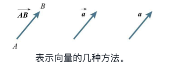

### 向量的坐标表示
把向量的箭头放在坐标平面上，就可以用坐标的形式表示向量。  
* 把箭头的起点放在原点，
* 用箭头终点的坐标表示向量，这叫作向量的坐标表示。  
用坐标表示的向量a如下所示（平面的情况）。
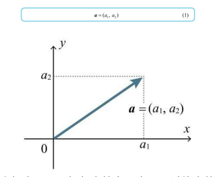
向量的坐标表示，即把起点放在原点，通过终点的坐标来表示。

### 向量的大小
从直观上来讲，表示向量的箭头的长度称为这个向量的大小。向量a的大小用|a|表示。
符号| |是由数的绝对值符号一般化而来的。实际上，数可以看成一维向量。
    * 在三维空间的情况下也是同样的。例如，如下求得右图所示的向量a=(1, 2, 2)的大小|a|。
    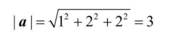
    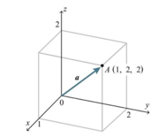
    * 例4、例5都使用了勾股定理。

    
### 向量的内积    
我们在考虑具有方向的向量的乘积时，包含了“方向与方向的乘积”这样不明确的概念。因此，我们需要一个新的定义——内积。  
两个向量a、b的内积a·b的定义如下所示。(内积的定义式(2))
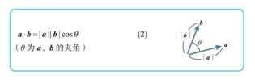
当a、b有一个为0或两者都为0时，内积定义为0。
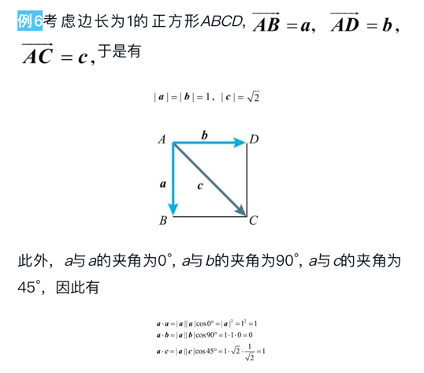
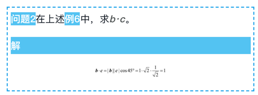
在三维空间的情况下也是同样的。
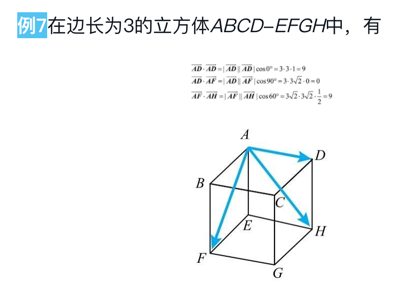
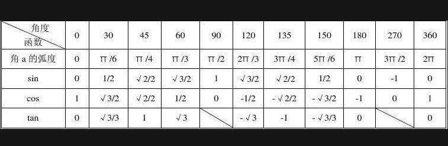
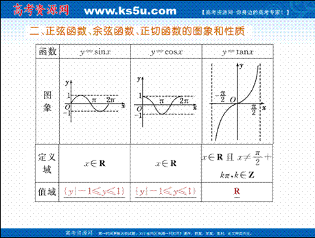
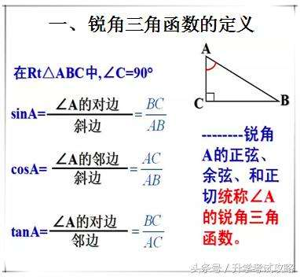

### 柯西-施瓦茨不等式

### 内积的坐标表示
下面我们使用坐标表示的方式来表示定义式(2)。

* 在平面的情况下，下式成立。

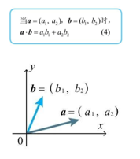
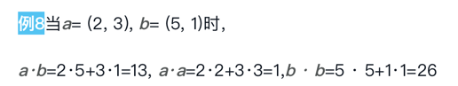

* 在三维空间的情况下，内积的坐标表示如下所示，只是在平面情况下的式(4)中添加了z分量。
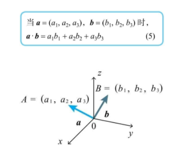

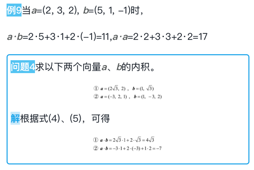

### 向量的一般化
