# Class
> [你不知道的JavaScript（上卷）](https://weread.qq.com/web/reader/8c632230715c01a18c683d8kf03328d0250f033ab37c722)

附录A ES6中的Class
* 可以用一句话总结本书的第二部分（第4章至第6章）：类是一种可选（而不是必须）的设计模式，而且在JavaScript这样的[[Prototype]]语言中实现类是很别扭的。
    * 第4章和第5章介绍了许多语法的缺点：
        * 繁琐杂乱的．prototype引用、
        * 试图调用原型链上层同名函数时的显式伪多态（参见第4章）以及不可靠、
        * 不美观而且容易被误解成“构造函数”的．constructor。
    * 除此之外，类设计其实还存在更深刻的问题。
    第4章指出，传统面向类的语言中父类和子类、子类和实例之间其实是复制操作，但是在[[Prototype]]中并没有复制，相反，它们之间只有委托关联。
* 对象关联代码和行为委托（参见第6章）使用了[[Prototype]]而不是将它藏起来，对比其简洁性可以看出，类并不适用于JavaScript。
* 介绍class的工作原理并分析class是否改进了之前提到的那些缺点
第6章中的Widget/Button例子
```javascript 1.8


class Widget {
    constructor(width, height) {
        this.width = width || 50;
        this.height = height || 50;
        this.$elem = null;
    }
    render($where) {
        if(this.$elem) {
            this.$elem.css({
                width: this.width + "px",
                height: this.height + "px"
            }).appendTo($where);
        
        }
    
    }


}
class Button extends Widget {
    constructor(width, height, label){
        super(width, height);
        this.label = label || "Default";
        this.$elem = $("<button>").text(this.label);
        
    }
    render($where){
    
        super.render($where);
        this.$elem.click(this.onClick.bind(this));
    }
    onClick(evt){
        console.log("Button '" + this.label + "' clicked!");
    }
}
``` 


> 《ES6标准入门》/阮一峰著.—3版.—北京：电子工业出版社，2017.9(kindle)

# 第19章 Class的基本语法
## 19.1 简介
* JavaScript语言的传统方法是通过构造函数定义并生成新对象。
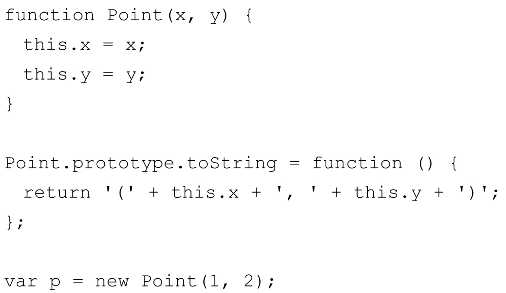

* ES6 提供了更接近传统语言的写法，引入了 Class（类）这个概念作为对象的模板。通过class关键字可以定义类。
上面的代码用ES6的“类”改写，就是下面这样。
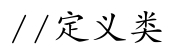
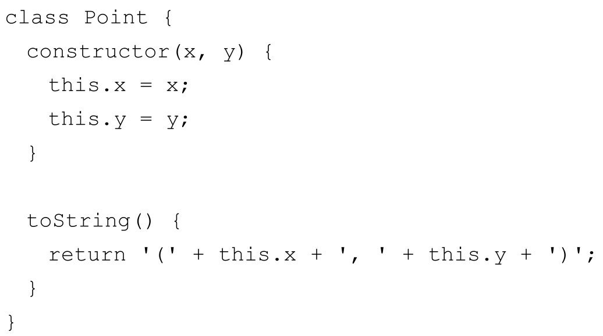
    * 上面的代码定义了一个 类，可以看到里面有一个constructor方法，这就是构造方法，
        也就是说，ES5的构造函数Point对应ES6的Point类的构造方法。
    * 而this关键字则代表实例对象。
    * Point类除了构造方法，还定义了一个toString方法。
* ES6的类完全可以看作构造函数的另一种写法。
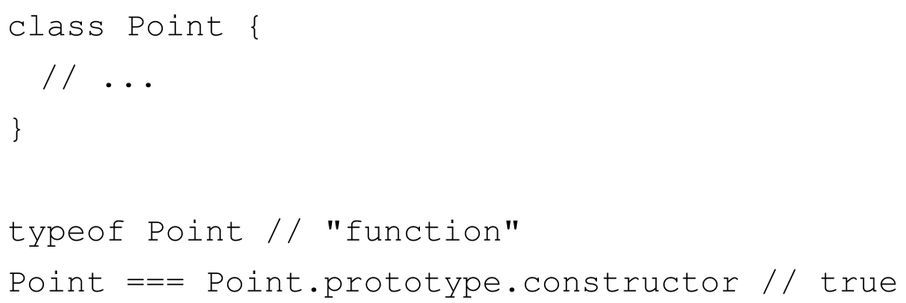
    * 类的数据类型就是函数，类本身就指向构造函数。
    * 使用的时候也是直接对类使用new命令，跟构造函数的用法完全一致。
    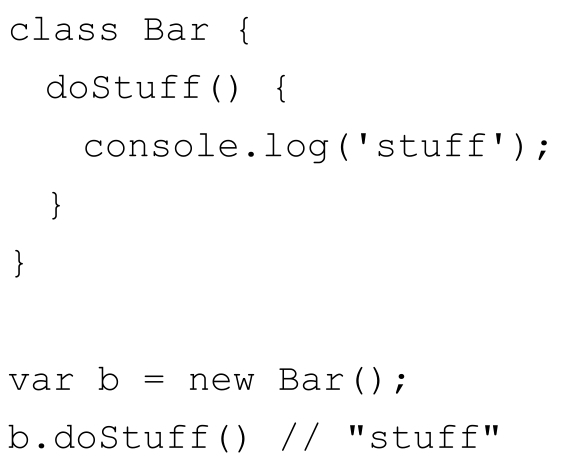
    
    * 构造函数的prototype属性在ES6的“类”上继续存在。事实上，类的所有方法都定义在类的prototype属性上。
    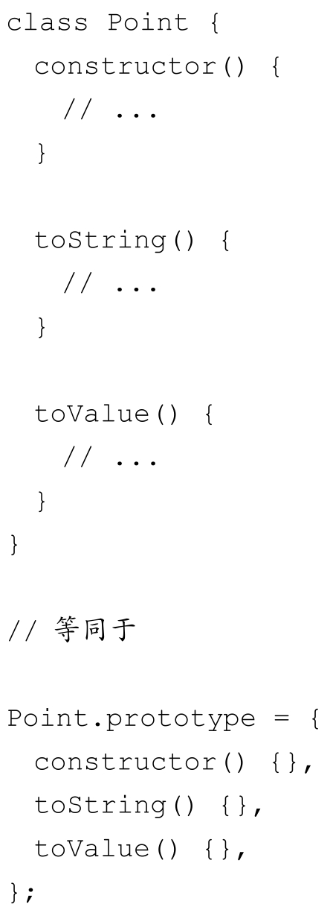
    在类的实例上调用方法，其实就是调用原型上的方法。
    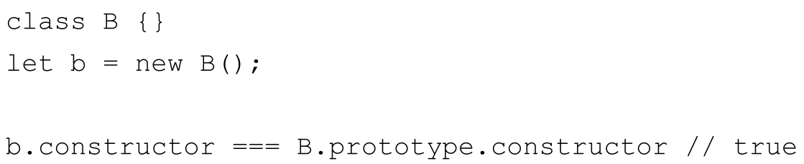
    b是B类的实例，它的constructor方法就是B类原型的constructor方法。
    * 由于类的方法（除constructor以外）都定义在prototype对象上，所以类的新方法可以添加在prototype对象上。
    Object.assign方法可以很方便地一次向类添加多个方法。
    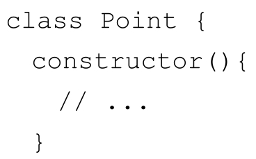
    * prototype对象的constructor属性直接指向“类”本身，这与ES5的行为是一致的。
    
    * 类的内部定义的所有方法都是不可枚举的（non-enumerable）。
    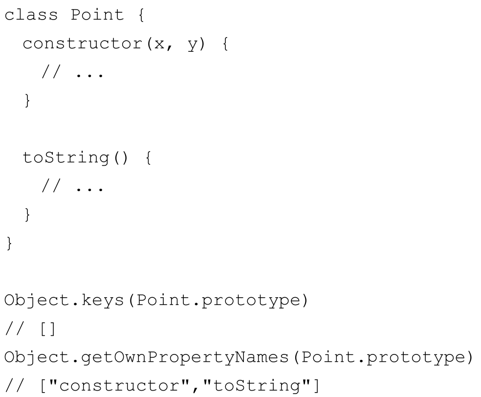
    toString方法是Point类内部定义的方法，它是不可枚举的。
        * 这一点与ES5的行为不一致。
        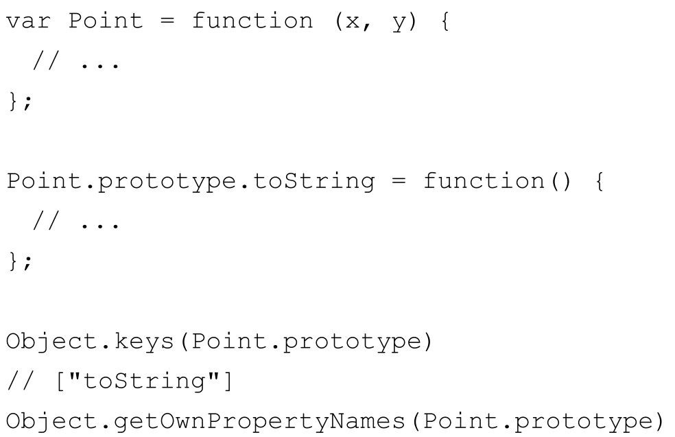
        上面的代码采用了ES5的写法，toString方法就是可枚举的。
    * 类的属性名可以采用表达式。
    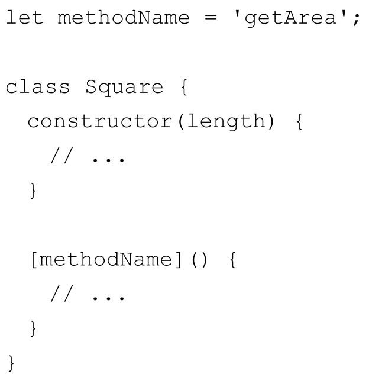
    Square类的方法名getArea是从表达式得到的。
    
## 19.2 严格模式
类和模块的内部默认使用严格模式，所以不需要使用use strict指定运行模式。只要将代码写在类或模块之中，那么就只有严格模式可用。
考虑到未来所有的代码其实都是运行在模块之中，所以ES6实际上已经把整个语言都升级到了严格模式下。    


## 19.3 constructor方法
* `constructor方法是类的默认方法，通过new命令生成对象实例时自动调用该方法。
* 一个类必须有constructor方法，如果没有显式定义，一个空的constructor方法会被默认添加。
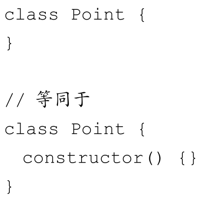
上面的代码中定义了一个空的类 Point，JavaScript 引擎会自动为它添加一个空的constructor方法。
* constructor方法默认返回实例对象（即this），不过完全可以指定返回另外一个对象。
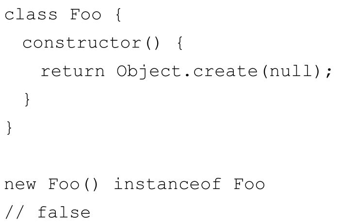
constructor函数返回一个全新的对象，结果导致实例对象不是Foo类的实例。

* 类必须使用new来调用，否则会报错。这是它跟普通构造函数的一个主要区别，后者不用new也可以执行。
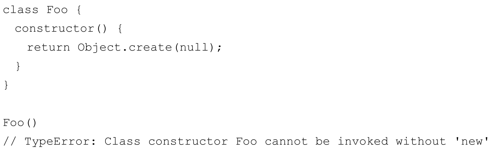


## 19.4 类的实例对象
* 生成实例对象的写法与ES5完全一样，也是使用new命令。如果忘记加上new，像函数那样调用Class将会报错。
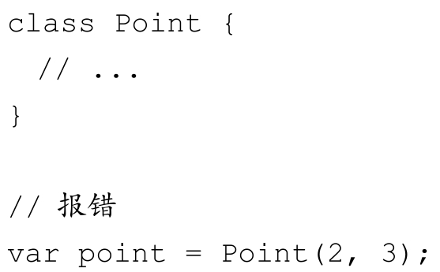
* 与ES5一样，实例的属性除非显式定义在其本身（即this对象）上，否则都是定义在原型（即Class）上。

x和y都是实例对象point自身的属性（因为定义在this变量上），所以hasOwnProperty方法返回true，而toString是原型对象的属性（因为定义在Point类上），所以hasOwnProperty方法返回false。这些都与ES5的行为保持一致。

* 与ES5一样，类的所有实例共享一个原型对象。
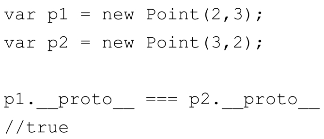
p1和p2都是Point的实例，它们的原型都是Point.prototype，所以__proto__属性是相等的。
这也意味着，可以通过实例的__proto__属性为 类 添加方法。
    * __proto__并不是语言本身的特性，而是各大厂商具体实现时添加的私有属性，虽然目前很多现代浏览器的JS引擎中都提供了这个私有属性，但依旧不建议在生产中使用该属性，避免对环境产生依赖。
    * 生产环境中，我们可以使用 Object.getPrototypeOf 方法来获取实例对象的原型，然后再来为原型添加方法/属性。
    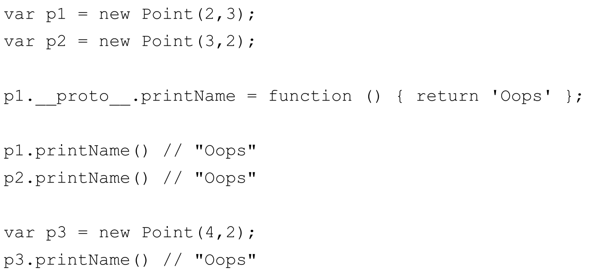
    在p1的原型上添加了一个printName方法，由于p1的原型就是p2的原型，因此p2也可以调用这个方法。而且，此后新建的实例p3也可以调用这个方法。
        * 使用实例的__proto__属性改写原型必须相当谨慎，不推荐使用，因为这会改变 Class的原始定义，影响到所有实例。

## 19.5 Class表达式
* 与函数一样，Class也可以使用表达式的形式定义。
    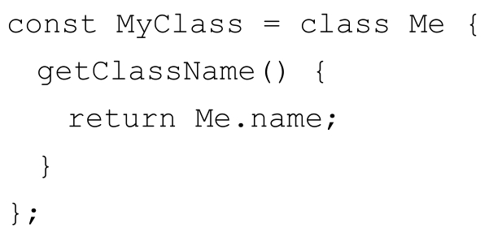
    * 使用表达式定义了一个类。
    * 需要注意的是，这个类的名字是 MyClass 而不是Me，
    * Me只在Class的内部代码可用，指代当前类。
    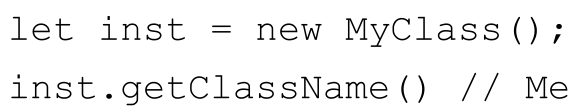
    Me只在Class内部有定义。
    * 如果Class内部没有用到，那么可以省略Me，也就是可以写成下面的形式。
    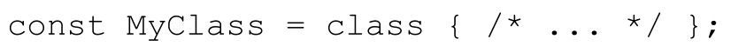
    * 采用Class表达式，可以写出立即执行的Class。
    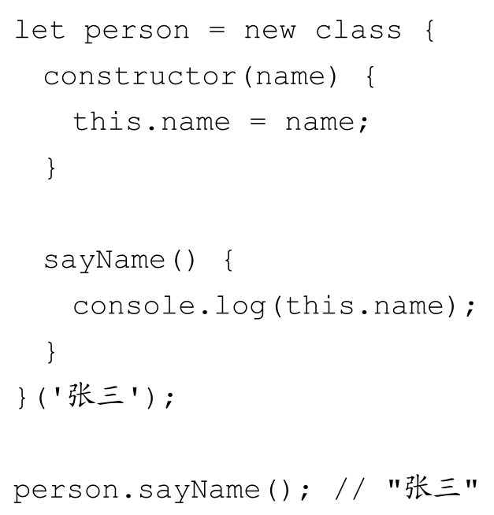
    person是一个立即执行的Class的实例。

## 19.6 不存在变量提升
* 类不存在变量提升（hoist），这一点与ES5完全不同。
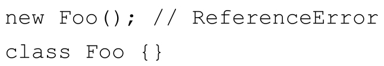
Foo类使用在前，定义在后，这样会报错，因为ES6不会把变量声明提升到代码头部。
* 这种规定的原因与下文要提到的继承有关，必须保证子类在父类之后定义。
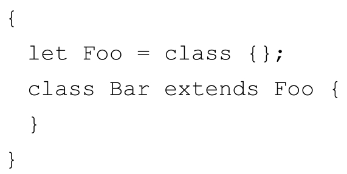
上面的代码不会报错，因为Bar 继承Foo的时候，Foo已经有定义了。
但是，如果存在class的提升，上面的代码就会报错，因为class会被提升到代码头部，而let命令是不提升的，所以导致Bar继承Foo的时候，Foo还没有定义。

## 19.7 私有方法
* 私有方法是常见需求，但ES6不提供，只能通过变通方法来模拟实现。
    * 一种做法是在命名上加以区别。
    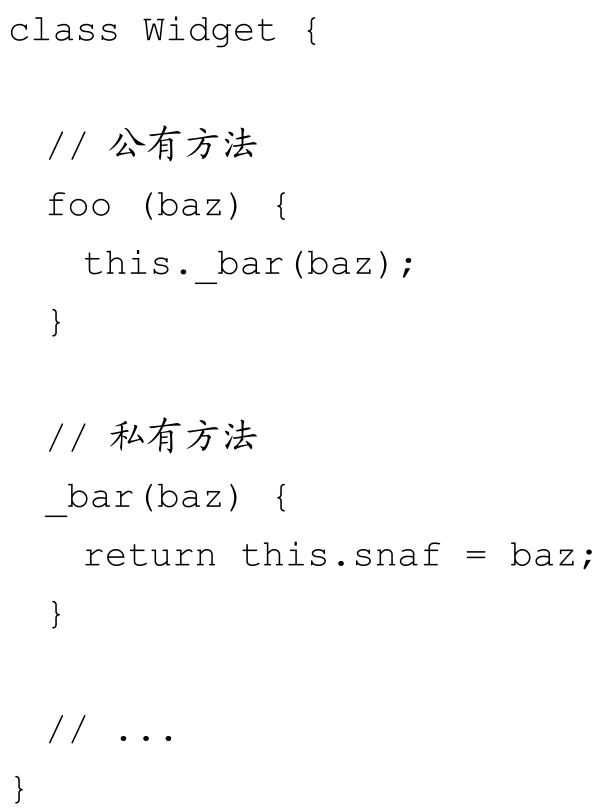
    _bar方法前面的下画线表示这是一个只限于内部使用的私有方法。但是，这种命名是不保险的，在类的外部依然可以调用这个方法。
    * 另一种方法是索性将私有方法移出模块，因为模块内部的所有方法都是对外可见的。
    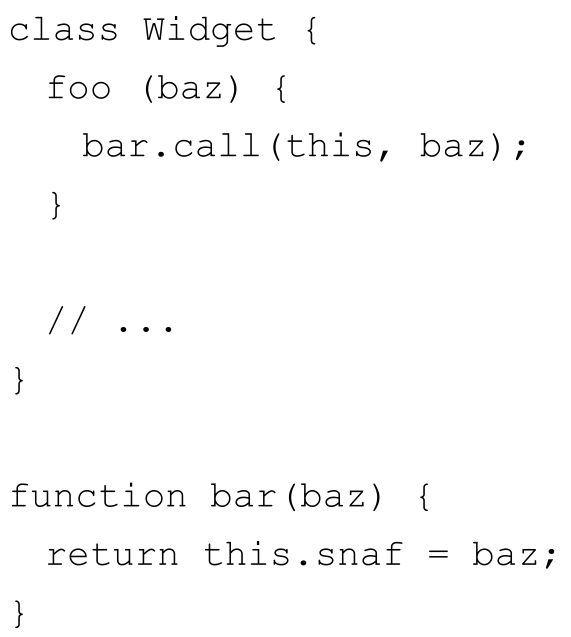
    foo是公有方法，内部调用了bar.call（this，baz）。这使得bar实际上成为了当前模块的私有方法。
    * 还有一种方法是利用Symbol值的唯一性将私有方法的名字命名为一个Symbol值。
    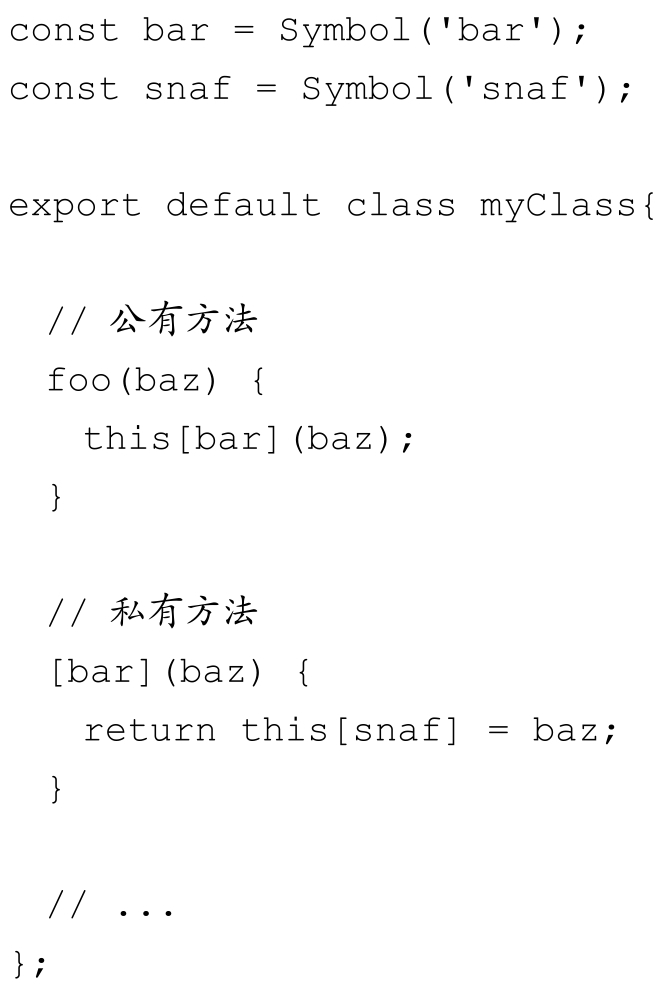
    bar和snaf都是Symbol值，导致第三方无法获取到它们，因此达到了私有方法和私有属性的效果。

## 19.8 私有属性
与私有方法一样，ES6不支持私有属性。
* 目前，有一个提案（github.com/tc39/proposal-class-fields＃private-fields）为class加了私有属性。方法是在属性名之前，使用＃来表示。
    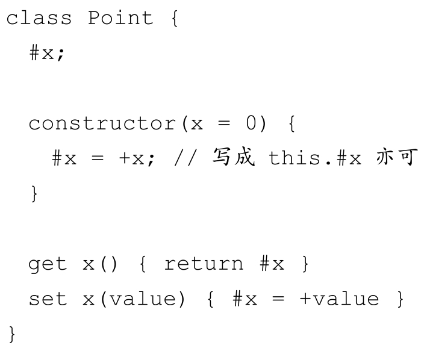
    * ＃x就表示私有属性x，在Point类之外是读取不到这个属性的。
    * 还可以看到，私有属性与实例的属性是可以同名的（比如，＃x与get x（））。
* 私有属性可以指定初始值在构造函数执行时进行初始化。
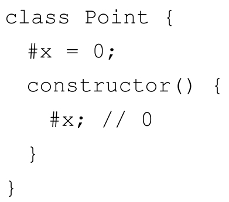
之所以要引入一个新的前缀＃来表示私有属性，而没有采用 private 关键字，是因为JavaScript是一门动态语言，使用独立的符号似乎是唯一可靠的方法，能够准确地区分一种属性是否为私有属性。另外，Ruby语言使用@表示私有属性，ES6没有用这个符号而使用＃，是因为@已经被留给了Decorator。
该提案只规定了私有属性的写法。但是，很自然地，它也可以用来编写私有方法。
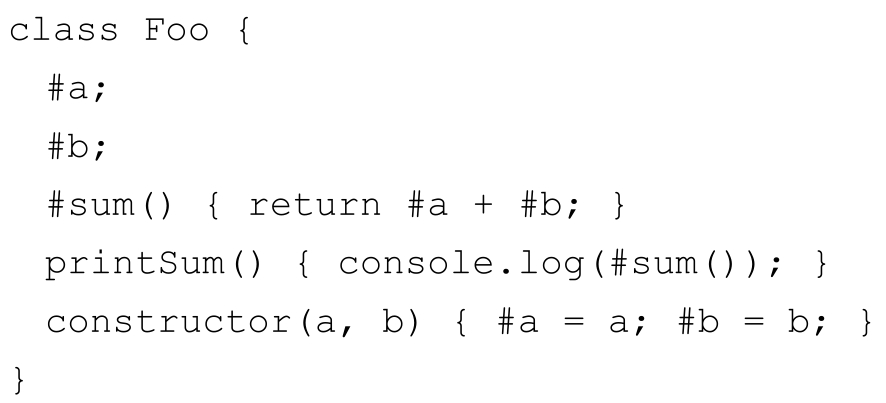

## 19.9 this的指向
* 类的方法内部如果含有 this，它将默认指向类的实例。但是，必须非常小心，一旦单独使用该方法，很可能会报错。
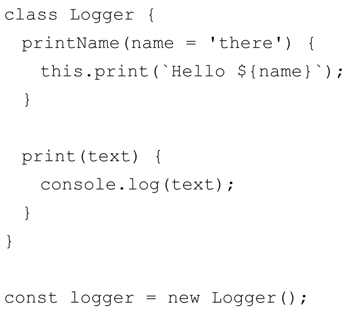
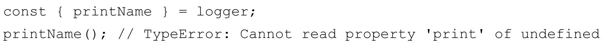
    * printName方法中的this默认指向Logger 类的实例。
    * 但是，如果将这个方法提取出来单独使用，this会指向该方法运行时所在的环境，因为找不到print方法而导致报错。
        * 一个比较简单的解决方法是，在构造方法中绑定this，这样就不会找不到print方法了。
        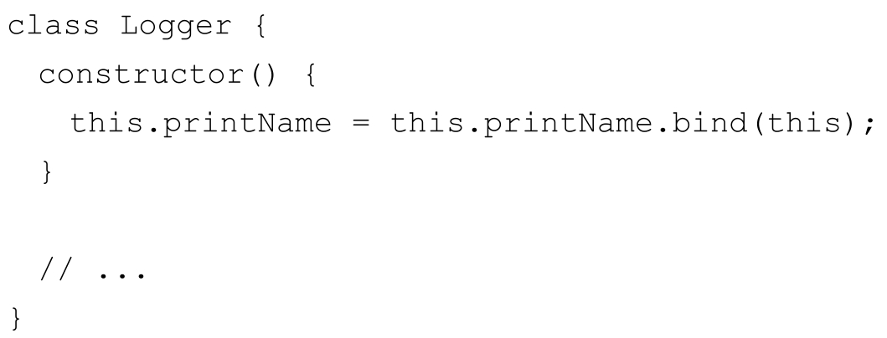
        * 另一种解决方法是使用箭头函数。
        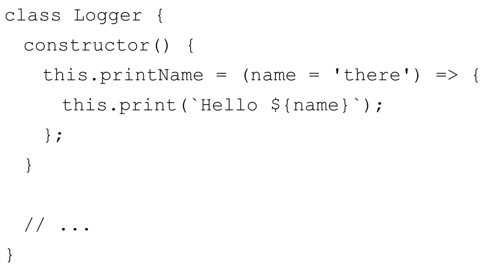
        * 还有一种解决方法是使用Proxy，在获取方法的时候自动绑定this。
        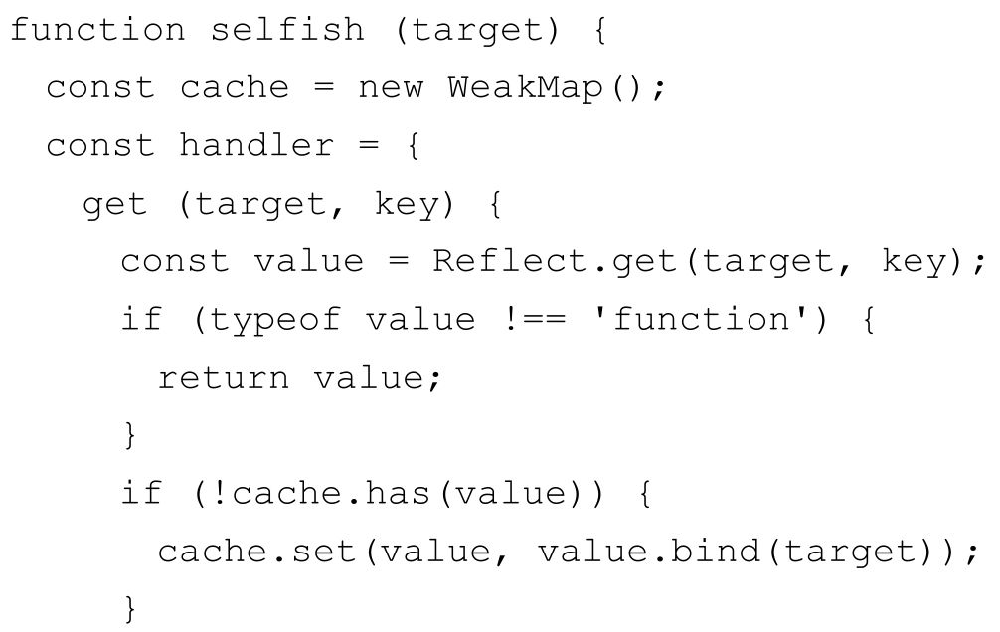

## 19.10 name属性
由于ES6的类只是ES5的构造函数的一层包装，所以函数的许多特性都被Class继承，包括name属性。
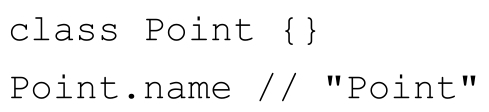
name属性总是返回紧跟在class关键字后面的类名。

## 19.11 Class的取值函数（getter）和存值函数（setter）
与ES5一样，在“类”的内部可以使用get和set关键字对某个属性设置存值函数和取值函数，拦截该属性的存取行为。
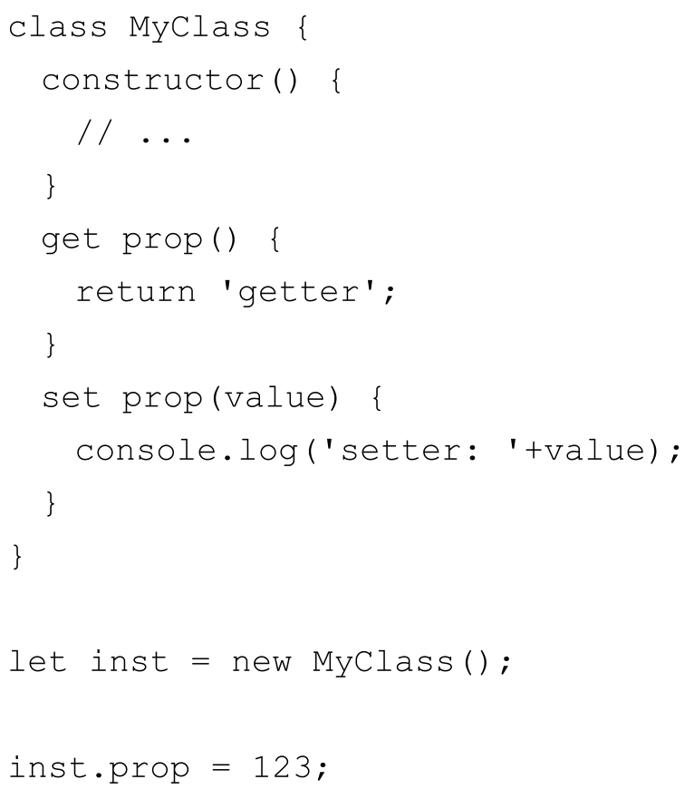

prop 属性有对应的存值函数和取值函数，因此赋值和读取行为都被自定义了。
存值函数和取值函数是设置在属性的Descriptor对象上的。
存值函数和取值函数是定义在html属性的描述对象上面，这与ES5完全一致。

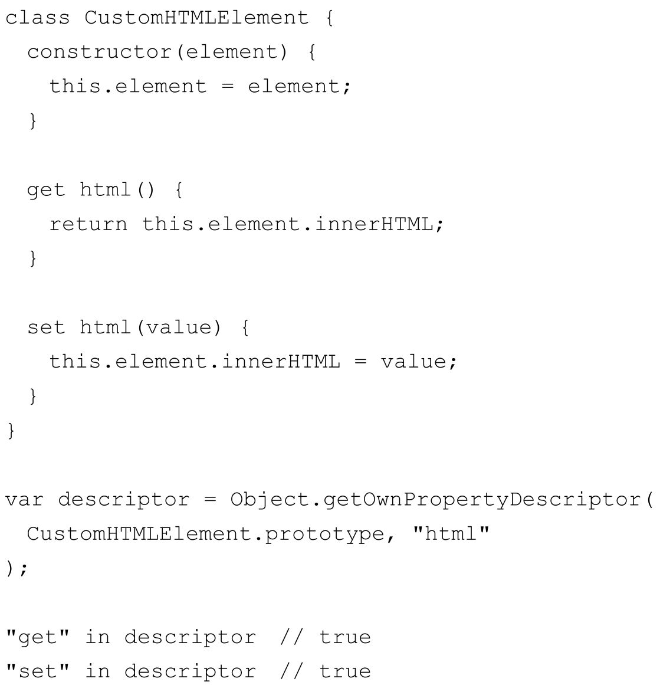

## 19.12 Class的Generator方法
如果某个方法之前加上星号（*），就表示该方法是一个Generator函数。
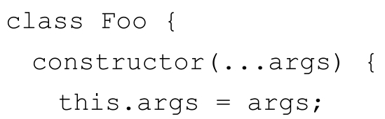

Foo 类的 Symbol.iterator 方法前有一个星号，表示该方法是一个Generator函数。Symbol.iterator方法返回一个Foo类的默认遍历器，for...of循环会自动调用这个遍历器。

## 19.13 Class的静态方法
类相当于实例的原型，所有在类中定义的方法都会被实例继承。如果在一个方法前加上static关键字，就表示该方法不会被实例继承，而是直接通过类调用，称为“静态方法”。

* Foo类的classMethod方法前有static关键字，表明该方法是一个静态方法，可以直接在Foo类上调用（Foo.classMethod（）），而不是在Foo类的实例上调用。
    * 如果在实例上调用静态方法，会抛出一个错误，表示不存在该方法。
    * 父类的静态方法可以被子类继承。
    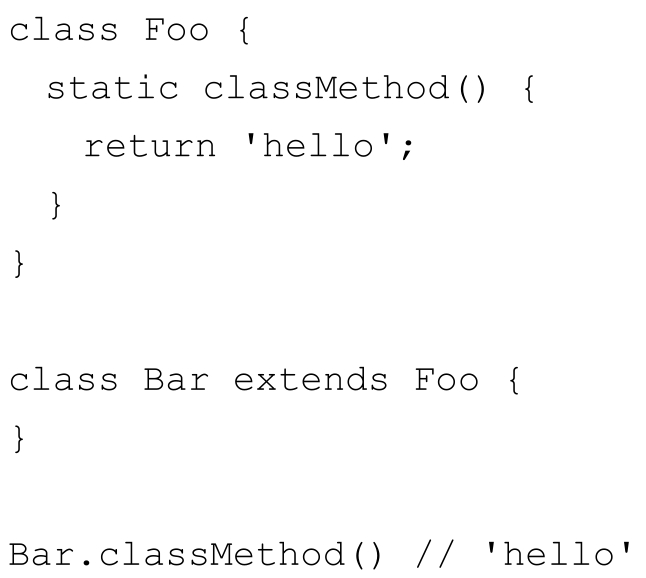
    父类Foo有一个静态方法，子类Bar可以调用这个方法。
    * 静态方法也可以从super对象上调用。
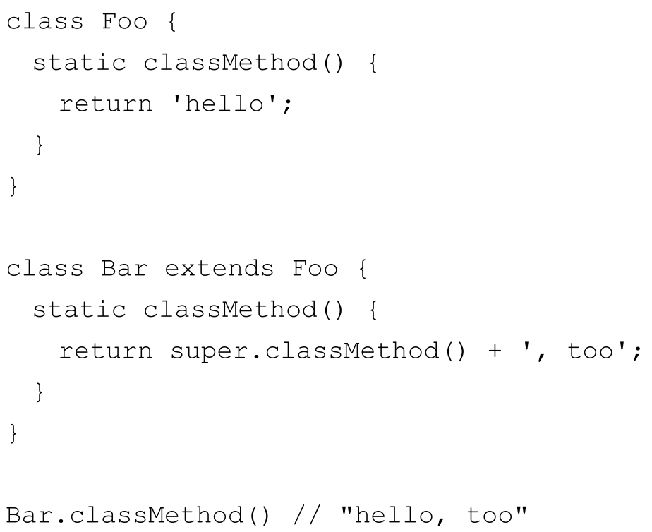

## 19.14 Class的静态属性和实例属性
静态属性指的是Class本身的属性，即Class.propname，而不是定义在实例对象（this）上的属性。
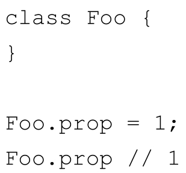
上面的写法可以读/写Foo类的静态属性prop。
目前，只有这种写法可行，因为ES6明确规定，Class内部只有静态方法，没有静态属性。
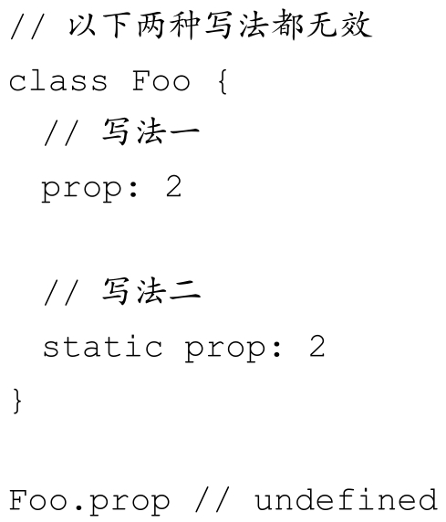
目前有一个关于静态属性的提案（github.com/tc39/proposal-class-fields），其中对实例属性和静态属性都规定了新的写法。

## 19.14.1 Class的实例属性
* Class的实例属性可以用等式写入类的定义之中。
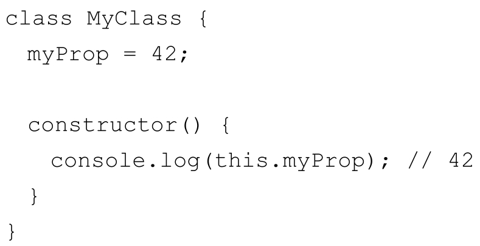
上面的代码中，myProp就是MyClass的实例属性。在MyClass的实例上可以读取这个属性。
* 以前，我们定义实例属性时只能写在类的constructor方法里面。
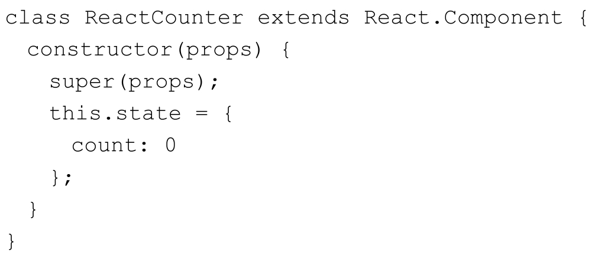
上面的代码中，构造方法constructor中定义了this.state属性。
有了新的写法以后，可以不在constructor方法里面定义。
这种写法比以前更清晰。
* 为了获得更强的可读性，对于那些在constructor里面已经定义的实例属性，新写法允许直接列出。


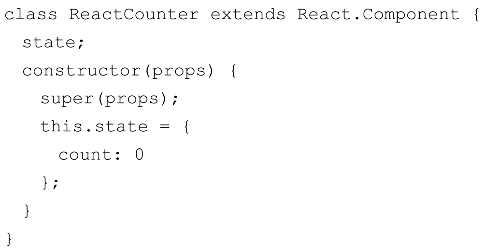

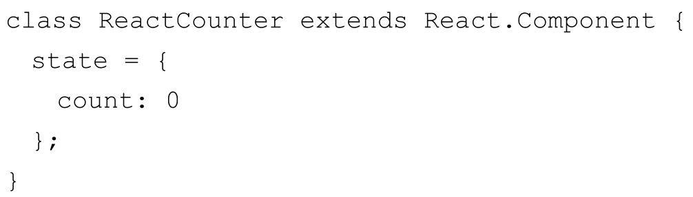

### ??? show(){  console.log(this.props) } 还是合并前的

## 19.14.2 Class的静态属性
Class的静态属性只要在上面的实例属性写法前面加上static关键字就可以了。
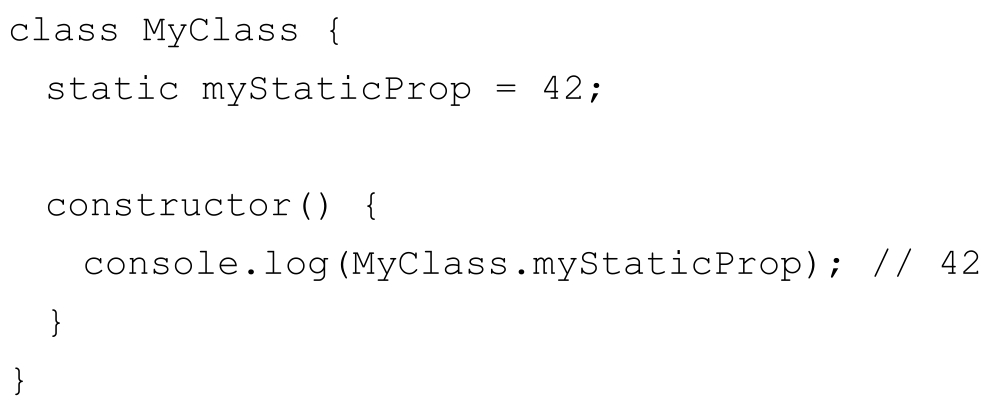
这个新写法大大方便了静态属性的表达。
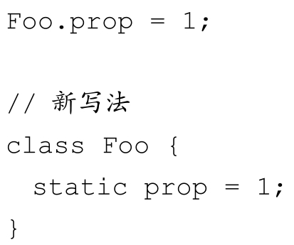
上面的代码中，旧写法的静态属性定义在类的外部。整个类生成以后再生成静态属性。这样很容易让人忽略这个静态属性，也不符合相关代码应该放在一起的代码组织原则。另外，新写法是显式声明（declarative），而不是赋值处理，语义更好。


## 19.15 new.target属性
new是从构造函数生成实例的命令。ES6为new命令引入了new.target属性，（在构造函数中）返回 new 命令所作用的构造函数。如果构造函数不是通过 new 命令调用的，那么new.target会返回undefined，因此这个属性可用于确定构造函数是怎么调用的。
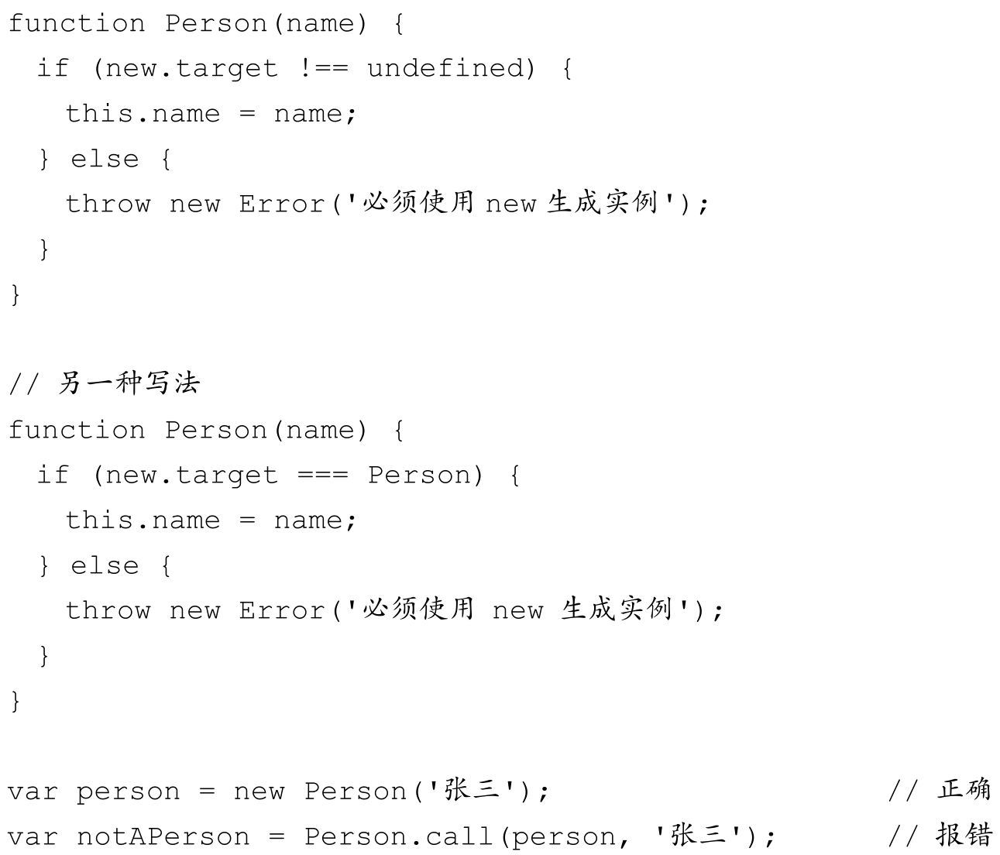
上面的代码确保了构造函数只能通过new命令调用。
* Class内部调用new.target，返回当前Class。


* 子类继承父类时new.target会返回子类。
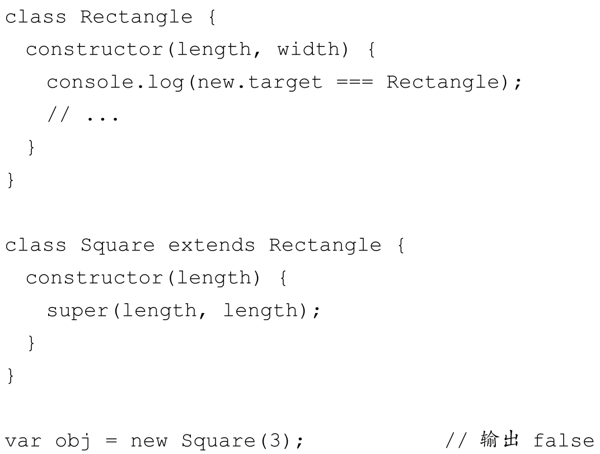
上面的代码中，new.target会返回子类。
* 利用这个特点，可以写出不能独立使用而必须继承后才能使用的类。
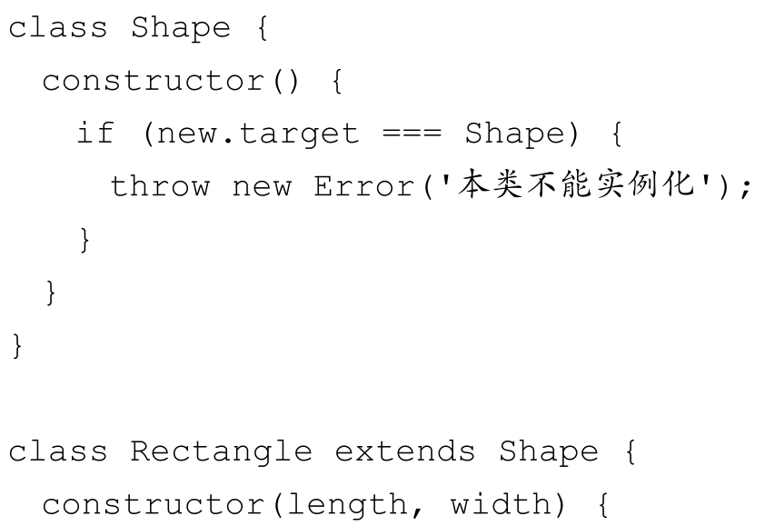
上面的代码中，Shape类不能被实例化，只能用于继承。
注意，在函数外部，使用new.target会报错。

# 第20章 Class的继承
## 20.1 简介
* Class可以通过extends关键字实现继承，这比ES5通过修改原型链实现继承更加清晰和方便。
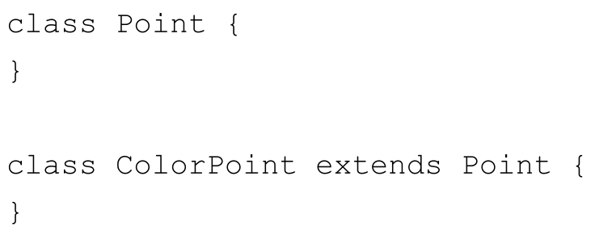
    * 面的代码定义了一个ColorPoint类，该类通过extends关键字继承了Point类的所有属性和方法。
    但是由于没有部署任何代码，所以这两个类完全一样，等于复制了一个Point类。
    下面，我们在ColorPoint内部加上代码。
    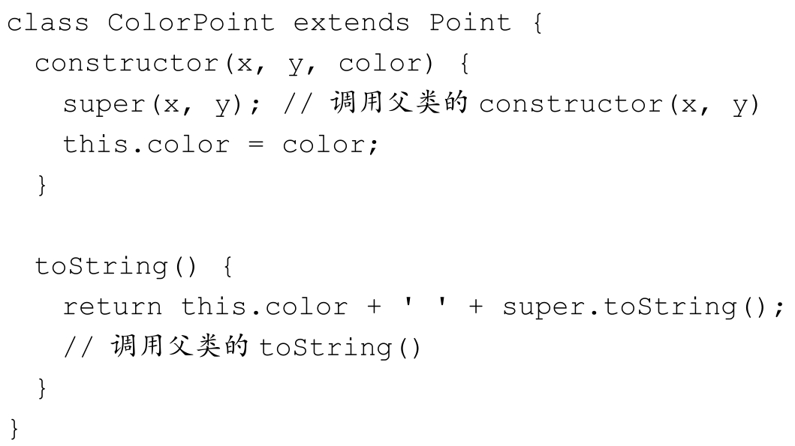
    * constructor方法和toString方法之中都出现了super 关键字，它在这里表示父类的构造函数，用来新建父类的this对象。
    * 子类必须在constructor方法中调用super方法，否则新建实例时会报错。
    这是因为子类没有自己的this对象，而是继承父类的this对象，然后对其进行加工。
    如果不调用super方法，子类就得不到this对象。
    * 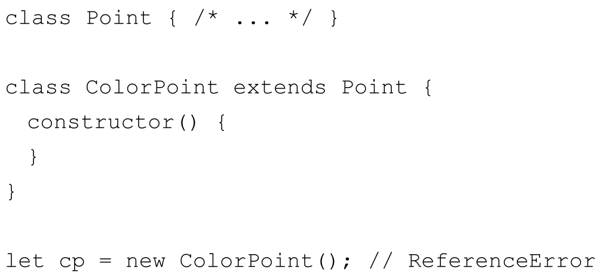
    上面的代码中，ColorPoint继承了父类Point，但是它的构造函数没有调用super方法，导致新建实例时报错。
* ES5 的继承实质是先创造子类的实例对象 this，然后再将父类的方法添加到 this 上面（Parent.apply（this））。
* ES6 的继承机制完全不同，实质是先创造父类的实例对象 this （所以必须先调用super方法），然后再用子类的构造函数修改this。
    * 在子类的构造函数中，只有调用super之后才可以使用this关键字，否则会报错。这是因为子类实例的构建是基于对父类实例加工，只有super方法才能返回父类实例。
    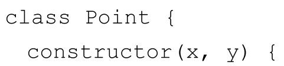
    * 子类的constructor方法没有调用super之前就使用了this关键字，结果报错，而放在super方法之后就是正确的。
    * 下面是生成子类实例的代码。
    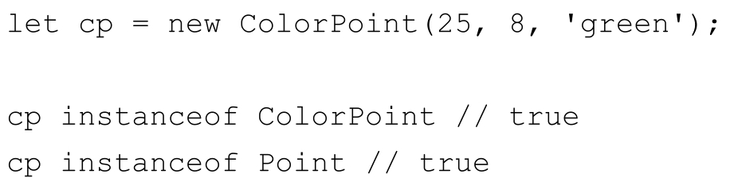
    上面的代码中，实例对象cp同时是ColorPoint和Point两个类的实例，这与ES5的行为完全一致。
    
* 如果子类没有定义constructor方法，那么这个方法会被默认添加，代码如下。也就是说，无论有没有显式定义，任何一个子类都有constructor方法。
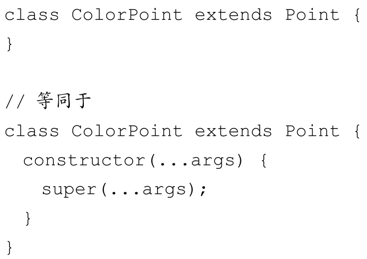


## 20.2 Object.getPrototypeOf()
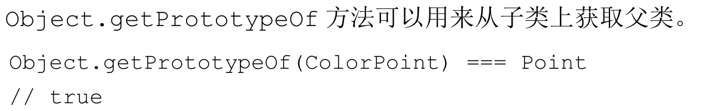
可以使用这个方法判断一个类是否继承了另一个类。


## 20.3 super关键字
super这个关键字既可以当作函数使用，也可以当作对象使用。在这两种情况下，它的用法完全不同。
* 第一种情况，super作为函数调用时代表父类的构造函数。ES6要求，子类的构造函数必须执行一次super函数。
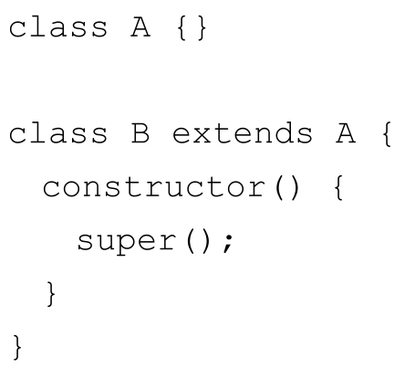
子类B的构造函数中的super（）代表调用父类的构造函数。这是必须的，否则JavaScript引擎会报错。
super虽然代表了父类A的构造函数，但是返回的是子类B的实例，即super内部的this指的是B，因此super（）在这里相当于A.prototype.constructor.call（this）。
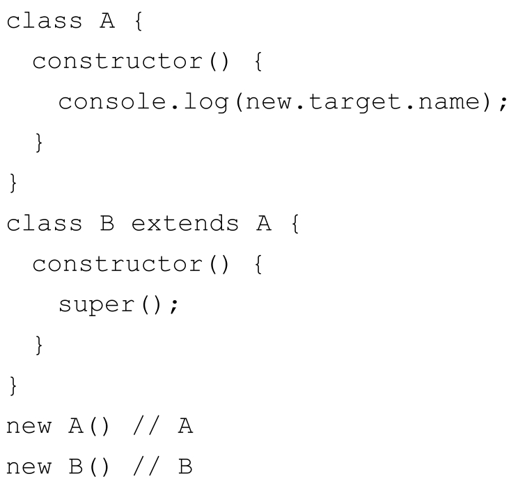
new.target指向当前正在执行的函数。可以看到，在super（）执行时，它指向的是子类B的构造函数，而不是父类A的构造函数。也就是说，super（）内部的this指向的是B。


* 作为函数时，super（）只能用在子类的构造函数之中，用在其他地方就会报错。
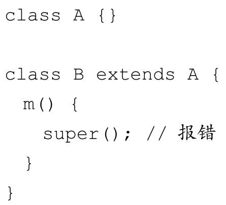
super（）用在B类的m方法之中就会造成句法错误。

第二种情况，super 作为对象时在普通方法中指向父类的原型对象；在静态方法中指向父类。
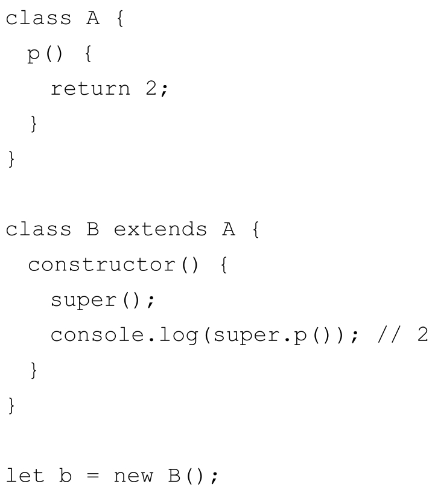
子类B中的super.p（）就是将super当作一个对象来使用。这时，super在普通方法之中指向A.prototype，所以super.p（）就相当于A.prototype.p（）。
* 由于 super 指向父类的原型对象，所以定义在父类实例上的方法或属性是无法通过super调用的。
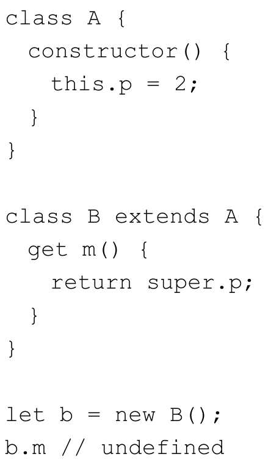
    * p是父类A实例的属性，因此super.p就引用不到它。
    * 如果属性定义在父类的原型对象上，super就可以取到。
    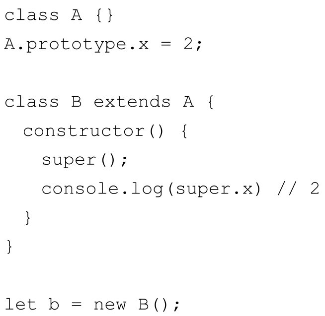    
    属性x是定义在A.prototype上面的，所以super.x可以取到它的值。
* ES6规定，通过super调用父类的方法时，super会绑定子类的this。
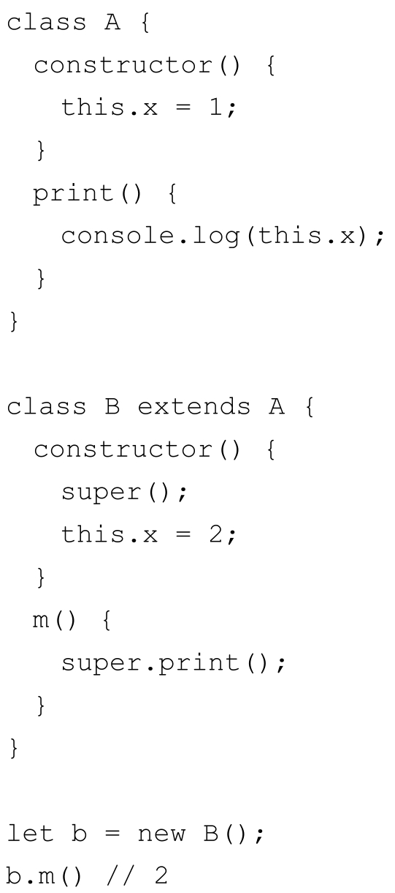
super.print（）虽然调用的是 A.prototype.print（），但是 A.prototype.print（）会绑定子类 B 的this，导致输出的是2，而不是1。也就是说，实际上执行的是super.print.call（this）。
由于绑定子类的this，因此如果通过super对某个属性赋值，这时super就是this，赋值的属性会变成子类实例的属性。
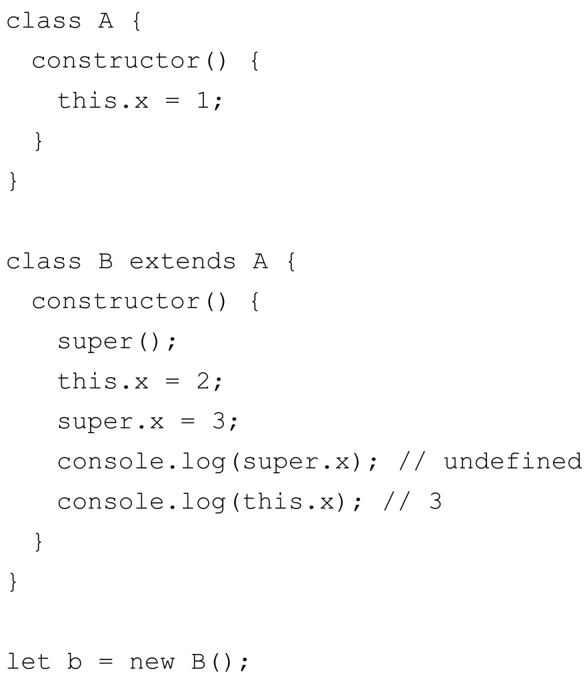
super.x被赋值为3，等同于对this.x赋值为3。当读取super.x时，相当于读取的是A.prototype.x，所以返回undefined。
* 如果super作为对象用在静态方法之中，这时super将指向父类，而不是父类的原型对象。
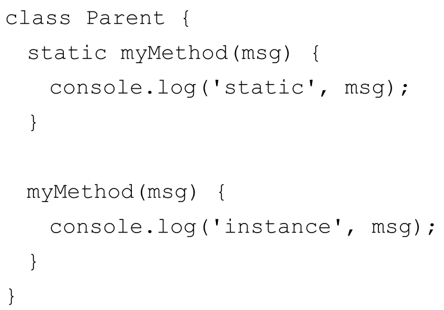
super在静态方法之中指向父类，在普通方法之中指向父类的原型对象。

* 使用super的时候，必须显式指定是作为函数还是作为对象使用，否则会报错。
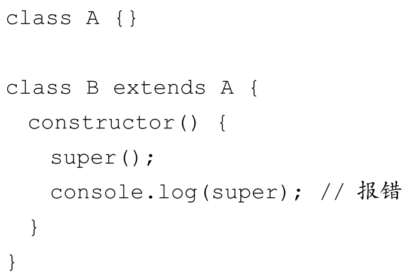
console.log（super）当中的super无法看出是作为函数使用还是作为对象使用，所以JavaScript引擎解析代码的时候就会报错。
这时，如果能清晰地表明super的数据类型，就不会报错。
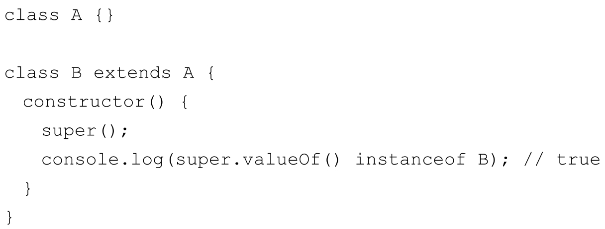
let b=new B();

super.valueOf（）表明super是一个对象，因此不会报错。同时，由于super绑定B的this，所以super.valueOf（）返回的是一个B的实例。

* 由于对象总是继承其他对象的，所以可以在任意一个对象中使用super关键字。
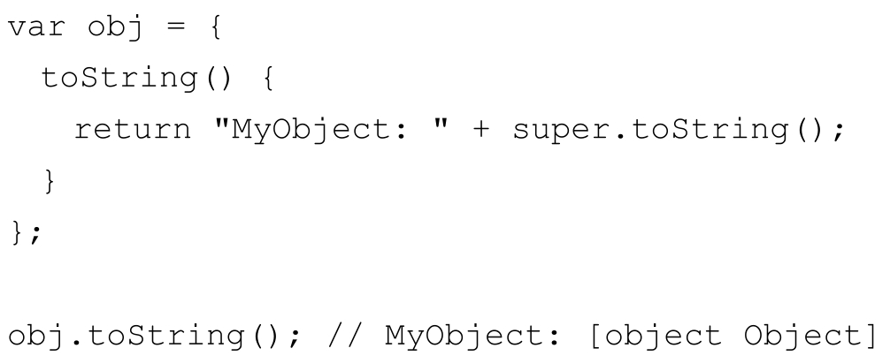


## 20.4 类的prototype属性和__proto__属性
* 在大多数浏览器的ES5实现之中，每一个对象都有__proto__属性，指向对应的构造函数的prototype属性。Class作为构造函数的语法糖，同时有prototype属性和__proto__属性，因此同时存在两条继承链。
    * 子类的__proto__属性表示构造函数的继承，总是指向父类。
    * 子类 prototype 属性的__proto__属性表示方法的继承，总是指向父类的prototype属性。
    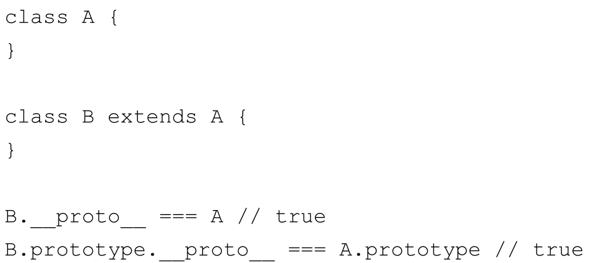
        * 子类 B 的__proto__属性指向父类 A，
        * 子类 B 的 prototype 属性的__proto__属性指向父类A的prototype属性。
* 造成这样的结果是因为类的继承是按照下面的模式实现的。
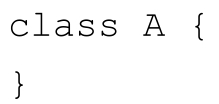
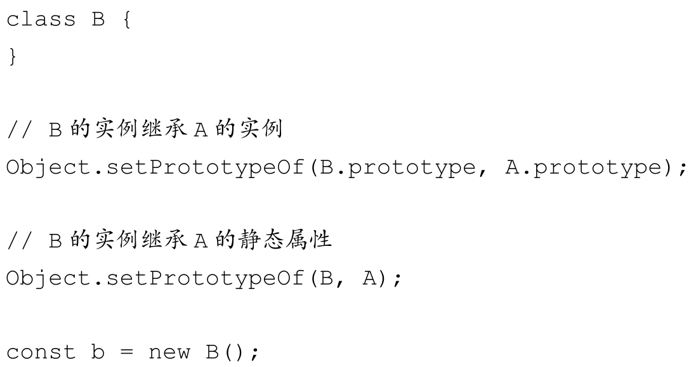
第9章中给出过Object.setPrototypeOf方法的实现。
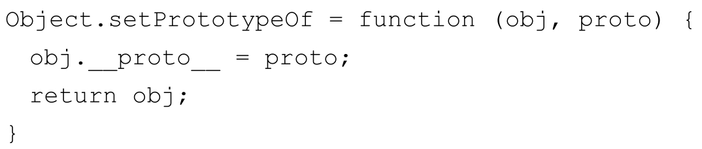
因此可以得到上面的结果。
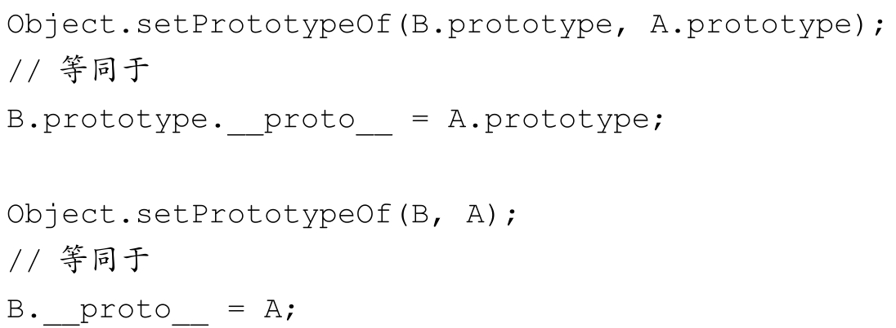
* 这两条继承链可以这样理解：
    * 作为一个对象，子类（B）的原型（__proto__属性）是父类（A）；
    * 作为一个构造函数，子类（B）的原型（prototype属性）是父类的实例。
    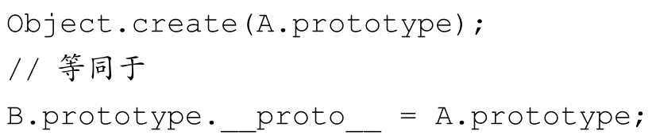
    
### 20.4.1 extends的继承目标
* extends关键字后面可以跟多种类型的值。
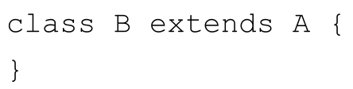
上面代码的 A 只要是一个有 prototype 属性的函数，就能被 B 继承。
由于函数都有prototype属性（除了Function.prototype函数），因此A可以是任意函数。
* 下面，讨论3种特殊情况。
    1. 第一种特殊情况，子类继承Object类。
    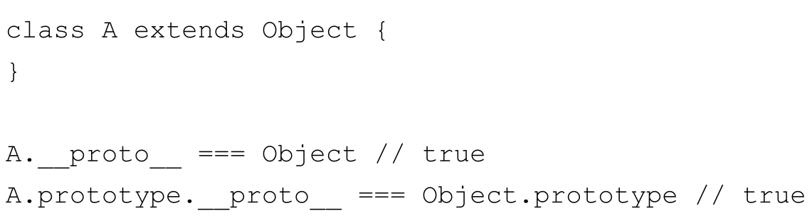
    这种情况下，A其实就是构造函数Object的复制，A的实例就是Object的实例。
    2. 第二种特殊情况，不存在任何继承。
    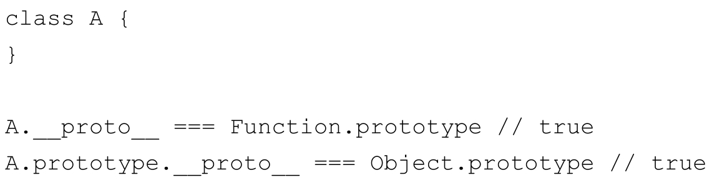
    这种情况下，A 作为一个基类（即不存在任何继承）就是一个普通函数，所以直接继承Function.prototype。但是，A 调用后返回一个空对象（即 Object 实例），所以A.prototype.__proto__指向构造函数（Object）的prototype属性。
    3. 第三种特殊情况，子类继承null。
    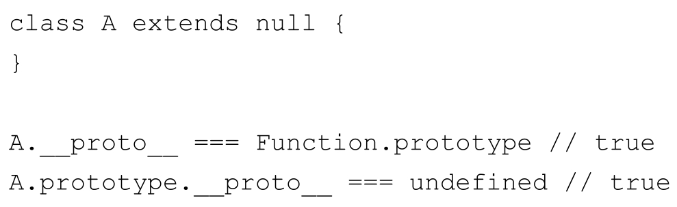
    这种情况与第二种情况非常像。A 也是一个普通函数，所以直接继承 Function.prototype。但是，A 调用后返回的对象不继承任何方法，所以它的__proto__指向Function.prototype，即实质上执行了下面的代码。
    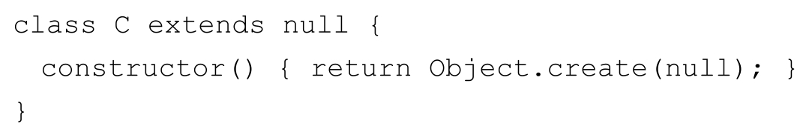

### 20.4.2 实例的__proto__属性
子类实例的__proto__属性的__proto__属性指向父类实例的__proto__属性。也就是说，子类的原型的原型是父类的原型。
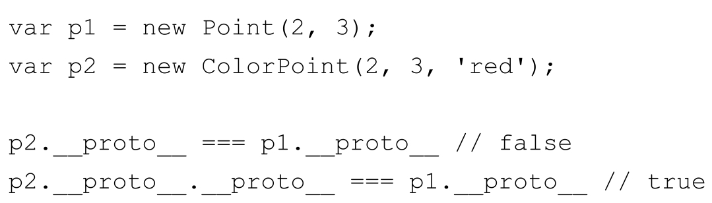
上面的代码中，ColorPoint继承了Point，导致前者原型的原型是后者的原型。
因此，可以通过子类实例的__proto__.__proto__属性修改父类实例的行为。

上面的代码在ColorPoint的实例p2上向Point类中添加方法，结果影响到了Point的实例p1。

## 20.5 原生构造函数的继承
原生构造函数是指语言内置的构造函数，通常用来生成数据结构。
ECMAScript的原生构造函数大致有下面这些。
    · Boolean()
    · Number()
    · String()
    · Array()
    · Date()
    · Function()
    · RegExp()
    · Error()
    · Object()


# 展开
{...objA, ...objB} 合并在一起了


# 解构
>[你不知道的JavaScript（下卷）](https://weread.qq.com/web/reader/c1232d00715c016fc1234b3kc81322c012c81e728d9d180)
第2章 语法
2.4 解构


# [javascript – ES6类：在方法上应用’addEventListener’访问’this’](http://www.voidcn.com/article/p-oomcqune-byz.html)
* this.boundSayHello = evt => this.sayHello(evt);
  this.elm.addEventListener('click', this.boundSayHello);
  this.elm.removeEventListener('click', this.boundSayHello);
* this.sayHello = this.sayHello.bind(this);
  this.elm.addEventListener('click', this.sayHello);
  this.elm.removeEventListener('click', this.sayHello);
  
# bind ???


# Object.keys ???
