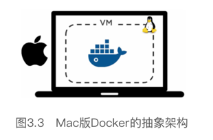

> [《深入浅出Docker》2019-04-01](https://weread.qq.com/web/reader/a6332ce0718b75f2a63b772)

# 第3章　Docker安装

* 安装Docker的场景和方式简直是数不胜数。
    * 有很多种方式和场景可以安装Docker。Docker可以安装在Windows、Mac，当然还有Linux之上。除此之外还可以在云上安装，也可以在个人笔记本电脑上安装，诸如此类的例子有很多。
    * 除了前面提到的各种安装场景之外，读者还可以选择不同方式完成Docker安装，包括
        * 手工安装
        * 通过脚本方式安装
        * 通过向导方式安装等。

* ·Mac版Docker（Docker for Mac）。
在Mac版Docker当中，Docker daemon是运行在一个轻量级的Linux VM之上的。  
* Mac版Docker通过对外提供daemon和API的方式与Mac环境实现无缝集成。  
这意味着读者可以在Mac上打开终端并直接使用Docker命令。  
* Mac版Docker只能运行基于Linux的Docker容器。
不过这样已经很好了，因为大部分容器实际上都是基于Linux的。

* 一个活动的鲸鱼图标会在屏幕上方状态栏中出现。  
一旦Docker成功运行，鲸鱼图标就静止了。  
读者可以单击鲸鱼图标来管理DfM。

* DfM现在已经安装完成，读者可以打开一个终端，并运行一些常用的Docker指令。尝试运行下面的命令。
$ docker version
    * Server的OS/Arch属性中显示的值是linux/amd64。这是因为daemon是基于前文提到过的Linux VM运行的。
    * 除此之外，还需要注意当前Docker版本是一个实验性质的版本（Experimental: true）。
$ docker image ls
$ docker container ls

* 下面的3条命令向读者展示了如何确认这些组件是否成功安装，以及组件的版本信息。
Mac版Docker安装了Docker引擎（客户端以及服务端守护程序）、Docker Compose、Docker machine以及Notary命令行。
$ docker --version
$ docker-compose --version
$ docker-machine --version
$ notary version

* 3.5　Docker引擎（Engine）升级
升级Docker引擎（Engine）是一项重要的任务，尤其是生产环境。

## 3.6　Docker存储驱动的选择
* 每个Docker容器都有一个本地存储空间，用于保存层叠的镜像层（Image Layer）以及挂载的容器文件系统。  
默认情况下，容器的所有读写操作都发生在其镜像层上或挂载的文件系统中，所以存储是每个容器的性能和稳定性不可或缺的一个环节。
* 以往，本地存储是通过存储驱动（Storage Driver）进行管理的，有时候也被称为Graph Driver或者GraphDriver。  
虽然存储驱动在上层抽象设计中都采用了栈式镜像层存储和写时复制（Copy-on-Write）的设计思想，但是Docker在Linux底层支持几种不同的存储驱动的具体实现，每一种实现方式都采用不同方法实现了镜像层和写时复制。  
虽然底层实现的差异不影响用户与Docker之间的交互，但是对Docker的性能和稳定性至关重要。
* 在Linux上，Docker可选择的一些存储驱动包括
    * AUFS（最原始也是最老的）
    * Overlay2（可能是未来的最佳选择）
    * Device Mapper
    * Btrfs和ZFS。
* Docker在Windows操作系统上只支持一种存储驱动，即
    * Windows Filter。
