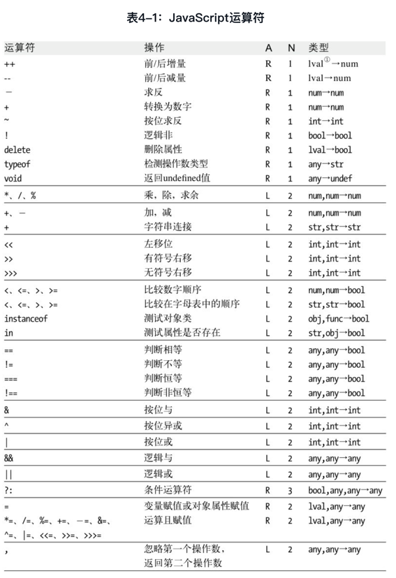

> [JavaScript权威指南（第6版）](https://weread.qq.com/web/reader/0513214059343c051f11bc8kc81322c012c81e728d9d180)


# 第一部分JavaScript语言核心

## 第3章 类型、值和变量

### 3.10 变量作用域
在函数内声明的变量只在函数体内有定义。它们是局部变量，作用域是局部性的。  
函数参数也是局部变量，它们只在函数体内有定义。
在函数体内，局部变量的优先级高于同名的全局变量。
尽管在全局作用域编写代码时可以不写var语句，但声明局部变量时则必须使用var语句。
函数定义是可以嵌套的。由于每个函数都有它自己的作用域，因此会出现几个局部作用域嵌套的情况。

* 函数作用域和声明提前  
JavaScript中没有块级作用域。    
JavaScript取而代之地使用了函数作用域（function scope）：变量在声明它们的函数体以及这个函数体嵌套的任意函数体内都是有定义的。    
由于JavaScript没有块级作用域，因此一些程序员特意将变量声明放在函数体顶部，而不是将声明靠近放在使用变量之处。这种做法使得他们的源代码非常清晰地反映了真实的变量作用域。    

* 作为属性的变量  
当声明一个JavaScript全局变量时，实际上是定义了全局对象的一个属性（见3.5节）。  
当使用var声明一个变量时，创建的这个属性是不可配置的（见6.7节），也就是说这个变量无法通过delete运算符删除。  
可能你已经注意到了，如果你没有使用严格模式并给一个未声明的变量赋值的话，JavaScript会自动创建一个全局变量。以这种方式创建的变量是全局对象的正常的可配值属性，并可以删除它们：    

```javascript
var truevar = 1; // 声明一个不可删除的全局变量
fakevar = 2; // 创建全局对象的一个可删除的属性
this.fakevar2 = 3; // 同上
delete truevar // => false: 变量并没有被删除
delete fakevar // => true: 变量并没有被删除
delete this.fakevar2 // => true: 变量被删除

```
* JavaScript全局变量是全局对象的属性，这是在ECMAScript规范中强制规定的。  
* 对于局部变量则没有如此规定，但我们可以想象得到，局部变量当做跟函数调用相关的某个对象的属性。
  * ECMAScript 3规范称该对象为“调用对象”(call object)，  
  * ECMAScript 5规范称为“声明上下文对象”（declarative environment record）。
* JavaScript可以允许使用this关键字来引用全局对象，却没有方法可以引用局部变量中存放的对象。这种存放局部变量的对象的特有性质，是一种对我们不可见的内部实现。然而，这些局部变量对象存在的观念是非常重要的，我们会在下一节展开讲述。


## 第4章表达式和运算符

###  4.7 运算符概述

#### 4.7.5 运算符优先级


### 4.13 其他运算符

#### 4.13.4 void运算符
* void是一元运算符，它出现在操作数之前，操作数可以是任意类型。这个运算符并不是经常使用：操作数会照常计算，但忽略计算结果并返回undefined。由于void会忽略操作数的值，因此在操作数具有副作用的时候使用void来让程序更具语义。  
* 这个运算符最常用在客户端的URL——javascript:URL中，在URL中可以写带有副作用的表达式，而void则让浏览器不必显示这个表达式的计算结果。例如，经常在HTML代码中的`<a>`标签里使用void运算符：  
```html
<a href="javascript:void window.open();">打开一个新窗口</a>
```
window.open()返回Window对象
通过给`<a>`的onclick绑定一个事件处理程序要比在href中写“javascript:URL”要更加清晰，当然，这样的话void操作符就可有可无了。


>[JavaScript权威指南（第6版）](https://weread.qq.com/web/reader/0513214059343c051f11bc8k32b321d024832bb90e89958)

## 第7章数组

### 7.11 类数组对象															
* JavaScript数组的有一些特性是其他对象所没有的：															
	* 当有新的元素添加到列表中时，自动更新length属性。														
	* 设置length为一个较小值将截断数组。														
	* 从Array.prototype中继承一些有用的方法。														
	* 其类属性为“Array”。														
	这些特性让JavaScript数组和常规的对象有明显的区别。														
	但是它们不是定义数组的本质特性。														
	一种常常完全合理的看法把拥有一个数值length属性和对应非负整数属性的对象看做一种类型的数组。														
* 实践中这些“类数组”对象实际上偶尔出现，															
	虽然不能在它们之上直接调用数组方法或者期望length属性有什么特殊的行为，														
	但是仍然可以用针对真正数组遍历的代码来遍历它们。														
    结论就是很多数组算法针对类数组对象工作得很好，就像针对真正的数组一样。													
    如果算法把数组看成只读的或者如果它们至少保持数组长度不变，也尤其是这种情况。													
* 以下代码为一个常规对象增加了一些属性使其变成类数组对象，然后遍历生成的伪数组的“元素”：			
	```javascript												
	var a = {}; // 从一个常规空对象开始														
	// 添加一些属性，称为“类数组”														
	var i = 0;														
	while(i < 10) {														
		a[i] = i * i;													
		i++;													
	}														
	a.length = i;														
	// 现在，当做真正的数组遍历它														
	var total = 0;														
	for(var j = 0; j < a.length; j++)														
		total += a[j];								
	```						
	8.3.2节描述的Arguments对象就是一个类数组对象。														
	在客户端JavaScript中，一些DOM方法（如document.getElementsByTagName（））也返回类数组对象。														
* 下面有一个函数可以用来检测类数组对象：	
	```javascript														
	// 判定o是否是一个类数组对象														
	// 字符串和函数有length属性，但是它们可以用typeof检测将其排除。在客户端JavaScript中，DOM文本节点也有length属性，需要用额外判断o.nodeType != 3 将其排除														
	function isArrayLike(o){														
		if(o &&			// o非null、undefined等										
			 typeof o === "object"  &&								// o是对象				
			isFinite(o.lenght) &&								// o.length是有限数值				
			o.length >= 0 &&								// o.length为非负值				
			o.length === Math.floor(o.length) &&												// o.length是整数
			o.length < 4294967296)							// o.length< 2^32					
			return true; // o是类数组对象 												
		else													
			return false; // 否则它不是												
	}								
	```						
	将在7.12节中看到在ECMAScript 5中字符串的行为与数组类似（并且有些浏览器在ECMAScript 5之前已经让字符串变成可索引的了）。														
	然而，类似上述的类数组对象的检测方法针对字符串常常返回false——它们通常最好当做字符串处理，而非数组。														
* JavaScript数组方法是特意定义为通用的，因此它们不仅应用在真正的数组而且在类数组对象上都能正确工作。															
	在ECMAScript 5中，所有的数组方法都是通用的。														
	在ECMAScript 3中，除了toString（）和toLocaleString（）以外的所有方法也是通用的。														
	（concat（）方法是一个特例：虽然可以用在类数组对象上，但它没有将那个对象扩充进返回的数组中。）														
	既然类数组对象没有继承自Array.prototype，那就不能在它们上面直接调用数组方法。尽管如此，可以间接地使用Function.call方法调用：														
	```javascript
	var a = {"0": "a", "1": "b", "2": "c", length: 3}; // 类数组对象														
	Array.prototype.join.call(a, "+") // "a+b+c"														
	Array.prototype.slice.call(a, 0) // ["a", "b", "c"] 真正数组的副本														
	Array.prototype.map.call(a, function(x){														
		return x.toUpperCase();								// ["A", "B", "C"]					
	})														
	```
	在7.10节的isArray（）方法之前我们就已经见过call（）技术。8.7.3节涵盖关于Function对象的call（）方法的更多内容。														
* ECMAScript 5数组方法是在Firefox 1.5中引入的。由于它们的写法的一般性，Firefox还将这些方法的版本在Array构造函数上直接定义为函数。使用这些方法定义的版本，上述例子就可以这样重写：			
	```javascript												
	var a = {"0": "a", "1": "b", "2": "c", length: 3}; // 类数组对象														
	Array.join(a, "+")														
	Array.slice(a, 0)														
	Array.map(a, function(x) { return x.toUpperCase();})		
	```												
* 当用在类数组对象上时，数组方法的静态函数版本非常有用。但既然它们不是标准的，不能期望它们在所有的浏览器中都有定义。可以这样书写代码来保证使用它们之前是存在的：		
	```javascript													
	Array.join = Array.join || function(a, sep){														
		return Array.prototype.join.call(a, sep);													
	};														
	Array.slice = Array.slice || function(a, from, to){														
		return Array.prototype.slice.call(a, from, to);													
	};														
	Array.map = Array.map || function(a, f, thisArg) {														
		return Array.prototype.map.call(a, f, thisArg);													
	};														
	```
 
 
# 第二部分 客户端JavaScript


## 第10章正则表达式的模式匹配

### 10.3 RegExp对象
* 正则表达式是通过RegExp对象来表示的。  

#### RegExp（）构造函数
* RegExp（）构造函数带有两个字符串参数
RegExp（）用以创建新的RegExp对象。
    1. 第一个参数包含正则表达式的主体部分，也就是正则表达式直接量中两条斜线之间的文本。  
    需要注意的是，不论是字符串直接量还是正则表达式，都使用“\”字符作为转义字符的前缀，因此当给RegExp()传入一个字符串表述的正则表达式时，必须将“\”替换成“\\”。  
    2. 其中第二个参数是可选的  
    RegExp（）的第二个参数是可选的，如果提供第二个参数，它就指定正则表达式的修饰符。  
    不过只能传入修饰符g、i、m或者它们的组合。
    
    ```javascript
    // 全局匹配字符串中的5个数字，注意这里使用了"\\"， 而不是"\"
    var zipcode = new RegExp("\\d{5}", "g");
    ```
* RegExp（）构造函数非常有用，特别是在需要动态创建正则表达式的时候，这种情况往往没办法通过写死在代码中的正则表达式直接量来实现。例如，如果待检索的字符串是由用户输入的，就必须使用RegExp（）构造函数，在程序运行时创建正则表达式

#### RegExp的属性
每个RegExp对象都包含5个属性。  
1. 属性source是一个只读的字符串，包含正则表达式的文本。  
2. 属性global是一个只读的布尔值，用以说明这个正则表达式是否带有修饰符g。  
3. 属性ignoreCase也是一个只读的布尔值，用以说明正则表达式是否带有修饰符i。  
4. 属性multiline是一个只读的布尔值，用以说明正则表达式是否带有修饰符m。  
5. 最后一个属性lastIndex，它是一个可读/写的整数。  
如果匹配模式带有g修饰符，这个属性存储在整个字符串中下一次检索的开始位置，这个属性会被exec（）和test（）方法用到，下面会讲到。

#### RegExp的方法 
RegExp对象定义了两个用于执行模式匹配操作的方法。它们的行为和上文介绍过的String方法很类似。  

##### RegExp最主要的执行模式匹配的方法是exec（）  
它与10.2节介绍过的String方法match（）相似，  
只是RegExp方法的参数是一个字符串，  
而String方法的参数是一个RegExp对象。  
* exec（）方法对一个指定的字符串执行一个正则表达式，简言之，就是在一个字符串中执行匹配检索。  
    * 如果它没有找到任何匹配，它就返回null，  
    * 但如果它找到了一个匹配，它将返回一个数组，  
    就像match（）方法为非全局检索返回的数组一样。  
    这个数组的第一个元素包含的是与正则表达式相匹配的字符串，余下的元素是与圆括号内的子表达式相匹配的子串。  
    属性index包含了发生匹配的字符位置，  
    属性input引用的是正在检索的字符串。
* 和match（）方法不同，不管正则表达式是否具有全局修饰符g，exec（）都会返回一样的数组。  
回忆一下，当match（）的参数是一个全局正则表达式时，它返回由匹配结果组成的数组。  
相比之下，exec（）总是返回一个匹配结果，并提供关于本次匹配的完整信息。  
* 当调用exec（）的正则表达式对象具有修饰符g时，它将把当前正则表达式对象的lastIndex属性设置为紧挨着匹配子串的字符位置。  
当同一个正则表达式第二次调用exec（）时，它将从lastIndex属性所指示的字符处开始检索。  
如果exec（）没有发现任何匹配结果，它会将lastIndex重置为0（在任何时候都可以将lastIndex属性设置为0，每当在字符串中找最后一个匹配项后，在使用这个RegExp对象开始新的字符串查找之前，都应当将lastIndex设置为0）。  
这种特殊的行为使我们可以在用正则表达式匹配字符串的过程中反复调用exec（）
```javascript
var pattern = /Java/g;
var text = "JavaScript is more fun than Java!";
var result;
while((result = pattern.exec(text)) != null) {
    alert("Matched '" + result[0] + "'" + " at position " + result.index + "; next search begins at " + pattern.lastIndex);
}
```

##### 另外一个RegExp方法是test（），它比exec（）更简单一些。它的参数是一个字符串，用test（）对某个字符串进行检测，如果包含正则表达式的一个匹配结果，则返回true：
```javascript
var pattern = /java/i;
pattern.test("JavaScript"); // 
```
调用test（）和调用exec（）等价，当exec（）的返回结果不是null时，test（）返回true。由于这种等价性，当一个全局正则表达式调用方法test（）时，它的行为和exec（）相同，因为它从lastIndex指定的位置处开始检索某个字符串，如果它找到了一个匹配结果，那么它就立即设置lastIndex为当前匹配子串的结束位置。这样一来，就可以使用test（）来遍历字符串，就像用exec（）方法一样。  
与exec（）和test（）不同，String方法search（）、replace（）和match（）并不会用到lastIndex属性。实际上，String方法只是简单地将lastIndex属性值重置为0。如果让一个带有修饰符g的正则表达式对多个字符串执行exec（）或test（），要么在每个字符串中找出所有的匹配以便将lastIndex自动重置为零，要么显式将lastIndex手动设置为0（当最后一次检索失败时需要手动设置lastIndex）。如果忘了手动设置lastIndex的值，那么下一次对新字符串进行检索时，执行检索的起始位置可能就不是字符串的开始位置，而可能是任意位置[插图]。当然，如果RegExp不带有修饰符g，则不必担心会发生这种情况。同样要记住，在ECMAScript 5中，正则表达式直接量的每次计算都会创建一个新的RegExp对象，每个新RegExp对象具有各自的lastIndex属性，这势必会大大减少“残留”lastIndex对程序造成的意外影响。


## 第13章Web浏览器中的JavaScript

### 13.2 在HTML里嵌入JavaScript

* 在HTML文档里嵌入客户端JavaScript代码有4种方法：
    1. 内联，放置在`<script>`和`</script>`标签对之间。
    2. 放置在由`<script>`标签的src属性指定的外部文件中。
    内联脚本（没有src属性）也比它们之前用得少了。
    3. 放置在HTML事件处理程序中，该事件处理程序由onclick或onmouseover这样的**HTML属性值**指定。
    4. 放在一个URL里，这个URL使用特殊的“javascript:”协议。
    这种特殊的协议类型指定URL内容为任意字符串，这个字符串是会被JavaScript解释器运行的JavaScript代码。  
    它被当做单独的一行代码对待，这意味着语句之间必须用分号隔开，而//注释必须用/* */注释代替。  
    javascript: URL能识别的“资源”是转换成字符串的执行代码的返回值。如果代码返回undefined，那么这个资源是没有内容的。
    * javascript: URL可以用在可以使用常规URL的任意地方：  
        * 比如`<a>`标记的href属性，  
            * 超链接里的JavaScriptURL可以是这样：
            <a href="javascript:new Date().toLocaleTimeString();">What time is it?</a>
            * 部分浏览器（比如Firefox）会执行URL里的代码，并使用返回的字符串作为待显示新文档的内容。就像单击一个http: URL链接，浏览器会擦除当前文档并显示新文档。以上代码的返回值并不包含任何HTML标签，但是如果有，浏览器会像渲染通常载入的等价HTML文档一样渲染它们。  
            * 其他浏览器（比如Chrome和Safari）不允许URL像上面一样覆盖当前文档，它们会忽略代码的返回值。  
            但是，类似这样的URL还是支持的：  
            ```html
            <a href="javascript:alert(new Date().toLocaleTimeString());">检查时间，而不必覆盖整个文档</a>
            ```
          
            当浏览器载入这种类型的URL时，它会执行JavaScript代码，但是由于没有返回值（alert（）方法返回undefined）作为新文档的显示内容，类似Firefox的浏览器并不会替换当前显示的文档。  
            （在这种情况下，javascript: URL和onclick事件处理程序的目的一样。上面的链接通过\<button\>元素的onclick处理程序来表示会更好，因为\<a\>元素通常应该保留为超链接，用来载入新文档。）  
            如果要确保javascript: URL不会覆盖当前文档，可以用void操作符强制函数调用或给表达式赋予undefined值：
            ```html
            <a href="javascript:void window.open('about:blank);">打开一个窗口</a>
            ``` 
            * 如果这个URL里没有void操作符，调用window.open（）方法返回的值会（在一些浏览器里）被转化为字符串并显示，而当前文档也会被覆盖为包含该字符串的文档：
            \[object Window\]
            * 和HTML事件处理程序的属性一样，JavaScript URL是Web早期的遗物，通常应该避免在现代HTML里使用。但javascript: URL在HTML文档之外确实有着重要的角色。如果要测试一小段JavaScript代码，那么可以在浏览器地址栏里直接输入javascript: URL。  
        * `<form>`的action属性，  
        * 甚至window.open（）方法的参数。  
        
    * 下面会介绍javascript:URL另一个正统（且强大的）的用法：浏览器书签。
    在Web浏览器中，“书签”就是一个保存起来的URL。  
    如果书签是javascript: URL，那么保存的就是一小段脚本，叫做bookmarklet。bookmarklet是一个小型程序，很容易就可以从浏览器的菜单或工具栏里启动。bookmarklet里的代码执行起来就像页面上的脚本一样，可以查询和设置文档的内容、呈现和行为。只要书签不返回值，它就可以操作当前显示的任何文档，而不把文档替换成新的内容。
    考虑下面`<a>`标签里的javascript: URL。单击链接会打开一个简单的JavaScript表达式计算器，它允许在页面环境中计算表达式和执行语句：  
    

* 有个编程哲学叫“unobtrusive JavaScript”，主张内容（HTML）和行为（JavaScript代码）应该尽量地保持分离。根据这个编程哲学，JavaScript最好通过`<script>`元素的src属性来嵌入HTML文档里。
