# [zilliztech/infini-client](https://github.com/zilliztech/infini-client/tree/d4eb3403b8e44688f1424336ea06e8676dfcdfe8)

# [zilliztech/arctern](https://github.com/zilliztech/arctern)  
  
## Arctern分析引擎主要包含两部分内容，分别是

### 地理信息数据处理（GIS）

### 地理信息数据可视化（Visualization）

# arctern-gui-server
* 一个简易的RESTFUL接口的web服务器，采用python语言编写，主要是为了使用spark服务。


## 构建环境

### √ 构建conda环境 conda create -n arctern python=3.7

### √ 进入arctern虚拟环境conda activate arctern

### √ 安装arctern包 conda install -y -q -c conda-forge -c arctern-dev arctern-spark

### √ 进入项目目录，运行下面的命令构建环境

pip install -r requirements.txt

### √ 安装pyspark，推荐安装spark版本自带的

> [Mac下安装spark及pyspark](https://blog.csdn.net/sinat_40875078/article/details/104124965)  
  
#### √ [安装scala](https://www.scala-lang.org/download/)

* 下载好之后，解压Scala包，  
On macOS you can also use Homebrew and existing Scala Formulae  
```  
brew update  
brew install scala  
```  
* 配置环境变量：   
    * vi ~/.bash_profile    
    * 在文件末尾添加：    
    export SCALA_HOME=/安装路径/scala-2.12.8  
    export PATH=$PATH:$SCALA_HOME/bin  
* 安装完成之后终端键入：scala  
  
#### √ 安装Spark
* 下载好之后，解压Spark包，  
* 配置环境变量：  
    * vi ~/.bash_profile  
    * 在文件末尾添加：  
    export SPARJ_HOME=/Users/qianjiangang/spark-3.0.0-preview2-bin-hadoop2.7  
    export PATH=${PATH}:${SPARK_HOME}/bin  
    * 保存退出。  
* 然后终端运行命令source ~/.bash_profile  
* 打开mac远程登录  
设置——>文件共享——>远程登录：  
* 终端进入spark安装目录的bin目录下键入：./spark-shell  
* 到此即安装成功。  
  
#### √ 启动spark：
* 终端进入spark安装目录下sbin：执行./start-all.sh  
    * 报错：starting org.apache.spark.deploy.master.Master, logging to /Users/zhangxiaoyun/Documents/技术知识/spark-3.0.0-preview2-bin-hadoop2.7/logs/spark-zhangxiaoyun-org.apache.spark.deploy.master.Master-1-zhangxiaoyundeMacBook-Pro.local.out
         localhost: ssh: connect to host localhost port 22: Connection refused  
    [关于Mac中ssh: connect to host localhost port 22: Connection refused](https://blog.csdn.net/u011068475/article/details/52883677)
    * 报错：localhost: starting org.apache.spark.deploy.worker.Worker, logging to /Users/zhangxiaoyun/Documents/技术知识/spark-3.0.0-preview2-bin-hadoop2.7/logs/spark-zhangxiaoyun-org.apache.spark.deploy.worker.Worker-1-zhangxiaoyundeMacBook-Pro.local.out  
    [SprinfBoot报警告WARNING: An illegal reflective access operation has occurred](https://blog.csdn.net/nangu0673/article/details/82820494)
    警告如图所示，该警告是因为jdk版本太高（我用的是10.0，据说9.0的也会这样），具体的原理还没有研究，它不影响项目的正常运行，但是看着很糟心有木有~~~~
    解决方案是把项目jdk降低到1.8及以下，建议1.8。
* jps查看有两个进程：  
Master  
Worker  
* 访问spark页面：http://localhost:8080/  
  
#### √ 安装pyspark
完成以上安装之后，终端键入：pip3 install pyspark，下载比较慢，等待安装即可。  
* [pip 与 pip3 区别](https://blog.csdn.net/chengyq116/article/details/83794489)
    * pip install xxxxxx  
    新安装的库会放在这个目录下面：python2.7/site-packages
    
    * pip3 install xxxxxx  
    新安装的库会放在这个目录下面：python3.6/site-packages
    
    * 如果使用 python3 执行程序，那么就不能 import python2.7/site-packages 中的库。  


### √ 进入spark根目录，执行如下命令
```
cd python
python setup.py install
```

## √ 下载测试数据
在https://github.com/zilliztech/arctern-tutorial/tree/master/data下获取0_5M_nyc_taxi_and_building.csv 保持文件不变，放在data目录下
[zilliztech/arctern-tutorial](https://github.com/zilliztech/arctern-tutorial)
* /Users/zhangxiaoyun/Documents/技术知识/arctern-tutorial-master/data/0_5M_nyc_taxi_and_building.csv


## 启动web服务
cd /Users/zhangxiaoyun/Documents/技术知识/arctern-master/gui/server/arctern_server/

* 运行一下命令可以启动web服务
    ```
    export PYTHONPATH=arctern/gui/server:$PYTHONPATH
    python manage.py -r
    ```
    ```
    export PYTHONPATH=/Users/zhangxiaoyun/Documents/技术知识/arctern-master/gui/server:$PYTHONPATH
    ```
    * 报错：  File "manage.py", line 28, in <module>  
    from arctern_server.app import service as app_service  
    ModuleNotFoundError: No module named 'arctern_server'  
         
* 其中命令行参数说明如下： -h help -r production mode -p http port -i http ip -c \[path/to/data-config\] load data --logfile= \[path/to/logfile\], default: ./log.txt' --loglevel= log level \[debug/info/warn/error/fatal\], default: info'

* 服务器启动后，可以通过Load API可以动态加载数据

* 如果期望服务器启动，自动加载数据  
```
export PYTHONPATH=arctern/gui/server:$PYTHONPATH
python manage.py -r -c path/to/db.json
```
其中，db.json内容的格式在这里  

拷贝request.json对应的json内容，保存为db.json  
修改对应的参数项


# [zilliz](https://www.zilliz.com/)

## 我们的愿景——重新定义<span class="s1">数据科学</span>
<span class="s1">数据科学</span>是一个跨学科领域。它使用多种科学的方法、过程、算法和系统，从大量结构化和非结构化数据中提取知识和洞见。
我们不断尝试突破<span class="s1">数据科学</span>的边界，使用前沿的计算技术来解决 AI、5G，和 IoT 时代的全新挑战，努力为全人类谋取福祉。

### 行业知识

### 数学统计
* 传统调研

### 计算机科学
* 软件开发
* 机器学习

## 异构计算
MegaWise异构计算平台支持 x86、ARM、GPU、TPU 等多种处理器，也可以轻松部署在云端、边缘设备、端点等多种平台，能够为各种不同商业场景提供最经济高效的适配方案。

## 向量相似度计算
向量是非结构化数据的一种高效的抽象表示。Milvus 专注于高效的向量相似度计算，实现对非结构化数据的理解、分析和利用。  
Milvus 最初由 Zilliz 开发，现已成为 LF AI 基金会孵化项目。

### 2019.10 向量**搜索引擎**Milvus正式开源

## AI 赋能的多模态搜索
我们开发基于深度学习和人工神经网络的下一代**搜索引擎**，帮助用户通过简单直观的界面来精准高效地理解和检索图片、视频、音频等数据。


## **时空数据**分析
与传统的 OLAP 不同， IoT 数据分析依赖于大量复杂的时序算法或基于地理位置的算法，面临着前所未有的挑战。  
Arctern 是 Zilliz 研发的开源**时空数据**分析平台，能够加速**时空数据**的处理、分析和可视化。  
不论您使用的是便携笔记本还是服务器集群，Arctern 都能为您提供方便易用的**时空数据**分析。

## 云原生
我们采用前沿的云计算技术和相关架构，所有产品都能被快速部署在公有云、私有云，或混合云。

# [Milvus](https://milvus.io)
## √ [安装 Milvus](https://www.milvus.io/cn/docs/v0.9.0/guides/get_started/install_milvus/install_milvus.md)
* 使用 Docker 安装
* http://127.0.0.1:19121  Welcome to milvus
* 在 Milvus 服务端成功启动之后，您可以运行一个 Python 示例程序。

## 运行示例程序
这个示例程序将创建一个向量数据表，向其中插入10条向量，然后运行向量相似度查询。
* 安装 Milvus Python SDK。  
$ pip3 install pymilvus==0.2.11  

* cd /Users/zhangxiaoyun/Documents/技术知识/milvus-demo  
$ python3 example.py

* 确认程序正确运行。  
Query result is correct.  


# [pymilvus库](https://www.cnblogs.com/SuperDun/p/12025155.html)
milvus可以让你在海量向量库中快速检索到和目标向量最相似的若干个向量，
* 这里相似度量标准可以是
    * 内积或者
    * 欧式距离等。


[《<span class="event">Spark</span>大数据技术与应用》2019-04](https://weread.qq.com/web/reader/42f32f607193f21e42f2cf9kc81322c012c81e728d9d180)

# 第1章 <span class="event">Spark</span>简介与运行原理

## 1.1 <span class="event">Spark</span>是什么
<span class="event">Spark</span>是2009年由马泰·扎哈里亚（Matei Zaharia）在加州大学伯克利分校的AMPLab实验室开发的子项目，经过开源后捐赠给Apache软件基金会，最后成为我们现在众所周知的Apache<span class="event">Spark</span>。  
它是由Scala语言实现的专门为大规模数据处理而设计的快速通用的计算引擎。  
经过多年的发展，现已形成了一个高速发展、应用广泛的生态系统。

### <span class="event">Spark</span>主要有以下3个特点。
（1）<span class="event">Spark</span>提供了高级应用程序编程接口（Application Programming Interface, API），应用开发者只用专注于应用计算本身即可，而不用关注集群。  
（2）<span class="event">Spark</span>计算速度快，支持交互式计算和复杂算法。  
（3）<span class="event">Spark</span>是一个通用引擎，可用它来完成各种运算，包括SQL查询、文本处理、机器学习、实时流处理等。    
在<span class="event">Spark</span>出现之前，我们一般需要学习使用各种各样的大数据分析引擎来分别实现这些需求。

## 1.1.2 <span class="event">Spark</span>与<span class="s2">Hadoop</span>的区别与联系
<span class="event">Spark</span>与<span class="s2">Hadoop</span>处理的许多任务相同，但是在以下两个方面不相同。

### （1）解决问题的方式不一样
<span class="s2">Hadoop</span>和<span class="event">Spark</span>两者都是**大数据框架**，但是各自的属性和性能却不完全相同。  
* <span class="s2">Hadoop</span>是一个**分布式**数据基础设施，它将巨大的数据集分派到一个由普通计算机组成的集群中的多个节点进行存储，这意味着我们不需要购买和维护昂贵的服务器硬件。  
同时，<span class="s2">Hadoop</span>还会对这些数据进行排序和追踪，这使得大数据处理和分析更加迅速高效。
* <span class="event">Spark</span>则是一个专门用来对**分布式**存储的大数据进行处理的工具，但它并不会进行**分布式**数据的存储。

### （2）两者可合可分

* <span class="s2">Hadoop</span>不仅提供了<span class="s2-1">HDFS</span>**分布式**数据存储功能，还提供了<span class="s2-1">MapReduce</span>的数据处理功能。  
因此我们可以不使用<span class="event">Spark</span>，而选择使用<span class="s2">Hadoop</span>自身的<span class="s2-1">MapReduce</span>对数据进行处理。

* 同样，<span class="event">Spark</span>也不一定需要依附在<span class="s2">Hadoop</span>系统中。  
但如上所述，因为<span class="event">Spark</span>没有提供文件管理系统，所以它需要和其他的**分布式**文件系统先进行集成然后才能运作。


>[《大数据可视化技术》2019-04](https://weread.qq.com/web/reader/dbf32ff07193f226dbff9bfkc81322c012c81e728d9d180)

可视化技术正是探索和理解大数据的最有效的途径之一。  
将数据转化为视觉图像，能帮助我们更加容易地发现和理解其中隐藏的模式或规律。

数据可视化的一些基本理论和方法，通过一些操作简单的软件或编程语言，就能高效且直观地获得数据中蕴含的信息。  
循序渐进地介绍了大数据可视化技术中的各种理论知识，结合各种实践案例，引导读者运用所学知识解决现实中的问题。

全书共9章，可分为三个部分。
# 第一部分是基础理论，包括第1章和第2章。

## 第1章 数据可视化概述


### 阐述了数据可视化的定义、
1.1 什么是数据可视化
#### 数据可视化就是将海量数据经过抽取、加工、提炼，通过可视化方式展示出来，改变传统的文字描述识别模式，达到更高效地掌握重要信息和了解重要细节的目的。
* 人类对图形、图像等可视化符号的处理效率要比对数字、文本的处理效率高很多。
* 数据可视化将抽象的、复杂的、不易理解的数据转化为人眼可识别的图形、图像、符号、颜色、纹理等，这些转化后的数据通常具备较高的识别效率，能够有效地传达出数据本身所包含的有用信息。
比起枯燥乏味的数值，人类能够更好、更快地认识大小、位置、形状、颜色深浅等物体的外在直观表现。
* 可视化对应的英文词汇有Visualize和Visualization。
    * Visualize是动词，表示生成可视化图像，利用可视化方式传递信息；
    * Visualization是名词，表示可视化过程，对某个原本不易描述的事物形成一个可感知的画面的过程。  
* 在计算机视觉领域，数据可视化是对数据的一种形象直观的解释，实现从不同维度观察数据，从而得到更有价值的信息。  
* 数据可视化是为了从数据中寻找三个方面的信息：
    1. 模式：指数据中的规律。
        * 机场每月的旅客人数都不一样，通过几年的数据对比，发现旅客人数存在周期性的变化，某些月份的旅客数量一直偏低，某些月份的旅客数量则一直偏高。
        * 南丁格尔玫瑰图，蓝色区域表示死于感染的士兵数量，红色区域表示死于战场重伤的士兵数量，灰色区域表示死于其他原因的士兵数量。
        该图有如下两个非常明显的特征：
            * 两幅图中蓝色区域的面积明显大于其他颜色的面积。
            * 左边这幅中的扇形面积远小于右边这幅图。
            这幅图让政府官员了解到：改善医院的医疗状况可以显著地降低英军的死亡率。
    2. 关系：指数据之间的相关性，在统计学中，通常代表关联性和因果关系。
        * 无论数据的总量和复杂程度如何大，数据间的关系大多可分为三类：
            * 数据间的比较、
            * 数据的构成，以及
            * 数据的分布或联系。
        * 比如，收入水平与幸福感之间的关系是否成正比    
    3. 异常：指有问题的数据。
    异常的数据不一定都是错误的数据，有些异常数据可能是设备出错或者人为错误输入，有些可能就是正确的数据。
    通过异常分析，用户可以及时发现各种异常情况。
* 数据可视化的目的，是对数据进行可视化处理，以更明确地、有效地传递信息。  
经过可视化之后的数据能够加深人对数据的理解和记忆。
将数据经过图形化展示以后，人们可以从可视化的图形中直观地获取更有效的信息。
因此，帮助人们理解事物规律是数据可视化的最终目标，而绘制的可视化结果只是可视化的过程表现。 
    * 数据可视化也可以将其理解为一个生成图形、图像符号的过程。
    * 更为深层次的理解是，可视化是人类思维认知强化的过程，即人脑通过人眼观察某个具体图形、图像来感知某个抽象事物，这个过程是一个强化认知的理解过程。

* 近年来，随着大数据时代的到来，面对越来越庞大、复杂的数据，数据可视化已经成为各个领域传递信息的重要手段。

### 1.2 数据可视化的作用
数据可视化的作用包括
#### 记录信息、
自古以来，记录信息的有效方式之一是用图形的方式描述各种具体或抽象的事物。  
* 列奥纳多·达芬奇（Leonardo da Vinci）绘制的人体解剖图  
* 自然史博物学家威廉·柯蒂斯（William Curtis）绘制的植物图
* 1616年伽利略关于月亮周期的绘图，记录了月亮在一定时间内的变化。
* 田径赛场上的裁判员通过这幅图可以清晰、准确、迅速地判定运动员的名次和成绩。

#### 分析推理、
数据可视化极大地降低了数据理解的复杂度，有效地提升了信息认知的效率，从而有助于人们更快地分析和推理出有效信息。  
* 1854年，伦敦爆发了一场霍乱，英国医生JohnSnow绘制了一张街区地图，如图1-7所示，这就是著名的“伦敦鬼图”。
该图分析了霍乱患者的分布与水井分布之间的关系，发现在一口井的供水范围内患者明显偏多，据此找到了霍乱爆发的根源——一个被污染的水泵。


#### 信息传播与协同等。
俗话说“百闻不如一见”“一图胜千言”。  
* 图1-8是介绍中国烟民数量的图形
。结合右图可知，中国烟民数量超过了美国人口总和，通过这种对比，对数据的感知就加深了。
* 图1-9是介绍雅虎邮箱处理数据量的图形，
大意是雅虎邮箱每小时处理的电子邮件总量的大小是1.2TB，这些邮件若打印出来，大约需要644245094张A4打印纸。这也是一个很大的数据，但到底有多大？  
在这里用了一个比喻的手法：644245094张纸，如果把每一张纸首尾对接，可以绕地球4圈多。  
由此，读者就能深刻地感受到雅虎邮箱处理的数据量之大。

### 面对海量而又复杂的数据，各个科研机构和商业组织普遍遇到以下问题。
随着计算机技术的普及，数据无论从数量上还是从维度层次上都变得日益繁杂。
#### （1）大量数据不能有效利用，弃之可惜，想用却不知如何下手。
#### （2）数据展示模式繁杂晦涩，无法快速甄别有效信息。


### 数据可视化在大数据分析中的作用主要体现在以下几个方面。
#### （1）动作更快。
使用图表来总结复杂的数据，可以确保对关系的理解要比那些混乱的报告或电子表格更快。  
可视化提供了一种非常清晰的交互方式，从而能够使用户更快地理解和处理这些信息。  

#### （2）以建设性方式提供结果。
大数据可视化工具能够用一些简短的图形描述复杂的信息。通过可交互的图表界面，轻松地理解各种不同类型的数据。    
* 例如，许多企业通过收集消费者行为数据，再使用大数据可视化来监控关键指标，从而更容易发现各种市场变化和趋势。
* 例如，一家服装企业发现，在西南地区，深色西装和领带的销量正在上升，这促使该企业在全国范围内推销这两类产品。通过这种策略，这家企业的产品销量远远领先于那些尚未注意到这一潮流的竞争对手。

#### （3）理解数据之间的联系。
在市场竞争环境中，找到业务和市场之间的相关性是至关重要的。
例如，一家软件公司的销售总监在条形图中看到，他们的旗舰产品在西南地区的销售额下降了8%，销售总监可以深入了解问题出现在哪里，并着手制订改进计划。通过这种方式，数据可视化可以让管理人员立即发现问题并采取行动

### 1.3 数据可视化的分类
数据可视化的处理对象是数据。  
根据所处理的数据对象的不同，数据可视化可分为
#### 1. 科学可视化
科学可视化是可视化领域发展最早、最成熟的一个学科，其应用领域包括物理、化学、气象气候、航空航天、医学、生物学等各个学科，涉及对这些学科中数据和模型的解释、操作与处理，旨在寻找其中的模式、特点、关系以及异常情况。  
科学可视化的基础理论与方法已经相对成熟，其中有一些方法已广泛应用于各个领域。
##### 面向科学和工程领域数据
* 三维空间测量数据、
* 计算模拟数据和
* 医学影像数据等，
  
##### 科学可视化方法包括
###### 颜色映射法
最简单的科学可视化方法是颜色映射法，它将不同的值映射成不同的颜色。  

###### 轮廓法（Contouring），
轮廓法是将数值等于某一指定阈值的点连接起来的可视化方法，
地图上的等高线，天气预报中的等温线都是典型的轮廓可视化的例子。  
* 重点探索如何以几何、拓扑和形状特征来呈现数据中蕴含的规律；

#### 2. 信息可视化
##### 非结构化的数据
* 信息可视化的处理对象则是非结构化的数据
    * 金融交易、
    * 社交网络和
    * 文本数据，
* 其核心挑战是如何从大规模高维复杂数据中提取出有用信息。
* 与科学可视化相比，信息可视化的数据更贴近我们的生活与工作，包括
    * 地理信息可视化  
    我们常见的地图是地理信息数据，属于信息可视化的范畴。
    * 时变数据可视化  
    时变数据可视化采用多视角、数据比较等方法体现数据随时间变化的趋势和规律。
    * 层次数据可视化    
    在层次数据可视化中，层次数据表达各个个体之间的层次关系。  
    树图是层次数据可视化的典型案例，树图是对现实世界事物关系的抽象，其数据本身具有层次结构的信息。
    * 网络数据可视化  
    在网络结构数据可视化中，网络数据不具备层次结构，关系更加复杂和自由，
    如人与人之间的关系、城市道路连接、科研论文的引用等。
    * 非结构化数据可视化等   
    非结构化数据可视化通常是将非结构化数据转化为结构化数据再进行可视化显示。

#### 3．可视分析学
* 由于数据分析的重要性，将可视化与数据分析结合，可形成一个新的学科：可视分析学。
可视分析学被定义为一门以可视交互界面为基础的分析推理科学，综合了图形学、数据挖掘和人机交互等技术。  
##### 可视分析学是一门综合性学科，与多个领域相关：
###### 在可视化领域，
与信息可视化、科学可视化、计算机图形学相关；
###### 在数据分析相关的领域，
与信息获取、数据处理、数据挖掘相关；
###### 在交互领域，
则与人机交互、认知科学和感知等学科融合。

##### 可视分析学所包含的研究内容非常广泛，
* 其中，感知与认知科学研究人在可视化分析学中的重要作用；
* 数据管理和知识表达是可视分析构建数据到知识转换的基础理论；
* 地理分析、信息分析、科学分析、统计分析、知识发现等是可视分析学的核心分析方法；
* 在整个可视分析过程中，人机交互必不可少，用于控制模型构建、分析推理和信息呈现等整个过程；
* 可视分析流程中推导出的结论与知识最终需要由用户传播和应用。

### 1.4 数据可视化的发展历史
在地图、科学与工程制图、统计图表中，可视化技术已经应用和发展了数百年。
#### 数据可视化的发展有着非常久远的历史，最早可以追溯到远古时期。可视化技术的发展与测量技术、绘画技术、人类文明启蒙和科技的发展相辅相成。
##### 1．远古—1599年：图表萌芽
可视化最早来源于几何图表和地图，其目的是为了将一些重要的信息进行展示。
##### 2．1600—1699年：物理测量
* 在17世纪，物理学家们陆续完善了物理基本量的测量理论并研究出了相关设备，物理基本量包括时间、空间、距离等。  
这些理论和设备被广泛用于航空、测绘和国土勘测等。
* 与此同时，绘图学理论与实践也随着分析几何、测绘学、概率论、统计学等领域的发展而迅速发展。
* 到17世纪末，一些基于真实测量数据的可视化方法逐渐被科学家们探索出来。
* 物理测量的逐渐成熟标志着人类开始进入可视化思考的新领域。
图1-11所示为诞生于1626年用于表示太阳黑子随时间变化的形态图。这幅图同时展示了多个小图片，用来刻画不同时间段的太阳黑子的形态。这种图形绘制方式是邮票图表法的早期雏形。

##### 3．1700—1799年：图形符号
进入18世纪，科学家们不再将目光聚集在地图上展现几何信息，他们陆续提出了新的图形化形式和其他物理信息的概念图。  

图1-12所示为1765年约瑟夫·普利斯特里（Joseph Priestley）发明的时间线图。该时间线图采用了单个线段表现某个人的一生，同时比较了公元前1200年～公元1750年之间的2000个著名人物的生平。

##### 4．1800—1899年：数据图形
* 随着工艺技术的完善，到19世纪上半叶，人们已经掌握了整套统计数据可视化工具（包括柱状图、饼图、直方图、折线图、时间线、轮廓线等），关于社会、地理、医学和基金的统计数据越来越多。  
将国家的统计数据与其可视表达放在地图上，从而产生了概念制图的方式。 
这种方式开始体现在政府规划和运营中。人们在采用统计图表来辅助思考的同时衍生了可视化思考的新方式：图表用于表达数据证明和函数，列线图用于辅助计算，各类可视化显示用于表达数据的趋势和分布。这些方式便于人们进行交流、数据获取和可视化观察。  
* 到19世纪下半叶，系统构建可视化方法的条件日渐成熟，人类社会进入了统计图形学的黄金时期。
其中，法国人Charles Joseph Minard是将可视化应用于工程和统计的先驱。他的代表作是绘制了1812—1813年拿破仑进军莫斯科大败而归的历史事件的流图。
这幅图如实地反映军队的位置和行军方向、军队汇聚、分散和重聚的时间与地点、军队减员的过程等信息，如图1-13所示。


##### 5．1900—1945年：现代启蒙
* 到了20世纪上半叶，政府、商业机构和科研部门开始大量使用可视化统计图形。
* 同时，可视化在航空、物理、天文和生物等科学与工程领域的应用也取得突破性进展。
可视化的广泛应用让人们意识到图形可视化的巨大潜力。
* 这个时期的一个重要特点是多维数据可视化和心理学的引入。
    * 早期的地铁图与普通地图无异，对乘客来说，地铁图的地理信息充分但很不简明、直观。1933年，英国电气工程师Henry Beck（亨利·贝克）重新设计的伦敦地铁图具有如下三个非常明显的特征：
        * （1）以颜色区分路线；
        * （2）路线大多以水平、垂直、45°角三种形式来表现；
        * （3）路线上的车站距离与实际距离不成比例关系。
        其简明易用的特点在1933年出版后迅速被乘客接受，并成为今日交通线路图形的一种主流表现方法。
        
##### 6．1946—1974年：多维信息的可视编码
1967年，法国人Jacques Bertin出版了Semiology ofGraphics一书，确定了构成图形的基本要素，并且描述了一种关于图形设计的框架。  
这套理论奠定了信息可视化的理论基石。  
随着个人计算机的普及，人们逐渐开始采用计算机编程生成可视化图形。
1973年Herman Chernoff（赫尔曼·诺夫）发明了表达多维变量数据的脸谱编码，如图1-15所示。

##### 7．1975—1987年：多维统计图形
进入20世纪70年代后，桌面操作系统、计算机图形学、图形显示设备、人机交互等技术的发展激活了人们编程实现交互可视化的热情。  
处理范围从简单的统计数据扩展为层次更复杂的网络、数据库、文本等非结构化与高维数据。  
与此同时，高性能计算、并行计算的理论与产品正处于研发阶段，催生了面向科学与工程的大规模计算方法。  
数据密集型计算开始走上历史舞台，这也对数据分析与呈现提出了更高要求。
图1-16所示为利用雷达图对多维数据进行统计，比较公有云、私有云、混合云多个维度的性能值。


##### 8．1988—2004年：多交互可视化
20世纪70年代以后，放射影像从X射线发展到计算机断层扫描、核磁共振图像技术。  
1989年，美国国家医学图书馆实施可视化人体计划。科罗拉多大学医学院将一具男性和一具女性尸体从头到脚做了CT扫描和核磁共振扫描，前者间距1毫米，共1878个断面；后者间距0.33毫米，共5189个断面，然后将实体填充蓝色乳胶，并用明胶包裹后冷冻至-80℃，再以同样的间距对尸体做组织切片的数码相机摄影，分辨率为2048×1216像素，所得数据共56GB。这两套数据集极大地促进了三维医学可视化的发展，成为可视化标杆式的应用典范。图1-17所示为人体腹腔三维医学CT图像，这些可交互的医学可视化图像，可协助医生更加快速、准确地诊断病情。


##### 9．2005年至今：可视分析学
进入21世纪，现有的可视化技术已难以应对海量、高维、多源和动态数据的分析挑战，需要研究人员综合可视化、图形学、数据挖掘理论与方法，提出新的理论模型、可视化方法和用户交互手段，辅助用户从大尺度、复杂的数据中快速挖掘有用的信息，以便用户做出有效决策。这门新的学科称为可视分析学。
需要注意的是，可视分析的基本理论与方法，仍处于发展阶段，属于待深入研究的前沿科学问题。从2004年起，学界和工业界都沿着面向实际数据库、基于可视化的分析推理与决策、解决实际问题等方向发展。
从20世纪90年代开始，我国科研人员已经在可视化领域付出了极大的努力，为各个应用领域应用数据可视化奠定了坚实的基础。

#### 这三种图形都是至今最常用的、最经典的可视化图形。
* 早在1800年前，为了表示海上主要风向的箭头图和天气图，人们就已经开始尝试使用包含等值线的地磁图来刻画海上风向图和天气图。
##### 柱形图和折线图
在18世纪，William Playfair为了表示国家的进出口量，第一次使用了柱形图和折线图。
##### 到了19世纪初，人们又发明了饼图。


### 1.5 数据可视化的未来
#### 1.5.1 数据可视化面临的挑战
伴随大数据时代的来临，数据可视化日益受到关注，可视化技术也日益成熟。然而，数据可视化依然存在许多问题，且面临着巨大的挑战。具体包括以下几个方面。
##### （1）数据规模大，已超越单机、外存模型甚至小型计算集群处理能力的极限，而当前软件和工具运行效率不高，需探索全新思路解决该问题。
##### （2）在数据获取与分析处理过程中，易产生数据质量问题，需特别关注数据的不确定性。
##### （3）数据快速动态变化，常以流式数据形式存在，需要寻找流数据的实时分析与可视化方法。
##### （4）面临复杂高维数据，当前的软件系统以统计和基本分析为主，分析能力不足。
##### （5）多来源数据的类型和结构各异，已有方法难以满足非结构化、异构数据方面的处理需求。

#### 1.5.2 数据可视化发展方向
数据可视化技术的发展主要集中在以下3个方向。
##### （1）可视化技术与数据挖掘技术的紧密结合。
数据可视化可以帮助人类洞察出数据背后隐藏的潜在规律，进而提高数据挖掘的效率，因此，可视化与数据挖掘紧密结合是可视化研究的一个重要方向。

##### （2）可视化技术与人机交互技术的紧密结合。
用户与数据交互，可方便用户控制数据，更好地实现人机交互是人类一直追求的目标。因此，可视化与人机交互相结合是可视化研究的一个重要发展方向。

##### （3）可视化技术广泛应用于大规模、高维度、非结构化数据的处理与分析。
目前，我们处在大数据时代，大规模、高维度、非结构化数据层出不穷，若将这些数据以可视化形式完美地展示出来，对人们挖掘数据中潜藏的价值大有裨益。因此，可视化与大规模、高维度、非结构化数据结合是可视化研究的一个重要发展方向。

## 第2章 数据可视化基础
数据可视化的主要目的是利用图形化的手段，清晰、有效地展示数据，表达信息。  
通过设置正确的场景，选择合适的时间段，搭配恰当的颜色，数据可视化能有效地传达出隐藏在大量数据中的重要信息，使用户能够更清晰地认知数据，从而进行分析和决策。  
数据可视化综合运用了计算机图形学、图像处理、人机交互等相关技术，将数据转换为图形或图像显示出来，并可以与用户进行交互。  
数据可视化的过程同时也是艺术创作的过程，可视化的图形、图像需要做到真实、易感知，并富有美感。


详细介绍了数据可视化的基础知识，


### 视觉感知与认知的基本原理
介绍视觉感知、数据准备的相关理论知识
#### 2.1 视觉感知
视觉感知是人类大脑的最主要功能之一。眼睛是人体的视觉感知器官，它具备接收及分析视频与图像的高级能力，人脑功能的50%用于对视觉感知所得的信息进行处理。我们平时也能注意到视觉感知活动的重要性，例如，报刊、幻灯片、动态图、电影、展板等大量媒介手段都是利用了人类视觉感知的功能。  
数据可视化提供了直观的可视化界面，能让用户通过视觉感知器官获取经过可视编码的信息，经过大脑解码并形成认知，在交互分析过程中洞悉信息的内涵。
* 那么，什么是视觉感知呢？
2.1.1 视觉感知和视觉认知
视觉感知是指客观事物通过人的视觉器官在人脑中形成的直接反映，人类只有通过“视觉感知”才能达到“视觉认知”。
    * 视觉感知是视觉的内在表象，它包括
        * 视觉低级
        视觉的低级感知层次与物体性质相关，包括深度、形状、边界、表面材质等
        * 视觉高级两个不同的感知层次。
        视觉高级感知层次包括对物体的识别和分类，属于人类的认知能力的重要组成部分。
* 进一步的视觉感知就是视觉认知。
视觉认知是把视觉感知的信息加以整合、解释，赋以意义的心理活动，是关于如何理解和解释观察到的客观事物的过程。  
视觉认知过程是先由眼睛接收信息，感知信息后再将感知转换为知觉，然后进行知觉的整合。  
* “视觉感知”是“视觉认知”的前提。视觉认知过程中还会受到记忆、理解、判断、推理等因素的影响。

* 2.1.2 视觉感知的处理过程
在视觉感知的过程中，人们会经历如下6个心理过程。
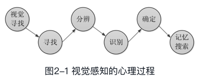
    * （1）视觉寻找：指在视线所能达到的范围内搜寻目标。
    * （2）寻找：当发现视线探测到的对象与预期所需目标相符合时，则排除其他对象，锁定目标。
    * （3）分辨：指对多个相似的对象的信息进行深入探测。
    * （4）识别：指根据视觉特征信息和细节信息的差异，识别目标的含义。
    * （5）确定：指锁定的对象与记忆中的存储信息相吻合，确认目标。
    * （6）记忆搜索：是以上视觉过程的基础，通过以上步骤所获得的信息都要与记忆信息对比，然后做出判断。
* 在整个视觉过程中，眼睛只是负责对光线的捕捉和初步的信号转换。我们能感知外面的世界，是因为我们的大脑对眼睛传递来的视觉信息进行了加工处理，使这些信息转换成大脑高级认知皮层区可以识别的信号。    
在大脑皮层上，视觉信息的加工过程非常复杂，类似于工厂的流水线。视觉信息在大脑中由多个脑功能区联合加工，分步完成。视觉信息被分成多路，由多条不同的流水线同时工作，分别加工多类不同性质的信息，然后大脑再将这些信息整合起来，完成对视觉信息的处理。    
    
### 可视化编码原则，

#### 2.1.3 格式塔原则
格式塔是德文“Gestalt”的译音，它描述了人在视觉上如何感知对象，它是视觉可视化设计的基本原则。  
格式塔原则也是大数据可视化中交互设计的理论基础之一。
    * 格式塔原则中最基本的法则是简单精炼法则，
    它认为在观察时，人们会用一种常规的、简单的、相连的、对称的或有序的形式来感知和解释模糊不清或复杂的图像。  
    同时，人们还会倾向于将视觉形象作为一个整体最先被认知，而不是先把事物理解为各组成部分的集合。  
    如图2-2所示，人们最先感知的是整个框架（圆、方格和几何形），而不是内部元素，因此，格式塔原则又称为完图法则。    
    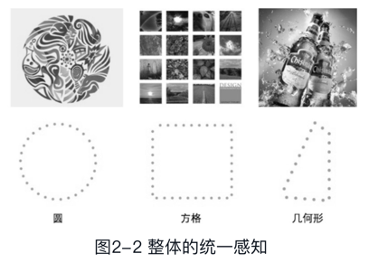

##### 那么，如何规划视觉表达，才能更易于被人们理解和接受呢？格式塔原则包括以下基本原则。
###### 1．接近原则（Law of Proximity）
通常，人在进行视觉感知时会把在距离上相互靠近的元素视作一个整体。元素之间的距离越近，被视作组合的概率越大。  
* 在可视化设计中，用户能够应用接近原则来对元素进行区分和规划，通过设计一定的间距和空间来保证元素整体和局部之间的协调性。
    * 在图2-3（a）中，12个黑方块没有贴近，因此人们无法将它们归为一组；
    * 在图2-3（b）中我们会很自然地进行分类，将它们看成三个横行，四个竖列；
    * 在图2-3（c）中的图标，不同花纹颜色一致，且空间距离很近，因此被识别为组成一个大写的英文字母“U”。
    

* 接近原则作为第一条原则，它所占的“权重”非常大，甚至大到可以忽略其他原则。
例如，图2-4中的圆形，即使部分圆形添加了颜色，甚至如右侧图示中把部分圆形改变形状，人们也会把位置上相接近的元素当成一个整体，自然而然地将它们归类为上下两个部分。
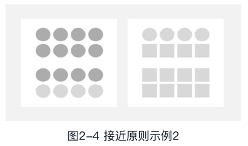


###### 2．相似原则（Law of Similarity）
相似原则看重的是元素内部特性的不同。  
对于元素内部的纹理、颜色、形状、大小等特征，人们的视觉感知常常会把这些明显具有共同特性的元素当成一个整体或归为一类。  
它与接近原则看重元素之间的空间位置是不同的。  
* 在可视化设计中，能够应用相似原则来对元素内部特征进行设计，使元素内部具有一致的纹理、颜色、形状、大小等特征，
    * 这样就可以保证可视化作品的整体协调性。  
    * 同时，还能保留局部的某些鲜明的特征。
    例如，在图2-5中，我们通常会把外形相同的同心圆看成一组。
    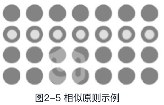
    
    
###### 3．闭合原则（Law of Closure）
闭合原则是指人们常常会在潜意识中把一个不连贯的图形补充完整，使之连贯，或者说倾向于从视觉上封闭那些开放或未完成的轮廓。  
人们常会将不完全封闭的东西视作统一的整体。
* 在设计中，我们有时可以通过不完整的图形，让人自己去想象闭合图形，这样可以引起用户的兴趣和关注。
如苹果公司的Logo，咬掉的缺口唤起人们的好奇、疑问，给人们留下巨大的想象空间。


###### 4．连续原则（Law of Continuity）
连续原则与闭合原则类似，是以实物形象上的不连续使用户产生心理上的连续知觉。凡具有连续性或共同运动方向的元素容易被视为一个整体。  
如图2-7所示，人们的视觉感知会沿着虚线分布形成连续的曲线（如下方实线的效果）。
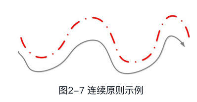


* 格式塔的原则还有很多，可应用于心理学、哲学、美学和科学等众多领域。
* 由以上的阐述可以看出，格式塔（完形理论）的基本思想是：视觉形象是作为一个统一的整体最先被认知的，而后才是从各个部分开始认知。  
也就是说，人们先是“看见”一个构图的整体，然后才会“看见”组成这一构图整体的各个部分。
    
    
* 格式塔原则对于可视化工作者在选择可视化方法时有很大的启发作用。  
数据可视化是将数据映射为图形元素，生成包含原始信息的视觉图像的过程。  
在可视化设计中，视图的设计者必须以一种直观的、绝大多数用户容易理解的数据可视化元素映射方式，对数据进行可视编码。  
同时，这个过程还涉及用户对相应视觉元素的心理感知和认知过程。  
因此，数据可视化的设计者们还需要遵循格式塔理论中关于视觉感知和认知的理论研究成果。
    
#### 2.1.4 颜色理论
##### 1．光的特性
人们能够看到物体，是因为有光的存在；人眼能区分不同的颜色，是因为不同光的波长和强度有区别。  
* 光作为一种电磁波，其波长范围很广，但人眼可以看到的电磁波的波长范围却很有限。
电磁波中能被人眼所观察到的部分被称为可见光。  
如图2-8所示，可见光谱的波长由780nm向380nm变化时，人眼产生的颜色感觉依次是红（630～780nm）、橙（600～630nm）、黄（580～600nm）、绿（510～580nm）、青（450～510nm）、蓝（430～450nm）、紫（380～430nm）这七种颜色。  
一定波长的光谱呈现的颜色称为光谱色。  
因为太阳光包含全部可见光谱，所以给人留下的感觉是白色。  
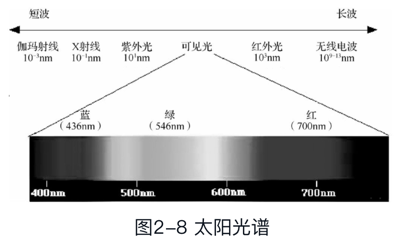

* 如图2-9所示，人眼中的视锥细胞对波长有着不同的敏感范围，一般人眼中有三种不同的视锥细胞：
    * 第一种主要感受红色，它的最敏感点在565nm左右；
    * 第二种主要感受绿色，它的最敏感点在535nm左右；
    * 第三种主要感受蓝色，其最敏感点在420nm左右。
    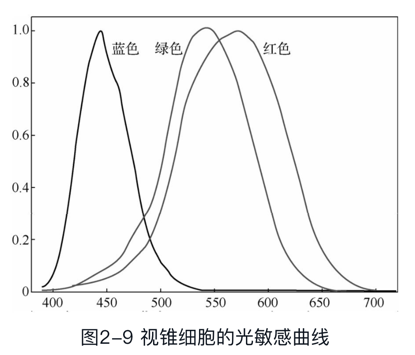
    * 红、绿、蓝作为三基色也正是基于人眼这样的生理特征而确定的。
    虽然眼球中的椎状细胞并非对红、绿、蓝三色的感受度最强，但是因为椎状细胞所能感受的光的带宽很大，红、绿、蓝能够独立地刺激这三种颜色的受光体，并且这三种颜色的区分度比较大，因此这三色被视为基色。  
    三基色并不是光的物理性质，而是基于人眼的独特生理特征确定下来的。
    * 因此，色相从本质上来说是不同波长的光线进入人眼之后，人对此产生的不同视觉感受的一种描述。
    
    
##### 2．三基色原理
大多数的颜色可以通过红、绿、蓝三色光按照不同的比例合成产生。  
同样地，绝大多数单色光也可以分解成红、绿、蓝三种色光，这是色度学的最基本原理，即三基色原理。  
红、绿、蓝三种基色是相互独立的，其中任何一种都不能由其他两种颜色合成。
###### 三基色按照不同的比例相加合成的混色称为相加混色。
用以上的相加混色三基色所表示的颜色模式称为RGB模式。
####### 黄色、青色都是由两种基色相混合而成，所以它们又称相加二次色。  
如图2-1#0所示，红色+绿色=黄色；绿色+蓝色=青色。 

####### 所以，青色、品红、黄色分别与红色、绿色、蓝色互为补色。  
另外，红色+青色=白色；绿色+品红=白色；蓝色+黄色=白色。

####### 而任何两个非补色的色光相混合，产生出它们两个色调之间的新的色调，这种新色调又叫中间色。
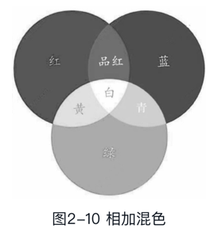

###### 除了相加混色法之外还有相减混色法。
而用相减混色三基色原理所表示的颜色模式称为CMYK模式，它被广泛运用于绘画和印刷领域，如打印机，它的油墨不会自己发出光线，因此只能采用吸收特定光波再反射其他光的颜色，所以需要用减色法来解决。
相减混色就是以吸收三基色比例不同而形成不同的颜色的。  
在白光照射下，青色颜料吸收红色而反射青色，黄色颜料吸收蓝色而反射黄色，品红颜料吸收绿色而反射品红，即白色-红色=青色；白色-蓝色=黄色；白色-绿色=品红。
    
    
##### 3．不同的色彩对人心理的影响
颜色可以左右人的情绪，还可以影响人的判断。
###### 暖色系的颜色是以橘色为中心的色群，
它们常使人联想到炎热的夏季、火红的鲜花等。  
例如，黄色代表青春、乐观、豁达，常被作为点睛之笔；
红色代表活力、速度、紧迫感，常用于庆祝、警醒、提示等。
* 在暖色调的基础上，添加无彩色（彩色以外的其他颜色如金、银、黑、白、灰等）调和所得到的色彩皆属于暖色调的范畴，
这样的配色常常给人以兴奋、愉快、活泼、亲切的感受，适用于积极、健康、努力等方面的表现内容。
* 暖色、纯度和明度高的色彩，对人的视网膜及脑神经刺激较强，会加快血液循环，让人心潮澎湃，产生兴奋感。
###### 冷色系颜色是以蓝色为中心的色群，
这个色群常会给人以寒冷、清爽、收缩的感受。  
在色彩明度和纯度都很低的冷色系色调的烘托下，能让画面呈现出收缩的视觉效果。  
例如，蓝色代表悠远、宁静、理智；绿色代表生命、新鲜、和平。  
* 在冷色调的基础上添加无彩色调和所得到的色彩皆属于冷色调的范畴，  
这样的配色给人冷静、坚定、理智、可靠的印象，适用于表现商业、科技、学习等方面的内容。
* 相反，冷色、纯度和明度低的色彩对视网膜及心理作用较弱，让人的心绪平稳，产生沉静感。

* 既然色彩会影响人们的潜意识，那么，在设计时，设计师就要找到合适的色彩去传达不同信息所包含的内涵。只有色彩被正确使用后，表达的信息才能深入人心，达到预期效果。

##### 4．色彩的三要素
从可视化编码的角度对颜色进行分析，可将颜色分为色相、明度和饱和度三个视觉通道，如图2-12所示。
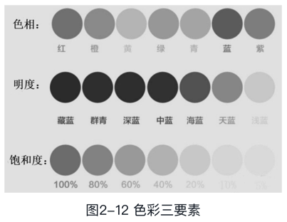

###### （1）色相（Hub）：即色彩的相貌和特征，指颜色的种类和名称。
如，红、橙、黄、绿、蓝、紫等为色彩的不同基本色相。  
黑白没有色相，为中性。
###### （2）明度（Brightness）：又称亮度，指颜色的深浅、明暗的变化。
比如，深黄、淡黄、柠檬黄等黄色在明度上就不一样，  
深红、玫瑰红、大红、朱红、橘红等红颜色在明度上也不尽相同。  
这些颜色在明暗、深浅上的不同变化，是色彩的又一重要特征——明度变化。
* 色彩的明度变化有以下两种情况。
    * ① 不同色相之间的明度变化。
    例如，白比黄亮、橙比红亮、紫比黑亮。
    * ② 在某种颜色中，加白色，明度就会逐渐提高；加黑色，明度就会降低，但同时它们的纯度（颜色的饱和度）也会降低。

###### （3）饱和度（Saturation）：又称纯度，指色彩的鲜艳程度。
饱和度越高，图像表现得越鲜艳；饱和度较低，则图像会表现得比较黯淡。

##### 5．数据可视化色彩搭配技巧
###### （1）色调与明度上的变化要大
* 在进行色彩搭配时，配色要容易辨识与区分，明度差异需要进行整体设计，而且明度差异要够大。  
选择单色系的配色时，最好先测试一下它在红色盲、绿色盲与灰度模式下的展示效果。  
只有在明度上有足够大的变化才能保证完美显示。
* 如图2-13所示，可视化还需要多种配色。  
对用户来说，配色种类越多，数据就越容易通过视觉被定位。  
最好再加上色相上的变化，这样就能使色盲用户感到视觉效果更明朗。  
因此，要想承载多种类的数据，设计者就需要把明度与色调的跨度设计得大一些。


###### （2）学习大自然的色彩过渡
人类长期置身于自然界的各种色彩变化中，对这些色彩的渐变感到舒适。  
设计者应该更多地去了解大自然中的色彩过渡，再将其应用到可视化设计中。  
* 如图2-14所示，从纯数学的角度来看，淡紫到深黄的过渡，与明黄到深紫的过渡，在感觉上十分相似。  
但经过实际观察发现，后者十分自然，前者则不是。
这是由于在大自然的日落过程中，人们看到的是明黄色向深紫色的渐变，不是淡紫色向深黄色的过渡。同样地，从浅绿色变化到蓝紫色也是如此，此外还有很多类似的情况。正是由于我们已经熟悉这些自然界中的色彩变化，所以在可视化设计中设置这样的配色时，用户会感到熟悉而愉悦。图2-15所示为自然界中的颜色渐变示例。

###### （3）尽量使用渐变来替换静态的单一颜色
要想让设计效果更加美观，则可以在不同色调的基础上加上渐变。  
无论设计者选择几种颜色，都可以在渐变中提取出这些颜色，让可视化图表看起来更加自然，同时色调和亮度也有足够的变化。  
图2-16所示为某超市各类产品的销售情况，采用渐变色能直观地显示各类产品的销售额。
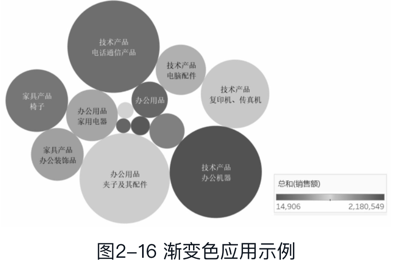
现在有很多配色网站，如配色网、Color Jack等，这些网站提供了大量的颜色搭配主题方案，读者可以自己学习和使用这些网站的配色方案。

#### 2.1.5 视觉编码
##### 1．视觉编码的定义
* 数据可视化的制作过程实质上是数据到视觉元素的编码过程。  
可视化将数据以一定的编码原则映射为直观、易于理解和记忆的可视化元素。  
为了能有效、正确地引导用户对数据的理解和分析，设计者在数据的可视化过程中，必须遵循科学的视觉编码原则。  
设计者要研究人的视觉感知、不同的可视化元素的展示效果，以及如何合理使用不同的视觉通道表达数据所传达的重要信息，避免给用户造成视觉错觉，以达到良好的数据可视化效果。
所以，视觉编码（Visual Encoding）的定义可用一句话概括为：描述数据与可视化结果的映射关系。
* 我们把可视化看成一组图形符号的组合，这些图形符号携带了被编码的信息。  
而当人们从这些符号读取相应的信息时，就称之为解码。  
研究认为，能够在10ms内“解码”则被视为“有效信息传达”。
在图2-17所示的上下两幅图中，哪个更容易看出图中有多少个字母“S”？
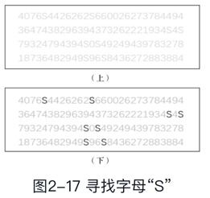
显然，下图使用了“颜色饱和度”视觉通道，它更准确和快速地传递了信息。

##### 可视化编码
可视化编码由以下两部分组成，如图2-18所示。
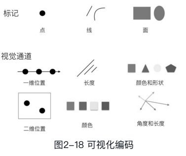
###### ① 标记（图形元素）：指图形元素，如点、线、面、体。
###### ② 视觉通道：指用于控制图形元素的展示特性，包括元素的颜色、位置、尺寸、形状、方向、色调、饱和度、亮度、纹理等
在通常情况下，单个可视化作品用到的视觉通道要尽可能少，若使用太多反而会造成人们视觉系统的混乱，使获取信息变得更难。
* 视觉通道的类型
    * ① 定性或分类的视觉通道：
    适合用于编码分类的数据信息，
    如形状、颜色的色调、空间位置。
    * ② 定量或定序的视觉通道：
    适合用于编码有序的或者连续型的数据信息，
    如直线的长度、区域面积、空间的体积、斜度、角度、颜色的饱和度和亮度等。
    * ③ 分组的视觉通道：  
    分组是通过多个或多种标记的组合来进行描述的。  
    分组通道包括接近性、相似性和包括性。  
    分组通道适合将存在相互联系的数据进行分组，以此来表现数据内在的关联性。  
* 视觉通道的表现力和有效性    
大部分的视觉通道更加适合于编码定量的信息。
视觉通道的类型决定了对不同的数据进行可视化时可采用的视觉通道，而视觉通道的表现力和有效性则可指导可视化设计者如何选择合适的视觉通道。  
视觉通道表现力和有效性体现在如下几个方面。
    * ① 精确性：指人们视觉感知后的判断结果是否与原始数据一致。
    * ② 可辨性：指视觉通道有不同的取值范围，如何取值能使人们更容易区分该视觉通道的两种或多种取值状态。
    * ③ 可分离性：指将不同视觉通道的编码对象放置到一起，是否容易分辨。
    * ④ 视觉突出：指对重要的信息，是否使用更加突出的视觉通道进行编码。

* 数据和视觉通道的映射
可视化编码是在数据的字段和可视化通道之间建立对应关系的过程，它们的映射关系如下。
    * ① 一个数据字段对应一个视觉通道（1∶1）。
    * ② 一个数据字段对应多个视觉通道（1∶n）。
    * ③ 多个数据字段对应一个视觉通道（n∶1）。

##### 视觉编码设计的两大原则
###### ① 表达性、一致性：可视化的结果应该充分表达数据想要表达的信息，且不会让用户产生歧义。
###### ② 有效性、理解性：可视化之后比前一种数据表达方案更加有效，更加容易让人理解。
可视化编码设计还需要考虑色彩搭配、交互、美学因素、信息的密度、直观映射、隐喻等要素。    

### 2.2 数据准备
#### 2.2.1 数据类型
根据数据分析的要求，不同的应用应采用不同的数据分类方法。
* 根据数据模型，我们可以将数据分为浮点数、整数、字符等；
* 根据概念模型，可以定义数据为其对应的实际意义或者对象。
* 在科学计算中，通常根据测量标度将数据分为四类：
##### （1）类别型数据：用于区分物体
例如，根据性别可以将人分为男性或者女性；  
商品可按用途、原材料、生产方法、化学成分、使用状态等进行不同的分类。  
这些类别可以用来区分一组对象。

##### （2）有序型数据：用来表示对象间的顺序关系
如成绩排名、身高排序等。

##### （3）区间型数据：用于得到对象间的定量比较。  
相对于有序型数据，区间型数据提供了详细的定量信息。  
例如，身高160cm与身高170cm相差10cm，而170cm与180cm也相差10cm，它们俩的差值是相等的。  
由此可见，区间型数据基于任意的起始点，只能衡量对象间的相对差别。

##### （4）比值型数据：用于比较数值间的比例关系，可以精确地定义比例。  
比如，2班的学生数量是1班的2倍（2∶1）。

#### 不同的数据类型对应着不同的集合操作和统计操作，如表2-1所示。
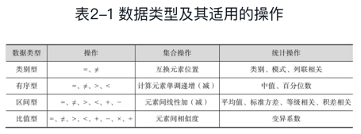
* 在数据可视化中，通常并不区分区间型数据和比值型数据，所以可以将数据类型精简为三种：
    * 类别型数据、
    * 有序型数据
    * 数值型数据（包括区间型数据和比值型数据）。
    基础的可视化设计一般针对这三种数据展开，而复杂型数据通常是这三种数据的组合。

#### 2.2.2 数据预处理
在大数据时代，由于数据的来源非常广泛，数据类型和格式存在差异，并且这些数据中的大部分是有噪声的、不完整的，甚至存在错误。因此，在对数据进行分析与挖掘前，对采集的数据进行预处理是非常有必要的。
数据预处理的目的是提升数据质量，使得后续的数据处理、分析、可视化过程更加容易、有效。
##### 数据质量体现在以下六个方面：
###### （1）有效性：数据与实际情况对应时，是否违背约束条件。
###### （2）准确性：数据能否准确地反映现实。
###### （3）完整性：采集的数据集是否包含了数据源中的所有数据点，且每个样本的属性都是完整的。
###### （4）一致性：整个数据集中的数据的衡量标准要一致。
###### （5）时效性：数据适合当下时间区间内的分析任务。
###### （6）可信性：数据源中的数据是使用者可依赖的。

##### 数据预处理步骤如下：
###### （1）数据清理：指修正数据中的错误、识别脏数据、更正不一致数据的过程。
其中涉及的技术有不一致性检测技术、脏数据识别技术、数据过滤技术、数据修正技术、数据噪声的识别与平滑技术等。

###### （2）数据集成：指把来自不同数据源的同类数据进行合并，减少数据冲突，降低数据冗余程度等。
###### （3）数据归约：指在保证数据挖掘结果准确性的前提下，最大限度地精简数据量，得到简化的数据集。
* 数据归约技术包括
    * 维归约技术、
    * 数值归约技术、
    * 数据抽样技术等。
* 数据归约技术可以用于得到数据集的归约表示，它虽然小，但会保持原数据的完整性。
因此，在归约后的数据集上进行挖掘也会产生相同（或几乎相同）的分析结果。
###### （4）数据转换：指对数据进行规范化处理。数据转换处理技术包括基于规则或元数据的转换技术、基于模型和学习的转换技术等。


#### 2.2.3 数据组织与管理
大数据存储利用的是<span class="object">分布式</span>存储与访问技术，它具有高效、容错性强等特点。  
<span class="object">分布式</span>存储技术与数据存储介质的类型和数据的组织与管理形式有关。  
* 目前，主要的数据存储介质类型包括
    * 机械硬盘
    * 固态硬盘
    * U盘
    * 光盘
    * 闪存卡等，
* 主要的数据组织形式包括
    * 按行组织
    * 按列组织
    * 按键值组织
    * 按关系组织
* 主要的数据组织管理层次包括按
    * 块级
    * 文件级
    * 数据库级组织管理等。
    不同的存储介质和组织管理形式对应于不同的大数据特征和应用场景。

##### <span class="object">分布式</span>存储技术
###### 1．<span class="object">分布式</span>文件系统
<span class="object">分布式</span>文件系统是指文件在物理上可能被分散存储在不同地点的节点上，各节点通过计算机网络进行通信和数据传输，但在逻辑上仍然是一个完整的文件。  
用户在使用<span class="object">分布式</span>文件系统时，无须知道数据存储在哪个具体的节点上，只需像操作本地文件系统一样进行管理和存储数据即可。
* 常用的<span class="object">分布式</span>文件系统有
    * <span class="s2-1">HDFS</span>（<span class="s2">Hadoop</span><span class="object">分布式</span>文件系统）
    * GFS（Google<span class="object">分布式</span>文件系统）
    * KFS（Kosmos<span class="object">分布式</span>文件系统）等，
* 常用的<span class="object">分布式</span>内存文件系统有Tachyon等。

###### 2．文档存储
* 文档存储支持对结构化数据的访问，一般以键值对的方式进行存储。
* 文档存储模型支持嵌套结构。
例如，文档存储模型支持XML和JSON文档，字段的“值”又可以嵌套存储其他文档。  
MongoDB数据库通过支持在查询中指定JSON字段路径实现类似的功能。
* 文档存储模型也支持数组和列值键。
* 主流的文档数据库有
    * MongoDB
    * CouchDB
    * Terrastore
    * RavenDB等。
    
###### 3．列式存储
列式存储是指以流的方式在列中存储所有的数据。  
列式数据库把一列中的数据值串在一起存储，然后再存储下一列的数据，以此类推。  
* 列式数据库由于查询时需要读取的数据块少，所以查询速度快。  
因为同一类型的列存储在一起，所以数据压缩比高，简化了数据建模的复杂性。  
* 但它是按列存储的，插入更新的速度比较慢，不太适合用于数据频繁变化的数据库。 
它适合用于决策支持系统、数据集市、数据仓库，不适合用于联机事务处理（OLTP）。
* 使用列式存储的数据库产品
    * 有传统的数据仓库产品，如
        * Sybase IQ
        * InfiniDB
        * Vertica等
    * 也有开源的数据库产品，如
        * <span class="s2">Hadoop</span> <span class="s2-1">Hadoop</span>、
        * Infobright等。

###### 4．键值存储
* 键值存储，即Key-Value存储，简称KV存储。它是NoSQL存储的一种方式。  
它的数据按照键值对的形式进行组织、索引和存储。  
键值存储能有效地减少读写磁盘的次数，比SQL数据库存储拥有更好的读写性能。
* 键值存储实际是<span class="object">分布式</span>表格系统的一种。
主流的键值数据库产品有Redis、Apache Cassandra、GoogleBigtable。

###### 5．图形数据库
* 当事物与事物之间呈现复杂的网络关系（这些关系可以简单地称为图形数据）时，最常见例子就是社会网络中人与人之间的关系，
    * 用关系型数据库存储这种“关系型”数据的效果并不好，其查询复杂、缓慢，并超出预期，
    * 而图形数据库的出现则弥补了这个缺陷。
* 图形数据库是NoSQL数据库的一种类型，是一种非关系型数据库，它应用图形理论存储实体之间的关系信息。  
图形数据库采用不同的技术很好地满足了图形数据的查询、遍历、求最短路径等需求。  
在图形数据库领域，有不同的图模型来映射这些网络关系，可用于对真实世界的各种对象进行建模，如社交图谱可用于反应事物之间的相互关系。
* 主流的图形数据库有
    * Google Pregel
    * Neo4j
    * InfiniteGraph
    * DEX
    * InfoGrid
    * HyperGraphDB等。

###### 6．关系数据库
* 关系模型是最传统的数据存储模型，数据按行存储在有架构界定的表中。
表中的每个列都有名称和类型，表中的所有记录都要符合表的定义。  
用户可使用基于关系代数演算的结构化查询语言（Structured Query Language，SQL）提供相应的语法查找符合条件的记录，通过表连接在多表之间查询记录，表中的记录可以被创建和删除，记录中的字段也可以单独更新。
* 关系模型数据库通常提供事务处理机制，可以进行多条记录的自动化处理。  
在编程语言中，表可以被视为数组、记录列表或者结构。
* 目前，关系型数据库也进行了改进，支持如<span class="object">分布式</span>集群、列式存储，支持XML、JSON等数据的存储。

###### 7．内存数据库

内存数据库（Main Memory Database，MMDB）就是将数据放在内存中直接操作的数据库。  
相对于磁盘数据，内存数据的读写速度要高出几个数量级。  
MMDB的最大特点是其数据常驻内存，即活动事务只与实时内存数据库的内存数据“打交道”，所处理的数据通常是“短暂”的，有一定的有效时间，过时则有新的数据产生。  
所以，实际应用中采用内存数据库来处理实时性强的业务逻辑。
* 内存数据库产品有Oracle TimesTen、eXtremeDB、Redis、Memcached等。

###### 8．数据仓库
数据仓库（Data Warehouse）是一种特殊的数据库，一般用于存储海量数据，并直接支持后续的分析和决策操作。  
数据仓库是一个面向主题的、集成的、相对稳定的、反映历史变化的数据集合，用于支持管理决策。
* 对于数据仓库，我们可以从两个层次来理解。
    * 首先，数据仓库用于支持决策，面向分析型数据处理，它不同于企业现有的操作型数据库；
    * 其次，数据仓库是对多个异构的数据源有效集成，集成后按照主题进行了重组，并包含历史数据，存放在数据仓库中的数据一般不会再修改。
* 企业数据仓库的建设，是以现有企业业务系统和大量业务数据的积累为基础。  
数据仓库不是静态的概念，只有及时提交数据，供使用者做出经营决策，数据才有意义，信息才能发挥作用。  
数据仓库的建设是一项系统工程。    

#### 2.2.4 数据分析与数据挖掘
##### 1．数据分析
数据分析是指用适当的统计分析方法对收集来的大量数据进行分析，目的是找出内在规律，提取隐藏在大量数据中的信息，从而帮助人们理解、判断、决策和行动。
###### 常用的数据分析有
####### （1）统计分析：
是指对数据进行统计描述和统计推断的过程。

统计描述指应用统计特征（均值、标准差和相关系数等）、统计表和统计图等方法，对数据的数量特征及其分布规律进行测定和描述（如集中趋势、离散程度和相关程度等）。
统计推断是指用概率方法判断数据之间的关系及用样本统计特征来推测总体特征的方法。  
统计推断已成为统计学的核心内容，是数据分析的重要方法。

####### （2）探索性数据分析（Exploratory Data Analysis，EDA）：
是对调查、观测所得到的一些初步的杂乱无章的数据，在尽量少的先验假设下进行处理，通过作图、制表等形式和方程拟合、计算某些特征量等手段，探索数据的结构和规律的一种数据分析方法。  
它强调从数据中寻找出之前没有发现过的特征和信息。

####### （3）验证性数据分析：
是指在已经有事先假设的关系模型等情况下，通过数据分析来验证已提出的假设。

####### （4）在线分析与处理（Online Analysis Processing，OLAP）：
是一种交互式探索大规模多维数据集的方法。 
OLAP将数据实体的多项重要属性定义为多个维度，让用户比较不同维度上的数据。  
* OLAP的基本功能有
    * 切片和切块（Slice and Dice）、
    * 钻取（Drill）和
    * 旋转（Pivoting）。


##### 2．数据挖掘
* 数据挖掘一般是指从大量的数据中通过算法搜索隐藏于其中的信息的过程。  
数据挖掘通常与计算机科学有关，并通过统计、在线分析处理、情报检索、机器学习、专家系统（依靠过去的经验法则）和模式识别等诸多方法来实现搜索隐藏于大量数据中的信息。  
数据挖掘的对象是大规模的高维数据，这些数据可能来自于数据库、数据仓库或者其他数据源，可以是任何类型的数据。
* 数据挖掘是在没有明确假设的前提下去挖掘信息和发现知识。
    * 一个有趣的应用范例是“尿布与啤酒”的故事。
    沃尔玛公司为了分析顾客最有可能一起购买哪些商品，利用自动数据挖掘工具，对数据库中的大量数据进行分析后，意外地发现，跟尿布一起购买最多的商品竟是啤酒。
    为什么两件风马牛不相及的商品会被人一起购买？  
    调查后发现，太太们常叮嘱她们的丈夫，下班后为小孩买尿布，而丈夫们在买尿布后又随手带回了啤酒。  
    既然尿布与啤酒一起购买的机会最多，商店就将它们摆放在一起，结果，实现了尿布与啤酒的销售量双双增长。  
    在这个例子中，数字挖掘技术功不可没。

###### 常见的数据挖掘分析方法有
####### （1）分类与预测
* 分类算法是从数据中选出已经分好类的训练集，在此训练集上运用数据挖掘分类技术，构造一个分类模型，然后再根据此分类模型对数据集中未分类的数据进行分类。  
其中，类的个数是确定的，预先定义好的。
* 分类具有广泛的应用，例如，医疗诊断、信用卡的信用分级。
* 分类器的构造方法多种多样，如
    * 决策树、
    * 贝叶斯方法、
    * 神经网络和
    * 遗传算法等。
    
####### （2）聚类分析
* 聚类指将数据集聚集成几个簇（聚类），使得同一个聚类中的数据集之间的相似程度高，而不同聚类中的数据集之间的相似程度低，利用分布规律从数据集中发现有用的规律。
    * 例如，商业聚类分析被用来发现不同的客户群，并且通过购买模式刻画不同的客户群的特征；
    * 生物聚类分析被用来对动植物和基因进行分类，获取对种群固有结构的认识；
    * 电子商务聚类分析分组聚类出具有相似浏览行为的客户，并分析客户的共同特征，更好地帮助电子商务的用户了解自己的客户，向客户提供更合适的服务。

* 聚类不依赖于预先定义好的类，不需要训练集。
因此，聚类通常作为其他算法（如特征和分类）的预处理步骤。

* 聚类方法有很多，常见的有五类：
    * 划分方法
    * 层次方法
    * 基于密度方法
    * 基于网格方法
    * 基于模型方法。
    
####### （3）关联分析
关联分析就是发现存在于大量数据集中的关联性或相关性，从而描述了一个事物中某些属性同时出现的规律和模式。
关联分析的一个典型例子是购物篮分析。该过程通过发现顾客放入购物篮中的不同商品之间的联系，分析顾客的购买习惯。  
* 关联分析中的最重要的内容是关联规则的挖掘研究，
关联规则描述在一个数据集中的一个数据与其他数据之间的相互依存性和关联性。  
关联规则可从事务、关系数据中的集合对象发现频繁模式、关联规则、相关性或因果结构。

####### （4）异常分析
在海量数据中，有少量数据与大多数数据的特征不一样，在数据的某些属性方面有很大的差异。  
它们是数据集中的异常子集，或称离群点。  
通常，它们被认为是噪声，常规的数据处理试图将它们的影响最小化，或者删除这些数据。  
* 然而，这些异常数据可能是重要信息，包含潜在的知识。  
    * 例如，在信用卡欺诈探测中发现的异常数据可能隐藏欺诈行为；
    * 临床上异常的病理反应可能是重大的医学发现。
    
###### 数据挖掘的步骤如下：
####### （1）确定业务对象
清晰地定义业务问题，认清数据挖掘的目的。
数据的挖掘结果是不可预测的，但要探索的方向应是有预见的，不应该带有盲目性。
####### （2）数据准备
数据的准备包括数据的选择（选择适用于数据挖掘应用的数据）、数据的预处理（研究数据的质量，并确定将要进行的挖掘操作的类型）和数据的转换（将数据转换成适合挖掘算法处理的类型）。
####### （3）数据挖掘
对所得到的经过预处理的数据进行挖掘。  
除了选择合适的挖掘算法外，其余一切工作都能自动地完成。
####### （4）结果分析
解释并评估结果。  
其使用的分析方法一般应根据数据挖掘操作而定，通常会用到可视化技术。

####### （5）知识的同化
将分析所得到的知识集成到业务信息系统的组织结构中去。

* 传统的数据挖掘依赖机器智能运算，但机器智能仍难以处理许多复杂的情况，很多时候还需要人工的配合、判断和解释，而这需要高效的人机交互界面才能完成。  
在数据挖掘过程中，使用可视化技术，可以帮助用户更紧密地参与整个挖掘过程，更好地发挥人的感知与判断能力。  
在这种情况下，可视数据挖掘应运而生。 
可视化的引入使整个数据挖掘过程清晰可见，而且能更合理地处理复杂数据和噪声。

* 从本质上说，数据可视化是可视分析的前提，它旨在提供一种直观的视觉界面，让用户通过人脑智能发现数据中蕴涵的规律。

### 2.3 数据可视化的基本框架
本节将从数据可视化的一般流程和数据可视化的设计标准及框架两方面阐述数据可视化的基本框架。

#### 2.3.1 数据可视化的流程
数据可视化的流程以数据流向为主线，其核心流程主要包括四大步骤。
整个可视化过程可以看成是数据流经过一系列处理步骤后得到转换的过程。  
用户可以通过可视化的交互功能进行互动，通过用户的反馈提高可视化的效果。

##### （1）数据采集
可视化的对象是数据，而采集的数据涉及数据格式、维度、分辨率和精确度等重要特性，这些都决定了可视化的效果。  
因此，在可视化设计过程中，一定要事先了解数据的来源、采集方法和数据属性，这样才能准确地反映要解决的问题。

##### （2）数据处理和变换
这是数据可视化的前期准备工作。  
原始数据中含有噪声和误差，还会有一些信息被隐藏。  
可视化之前需要将原始数据转换成用户可以理解的模式和特征并显示出来。  
所以，数据处理和变换是非常有必要的，它包括去噪、数据清洗、提取特征等流程。


##### （3）可视化映射
可视化映射过程是整个流程的核心，其主要目的是让用户通过可视化结果去理解数据信息以及数据背后隐含的规律。  
该步骤将数据的数值、空间坐标、不同位置数据间的联系等映射为可视化视觉通道的不同元素，如标记、位置、形状、大小和颜色等。  
因此，可视化映射是与数据、感知、人机交互等方面相互依托，共同实现的。

##### （4）用户感知
可视化映射后的结果只有通过用户感知才能转换成知识和灵感。  
用户从数据的可视化结果中进行信息融合、提炼、总结知识和获得灵感。  
数据可视化可让用户从数据中探索新的信息，也可证实自己的想法是否与数据所展示的信息相符合，用户还可以利用可视化结果向他人展示数据所包含的信息。  
用户可以与可视化模块进行交互。  
交互功能在可视化辅助分析决策方面发挥了重要作用。

* 直到今天，还有很多科学可视化和信息可视化工作者在不断地优化可视化工作流程。
    * 图2-19是由Haber和McNabb提出的可视化流水线，
    描述了从数据空间到可视空间的映射，包含了
        * 数据分析
        * 数据过滤
        * 数据可视映射
        * 绘制等各个阶段。
        这个流水线常用于科学计算可视化系统中。
        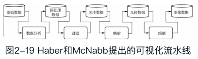
    * 图2-20所示为武汉大学学者设计的图书情报领域信息可视化流程模型，
    该模型把流水线改成了回路，用户可在任何阶段进行交互。
    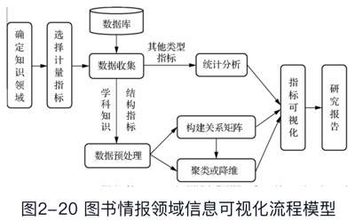
* 可以看出，不管在哪种可视化流程中，人是核心要素。虽然机器可承担对数据的计算和分析工作，而且在很多场合比人的效率高，但人仍是最终决策者。
    
#### 2.3.2 数据可视化的设计标准及框架
##### 1．数据可视化的设计标准
设计数据可视化时，我们应遵守以下可视化设计标准。
* （1）表达力强。
能真实全面地反映数据的内容。
* （2）有效性强。
一个有效的可视化设计应在短时间内把数据信息以用户容易理解的方式显示出来。
* （3）能简洁地传达信息。
* 这样能在有限的画面里呈现更多的数据，而且不容易让用户产生误解。
* （4）易用。
用户交互的方式应该简单、明了，用户操作起来很方便。
* （5）美观。
视觉上的美感可以让用户更易于理解可视化要表达的内容，提高工作效率。
##### 2．数据可视化的设计框架
数据可视化的设计框架可归纳为图2-21中的四个层次。
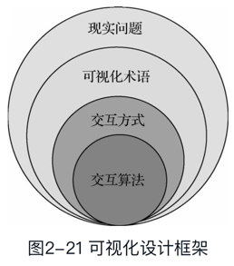
###### 第一层描述现实生活中用户遇到的实际问题。
在第一层中，可视化设计人员会用大量的时间与用户接触，采用有目标的采访或软件工程领域的需求分析方法来了解用户需求。  
* 首先，设计人员要了解用户的数据属于哪个特定的目标领域。
因为每个领域都有其特有的术语来描述数据和问题，通常也有一些固定的工作流程来描述数据如何用于解决每个领域的问题。  
* 其次，描述务必细致，
因为这可能是对领域问题的直接复述或整个设计过程中数据的描述。
* 最后，设计人员需要收集与问题相关的信息，建立系统原型，并通过观察用户与原型系统的交互过程来判断所提出方案的实际效果。

###### 第二层是抽象层，
它将第一层确定的任务和数据转换为信息可视化术语。  
这也是可视化设计人员面临的挑战之一。  
* 在数据抽象过程中，可视化设计人员需要考虑
    * 是否要将用户提供的数据集转化为其他形式，
    * 以及使用何种转化方法，以便选择合适的可视编码，完成分析任务。


###### 第三层是编码层，
设计视觉编码和交互方式，是可视化研究的核心内容。  
视觉编码和交互这两个层面通常相互依赖。  
为应对一些特殊需求，第二层确定的抽象任务应被用于指导视觉编码方法的选取。

###### 第四层则需要具体实现与前三个层次匹配的数据可视化展示和交互算法，相当于一个细节描述过程。
它与第三层的不同之处在于第三层确定应当呈现的内容以及呈现的方式，  
而第四层解决的是如何完成的问题。

###### 框架中的每个层次都存在着不同的设计难题，
* 第一层需要准确定义问题和目标，
* 第二层需要正确处理数据，
* 第三层需要提供良好的可视化效果，
* 第四层需要解决可视化系统的运行效率问题。
各层之间是嵌套关系，外层的输出是内层的输入。

### 2.4 数据可视化的基本原则
* 数据可视化的主要目的是准确地为用户展示和传达出数据所包含（隐藏）的信息。  
    * 简洁明了的可视化设计会让用户受益，而过于复杂的可视化则会给用户带来理解上的偏差和对原始数据信息的误读；  
    * 缺少交互的可视化会让用户难以多方面地获得所需的信息；
    * 没有美感的可视化设计则会影响用户的情绪，从而影响信息传播和表达的效果。
因此，了解并掌握可视化的一些设计方法和原则，对设计有效的可视化十分重要。
本节将介绍一些有效的可视化设计指导思路和原则，以帮助读者完成可视化设计。
#### 设计制作一个可视化视图包括如下三个主要步骤：
##### （1）确定数据到标记（即图形元素）和视觉通道的映射，确定要呈现的是什么的数据；
2.4.2 数据到可视化的直观映射
* 在设计数据到可视化的映射时，设计者不仅要明确数据语义，还要了解用户的个性特征。  
如果设计者能够在可视化设计时预测用户在使用可视化结果时的行为和期望，就可以提高可视化设计的可用性和功能性，有助于帮助用户理解可视化结果。  
设计者利用已有的先验知识可以减少用户对信息的感知和认知所需的时间。
* 数据到可视化的映射还要求设计者使用正确的视觉通道去编码数据信息。
    * 比如，对于类别型数据，务必使用分类型视觉通道进行编码；
    * 而对于有序型数据，则需要使用定序的视觉通道进行编码。


##### （2）视图的选择与用户交互控制的设计，建立数据指标，从总体到局部逐步展示数据结果；
2.4.3 视图选择与交互设计
* 优秀的可视化展示，首先使用人们认可并熟悉的视图设计方式。  
简单的数据可以使用基本的可视化视图，复杂的数据则需要使用或开发新的较为复杂的可视化视图。  
* 此外，优秀的可视化系统还应该提供一系列的交互手段，使用户可以按照所需的展示方式修改视图展示结果。
    * 视图的交互包括以下内容：
        * （1）视图的滚动与缩放；
        * （2）颜色映射的控制，如提供调色盘让用户控制；
        * （3）数据映射方式的控制，让用户可以使用不同的数据映射方式来展示同一数据；
        * （4）数据选择工具，用户可以选择最终可视化的数据内容；
        * （5）细节控制，用户可以隐藏或突出数据的细节部分。

##### （3）数据的有效筛选，
即确定在有限的可视化视图空间中选择适当容量的信息进行编码，以避免在数据量过大情况下产生的视觉混乱，也就是说，可视化的结果需要保持合理的信息密度。
2.4.1 数据筛选
* 一个优秀的可视化设计必须展示适量的信息内容，以保证用户获取数据信息的效率。  
    * 若展示的信息过少则会使用户无法更好地理解信息；
    * 若包含过多的信息则可能造成用户的思维混乱，甚至可能会导致错失重要信息。
* 因此，一个优秀的可视化设计应向用户提供对数据进行筛选的操作，从而可以让用户选择数据的哪一部分被显示，而其他部分则在需要的时候才显示。
* 另一种解决方案是通过使用多视图或多显示器，根据数据的相关性分别显示。

#### 为了提高可视化结果的有效性，可视化设计的内容还包括颜色、标记和动画的设计等。
##### 2.4.4 美学因素
可视化设计者在完成可视化的基本功能后，需要对其形式表达（可视化的美学）方面进行设计。有美感的可视化设计会更加吸引用户的注意，促使其进行更深入的探索。  
因此，优秀的可视化设计必然是功能与形式的完美结合。  
在可视化设计中有很多方法可以提高美感，总结起来主要有如下三种原则。
###### （1）简单原则：
指设计者应尽量避免在可视化制作中使用过多的元素造成复杂的效果，找到可视化的美学效果与所表达的信息量之间的平衡。

###### （2）平衡原则：
为了有效地利用可视化显示空间，可视化的主要元素应尽量放在设计空间的中心位置或中心附近，并且元素在可视化空间中尽量平衡分布。

###### （3）聚焦原则：
设计者应该通过适当手段将用户的注意力集中到可视化结果中的最重要区域。  
例如，设计者通常将可视化元素的重要性排序后，对重要元素通过突出的颜色进行编码展示，以提高用户对这些元素的关注度。

##### 2.4.5 可视化的隐喻
* 用一种事物去理解和表达另一种事物的方法称为隐喻（metaphor），  
隐喻作为一种认知方式参与人对外界的认知过程。  
与普通认知不同，人们在进行隐喻认知时需要先根据现有信息与以往经验寻找相似记忆，并建立映射关系，再进行认知、推理等信息加工。  
解码隐喻内容，才能真正了解信息传递的内容。
* 可视化过程本身就是一个将信息进行隐喻化的过程。
设计师将信息进行转换、抽象和整合，用图形、图像、动画等方式重新编码表示信息内容，然后展示给用户。  
用户在看到可视化结果后进行隐喻认知，并最终了解信息内涵。  
    * 信息可视化的过程是隐喻编码的过程，  
    * 而用户读懂信息的过程则是运用隐喻认知解码的过程。
* 隐喻的设计包含三个层面。
选取合适的源域和喻体，就能创造更佳的可视和交互效果。
    * 隐喻本体
    * 隐喻喻体
    * 可视化变量
    
##### 2.4.6 颜色与透明度
颜色在数据可视化领域通常被用于编码数据的分类或定序属性。  
有时，为了便于用户在观察和探索数据可视化时从整体进行把握，可以给颜色增加一个表示不透明度的分量通道，用于表示离观察者更近的颜色对背景颜色的透过程度。  
该通道可以有多种取值，
    * 当取值为1时，表示颜色是不透明的；
    * 当取值为0时，表示该颜色是完全透明的；
    * 当取值介于0和1之间时，表示该颜色可以透过一部分背景的颜色，从而实现当前颜色和背景颜色的混合，创造出可视化的上下文效果。
* 颜色混合效果可以为可视化视图提供上下文内容信息，方便观察者对数据全局进行把握。
例如，在可视化交互中，当用户通过交互方式移动一个标记而未将其就位时，颜色混合所产生的半透明效果可以对用户造成非常直观的操作感知效果，从而提高用户的交互体验。  
但有时颜色的色调视觉通道在编码分类数据上会失效，所以在可视化中应当慎用颜色混合。


### 2.5 数据可视化的基本图表
统计图表是最早的数据可视化形式之一，作为基本的可视化元素仍然被广泛使用。  
对很多复杂的大型可视化系统而言，这类图表更是不可或缺的基本组成元素。
* 基本的可视化图表按照其所呈现的信息和视觉复杂程度可以分为三类：
#### 原始数据绘图
原始数据绘图用于可视化原始数据信息的直观呈现。
其典型方法有：
##### 1．数据轨迹
* 数据轨迹是一种标准的单变量数据呈现方法：
    * x轴显示自变量，
    * y轴显示因变量。
* 数据轨迹可直观地呈现数据分布、离群值、均值的偏移等。
图2-22所示为中兴通讯\[00763\]股票随时间的价格走势图。
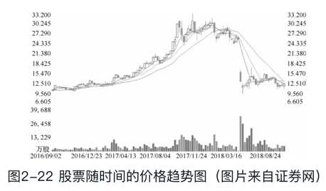


##### 2．柱形图
柱形图采用长方形的形状和颜色编码数据的属性。  
柱形图的每根直柱内部也可以用像素图方式编码，这种柱形图称为堆叠柱形图。  
柱形图适用于二维数据集，但只有一个维度需要比较。  
柱形图利用柱子的高度反应数据的差异。  
柱形图的局限在于只适用于中小规模的数据集。  
* 图2-23（a）柱形图为2013—2017年国内生产总值及其增长率；
* 图2-23（b）堆叠柱形图为2013—2017年三次产业增加值占国内生产总值比重。
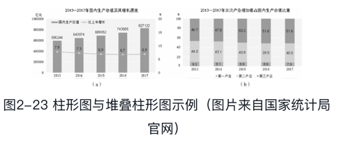

##### 3．条形图
条形图是柱形图向右旋转了90°的呈现方式，如图2-24所示。  
当条目数较多时，如大于12条时，移动端上的柱状图会显得拥挤不堪，这时更适合用条形图。  
条形图的条目数一般要求不超过30条，否则易带来视觉和记忆上的负担。
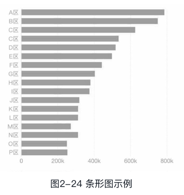


##### 4．折线图
* 拆线图可用于二维大数据集，适用于趋势比单个数据点更重要的场合。
图2-25为2018年北京市某个时段的气温预报折线图，通过观察该图，用户就能够清晰地了解该时段的气温变化情况。
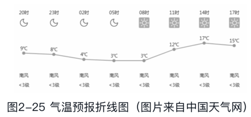

* 折线图还适用于多个二维数据集的比较。
图2-26所示的折线图直观地展示了居民消费的涨跌幅度。
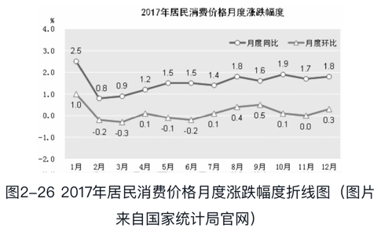

##### 5．直方图
直方图是对数据集中某个数据属性的频率统计。  
对于单变量数据，其取值范围映射到横轴，并分割为多个子区间。  
每个子区间用一个直立的长方块表示，高度正比于该属性值子区间内数据点的个数。  
直方图可以呈现数据的分布、离群值和数据分布的状态。  
* 直方图的各个部分之和等于单位整体，而柱状图的各个部分之和则没有限制，这是两者的主要区别。
图2-27所示为我国某高校学生的体重（kg）的概率直方图。
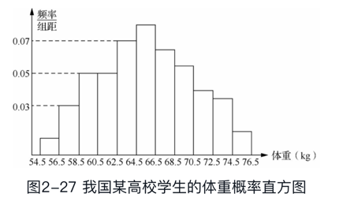

##### 6．饼图
* 饼图采用环状方式呈现各分量在整体中的比例。  
由于人眼对面积的大小不敏感，当饼图各个分量比例相差不大时，应用柱状图替代饼图。  
图2-28所示为2017年全国居民人均消费支出及其构成，采用饼图的形式，用户就能够直观地看出各个消费部分的占比。
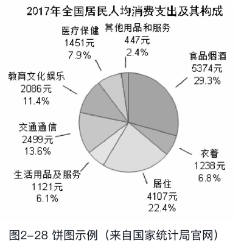
* 除饼图外，环形图（甜甜圈图）也可以表示占比，
其特点是将饼图的中间区域挖空，在空心区域显示文本信息（如标题），  
其优势是空间利用率更高，如图2-29所示。
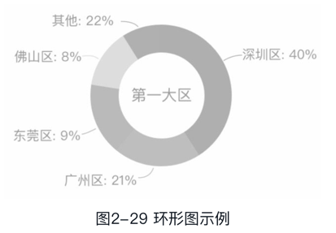

* 旭日图既可以表示占比情况，也可以表示层级构成关系，如图2-30所示。
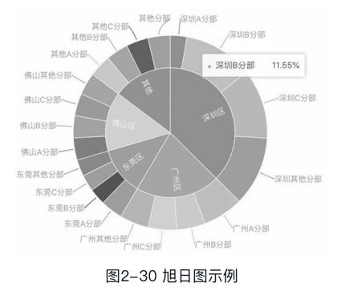

##### 7．等值线图
等值线图使用相等数值的数据点连线来表示数据的连续分布和变化规律。  
等值线图中的曲线是空间中具有相同数值（高度、深度等）的数据点在平面上的投影。  
如图2-31所示，其左半部分为温度等值线图，右半部分为高度等值线图。
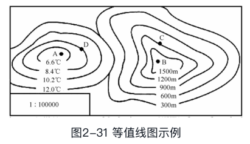


##### 8．走势图
走势图是一种紧凑、简洁的数据趋势表达方式，它通常以折线图为基础，往往直接嵌入在文本或表格中。  
走势图使用高度密集的折线图表达方式来展示数据随某一变量（时间、空间）的变化趋势。  
图2-32所示为北京地区2017年11月～2018年11月的房价走势图，该图清晰地反映了北京地区已经有效扼制房价上涨，总体房价有所降低。
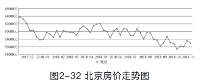

##### 9．散点图
散点图是表示二维数据的标准方法。  
在散点图中，所有数据以点的形式出现在笛卡儿坐标系中，每个点所对应的横、纵坐标分别代表该数据在坐标轴上的属性值大小。  
散点图适用于三维数据集，但其中只有两维需要比较。  
为了识别第三维，可以为每个点加上文字标识，或者不同的颜色。  
* 图2-33所示为快递的单票成本与单票收入统计，每个散点代表一个快递站点，
    * 横坐标表示该快递站点每个快递的平均成本，
    * 纵坐标表示该快递站点每个快递的平均收入，
    * 不同的颜色代表快递站所属的区域。
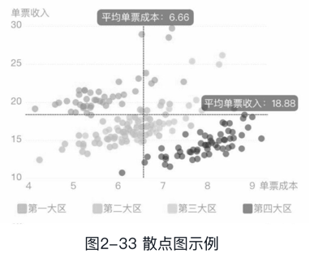

##### 10．气泡图
气泡图是散点图的一种变形，通过每个点的面积大小来表示第三维。  
如果为气泡图加上不同颜色（或者文字标签），气泡图就可以用来表示四维数据。  
* 图2-34所示为某产品在三个地区的销售统计，该图直观显示出B地区的销售额最高，且增长率也最高。
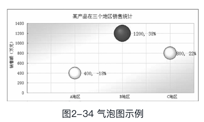

##### 11．维恩图
维恩图（Venn Diagram），或译为文氏图、Venn图、温氏图、维恩图、范氏图。  
它使用平面上的封闭图形来表示数据集合之间的关系。  
每个封闭图形代表一个数据集合，图形之间的交叠部分代表集合间的交集，图形外的部分代表不属于该集合的数据部分，如图2-35所示。
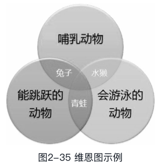

##### 12．热力图
热力图使用颜色来表达位置相关的二维数值数据大小。  
这些数据常以矩阵或方格形式排列，或在地图上按一定位置关系排列，每个数据点都可以使用颜色编码数值。  
* 图2-36所示为我国2018年11月四个超一线城市的深夜出行人数热力图，颜色越深，范围越大，则表明深夜出行人数越多。  
很明显，从图中可以看出，北京深夜出行人数最多。
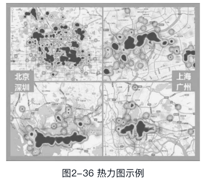

##### 13．雷达图
雷达图又称为戴布拉图、蜘蛛网图（Spider Chart），适用于多维数据（四维以上），且每个维度必须可以排序。  
* 图2-37所示为某初中期末考试的得分统计信息。
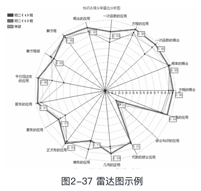

实际选择图表时应先从总体上观察数据，然后细化到具体的分类和其他的特性。
    
#### 2.5.2 简单统计值标绘
箱形图又称为盒须图，是用于显示一组数据分散情况的统计图，因形如箱子而得名。  
箱形图在各种领域也经常被使用，常见于品质管理。  
箱形图于1977年由美国著名统计学家约翰·图基（JohnTukey）发明。  
它显示出一组数据的最大值、最小值、中位数及上下四分位数。  
* 图2-38为植被土壤含水量的箱形图，它的基本形式是用一个长方形箱子表示数据的范围，并在箱子中用横线标明均值的位置。 
同时，在箱子上部和下部分别用两根横线标注最大值和最小值。  
针对二维数据，标准的一维箱形图可以根据需要扩充为二维箱形图。
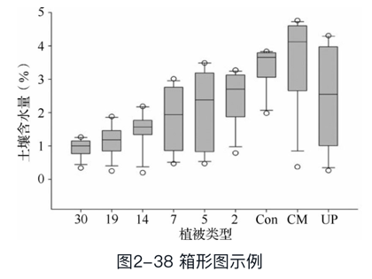

#### 2.5.3 多视图协调关联
多视图协调关联将不同类型的绘图组合起来，每个绘图单元可以展现数据某方面的属性，并且通常允许用户进行交互分析，提升用户对数据的模式识别能力。  
* 在多视图协调关联应用中， “选择”操作作为一种探索方法，
    * 可以对某个对象和属性进“取消选择”，
    * 也可以选择属性的子集或对象的子集，以查看每个部分之间的关系。
* 图2-39所示为某企业的云计算服务监控系统。
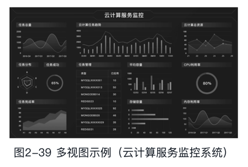

### 2.6 数据可视化工具
目前已经有许多数据可视化工具，而且大部分都是免费的，可以满足用户的各种可视化需求。  
数据可视化工具大致分为
#### 入门级工具
##### Excel
* Excel是微软公司的办公软件Office家族的系列软件之一，该软件通过工作簿存储数据，可以进行各种数据的处理、统计分析和辅助决策操作，已经被广泛地应用于管理、统计、金融等领域。
Excel是日常数据分析工作中最常用的工具，简单易用，用户通过简单的学习就可以轻松使用Excel提供的各种图表功能。  
尤其是在需要制作折线图、饼状图、柱状图、散点图等各种统计图表时，Excel通常是普通用户的首选工具。  
Excel 2016内置了Power Query插件、管理数据模型、预测工作表、Power Privot、PowerView、Power Map等数据查询分析工具。
* Excel的缺点是在颜色、线条和样式上可选择的种类较为有限。
#### 信息图表工具
信息图表是信息、数据、知识等的视觉化表达工具，它利用人脑对于图形信息相对于文字信息更容易理解的特点，能更高效、直观、清晰地传递信息，在计算机科学、数学以及统计学领域有着广泛的应用。
##### 1．D3
D3.js是最流行的可视化库之一，是一种数据操作类型的JavaScript库（也可视其为插件），用于创建数据可视化图形。  
D3（Data-Driven Document）可以处理数字、数组、字符串或对象，也可以处理JSON和GeoJSON数据。  
D3最擅长处理矢量图形（SVG图或GeoJSON数据），能够提供除线性图和条形图之外的大量的复杂图表样式。
* D3操作数据文档的步骤如下：
    * （1）把数据加载到浏览器的内存空间；
    * （2）把数据绑定到文档中的元素，根据需要创建新元素；
    * （3）解析每个元素的范围资料（bound datum）并为其设置相应的可视化属性，实现元素的变换（transforming）；
    * （4）响应用户输入实现元素状态的过渡（transitioning）。
* 学习D3的过程，就是学习它如何进行加载、绑定数据，变换和过渡元素的语法过程。

##### 2．Flot
* Flot是一套用JavaScript编写的绘制图表用的函数库，专门用在网页上执行绘制图表功能。  
由于Flot是使用jQuery编写的，所以也称它为jQuery Flot。  
它的特点是体积小、执行速度快、支持的图形种类多。  
除此之外，Flot还有许多插件可供使用，用以补充Flot本身所没有的功能。
* Flot在开发上容易上手，用户只需写20行代码就可以绘制出一个简单的折线图。  
Flot本身所提供的API文件很多，使用者也很多，在开发中碰到问题时只要到网络上搜索一下，几乎都可以找到解决的答案。  
目前Flot支持的图表类型有折线图、饼图、直条图、分区图、堆栈图等，也支持实时更新图表及Ajax update图表。

##### 3．ECharts
ECharts是一个免费的、功能强大的、可视化的库。  
用它可以非常简单地向软件产品中添加直观的、动态的和高度可定制化的图表。  
它是一个全新的基于ZRender的用纯JavaScript打造的Canvas库。  
* ECharts的特点如下：
    * （1）它有非常丰富的图表类型。
        * ECharts不仅提供常见的如折线图、柱状图、散点图、饼图、K线图等图表类型，
        * 还提供了用于地理数据可视化的地图、热力图、线图，
        * 用于关系数据可视化的关系图、树图，
        * 还有用于商业智能（Business Intelligence，BI）的漏斗图、仪表盘，
        * 并且支持图与图之间的混搭。
    * （2）支持多个坐标系。
        * 如支持直角坐标系、极坐标系、地理坐标系。  
        * 图表可以跨坐标系存在，
        例如，可以将折线图、柱状图、散点图等放在直角坐标系上，也可以放在极坐标系上，甚至可以放在地理坐标系中。
    * （3）支持在移动端进行交互优化。
    例如，支持在移动端小屏上用手指在坐标系中进行缩放、平移等操作。
    在PC端也可以用鼠标在图中进行缩放（用鼠标滚轮）、平移等操作。
    因此，它对PC端和移动端的兼容性和适应性很好。
    * （4）深度的交互式数据探索。
    ECharts提供了legend、visualMap、dataZoom、tooltip等组件，增加了图表附带的漫游、选取等操作，提供了数据筛选、视图缩放、展示细节等功能。
    * （5）支持大数据量的展现。
    ECharts对大数据的处理能力非常好，借助Canvas的功能，可在散点图中轻松展现上万甚至十万的数据。
    * （6）支持多维数据以及视觉编码手段丰富。
    ECharts 3除了具备平行坐标等常见的多维数据可视化工具外，还支持对传统的散点图等传入数据的多维化处理。  
    配合视觉映射组件visualMap提供的丰富的视觉编码，可将不同维度的数据映射到颜色、大小、透明度、明暗度等不同的视觉通道。
    * （7）支持动态数据。
    ECharts以数据为驱动，它会找到两组数据之间的差异，然后通过合适的动画去表现数据的变化，再配合timeline组件就能够在更高的时间维度上去表现数据的信息。
    * （8）特效绚丽。
    ECharts针对线数据、点数据等地理数据的可视化提供了吸引观众眼球的特效，如模拟迁徙等。

##### 4．Visual.ly
Visual.ly是一款非常流行的信息图制作工具，非常实用。  
用户无须学习任何相关的设计知识，就可以用它来快速创建自定义的、样式美观且具有强烈视觉冲击力的信息图表。  
Visual.ly的理念是抓住每个数据来源的特性，从而制作相对应的信息图模板，最终实现自动化制图的功能。  
目前Visual.ly限定数据来源，只能导入来自Twitter、Facebook的数据，而且需要与用户的账号关联。

##### 5．Tableau
Tableau是新一代商业智能工具软件，它将数据连接、运算、分析与图表结合在一起，各种数据容易操控，用户只需将大量数据拖放到数字“画布”上，就能快速地创建出各种图表。  
* Tableau的产品包括：
使用得最多
##### Tableau Desktop
Tableau Desktop是一款桌面软件应用程序，分为个人版和专业版。  
Tableau Desktop能连接许多数据源，如Access、Excel、文本文件DB2、MS SQL Server、Sybase等，  
在获取数据源中的各类结构化数据后，Tableau Desktop可以通过拖放式界面快速地生成各种美观的图表、坐标图、仪表盘与报告，并允许用户以自定义的方式设置视图、布局、形状、颜色等，从而通过各种视角来展现业务领域的数据及其内在关系。
##### TableauServer
Tableau Server是一款企业智能化应用软件，该软件基于浏览器提供数据的分析和图表的生成等功能。  
通过Web浏览器的发布方式，Tableau Server将Tableau Desktop中最新的交互式数据转换为可视化内容，使仪表盘、报告与工作簿的共享变得迅速、简便。  
* 使用者可以将Tableau视图嵌入其他Web应用程序中，灵活、方便地生成各类报告，
* 同时，利用Web发布技术，Tableau Server还支持iOS或Android移动应用端数据的交互、过滤、排序与自定义视图等功能。

##### TableauReader
Tableau Reader是一款免费的应用软件，可用于打开Tableau Desktop所创建的报表、视图、仪表盘文件等。  
在分享Tableau Desktop数据分析结果的同时，TableauReader可以进一步对工作簿中的数据进行过滤、筛选和检测。

-----
* Tableau Public
* Tableau Online等

##### Raphaël


#### 地图工具
地图工具在数据可视化中较为常见，它在展现数据基于空间或地理分布上具有很强的表现力，可以直观地展现各分析指标的分布、区域等特征。  
当指标数据要表达的主题与地域有关联时，就可以选择以地图作为大背景，从而帮助用户更加直观地了解数据的整体情况，同时也可以根据地理位置快速地定位到某一地区来查看详细数据。
##### 1．PolyMaps
PolyMaps可同时使用位图和SVG矢量地图，为地图提供了多级缩放数据集，并且支持矢量数据的多种视觉表现形式。

##### 2．Modest Maps
Modest Maps是一个可扩展的交互式免费库，它提供了一套查看卫星地图的API，是目前最小的地图库。  
ModestMaps是一个开源项目，有强大的社区支持，是网站中整合地图应用的理想选择。  
Modest Maps支持很多功能强大的扩展库。

##### 3．Leaflet
Leaflet是一个专门为移动设备开发的互动地图库，是一个开源的JavaScript库。  
Leaflet设计坚持简便、高性能和可用性好的原则，可在所有主要桌面和移动平台高效运作，在浏览器上还可利用HTML5和CSS3的优势，同时也支持旧的浏览器访问，支持插件扩展，提供了友好且易于使用的API文档和简单可读的源代码。

##### 4．OpenLayers
* OpenLayers是一个用于开发WebGIS（网络地理信息系统）客户端的JavaScript包。  
OpenLayers支持的地图来源包括Google Maps、Yahoo Maps、Microsoft VirtualEarth等，用户还可以用简单的图片地图作为背景图，与其他的图层在OpenLayers中进行叠加。
* 在操作方面，
    * OpenLayers除了可以在浏览器中帮助开发者实现地图浏览的基本效果（如放大、缩小、平移等）常用操作之外，
    * 还可以进行选取面、选取线、要素选择、图层叠加等不同的功能操作，
    * 甚至可以对已有的OpenLayers操作和数据支持类型进行扩充，赋予其更多的功能。

##### Kartograph
##### Quanum GIS


#### 高级分析工具
##### 1．Processing
Processing是一门适合于设计师和数据艺术家的开源语言，它具有语法简单、操作便捷的特点。
* Processing开发环境（PDE）包括
    * 一个简单的文本编辑器
    * 一个消息区
    * 一个文本控制台
    * 管理文件的标签
    * 工具栏按钮
    * 菜单
* 使用者可以在文本编辑器中编写自己的代码，这些程序称为草图（Sketch），然后单击“运行”按钮即可运行程序。 
* 在Processing中，程序设计默认采用Java语言，当然也可以采用其他的语言，如Python等。
* 在数据可视化方面，Processing不仅可以绘制二维图形（默认是二维图形），还可以绘制三维图形。
* 除此之外，为了扩展其核心功能，Processing还包含许多库和工具，支持播放声音、计算机视觉、三维几何造型等。

##### 2．R
R是属于GNU系统的一个免费、开源的软件，是一套完整的数据处理、计算和制图软件系统。  
* 其功能包括：
    * 数据存储和处理系统；
    * 数组运算工具（其向量、矩阵运算方面功能尤其强大）；
    * 完整连贯的统计分析工具；
    * 优秀的统计制图功能；
    * 简便而强大的编程语言：
        * 可操纵数据的输入和输出，
        * 可实现分支、循环，
        * 用户可自定义功能。

* R语言的使用，在很大程度上也是借助各种各样的R包的辅助，  
从某种程度上讲，R包就是针对R的插件，不同的插件可满足不同的需求，如经济计量、财经分析、人文科学研究以及人工智能等。

##### 3．Python
Python是一种面向对象的解释型计算机程序设计语言，目前已成为最受欢迎的程序设计语言之一。  
Python具有简单、易学、免费开源、可移植性好、可扩展性强等特点。  
在国内外用Python做科学计算的研究机构日益增多，一些知名大学已经采用Python来教授程序设计课程。  
* 众多开源的科学计算软件包都提供了Python的调用接口，例如，
    * 著名的计算机视觉库OpenCV、
    * 三维可视化库VTK、
    * 医学图像处理库ITK。
* 而Python专用的科学计算扩展库就更多了，例如，十分经典的科学计算扩展库：
    * NumPy
    * Pandas
    * SciPy
    * Matplotlib
    * Pyecharts
    它们为Python提供了快速数组处理、数值运算以及绘图功能。   
    因此，Python语言及其众多的扩展库所构成的开发环境十分适合工程技术和科研人员处理实验数据、制作图表，甚至是开发科学计算应用程序。

##### 4．Gephi
Gephi是网络分析领域的数据可视化处理软件。  
它是一款信息数据可视化利器，开发者对它的定位是“数据可视化领域的Photoshop”。  
Gephi可用作探索性数据分析、链接分析、社交网络分析、生物网络分析等。  
虽然它比较复杂，但可以生成非常吸引人们眼球的可视化图形。

##### NodeBox
##### Weka

# 第二部分是数据分析，包括第3～8章。
这6章 详细介绍了时间数据、比例数据、关系数据、文本数据、复杂数据以及用户交互的各种可视化理论和方法。

## 第3章 时间数据可视化
本章讲述时间数据在大数据中的应用及其图形表示方法，  

### 时间数据
3.1 时间数据在大数据中的应用
* 时间是一个非常重要的维度与属性。  
时间序列数据存在于社会的各个领域，如临床诊断记录、金融和商业交易记录、天文观测数据、气象图像等。  
诊断记录包括病人每次看病的病情记录以及心电图等扫描仪器的数据记录等，  
金融和商业交易记录包括股市每天的交易价格及交易量、超市中每种商品的销售情况等。
* 不管是延续性还是暂时性的时间数据，可视化的最终目的就是从中发现趋势。  
看到什么已经成为过去，什么仍保持不变？  
找出它是在上升还是下降？  
造成这些变化的原因可能有什么？  
是否存在周期性的循环？  
* 要想找出这些变化中存在的模式，就必须超脱于单个数据点，纵观全局。只观察某个时间点上的数值固然很轻松，但只有在了解整个事件的来龙去脉之后，研究者才会对这些数据产生更深刻的理解和认识。  对数据了解得越多，研究者所获取的信息就越全面。
* 如图3-1所示，就业率有增有减，如果只看2001—2006年的数据，而忽略其他数据的话，就不能看出它的完整变化趋势，会误以为就业率一直在增长，
我们看到，2007—2009年就业率有所下降。
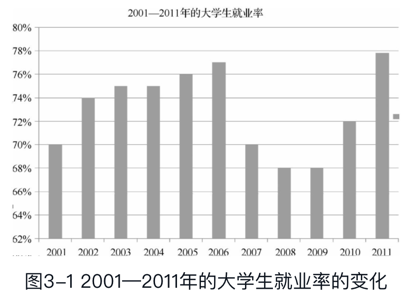

* 观察一幅图，不仅要了解全局，还要关注细节，
    * 重点观察有没有异常数据，哪个时段出现了剧烈下降或上升。  
    * 如果有的话，弄清楚是什么原因引起的。  
    * 当然这些也有可能是数据出现错误。
* 时间数据是按时间顺序排列的一系列数据值。  
与一般的定量数据不同，时间数据包含时间属性，不仅要表达数据随时间变化的规律，还需表达数据分布的时间规律。  

* 时间数据可以分为连续型时间数据和离散型时间数据两种。
下面介绍连续型和离散型时间数据的可视化。

#### 3.2 连续型时间数据可视化
* 连续型时间数据就是指任意两个时间点之间可以细分出无限多个数值，它表现的是不断变化的现象。  
    * 例如，温度就是连续型时间数据，人们可以测量一天内的任意时刻的温度。  
    * 股市实时行情也是一种连续型时间数据。
* 这类的实例很多，那么，应该如何处理这些数据呢？
答案是使用数据的可视化进行处理。
下面讲述几个连续型时间数据的可视化图形示例。
* 主要介绍连续型时间数据的处理，其中包括
##### 1 阶梯图
阶梯图是曲线保持在同一个值，直到发生变化，直接跳跃到下一个值，其形状类似于阶梯。  
* 比如，银行的利率，它一般会持续几个月不变，然后某一天出现上调或下调；  
* 或者楼盘价格长时间停留在某个值，突然有一天因为各种调控，出现调整。
对于这些类型的数据就可以使用阶梯图来展现，如图3-2所示。
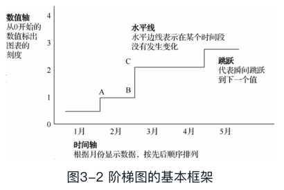
从图中可以看出，A点到B点保持在一个值，从B点到C点突然发生跳跃变成另一个值，这就是阶梯图的特征。
* 下面以用Python绘制阶梯图为例进行讲解。
    * 图3-3展示的就是最终的图表。它表现的是美国邮政投递信件的邮费变化。  
    注意，图中的变化不是定期变化的。从图中可以看出在1995—1998年邮费没有发生变化，但是在2006—2009年则邮费每年涨一次。
    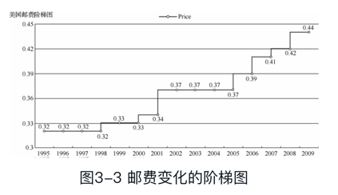
    * Python实现代码如下：
    此处使用的是pyecharts模块
    from pyecharts import LIne
    line = Line("美国邮费阶梯图")
    datax = [1995, 1996, 1997, 1998, 1999, 2000, 2001, 2002, 2003, 2004, 2005, 2006, 2007, 2008, 2009]
    datay = [0.32, 0.32, 0.32, 0.32, 0.33, 0.33, 0.34, 0.37, 0.37, 0.37, 0.37, 0.39, 0.41, 0.42, 0.44]
    line.add("Price ", datax, datay, is_step = True, is_label_show = Ture, yaxis_min = 0.3, yaxix_max = 0.45)
    line.render()
        * 代码分析：
            * 事先准备数据，此处用两个列表存储数据，  
            其中，datax存储的是时间数据，  
            datay存储的是邮费数据，  
            如果数据量大则可以用文件存储数据。  
            * 然后用pyecharts.Line来绘制梯形图，
    * 另外，如果将line.add()函数中的is_step去掉，则呈现的图形就是一个折线图。
    有兴趣的读者可以试试，它的图表效果如图3-4所示。
    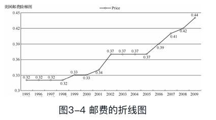
    

##### 2 折线图
折线图是用直线段将各数据点连接起来而组成的图形，以折线方式显示数据的变化趋势。  
在折线图中，沿水平轴均匀分布的是时间，沿垂直轴均匀分布的是数值。  
折线图比较适用于表现趋势，常用于展现如人口增长趋势、书籍销售量、粉丝增长进度等时间数据。  
这种图表类型的基本框架如图3-5所示。
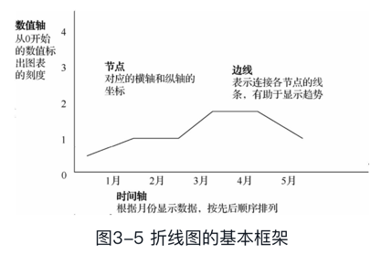
* 从图3-5可以看出数据变化的整体趋势。  
注意，横轴长度会影响展现的曲线趋势，若图中的横轴过长，点与点之间分割的间距比较大，则会使得整个曲线非常夸张；   
若横轴过短，则用户又有可能看不出数据的变化趋势。  
所以合理地设置横轴的长度十分重要。
* 下面举例讲解在Python中绘制时间序列的折线图，
此处使用了绘图库matplotlib模块。
    * 首先准备基础数据，
    world-population.csv文件是一份每年世界人口的数据统计表（本书配套资料中已包含该数据源）。
    此处是将数据存储在一个.csv文件中，
    * 然后载入数据，
    通过读取文件，将文件中的数据分别赋给两个列表，
    * 画图，
    最后通过plot()函数来绘制图表。
    * 最终图表展示如图3-6所示。
    从图表中可以一目了然地看到人口呈现增长的趋势。
    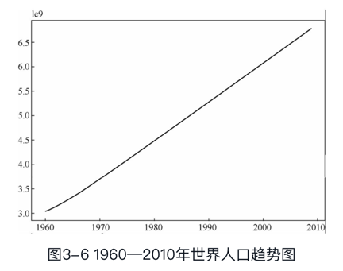

* 它的实现代码如下：
import csv
import matplotlib.pyplot as plt
filename = "world-population.csv"
datax = []
datay = []
with open(filename) as f:
    reader = csv.reader(f)
    for datarow in reader:
        if reader.line_num != 1:
            print(reader.line_num, datarow)
            datax.append(datarow[0])
            datay.append(datarow[1])
plt.plot(datax, datay)
plt.show()


##### 3 拟合曲线
拟合曲线是根据给定的离散数据点绘制的曲线，又称为不规则曲线。  
在实际生活与工作中，变量间未必都呈线性关系。  
拟合曲线是指选择适当的曲线类型来拟合观测数据，并用拟合的曲线方程分析两个变量间的关系。  
拟合曲线方法是由给定的离散数据点，建立数据关系（数学模型），求出一系列微小的直线段，并把这些插值点连接成曲线，只要插值点的间隔选择得当，就可以形成一条光滑的曲线。  
若获取的数据很多，或者数据很杂乱，则可能很难甚至无法辨认出其中的发展趋势和模式。  
因此，为了模拟出趋势，就可以用到拟合估算。  
图3-7所示为拟合的基本框架。
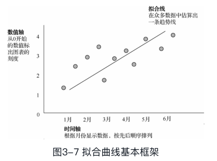
* 上述图形是通过直线进行拟合的，若数据呈现的并不是直线的趋势，而是带有波峰、波谷的趋势时应如何处理？
基于数据的非线性函数的线性模型是十分常见的，这种方法既可以像线性模型一样高效地运算，同时也使得模型可以适用于更为广泛的数据，多项式拟合就是这类算法中最为简单的一种。  
* 下面讲解在Python中如何利用多项式拟合来处理数据。  
图3-8所示为美国过去几十年的失业率的数据统计。
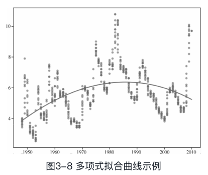
    * unemployment-rate-1948-2010.csv文件是一份包含1948—2010年每一年每个月的失业率的数据统计表（本书配套资料中已包含该数据源），如图3-8所示，通过一条曲线拟合出了这些年失业率的变化趋势。
* 实现代码如下：
import numpy as np
import matplotlib.pyplot as plt
import csv
import sys
filename = "unemployment-rate-1948-2010.csv"
xa = []
ya = []
try:
    with open(filename) as f:
        reader = csv.reader(f)
        for datarow in reader:
            if reader.line_num !=1:
                ya.append(float(datarow[3]))
                xa.append(int(datarow[1]))
except csv.Error:
    print("Error reading csv file")
    sys.exit(-1)
plt.figure()
plt.scatter(xa[:], ya[:], s=10, c='g', marker='o', alpha=0.5)
poly = np.polyfit(xa, ya, deg = 3)
plt.plot(xa, np.polyval(poly, xa))
plt.show()


#### 3.3 离散型时间数据可视化
离散型时间数据又称不连续性时间数据，这类数据在任何两个时间点之间的个数是有限的。  
在离散型时间数据中，数据来自于某个具体的时间点或者时段，可能的数值也是有限的。  
* 比如，奥运会奖牌的总数或者是各个国家金牌数就是离散数据，
* 各资格考试每年的通过率也是离散型数据。
* 类似的生活实例有很多，
下面将介绍如何对这些离散型时间数据进行可视化处理。
离散时间数据的处理，其中包括
##### 1 散点图
散点图，顾名思义就是由一些散乱的点组成的图，各值由点在图中的位置表示。在散点图中，水平轴表示时间，数值则表示在垂直轴上。散点图用位置作为视觉线索。如果将图区域视作一个盘子，那么，这些散点就是“大珠小珠落玉盘”，有如一颗颗星星，分布在广袤的天空。一般地，散点图包含的数据越多，呈现的效果就越好。图3-9所示为散点图的基本框架。

##### 柱形图
##### 堆叠柱形图

### 基础图形包括
#### 阶梯图、
#### 折线图、
#### 散点图和
#### 柱形图等；

## 第4章 比例数据可视化
### 介绍比例数据可视化，
### 比例数据的基础图形包括
#### 饼图、
#### 环形图、
#### 堆叠图等；

## 第5章
### 介绍关系数据可视化，
### 关系数据的基础图形包括
#### 散点图、
#### 气泡图、
#### 直方图、
#### 密度图等；


## 第6章 文本数据可视化
文字是传递信息最常用的载体。在当前这个信息量呈现爆炸式增长的时代，文本信息无处不在，人们接收信息的速度已经难以跟上信息产生的速度。  
当大段的文字摆在面前，已经很少有人能耐心、认真地把它读完。  
* 一般地，人们经常会先查看文中的图片。  
    * 这种情况一方面说明人们对图形的接受程度比枯燥的文字要高很多，
    * 另一方面说明人们急需一种更高效的信息呈现方式。
    文本数据可视化正是解决方案之一。
* 文本数据可视化的目的在于利用可视化技术刻画文本和文档，将其中的信息直观地呈现给用户。  
用户通过感知和辨析这些可视化的图元信息，从中获取所需的信息。  
因此，文本数据可视化的重要原则是帮助用户快速、准确地从文本中提取信息并将其展示出来。  
* 本章将简单介绍文本数据在大数据中的应用，并通过对文本数据可视化案例的阐释和分析帮助读者深入理解所学知识。

### 介绍文本数据可视化
6.1 文本数据在大数据中的应用及提取
#### 6.1.1 文本数据在大数据中的应用
* 目前，文本数据可视化的应用十分广泛，文本数据可视化的技术方法也很多。  
其中，标签云技术是深受用户喜爱的展示关键词的重要技术之一，它可有效地从数量巨大、数据类型多样、价值密度低的大量数据中快速提取有用信息。
* 目前，文本分析在大数据领域的应用较多。  
鉴于人们对文本信息需求的多样性，我们需要从不同层级提取与呈现文本信息。  
* 一般把对文本的理解需求分成三级：
    * 词汇级（Lexical Level）
    * 语法级（Syntactic Level）
    * 语义级（Semantic Level）
* 不同级的信息挖掘方法也不同
    * 词汇级使用各类分词算法
    * 语法级使用一些句法分析算法
    * 语义级则使用主题抽取算法
* 文本数据的类别多种多样，一般包括三大类：
    * 单文本
    * 文档集合
    * 时序文本数据。
    针对文本数据的多样性，人们提出多种普适性的可视化技术。
* 大数据中文本可视化的基本流程如图6-1所示，主要包括
    * 文本信息挖掘
    * 视图绘制
    * 人机交互
    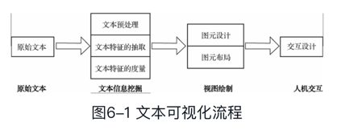

#### 6.1.2 使用网络爬虫提取文本数据
* 随着科技水平的不断提高，计算机网络得到了普及和发展，网络用户的行为也变得越来越复杂，随之产生的Web数据的数据量也呈指数形式增长。  
网络信息日益丰富，通过网页获取文本信息已经成为人们获取信息的主要途径。  
通过搜索引擎等普通手段已经无法快速地大量抽取海量Web文本信息，也无法有效地寻找到所需的文本信息，因此人们开发了网络爬虫这种技术手段来帮助用户高效地提取Web信息。

* 网络爬虫，也称网络蜘蛛（Web Spider），
如果把互联网比喻成蜘蛛网，Spider就是在网上爬来爬去的蜘蛛。  
    * 网络爬虫就是根据网页的地址（也就是URL）来寻找网页的。  
    举一个简单的例子，我们在浏览器的地址栏中输入的字符串就是URL，例如：`https://www.baidu.com/`。
        * URL就是统一资源定位符（Uniform Resource Locator），它的一般格式为“protocol://hostname\[:port\]/path/\[;parameters\]\[?query\]#fragment”。
        它包括三部分：
            * 第一部分是协议（protocol），
            例如，百度使用的就是HTTPS；
            * 第二部分hostname\[:port\]，主机名（还有端口号为可选参数，端口号一般默认为80），
            例如，百度的主机名就是www.baidu.com，这个就是服务器的地址；
            * 第三部分path是主机资源的具体地址，如目录和文件名等。
            网络爬虫就是根据URL对Web信息进行获取的。
* 一般解析网页使用的语言为Python。  
    * Python爬虫架构主要有
    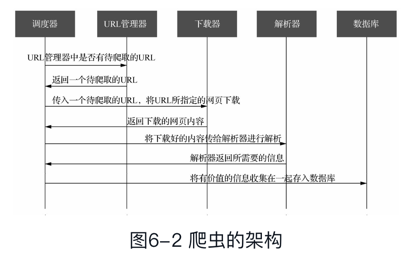
        * （1）调度器：
        相当于计算机CPU，主要负责URL管理器、网页下载器、网页解析器之间的协调工作。
        * （2）URL管理器：
        管理待爬取的URL地址和已爬取的URL地址，防止重复抓取URL和循环抓取URL。
        * （3）网页下载器：
        通过传入一个URL地址来下载网页内容，  
        Python支持网页下载的库有
            * urllib模块
            下面介绍Python内置的网页抓取组件urllib。  
            urllib是一个URL处理包，这个包中集成了如下处理URL的模块。
                * （1）urllib.request模块
                用于打开和读取URL。
                我们可以通过urllib.request.urlopen()接口函数打开网站，读取并打印信息，具体使用方法如下：
                urllib.request.urlopen(url, data=None, \[timeout,\] *, cafile=None, capath=None, cadefault=False, context=None)
                * （2）urllib.error模块
                包含一些由urllib.request产生的错误，可以使用try进行捕捉处理。
                * （3）urllib.parse模块
                包含了一些解析URL的方法。
                * （4）urllib.robotparser模块
                用来解析robots.txt文本文件。  
                它提供了一个单独的RobotFileParser类，通过该类提供的can_fetch()方法测试爬虫是否可以下载一个页面。
            * requests模块等
        * （4）网页解析器：
        将一个网页字符串进行解析。  
        网页解析器有
            * 正则表达式（直观，将网页转成字符串，通过模糊匹配的方式来提取有价值的信息，但该方法不适用于比较复杂的文档）
            * html.parser（Python自带的）
            * beautifulsoup（第三方插件）
            * lxml（第三方插件，可以解析xml和HTML）
        * （5）数据库：
        将从网页中收集的有价值的数据存入数据库。

### 6.2 文本信息分析
#### 6.2.1 向量空间模型
在文本数据可视化中，无法将非结构化的文本数据直接用于可视化，因此需要先对文本信息进行提取。  
* 提取文本信息需要采用适当的文本度量方法。  
向量空间模型（VectorSpace Model，VSM）是常用的方法之一，在信息检索、搜索引擎、自然语言处理等领域被广泛应用。  
向量空间模型是使用向量符号对文本进行度量的代数模型，把对文本内容的处理简化为向量空间中的向量运算，并且以空间相似度表达语义相似度。

##### 1．词袋模型
词袋模型（Bag of Words）指在信息检索中，将某一文本仅看作是一个词集合，而不考虑其语法、词序等信息。  
文本中每个词相互独立，不依赖于其他词的出现与否。  
词袋模型是向量空间模型构造文本向量的常用方法之一，常用来提取词汇级文本信息。  
* 词袋模型就是忽略词序、语法和语句，过滤掉对文本内容影响较弱的词（停用词），将文本看作一系列关键词汇的集合所形成的向量，
    * 每个词汇表示一个维度，
    * 维度的值就是该词汇在文档中出现的频率。
* 以Charles Dickens的《双城记》中的一段文字为例。  
“It was the best of times,  
it was the worst of times,  
it was the age of wisdom,  
it was the age of foolishness.”
这段文字共包含24个单词，在分词以后变为10个单词。经词干提取后，这段文字可表达为一个词频向量。表6-1是这段文字的词频向量的一部分。
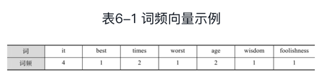

##### 2．TF-IDF
TF-IDF（Term Frequency-Inverse DocumentFrequency）是一种用于信息检索与数据挖掘的常用加权技术。  
* TF的含义是词频（Term Frequency），
词频（TF）是一个词语在一篇文件中出现的次数除以该文件的总词语数。  
假如一篇文件的总词语数是100个，而词语“母牛”出现了三次，那么“母牛”一词在该文件中的词频就是3/100=0.03。  
* IDF的含义是逆文本频率指数（Inverse Document Frequency）。
一个计算本例逆文本频率指数（IDF）的方法是，文件集里包含的文件总数除以测定有多少份文件出现过“母牛”一词，再对计算结果求对数。  
如果“母牛”一词在1000份文件出现过，而文件总数是10000000份的话，则其逆文本频率指数（IDF）就是lg(10000000/1000)=4。  
* 最后的TF-IDF的分数为0.03×4=0.12。

* 对向量空间模型而言，合理地分配文本中的每个词的权重十分重要。  
TF-IDF用于评估某个单词或字在一个文档集或语料库的重要程度。  
TF-IDF的主要思想是：如果某个词或短语在一篇文章中出现的频率（TF）高，并且在其他文章中很少出现，则可认为此词或者短语具有很好的类别区分能力，适合用来分类。  
也就是说，字词在某个文本的重要性与它在这个文本中出现的次数正相关，但同时也会随着它在文档集合中出现的频率增加而下降。

#### 6.2.2 主题抽取
一个文档的语义内容可描述为多主题的组合表达，一个主题可认为是一系列字词的概率分布。  
主题模型是对文字中隐含主题的一种建模方法，它从语义级别描述文档集中的各个文本信息。  
* 文本主题的抽取算法大致可分为两类：
    * 基于贝叶斯的概率模型
    对于概率模型，其主题被当成多个词项的概率分布，文档可以理解成由多个主题的组合而产生的；
    * 基于矩阵分解的非概率模型
    而非概率模型，它将词项-文档矩阵投影到K维空间中，其中，每个维度代表一个主题。  
    在主题空间中，每个文档由K个主题的线性组合来表示。  
    隐含语义检索是代表性的非概率模型，它基于主题间的正交性假设，采用SVD分解词项-文档矩阵。

### 6.3 文本数据可视化
文本数据可视化需要对文本中的内容进行提取、分析，再使用各种可视化方法进行展示
文本数据可视化可以分为
#### 文本内容的可视化
文本内容可视化是对文本内的关键信息分析后的展示
文本的内容可以通过关键词、短语、句子和主题进行展现。
##### 1．关键词可视化
一个词语若在一个文本中出现的频率较高，那么，这个词语就可能是这个文本的关键词，它可以在一定程度上反映出一个文本内容所要表达的含义。  
关键词可视化是用一个文本中的关键词来展示该文本的内容。
###### （1）标签云
标签云（Tag Clould）是一种最常见的、简单的关键词可视化方法，主要可分为如下两步。
* ① 统计文本中词语的出现频率，提取出现频率较高的关键词。
* ② 按照一定的顺序和规律将这些关键词展示出来。
例如，用颜色的深浅，或者字体的大小，来区分关键词的重要性。
如图6-3所示，将一个文本中的关键词提取出来，并用自定义的形状来呈现所有关键词，其中，频率越高的关键词，显示的颜色越深，字号越大；频率越低的关键词，显示的颜色越浅，字号越小。

目前，标签云可视化技术仍在不断地发展，其中，Wordle技术能以比标签云更美观的方式呈现关键词，并在空间利用上更为合理。

###### （2）文档散
* 文档散（DocuBurst）是由多伦多大学的ChristopherCollins教授制作的一个在线文本分析可视化工具，通过导入TXT格式的文本数据，生成HTML格式的可视化图片。
* 文档散使用词汇库中的结构关系来布局关键词，同时使用词语关系网中具有上下语义关系的词语来布局关键词，从而揭示文本中的内容。  
上下语义关系是指词语之间往往存在语义层级的关系，也就是说，一些词语是某些词语的下义词。  
而在一篇文章中，具有上下语义关系的词语一般是同时存在的。
* 文档散的使用方法如下。
    * ① 将一个单词作为中心点。
    中心点的词汇可以由用户指定，选择不同的中心点词汇呈现出的可视化结果将大不相同。
    * ② 将整个文章内的词语呈现在一个放射式层次圆环中，外层的词是内层词的下义词。
    这样就可以直观地展示文档的中心词在词语关系网中是如何被呈现的。
    如图6-4所示，外层的词是内层词的下义词，颜色饱和度的深浅用来体现词频的高低，图中的层次可由用户指定。
    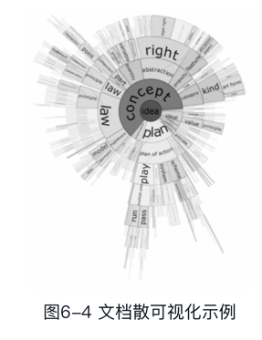

##### 2．时序文本可视化
时序文本具有时间性和顺序性，比如，新闻会随着时间变化，小说的故事情节会随着时间变化。
###### （1）主题河流
主题河流（ThemeRiver）是由Susan Havre等学者于2000年提出的一种时序数据可视化方法，主要用于反映文本主题强弱变化的过程。
* 经典的主题河流模型包括以下两个属性。
    * ① 颜色，表示主题的类型，一个主题用一个单一颜色的涌流表示。
    但是，颜色种类有限，若使用一种颜色表示一个主题，则会限制主题的数量，因此，可以使用一种颜色表示一类主题。
    * ② 宽度，表示主题的数量（或强度），涌流的状态随着主题的变化，可能扩展、收缩或者保持不变。
* 图6-5所示的主题河流可视化示例，横轴表示时间，河流中的不同颜色的涌流表示不同的主题，涌流的流动表示主题的变化。在任意时间点上，涌流的垂直宽度表示主题的强弱。
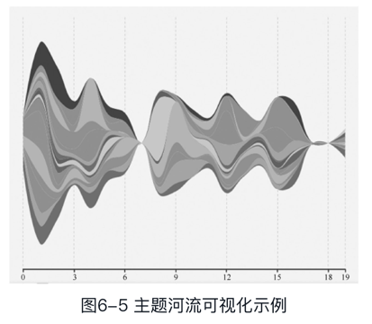
通过这种表示方法，时序文本内容的整体流动趋势就能很容易地被用户获取。
* 主题河流可视化方法虽然十分经典，但仍存在一定的局限性，它只能在每个时间刻度上将各主题简单概括成一个数值，这种做法并不能详细描述出主题的特性。
* 在实际应用中，除了要了解信息的主题随时间变化的信息外，用户往往还要了解更多其他相关的信息。因此，研究人员将主题河流与标签云技术相结合，将每个主题都用一组关键词来表示，允许用户从多个角度理解和总结文本，从而为用户提供一个有意义的、基于时间变化的主题强弱变化过程。

###### （2）文本流
文本流（TextFlow）是主题河流可视化技术的一种扩展，它不仅可以表达主题的变化，还能随着时间的推移展示各个主题之间分裂与合并的状态。
如图6-6所示，某个主题在某一时刻分裂成几个主题，或者多个主题在某个时间点合并成一个主题。
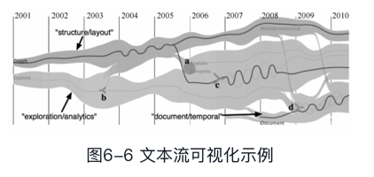


###### （3）故事流
故事流（StoryFlow）常用来表示电影或者小说里的剧情线或者时间线。
图6-7所示为“让子弹飞”这部电影的故事流可视化呈现，其中，横轴表示时间，每条线代表一个人物，当两个人在剧情中产生某种联系的时候，就会在图中相交。
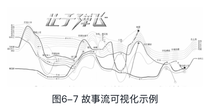


##### 3．文本分布可视化
* 上述的文本数据可视化方法都是通过关键词、文本主题来总结文本内容，但是文本中的其他特征，如词语的分布情况、句子的平均长度、词汇量等并没有展示出来。  
下面介绍的可视化方法可以解决这个问题。
* 文本弧（TextArc）可视化技术不仅可以展示词频，还可以展示词的分布情况。
* 文本弧的特性如下。
    * ① 用一条螺旋线表示一篇文章，螺旋线的首尾对应着文章的首尾，文章的词语有序地分布在螺旋线上。
    * ② 若词语在整篇文章中出现得比较频繁，则靠近画布的中心区域分布。
    * ③ 若词语只是在局部出现得比较频繁，则靠近螺旋线分布。
    * ④ 字体的大小和颜色深度代表着词语的出现频率。
* 图6-8所示即为一个典型的文本弧可视化示例。
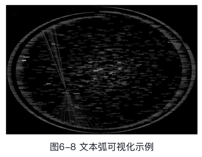
* 此外，用户可以通过可视化技术呈现某一特征在全文中的分布规律，比如，可以用文献指纹（LiteratureFingerprinting）技术呈现句子的平均长度这一特征，它用一个像素块代表一段文本，像素块的透明度代表这段文本的句子平均长度。
* 文本的内容按长短可分为不同的粒度，如关键词、短语和句子，可通过文本特征透镜（Feature Lens）对这些不同粒度词句的频率和分布情况进行可视化。

#### 文本关系的可视化
文本关系的可视化既可以对单个文本进行内部的关系展示，  
也可以对多个文本进行文本之间的关系展示；  
* 文本关系包括
    * 文本内或者文本间的关系
        * 文本内的关系有
            * 词语的前后关系；
        * 文本间的关系有
            * 网页之间的超链接关系
            * 文本之间内容的相似性
            * 文本之间的引用等；
    * 文本集合之间的关系
    文本集合之间的关系是指文本集合内容的层次性等关系。
* 文本关系可视化的目的就是呈现这些关系。
##### 1．基于图的文本关系可视化
###### （1）词语树
词语树（Word Tree）使用树形图展示词语在文本中的出现情况，可以直观地呈现出一个词语和其前后的词语。  
用户可自定义感兴趣的词语作为中心节点。  
中心节点向前扩展，就是文本中处于该词语前面的词语；  
中心节点向后扩展，就是文本中处于该词语后面的词语。  
字号大小代表了词语在文本中出现的频率。
* 如图6-9所示，图中采用了词语树的方法来呈现一个文本中Child这个词与其相连的前后所有的词语。


###### （2）短语网络
* 短语网络（Phrase Nets）包括以下两种属性。
    * ① 节点，代表一个词语或短语。
    * ② 带箭头的连线，表示节点与节点之间的关系，这个关系需要用户定义，
    比如，“A is B”，其中的is用连线表示，A和B是is前后的两个节点词语。
    A在is前面，B在is后面，那么，箭头就由A指向B。
    连线的宽度越宽，就说明这个短语在文中出现的频率越高。
* 如图6-10所示，图中使用短语网络对某小说中的“*the*”关系进行可视化。


###### （1）星系视图
星系视图（Galaxy View）可用于表征多个文档之间的相似性。  
假设一篇文档是一颗星星，每篇文档都有其主题，将所有文档按照主题投影到二维平面上，就如同星星在星系中一样。  
文档的主题越相似，星星之间的距离就越近；  
文档的主题相差越大，星星之间的距离就越远。  
星星聚集得越多，就表示这些文档的主题越相近，并且数量较多；  
若存在多个聚集点则说明文档集合中包含多种主题的文档。


###### （2）文档集抽样投影
当一个文档集中包含的文档数量过大时，投影出来的星系视图中就会产生很多重叠的星星。  
为了避免这种重叠情况的出现，用户可以对文档集进行抽样，有选择性地抽取部分文档进行投影，这样可以更加清晰地显示每个样本。

##### 2．文档间关系可视化
当对多个文档进行可视化展示时，针对文本内容进行可视化的方法就不适合了。  
此时可以引入向量空间模型来计算出各个文档之间的相似性，单个文档被定义成单个特征向量，最终以投影等方式来呈现各文档之间的关系。


#### 文本多特征信息的可视化
文本多特征信息的可视化，是结合文本的多个特征进行全方位的可视化展示。
* 对文本数据进行可视化时，可结合文本的多个特征进行分析。  
比如，对学术文章进行分析时，可结合作者、摘要、关键词、内容以及引用多个特征，从语义上分析各种文章主题的相似性，从而对文章进行聚类划分，可将相似的文章划分为一个类别。
* 平行标签云（Parallel Tag Cloud）将标签云在水平方向上基于多个不同的特征进行显示，每一个特征对应着一列标签云，列与列之间的特征都不一样。
如图6-11所示，以不同的兴趣点来显示标签云，每一列代表着用户的一个兴趣点，这一列的标签云代表了这一兴趣点的关键词出现频率，颜色越深，字号越大，则说明这个关键词在这个兴趣点上出现的频率越高。


### 6.4 实际案例
#### 6.4.1 词云图
图6-12所示为数据源post_data.csv的前面几行数据（本书配套资料中已包含该数据源），这份列表记录了某可视化网站上最受用户喜爱的100篇文章的浏览量、评论数和文章分类。  
下面计算出各类文章的浏览量总量，然后用pyecharts库中的WordCloud()函数绘制词云图，  
如图6-13所示，总浏览量越大的文章分类的名称显示越大，总浏览量越小的文章分类的名称显示越小。


#### 6.4.2 主题河流图
主题河流的数据反映了每一个主题的值基于时间的变化情况，如图6-14所示，

对应的代码如下：

#### 6.4.3 关系图
数据源weibo.json中包含大量的微博用户以及用户之间微博转发关系（本书配套资料中已包含该数据源），
用pyecharts库的Graph()函数可将用户节点和节点之间的转发关系绘制出来，如图6-15所示，

具体代码如下：


## 第7章 复杂数据可视化
### 介绍复杂数据可视化
* 目前，真实世界与虚拟世界越来越密不可分，移动互联网、物联网等信息的产生和流动瞬息万变，涌现了无数复杂的数据，如视频影像数据、传感器网络数据、社交网络数据、三维**时空数据**等。  
对此类具有高复杂度的高维多元数据进行解析、呈现和应用是数据可视化面临的新挑战。
* 对高维多元数据进行分析的困难如下。
    * （1）数据复杂度大大增加。
        * 复杂数据包括
            * 非结构化数据和
            * 从多个数据源采集、整合而成的异构数据，
        * 传统单一的可视化方法无法支持对此类复杂数据的分析。
    * （2）数据的量级已经超过了单机，甚至小型计算集群处理能力的上限，我们需要采用全新思路来解决这个问题。
    * （3）在数据获取和处理过程中，不可避免地会产生数据质量的问题，其中特别需要关注的是数据的不确定性。
    * （4）数据快速动态变化，常以流式数据形成存在，对流式数据的实时分析与可视化仍然是一个亟待解决的问题。

* 面对以上挑战，对二维和三维数据可以采用一种常规的可视化方法表示，将各属性的值映射到不同的坐标轴，并确定数据点在坐标系中的位置。
这样的可视化设计通常被称为散点图（Scatterplot）。 当维度超过三维后，还可以增加视觉编码进行表示，如颜色、大小、形状等。
* 但对更复杂的高维多元数据进行可视化处理时，这种方法仍存在很大的局限。
* 本章主要介绍针对数据的高维、大尺度、异构以及不确定性这四个特性的可视化方法。

复杂数据包括
#### 高维多元数据
7.1 高维多元数据在大数据中的应用
* 高维多元数据指每个数据对象有两个或两个以上独立或者相关属性的数据。  
    * 高维（Multidimensional）指数据具有多个独立属性，  
    * 多元（Multivariate）指数据具有多个相关属性。
* 若要科学、准确地描述高维多元数据，则需要数据同时具备独立性和相关性。
由于在很多情况下，研究人员无法确定数据的属性是否独立，因而通常简单地称之为多元数据。
例如，手机的配置如内核处理器、内存、款式等参数，每个参数都描述手机的一个属性，所有参数组成的配置就是一个多元数据。  
* 由于在数据理解、分析和决策等方面的突出表现，可视化技术在各类多元数据分析中得到广泛使用。
* 图7-1所示的散点图使用颜色和大小分别表示国家所在洲和人口这两个额外属性，直观、有效地实现了各国国民健康（Life expectancy）和收入（Income）之间关系的四维数据的可视化。

* 然而，由于视觉编码的种类有限，而且过多或过于复杂的视觉编码也会降低可视化的可读性。因此，我们需要使用更有效的可视化方法来展示维度更高的多元数据。
* 本节介绍多元数据可视化的两类基本方法

##### 1 空间映射法
散点图就是一种空间映射方法。  
散点图的本质是将抽象的数据对象映射到二维坐标表示的空间。  
* 若处理的是多元数据，散点图的概念可理解成：
在二维的平面空间中，采用不同的空间映射方法对高维数据进行布局，这些数据的关联以及数据自身的属性在不同位置得到了展示，  
而整个数据集在空间中的分布则反映了各维度间的关系及数据集的整体特性。

###### 1．散点图及散点图矩阵
前面章节介绍过散点图和散点图矩阵，散点图矩阵是散点图的扩展（见图7-2）。  
对于N维数据，采用N^2个散点图逐一表示N个属性之间的两两关系，这些散点图根据它们所表示的属性，沿横轴和纵轴按一定顺序排列，进而组成一个N×N的矩阵。  
随着数据维度的不断扩展，所需散点图的数量将呈几何级数的增长，而将过多的散点图显示在有限的屏幕空间中则会极大地降低可视化图表的可读性。  
因此，目前比较常见的方法就是交互式地选取用户关注的属性数据进行分析和可视化。  
通过归纳散点图特征，优先显示重要性较高的散点图，也可以在一定程度上缓解空间的局限。


###### 2．表格透镜
表格透镜（Table Lens）是对使用表格呈现多元数据（如Excel等软件）方法的扩展。  
该方法并不直接列出数据在每个维度上的值，而是将这些数值用水平横条或者点表示。  
表格透镜允许用户对行（数据对象）和列（属性）进行排序，用户也可以选择某一个数据对象的实际数值。
如图7-3所示，表格透镜清晰地呈现了数据在每个属性上的分布和属性之间的相互关系。


###### 3．平行坐标

平行坐标能够在二维空间中显示更高维度的数据，它以平行坐标替代垂直坐标，是一种重要的多元数据可视化分析工具。  
平行坐标不仅能够揭示数据在每个属性上的分布，还可描述相邻两个属性之间的关系。  
但是，平行坐标很难同时表现多个维度间的关系，因为其坐标轴是顺序排列的，不适合于表现非相邻属性之间的关系。  
一般地，交互地选取部分感兴趣的数据对象，并将其高亮显示，是一种常见的解决方法。  
另外，为了便于用户理解各数据维度间的关系，也可更改坐标轴的排列顺序。  
* 图7-4（a）所示为将散点图技术与平行坐标综合使用的示例，
* 图7-4（b）所示为采用自由摆放坐标轴（灵活轴线法）的示例。


###### 4．降维
当数据维度非常高时（如超过50维），目前的各类可视方法都无法将所有的数据细节清晰地呈现出来。  
在这种情况下，我们可通过线性/非线性变换将多元数据投影或嵌入低维空间（通常为二维或三维）中，并保持数据在多元空间中的特征，这种方法被称为降维（DimensionReduction）。  
降维后得到的数据即可用常规的可视化方法进行信息呈现。

##### 图标法
图标法的典型代表是星形图（Starplots），也称雷达图（Radar Chart）。  
星形图可以看成平行坐标的极坐标形式，数据对象的各属性值与各属性最大值的比例决定了每个坐标轴上点的位置，将这些坐标轴上的点折线连接围成一个星形区域，其大小形状则反映了数据对象的属性，如图7-5（星形图）和图7-6（雷达图）所示。


#### 非结构化数据
##### 7.2.1 基于并行的大尺度数据高分辨率可视化
复杂数据并不只有高维度数据，还包括异构数据等。
异构数据是指在同一个数据集中存在的如结构或者属性不同的数据。  
存在多个不同种类节点和连接的网络被称为异构网络。  
异构数据通常可采用网络结构进行表达。  
* 在图7-7中，基于异构社交网络的本体拓扑结构表达了某组织网络中的多种不同类别的节点。  
由于数据量大并且复杂度高，不能直接使用网络点线图进行可视化（见图7-7左图）。  
* 因此，我们可以采用从异构网络中提炼出本体拓扑结构的策略（见图7-7右图），
其中的节点是原来网络内的节点类型，连接相互之间存在关联的类别。  
以这个拓扑结构作为可视分析的辅助导航，用户可以在图中加入特定类别的节点和连接，从而起到过滤的作用。


* 产生数据的异构性的主要原因是数据源的获取方式的不同。
比如，微信用户数据不仅包括软件中点对点的聊天记录、GPS位置数据，还包括用户的部分个人信息。  
这些来自不同数据源的数据通常具有不同的数据模型、数据类型和命名方法等，  
因此，合理地整合底层的数据至关重要。  
* 将数据整合为可视化模块，可为众多独立和异构的数据源获取数据提供透明且统一的访问接口，从而支持多种类型的数据源的查询和可视化显示。

* 全方位显示大尺度数据的所有细节是一个计算密集型的过程，处理大尺度数据的基本技术路线就是构建大规模计算集群。  
例如，美国的马里兰大学构建了一个GPU和CPU混合式高性能计算和可视化集群，其架构如图7-8所示。


* 另外，大规模数据的高清可视化需要高分辨率的显示设备和显示方法。
高精度的大屏投影拼接面向的是专业级用户，普通的个人用户实现大尺度数据的高精度可视化则需要使用其他方法。  
    * 大尺度数据可视化一般有两种方法：
        * 一种是采用层次结构对大尺度数据进行重新组织；
        * 另一种就是将高精度的数据采样成分辨率较低的数据，在既定分辨率的视图里实现预览式的可视化。
    * Cleverland等人提出了可视化数据库的思想——复杂大尺度数据集的可视化使得大量超高分辨率的可视图需要多窗口、多页面进行存储。  
    其中，单视图对应于数据集的某个子集，因此可使用数据库生成、管理、解析和显示数据可视化结果的集合。  
    * 概括地说，使用多窗口的高效多视图来对数据库进行可视化处理的主要步骤如下：
        * （1）根据不同的需求，将大尺度复杂数据划分为数据子集；
        * （2）对每个数据子集进行分析，得出符合用户感知的可视化结果；
        * （3）对从各个不同角度形成的可视化视图采取数据库的架构方式进行存储与管理；
        * （4）针对不同的可视化视图，为用户提供敏捷的交互工具，并且实现多视图同步无缝更新。

##### 7.2.2 分而治之的大尺度数据分析与可视化
可视化领域以及计算机图形学有一种标准方法叫作分治（Divide and Conquer）法，如二叉树、四叉树等空间管理结构等。  
本节将从统计、数据挖掘和可视化等几个领域介绍分而治之的概念。
###### 1．统计分析层的分而重组
R语言面向统计分析的底层，是一门开源语言。  
虽然R语言是基于单线程来运行的，但其可通过大量的软件开发包实现多核并行计算。  
然而，即使是并行的方式也并不能降低大尺度数据的分析难度。  
针对这个问题，目前一种比较新颖的思路就是将数据划分为多个子集，对这些子集使用相应的方法来进行可视化的操作，最后再合并总体结果，这种方式就称为分而重组。  
* 分而重组的核心思想包含：
####### 拆分（Divide）
拆分包括以下两种算法。
######## （1）条件变量分割法
使用此方法时，一部分变量被选为条件变量，并且被分配到每个子集里。  
BSV（Between Subset-Variables）在不同子集中的取值各异，且一个子集在同一时间只能有一个BSV变量；  
WSV（Within-Subset Variables）则在同一个子集里取值。  
技术人员通过分析WSV伴随BSV的变化以及WSV之间的关系来确保分割的准确性。
######## （2）重复分割法
重复分割法中的数据被看作是包含r个变量的n个观察值，被认为是重复数。  
如果采用随机重复分割法对随机观察值不替换地产生子集，这种做法虽然处理速度快，但是各子集缺乏代表性；  
如果采用近邻剔除重复分割法，则n个观察值将被分割成拥有近乎相同观测值的邻居集合。
####### 重合（Recombine）。
重合算法包括
######## 统计重合法
统计重合，也就是合成各个子集的统计值，  
通常，我们根据不同的分割算法如近邻剔除重复分割法等方法的效果对比，选择最优的重合方案；
######## 分析重合法以
分析重合法主要是观察、分析和评估计算结果；
######## 可视化重合法
可视化重合法则是以小粒度观察数据的方法，并使用了多种抽样策略，包括聚焦抽样和代表性抽样。
* 从应用角度看，R语言实现了以上分而重合的过程，并将代码作为输入放入一个并行框架中，  
因此，我们可以在<span class="s2">Hadoop</span>集群上基于<span class="s2-1">MapReduce</span>框架实现该过程。

###### 2．数据挖掘层的分而治之
使用分而后合的方法对数据进行分类大体分为三个步骤：
* 首先，输入数据或者文本信息，将输入数据等份成n份或者按规则划分；
* 然后，对每份数据使用最适合的分类器进行分类，并将分类结果融合；
* 最后，通过一个强分类器计算获取最终结果。

###### 3．数据可视化的分而治之
大规模科学计算的结果之所以适合采用多核并行模式和分而治之法进行处理，是因其通常体现为规则的空间型数据。  
标准的科学计算数据的并行可视化可采用计算密集型的超级计算机、计算集群和GPU集群等模式。  
目前比较流行的<span class="s2">Hadoop</span>和<span class="s2-1">MapReduce</span>等处理框架通常被用来处理非空间型数据，  
<span class="s2-1">MapReduce</span>框架应用于科学计算的空间型数据，这就意味着使用统一的分而治之的框架可以处理科学计算的空间型数据和非结构化数据。

#### 不确定性数据
与数据错误和数据矛盾不同，数据的不确定性存在于数据处理过程的各个环节中，数据不确定性可视化有助于帮助用户准确地理解数据并做出正确决策。  
* 然而，到目前为止，此种方法仍有如下重要问题亟待解决：
    * （1）如何清晰地表示不确定性；
    * （2）如何降低或避免因不确定性可视化所带来的视觉混淆；
    * （3）如何降低不确定性可视化所引起的对确定性数据可视化结果的负面影响；
    * （4）不确定性表达的可视隐喻。
* 不确定性的来源
数据的收集、处理和可视化的过程都会产生不确定性。  
    * 例如，在测量时，测量仪器的优劣以及技术人员的测量水平都会给实际测得的数据带来不确定性；  
    * 同样地，不同的仿真模型也会为数据带来不确定性；  
    * 而且，在对原始数据进行可视化之前都要先对数据进行清洗、过滤操作，而这些操作可能会在一定程度上会改变原始数据，也带来了潜在的不确定性。

* 不确定性的可视化方法
针对种种原因产生的不确定性数据，我们将重点介绍几种可视化方法。  
目前的不确定性可视化方法大致可分为四类：
这几种方法的比较见表7-1。

##### 1．图标法
图标法比较常见的方法有：
###### 误差条（Error Bar）
误差条由一系列带标记的线条组成，用来对一维不确定性数据进行可视化，如图7-9所示。  
误差条的横轴一般表示数据实体，纵轴表示每个数据实体的统计特征，  
在通常情况下，数据实体的统计特征至少由均值、下限误差值和上限误差值组成。

###### 盒须图（Box Plot）
盒须图又称箱线图。  
* 五数统计图是一种最基本的盒须图，它包括
    * 上下边缘值（即最大值和最小值）
    * 上四分位数
    * 中位数
    * 下四分位数
    编码了数据最基本的统计特征。  
    图7-10所示的就是五数统计图的示例。
    
* 盒须图和误差条是专业技术人员常用的方法；对于普通用户而言，这种方法就显得不够直观了。  
对于二维确定性向量场，我们常用箭头等图标表示向量场的采样点方向和大小等信息。  
通过将更多信息编码于这些图标，可实现二维不确定性向量场的可视化。  
如图7-11所示，我们使用箭头表示风场中每个采样点上风的方向，箭头长度表示风的强度，箭头宽度表示风向的不确定性（纤细的箭头代表不确定性较小，粗壮的箭头则表示不确定性较大）。

* 在一般情况下，由于大量图标的布局会造成严重的遮盖，进而导致视觉混乱，因此图标法适合用于对稀疏不确定性数据进行可视化。

###### 流场雷达图（Flower Rader Glyph）等

##### 几何体表达法(几何体表示法)
利用有代表性的几何物体可提供更加丰富的视觉表达效果，以此来表达数据的不确定性。  
* 常用的基本几何物体有点、线、面、网格、体等，通常，点、线等简单几何体仅能编码一维不确定性的数据，
* 而对于一些高维度数据的不确定性，则可以采用一些更加复杂的几何体来表示。
* 图7-12采用包围体表达的不确定性可视化结果，主要步骤包括：
    * 首先，将原始数据转换为一个概率场；
    * 然后，设计传输函数或颜色映射对概率场进行颜色和透明度编码；
    * 最后，通过体绘制或者混合多个等值面的方式实现不确定性可视化。
    
* 几何体表达法在某种程度上与图标法有着一定的相似性，其可视化结果比较形象、直观且易于理解，相较于图标法还能表达高维度的不确定性。  
然而这种方法在引入代理几何体表示不确定性时，会干扰原有的可视化结果，会让用户潜意识里认为这些几何体就是数据的组成部分，而非不确定性的可视载体。
    
##### 视觉元素编码法
以视觉元素作为不确定性编码的基本载体是众多不确定性可视化方法的基本思想。  
* 基本的视觉标量包括
    * 位置
    * 形状
    * 亮度
    * 颜色
    其中，颜色是表达不确定性的常用视觉元素之一，通过将不确定性映射为不同的颜色，即可实现不确定性的可视编码；  
    * 方向
    * 纹理等。  
    而纹理则是一个比较复杂的视觉元素，它是颜色、尺寸、形状和方向等视觉元素的综合体现。
    狭义地讲，纹理指的是某种模式的空间分布频率，常用于类别型数据的可视化，纹理所包含的细节信息的丰富程度会直接影响用户对可视化结果的理解。
* 视觉元素编码法是一种非常直接的不确定性可视化方法，
因为其采用视觉元素作为不确定性的表达载体，所以用户可以快速地定位可视化结果中不确定性所在的区域和大小。  
然而，用户对视觉元素的选择往往与心理和感知有着极大的联系。  
因此，在实际应用中，需要精心选择合适的视觉元素对不确定性进行编码。


##### 动画表达法
* 在人类视觉系统的处理过程中，运动具有极高的处理优先级。  
因此，动画也是可视化的一种重要表达形式。  
与其他方法相比，动画表达法是一种基于动态信息表达的方法。  
若要发现数据中不确定性所在的大小、范围等信息，就要求用户持续关注可视化的结果。  
众多动画相关参数都可用于编码不确定性，如速度、时间单位、关键帧、闪烁、运动范围等。

* 动画表达法的基本思想是将不确定性隐式地编码于一个与时间有关的函数中。  
其中，可用不确定性函数u(t)来表示t时刻的动画关键帧的可视化结果。  
    * 如图7-13中的上图所示，将不确定性编码于一个与时间相关的曲面形变函数，通过形状的变化表达不确定性； 
    * 而图7-13的下图则展示了一个将不确定性编码于一个与时间相关的颜色映射函数的可视化结果。
    

* 尽管动画表达法能够比较形象地展现数据中的不确定性，然而，它需要用户长时间且连续地观察动画才能找到不同帧间的差别，因此这种方法需要比静态可视化更长的理解曲线。
另外，动画中的跳动、闪烁等不确定性表达方式还容易造成用户的视觉疲劳。

## 第8章
### 详细介绍了数据可视化交互的原则、
### 分类和
### 技术，通过交互技术能让用户更好地理解和分析数据。


# 第三部分是实际应用，包括第9章。

## 第9章

### 详细介绍了数据可视化在科研领域、

### 网络领域以及

### 商业领域的各种应用。


> [《大数据技术基础》2018-08-01](https://weread.qq.com/web/reader/ca232c20717d32bfca2f70ckc81322c012c81e728d9d180)

# 第9章 数据可视化技术
这也是软件工程师与数据工程师合作的最终工作成果，有助于帮助用户理解大数据技术的价值。

<span class="s2">Hadoop</span>生态圈的核心部件（如<span class="s2-1">HDFS</span>、Yarn和<span class="s2-1">Hadoop</span>等）都提供可视化的管理功能，能帮助用户直观、快速地了解集群的运行状态。
第6章Kylin、Superset及第8章的Zeppelin等OLAP工具的重要任务是为用户提供在线可视化分析功能。
但在企业级应用开发中，在前面章节中提到的技术无法直接集成到应用系统，还需要使用基于桌面、Web等的可视化组件进行定制开发。

本章简单介绍
## 数据可视化的发展历史
### 9.1 数据可视化概述
数据可视化，是指将结构或非结构化的数据转换成适当的可视化图表，然后将隐藏在数据中的信息直接展现在人们面前，是一种关于数据视觉表现形式的科学技术研究。
* 数据可视化起源于18世纪，William Playfair在《The Commercial andPolitical Atlas》一书中首次使用了柱形图和折线图表示国家的进出口量。19世纪初，他还在《Statistical Breviary》一书里，又首次使用了饼状图。直到今天，柱状图、折线图和饼状图是至今最常用的数据可视化的表现形式。到了19世纪中叶，数据可视化主要被用于军事用途，用来表示军队死亡原因、军队的分布图等，其中，南丁格尔图是最为著名的例子。
* 到了19世纪中叶，数据可视化主要被用于军事用途，用来表示军队死亡原因、军队的分布图等，其中，南丁格尔图是最为著名的例子。
在南丁格尔图中，雷达轴分为12个区间，分别代表了从1854年4月至1855年3月共12个月份，最内层区域代表因受伤而死亡的人数，中间一层黑色区域代表因其他原因死亡的人数，最外层区域代表因患本可治愈疾病死亡的人数。通过该图可以很直观地发现，本可采用治疗避免死亡的人数远远大于战争的直接伤亡人数。
* 进入20世纪，数据可视化有了飞跃性的发展。  
数据可视化的方式可以分为
    * 面积与尺寸可视化、
    对同一类图形（例如柱状、圆环图等）的长度、高度或面积加以区别，表达不同指标对应的指标值之间的对比。制作这类可视化图形需要用数学公式计算出准确的尺度和比例。
    * 颜色可视化、
    通过颜色的深浅来表达指标值的强弱和大小，是数据可视化的常用方法，用户可直观地发现数据的突出指标，例如，热力图。
    * 图形可视化
    在设计指标及数据时，使用有对应实际含义的图形结合呈现数据，会使数据图表更加生动，便于用户理解图表要表达的主题。
    * 地域空间可视化和
    当指标数据要表达的主题与地域相关时，一般会选择用地图作为大背景。用户不仅可以直观地了解整体的数据情况，也可以根据地理位置快速地查看某一地区的详细数据。
    * 概念可视化等。
    通过将抽象的指标数据转换成人们更熟悉、更容易感知的数据，用户便更容易理解图形要表达的意义。
## 可视化工具分类，

### 9.2 数据可视化工具
* 根据可视化工具的使用方式使用用户的不同，可分为

#### 桌面数据可视化技术（如Excel、R可视化和Python可视化等）、
9.2.1 桌面可视化技术

##### 1.Microsoft Excel
Microsoft Excel是一款常用的办公软件，它是具有直观的界面、出色的计算功能和图表工具的个人计算机上的数据处理软件。
* 获取数据后，可先使用Excel进行数据预处理，采用手动或自动方式进行数据输入；
* 接着进行格式设置，改变单元格区域外观等；
* 对处理好的数据，可使用排序、筛选等方法进行数据分析与分类汇总；
* 最后进行可视化处理，以更加直观地向用户展示数据。

Microsoft Excel中的常用图表有柱形图、条形图、折线图、面积图、饼图和散点图等。  
作为一个入门级工具，Microsoft Excel是快速分析数据的理想工具，也能创建供内部使用的数据图。  
通过Microsoft Excel绘制的图像可以方便地嵌入Microsoft Word和Microsoft Powerpoint中，是数据可视化的利器之一。

##### 2.SPSS
统计产品与服务解决方案（Statistical Product and Service Solutions，SPSS），是最早采用图形菜单驱动界面的统计软件，其突出优势在于用户操作界面友好、美观。  
用户只需要具备一些基本的Windows操作知识，并掌握统计分析原理，就可以将SPSS运用在科研工作中，深受社会科学、统计学和医学领域研究者喜爱。  
SPSS采用的是与Microsoft Excel类似的方式输入与管理数据，数据接口较为通用，能方便地从其他数据库中读入数据。  
其统计过程包括了常用的、较为成熟的统计过程，完全可以满足非统计专业用户的需求。  
SPSS输出结果十分美观，支持HTML格式和文本格式的转存。  
SPSS forWindows可以直接读取EXCEL及DBF数据文件，易学、易用，与SAS、BMDP并称为国际上最有影响的三大统计分析软件。

##### 3.R可视化
R是属于GNU系统的一个自由、免费、源代码开放的软件，它是一个集统计分析与图形显示于一体的用于统计计算和统计制图的优秀工具。及可运行于UNIX、Windows和Macintosh的操作系统上，而且嵌入了一个非常方便实用的帮助系统。
用户可以在R官方网站及其镜像中下载任何有关的安装程序、源代码、程序包及文档资料。R还是一种编程语言，具有语法通俗易懂、易学易用和资源丰富的优点。大多数最新的统计方法和技术都可以在R中直接获取。
R具有强大的用户交互性，它的输入/输出都是在同一个窗口进行，输出的图形可以直接保存为JPG、BMP、PNG、PDF文件，并提供与其他编程语言、数据库交互的接口。
ggplot2是R语言中一个功能强大的作图软件包，源于其自成一派的数据可视化理念。当熟悉了ggplot2的基本方法后，数据可视化工作将变得非常轻松而有条理。用户只需要完成初始化、绘制图层、调整数据相关图形元素、调整数据无关图形元素几个步骤就能完成绘制。

#### 在线数据可视化技术（Superset等）和

#### Web数据可视化技术（如D3.js、ECharts等），

下面就代表型的工具进行介绍。
## 重点结合ECharts介绍Web可视化组件生成方法，并给出Java Web开发与相关大数据组件的数据集成方法


# 伍君仪  透析英语创始人
