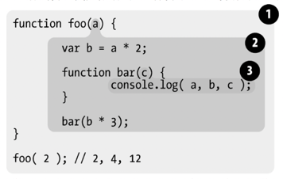
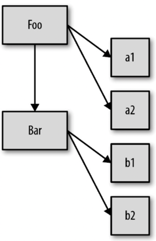
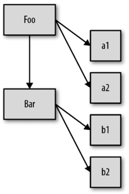
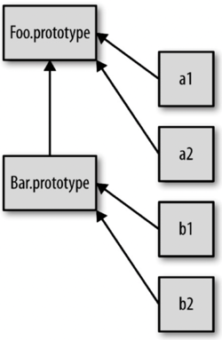
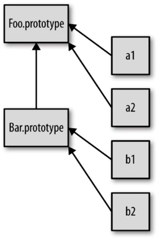
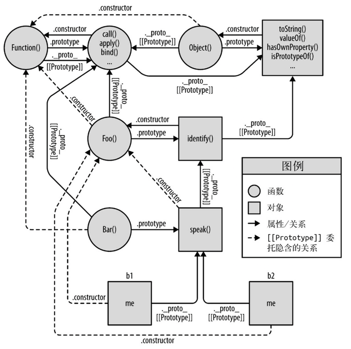
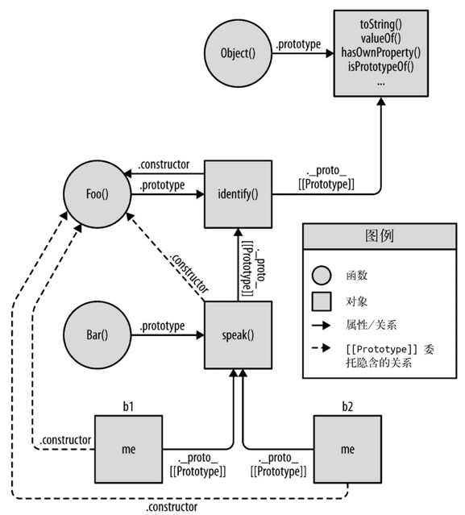
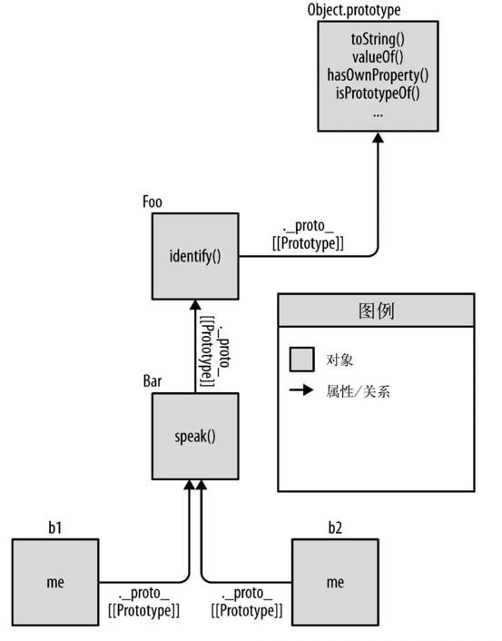

> [《你不知道的JavaScript（上卷）》2015.4](https://weread.qq.com/web/reader/8c632230715c01a18c683d8kc81322c012c81e728d9d180)

# 第一部分 <span class="s3">作用域</span>和闭包

    
## 第1章 <span class="s3">作用域</span>是什么
* 储存和访问变量的值的能力将状态带给了程序。但是将变量引入程序会引起几个很有意思的问题：			
    * 这些变量住在哪里？换句话说，它们储存在哪里？		
	* 最重要的是，程序需要时如何找到它们？		
	这些问题说明需要一套设计良好的规则来存储变量，并且之后可以方便地找到这些变量。这套规则被称为<span class="s3">作用域</span>。		

* JavaScript事实上是一门**编译**语言。但与传统的**编译**语言不同，它不是提前**编译**的，**编译**结果也不能在分布式系统中进行移植。  								
* JavaScript<span class="s1">引擎</span>进行**编译**的步骤和传统的**编译**语言非常相似，在某些环节可能比预想的要复杂。								
例如，在<span class="strong">语法分析</span>和代码生成阶段有特定的步骤来对运行性能进行优化，包括对冗余元素进行优化等。							
JavaScript<span class="s1">引擎</span>不会有大量的（像其他语言<span class="s4">编译器</span>那么多的）时间用来进行优化。对于JavaScript来说，大部分情况下**编译**发生在代码执行前的几微秒（甚至更短！）的时间内。							
在我们所要讨论的<span class="s3">作用域</span>背后，JavaScript<span class="s1">引擎</span>用尽了各种办法（比如JIT，可以延迟**编译**甚至实施重**编译**）来保证性能最佳。							
* 任何JavaScript代码片段在执行前都要进行**编译**（通常就在执行前）。因此，JavaScript<span class="s4">编译器</span>首先会对var a = 2；这段程序进行**编译**，然后做好执行它的准备，并且通常马上就会执行它。								

* 究竟在哪里而且怎样设置这些<span class="s3">作用域</span>的规则呢？	
    1. <span class="s1">引擎</span>  
    从头到尾负责整个JavaScript程序的**编译**及执行过程。																	
        * (1) var a = 2；<span class="s1">引擎</span>认为这里有两个完全不同的声明（变量的赋值操作会执行两个动作）：																	
            * 由<span class="s4">编译器</span>在**编译**时处理									
            var a在其<span class="s3">作用域</span>中声明新变量。这会在最开始的阶段，也就是代码执行前进行。							
            * 由<span class="s1">引擎</span>在运行时处理									
            a = 2会查询（<span class="s3">LHS</span>查询）变量a并对其进行赋值。							
        * (3) <span class="s1">引擎</span>运行时会首先询问<span class="s3">作用域</span>，在当前的<span class="s3">作用域</span>集合中是否存在一个叫作a的变量。																	
            * 如果是，<span class="s1">引擎</span>就会使用这个变量；																
            * 如果否，<span class="s1">引擎</span>会继续查找该变量。（查看1.3节）						
                * 如果<span class="s1">引擎</span>最终找到了a变量，就会将2赋值给它。															
                * 否则<span class="s1">引擎</span>就会举手示意并抛出一个异常！															
            * <span class="s1">引擎</span>执行怎样的查找，会影响最终的查找结果：																
                * <span class="s3">LHS</span>查询/ <span class="s3">LHS</span>引用  
                试图找到变量的容器本身，从而可以对其赋值	
                赋值操作的目标是谁	
                当<span class="s1">引擎</span>执行<span class="s3">LHS</span>查询时，如果在顶层（全局<span class="s3">作用域</span>）中也无法找到目标变量，全局<span class="s3">作用域</span>中就会创建一个具有该名称的变量，并将其返还给<span class="s1">引擎</span>，前提是程序运行在非“严格模式”下。				
                ES5中引入了“严格模式”,严格模式禁止自动或隐式地创建全局变量。因此，在严格模式中<span class="s3">LHS</span>查询失败时，并不会创建并返回一个全局变量，<span class="s1">引擎</span>会抛出同<span class="s8">RHS</span>查询失败时类似的<span class="strong">ReferenceError</span>异常。.				
                赋值操作符会导致<span class="s3">LHS</span>查询。=操作符或调用函数时传入参数的操作都会导致关联<span class="s3">作用域</span>的赋值操作。				
                *  <span class="s8">RHS</span>查询/ <span class="s8">RHS</span>引用（“非左侧”）  
                谁是赋值操作的源头	  
                <span class="s8">RHS</span>查询在所有嵌套的<span class="s3">作用域</span>中遍寻不到所需的变量，<span class="s1">引擎</span>就会抛出<span class="strong">ReferenceError</span>异常。				
                如果<span class="s8">RHS</span>查询找到了一个变量，但是你尝试对这个变量的值进行不合理的操作，比如试图对一个非函数类型的值进行函数调用，或者引用null或undefined类型的值中的属性，那么<span class="s1">引擎</span>会抛出另外一种类型的异常，叫作<span class="strong">TypeError</span>。				
                    * <span class="strong">ReferenceError</span>同<span class="s3">作用域</span>判别失败相关				
                    * <span class="strong">TypeError</span>则代表<span class="s3">作用域</span>判别成功了，但是对结果的操作是非法或不合理的				
                * <span class="s3">LHS</span>和<span class="s8">RHS</span>引用都会在当前的执行<span class="s3">作用域</span>进行查找	
                ```javascript
                function foo(a) {					// 代码中隐式的a=2操作发生在2被当作参数传递给foo(..)函数时，2会被分配给参数a。为了给参数a（隐式地）分配值，需要进行一次<span class="s3">LHS</span>查询。										
                    console.log(a); 					//2	// 对console对象进行RHS查询，并且检查得到的值中是否有一个叫作log的方法。								
                }															
                foo(2);															
                ``` 														
                X 你可能会倾向于将函数声明function foo(a) {..．概念化为普通的变量声明和赋值，比如var foo、foo = function(a) {...。如果这样理解的话，这个函数声明将需要进行<span class="s3">LHS</span>查询。														
                √ <span class="s4">编译器</span>可以在代码生成的同时处理声明和值的定义，比如在<span class="s1">引擎</span>执行代码时，并不会有线程专门用来将一个函数值“分配给”foo。因此，将函数声明理解成前面讨论的<span class="s3">LHS</span>查询和赋值的形式并不合适。
    2. <span class="s4">编译器</span>		
    <span class="s1">引擎</span>的好朋友之一，负责<span class="strong">语法分析</span>及代码生成等脏活累活。	
        * （2）<span class="s4">编译器</span>首先会将这段程序分解成<span class="s6">词法单元</span>，然后将<span class="s6">词法单元</span>解析成一个树结构。但是当<span class="s4">编译器</span>开始进行代码生成时，它对这段程序的处理方式会和预期的有所不同。事实上<span class="s4">编译器</span>会进行如下处理：				
            * 遇到va  r a，<span class="s4">编译器</span>会询问<span class="s3">作用域</span>是否已经有一个该名称的变量存在于同一个<span class="s3">作用域</span>的集合中。			
                如果是，<span class="s4">编译器</span>会忽略该声明，继续进行**编译**；		
                否则它会要求<span class="s3">作用域</span>在当前<span class="s3">作用域</span>的集合中声明一个新的变量，并命名为a。		
            * 接下来<span class="s4">编译器</span>会为<span class="s1">引擎</span>生成运行时所需的代码，这些代码被用来处理a= 2这个赋值操作。
        * 在传统**编译**语言的流程中，程序中的一段源代码在执行之前会经历三个步骤，统称为“**编译**”：								
            1. <span class="s7">分词</span>/<span class="strong">词法分析</span>（Tokenizing/Lexing）							
                这个过程会将由字符组成的字符串分解成对编程语言来说有意义的代码块，这些代码块被称为<span class="s6">词法单元</span>（token）						
                ```javascript
                var a = 2;	 				
                    var				
                    a				
                    =				
                    2				
        
                ``` 
               空格是否会被当作<span class="s6">词法单元</span>，取决于空格在这门语言中是否具有意义。				
               <span class="s7">分词</span>（tokenizing）和<span class="strong">词法分析</span>（Lexing）之间的区别是非常微妙、晦涩的，主要差异在于：
               * <span class="s7">分词</span>：				
               <span class="s6">词法单元</span>的识别是通过无状态的方式进行的。
               * <span class="strong">词法分析</span>：				
               如果<span class="s6">词法单元</span>生成器在判断a是一个独立的<span class="s6">词法单元</span>还是其他<span class="s6">词法单元</span>的一部分时，调用的是有状态的解析规则	
            2. 解析/<span class="strong">语法分析</span>（Parsing）
            这个过程是将<span class="s6">词法单元</span>流（数组）转换成一个由元素逐级嵌套所组成的代表了程序语法结构的树。这个树被称为“<span class="strong">抽象语法树</span>”（AbstractSyntax Tree, <span class="strong">AST</span>）。						
            有一个叫作VariableDeclaration的顶级节点  
            一个叫作Identifier（它的值是a）的子节点	  
            一个叫作AssignmentExpression的子节点	  
            有一个叫作NumericLiteral（它的值是2）的子节点			
            3. 代码生成	  
            将<span class="strong">AST</span>转换为可执行代码的过程被称为代码生成。这个过程与语言、目标平台等息息相关。						
            有某种方法可以将var a = 2；的<span class="strong">AST</span>转化为一组机器指令，用来创建一个叫作a的变量（包括分配内存等），并将一个值储存在a中。						
            <span class="s1">引擎</span>可以根据需要创建并储存变量。
    
    3. <span class="s3">作用域</span>			
    <span class="s1">引擎</span>的另一位好朋友，负责收集并维护由所有声明的标识符（变量）组成的一系列查询，并实施一套非常严格的规则，确定当前执行的代码对这些标识符的访问权限。			
    我们将“<span class="s3">作用域</span>”定义为一套规则，这套规则用来管理<span class="s1">引擎</span>如何在当前<span class="s3">作用域</span>以及嵌套的子<span class="s3">作用域</span>中根据标识符名称进行变量查找。			
    <span class="s3">作用域</span>是根据名称查找变量的一套规则。实际情况中，通常需要同时顾及几个<span class="s3">作用域</span>。			
    当一个块或函数嵌套在另一个块或函数中时，就发生了<span class="s3">作用域</span>的嵌套。因此，在当前<span class="s3">作用域</span>中无法找到某个变量时，<span class="s1">引擎</span>就会在外层嵌套的<span class="s3">作用域</span>中继续查找，直到找到该变量，或抵达最外层的<span class="s3">作用域</span>（也就是全局<span class="s3">作用域</span>）为止。			
    ```javascript
    function foo(a) {			
    	console.log(a+b)		
    }			
    var b = 2;			
    foo(2);		// 4	
    ```
    对b进行的<span class="s8">RHS</span>引用无法在函数foo内部完成，但可以在上一级<span class="s3">作用域</span>（在这个例子中就是全局<span class="s3">作用域</span>）中完成。														

## 第2章 词法<span class="s3">作用域</span>

### <span class="s3">作用域</span>共有两种主要的工作模型：

#### （1）词法<span class="s3">作用域</span>——最为普遍的，被大多数编程语言（如JavaScript）所采用的
词法<span class="s3">作用域</span>就是定义在词法阶段的<span class="s3">作用域</span>。换句话说，词法<span class="s3">作用域</span>是由你在写代码时将变量和块<span class="s3">作用域</span>写在哪里来决定的，因此当<span class="strong">词法分析</span>器处理代码时会保持<span class="s3">作用域</span>不变（大部分情况下是这样的）。		
词法<span class="s3">作用域</span>意味着<span class="s3">作用域</span>是由书写代码时函数声明的位置来决定的。编译的<span class="strong">词法分析</span>阶段基本能够知道全部标识符在哪里以及是如何声明的，从而能够预测在执行过程中如何对它们进行查找。		
根据声明的位置和方式将变量分配给<span class="s3">作用域</span>的相关原理		
让词法<span class="s3">作用域</span>根据词法关系保持书写时的自然关系不变，是一个非常好的最佳实践。		


❶ 包含着整个全局<span class="s3">作用域</span>，其中只有一个标识符：foo。		
		
❷ 包含着foo所创建的<span class="s3">作用域</span>，其中有三个标识符：a、bar和b。		
		
❸ 包含着bar所创建的<span class="s3">作用域</span>，其中只有一个标识符：c。		

* <span class="s3">作用域</span>包含了一系列的“气泡”，每一个都可以作为容器，其中包含了标识符（变量、函数）的定义。这些气泡互相嵌套并且整齐地排列成蜂窝型，排列的结构是在写代码时定义的。		
	<span class="s3">作用域</span>气泡由其对应的<span class="s3">作用域</span>块代码写在哪里决定，它们是逐级包含的。	
	气泡是严格包含的。换句话说，没有任何函数的气泡可以（部分地）同时出现在两个外部<span class="s3">作用域</span>的气泡中，就如同没有任何函数可以部分地同时出现在两个父级函数中一样。	

* 查找			
	<span class="s3">作用域</span>查找会在找到第一个匹配的标识符时停止。抛开遮蔽效应，<span class="s3">作用域</span>查找始终从运行时所处的最内部<span class="s3">作用域</span>开始，逐级向外或者说向上进行，直到遇见第一个匹配的标识符为止。		
	在多层的嵌套<span class="s3">作用域</span>中可以定义同名的标识符，这叫作“遮蔽效应”（内部的标识符“遮蔽”了外部的标识符）。
	· 全局变量会自动成为全局对象（比如浏览器中的window对象）的属性，因此可以不直接通过全局对象的词法名称，而是间接地通过对全局对象属性的引用来对其进行访问。window.a   通过这种技术可以访问那些被同名变量所遮蔽的全局变量。	
    · 但非全局的变量如果被遮蔽了，无论如何都无法被访问到。	
    无论函数在哪里被调用，也无论它如何被调用，它的词法<span class="s3">作用域</span>都只由函数被声明时所处的位置决定。		
    * 词法<span class="s3">作用域</span>查找只会查找一级标识符，比如a、b和c。
    如果代码中引用了foo.bar.baz，词法<span class="s3">作用域</span>查找只会试图查找foo标识符，	
    找到这个变量后，对象属性访问规则会分别接管对bar和baz属性的访问。	

* 大部分标准语言编译器的第一个工作阶段叫作词法化（也叫单词化）。词法化的过程会对源代码中的字符进行检查，如果是有状态的解析过程，还会赋予单词语义。				

* 欺骗词法<span class="s3">作用域</span>的方法，这些方法在<span class="strong">词法分析</span>器处理过后依然可以修改<span class="s3">作用域</span>：
    * （1）eval  
        可以对一段包含一个或多个声明的“代码”字符串进行演算，并借此来修改已经存在的词法<span class="s3">作用域</span>（在运行时）。											
        eval(..)函数可以接受一个字符串为参数，并将其中的内容视为好像在书写时就存在于程序中这个位置的代码。											
        在执行eval(..)之后的代码时，<span class="s1">引擎</span>并不“知道”或“在意”前面的代码是以动态形式插入进来，并对词法<span class="s3">作用域</span>的环境进行修改的。<span class="s1">引擎</span>只会如往常地进行词法<span class="s3">作用域</span>查找。											
        默认情况下，如果eval(..)中所执行的代码包含有一个或多个声明（无论是变量还是函数），就会对eval(..)所处的词法<span class="s3">作用域</span>进行修改。技术上，通过一些技巧（已经超出我们的讨论范围）可以间接调用eval(..)来使其运行在全局<span class="s3">作用域</span>中，并对全局<span class="s3">作用域</span>进行修改。但无论何种情况，eval(..)都可以在运行期修改书写期的词法<span class="s3">作用域</span>。											
        ```javascript
        function foo(str, a) {											
            eval(str);					// eval(..)调用中的"var b = 3; "这段代码会被当作本来就在那里一样来处理。由于那段代码声明了一个新的变量b，因此它对已经存在的foo(..)的词法<span class="s3">作用域</span>进行了修改。					
            console.log(a, b);										
        }											
        var b = 2;											
        foo("var b = 3; ", 1);						// 1, 3					
        
        ```
        在严格模式的程序中，eval(..)在运行时有其自己的词法<span class="s3">作用域</span>，意味着其中的声明无法修改所在的<span class="s3">作用域</span>。											
        ```javascript
        function foo(str) {											
            "use strict";										
            eval(str);										
            console.log(a);					// ReferenceError: a is not defined					
        }											
        foo("var a = 2");											
        ```
        * JavaScript中还有其他一些功能效果和eval(..)很相似。											
            · setTimeout(..)和setInterval(..)的第一个参数可以是字符串，字符串的内容可以被解释为一段动态生成的函数代码。										
            · new Function(..)函数的最后一个参数可以接受代码字符串，并将其转化为动态生成的函数（前面的参数是这个新生成的函数的形参）。										
    * （2）with  
    本质上是通过将一个对象的引用当作<span class="s3">作用域</span>来处理，将对象的属性当作<span class="s3">作用域</span>中的标识符来处理，从而创建了一个新的词法<span class="s3">作用域</span>（同样是在运行时）。	
    with声明实际上是根据你传递给它的对象凭空创建了一个全新的词法<span class="s3">作用域</span>。	
    它如何同被它所影响的词法<span class="s3">作用域</span>进行交互：	
        * with通常被当作重复引用同一个对象中的多个属性的快捷方式，可以不需要重复引用对象本身。											
        ```javascript
        var obj = {											
            a: 1,										
            b: 2,										
            c: 3										
        };											
        // 单调乏味的重复"obj"											
        obj.a = 2;											
        obj.b = 3;											
        obj.c = 4;											
        // 简单的快捷方式											
        with(obj) {											
            a = 3;										
            b = 4;										
            c = 5;										
        }											
        ```
        * with这种将对象及其属性放进一个<span class="s3">作用域</span>并同时分配标识符的行为很让人费解。											
        ```javascript
        function foo(obj) {											
            with(obj) {				// 在with块内部，我们写的代码看起来只是对变量a进行简单的词法引用，实际上就是一个LHS引用，并将2赋值给它。						
                a = 2;			// 尽管with块可以将一个对象处理为词法<span class="s3">作用域</span>，但是这个块内部正常的var声明并不会被限制在这个块的<span class="s3">作用域</span>中，而是被添加到with所处的函数<span class="s3">作用域</span>中。						
            }				// o2的<span class="s3">作用域</span>、foo(..)的<span class="s3">作用域</span>和全局<span class="s3">作用域</span>中都没有找到标识符a，因此当a=2执行时，自动创建了一个全局变量（因为是非严格模式）。						
        }											
        var o1 = {											
            a: 3										
        };											
        var o2 = {											
            b: 3										
        };											
        foo(o1);			// 当我们传递o1给with时，with所声明的<span class="s3">作用域</span>是o1，而这个<span class="s3">作用域</span>中含有一个同o1.a属性相符的标识符。								
        console.log(o1.a);					// 2						
        foo(o2);			// 当我们将o2作为<span class="s3">作用域</span>时，其中并没有a标识符，因此进行了正常的LHS标识符查找								
        console.log(o2.a);					// undefined						
        console.log(a);					// 2 ——a被泄漏到全局<span class="s3">作用域</span>上了						
        ```
        * 严格模式下，with被完全禁止，而在保留核心功能的前提下，间接或非安全地使用eval(..)也被禁止了。					
        * 这两个机制的副作用：					
            欺骗词法<span class="s3">作用域</span>会导致性能下降。				
            <span class="s1">引擎</span>无法在编译时对<span class="s3">作用域</span>查找进行优化，因为<span class="s1">引擎</span>只能谨慎地认为这样的优化是无效的。使用这其中任何一个机制都将导致代码运行变慢。				
            eval(..)和with会在运行时修改或创建新的<span class="s3">作用域</span>，以此来欺骗其他在书写时定义的词法<span class="s3">作用域</span>。				
            JavaScript<span class="s1">引擎</span>会在编译阶段进行数项的性能优化。其中有些优化依赖于能够根据代码的词法进行静态分析，并预先确定所有变量和函数的定义位置，才能在执行过程中快速找到标识符。				
            但如果<span class="s1">引擎</span>在代码中发现了eval(..)或with，它只能简单地假设关于标识符位置的判断都是无效的				
            最悲观的情况是如果出现了eval(..)或with，所有的优化可能都是无意义的，因此最简单的做法就是完全不做任何优化。				
        * 不要使用它们。					

#### （2）动态<span class="s3">作用域</span>——仍有一些编程语言在使用（比如Bash脚本、Perl中的一些模式等）

## 第3章 函数<span class="s3">作用域</span>和块<span class="s3">作用域</span>

* 究竟是什么生成了一个新的气泡？只有函数会生成新的气泡吗？JavaScript中的其他结构能生成<span class="s3">作用域</span>气泡吗？											
X 对于前面提出的问题，最常见的答案是JavaScript具有基于函数的<span class="s3">作用域</span>，意味着每声明一个函数都会为其自身创建一个气泡，而其他结构都不会创建<span class="s3">作用域</span>气泡。但事实上这并不完全正确。										
											
### 函数——隐藏内部实现
从所写的代码中挑选出一个任意的片段，然后用函数声明对它进行包装，实际上就是把这些代码“隐藏”起来了。										
实际的结果就是在这个代码片段的周围创建了一个<span class="s3">作用域</span>气泡，也就是说这段代码中的任何声明（变量或函数）都将绑定在这个新创建的包装函数的<span class="s3">作用域</span>中，而不是先前所在的<span class="s3">作用域</span>中。										
换句话说，可以把变量和函数包裹在一个函数的<span class="s3">作用域</span>中，然后用这个<span class="s3">作用域</span>来“隐藏”它们。										
* 为什么“隐藏”变量和函数是一个有用的技术？——这种基于<span class="s3">作用域</span>的隐藏方法										
    * 有很多原因大都是从最小特权原则中引申出来的，也叫最小授权或最小暴露原则。这个原则是指在软件设计中，应该最小限度地暴露必要内容，而将其他内容都“隐藏”起来，比如某个模块或对象的API设计。
    ```javascript
        function doSomething(a) {								
            b = a + doSomethingElse(a * 2);							
            console.log(b * 3);							
        }								
        function doSomethingElse(a) {								
            return a - 1;							
        }								
        var b;								
        doSomethinng(2);					// 15			

    ```
    更“合理”的设计会将这些私有的具体内容隐藏在doSomething(..)内部。功能性和最终效果都没有受影响，但是设计上将具体内容私有化了，设计良好的软件都会依此进行实现：								
    ```javascript
        function doSomething(a) {								
            functionn doSomethingElse(a) {							
                return a - 1;						
            }							
            var b;							
            b = a + doSomethingElse(a * 2);							
            console.log(b * 3);							
        }								
        doSomethinng(2);					// 15			
    ```    
  
    * 规避冲突  
    “隐藏”<span class="s3">作用域</span>中的变量和函数所带来的另一个好处，是可以避免同名标识符之间的冲突，两个标识符可能具有相同的名字但用途却不一样，无意间可能造成命名冲突。冲突会导致变量的值被意外覆盖。
        1. bar(..)内部的赋值表达式i = 3意外地覆盖了声明在foo(..)内部for循环中的i。								
            * bar(..)内部的赋值操作需要声明一个本地变量来使用，采用任何名字都可以，var i = 3;就可以满足这个需求							
            * 另外一种方法是采用一个完全不同的标识符名称，比如var j= 3;。							
            但是软件设计在某种情况下可能自然而然地要求使用同样的标识符名称，因此在这种情况下使用<span class="s3">作用域</span>来“隐藏”内部声明是唯一的最佳选择。							
            ```javascript
            function foo() {							
                function bar(a) {						
                    i = 3;		// 修改for循环所属<span class="s3">作用域</span>中的i			
                    console.log(a + i);					
                }						
                for (var i = 0; i < 10; i++) {						
                    bar(i * 2);			// 无限循环了		
                }						
            }							
            foo();							

            ```
        2. 全局命名空间								
        当程序中加载了多个第三方库时，如果它们没有妥善地将内部私有的函数或变量隐藏起来，就会很容易引发冲突。							
        这些库通常会在全局<span class="s3">作用域</span>中声明一个名字足够独特的变量，通常是一个对象。这个对象被用作库的命名空间，所有需要暴露给外界的功能都会成为这个对象（命名空间）的属性，而不是将自己的标识符暴露在顶级的词法<span class="s3">作用域</span>中。
        ```javascript
        var MyReallyCoolLibrary = {							
            awesome: "stuff",						
            doSomething: function() {						
                // …					
            },						
            doAnotherThing: function() {						
                // …					
            }						
        };							

        ```							
        3. 模块管理								
        另外一种避免冲突的办法和现代的模块机制很接近，就是从众多模块管理器中挑选一个来使用。使用这些工具，任何库都无需将标识符加入到全局<span class="s3">作用域</span>中，而是通过依赖管理器的机制将库的标识符显式地导入到另外一个特定的<span class="s3">作用域</span>中。							
        它们只是利用<span class="s3">作用域</span>的规则强制所有标识符都不能注入到共享<span class="s3">作用域</span>中，而是保持在私有、无冲突的<span class="s3">作用域</span>中，这样可以有效规避掉所有的意外冲突。							
        第5章会介绍模块模式的详细内容							

      
### 不同类型的<span class="s3">作用域</span>：
																												
#### 函数<span class="s3">作用域</span>
函数<span class="s3">作用域</span>的含义是指，属于这个函数的全部变量都可以在整个函数的范围内使用及复用（事实上在嵌套的<span class="s3">作用域</span>中也可以使用）。																												
在任意代码片段外部添加包装函数，可以将内部的变量和函数定义“隐藏”起来，外部<span class="s3">作用域</span>无法访问包装函数内部的任何内容。																												
块<span class="s3">作用域</span>指的是变量和函数不仅可以属于所处的<span class="s3">作用域</span>，也可以属于某个代码块（通常指{ .. }内部）。																												
这种设计方案是非常有用的，能充分利用JavaScript变量可以根据需要改变值类型的“动态”特性。																												

##### 函数声明
```javascript
                        // 全局作用域也有自己的作用域气泡，它只包含了一个标识符：foo。																						
    function foo(a) {					// foo(..)的作用域气泡中包含了标识符a、b、c和bar																						
        var b = 2;				// 无论标识符声明出现在作用域中的何处，这个标识符所代表的变量或函数都将附属于所处作用域的气泡。																						
        // 一些代码																										
        function bar() {																										
            // …																									
        }																										
        // 更多的代码																										
        var c = 3;																										
    }																											
    bar();			// ReferenceError错误																								
    console.log(a, b, c);						// ReferenceError错误																					

```
                                                                                                            
* 虽然这种技术可以解决一些问题，但是它并不理想，因为会导致一些额外的问题。																											
    * 首先，必须声明一个具名函数foo()，意味着foo这个名称本身“污染”了所在<span class="s3">作用域</span>（在这个例子中是全局<span class="s3">作用域</span>）。																										
    * 其次，必须显式地通过函数名（foo()）调用这个函数才能运行其中的代码。																										
    ```javascript
    var a = 2;																											
    function foo() {																											
        var a = 3;																										
        console.log(a);					// 3																					
    }																											
    foo();																											
    console.log(a);				// 2																							

    ```
  
##### 函数表达式
如果函数不需要函数名（或者至少函数名可以不污染所在<span class="s3">作用域</span>），并且能够自动运行，这将会更加理想。JavaScript提供了能够同时解决这两个问题的方案																											
行内函数表达式非常强大且有用——匿名和具名之间的区别并不会对这点有任何影响。																											
```javascript
(function foo(){ .. })作为函数表达式意味着foo只能在．．所代表的位置中被访问，外部<span class="s3">作用域</span>则不行。foo变量名被隐藏在自身中意味着不会非必要地污染外部<span class="s3">作用域</span>。																											
var a = 2;																											
(function foo(){					// 首先，包装函数的声明以(function..．而不仅是以function..．开始。这是非常重要的区别。函数会被当作函数表达式而不是一个标准的函数声明来处理。																						
    var a = 3;																										
    console.log(a);					// 3																					
})();																											
console.log(a);					// 2																						
```
* 区分函数声明和表达式最简单的方法是看function关键字出现在声明中的位置（不仅仅是一行代码，而是整个声明中的位置）。																											
    * 如果function是声明中的第一个词，那么就是一个函数声明，																										
    * 否则就是一个函数表达式。																										
* 函数声明和函数表达式之间最重要的区别是它们的名称标识符将会绑定在何处。																											
    * 第一个片段中foo被绑定在所在<span class="s3">作用域</span>中，可以直接通过foo()来调用它。																										
    * 第二个片段中foo被绑定在函数表达式自身的函数中而不是所在<span class="s3">作用域</span>中。																										
* 匿名和具名																											
    * 函数表达式可以是匿名的																										
        对于函数表达式你最熟悉的场景可能就是回调参数了。这叫作匿名函数表达式，因为function().．没有名称标识符。																									
        ```javascript
        setTimeout(function() {																								
            console.log("I waited 1 second!");																							
        }, 1000);																								
        
        ```
        匿名函数表达式书写起来简单快捷，很多库和工具也倾向鼓励使用这种风格的代码。但是它也有几个缺点需要考虑：																									
            （1）匿名函数在栈追踪中不会显示出有意义的函数名，使得调试很困难。																								
            （2）如果没有s函数名，当函数需要引用自身时只能使用已经过期的arguments.callee引用，比如在递归中。另一个函数需要引用自身的例子，是在事件触发后事件监听器需要解绑自身。																								
            （3）匿名函数省略了对于代码可读性/可理解性很重要的函数名。一个描述性的名称可以让代码不言自明。																								
        给函数表达式指定一个函数名可以有效解决以上问题。始终给函数表达式命名是一个最佳实践：																									
        ```javascript
        setTimeout(function timeoutHandle() {																								
            console.log("I waited 1 second!");																							
        }, 1000);																								
        ```
    * 函数声明则不可以省略函数名——在JavaScript的语法中这是非法的。																										

##### 立即执行函数表达式——IIFE，代表立即执行函数表达式（Immediately Invoked Function Expression）
```javascript
var a = 2;						// 由于函数被包含在一对()括号内部，因此成为了一个表达式，通过在末尾加上另外一个()可以立即执行这个函数																				
(function foo() {						// 第一个()将函数变成表达式																				
    var a = 3;																									
    console.log(a);				// 3																					
})();																										
console.log(a);				// 2		// 第二个()执行了这个函数																				
```
    虽然使用具名函数的IIFE并不常见，但它具有上述匿名函数表达式的所有优势，因此也是一个值得推广的实践。																										
```javascript
var a = 2;																										
(function IIFE() {																										
    var a = 3;																									
    console.log(a);					// 3																				
})();																										
console.log(a);					// 2																					
相较于传统的IIFE形式，很多人都更喜欢另一个改进的形式。这两种形式在功能上是一致的。选择哪个全凭个人喜好。																										
(function(){																										
    …																									
}())																										
```

* IIFE的另一个非常普遍的进阶用法是把它们当作函数调用并传递参数进去。																										
    * 这对于改进代码风格是非常有帮助的。	
    ```javascript
    var a = 2;																									
    (function IIFE(global) {							// 将参数命名为global，因此在代码风格上对全局对象的引用变得比引用一个没有“全局”字样的变量更加清晰。																		
        var a = 3;																								
        console.log(a);					// 3																			
        console.log(global.a);						// 2																		
    })(window);				// 将window对象的引用传递进去																					
    console.log(a);					// 2																				
    ```																								
    * 这个模式的另外一个应用场景是解决undefined标识符的默认值被错误覆盖导致的异常（虽然不常见）。																									
    ```javascript
    undefined = true;						// 给其他代码挖了一个大坑																			
    (function IIFE(undefined) {																									
        var a;																								
        if(a === undefined) {																								
            console.log("Undefined is safe here!");																							
        }																								
    })();		// 将一个参数命名为undefined，但是在对应的位置不传入任何值，这样就可以保证在代码块中undefined标识符的值真的是undefined																							
    ```    
    * IIFE还有一种变化的用途是倒置代码的运行顺序，将需要运行的函数放在第二位，在IIFE执行之后当作参数传递进去。																									
    这种模式在UMD（UniversalModule Definition）项目中被广泛使用。																									
    ```javascript
    var a = 2;																									
    (function IIFE(def) {							// 然后当作参数（这个参数也叫作def）被传递进IIFE函数定义的第一部分中																		
        def(window);						// 最后，参数def（也就是传递进去的函数）被调用，并将window传入当作global参数的值。																		
    })(function def(global) {							// 函数表达式def定义在片段的第二部分																		
        var a = 3;																								
        console.log(a);					// 3																			
        console.log(global.a);						// 2																		
    });																									
    ```
                                                                                                        
#### 块<span class="s3">作用域</span>																													
尽管函数<span class="s3">作用域</span>是最常见的<span class="s3">作用域</span>单元，当然也是现行大多数JavaScript中最普遍的设计方法，但其他类型的<span class="s3">作用域</span>单元也是存在的，并且通过使用其他类型的<span class="s3">作用域</span>单元甚至可以实现维护起来更加优秀、简洁的代码。																												
本质上，声明在一个函数内部的变量或函数会在所处的<span class="s3">作用域</span>中“隐藏”起来，这是有意为之的良好软件的设计原则。																												
* 除JavaScript外的很多编程语言都支持块<span class="s3">作用域</span>。块<span class="s3">作用域</span>非常有用的原因：																												
    1. 块<span class="s3">作用域</span>的用处是变量的声明应该距离使用的地方越近越好，并最大限度地本地化																											
    ```javascript
    for(var i = 0; i < 10; i++) {						// 在for循环的头部直接定义了变量i，通常是因为只想在for循环内部的上下文中使用i，而忽略了i会被绑定在外部<span class="s3">作用域</span>（函数或全局）中的事实。																					
        console.log(i);																										
    }																											
    ```
    2. 块<span class="s3">作用域</span>是一个用来对之前的最小授权原则进行扩展的工具，将代码从在函数中隐藏信息扩展为在块中隐藏信息。																											
    ```javascript
    var foo = true;																											
    if(foo) {																											
        var bar = foo * 2;						// bar变量仅在if声明的上下文中使用，因此如果能将它声明在if块内部中会是一个很有意义的事情。但是，当使用var声明变量时，它写在哪里都是一样的，因为它们最终都会属于外部<span class="s3">作用域</span>。																				
        bar = something(bar);						// 这段代码是为了风格更易读而伪装出的形式上的块<span class="s3">作用域</span>，如果使用这种形式，要确保没在<span class="s3">作用域</span>其他地方意外地使用bar只能依靠自觉性。																				
        console.log(bar);																										
    }																											
    ```
    3. 垃圾收集																											
    另一个块<span class="s3">作用域</span>非常有用的原因和闭包及回收内存垃圾的回收机制相关。																										
    内部的实现原理，也就是闭包的机制会在第5章详细解释。
    ```javascript
    function process(data) {																										
        // 在这里做点有趣的事情																									
    }																										
    var someReallyBigData = { .. };									// click函数的点击回调并不需要someReallyBigData变量。理论上这意味着当process(..)执行后，在内存中占用大量空间的数据结构就可以被垃圾回收了。																	
    process(someReallyBigData);																										
    bar btn = document.getElementById("my button");																										
    btn.addEventListener("click", function click(evt) {														// 由于click函数形成了一个覆盖整个<span class="s3">作用域</span>的闭包，JavaScript<span class="s1">引擎</span>极有可能依然保存着这个结构（取决于具体实现）。												
        console.log("button clicked");																									
    }, /*capturingPhase=*/false);																										

    ```																										
    块<span class="s3">作用域</span>可以打消这种顾虑，可以让<span class="s1">引擎</span>清楚地知道没有必要继续保存someReallyBigData了																										
    为变量显式声明块<span class="s3">作用域</span>，并对变量进行本地绑定是非常有用的工具																										
    ```javascript
    function process(data) {																										
        // 在这里做点有趣的事情																									
    }																										
    {	// 在这个块中定义的内容完事可以销毁																									
        let someReallyBigData = { .. };																									
        process(someReallyBigData);																									
    }																										
    var btn = document.getElementById("my button");																										
    btn.addEventListener("click", function click(evt) {																										
        console.log("button clicked");																									
    }, /*capturingPhase=*/false);		
    ```																						
    （3）let循环		
     ```javascript     																									
        for(let i = 0; i < 10; i++) {							// for循环头部的let不仅将i绑定到了for循环的块中，事实上它将其重新绑定到了循环的每一个迭代中，确保使用上一个循环迭代结束时的值重新进行赋值。																			
            console.log(i);																									
        }																										
        console.log(i);				// ReferenceError
      ```																						
        另一种方式来说明每次迭代时进行重新绑定的行为：																										
        每个迭代进行重新绑定非常有趣，我们会在第5章讨论闭包时进行说明。																										
      ```javascript  
        {																										
            let j;																									
            for(j = 0; j < 10; j++) {																									
                let i = j;			// 每个迭代重新绑定！																					
                console.log(i);																								
            }																									
        }	
      ```																									
                                                                                                                
* 表面上看JavaScript并没有块<span class="s3">作用域</span>的相关功能。除非你更加深入地研究。																												
1. with																											
    with关键字也是块<span class="s3">作用域</span>的一个例子（块<span class="s3">作用域</span>的一种形式），用with从对象中创建出的<span class="s3">作用域</span>仅在with声明中而非外部<span class="s3">作用域</span>中有效。																										
2. try/catch																											
    ES3规范中规定try/catch的catch分句会创建一个块<span class="s3">作用域</span>，其中声明的变量仅在catch内部有效。																										
    ```javascript
    try {																										
        undefined();				// 执行一个非法操作来强制制造一个异常																					
    }																										
    catch(err) {																										
        console.log(err);					// 能够正常执行						// err仅存在catch分句内部，当试图从别处引用它时会抛出错误。														
    }																										
    console.log(err);					// ReferenceError: err not found																					
    ```
    尽管这个行为已经被标准化，并且被大部分的标准JavaScript环境（除了老版本的IE浏览器）所支持，但是当同一个<span class="s3">作用域</span>中的两个或多个catch分句用同样的标识符名称声明错误变量时，很多静态检查工具还是会发出警告。																										
3. let																											
    let关键字可以将变量绑定到所在的任意<span class="s3">作用域</span>中（通常是{ .. }内部）。换句话说，let为其声明的变量隐式地劫持了所在的块<span class="s3">作用域</span>。																										
    ```javascript
    var foo = true;																										
    if(foo) {																										
        let bar = foo * 2;																									
        bar = something(bar);																									
        console.log(bar);																									
    }																										
    console.log(bar);					// ReferenceError																					
    ```
    用let将变量附加在一个已经存在的块<span class="s3">作用域</span>上的行为是隐式的。在开发和修改代码的过程中，如果没有密切关注哪些块<span class="s3">作用域</span>中有绑定的变量，并且习惯性地移动这些块或者将其包含在其他的块中，就会导致代码变得混乱。																										
    为块<span class="s3">作用域</span>显式地创建块可以部分解决这个问题，使变量的附属关系变得更加清晰。通常来讲，显式的代码优于隐式或一些精巧但不清晰的代码。																										
    * 只要声明是有效的，在声明中的任意位置都可以使用{ .. }括号来为let创建一个用于绑定的块。																									
    ```javascript
    var foo = true;																									
    if(foo) {																									
        {						// 在if声明内部显式地创建了一个块，如果需要对其进行重构，整个块都可以被方便地移动而不会对外部if声明的位置和语义产生任何影响。																		
            let bar = foo * 2;																							
            bar = something(bar);																							
            console.log(bar);																							
        }																								
    }										ˆˆ															
    console.log(bar);																									
    ```
    * 另外一种显式的块<span class="s3">作用域</span>表达式的内容，请查看附录B																									
    参考附录B，其中介绍了另外一种块<span class="s3">作用域</span>形式，可以用更健壮的方式实现目的，并且写出的代码更易维护和重构。																									
    使用let进行的声明不会在块<span class="s3">作用域</span>中进行提升。声明的代码被运行之前，声明并不“存在”。																										
    ```javascript
    {																										
        console.log(bar);					// ReferenceError																				
        let bar = 2;																									
    }																										
    ```
    由于let声明附属于一个新的<span class="s3">作用域</span>而不是当前的函数<span class="s3">作用域</span>（也不属于全局<span class="s3">作用域</span>），当代码中存在对于函数<span class="s3">作用域</span>中var声明的隐式依赖时，就会有很多隐藏的陷阱，如果用let来替代var则需要在代码重构的过程中付出额外的精力。																										
    ```javascript
    var foo = true, baz = 10;																									
    if(foo) {																									
        var bar = 3;																								
        if(baz > bar) {																								
            console.log(baz);																							
        }																								
        // …																								
    }																									
    ```
    这段代码可以简单地被重构成下面的同等形式：	
    ```javascript
    var foo = true, baz = 10;																								
    if(foo) {																									
        var bar = 3;																								
        // …																				
    }																									
    if(baz > bar) {																									
        console.log(baz);																								
    }																									
    ```			
    
    ```javascript																				
    var foo = true, baz = 10;	
    if(foo) {
        let bar = 3;
        if(baz > bar) {				// 移动代码时不要忘了bar
            console.log(baz);
        }
    } 
    ```
    但是在使用块级<span class="s3">作用域</span>的变量时需要注意以下变化：                                                                                           
4. const																											
const，同样可以用来创建块<span class="s3">作用域</span>变量，但其值是固定的（常量）。之后任何试图修改值的操作都会引起错误。																										
```javascript
var foo = true;																										
if(foo) {																										
    var a = 2;																									
    const b = 3;				// 包含在if中的块<span class="s3">作用域</span>常量																					
    a = 3;		// 正常！																							
    b = 4;		// 错误！																							
}																										
console.log(a);					// 3																					
console.log(b);					// ReferenceError!																					
```
有些人认为块<span class="s3">作用域</span>不应该完全作为函数<span class="s3">作用域</span>的替代方案。两种功能应该同时存在，开发者可以并且也应该根据需要选择使用何种<span class="s3">作用域</span>，创造可读、可维护的优良代码。																													
。函数<span class="s3">作用域</span>和块<span class="s3">作用域</span>的行为是一样的，可以总结为：任何声明在某个<span class="s3">作用域</span>内的变量，都将附属于这个<span class="s3">作用域</span>。																													
                                                                                                                    
        																											
																														


## 第4章 提升


## 第5章 <span class="s3">作用域</span>闭包


## 附录A 动态<span class="s3">作用域</span>


## 附录B 块<span class="s3">作用域</span>的替代方案


## 附录C this词法


# 第二部分 this和对象原型

## 第1章 关于this

this关键字是一个很特别的关键字，被自动定义在所有函数的作用域中。																																		
在交流过程中很难区分我们到底把“this”当作代词还是当作关键字。

## 那this到底有用在哪里呢？——（why）为什么要使用this

* 如果不使用this，那就需要给identify()和speak()显式传入一个<span class="object">上下文对象</span>。
	
    ```javascript																																
    function identify(context) {																																	
        return context.name.toUpperCase();																																
    }																																	
    function speak(context) {																																	
        var greeting = "Hello, I'm " + identify(context);																																
        console.log(greeting);																																
    }																																	
    identify(you);				// READER																													
    speak(me);				// hello, I'm KYLE		
    ```																											
    * 这段代码可以在不同的<span class="object">上下文对象</span>（me和you）中重复使用函数identify()和speak()，不用针对每个对象编写不同版本的函数。																																	
* this提供了一种更优雅的方式来隐式“传递”一个对象**引用**，因此可以将API设计得更加简洁并且易于复用。																																	
* 随着你的使用模式越来越复杂，显式传递<span class="object">上下文对象</span>会让代码变得越来越混乱，使用this则不会这样。当我们介绍对象和原型时，你就会明白函数可以自动<span class="s2">引用</span>合适的<span class="object">上下文对象</span>有多重要。																																	
	```javascript
	function identify() {																																	
		return this.name.toUpperCase();																																
	}																																	
	function speak() {																																	
		var greeting = "Hello, I'm " + identify.call(this);																																
		console.log(greeting);																																
	}																																	
	var me = {																																	
		name: "Kyle"																																
	};																																	
	var you = {																																	
		name: "Reader"																																
	};																																	
	identify.call(me);					// KYLE																												
	identify.call(you);					// READER																												
	speak.call(me);					// Hello，我是KYLE																												
	speak.call(you);					// Hello，我是READER
	```

this的含义和工作原理

## 一些关于this的错误认识：
																																		
### （1）指向函数自身
```javascript
function foo(num) {																																
    console.log("foo: " + num);																															
    this.count++;									// 记录foo被调用的次数																						
                                        // 但是函数内部代码this.count中的this并不是指向那个函数对象，所以虽然属性名相同，根对象却并不相同																						
                                        // 这段代码在无意中创建了一个全局变量count（原理参见第2章），它的值为NaN																						
}																																
foo.count = 0;										// 执行foo.count = 0时，的确向函数对象foo添加了一个属性count。																						
                                                                                                                                
var i;																																
for(i = 0; i < 10; i++) {																																
    if(i > 5) {																															
        foo(i);																														
    }																															
}																																
// foo: 6																																
// foo: 7																																
// foo: 8																																
// foo: 9																																
                          // foo被调用了多少次？																						
console.log(foo.count);	  // 0	
```																					
																																	
#### ① **词法作用域**
许多开发者并不会深入思考为什么this的行为和预期的不一致，也不会试图回答那些很难解决但却非常重要的问题。他们只会回避这个问题并使用其他方法来达到目的，比如创建另一个带有count属性的对象。
```javascript
function foo(num) {																															
	console.log("foo: " + num);																														
	data.count++;									// 记录foo被调用的次数																					
}																															
																															
var data = {																															
	count: 0																														
}																															
																															
var i;																															
for(i = 0; i < 10; i++) {																															
	if(i > 5) {																														
		foo(i);																													
	}																														
}																															
// foo: 6																															
// foo: 7																															
// foo: 8																															
// foo: 9																															
										// foo被调用了多少次？																					
console.log(data.count);										// 4	
```																				
																															
从函数对象内部<span class="s2">引用</span>它自身：																																
	为什么需要从函数内部<span class="s2">引用</span>函数自身呢？																															
	· 常见的原因是**递归**（从函数内部调用这个函数）																															
	· 可以写一个在第一次被调用后自己解除绑定的**事件处理器**																															
既然把函数看作一个对象（JavaScript中的所有函数都是对象），那就可以在调用函数时存储状态（属性的值）。这是可行的，但是在本书即将介绍的许多模式中你会发现，除了函数对象还有许多更合适存储状态的地方。																																
#### ② 通过一个指向函数对象的词法标识符（变量）来<span class="s2">引用</span>它
```javascript
function foo() {																															
	foo.count = 4;									// 第一个函数被称为具名函数，在它内部可以使用foo来引用自身。																					
}																															
function foo(num) {										// 记录foo被调用的次数																					
	console.log("foo: " + num);																														
	foo.count++;									// 这种方法同样回避了this的问题，并且完全依赖于变量foo的词法作用域。																					
}																															
foo.count = 0;																															
var i;																															
for(i = 0; i < 10; i++) {																															
	if(i > 5) {																														
		foo(i);																													
	}																														
}																															
// foo: 6																															
// foo: 7																															
// foo: 8																															
// foo: 9																															
										// foo被调用了多少次																					
console.log(foo.count);										// 4	
```																				
																															
* 传入setTimeout(..)的回调函数没有名称标识符（这种函数被称为匿名函数），因此无法从函数内部<span class="s2">引用</span>自身	
	```javascript																														
	setTimeout(function() {																														
		...																													
	}, 10);																												```		

* 使用arguments. callee来<span class="s2">引用</span>当前正在运行的函数对象，已经被弃用，不应该再使用它。																															
																																
#### ③ 强制this指向foo函数对象：
```javascript
function foo(num) {																															
	console.log("foo: " + num);																														
	this.count++;									// 记录foo被调用的次数																					
}										// 注意，在当前的调用方式下，this确实指向foo																					
foo.count = 0;																															
var i;																															
fo(i = 0; i < 10; i++) {																															
	if(i > 5) {																														
		foo.call(foo, i);								// 使用call(..)可以确保this指向函数对象foo本身																					
	}																														
}																															
// foo: 6																															
// foo: 7																															
// foo: 8																															
// foo: 9										// foo被调用了多少次？																					
console.log(foo.count);										// 4	
```																				
																																
																																
### （2）指向函数的**词法作用域**
这个问题有点复杂，因为在某种情况下它是正确的，但是在其他情况下它却是错误的。																																
this在任何情况下都不指向函数的**词法作用域**。																																
每当你想要把this和**词法作用域**的查找混合使用时，一定要提醒自己，这是无法实现的。																																
在JavaScript内部，作用域确实和对象类似，可见的标识符都是它的属性。但是作用域“对象”无法通过JavaScript代码访问，它存在于JavaScript引擎内部。
```javascript																								
function foo() {																																
	var a = 2;																															
	this.bar();						// 通过this.bar()来引用bar()函数。调用bar()最自然的方法是省略前面的this，直接使用词法引用标识符。																									
							// 试图（但是没有成功）跨越边界，使用this来隐式引用函数的词法作用域																									
}																																
function bar() {																																
	console.log(this.a);						// 试图使用this联通foo()和bar()的词法作用域，从而让bar()可以访问foo()作用域里的变量a。这是不可能实现的，使用this不可能在词法作用域中查到什么。																									
}																																
foo();							// ReferenceError: a is not defined
```																									
																																
																																	
## this到底是如何工作的
																																		
this是在运行时进行绑定的，并不是在编写时绑定，它的<span class="object">上下文</span>取决于函数调用时的各种条件。																																	
this的绑定和函数声明的位置没有任何关系，只取决于函数的调用方式。																																	
当一个函数被调用时，会创建一个活动记录（有时候也称为执行上下文）。																																	
这个记录会包含函数在哪里被调用（调用栈）、函数的调用方式、传入的参数等信息。this就是这个记录的一个属性，会在函数执行的过程中用到。																																	
																																		
# 第2章 this全面解析
## 如果要判断一个运行中函数的this绑定，就需要找到这个函数的直接<span class="s4">调用位置</span>。
如何寻找函数的<span class="s4">调用位置</span>，从而判断函数在执行过程中会如何绑定this。																																	
<span class="s4">调用位置</span>就是函数在代码中被调用的位置（而不是声明的位置）。																																	
通常来说，寻找<span class="s4">调用位置</span>就是寻找“函数被调用的位置”，但是做起来并没有这么简单，因为某些编程模式可能会隐藏真正的<span class="s4">调用位置</span>。																																	
最重要的是要分析调用栈（就是为了到达当前执行位置所调用的所有函数）。																																	
我们关心的<span class="s4">调用位置</span>就在当前正在执行的函数的前一个调用中。																																	
你必须找到<span class="s4">调用位置</span>，然后判断需要应用下面四条规则中的哪一条。																																	
																																
### 查看调用栈的方法：
#### （1）你可以把调用栈想象成一个函数调用链。但是这种方法非常麻烦并且容易出错。

```javascript	
function baz() {																															
	// 当前调用栈是：baz																														
	// 因此，当前调用位置是全局作用域																														
	console.log("baz");																														
	bar();																														
}																															
function bar() {																															
	// 当前调用栈是baz -> bar																														
	// 因此，当前调用位置在baz中																														
	console.log("bar");																														
	foo();																														
}																															
function foo() {																															
	// 当前调用栈是baz -> bar -> foo																														
	// 因此，当前调用位置在bar中																														
	console.log("foo");																														
}																															
baz();		// baz的调用位置
```											

#### （2）使用浏览器的调试工具
在工具中给foo()函数的第一行代码设置一个断点，或者直接在第一行代码之前插入一条debugger;语句。																															
运行代码时，调试器会在那个位置暂停，同时会展示当前位置的函数调用列表，这就是你的调用栈。																															
因此，如果你想要分析this的绑定，使用开发者工具得到调用栈，然后找到栈中第二个元素，这就是真正的<span class="s4">调用位置</span>。

## 四条规则
找到之后就可以顺序应用下面这四条规则来判断this的绑定对象。																																		
一定要注意，有些调用可能在无意中使用默认绑定规则。如果想“更安全”地忽略this绑定，你可以使用一个**DMZ**对象，比如ø =<span class="method">Object.create</span>(null)，以保护全局对象。																																		
### （1）new绑定——由new调用？绑定到新创建的对象。
* JavaScript中new的机制实际上和面向类的语言完全不同：																																	
	* 在传统的面向类的语言中，“**构造函数**”是类中的一些特殊方法，使用new初始化类时会调用类中的**构造函数**。																																
    ```javascript
    something = new MyClass(..);
    ```																															
	* 在JavaScript中，**构造函数**只是一些使用new操作符时被调用的函数。																																
		它们并不会属于某个类，也不会实例化一个类。实际上，它们甚至都不能说是一种特殊的函数类型，它们只是被new操作符调用的普通函数而已。																															
		Number(..)作为**构造函数**时的行为。当Number在new表达式中被调用时，它是一个**构造函数**：它会初始化新创建的对象。																															
		包括内置对象函数（比如Number(..)，详情请查看第3章）在内的所有函数都可以用new来调用，这种函数调用被称为**构造函数**调用。																															
		实际上并不存在所谓的“**构造函数**”，只有对于函数的“构造调用”。																															
* 使用new来调用函数，或者说发生**构造函数**调用时，会自动执行下面的操作：																																	
	* （1）创建（或者说构造）一个全新的对象。																																
	* （2）这个新对象会被执行<span class="key-1">[[Prototype]]</span>连接。													第5章会详细介绍它。																			
	* （3）这个新对象会绑定到函数调用的this。																																
	* （4）如果函数没有返回其他对象，那么new表达式中的函数调用会自动返回这个新对象。		
		```javascript																														
		function foo(a) {																															
			this.a = a;																														
		}																															
		var bar = new foo(2);						// 使用new来调用foo(..)时，我们会构造一个新对象并把它绑定到foo(..)调用中的this上。																									
		console.log(bar.a);						// 2	
		```																								
																																		
### （2）显式绑定——由<span class="method">call</span>或者<span class="method">apply</span>（或者<span class="method">bind</span>）调用？绑定到指定的对象。
* 函数的<span class="method">call(..)</span>和<span class="method">apply(..)</span>方法  
	如果我们不想在对象内部包含函数<span class="s2">引用</span>，而想在某个对象上强制调用函数。  
	它们的第一个参数是一个对象，是给this准备的，接着在调用函数时将其绑定到this。因为你可以直接指定this的绑定对象，因此我们称之为显式绑定。  
	```javascript		
	function foo() {																																
		console.log(this.a);																															
	}																																
	var obj = {																																
		a: 2																															
	};																																
																																	
	foo.call(obj);				// 2   
	```
	通过foo.<span class="method">call(..)</span>，我们可以在调用foo时强制把它的this绑定到obj上。  																												
																																	
	严格来说，JavaScript的宿主环境有时会提供一些非常特殊的函数，它们并没有这两个方法。  																																
	但是这样的函数非常罕见，JavaScript提供的绝大多数函数以及你自己创建的所有函数都可以使用<span class="method">call(..)</span>和<span class="method">apply(..)</span>方法。  																																
																																	
	如果你传入了一个原始值（字符串类型、布尔类型或者数字类型）来当作this的绑定对象，这个原始值会被转换成它的对象形式（也就是new String(..)、new Boolean(..)或者new Number(..)）。这通常被称为“**装箱**”。  																																
	JavaScript中的“所有”函数都有一些有用的特性（这和它们的<span class="key-1">[[Prototype]]</span>有关）。																																
																																	
* 硬绑定（函数的<span class="method">bind</span>方法）																																	
	显式绑定的变种可以固定this，来解决之前提出的隐式丢失this绑定问题
	```javascript		
	function foo() {																																
		console.log(this.a);																															
	}																																
	var obj = {																																
		a: 2																															
	};																																
	var bar = function() {						// 创建了函数bar()																										
		foo.call(obj);					// 在它的内部手动调用了foo.call(obj)，因此强制把foo的this绑定到了obj																										
	};																																
	bar();						// 2																										
	setTimeout(bar, 100);						// 2 无论之后如何调用函数bar，它总会手动在obj上调用foo。这种绑定是一种显式的强制绑定，因此我们称之为硬绑定。																										
	bar.call(window);						// 2  硬绑定的bar不可能再修改它的this 	
	```																									
																																	
	* 硬绑定的应用场景：																																
	* ① 创建一个包裹函数，负责接收参数并返回值	
	```javascript	
		function foo(something) {																															
			console.log(this.a, something);																														
			return this.a + something;																														
		}																															
		var obj = {																															
			a: 2																														
		};																															
		var bar = function() {											// 包裹函数bar																				
			return foo.apply(obj, arguments);																														
		};																															
		var b = bar(3);											// 2 3																				
		console.log(b);											// 5	
		```																			
																																	
	* ② 创建一个可以重复使用的辅助函数
		```javascript																																
		function foo(something) {																															
			console.log(this.a, something);																														
			return this.a + something;																														
		}																															
		function bind(fn, obj) {											// 简单的辅助绑定函数																				
			return function() {										// “裸”辅助函数bind																				
				return fn.apply(obj, arguments);																													
			};																														
		}																															
		var obj = {																															
			a: 2																														
		};																															
		var bar = bind(foo, obj);																															
		var b = bar(3);											// 2 3																				
		console.log(b);											// 5	
		```																			
		这种<span class="method">bind(..)</span>是一种polyfill代码
		（polyfill就是我们常说的刮墙用的腻子，polyfill代码主要用于旧浏览器的兼容，比如说在旧的浏览器中并没有内置<span class="method">bind(..)</span>函数，因此可以使用polyfill代码在旧浏览器中实现新的功能），对于new使用的硬绑定函数来说，这段polyfill代码和ES5内置的<span class="method">bind(..)</span>函数并不完全相同（后面会介绍为什么要在new中使用硬绑定函数）。由于polyfill并不是内置函数，所以无法创建一个不包含．<span class="key">prototype</span>的函数，因此会具有一些副作用。如果你要在new中使用硬绑定函数并且依赖polyfill代码的话，一定要非常小心。																															
	* ③ 由于硬绑定是一种非常常用的模式，所以ES5提供了内置的方法Function.<span class="key">prototype</span>.<span class="method">bind(..)</span>																
		```javascript																
		function foo(something) {																															
			console.log(this.a, something);																														
			return this.a + something;																														
		}																															
		var obj = {																															
			a: 2																														
		};																															
		var bar = foo.bind(obj);											// bind(..)会返回一个硬编码的新函数，它会把你指定的参数设置为this的上下文并调用原始函数。																				
													// Function.prototype.bind(..)会创建一个新的包装函数，这个函数会忽略它当前的this绑定（无论绑定的对象是什么），并把我们提供的对象绑定到this上。																				
		var b = bar(3);											// 2 3																				
		console.log(b);											// 5	
		```																			
																																	
* 绑定例外——软绑定																																	
	硬绑定这种方式可以把this强制绑定到指定的对象（除了使用new时），防止函数调用应用默认绑定规则。																																
	问题在于，硬绑定会大大降低函数的灵活性，使用硬绑定之后就无法使用隐式绑定或者显式绑定来修改this。																																
	如果可以给默认绑定指定一个全局对象和undefined以外的值，那就可以实现和硬绑定相同的效果，同时保留隐式绑定或者显式绑定修改this的能力。																																
	```javascript
	if(!Function.prototype.softBind) {																																
		Function.prototype.softBind = function(obj) {													// 除了软绑定之外，softBind(..)的其他原理和ES5内置的bind(..)类似。																		
			var fn = this;																														
			var curried = [].slice.call(arguments, 1);											// 捕获所有curried参数																			
			var bound = function() {							// 它会对指定的函数进行封装																							
				return fn.apply(																													
								(!this || this === (window || global)) ? obj : this,													// 首先检查调用时的this，如果this绑定到全局对象或者undefined，那就把指定的默认对象obj绑定到this，否则不会修改this。												
								curried.concat.apply(curried, arguments)												// 此外，这段代码还支持可选的柯里化（详情请查看之前和bind(..)相关的介绍）。													
								);																									
			}																														
			bound.protoype = Object.create(fn.prototype);																														
			return bound;																														
		};																															
	}																																
																																	
	function foo() {																																
		console.log("name: " + this.name);																															
	}																																
	var obj = { name: "obj" },																																
		obj2 = { name: "obj2" },																															
		obj3 = { name: "obj3" };																															
	var fooOBJ = foo.softBind(obj);																																
	fooOBJ();									// name: obj   但如果应用默认绑定，则会将this绑定到obj。																							
	obj2.foo = foo.softBind(obj);																																
	obj2.foo();									// name: obj2 <-----看！！！  软绑定版本的foo()可以手动将this绑定到obj2或者obj3上																							
	fooOBJ.call(obj3);									// name: obj3 <-----看！！！																							
	setTimeout(obj2.foo, 10);									// name: obj <----应用了软绑定																					
	```		
																																	
* 绑定例外——被忽略的this																																	
	如果你把null或者undefined作为this的绑定对象传入<span class="method">call</span>、<span class="method">apply</span>或者<span class="method">bind</span>，这些值在调用时会被忽略，实际应用的是默认绑定规则	
	```javascript	
	function foo() {																																
		console.log(this.a);																															
	}																																
	var a = 2;																																
	foo.call(null);				// 2	
	```																											
	什么情况下你会传入null呢？																																
	* ① 一种非常常见的做法是使用<span class="method">apply(..)</span>来“展开”一个数组，并当作参数传入一个函数								
		```javascript																								
		function foo(a, b) {																															
			console.log("a:" + a + ",b:" + b);																														
		}																															
		foo.apply(null, [2, 3]);								// a:2, b:3  把数组“展开”成参数																						
		```	
		在ES6中，可以用．.．操作符代替<span class="method">apply(..)</span>来“展开”数组，foo(...[1,2])和foo(1,2)是一样的，这样可以避免不必要的this绑定。																															
	* ② <span class="method">bind(..)</span>可以对参数进行**柯里化**（预先设置一些参数），这种方法有时非常有用
		```javascript																																
		var bar = foo.bind(null, 2);								// 使用bind(..)进行柯里化																							
		bar(3);								// a:2, b:3				
		```																			
		在ES6中没有**柯里化**的相关语法，因此还是需要使用<span class="method">bind(..)</span>																															
	这两种方法都需要传入一个参数当作this的绑定对象。如果函数并不关心this的话，你仍然需要传入一个占位值，这时null可能是一个不错的选择																																
	总是使用null来忽略this绑定可能产生一些副作用。如果某个函数确实使用了this（比如第三方库中的一个函数），那默认绑定规则会把this绑定到全局对象（在浏览器中这个对象是window），这将导致不可预计的后果（比如修改全局对象）。这种方式可能会导致许多难以分析和追踪的bug。

	* 更安全的this																																
	一种“更安全”的做法是传入一个特殊的对象，把this绑定到这个对象不会对你的程序产生任何副作用。																																
	就像网络（以及军队）一样，我们可以创建一个“**DMZ**”（demilitarized zone，非军事区）对象——它就是一个空的非委托的对象（委托在第5章和第6章介绍）。																																
	在忽略this绑定时总是传入一个**DMZ**对象																																
	因为任何对于this的使用都会被限制在这个空对象中，不会对全局对象产生任何影响。	
	```javascript																															
	function foo(a, b) {																																
		console.log("a:" + a + ",b:" + b):																															
		var Ø = Object.create(null);								// 我们的DMZ空对象																							
										// 在JavaScript中创建一个空对象最简单的方法都是Object.create(null)（详细介绍请看第5章）。																							
										// Object.create(null)和{}很像，但是并不会创建Object.prototype这个委托，所以它比{}“更空”																							
										// 使用变量名ø不仅让函数变得更加“安全”，而且可以提高代码的可读性，因为ø表示“我希望this是空”，这比null的含义更清楚。																							
										// ø 数学中表示空集合符号的小写形式，Option-o																							
		foo.apply(Ø, [2, 3]);								// 把数组展开成参数																							
										// a:2, b:3																							
		var bar = foo.bind(Ø, 2);								// 使用bind(..)进行柯里化																							
		bar(3);								// a:3, b:3	
		```																						
																																	
*  API调用的“<span class="object">上下文</span>”																																	
	第三方库的许多函数，以及JavaScript语言和宿主环境中许多新的内置函数，都提供了一个可选的参数，通常被称为“<span class="object">上下文</span>”（context），其作用和<span class="method">bind(..)</span>一样，确保你的回调函数使用指定的this。
	```javascript																																
	function foo(el) {																																
		console.log(el, this.id);																															
	}																																
	var obj = {																																
		id: "awesome"																															
	};																																
	[1, 2, 3].forEach(foo, obj);							// 调用foo(..)时把this绑定到obj																									
								// 这些函数实际上就是通过call(..)或者apply(..)实现了显式绑定，这样你可以少写一些代码。																									
								// 1 awesome 2 awesome 3 awesome	
	```																								
																																	
### （3）隐式绑定——由<span class="object">上下文对象</span>调用？绑定到那个<span class="object">上下文对象</span>。
隐式绑定时，我们必须在一个对象内部包含一个指向函数的属性，并通过这个属性间接<span class="s2">引用</span>函数，从而把this间接（隐式）绑定到这个对象上。																																	
* <span class="s4">调用位置</span>是否有<span class="object">上下文对象</span>，																																	
	或者说是否被某个对象拥有或者包含，不过这种说法可能会造成一些误导。需要注意的是foo()的声明方式，及其之后是如何被当作<span class="s2">引用</span>属性添加到obj中的。但是无论是直接在obj中定义还是先定义再添加为**引用**属性，这个函数严格来说都不属于obj对象。	
	```javascript																															
	function foo() {																																
		console.log(this.a);						// 因为调用foo()时this被绑定到obj，因此this.a和obj.a是一样的。																									
	}																																
	var obj = {																																
		a: 2,																															
		foo: foo																															
	};																																
	obj.foo();			// 2   然而，调用位置会使用obj上下文来引用函数，因此你可以说函数被调用时obj对象“拥有”或者“包含”它。																													
				// 无论你如何称呼这个模式，当foo()被调用时，它的前面确实加上了对obj的引用。当函数引用有<span class="object">上下文对象</span>时，隐式绑定规则会把函数调用中的this绑定到这个<span class="object">上下文对象</span>。		
	```																											
																																	
* 对象属性**引用**链中只有上一层或者说最后一层在<span class="s4">调用位置</span>中起作用	
	```javascript																																
	function foo() {																																
		console.log(this.a);																															
	}																																
	var obj2 = {																																
		a: 42,																															
		foo: foo																															
	}																																
	var obj1 = {																																
		a: 2,																															
		obj2: obj2																															
	};																																
	obj1.obj2.foo();					// 42
	``` 																											
																																	
																																	
* 绑定例外——间接<span class="s2">引用</span>（隐式丢失）																																	
#### ① 在某些场景下this的绑定行为会出乎意料，你认为应当应用其他绑定规则时，实际上应用的可能是默认绑定规则。
	你有可能（有意或者无意地）创建一个函数的“间接<span class="s2">引用</span>”，在这种情况下，调用这个函数会应用默认绑定规则。																																
	间接<span class="s2">引用</span>最容易在赋值时发生：
	```javascript																																
	function foo() {																																
		console.log(this.a);																															
	}																																
	var a = 2;																																
	var o = { a: 3, foo: foo };																																
	var p = { a: 4 };																																
	o.foo();					// 3																											
	(p.foo = o.foo)();					// 2 赋值表达式p.foo = o.foo的返回值是目标函数的引用，因此调用位置是foo()而不是p.foo()或者o.foo()。	
	```																										
																																	
#### ② 一个最常见的this绑定问题就是被隐式绑定的函数会丢失绑定对象
也就是说它会应用默认绑定，从而把this绑定到全局对象或者undefined上，取决于是否是严格模式。

```javascript																																
function foo() {																																
	console.log(this.a);																															
}																																
var obj = {																																
	a: 2,																															
	foo: foo																															
};																																
var bar = obj.foo;							// 函数别名！																									
var a = "oops, global";							// a是全局对象的属性																									
bar();							// "oops, global"    虽然bar是obj.foo的一个引用，但是实际上，它引用的是foo函数本身，因此此时的bar()其实是一个不带任何修饰的函数调用，因此应用了默认绑定。	
```

回调函数丢失this绑定是非常常见的：																																	
#### ③ 一种更微妙、更常见并且更出乎意料的情况发生在传入回调函数时
```javascript																																
function foo() {																																
	console.log(this.a);																															
}																																
function doFoo(fn) {							// fn其实引用的是foo																									
	fn();						// 调用位置																									
}																																
var obj = {																																
	a: 2,																															
	foo: foo																															
};																																
var a = "oops, global";							// a是全局对象的属性																									
doFoo(obj.foo);							// "oops, global"   参数传递其实就是一种隐式赋值，因此我们传入函数时也会被隐式赋值	
```																								
																																	
#### ④ 如果把函数传入语言内置的函数而不是传入你自己声明的函数，结果是一样的
```javascript																																	
function foo() {																																
	console.log(this.a);																															
}																																
var obj = {																																
	a: 2,																															
	foo: foo																															
}																																
var a = "oops, global";								// a是全局对象的属性																								
setTimeout(obj.foo, 100);								// "oops, global"
```																								
																																
* JavaScript环境中内置的setTimeout()函数实现和下面的伪代码类似：
	```javascript																																
	function setTimeout(fn, delay) {																															
		// 等待delay毫秒																														
		fn();		// 调用位置																												
	}																															
	```
																																
除此之外，还有一种情况this的行为会出乎我们意料：调用回调函数的函数可能会修改this。在一些流行的JavaScript库中**事件处理器**常会把回调函数的this强制绑定到触发事件的DOM元素上。																																
无论是哪种情况，this的改变都是意想不到的，实际上你无法控制回调函数的执行方式，因此就没有办法控制<span class="s4">调用位置</span>以得到期望的绑定。																																
																																	
### （4）默认绑定——默认：在严格模式下绑定到undefined，否则绑定到全局对象。
首先要介绍的是最常用的函数调用类型：独立函数调用。																																	
可以把这条规则看作是无法应用其他规则时的默认规则。																																	
this的绑定规则完全取决于<span class="s4">调用位置</span>																																	
#### ① 全局对象
* 只有foo()运行在非strict mode下时，默认绑定才能绑定到全局对象	
	```javascript																															
	function foo() {																															
		console.log(this.a)						// 函数调用时应用了this的默认绑定，因此this指向全局对象。																								
	}																															
	var a = 2;			// 声明在全局作用域中的变量（比如var a = 2）就是全局对象的一个同名属性。它们本质上就是同一个东西，并不是通过<span class="s2">复制</span>得到的，就像一个硬币的两面一样。																												
	foo();			// 2    foo()是直接使用不带任何修饰的函数引用进行调用的，因此只能使用默认绑定，无法应用其他规则。
	```																												
																																
* 在严格模式下调用foo()则不影响默认绑定，this还是能绑定到全局对象			
	```javascript																													
	function foo() {																															
		console.log(this.a);																														
	}																															
	var a = 2;																															
	(function() {																															
		"use strict";																														
		foo();					// 2  对于默认绑定来说，决定this绑定对象的并不是调用位置是否处于严格模式，																									
	})();			
	```																												
																																	
#### ② undefined
* 如果使用严格模式（strict mode），则不能将全局对象用于默认绑定，因此this会绑定到undefined	
	```javascript																															
	funciton foo() {																															
		"use strict";					// 而是函数体是否处于严格模式。如果函数体处于严格模式，this会被绑定到undefined，否则this会被绑定到全局对象。																									
		cosole.log(this.a);																														
	}																															
	var a = 2;																															
	foo();						// TypeError: this is undefined		
	```																							
																																	
通常来说你不应该在代码中混合使用strict模式和非strict模式。整个程序要么严格要么非严格。																																	
然而，有时候你可能会用到第三方库，其严格程度和你的代码有所不同，因此一定要注意这类兼容性细节。

### 多条规则都可用时它们的优先级如何排列
#### ① 默认绑定的优先级是四条规则中最低的
#### ② 显式绑定优先级 > 隐式绑定，也就是说在判断时应当先考虑是否可以存在显式绑定。
```javascript																																
function foo() {																																
	console.log(this.a);																															
}																																
var obj1 = {																																
	a: 2,																															
	foo: foo																															
};																																
var obj2 = {																																
	a: 3,																															
	foo: foo																															
};																																
obj1.foo();						// 2																										
obj2.foo();						// 3																										
obj1.foo.call(obj2);						// 3																										
obj2.foo.call(obj1);						// 2		
```																								
																																	
#### ③ new绑定 > 隐式绑定
```javascript																															
function foo(something) {																																
	this.a = something;																															
}																																
var obj1 = {																																
	foo: foo																															
};																																
var obj2 = {};																																
																																
obj1.foo(2);																																
console.log(obj1.a);						// 2																										
																																
obj1.foo.call(obj2, 3);																																
console.log(obj2.a);						// 3																										
																																
var bar = new obj1.foo(4);																																
console.log(obj1.a);						// 2																										
console.log(bar.a);						// 4	
```																									
																																	
#### ④ new > 显式绑定（硬绑定）
new和call/<span class="method">apply</span>无法一起使用，因此无法通过new foo.<span class="method">call</span>(obj1)来直接进行测试。但是我们可以使用硬绑定来测试它俩的优先级。																																
bar被硬绑定到obj1上，但是new bar(3)并没有像我们预计的那样把obj1.a修改为3。相反，new修改了硬绑定（到obj1的）调用bar(..)中的this。	
```javascript																															
function foo(something) {																																
	this.a = something;																															
}																																
var obj = {};																																
																																
var bar = foo.bind(obj1);																																
bar(2);																																
console.log(obj1.a);						// 2																										
																																
var baz = new bar(3);																																
console.log(obj1.a);						// 2																										
console.log(baz.a);						// 3 
```
因为使用了new绑定，我们得到了一个名字为baz的新对象，并且baz.a的值是3。																										
																																
实际上，ES5中内置的Function.<span class="key">prototype</span>.<span class="method">bind(..)</span>更加复杂。																																
下面是MDN提供的一种<span class="method">bind(..)</span>实现：	
```javascript																															
if(!Function.prototype.bind) {																																
	Function.prototype.bind= function(oThis) {																															
		if(typeof this !== "function") {																														
			// 与ECMAScript 5最接近的																													
			// 内部IsCallable函数 																													
			throw new TypeError("Function.prototype.bind - what is trying " + "to be bound is not callable");																													
		}																														
		var aArgs = Array.prototype.slice.all(arguments, 1),																														
			fToBind = this,																													
			fNOP = function() {},																													
			fBound = function() {										// new修改this的相关代码																			
				return fToBind.apply((this instanceof fNOP && oThis ? this : oThis), aArgs.concat(Array.prototype.slice.call(arguments));																												
			};																													
		fNOP.prototype = this.prototype;											// 这段代码会判断硬绑定函数是否是被new调用，如果是的话就会使用新创建的this替换硬绑定的this。																			
		fBound.prototype = new fNOP();																														
		return fBound;																														
	};																															
}																														
```		
																																
之所以要在new中使用硬绑定函数，主要目的是预先设置函数的一些参数，这样在使用new进行初始化时就可以只传入其余的参数。																																
<span class="method">bind(..)</span>的功能之一就是可以把除了第一个参数（第一个参数用于绑定this）之外的其他参数都传给下层的函数（这种技术称为“部分应用”，是“**柯里化**”的一种）。																			
```javascript													
function foo(p1, p2) {																															
	this.val = p1 + p2;																														
}																															
// 之所以使用null是因为在本例中我们并不关心硬绑定的this是什么																															
// 反正使用new时this 会被修改 																															
var bar = foo.bind(null, "p1");																															
var baz = new bar("p2");																															
baz.val;			// p1p2		
```																										
																																	
###  判断this
根据优先级来判断函数在某个<span class="s4">调用位置</span>应用的是哪条规则。可以按照下面的顺序来进行判断：																																		
#### （1）函数是否在new中调用（new绑定）？
如果是的话this绑定的是新创建的对象。	
```javascript																															
var bar = new foo()		
```																														
#### （2）函数是否通过<span class="method">call</span>、<span class="method">apply</span>（显式绑定）或者硬绑定调用？
如果是的话，this绑定的是指定的对象。	
```javascript																															
var bar = foo.call(obj2)		
```																														
#### （3）函数是否在某个<span class="object">上下文对象</span>中调用（隐式绑定）？
如果是的话，this绑定的是那个<span class="object">上下文对象</span>。		
```javascript																														
var bar = obj1.foo()		
```																														
#### （4）如果都不是的话，使用默认绑定。
如果在严格模式下，就绑定到undefined，否则绑定到全局对象。	
```javascript																															
var bar = foo()	
```																															
																																	
																																		
## this词法
* ES6中的箭头函数并不会使用四条标准的绑定规则，而是根据当前的**词法作用域**来决定this，具体来说，箭头函数会**继承**外层函数调用的this绑定（无论this绑定到什么）。																																	
这其实和ES6之前代码中的self = this机制一样。																																	
* 之前介绍的四条规则已经可以包含所有正常的函数。																																	
ES6中介绍了一种无法使用这些规则的特殊函数类型：箭头函数																																	
箭头函数并不是使用function关键字定义的，而是使用被称为“胖箭头”的操作符=>定义的。																																	
箭头函数不使用this的四种标准规则，而是根据外层（函数或者全局）作用域来决定this。																																	
* 箭头函数的**词法作用域**：	
```javascript																																
function foo() {																																	
	// 返回一个箭头函数																																
	return (a) => {																																
		// this继承自foo()																															
		console.log(this.a);																															
	};																																
}																																	
var obj1 = {																																	
	a: 2																																
};																																	
var obj2 = {																																	
	a: 3																																
};																																	
var bar = foo.call(obj1);																																	
bar.call(obj2);				// 2，不是3！	
```																												
foo()内部创建的箭头函数会捕获调用时foo()的this。																																	
由于foo()的this绑定到obj1, bar（**引用**箭头函数）的this也会绑定到obj1，箭头函数的绑定无法被修改。（new也不行！）																																	
* 箭头函数最常用于回调函数中，例如**事件处理器**或者定时器：
```javascript																																	
function foo(){																																	
	setTimeout(()=>{																																
		// 这里的this在词法上继承自foo()																															
		console.log(this.a);																															
	}, 100);																																
																																	
	var obj = {																																
		a: 2																															
	}																																
}																																	
foo.call(obj);  // 2		
```																															
* 箭头函数可以像<span class="method">bind(..)</span>一样确保函数的this被绑定到指定对象，																																	
* 此外，其重要性还体现在它用更常见的**词法作用域**取代了传统的this机制。																																	
实际上，在ES6之前我们就已经在使用一种几乎和箭头函数完全一样的模式。

```javascript
function foo(){																																	
	var self = this; // lexical capture of this																																
	setTimeout(funciton(){																																
		console.log(self.a);																															
	}, 100);																																
}																																	
																																	
var obj = {																																	
	a: 2																																
};																																	
foo.call(obj);  // 2		
```																															
虽然self = this和箭头函数看起来都可以取代<span class="method">bind(..)</span>，但是从本质上来说，它们想替代的是this机制。																																	
* 如果你经常编写this风格的代码，但是绝大部分时候都会使用self = this或者箭头函数来否定this机制，那你或许应当：																																	
	1. 只使用**词法作用域**并完全抛弃错误this风格的代码																																
	2. 完全采用this风格，在必要时使用<span class="method">bind(..)</span>，尽量避免使用self =this和箭头函数。																																
	当然，包含这两种代码风格的程序可以正常运行，但是在同一个函数或者同一个程序中混合使用这两种风格通常会使代码更难维护，并且可能也会更难编写。


# 第3章 对象
在第1章和第2章中，我们介绍了函数<span class="s4">调用位置</span>的不同会造成this绑定对象的不同。							
但是对象到底是什么，为什么我们需要绑定它们呢？本章会详细介绍对象。							
							
## 3.1 语法
对象可以通过两种形式定义：							
### 1. 声明（文字）形式
对象的文字语法大概是这样		
```javascript					
var myObj = {							
	key: value						
	// ...						
}				
```

### 2. 构造形式
构造形式大概是这样：	
```javascript						
var myObj = new Object();							
myObj.key = value;		
```					
* 构造形式和文字形式生成的对象是一样的。							
* 唯一的区别是，							
	* 在文字声明中你可以添加多个键/值对，						
	* 但是在构造形式中你必须逐个添加属性。						
* 用上面的“构造形式”来创建对象是非常少见的，一般来说你会使用文字语法，绝大多数内置对象也是这样做的（稍后解释）。							
							
## 3.2 类型
对象是JavaScript的基础。							
在JavaScript中一共有六种主要类型（术语是“语言类型”）：							
对象是6个（或者是7个，取决于你的观点）基础类型之一。							

### 注意，简单基本类型（string、boolean、number、null和undefined）本身并不是对象。

#### string
幸好，在必要时语言会自动把字符串字面量转换成一个String对象，也就是说你并不需要显式创建一个对象。							
JavaScript社区中的大多数人都认为能使用文字形式时就不要使用构造形式。							
思考下面的代码：							
```javascript
var strPrimitive = "I am a string";							
console.log(strPrimitive.length); // 13							
console.log(strPrimitive.charAt(3)); // m		
```					
使用以上两种方法，我们都可以直接在字符串字面量上访问属性或者方法，之所以可以这样做，是因为引擎自动把字面量转换成String对象，所以可以访问属性和方法。							

#### number
同样的事也会发生在数值字面量上，							
如果使用类似42.359.toFixed(2)的方法，引擎会把42转换成new Number(42)。							
#### boolean

对于布尔字面量来说也是如此。							

---------------------							
####  null
null有时会被当作一种对象类型，但是这其实只是语言本身的一个bug，即对null执行typeof null时会返回字符串"object"。							
实际上，null本身是基本类型。							
原理是这样的，不同的对象在底层都表示为二进制，在JavaScript中二进制前三位为0的话会被判断为object类型，null的二进制表示是全0，自然前三位也是0，所以执行typeof时会返回“object”							
#### undefined
null和undefined没有对应的构造形式，它们只有文字形式。							
### object
* 有一种常见的错误说法是“JavaScript中万物皆是对象”，这显然是错误的。							
* 实际上，JavaScript中有许多特殊的对象子类型，我们可以称之为复杂基本类型。

#### 内置对象
JavaScript中还有一些对象子类型，通常被称为内置对象。							
#####  String
#####  Number
#####  Boolean
有些内置对象的名字看起来和简单基础类型一样，不过实际上它们的关系更复杂，我们稍后会详细介绍。							
* 这些内置对象从表现形式来说很像其他语言中的类型（type）或者类（class），比如Java中的String类。						
* 但是在JavaScript中，它们实际上只是一些内置函数。						
这些内置函数可以当作**构造函数**（由new产生的函数调用——参见第2章）来使用，从而可以构造一个对应子类型的新对象。						
* 举例来说：	
	```javascript					
	var strPrimitive = "I am a string";					
	typeof strPrimitive; // "string"					
	stPrimitivie instanceof String; // false					
						
	var strObject = new String("I am a string");					
	typeof strObject; // "object"					
	strObject instanceof String; // true					
						
	// 检查sub-type对象					
	Object.prototype.toString.call(strObject); // [object String]
	```

	* 在之后的章节中我们会详细介绍Object.<span class="key">prototype</span>.toString..．是如何工作的，					
	不过简单来说，我们可以认为子类型在内部借用了Object中的toString()方法。					
	从代码中可以看到，strObject是由String**构造函数**创建的一个对象。					
	* 原始值"I am a string"并不是一个对象，它只是一个字面量，并且是一个不可变的值。					
	如果要在这个字面量上执行一些操作，比如获取长度、访问其中某个字符等，那需要将其转换为String对象。					
* 在某些情况下，相比用文字形式创建对象，构造形式可以提供一些额外选项。						
由于这两种形式都可以创建对象，所以我们首选更简单的文字形式。						
建议只在需要那些额外选项时使用构造形式。						
---------------------		

#####  Object
#####  Function
函数就是对象的一个子类型（从技术角度来说就是“可调用的对象”）。
JavaScript中的函数是“一等公民”，因为它们本质上和普通的对象一样（只是可以调用），所以可以像操作其他对象一样操作函数（比如当作另一个函数的参数）。							
对象有包括function在内的子类型，不同子类型具有不同的行为，比如内部标签[object Array]表示这是对象的子类型数组。	

#####  Array
数组也是对象的一种类型，具备一些额外的行为。
数组中内容的组织方式比一般的对象要稍微复杂一些。	
																		
																									
#####  RegExp

对于Object、Function、Array和RegExp（正则表达式）来说，无论使用文字形式还是构造形式，它们都是对象，不是字面量。	

---------------------		

#####  Date
相反，Date只有构造，没有文字形式。							
#####  Error
Error对象很少在代码中显式创建，一般是在抛出异常时被自动创建。							
也可以使用`new Error(..)`这种构造形式来创建，不过一般来说用不着。							
							
## 3.3 内容
* 对象的内容是由一些存储在特定命名位置的（任意类型的）值组成的，我们称之为属性。							
对象就是键/值对的集合。							
							
* 需要强调的一点是，当我们说“内容”时，似乎在暗示这些值实际上被存储在对象内部，但是这只是它的表现形式。							
在引擎内部，这些值的存储方式是多种多样的，一般并不会存在对象容器内部。							
存储在对象容器内部的是这些属性的名称，它们就像指针（从技术角度来说就是**引用**）一样，指向这些值真正的存储位置。							
* 可以通过．propName或者["propName"]语法来获取属性值。							
思考下面的代码：	
```javascript						
var myObject = {							
	a: 2						
}							
myObject.a; // 2							
myObject["a"]; // 2		
```					
	* 如果要访问myObject中a位置上的值，我们需要使用．操作符或者[]操作符。						
		* .a语法通常被称为“属性访问”,					
		*  ["a"]语法通常被称为“键访问”。					
		实际上它们访问的是同一个位置，并且会返回相同的值2，所以这两个术语是可以互换的。					
		在本书中我们会使用最常见的术语“属性访问”。					
	* 这两种语法的主要区别在于						
		* ．操作符要求属性名满足标识符的命名规范，					
		* 而[".."]语法可以接受任意UTF-8/Unicode字符串作为属性名。					
		举例来说，如果要<span class="s2">引用</span>名称为"Super-Fun! "的属性，那就必须使用["Super-Fun! "]语法访问，因为Super-Fun！并不是一个有效的标识符属性名。					
* 此外，由于[".."]语法使用字符串来访问属性，所以可以在程序中构造这个字符串，比如说：				
```javascript			
var myObject = {							
	a: 2						
};							
var idx;							
if(wantA){							
	idx = "a";						
}							
// 之后							
console.log(myObject[idx]);  // 2			
```				
	* 在对象中，属性名永远都是字符串。						
	如果你使用string（字面量）以外的其他值作为属性名，那它首先会被转换为一个字符串。						
	即使是数字也不例外，虽然在数组下标中使用的的确是数字，但是在对象属性名中数字会被转换成字符串，所以当心不要搞混对象和数组中数字的用法：		
	```javascript				
	var myObject = {};						
							
	myObject[true] = "foo";						
	myObject[3] = "bar";						
	myObject[myObject] = "baz";						
							
	myObject["true"]; // "foo"						
	myObject["3"]; // "bar"						
	myObject["[object object]"]; // "baz"
	```						
							
	* 如果你需要通过表达式来计算属性名，						
		* 那么我们刚刚讲到的myObject[..]这种属性访问语法就可以派上用场了，
		如可以使用myObject[prefix +name]。					
		* 但是使用文字形式来声明对象时这样做是不行的。					
		* ES6增加了**可计算属性名**，可以在文字形式中使用[]包裹一个表达式来当作属性名：

```javascript
var prefix = "foo";					
					
var myObject = {					
	[prefix + "bar"]: "hello",				
	[prefix + "baz"]: "world"				
};					
					
myObject["foobar"];  // hello					
myObject["foobaz"]; // world		
```
* **可计算属性名**最常用的场景可能是ES6的<span class="s7">符号</span>（Symbol），本书中不作详细介绍。				
不过简单来说，它们是一种新的基础数据类型，包含一个不透明且无法预测的值（从技术角度来说就是一个字符串）。				
一般来说你不会用到<span class="s7">符号</span>的实际值（因为理论上来说在不同的JavaScript引擎中值是不同的），所以通常你接触到的是<span class="s7">符号</span>的名称，比如Symbol. Something（这个名字是我编的）：

```javascript
var myObject = {				
	[Symbol.Something]: "hello world"			
}				
```
							
							
* 3.3.2 属性与方法							
	* 如果访问的对象属性是一个函数，有些开发者喜欢使用不一样的叫法以作区分。						
	由于函数很容易被认为是属于某个对象，在其他语言中，属于对象（也被称为“类”）的函数通常被称为“方法”，因此把“属性访问”说成是“方法访问”也就不奇怪了。						
	有意思的是，JavaScript的语法规范也做出了同样的区分。						
	* 从技术角度来说，函数永远不会“属于”一个对象，所以把对象内部**引用**的函数称为“方法”似乎有点不妥。						
	确实，有些函数具有this**引用**，有时候这些this确实会指向<span class="s4">调用位置</span>的对象**引用**。但是这种用法从本质上来说并没有把一个函数变成一个“方法”，因为this是在运行时根据<span class="s4">调用位置</span>动态绑定的，所以函数和对象的关系最多也只能说是间接关系。						
	* 无论返回值是什么类型，每次访问对象的属性就是属性访问。如果属性访问返回的是一个函数，那它也并不是一个“方法”。						
	属性访问返回的函数和其他函数没有任何区别（除了可能发生的隐式绑定this，就像我们刚才提到的）。						
	举例来说：			
	```javascript			
	function foo(){						
		console.log("foo");					
	}						
	var someFoo = foo; // 对foo的变量引用						
							
	var myObject = {						
	 	someFoo: foo					
	};						
							
	foo; // function foo(){ .. }						
	someFoo; // function foo(){ .. }						
	myObject.someFoo; // foo(){ .. }	
	```					
		* someFoo和myObject.someFoo只是对于同一个函数的不同**引用**，并不能说明这个函数是特别的或者“属于”某个对象。如果foo()定义时在内部有一个this**引用**，那这两个函数**引用**的唯一区别就是myObject.someFoo中的this会被隐式绑定到一个对象。无论哪种**引用**形式都不能称之为“方法”。					
		* 或许有人会辩解说，函数并不是在定义时成为方法，而是在被调用时根据<span class="s4">调用位置</span>的不同（是否具有<span class="object">上下文对象</span>——详见第2章）成为方法。即便如此，这种说法仍然有些不妥。					
	* 最保险的说法可能是，“函数”和“方法”在JavaScript中是可以互换的。						
	* ES6增加了<span class="method">super</span>**引用**，一般来说会被用在class中（参见附录A）。						
	<span class="method">super</span>的行为似乎更有理由把<span class="method">super</span>绑定的函数称为“方法”。						
	但是再说一次，这些只是一些语义（和技术）上的微妙差别，本质是一样的。						
	* 即使你在对象的文字形式中声明一个函数表达式，这个函数也不会“属于”这个对象——它们只是对于相同函数对象的多个**引用**。
	```javascript						
	var myObject  = {						
		foo: function(){					
			console.log("foo");				
		}					
	};						
							
	var someFoo = myObject.foo;						
	someFoo; // function foo(){ .. }						
	myObject.foo;  // function foo(){ .. }	
	```					
							
* 3.3.3 数组							
	* 数组也支持[]访问形式，不过就像我们之前提到过的，数组有一套更加结构化的值存储机制（不过仍然不限制值的类型）。						
	数组期望的是数值下标，也就是说值存储的位置（通常被称为索引）是非负整数，比如说0和42：					
	```javascript	
	var myArray = ["foo", 42, "bar"];						
	myArray.length; // 3						
	myArray[0]; // "foo"						
	myArray[2]; // "bar"		
	```				
	* 数组也是对象，所以虽然每个下标都是整数，你仍然可以给数组添加属性：
	```javascript						
	var myArray = ["foo", 42, "bar"];						
	myArray.baz = "baz";						
	myArray.length; // 3						
	myArray.baz; // "baz"				
	```		
		* 可以看到虽然添加了命名属性（无论是通过．语法还是[]语法），数组的length值并未发生变化。					
		* 注意：如果你试图向数组添加一个属性，但是属性名“看起来”像一个数字，那它会变成一个数值下标（因此会修改数组的内容而不是添加一个属性）	
		```javascript				
		var myArray = ["foo", 42, "bar"];					
		myArray["3"] = "baz";					
		myArray.length; // 4					
		myArray[3]; // "baz"			
		```		
	* 你完全可以把数组当作一个普通的键/值对象来使用，并且不添加任何数值索引，但是这并不是一个好主意。						
	数组和普通的对象都根据其对应的行为和用途进行了优化，所以最好只用对象来存储键/值对，只用数组来存储数值下标/值对。						
							
* 3.3.4 <span class="s2">复制</span>对象							
	* JavaScript初学者最常见的问题之一就是如何<span class="s2">复制</span>一个对象。						
	看起来应该有一个内置的copy()方法，是吧？						
	实际上事情比你想象的更复杂，因为我们无法选择一个默认的<span class="s2">复制</span>算法。						
	举例来说，思考一下这个对象：		
	```javascript				
	function anotherFunction(){ /* .. */ }						
							
	var anotherObject = {						
		c: true					
	};						
							
	var anotherArray = [];						
							
	var myObject = {						
		a: 2,					
		b: anotherObject, // 引用，不是复本！					
		c: anotherArray, // 另一个引用！					
		d: anotherFunction					
	};						
	anotherArray.push(anotherObject, myObject);	
	```					
	* 如何准确地表示myObject的<span class="s2">复制</span>呢？						
		* 首先，我们应该判断它是浅<span class="s2">复制</span>还是深<span class="s2">复制</span>。					
			* 对于浅拷贝来说，<span class="s2">复制</span>出的新对象中a的值会<span class="s2">复制</span>旧对象中a的值，也就是2，但是新对象中b、c、d三个属性其实只是三个**引用**，它们和旧对象中b、c、d**引用**的对象是一样的。				
			* 对于深<span class="s2">复制</span>来说，除了<span class="s2">复制</span>myObject以外还会<span class="s2">复制</span>anotherObject和anotherArray。				
			这时问题就来了，anotherArray<span class="s2">引用</span>了anotherObject和myObject，所以又需要<span class="s2">复制</span>myObject，这样就会由于循环<span class="s2">引用</span>导致死循环。				
			* 我们是应该检测循环<span class="s2">引用</span>并终止循环（不<span class="s2">复制</span>深层元素）？还是应当直接报错或者是选择其他方法？				
		* 除此之外，我们还不确定“<span class="s2">复制</span>”一个函数意味着什么。					
		有些人会通过toString()来序列化一个函数的源代码（但是结果取决于JavaScript的具体实现，而且不同的引擎对于不同类型的函数处理方式并不完全相同）。					
		* 那么如何解决这些棘手问题呢？					
		许多JavaScript框架都提出了自己的解决办法，但是JavaScript应当采用哪种方法作为标准呢？					
		在很长一段时间里，这个问题都没有明确的答案。					
			* 对于JSON安全（也就是说可以被序列化为一个JSON字符串并且可以根据这个字符串解析出一个结构和值完全一样的对象）的对象来说，有一种巧妙的<span class="s2">复制</span>方法：				
			var newObj = JSON.parse(JSON.stringify(someObj));				
			当然，这种方法需要保证对象是JSON安全的，所以只适用于部分情况。				
			* 相比深<span class="s2">复制</span>，浅<span class="s2">复制</span>非常易懂并且问题要少得多，所以ES6定义了Object.assign(..)方法来实现浅<span class="s2">复制</span>。				
			Object.assign(..)方法的第一个参数是目标对象，之后还可以跟一个或多个源对象。				
			它会遍历一个或多个源对象的所有可枚举（enumerable，参见下面的代码）的自有键（ownedkey，很快会介绍）并把它们<span class="s2">复制</span>（使用=操作符赋值）到目标对象，最后返回目标对象，就像这样：			
			```javascript	
			var newObj = Object.assign({}, myObject);				
							
			newObj.a; // 2				
			newObj.b === anotherObject; // true				
			newObj.c === anotherArray; // true				
			newObj.d === anotherFunction; // true		
			```		
			下一节会介绍“属性描述符”以及Object.defineProperty(..)的用法。				
			但是需要注意的一点是，由于Object.assign(..)就是使用=操作符来赋值，所以源对象属性的一些特性（比如writable）不会被<span class="s2">复制</span>到目标对象。				
							
### 3.3.5 属性描述符
* 在ES5之前，JavaScript语言本身并没有提供可以直接检测属性特性的方法，比如判断属性是否是只读。						
* 但是从ES5开始，所有的属性都具备了属性描述符。						
属性的特性可以通过属性描述符来控制，比如writable和configurable。

						
思考下面的代码：		
```javascript				
var myObject = {						
	a: 2					
};						
Object.getOwnPropertyDescriptor(myObject, "a");						
// {						
//	value: 2,					
//	writable: true,					
//	enumerable: true,					
//	configurable: true					
// }			
```			
	* 这个普通的对象属性对应的属性描述符（也被称为“数据描述符”，因为它只保存一个数据值）可不仅仅只是一个2。它还包含另外三个特性：					
		* writable（可写）				
		* enumerable（可枚举）				
		* configurable（可配置）				
* 在创建普通属性时属性描述符会使用默认值，我们也可以使用Object.defineProperty(..)来添加一个新属性或者修改一个已有属性（如果它是configurable）并对特性进行设置。						
举例来说：				
```javascript		
var myObject = {};						
Object.defineProperty(myObject, "a", {						
	value: 2,					
	writable: true,					
	configurable: true,					
	enumberable: true					
});						
myObject.a; //2			
```			
我们使用defineProperty(..)给myObject添加了一个普通的属性并显式指定了一些特性。然而，一般来说你不会使用这种方式，除非你想修改属性描述符。					

#### 1. Writable
writable决定是否可以修改属性的值。		
```javascript					
var myObject = {};							
Object.defineProperty(myObject, "a", {							
	value: 2						
	writable: false, // 不可写！						
	configurable: true,						
	enumerable: true						
});							
myObject.a = 3;							
myObject.a; // 2		
```					
我们对于属性值的修改静默失败（silently failed）了。							
* 如果在严格模式下，这种方法会出错：	
```javascript					
"use strict";						
var myObject = {};						
Object.defineProperty(myObject, "a", {						
	value: 2					
	writable: false, // 不可写！					
	configurable: true,					
	enumerable: true					
});						
myObject.a = 3; // TypeError		
```				
TypeError错误表示我们无法修改一个不可写的属性。						
* 之后我们会介绍getter和setter，不过简单来说，你可以把writable:false看作是属性不可改变，相当于你定义了一个空操作setter。						
严格来说，如果要和writable:false一致的话，你的setter被调用时应当抛出一个TypeError错误。						
							
#### 2. Configurable
只要属性是可配置的，就可以使用defineProperty(..)方法来修改属性描述符：
```javascript							
var myObject = {							
	a: 2						
};							
myObject.a = 3;							
myObject.a; // 3							
							
Object.defineProperty(myObject, "a", {							
	value: 4,						
	writable: true,						
	configurable: false, // 不可配置！						
	enumerable: true						
});							
							
myObject.a; //4							
myObject.a = 5;							
myObject.a; // 5							
							
Object.defineProperty(myObject, "a", {							
	value: 6,						
	writable: true,						
	configurable: true,						
	enumerable: true						
});  // TypeError		
```					
* 最后一个defineProperty(..)会产生一个TypeError错误，不管是不是处于严格模式，尝试修改一个不可配置的属性描述符都会出错。							
注意：如你所见，把configurable修改成false是单向操作，无法撤销！							
	* 要注意有一个小小的例外：即便属性是configurable:false，我们还是可以把writable的状态由true改为false，但是无法由false改为true。						
* 除了无法修改，configurable:false还会禁止删除这个属性：

```javascript					
var myObject = {							
	a: 2						
};							
myObject.a; // 2							
delete myObject.a;							
myObject.a; // undefined							
							
Object.defineProperty(myObject, "a", {							
	value: 2,						
	writable: true,						
	configurable: false,						
	enumerable: true						
});							
myObject.a; // 2							
delete myObject.a;							
myObject.a; // 2			
```				

如你所见，最后一个delete语句（静默）失败了，因为属性是不可配置的。
* 在本例中，delete只用来直接删除对象的（可删除）属性。						
如果对象的某个属性是某个对象/函数的最后一个<span class="s2">引用</span>者，对这个属性执行delete操作之后，这个未<span class="s2">引用</span>的对象/函数就可以被垃圾回收。						
但是，不要把delete看作一个释放内存的工具（就像C/C++中那样），它就是一个删除对象属性的操作，仅此而已		

#### 3. Enumerable
这里我们要介绍的最后一个属性描述符（还有两个，我们会在介绍getter和setter时提到）是enumerable。							
* 从名字就可以看出，这个描述符控制的是属性是否会出现在对象的属性枚举中，比如说for..in循环。						
如果把enumerable设置成false，这个属性就不会出现在枚举中，虽然仍然可以正常访问它。						
相对地，设置成true就会让它出现在枚举中。						
* 用户定义的所有的普通属性默认都是enumerable:true，这通常就是你想要的。						
但是如果你不希望某些特殊属性出现在枚举中，那就把它设置成enumerable:false。						
* 稍后我们会详细介绍可枚举性，这里先提示一下。						
						
* 枚举						
之前介绍enumerable属性描述符特性时我们简单解释过什么是“可枚举性”，现在详细介绍一下：						
	* 区分属性是否可枚举：					
		1. myObject.b确实存在并且有访问值，但是却不会出现在for..in循环中（尽管可以通过in操作符来判断是否存在）。				
		原因是“可枚举”就相当于“可以出现在对象属性的遍历中”。
		```javascript				
		var myObject = {};				
		Object.defineProperty(				
			myObject,			
			"a",			
			// 让a像普通属性一样可以枚举			
			{			
				enumerable: true, 		
				value: 2		
			}			
		);				
		Object.defineProperty(				
			myObject,			
			"b",			
			// 让b不可枚举			
			{			
				enumerable: false,		
				value: 3		
			}			
		);				
		myObject.b; // 3				
		("b" in myObject); // true				
		myObject.hasOwnProperty("b"); // true				
						
		// ......				
						
		for(var k in myObject){				
			console.log(k, myObject[k]);			
		}				
		// "a" 2				
		```
			* 在数组上应用for..in循环有时会产生出人意料的结果，			
				* 因为这种枚举不仅会包含所有数值索引，		
				* 还会包含所有可枚举属性。		
				最好只在对象上应用for..in循环，如果要遍历数组就使用传统的for循环来遍历数值索引。		
		2. 也可以通过另一种方式来区分属性是否可枚举：			
		```javascript	
		var myObject = {};				
		Object.defineProperty(				
						
			myObject,			
			"a",			
			// 让a像普通属性一样可以枚举			
			{			
				enumerable: true,		
				value: 2		
			}			
		);				
		Object.defineProperty(				
			myObject,			
			"b",			
			// 让b不可枚举			
			{			
				enumerable: false,		
				value: 3		
			}			
		);				
		myObject.propertyIsEnumerable("a"); // true				
		myObject.propertyIsEnumerable("b"); // false				
		Object.keys(myObject); // ["a"]				
		Object.getOwnPropertyNames(myObject); // ["a", "b"]		
		```		
			* propertyIsEnumerable(..)会检查给定的属性名是否直接存在于对象中（而不是在原型链上）并且满足enumerable:true。			
			* Object.keys(..)会返回一个数组，包含所有可枚举属性，			
			* Object.getOwnPropertyNames(..)会返回一个数组，包含所有属性，无论它们是否可枚举。			
				* in和hasOwnProperty(..)的区别在于是否查找<span class="key-1">[[Prototype]]</span>链，		
					* （目前）并没有内置的方法可以获取in操作符使用的属性列表（对象本身的属性以及<span class="key-1">[[Prototype]]</span>链中的所有属性，参见第5章）。	
					不过你可以**递归**遍历某个对象的整条<span class="key-1">[[Prototype]]</span>链并保存每一层中使用Object.keys(..)得到的属性列表——只包含可枚举属性。	
				* 然而，Object.keys(..)和Object.getOwnPropertyNames(..)都只会查找对象直接包含的属性。

						
### 3.3.6 不变性
此外，可以使用Object.preventExtensions(..)、Object.seal(..)和Object.freeze(..)来设置对象（及其属性）的不可变性级别。							
* 有时候你会希望属性或者对象是不可改变（无论有意还是无意）的，在ES5中可以通过很多种方法来实现。							
很重要的一点是，所有的方法创建的都是浅不变性，也就是说，它们只会影响目标对象和它的直接属性。如果目标对象<span class="s2">引用</span>了其他对象（数组、对象、函数，等），其他对象的内容不受影响，仍然是可变的：							
	* 在JavaScript程序中很少需要深不可变性。						
	有些特殊情况可能需要这样做，但是根据通用的设计模式，如果你发现需要密封或者冻结所有的对象，那你或许应当退一步，重新思考一下程序的设计，让它能更好地应对对象值的改变。		
```javascript				
myImmutableObject.foo; // [1, 2, 3]							
myImmutableObject.foo.push(4);							
myImmutableObject.foo; // [1, 2, 3, 4]		
```					
* 假设代码中的myImmutableObject已经被创建而且是不可变的，但是为了保护它的内容myImmutableObject.foo，你还需要使用下面的方法让foo也不可变。

#### 1. 对象常量
结合writable:false和configurable:false就可以创建一个真正的常量属性（不可修改、重定义或者删除）：
```javascript							
var myObject = {};							
Object.defineProperty(myObject, "FAVORITE NUMBER", {							
	value: 42,						
	writable: false,						
	configurable: false						
}):							
```

#### 2. 禁止扩展
如果你想禁止一个对象添加新属性并且保留已有属性，可以使用Object.preventExtensions(..)：							
```javascript
var myObject = {};							
	a: 2						
};							
Object.preventExtendsions(myObject);							
							
myObject.b = 3;							
myObject.b; // undefined							
	* 在非严格模式下，创建属性b会静默失败。						
	* 在严格模式下，将会抛出TypeError错误。		
```				
							
#### 3. 密封
Object.seal(..)会创建一个“密封”的对象，							
这个方法实际上会在一个现有对象上调用Object.preventExtensions(..)并把所有现有属性标记为configurable:false。							
所以，密封之后							
* 不仅不能添加新属性，						
* 也不能重新配置或者删除任何现有属性						
* 虽然可以修改属性的值						
							
#### 4. 冻结
Object.freeze(..)会创建一个冻结对象，							
这个方法实际上会在一个现有对象上调用Object.seal(..)并把所有“数据访问”属性标记为writable:false，这样就无法修改它们的值。							
这个方法是你可以应用在对象上的级别最高的不可变性，它会禁止对于对象本身及其任意直接属性的修改							
（不过就像我们之前说过的，这个对象<span class="s2">引用</span>的其他对象是不受影响的）。	

* 你可以“深度冻结”一个对象，具体方法为，						
	* 首先在这个对象上调用Object.freeze(..)，					
	* 然后遍历它<span class="s2">引用</span>的所有对象并在这些对象上调用Object.freeze(..)。					
	但是一定要小心，因为这样做有可能会在无意中冻结其他（共享）对象。											
							
* 3.3.7 <span class="method-1">[[Get]]</span>							
访问属性时，引擎实际上会调用内部的默认<span class="method-1">[[Get]]</span>操作（在设置属性值时是<span class="method-1">[[Put]]</span>）, <span class="method-1">[[Get]]</span>操作会检查对象本身是否包含这个属性，如果没找到的话还会查找<span class="key-1">[[Prototype]]</span>链（参见第5章）。							
属性访问在实现时有一个微妙却非常重要的细节，思考下面的代码：
```javascript							
var myObject = {							
	a: 2						
};							
myObject.a; // 2				
```			
myObject.a是一次属性访问，但是这条语句并不仅仅是在myObjet中查找名字为a的属性，虽然看起来好像是这样。							
	* 在语言规范中，myObject.a在myObject上实际上是实现了<span class="method-1">[[Get]]</span>操作（有点像函数调用：<span class="method-1">[[Get]]</span>()）。						
		* 对象默认的内置<span class="method-1">[[Get]]</span>操作首先在对象中查找是否有名称相同的属性，如果找到就会返回这个属性的值。					
		* 然而，如果没有找到名称相同的属性，按照<span class="method-1">[[Get]]</span>算法的定义会执行另外一种非常重要的行为。					
		我们会在第5章中介绍这个行为（其实就是遍历可能存在的<span class="key-1">[[Prototype]]</span>链，也就是原型链）。					
		* 如果无论如何都没有找到名称相同的属性，那<span class="method-1">[[Get]]</span>操作会返回值undefined：		
		```javascript			
		var myObject = {					
			a: 2				
		};					
		myObject.b; // undefined	
		```				
			* 注意，这种方法和访问变量时是不一样的。				
				* 如果你<span class="s2">引用</span>了一个当前**词法作用域**中不存在的变量，而是会抛出一个ReferenceError异常			
				* 并不会像对象属性一样返回undefined，			
			* 从返回值的角度来说，这两个<span class="s2">引用</span>没有区别——它们都返回了undefined。				
			然而，尽管乍看之下没什么区别，实际上底层的<span class="method-1">[[Get]]</span>操作对myObject.b进行了更复杂的处理。
			```javascript				
			var myObject = {				
				a: undefined			
			};				
			myObject.a; // undefined				
			myObject.b; // undefined		
			```		
			由于仅根据返回值无法判断出到底变量的值为undefined还是变量不存在，所以<span class="method-1">[[Get]]</span>操作返回了undefined。不过稍后我们会介绍如何区分这两种情况。				
							
* 3.3.8 <span class="method-1">[[Put]]</span>							
既然有可以获取属性值的<span class="method-1">[[Get]]</span>操作，就一定有对应的<span class="method-1">[[Put]]</span>操作。							
你可能会认为给对象的属性赋值会触发<span class="method-1">[[Put]]</span>来设置或者创建这个属性。但是实际情况并不完全是这样。							
* <span class="method-1">[[Put]]</span>被触发时，实际的行为取决于许多因素，包括对象中是否已经存在这个属性（这是最重要的因素）。							
	* 如果已经存在这个属性，<span class="method-1">[[Put]]</span>算法大致会检查下面这些内容。						
		1. 属性是否是访问描述符（参见3.3.9节）？如果是并且存在setter就调用setter。					
		2. 属性的数据描述符中writable是否是false？如果是，在非严格模式下静默失败，在严格模式下抛出TypeError异常。					
		3. 如果都不是，将该值设置为属性的值。					
	* 如果对象中不存在这个属性，<span class="method-1">[[Put]]</span>操作会更加复杂。						
	我们会在第5章讨论<span class="key-1">[[Prototype]]</span>时详细进行介绍。						
							
### 属性不一定包含值

#### 和“数据描述符”相对

#### 当你给一个属性定义getter、setter或者两者都有时，这个属性会被定义为“访问描述符”。
它们可能是具备getter/setter的“访问描述符”。							
* 3.3.9 Getter和Setter							
对象默认的<span class="method-1">[[Put]]</span>和<span class="method-1">[[Get]]</span>操作分别可以控制属性值的设置和获取。							
在语言的未来/高级特性中，有可能可以改写整个对象（不仅仅是某个属性）的默认<span class="method-1">[[Get]]</span>和<span class="method-1">[[Put]]</span>操作。这已经超出了本书的讨论范围，但是将来“你不知道的JavaScript”系列丛书中有可能会对这个问题进行探讨。							
* 在ES5中可以使用getter和setter部分改写默认操作，但是只能应用在单个属性上，无法应用在整个对象上。							
	* getter是一个隐藏函数，会在获取属性值时调用。						
	* setter也是一个隐藏函数，会在设置属性值时调用。						
							
* 对于访问描述符来说，JavaScript会忽略它们的value和writable特性，取而代之的是关心set和get（还有configurable和enumerable）特性。							
	* 不管是对象文字语法中的get a() { .. }，还是defineProperty(..)中的显式定义，二者都会在对象中创建一个不包含值的属性，对于这个属性的访问会自动调用一个隐藏函数，它的返回值会被当作属性访问的返回值：
	```javascript						
	var myObject = {						
		// 给a定义一个getter					
		get a(){					
			return 2;				
		}					
	};						
	Object.defineProperty(						
		myObject,  // 目标对象					
		 "b",     //属性名					
		 {   // 描述符					
			// 给b设置一个getter				
			get: function() { return this.a * 2}, // 确保b会出现在对象的属性列表中				
			enumerable: true				
		}					
	);						
	myObject.a; // 2						
	myObject.b; // 4	
	```					
		* 由于我们只定义了a的getter，所以对a的值进行设置时set操作会忽略赋值操作，不会抛出错误。					
		* 而且即便有合法的setter，由于我们自定义的getter只会返回2，所以set操作是没有意义的。	
		```javascript				
		var myObject = {					
			// 给a定义一个getter				
			get a(){				
				return 2;			
			}				
		};					
		myObject.a = 3;					
		myObject.a; // 2		
		```			
							
* 为了让属性更合理，还应当定义setter，和你期望的一样，setter会覆盖单个属性默认的<span class="method-1">[[Put]]</span>（也被称为赋值）操作。							
通常来说getter和setter是成对出现的（只定义一个的话通常会产生意料之外的行为）：				
```javascript			
var myObject = {							
	// 给a定义一个getter						
	get a(){						
		return this.a;					
	},						
	// 给a定义一个setter						
	set a(val){						
		this.a = val * 2;					
	}						
};							
myObject.a = 2;							
myObject.a; // 4		
```					
在本例中，实际上我们把赋值（<span class="method-1">[[Put]]</span>）操作中的值2存储到了另一个变量a中。							
名称a只是一种惯例，没有任何特殊的行为——和其他普通属性一样。							
							
* 3.3.10 存在性							
前面我们介绍过，如myObject.a的属性访问返回值可能是undefined，但是这个值有可能是属性中存储的undefined，也可能是因为属性不存在所以返回undefined。那么如何区分这两种情况呢？							
	* 我们可以在不访问属性值的情况下判断对象中是否存在这个属性：
	```javascript						
	var myObject = {						
		a: 2					
	};						
							
	("a" in myObject); // true						
	("a" in myObject); // false						
							
	myObject.hasOwnProperty("a"); // true						
	myObject.hasOwnProperty("b"); // false	
	```					
							
		* in操作符会检查属性是否在对象及其<span class="key-1">[[Prototype]]</span>原型链中（参见第5章）。					
		 看起来in操作符可以检查容器内是否有某个值，但是它实际上检查的是某个属性名是否存在。					
		对于数组来说这个区别非常重要，4 in[2, 4, 6]的结果并不是你期待的True，因为[2, 4, 6]这个数组中包含的属性名是0、1、2，没有4。					
		* 相比之下，hasOwnProperty(..)只会检查属性是否在myObject对象中，不会检查<span class="key-1">[[Prototype]]</span>链。					
		在第5章讲解<span class="key-1">[[Prototype]]</span>时我们会详细介绍这两者的区别。					
		* 所有的普通对象都可以通过对于Object.<span class="key">prototype</span>的委托（参见第5章）来访问hasOwnProperty(..)，					
		但是有的对象可能没有连接到Object.<span class="key">prototype</span>（通过Object. create(null)来创建——参见第5章）。					
		在这种情况下，形如myObejct.hasOwnProperty(..)就会失败。					
		这时可以使用一种更加强硬的方法来进行判断：Object.<span class="key">prototype</span>.hasOwnProperty. <span class="method">call</span>(myObject, "a")，它借用基础的hasOwnProperty(..)方法并把它显式绑定（参见第2章）到myObject上。					
							
## 3.4 遍历
### for..in循环可以用来遍历对象的可枚举属性列表（包括<span class="key-1">[[Prototype]]</span>链）。
此外，属性可以是可枚举或者不可枚举的，这决定了它们是否会出现在for..in循环中。							
### 但是如何遍历属性的值呢？
#### 对于数值索引的数组来说，可以使用标准的for循环来遍历值：
使用for..in遍历对象是无法直接获取属性值的，因为它实际上遍历的是对象中的所有可枚举属性，你需要手动获取属性值。			
```javascript			
var myArray = [1, 2, 3];						
for(var i = 0; i < myArray.length; i++){						
	console.log(myArray[i]);					
}						
// 1 2 3						
```
这实际上并不是在遍历值，而是遍历下标来指向值，如myArray[i]。						
遍历数组下标时采用的是数字顺序（for循环或者其他<span class="object">迭代器</span>），但是遍历对象属性时的顺序是不确定的，在不同的JavaScript引擎中可能不一样。因此，在不同的环境中需要保证一致性时，一定不要相信任何观察到的顺序，它们是不可靠的。						
#### ES5中增加了一些数组的辅助<span class="object">迭代器</span>，包括forEach(..)、every(..)和some(..)。
每种辅助<span class="object">迭代器</span>都可以接受一个回调函数并把它应用到数组的每个元素上，唯一的区别就是它们对于回调函数返回值的处理方式不同。						
* forEach(..)会遍历数组中的所有值并忽略回调函数的返回值。					
* every(..)会一直运行直到回调函数返回false（或者“假”值）, 					
* some(..)会一直运行直到回调函数返回true（或者“真”值）。					
every(..)和some(..)中特殊的返回值和普通for循环中的break语句类似，它们会提前终止遍历。		

#### 那么如何直接遍历值而不是数组下标（或者对象属性）呢？幸好，ES6增加了一种用来遍历数组的for..of循环语法（如果对象本身定义了<span class="object">迭代器</span>的话也可以遍历对象）：
你可以使用ES6的for..of语法来遍历数据结构（数组、对象，等等）中的值，for..of会寻找内置或者自定义的<span class="key-1">@@iterator</span>对象并调用它的next()方法来遍历数据值。
```javascript						
var myArray = [1, 2, 3];						
for(var v of myArray){						
	console.log(v);					
}						
// 1						
// 2						
// 3		
```				
for..of循环首先会向被访问对象请求一个<span class="object">迭代器对象</span>，然后通过调用<span class="object">迭代器对象</span>的next()方法来遍历所有返回值。						
数组有内置的<span class="key-1">@@iterator</span>，因此for..of可以直接应用在数组上。						
#### 我们使用内置的<span class="key-1">@@iterator</span>来手动遍历数组，看看它是怎么工作的：
```javascript
var myArray = [1, 2, 3];						
var it = myArray[Symbol.iterator]();						
it.next(); // { value: 1, done: false }						
it.next(); // { value: 2, done: false }						
it.next(); // { value: 3, done: false }						
it.next(); // { done: true }	
```					
* 我们使用ES6中的<span class="s7">符号</span><span class="key">Symbol.iterator</span>来获取对象的<span class="key-1">@@iterator</span>内部属性。					
之前我们简单介绍过<span class="s7">符号</span>（Symbol，参见3.3.1节），跟这里的原理是相同的。					
<span class="s2">引用</span>类似iterator的特殊属性时要使用<span class="s7">符号</span>名，而不是<span class="s7">符号</span>包含的值。					
此外，虽然看起来很像一个对象，但是<span class="key-1">@@iterator</span>本身并不是一个<span class="object">迭代器对象</span>，而是一个返回<span class="object">迭代器对象</span>的函数——这点非常精妙并且非常重要。					
* 如你所见，调用<span class="object">迭代器</span>的next()方法会返回形式为{ value: .. , done: .. }的值，					
	* value是当前的遍历值，				
	* done是一个布尔值，表示是否还有可以遍历的值。				
	注意，和值“3”一起返回的是done:false，乍一看好像很奇怪，你必须再调用一次next()才能得到done:true，从而确定完成遍历。这个机制和ES6中发生器函数的语义相关，不过已经超出了我们的讨论范围。				

#### 和数组不同，普通的对象没有内置的<span class="key-1">@@iterator</span>，所以无法自动完成for..of遍历。
之所以要这样做，有许多非常复杂的原因，不过简单来说，这样做是为了避免影响未来的对象类型。						
当然，你可以给任何想遍历的对象定义<span class="key-1">@@iterator</span>						
* 我们使用Object.defineProperty(..)定义了我们自己的<span class="key-1">@@iterator</span>（主要是为了让它不可枚举），不过注意，我们把<span class="s7">符号</span>当作**可计算属性名**（本章之前有介绍）。

```javascript				
var myObject = {					
	a: 2,				
	b: 3				
};					
Object.defineProperty(myObject, Symbol.iterator, {					
	enumerable: false,				
	writable: false,				
	configurable: true,				
	value: function(){				
		var o = this;			
		var idx = 0;			
		var ks = Object.keys(o);			
		return {			
			next: function(){		
				return {	
					value: o[ks[idx++]],
					done: (idx > ks.length)
				}	
			}		
		};			
	}				
});					
					
// 手动遍历myObject					
var it = myObject[Symbol.iterator]();					
it.next(); // { value: 2, done: false }					
it.next(); // { value: 3, done: false }					
it.next(); // { value: undefined, done: true }					
					
// 用for..of遍历myObject					
for(var v of myObject){					
	console.log(v);				
}					
// 2					
// 3	
```			

for..of循环每次调用myObject<span class="object">迭代器对象</span>的next()方法时，内部的指针都会向前移动并返回对象属性列表的下一个值（再次提醒，需要注意遍历对象属性/值时的顺序）。					
					
* 此外，也可以直接在定义对象时进行声明			
```javascript		
var myObject = {a:2, b:3, [Symbol.iterator]:function() { /＊ .. ＊/ } }
	```			
							
#### 代码中的遍历非常简单，只是传递了属性本身的值。
不过只要你愿意，当然也可以在自定义的数据结构上实现各种复杂的遍历。						
对于用户定义的对象来说，结合for..of循环和自定义<span class="object">迭代器</span>可以组成非常强大的对象操作工具。						
* 比如说，一个Pixel对象（有x和y坐标值）列表可以按照距离原点的直线距离来决定遍历顺序，也可以过滤掉“太远”的点，等等。					
只要<span class="object">迭代器</span>的next()调用会返回{ value:.. }和{ done: true }, ES6中的for..of就可以遍历它。					
* 实际上，你甚至可以定义一个“无限”<span class="object">迭代器</span>，它永远不会“结束”并且总会返回一个新值（比如随机数、递增值、唯一标识符，等等）。					
你可能永远不会在for..of循环中使用这样的<span class="object">迭代器</span>，因为它永远不会结束，你的程序会被挂起：

```javascript			
var randoms = {					
	[Symbol.iterator]: function(){				
		return {			
			next: function(){		
				return { value: Math.random() };	
			}		
		};			
	}				
};					
var randoms pool = [];					
for(var n of randoms){					
	randoms pool.push(n);				
					
	// 防止无限运行！				
	if(randoms pool.length === 1000) break;				
}		
```		

这个<span class="object">迭代器</span>会生成“无限个”随机数，因此我们添加了一条break语句，防止程序被挂起。		


# 第4章 混合对象“类”
* 上一章介绍了对象，这章自然要介绍和类相关的面向对象编程。						
* 本章用很大的篇幅（整整半章）介绍面向对象编程理论。						
* 在后半章介绍混入时会把这些概念落实到JavaScript代码上。						
但是首先我们会看到许多概念和伪代码，因此千万不要迷路——跟紧了！						
## 在研究类的具体机制之前，我们首先会介绍面向类的设计模式：实例化（instantiation）、**继承**（inheritance）和（相对）<span class="s1">多态</span>（polymorphism）。
4.1 类理论						
* 类/**继承**描述了一种代码的组织结构形式——一种在软件中对真实世界中问题领域的建模方法。
* 面向对象编程强调的是数据和操作数据的行为本质上是互相<span class="s1">关联</span>的（当然，不同的数据有不同的行为），因此好的设计就是把数据以及和它相关的行为打包（或者说封装）起来。这在正式的计算机科学中有时被称为数据结构。						
	* 这就是类、**继承**和实例化。					
		* 举例来说，用来表示一个单词或者短语的一串字符通常被称为字符串。				
			* 字符就是数据。			
			* 但是你关心的往往不是数据是什么，而是可以对数据做什么，所以可以应用在这种数据上的行为（计算长度、添加数据、搜索，等等）都被设计成String类的方法。			
			所有字符串都是String类的一个实例，也就是说它是一个包裹，包含字符数据和我们可以应用在数据上的函数。			
			我们还可以使用类对数据结构进行分类，可以把任意数据结构看作范围更广的定义的一种特例。			
		* 我们来看一个常见的例子，“汽车”可以被看作“交通工具”的一种特例，后者是更广泛的类。				
			* 我们可以在软件中定义一个Vehicle类和一个Car类来对这种关系进行建模。
				* Vehicle的定义可能包含推进器（比如引擎）、载人能力等等，这些都是Vehicle的行为。我们在Vehicle中定义的是（几乎）所有类型的交通工具（飞机、火车和汽车）都包含的东西。		
				* 在我们的软件中，对不同的交通工具重复定义“载人能力”是没有意义的。相反，我们只在Vehicle中定义一次，定义Car时，只要声明它**继承**（或者扩展）了Vehicle的这个基础定义就行。Car的定义就是对通用Vehicle定义的特殊化。		
			* 虽然Vehicle和Car会定义相同的方法，但是实例中的数据可能是不同的，比如每辆车独一无二的VIN（Vehicle Identification Number，车辆识别号码），等等。			
	* 类的另一个核心概念是<span class="s1">多态</span>，这个概念是说父类的通用行为可以被子类用更特殊的行为重写。实际上，相对<span class="s1">多态</span>性允许我们从重写行为中<span class="s2">引用</span>基础行为。					
* 类理论强烈建议父类和子类使用相同的方法名来表示特定的行为，从而让子类重写父类。我们之后会看到，在JavaScript代码中这样做会降低代码的可读性和健壮性。						
						
* 4.1.1 “类”设计模式						
	* 类是一种设计模式。许多语言提供了对于面向类软件设计的原生语法。JavaScript也有类似的语法，但是和其他语言中的类完全不同。						
	你可能从来没把类作为设计模式来看待，讨论得最多的是面向对象设计模式，比如<span class="object">迭代器</span>模式、观察者模式、工厂模式、单例模式，等等。						
	从这个角度来说，我们似乎是在（低级）面向对象类的基础上实现了所有（高级）设计模式，似乎面向对象是优秀代码的基础。						
	* 如果你之前接受过正规的编程教育的话，可能听说过过程化编程，这种代码只包含过程（函数）调用，没有高层的抽象。						
	或许老师还教过你最好使用类把过程化风格的“意大利面代码”转换成结构清晰、组织良好的代码。						
	* 当然，如果你有函数式编程（比如Monad）的经验就会知道类也是非常常用的一种设计模式。						
	但是对于其他人来说，这可能是第一次知道类并不是必须的编程基础，而是一种可选的代码抽象。						
		* 有些语言（比如Java）并不会给你选择的机会，类并不是可选的——万物皆是类。	
		* 其他语言（比如C/C++或者PHP）会提供过程化和面向类这两种语法，开发者可以选择其中一种风格或者混用两种风格。					
		* 4.1.2 JavaScript中的“类”					
			* JavaScript属于哪一类呢？在相当长的一段时间里，JavaScript只有一些近似类的语法元素（比如new和instanceof），不过在后来的ES6中新增了一些元素，比如class关键字（参见附录A）。				
			* 这是不是意味着JavaScript中实际上有类呢？简单来说：不是。				
			由于类是一种设计模式，所以你可以用一些方法（本章之后会介绍）近似实现类的功能。为了满足对于类设计模式的最普遍需求，JavaScript提供了一些近似类的语法。				
			虽然有近似类的语法，但是JavaScript的机制似乎一直在阻止你使用类设计模式。在近似类的表象之下，JavaScript的机制其实和类完全不同。语法糖和（广泛使用的）JavaScript“类”库试图掩盖这个现实，但是你迟早会面对它：其他语言中的类和JavaScript中的“类”并不一样。				
			总结一下，在软件设计中类是一种可选的模式，你需要自己决定是否在JavaScript中使用它。由于许多开发者都非常喜欢面向类的软件设计，我们会在本章的剩余部分中介绍如何在JavaScript中实现类以及存在的一些问题。				
						
* 4.2 类的机制						
	* 类意味着<span class="s2">复制</span>。					
		* 传统的类被实例化时，它的行为会被<span class="s2">复制</span>到实例中。				
		* 类被**继承**时，行为也会被<span class="s2">复制</span>到子类中。				
	* 在许多面向类的语言中，“标准库”会提供Stack类，它是一种“栈”数据结构（支持压入、弹出，等等）。					
	Stack类内部会有一些变量来存储数据，同时会提供一些公有的可访问行为（“方法”），从而让你的代码可以和（隐藏的）数据进行交互（比如添加、删除数据）。					
	但是在这些语言中，你实际上并不是直接操作Stack（除非创建一个静态类成员**引用**，这超出了我们的讨论范围）。					
	Stack类仅仅是一个抽象的表示，它描述了所有“栈”需要做的事，但是它本身并不是一个“栈”。					
	你必须先实例化Stack类然后才能对它进行操作。					
	4.2.1 建造	
	*“类”和“实例”的概念来源于房屋建造。

		* 建筑师会规划出一个建筑的所有特性：多宽、多高、多少个窗户以及窗户的位置，甚至连建造墙和房顶需要的材料都要计划好。在这个阶段他并不需要关心建筑会被建在哪，也不需要关心会建造多少个这样的建筑。			
		建筑蓝图只是建筑计划，它们并不是真正的建筑，我们还需要一个建筑工人来建造建筑。建筑工人会按照蓝图建造建筑。实际上，他会把规划好的特性从蓝图中<span class="s2">复制</span>到现实世界的建筑中。			
		完成后，建筑就成为了蓝图的物理实例，本质上就是对蓝图的<span class="s2">复制</span>。之后建筑工人就可以到下一个地方，把所有工作都重复一遍，再创建一份副本。			
		* 建筑和蓝图之间的关系是间接的。			
		你可以通过蓝图了解建筑的结构，只观察建筑本身是无法获得这些信息的。			
		但是如果你想打开一扇门，那就必须接触真实的建筑才行——蓝图只能表示门应该在哪，但并不是真正的门。			
		* 一个类就是一张蓝图。			
		为了获得真正可以交互的对象，我们必须按照类来建造（也可以说实例化）一个东西，这个东西通常被称为实例，有需要的话，我们可以直接在实例上调用方法并访问其所有公有数据属性。			
		这个对象就是类中描述的所有特性的一份副本。			
		* 你走进一栋建筑时，它的蓝图不太可能挂在墙上（尽管这个蓝图可能会保存在公共档案馆中）。			
		类似地，你通常也不会使用一个实例对象来直接访问并操作它的类，不过至少可以判断出这个实例对象来自哪个类。			
	* 把类和实例对象之间的关系看作是直接关系而不是间接关系通常更有助于理解。				
	类通过<span class="s2">复制</span>操作被实例化为对象形式：
      			
		如你所见，箭头的方向是从左向右、从上向下，它表示概念和物理意义上发生的<span class="s2">复制</span>操作。


### 实例化（instantiation）——**构造函数**
4.2.2 **构造函数**						
类实例是由一个特殊的类方法构造的，这个方法名通常和类名相同，被称为**构造函数**。这个方法的任务就是初始化实例需要的所有信息（状态）。						
* 举例来说，思考下面这个关于类的伪代码（编造出来的语法）：

	```javascript			
	class CoolGuy {					
		specialTrick = nothing				
		CoolGuy(trick){				
			specialTrick = trick;			
		}				
		showOff(){				
			output("Here's my trick: ", specialTrick)			
		}				
	}					
	```

我们可以调用类**构造函数**来生成一个CoolGuy实例：					
Joe = new CoolGuy("jumping rope")					
Joe.showOff()  // 这是我的绝技：跳绳					
注意，CoolGuy类有一个CoolGuy()**构造函数**，执行new CoolGuy()时实际上调用的就是它。					
**构造函数**会返回一个对象（也就是类的一个实例），之后我们可以在这个对象上调用showOff()方法，来输出指定CoolGuy的特长。					
显然，跳绳让乔成为了一个非常酷的家伙。					
* 类**构造函数**属于类，而且通常和类同名。					
此外，**构造函数**大多需要用new来调，这样语言引擎才知道你想要构造一个新的类实例。

### **继承**（inheritance）
4.3 类的**继承**						
* 在面向类的语言中，你可以先定义一个类，然后定义一个**继承**前者的类。						
后者通常被称为“子类”，前者通常被称为“父类”。这些术语显然是类比父母和孩子，不过在意思上稍有扩展，你很快就会看到。						
	* 对于父母的亲生孩子来说，父母的基因特性会被<span class="s2">复制</span>给孩子。显然，在大多数生物的繁殖系统中，双亲都会贡献等量的基因给孩子。					
	但是在编程语言中，我们假设只有一个父类。					
	* 一旦孩子出生，他们就变成了单独的个体。虽然孩子会从父母**继承**许多特性，但是他是一个独一无二的存在。如果孩子的头发是红色，父母的头发未必是红的，也不会随之变红，二者之间没有直接的联系。					
	同理，定义好一个子类之后，相对于父类来说它就是一个独立并且完全不同的类。子类会包含父类行为的原始副本，但是也可以重写所有**继承**的行为甚至定义新行为。					
	* 非常重要的一点是，我们讨论的父类和子类并不是实例。父类和子类的比喻容易造成一些误解，实际上我们应当把父类和子类称为父类DNA和子类DNA。我们需要根据这些DNA来创建（或者说实例化）一个人，然后才能和他进行沟通。					
* 好了，我们先抛开现实中的父母和孩子，来看一个稍有不同的例子：不同类型的交通工具。这是一个非常典型（并且经常被抱怨）的讲解**继承**的例子。						
首先回顾一下本章前面部分提出的Vehicle和Car类。思考下面关于类**继承**的伪代码：	

```javascript					
class Vehicle {						
	engines = 1					
	ignition(){					
		output("Turning on my engine.");				
	}					
	drive(){					
		ignition();				
		output("Steering and moving forward!")				
	}					
}						
						
class Car inherits Vehicle {						
	wheels = 4					
						
	drive(){					
		inherited: drive()				
		output("Rolling on all", wheels, " wheels!")				
	}					
}						
						
class SpeedBoat inherits Vehicle {						
	engines = 2					
	ignition(){					
		output("Turning on my ", engines, " engines.")				
	}					
	pilot(){					
		inherited: drive()				
		output("Speeding through the water with ease!")				
	}					
}						
```
* 为了方便理解并缩短代码，我们省略了这些类的**构造函数**。						
	* 我们通过定义Vehicle类来假设一种发动机，一种点火方式，一种驾驶方法。但是你不可能制造一个通用的“交通工具”，因为这个类只是一个抽象的概念。					
	* 接下来我们定义了两类具体的交通工具：Car和SpeedBoat。					
	它们都从Vehicle**继承**了通用的特性并根据自身类别修改了某些特性。					
	汽车需要四个轮子，快艇需要两个发动机，因此它必须启动两个发动机的点火装置。					
						
### （相对）<span class="s1">多态</span>（polymorphism）
<span class="s1">多态</span>（在**继承**链的不同层次名称相同但是功能不同的函数）看起来似乎是从子类<span class="s2">引用</span>父类，但是本质上<span class="s2">引用</span>的其实是<span class="s2">复制</span>的结果。						
JavaScript并不会（像类那样）自动创建对象的副本。						
4.3.1 <span class="s1">多态</span>						
* 这个技术被称为<span class="s1">多态</span>或者虚拟<span class="s1">多态</span>。在本例中，更恰当的说法是相对<span class="s1">多态</span>。						
Car重写了**继承**自父类的drive()方法，但是之后Car调用了inherited:drive()方法，这表明Car可以<span class="s2">引用</span>**继承**来的原始drive()方法。						
快艇的pilot()方法同样<span class="s2">引用</span>了原始drive()方法。						
						
* <span class="s1">多态</span>是一个非常广泛的话题，我们现在所说的“相对”只是<span class="s1">多态</span>的一个方面：任何方法都可以<span class="s2">引用</span>**继承**层次中高层的方法（无论高层的方法名和当前方法名是否相同）。之所以说“相对”是因为我们并不会定义想要访问的绝对**继承**层次（或者说类），而是使用相对<span class="s2">引用</span>“查找上一层”。						
在许多语言中可以使用<span class="method">super</span>来代替本例中的inherited:，它的含义是“超类”（<span class="method">super</span>class），表示当前类的父类/祖先类。						
	* 在传统的面向类的语言中<span class="method">super</span>还有一个功能，就是从子类的**构造函数**中通过<span class="method">super</span>可以直接调用父类的**构造函数**。					
	通常来说这没什么问题，因为对于真正的类来说，**构造函数**是属于类的。					
	然而，在JavaScript中恰好相反——实际上“类”是属于**构造函数**的（类似Foo.<span class="key">prototype</span>..．这样的类型**引用**）。					
	由于JavaScript中父类和子类的关系只存在于两者**构造函数**对应的．<span class="key">prototype</span>对象中，因此它们的**构造函数**之间并不存在直接联系，从而无法简单地实现两者的相对<span class="s2">引用</span>（在ES6的类中可以通过<span class="method">super</span>来“解决”这个问题，参见附录A）。					
* <span class="s1">多态</span>的另一个方面是，在**继承**链的不同层次中一个方法名可以被多次定义，当调用方法时会自动选择合适的定义。						
在之前的代码中就有两个这样的例子：drive()被定义在Vehicle和Car中，ignition()被定义在Vehicle和SpeedBoat中。						
    * 那么语言引擎会使用哪个ignition()呢，Vehicle的还是SpeedBoat的？						
        * 我们可以在ignition()中看到<span class="s1">多态</span>非常有趣的一点。					
        在pilot()中通过相对<span class="s1">多态</span><span class="s2">引用</span>了（**继承**来的）Vehicle中的drive()。					
        但是那个drive()方法直接通过名字（而不是相对**引用**）<span class="s2">引用</span>了ignotion()方法。					
        * 实际上它会使用SpeedBoat的ignition()。					
        如果你直接实例化了Vehicle类然后调用它的drive()，那语言引擎就会使用Vehicle中的ignition()方法。					
        换言之，ignition()方法定义的<span class="s1">多态</span>性取决于你是在哪个类的实例中<span class="s2">引用</span>它。					
        * 这似乎是一个过于深入的学术细节，但是只有理解了这个细节才能理解JavaScript中类似（但是并不相同）的<span class="key-1">[[Prototype]]</span>机制。					
        在子类（而不是它们创建的实例对象！）中也可以相对<span class="s2">引用</span>它**继承**的父类，这种相对<span class="s2">引用</span>通常被称为<span class="method">super</span>。					
        还记得之前的那张图吗？	
        				
        注意这些实例（a1、a2、b1和b2）和**继承**（Bar），箭头表示<span class="s2">复制</span>操作。					
        从概念上来说，子类Bar应当可以通过相对<span class="s1">多态</span><span class="s2">引用</span>（或者说<span class="method">super</span>）来访问父类Foo中的行为。需要注意，子类得到的仅仅是**继承**自父类行为的一份副本。子类对**继承**到的一个方法进行“重写”，不会影响父类中的方法，这两个方法互不影响，因此才能使用相对<span class="s1">多态</span><span class="s2">引用</span>访问父类中的方法（如果重写会影响父类的方法，那重写之后父类中的原始方法就不存在了，自然也无法<span class="s2">引用</span>）。					
        <span class="s1">多态</span>并不表示子类和父类有<span class="s1">关联</span>，子类得到的只是父类的一份副本。类的**继承**其实就是<span class="s2">复制</span>。					
						
* 4.3.2 多重**继承**						
	* 还记得我们之前关于父类、子类和DNA的讨论吗？当时我们说这个比喻不太恰当，因为在现实中绝大多数后代是由双亲产生的。如果类可以**继承**两个类，那看起来就更符合现实的比喻了。					
	有些面向类的语言允许你**继承**多个“父类”。多重**继承**意味着所有父类的定义都会被<span class="s2">复制</span>到子类中。					
	* 从表面上来，对于类来说这似乎是一个非常有用的功能，可以把许多功能组合在一起。然而，这个机制同时也会带来很多复杂的问题。					
		* 如果两个父类中都定义了drive()方法的话，子类<span class="s2">引用</span>的是哪个呢？难道每次都需要手动指定具体父类的drive()方法吗？这样<span class="s1">多态</span>**继承**的很多优点就不存在了。				
		* 除此之外，还有一种被称为钻石问题的变种。				
		在钻石问题中，子类D**继承**自两个父类（B和C），这两个父类都**继承**自A。如果A中有drive()方法并且B和C都重写了这个方法（<span class="s1">多态</span>），那当D<span class="s2">引用</span>drive()时应当选择哪个版本呢（B:drive()还是C:drive()）？
        				
	* 这些问题远比看上去要复杂得多。之所以要介绍这些问题，主要是为了和JavaScript的机制进行对比。					
	相比之下，JavaScript要简单得多：它本身并不提供“多重**继承**”功能。许多人认为这是件好事，因为使用多重**继承**的代价太高。然而这无法阻挡开发者们的热情，他们会尝试各种各样的办法来实现多重**继承**，我们马上就会看到。
						
## 我们将会看到，这些概念实际上无法直接对应到JavaScript的对象机制，因此我们会介绍许多JavaScript开发者所使用的解决方法（比如混入，mixin）。
### 4.4 混入
混入模式（无论显式还是隐式）可以用来模拟类的<span class="s2">复制</span>行为，但是通常会产生丑陋并且脆弱的语法，比如<span class="s1-1">显式伪多态</span>（OtherObj.methodName.<span class="method">call</span>(this, ...)），这会让代码更加难懂并且难以维护。						
此外，显式混入实际上无法完全模拟类的<span class="s2">复制</span>行为，因为对象（和函数！别忘了函数也是对象）只能<span class="s2">复制</span>**引用**，无法<span class="s2">复制</span>被<span class="s2">引用</span>的对象或者函数本身。忽视这一点会导致许多问题。						
总地来说，在JavaScript中模拟类是得不偿失的，虽然能解决当前的问题，但是可能会埋下更多的隐患。						
* 在**继承**或者实例化时，JavaScript的对象机制并不会自动执行<span class="s2">复制</span>行为。简单来说，JavaScript中只有对象，并不存在可以被实例化的“类”。一个对象并不会被<span class="s2">复制</span>到其他对象，它们会被<span class="s1">关联</span>起来（参见第5章）。						
* 由于在其他语言中类表现出来的都是<span class="s2">复制</span>行为，因此JavaScript开发者也想出了一个方法来模拟类的<span class="s2">复制</span>行为，这个方法就是混入。						
* 接下来我们会看到两种类型的混入：	

#### 4.4.1 显式混入
首先我们来回顾一下之前提到的Vehicle和Car。由于JavaScript不会自动实现Vehicle到Car的<span class="s2">复制</span>行为，所以我们需要手动实现<span class="s2">复制</span>功能。					
* 这个功能在许多库和框架中被称为extend(..)，但是为了方便理解我们称之为mixin(..)。		

  ```javascript
  // 非常简单的mixin(..)例子					
  function mixin(sourceObj, targetObj){					
      for(var key in sourceObj) {				
          // 只会在不存在的情况下复制			
          if(!(key in targetObj)) {			
              targetObj[key] = sourceObj[key];		
          }			
      }				
      return targetObj;				
  }					
                      
  var Vehicle = {					
      engines: 1,				
      ignition: function(){				
          console.log("Turning on my engine.");			
      },				
      drive: function(){				
          this.ignition();			
          console.log("Steering and moving forward!");			
      }				
  };					
                      
  var Car = mixin(Vehicle, {					
      wheels: 4,				
      drive: function(){				
          Vehicle.drive.call(this);			
          console.log("Rolling on all " + this.wheels + " wheels!");			
      }				
  });		
  ```			

  * 有一点需要注意，我们处理的已经不再是类了，因为在JavaScript中不存在类，Vehicle和Car都是对象，供我们分别进行<span class="s2">复制</span>和粘贴。			
	  * 现在Car中就有了一份Vehicle属性和函数的副本了。			
	  从技术角度来说，函数实际上没有被<span class="s2">复制</span>，<span class="s2">复制</span>的是函数**引用**。		
	  所以，Car中的属性ignition只是从Vehicle中<span class="s2">复制</span>过来的对于ignition()函数的**引用**。		
	  相反，属性engines就是直接从Vehicle中<span class="s2">复制</span>了值1。		
	  * Car已经有了drive属性（函数），所以这个属性**引用**并没有被mixin重写，从而保留了Car中定义的同名属性，实现了“子类”对“父类”属性的重写（参见mixin(..)例子中的if语句）。
  * 再说<span class="s1">多态</span>				
  我们来分析一下这条语句：Vehicle.drive.<span class="method">call</span>(this)。				
      * 这就是我所说的显式<span class="s1">多态</span>。			
      还记得吗，在之前的伪代码中对应的语句是inherited:drive()，我们称之为相对<span class="s1">多态</span>。			
      * JavaScript（在ES6之前；参见附录A）并没有相对<span class="s1">多态</span>的机制。			
      所以，由于Car和Vehicle中都有drive()函数，为了指明调用对象，我们必须使用绝对（而不是相对）<span class="s2">引用</span>。			
      我们通过名称显式指定Vehicle对象并调用它的drive()函数。			
      但是如果直接执行Vehicle.drive()，函数调用中的this会被绑定到Vehicle对象而不是Car对象（参见第2章），这并不是我们想要的。因此，我们会使用．<span class="method">call</span>(this)（参见第2章）来确保drive()在Car对象的<span class="object">上下文</span>中执行。			
      * 如果函数Car.drive()的名称标识符并没有和Vehicle.drive()重叠（或者说“屏蔽”；参见第5章）的话，我们就不需要实现方法<span class="s1">多态</span>，因为调用mixin(..)时会把函数Vehicle.drive()的**引用**<span class="s2">复制</span>到Car中，因此我们可以直接访问this.drive()。			
      正是由于存在标识符重叠，所以必须使用更加复杂的<span class="s1-1">显式伪多态</span>方法。			
      * 使用<span class="s1-1">伪多态</span>通常会导致代码变得更加复杂、难以阅读并且难以维护，因此应当尽量避免使用<span class="s1-1">显式伪多态</span>，因为这样做往往得不偿失。			
        * 在支持相对<span class="s1">多态</span>的面向类的语言中，Car和Vehicle之间的联系只在类定义的开头被创建，从而只需要在这一个地方维护两个类的联系。		
        * 但是在JavaScript中（由于屏蔽）使用<span class="s1-1">显式伪多态</span>会在所有需要使用（伪）<span class="s1">多态</span>**引用**的地方创建一个函数<span class="s1">关联</span>，这会极大地增加维护成本。		
        此外，由于<span class="s1-1">显式伪多态</span>可以模拟多重**继承**，所以它会进一步增加代码的复杂度和维护难度。			
* 混合<span class="s2">复制</span>				
这两种方法都可以把不重叠的内容从Vehicle中显性<span class="s2">复制</span>到Car中。“混入”这个名字来源于这个过程的另一种解释：Car中混合了Vehicle的内容，就像你把巧克力片混合到你最喜欢的饼干面团中一样。				
<span class="s2">复制</span>操作完成后，Car就和Vehicle分离了，向Car中添加属性不会影响Vehicle，反之亦然。				
这里跳过了一些小细节，实际上，在<span class="s2">复制</span>完成之后两者之间仍然有一些巧妙的方法可以“影响”到对方，例如<span class="s2">引用</span>同一个对象（比如一个数组）。	

  1. 回顾一下之前提到的mixin(..)函数：			
  ```javascript
  // 非常简单的mixin(..)例子：			
  function mixin(sourceObj, targetObj) {			
      for(var key in sourceObj){		
          if(!(key in targetObj)){	
              targetObj[key] = sourceObj[key];
          }	
      }		
      return targetObj;		
  }			
  ```
    * 现在我们来分析一下mixin(..)的工作原理。		
    它会遍历sourceObj（本例中是Vehicle）的属性，		
    如果在targetObj（本例中是Car）没有这个属性就会进行<span class="s2">复制</span>。		
    由于我们是在目标对象初始化之后才进行<span class="s2">复制</span>，因此一定要小心不要覆盖目标对象的原有属性。		
  2. 如果我们是先进行<span class="s2">复制</span>然后对Car进行特殊化的话，就可以跳过存在性检查。
  不过这种方法并不好用并且效率更低，所以不如第一种方法常用：	
  	
  ```javascript	
  // 另一种混入函数，可能有重写风险			
  function mixin(sourceObj, targetObj) {			
      for(var key in sourceObj){		
          targetObj[key] = sourceObj[key];	
      }		
      return targetObj;		
  }			
  var Vehicle = {			
      // ...		
  };			
              
  // 首先创建一个空对象并把Vehicle的内容复制进去			
  var Car = mixin(Vehicle, {});			
              
  // 然后把新内容复制到Car中			
  mixin({			
      wheels: 4,		
      drive: function(){		
          // ...	
      }		
  }, Car);			
  ```
    * 由于两个对象<span class="s2">引用</span>的是同一个函数，因此这种<span class="s2">复制</span>（或者说混入）实际上并不能完全模拟面向类的语言中的<span class="s2">复制</span>。				
    JavaScript中的函数无法（用标准、可靠的方法）真正地<span class="s2">复制</span>，所以你只能<span class="s2">复制</span>对共享函数对象的**引用**（函数就是对象；参见第3章）。如果你修改了共享的函数对象（比如ignition()），比如添加了一个属性，那Vehicle和Car都会受到影响。				
    * 显式混入是JavaScript中一个很棒的机制，不过它的功能也没有看起来那么强大。虽然它可以把一个对象的属性<span class="s2">复制</span>到另一个对象中，但是这其实并不能带来太多的好处，无非就是少几条定义语句，而且还会带来我们刚才提到的函数对象<span class="s2">引用</span>问题。				
    * 如果你向目标对象中显式混入超过一个对象，就可以部分模仿多重**继承**行为，但是仍没有直接的方式来处理函数和属性的同名问题。				
    有些开发者/库提出了“晚绑定”技术和其他的一些解决方法，但是从根本上来说，使用这些“诡计”通常会（降低性能并且）得不偿失。				
    * 一定要注意，只在能够提高代码可读性的前提下使用显式混入，避免使用增加代码理解难度或者让对象关系更加复杂的模式。				
    如果使用混入时感觉越来越困难，那或许你应该停止使用它了。实际上，如果你必须使用一个复杂的库或者函数来实现这些细节，那就标志着你的方法是有问题的或者是不必要的。第6章会试着提出一种更简单的方法，它能满足这些需求并且可以避免所有的问题。				

* 寄生**继承**					
显式混入模式的一种变体被称为“寄生**继承**”，它既是显式的又是隐式的，主要推广者是Douglas Crockford。					
下面是它的工作原理：	

```javascript		
// “传统的JavaScript类”Vehicle					
function Vehicle(){					
    this.engines = 1;				
}					
Vehicle.prototype.ignition = function(){					
    console.log("Turning on my engine.");				
};					
Vehicle.prototype.drive = function(){					
    this.ignition();				
    console.log("Steering and moving forward!");				
};					
// “寄生类”Car					
function Car(){					
    // 首先，car是一个Vehicle				
    var car = new Vehicle();				
    // 接着我们对car进行定制				
    car.wheels = 4;				
    // 保存到Vehicle::drive()的特殊引用				
    var vehDrive = car.drive;				
    // 重写Vehicle::drive()				
    car.drive = function(){				
        vehDrive.call(this);			
        console.log("Rolling on all "  + this.wheels + " wheels!");			
    }				
    return car;				
}					
var myCar = new Car();					
                    
myCar.drive();					
// Turning on my engine.					
// Steering and moving forward!					
// Rolling on all 4 wheels!	
```				

  * 如你所见，首先我们<span class="s2">复制</span>一份Vehicle父类（对象）的定义，然后混入子类（对象）的定义（如果需要的话保留到父类的特殊**引用**），然后用这个复合对象构建实例。				
  * 调用new Car()时会创建一个新对象并绑定到Car的this上（参见第2章）。				
  但是因为我们没有使用这个对象而是返回了我们自己的car对象，所以最初被创建的这个对象会被丢弃，因此可以不使用new关键字调用Car()。				
  这样做得到的结果是一样的，但是可以避免创建并丢弃多余的对象。				
						
#### 4.4.2 隐式混入
隐式混入和之前提到的<span class="s1-1">显式伪多态</span>很像，因此也具备同样的问题。						
* 思考下面的代码：	

```javascript			
var Something = {					
    cool: function(){				
        this.greeting = "Hello World";			
        this.count = this.count ? this.count + 1 : 1;			
    }				
};					
Something.cool();					
Something.greeting; // "Hello World"					
Something.count; // 1					
                    
var Another = {					
    cool: function(){				
        // 隐式把Something混入Another			
        Something.cool.call(this);			
    }				
};					
                    
Another.cool();					
Another.greeting(); // "Hello World"					
Another.count; // 1 (count不是共享状态）		
```			
  * 通过在**构造函数**调用或者方法调用中使用Something.cool.<span class="method">call</span>(this)，我们实际上“借用”了函数Something.cool()并在Another的<span class="object">上下文</span>中调用了它（通过this绑定；参见第2章）。				
  最终的结果是Something.cool()中的赋值操作都会应用在Another对象上而不是Something对象上。				
  * 因此，我们把Something的行为“混入”到了Another中。				
  * 虽然这类技术利用了this的重新绑定功能，但是Something.cool.<span class="method">call</span>(this)仍然无法变成相对（而且更灵活的）**引用**，所以使用时千万要小心。通常来说，尽量避免使用这样的结构，以保证代码的整洁和可维护性。	


# 第5章 原型
第3章和第4章多次提到了<span class="key-1">[[Prototype]]</span>链，但没有说它到底是什么。现在我们来详细介绍一下它。								
第4章中介绍的所有模拟类<span class="s2">复制</span>行为的方法，如各种混入，都没有使用<span class="key-1">[[Prototype]]</span>链机制。								
								
## 5.1 <span class="key-1">[[Prototype]]</span>
JavaScript中的对象有一个特殊的<span class="key-1">[[Prototype]]</span>内置属性，其实就是对于其他对象的<span class="s2">引用</span>。几乎所有的对象在创建时<span class="key-1">[[Prototype]]</span>属性都会被赋予一个非空的值。								
注意：很快我们就可以看到，对象的<span class="key-1">[[Prototype]]</span>链接可以为空，虽然很少见								
### <span class="key-1">[[Prototype]]</span>**引用**有什么用呢？
```javascript							
var myObject = {						
    a: 2					
};						
myObject.a; // 2	
```					
                        
* 在第3章中我们说过，当你试图<span class="s2">引用</span>对象的属性时会触发<span class="method-1">[[Get]]</span>操作，比如myObject.a。						
对于默认的<span class="method-1">[[Get]]</span>操作来说，第一步是检查对象本身是否有这个属性，如果有的话就使用它。						
    * ES6中的Proxy超出了本书的范围（但是在本系列之后的书中会介绍），但是要注意，如果包含Proxy的话，我们这里对<span class="method-1">[[Get]]</span>和<span class="method-1">[[Put]]</span>的讨论就不适用。					
* 但是如果a不在myObject中，就需要使用对象的<span class="key-1">[[Prototype]]</span>链了。
如果要访问对象中并不存在的一个属性，<span class="method-1">[[Get]]</span>操作（参见第3章）就会查找对象内部<span class="key-1">[[Prototype]]</span><span class="s1">关联</span>的对象。这个<span class="s1">关联</span>关系实际上定义了一条“原型链”（有点像嵌套的作用域链），在查找属性时会对它进行遍历。						
对于默认的<span class="method-1">[[Get]]</span>操作来说，如果无法在对象本身找到需要的属性，就会继续访问对象的<span class="key-1">[[Prototype]]</span>链：	
```javascript
var anotherObject = {						
    a: 2					
};						
// 创建一个关联到anotherObject的对象						
var myObject = Object.create(anotherObject);						
myObject.a; // 2	
```					
    * 稍后我们会介绍<span class="method">Object.create(..)</span>的原理，现在只需要知道它会创建一个对象并把这个对象的<span class="key-1">[[Prototype]]</span><span class="s1">关联</span>到指定的对象。					
    * 现在myObject对象的<span class="key-1">[[Prototype]]</span><span class="s1">关联</span>到了anotherObject。显然myObject.a并不存在，但是尽管如此，属性访问仍然成功地（在anotherObject中）找到了值2。					
    但是，如果anotherObject中也找不到a并且<span class="key-1">[[Prototype]]</span>链不为空的话，就会继续查找下去。					
    这个过程会持续到找到匹配的属性名或者查找完整条<span class="key-1">[[Prototype]]</span>链。如果是后者的话，<span class="method-1">[[Get]]</span>操作的返回值是undefined。					
                        
* 使用for..in遍历对象时原理和查找<span class="key-1">[[Prototype]]</span>链类似，任何可以通过原型链访问到（并且是enumerable，参见第3章）的属性都会被枚举。						
使用in操作符来检查属性在对象中是否存在时，同样会查找对象的整条原型链（无论属性是否可枚举）：
```javascript						
var anotherObject = {						
    a: 2					
};						
// 创建一个关联到anotherObject的对象						
var myObject = Object.create(anotherObject);						
for(var k in myObject){						
    console.log("found: " + k);					
}						
// found: a						
("a" in myObject); // true	
```					
因此，当你通过各种语法进行属性查找时都会查找<span class="key-1">[[Prototype]]</span>链，直到找到属性或者查找完整条原型链。						
                          
### 5.1.1 Object.<span class="key">prototype</span>							
但是到哪里是<span class="key-1">[[Prototype]]</span>的“尽头”呢？  							
所有普通的<span class="key-1">[[Prototype]]</span>链最终都会指向内置的Object.<span class="key">prototype</span>。由于所有的“普通”（内置，不是特定主机的扩展）对象都“源于”（或者说把<span class="key-1">[[Prototype]]</span>链的顶端设置为）这个Object.<span class="key">prototype</span>对象，所以它包含JavaScript中许多通用的功能。  							
有些功能你应该已经很熟悉了，比如说．toString()和．valueOf()，第3章还介绍过．hasOwnProperty(..)。稍后我们还会介绍．isPrototypeOf(..)，这个你可能不太熟悉。  							
所有普通对象都有内置的Object.<span class="key">prototype</span>，指向原型链的顶端（比如说全局作用域），如果在原型链中找不到指定的属性就会停止。toString()、valueOf()和其他一些通用的功能都存在于Object.<span class="key">prototype</span>对象上，因此语言中所有的对象都可以使用它们。							
                            
### 5.1.2 属性设置和屏蔽							
第3章提到过，给一个对象设置属性并不仅仅是添加一个新属性或者修改已有的属性值。							
现在我们完整地讲解一下这个过程：	
```javascript						
myObject.foo = "bar";							
```
1. 如果myObject对象中包含名为foo的普通数据访问属性，这条赋值语句只会修改已有的属性值。						
2. 如果foo不是直接存在于myObject中，<span class="key-1">[[Prototype]]</span>链就会被遍历，类似<span class="method-1">[[Get]]</span>操作。						
    * 如果原型链上找不到foo, foo就会被直接添加到myObject上。					
    * 然而，如果foo存在于原型链上层，赋值语句myObject.foo = "bar"的行为就会有些不同（而且可能很出人意料）。稍后我们会进行介绍。
        * 下面我们分析一下如果foo不直接存在于myObject中而是存在于原型链上层时myObject.foo = "bar"会出现的三种情况。
            1. 如果在<span class="key-1">[[Prototype]]</span>链上层存在名为foo的普通数据访问属性（参见第3章）并且没有被标记为只读（writable:false），那就会直接在myObject中添加一个名为foo的新属性，它是屏蔽属性。				
            2. 如果在<span class="key-1">[[Prototype]]</span>链上层存在foo，但是它被标记为只读（writable:false），那么无法修改已有属性或者在myObject上创建屏蔽属性。		
                * 总之，不会发生屏蔽。			
                * 如果运行在严格模式下，代码会抛出一个错误。		
                * 否则，这条赋值语句会被忽略。		
                * 第二种情况可能是最令人意外的，只读属性会阻止<span class="key-1">[[Prototype]]</span>链下层隐式创建（屏蔽）同名属性。			
                这样做主要是为了模拟类属性的**继承**。			
                你可以把原型链上层的foo看作是父类中的属性，它会被myObject**继承**（<span class="s2">复制</span>），这样一来myObject中的foo属性也是只读，所以无法创建。			
                但是一定要注意，实际上并不会发生类似的**继承**<span class="s2">复制</span>（参见第4章和第5章）。这看起来有点奇怪，myObject对象竟然会因为其他对象中有一个只读foo就不能包含foo属性。			
                更奇怪的是，这个限制只存在于=赋值中，使用Object. defineProperty(..)并不会受到影响。			
            3. 如果在<span class="key-1">[[Prototype]]</span>链上层存在foo并且它是一个setter（参见第3章），那就一定会调用这个setter。				
            foo不会被添加到（或者说屏蔽于）myObject，				
            也不会重新定义foo这个setter。				
            大多数开发者都认为如果向<span class="key-1">[[Prototype]]</span>链上层已经存在的属性（<span class="method-1">[[Put]]</span>）赋值，就一定会触发屏蔽，但是如你所见，三种情况中只有一种（第一种）是这样的。		
        * 如果你希望在第二种和第三种情况下也屏蔽foo，那就不能使用=操作符来赋值，而是使用Object.defineProperty(..)（参见第3章）来向myObject添加foo。				
        * 如果需要对屏蔽方法进行委托的话就不得不使用丑陋的<span class="s1-1">显式伪多态</span>（参见第4章）。通常来说，使用屏蔽得不偿失，所以应当尽量避免使用。第6章会介绍另一种不使用屏蔽的更加简洁的设计模式。					
        * 有些情况下会隐式产生屏蔽，一定要当心。思考下面的代码：
        ```javascript					
        var anotherObject = {					
            a: 2				
        };					
        var myObject = Object.create(anotherObject);					
        anotherObject.a; //2					
        myObject.a; // 2					
        anotherObject.hasOwnProperty("a"); // true					
        myObject.hasOwnProperty("a"); // false					
        myObject.a++; // 隐式屏蔽					
        anotherObject.a; // 2					
        myObject.a; // 3					
                            
        myObject.hasOwnProperty("a"); // true		
        ```			
            * 尽管myObject.a++看起来应该（通过委托）查找并增加anotherObject.a属性，但是别忘了++操作相当于myObject.a = myObject.a + 1。				
            因此++操作首先会通过<span class="key-1">[[Prototype]]</span>查找属性a并从anotherObject.a获取当前属性值2，然后给这个值加1，接着用<span class="method-1">[[Put]]</span>将值3赋给myObject中新建的屏蔽属性a，天呐！				
            * 修改委托属性时一定要小心。如果想让anotherObject.a的值增加，唯一的办法是anotherObject.a++。
3. 如果属性名foo既出现在myObject中也出现在myObject的<span class="key-1">[[Prototype]]</span>链上层，那么就会发生屏蔽。						
    * myObject中包含的foo属性会屏蔽原型链上层的所有foo属性，因为myObject.foo总是会选择原型链中最底层的foo属性。
    * 屏蔽比我们想象中更加复杂。							
    				
    
## 5.2 “类”
现在你可能会很好奇：为什么一个对象需要<span class="s1">关联</span>到另一个对象？这样做有什么好处？这个问题非常好，但是在回答之前我们首先要理解<span class="key-1">[[Prototype]]</span>“不是”什么。  
第4章中我们说过，JavaScript和面向类的语言不同，它并没有类来作为对象的抽象模式或者说蓝图。JavaScript中只有对象。	  							
实际上，JavaScript才是真正应该被称为“面向对象”的语言，因为它是少有的可以不通过类，直接创建对象的语言。			 					
在JavaScript中，类无法描述对象的行为，（因为根本就不存在类！）对象直接定义自己的行为。再说一遍，JavaScript中只有对象。	 							
* <span class="s1">关联</span>两个对象最常用的方法是使用new关键词进行函数调用，在调用的4个步骤（第2章）中会创建一个<span class="s1">关联</span>其他对象的新对象。							
使用new调用函数时会把新对象的．<span class="key">prototype</span>属性<span class="s1">关联</span>到“其他对象”。带new的函数调用通常被称为“**构造函数**调用”，尽管它们实际上和传统面向类语言中的类**构造函数**不一样。							
虽然这些JavaScript机制和传统面向类语言中的“类初始化”和“类**继承**”很相似，但是JavaScript中的机制有一个核心区别，那就是不会进行<span class="s2">复制</span>，对象之间是通过内部的<span class="key-1">[[Prototype]]</span>链<span class="s1">关联</span>的。							
* 5.2.1 “类”函数							
多年以来，JavaScript中有一种奇怪的行为一直在被无耻地滥用，那就是模仿类。我们会仔细分析这种方法。							
这种奇怪的“类似类”的行为利用了函数的一种特殊特性：所有的函数默认都会拥有一个名为<span class="key">prototype</span>的公有并且不可枚举（参见第3章）的属性，它会指向另一个对象：
```javascript							
function Foo(){							
    // ...						
}							
Foo.prototype; // {}	
```						
这个对象通常被称为Foo的原型，因为我们通过名为Foo.<span class="key">prototype</span>的属性**引用**来访问它。然而不幸的是，这个术语对我们造成了极大的误导，稍后我们就会看到。如果是我的话就会叫它“之前被称为Foo的原型的那个对象”。好吧我是开玩笑的，你觉得“被贴上‘Foo点<span class="key">prototype</span>’标签的对象”这个名字怎么样？							
* 抛开名字不谈，这个对象到底是什么？							
    * 最直接的解释就是，这个对象是在调用new Foo()（参见第2章）时创建的，最后会被（有点武断地）<span class="s1">关联</span>到这个“Foo.<span class="key">prototype</span>”对象上。						
    我们来验证一下：		
    ```javascript				
    function Foo(){						
        // ...					
    }						
    var a = new Foo();						
    Object.getPrototypeOf(a) === Foo.prototype; // true	
    ```					
    * 调用new Foo()时会创建a（具体的4个步骤参见第2章），其中一步就是将a内部的<span class="key-1">[[Prototype]]</span>链接到Foo.<span class="key">prototype</span>所指向的对象。						
    暂停一下，仔细思考这条语句的含义。						
        * 在面向类的语言中，类可以被<span class="s2">复制</span>（或者说实例化）多次，就像用模具制作东西一样。					
        我们在第4章中看到过，之所以会这样是因为实例化（或者**继承**）一个类就意味着“把类的行为<span class="s2">复制</span>到物理对象中”，对于每一个新实例来说都会重复这个过程。					
        * 但是在JavaScript中，并没有类似的<span class="s2">复制</span>机制。					
        你不能创建一个类的多个实例，只能创建多个对象，它们<span class="key-1">[[Prototype]]</span><span class="s1">关联</span>的是同一个对象。					
        但是在默认情况下并不会进行<span class="s2">复制</span>，因此这些对象之间并不会完全失去联系，它们是互相<span class="s1">关联</span>的。					
    * new Foo()会生成一个新对象（我们称之为a），这个新对象的内部链接<span class="key-1">[[Prototype]]</span><span class="s1">关联</span>的是Foo.<span class="key">prototype</span>对象。						
    最后我们得到了两个对象，它们之间互相<span class="s1">关联</span>，就是这样。						
    我们并没有初始化一个类，实际上我们并没有从“类”中<span class="s2">复制</span>任何行为到一个对象中，只是让两个对象互相<span class="s1">关联</span>。						
    实际上，绝大多数JavaScript开发者不知道的秘密是，new Foo()这个函数调用实际上并没有直接创建<span class="s1">关联</span>，这个<span class="s1">关联</span>只是一个意外的副作用。new Foo()只是间接完成了我们的目标：一个<span class="s1">关联</span>到其他对象的新对象。						
    * 那么有没有更直接的方法来做到这一点呢？当然！功臣就是<span class="method">Object.create(..)</span>，不过我们现在暂时不介绍它。						
*  关于名称							
在JavaScript中，我们并不会将一个对象（“类”）<span class="s2">复制</span>到另一个对象（“实例”），只是将它们<span class="s1">关联</span>起来。从视觉角度来说，<span class="key-1">[[Prototype]]</span>机制如下图所示，箭头从右到左，从下到上：
							
    * 这个机制通常被称为原型**继承**（稍后我们会分析具体代码），它常常被视为动态语言版本的类**继承**。这个名称主要是为了对应面向类的世界中“**继承**”的意义，但是违背（写作违背，读作推翻）了动态脚本中对应的语义。						
    “**继承**”这个词会让人产生非常强的心理预期（参见第4章）。仅仅在前面加上“原型”并不能区分出JavaScript中和类**继承**几乎完全相反的行为，因此在过去20年中造成了极大的误解。						
    在我看来，在“**继承**”前面加上“原型”对于事实的曲解就好像一只手拿橘子一只手拿苹果然后把苹果叫作“红橘子”一样。无论添加什么标签都无法改变事实：一种水果是苹果，另一种是橘子。						
    更好的方法是直接把苹果叫作苹果——使用更加准确并且直接的术语。这样有助于理解它们的相似之处以及不同之处，因为我们大家都明白“苹果”的含义。						
    因此我认为这个容易混淆的组合术语“原型**继承**”（以及使用其他面向类的术语比如“类”、“**构造函数**”、“实例”、“<span class="s1">多态</span>”，等等）严重影响了大家对于JavaScript机制真实原理的理解。						
    **继承**意味着<span class="s2">复制</span>操作，JavaScript（默认）并不会<span class="s2">复制</span>对象属性。相反，JavaScript会在两个对象之间创建一个<span class="s1">关联</span>，这样一个对象就可以通过委托访问另一个对象的属性和函数。						
        * 委托（参见第6章）这个术语可以更加准确地描述JavaScript中对象的<span class="s1">关联</span>机制。					
    * 还有个偶尔会用到的JavaScript术语差异**继承**。						
    基本原则是在描述对象行为时，使用其不同于普遍描述的特质。						
    举例来说，描述汽车时你会说汽车是有四个轮子的一种交通工具，但是你不会重复描述交通工具具备的通用特性（比如引擎）。						
    如果你把JavaScript中对象的所有委托行为都归结到对象本身并且把对象看作是实物的话，那就（差不多）可以理解差异**继承**了。						
    但是和原型**继承**一样，差异**继承**会更多是你脑中构建出的模型，而非真实情况。它忽略了一个事实，那就是对象B实际上并不是被差异构造出来的，我们只是定义了B的一些指定特性，其他没有定义的东西都变成了“洞”。而这些洞（或者说缺少定义的空白处）最终会被委托行为“填满”。						
    默认情况下，对象并不会像差异**继承**暗示的那样通过<span class="s2">复制</span>生成。因此，差异**继承**也不适合用来描述JavaScript的<span class="key-1">[[Prototype]]</span>机制。						
    当然，如果你喜欢，完全可以使用差异**继承**这个术语，但是无论如何它只适用于你脑中的模型，并不符合引擎的真实行为。						
                            
### 5.2.2 “**构造函数**”							
好了，回到之前的代码：
```javascript							
function Foo(){							
    // ...						
}							
var a = new Foo(); 	
```						
* 到底是什么让我们认为Foo是一个“类”呢？						
    * 其中一个原因是我们看到了关键字new，在面向类的语言中构造类实例时也会用到它。					
    * 另一个原因是，看起来我们执行了类的**构造函数**方法，Foo()的调用方式很像初始化类时类**构造函数**的调用方式。					
        * 除了令人迷惑的“**构造函数**”语义外，Foo.<span class="key">prototype</span>还有另一个绝招。				
        思考下面的代码：				
        function Foo(){				
            // ...			
        }				
        Foo.prototype.constructor === Foo; // true				
        var a = new Foo();				
        a.constructor === Foo; // true				
        Foo.<span class="key">prototype</span>默认（在代码中第一行声明时！）有一个公有并且不可枚举（参见第3章）的属性．<span class="key">constructor</span>，这个属性**引用**的是对象<span class="s1">关联</span>的函数（本例中是Foo）。				
        此外，我们可以看到通过“**构造函数**”调用new Foo()创建的对象也有一个．<span class="key">constructor</span>属性，指向“创建这个对象的函数”。				
        实际上a本身并没有．<span class="key">constructor</span>属性。而且，虽然a.<span class="key">constructor</span>确实指向Foo函数，但是这个属性并不是表示a由Foo“构造”，稍后我们会解释。				
    * 哦耶，好吧……按照JavaScript世界的惯例，“类”名首字母要大写，所以名字写作Foo而非foo似乎也提示它是一个“类”。显而易见，是吧？!					
    这个惯例影响力非常大，以至于如果你用new来调用小写方法或者不用new调用首字母大写的函数，许多JavaScript开发者都会责怪你。这很令人吃惊，我们竟然会如此努力地维护JavaScript中（假）“面向类”的权力，尽管对于JavaScript引擎来说首字母大写没有任何意义。					
                        
* **构造函数**还是调用						
上一段代码很容易让人认为Foo是一个**构造函数**，因为我们使用new来调用它并且看到它“构造”了一个对象。						
实际上，Foo和你程序中的其他函数没有任何区别。函数本身并不是**构造函数**，然而，当你在普通的函数调用前面加上new关键字之后，就会把这个函数调用变成一个“**构造函数**调用”。实际上，new会劫持所有普通函数并用构造对象的形式来调用它。
举例来说：	

```javascript					
function NothingSpecial(){						
    console.log("Don't mind me!");					
}						
var a = new NothingSpecial();						
// Don't mind me!"						
                        
a; // {}	
```			

NothingSpecial只是一个普通的函数，但是使用new调用时，它就会构造一个对象并赋值给a，这看起来像是new的一个副作用（无论如何都会构造一个对象）。这个调用是一个**构造函数**调用，但是NothingSpecial本身并不是一个**构造函数**。					
换句话说，在JavaScript中对于“**构造函数**”最准确的解释是，所有带new的函数调用					
函数不是**构造函数**，但是当且仅当使用new时，函数调用会变成“**构造函数**调用”。					
                            
*  5.2.3 技术							
我们是不是已经介绍了JavaScript中所有和“类”相关的问题了呢？							
不是。JavaScript开发者绞尽脑汁想要模仿类的行为：		

### 这段代码展示了另外两种“面向类”的技巧：		
```javascript				
function Foo(name){						
    this.name = name;					
}						
Foo.prototype.myName = function(){						
    return this.name;					
};						
                        
var a = new Foo("a");						
var b = new Foo("b");						
                        
a.myName(); // "a"						
b.myName(); // "b"	
```					
1. this.name = name给每个对象（也就是a和b，参见第2章中的this绑定）都添加了．name属性，有点像类实例封装的数据值。					
2. Foo.<span class="key">prototype</span>.myName = ..．可能个更有趣的技巧，它会给Foo.<span class="key">prototype</span>对象添加一个属性（函数）。					
现在，a.myName()可以正常工作，但是你可能会觉得很惊讶，这是什么原理呢？					
    * 在这段代码中，看起来似乎创建a和b时会把Foo.<span class="key">prototype</span>对象<span class="s2">复制</span>到这两个对象中，然而事实并不是这样。				
        * 在本章开头介绍默认<span class="method-1">[[Get]]</span>算法时我们介绍过<span class="key-1">[[Prototype]]</span>链，以及当属性不直接存在于对象中时如何通过它来进行查找。			
        因此，在创建的过程中，a和b的内部<span class="key-1">[[Prototype]]</span>都会<span class="s1">关联</span>到Foo.<span class="key">prototype</span>上。当a和b中无法找到myName时，它会（通过委托，参见第6章）在Foo.<span class="key">prototype</span>上找到。			
        * 之前讨论．<span class="key">constructor</span>属性时我们说过，看起来a.<span class="key">constructor</span> ===Foo为真意味着a确实有一个指向Foo的．<span class="key">constructor</span>属性，但是事实不是这样。			
        这是一个很不幸的误解。实际上，.<span class="key">constructor</span>**引用**同样被委托给了Foo.<span class="key">prototype</span>，而Foo.<span class="key">prototype</span>.<span class="key">constructor</span>默认指向Foo。			
        把．<span class="key">constructor</span>属性指向Foo看作是a对象由Foo“构造”非常容易理解，但这只不过是一种虚假的安全感。a.<span class="key">constructor</span>只是通过默认的<span class="key-1">[[Prototype]]</span>委托指向Foo，这和“构造”毫无关系。相反，对于．<span class="key">constructor</span>的错误理解很容易对你自己产生误导。			
            * 举例来说，Foo.<span class="key">prototype</span>的．<span class="key">constructor</span>属性只是Foo函数在声明时的默认属性。如果你创建了一个新对象并替换了函数默认的．<span class="key">prototype</span>对象**引用**，那么新对象并不会自动获得．<span class="key">constructor</span>属性。
            ```javascript		
            function Foo(){ /* .. */ }		
            Foo.prototype = {/* .. */ }; // 创建一个新原型对象		
            var a1 = new Foo();		
            a1.constructor === Foo; // false!		
            a1.constructor === Object; // true!		
            ```
            Object(..)并没有“构造”a1，对吧？看起来应该是Foo()“构造”了它。大部分开发者都认为是Foo()执行了构造工作，但是问题在于，如果你认为“<span class="key">constructor</span>”表示“由……构造”的话，a1.<span class="key">constructor</span>应该是Foo，但是它并不是Foo！		
                * 到底怎么回事？	
                a1并没有．<span class="key">constructor</span>属性，所以它会委托<span class="key-1">[[Prototype]]</span>链上的Foo. <span class="key">prototype</span>。	
                但是这个对象也没有．<span class="key">constructor</span>属性（不过默认的Foo.<span class="key">prototype</span>对象有这个属性！），所以它会继续委托，这次会委托给委托链顶端的Object.<span class="key">prototype</span>。	
                这个对象有．<span class="key">constructor</span>属性，指向内置的Object(..)函数。	
                错误观点已被摧毁。	
                * 当然，你可以给Foo.<span class="key">prototype</span>添加一个．<span class="key">constructor</span>属性，不过这需要手动添加一个符合正常行为的不可枚举（参见第3章）属性。	
                举例来说：	
                ```javascript
                function Foo(){ /* .. * }	
                Foo.prototype = { /* .. */ }; // 创建一个新原型对象	
                // 需要在Foo.prototype上“修复”丢失的.constructor属性	
                // 新对象属性起到Foo.prototype的作用	
                // 关于defineProperty(..), 参见第3章	
                Object.defineProperty(Foo.prototype, "constructor", {	
                    enumerable: false,
                    writable: true,
                    configurable: true,
                    value: Foo // 让.constructor批向Foo
                });	
                ```
                    * 修复．<span class="key">constructor</span>需要很多手动操作。所有这些工作都是源于把“<span class="key">constructor</span>”错误地理解为“由……构造”，这个误解的代价实在太高了。
                    * 实际上，对象的．<span class="key">constructor</span>会默认指向一个函数，这个函数可以通过对象的．<span class="key">prototype</span>**引用**。“<span class="key">constructor</span>”和“<span class="key">prototype</span>”这两个词本身的含义可能适用也可能不适用。最好的办法是记住这一点“<span class="key">constructor</span>并不表示被构造”。
                    * .<span class="key">constructor</span>并不是一个不可变属性。它是不可枚举（参见上面的代码）的，但是它的值是可写的（可以被修改）。此外，你可以给任意<span class="key-1">[[Prototype]]</span>链中的任意对象添加一个名为<span class="key">constructor</span>的属性或者对其进行修改，你可以任意对其赋值。
                    * 和<span class="method-1">[[Get]]</span>算法查找<span class="key-1">[[Prototype]]</span>链的机制一样，.<span class="key">constructor</span>属性**引用**的目标可能和你想的完全不同。
                    现在你应该明白这个属性多么随意了吧？
                    结论？一些随意的对象属性**引用**，比如a1.<span class="key">constructor</span>，实际上是不被信任的，它们不一定会指向默认的函数**引用**。此外，很快我们就会看到，稍不留神a1.<span class="key">constructor</span>就可能会指向你意想不到的地方。
                    a1.<span class="key">constructor</span>是一个非常不可靠并且不安全的**引用**。通常来说要尽量避免使用这些**引用**。
                    
                            
## 5.3 （原型）**继承**
我们已经看过了许多JavaScript程序中常用的模拟类行为的方法，但是如果没有“**继承**”机制的话，JavaScript中的类就只是一个空架子。								
* 出于各种原因，以“**继承**”结尾的术语（包括“原型**继承**”）和其他面向对象的术语都无法帮助你理解JavaScript的真实机制（不仅仅是限制我们的思维模式）。								
相比之下，“委托”是一个更合适的术语，因为对象之间的关系不是<span class="s2">复制</span>而是委托。								
* 实际上，我们已经了解了通常被称作原型**继承**的机制，a可以“**继承**”Foo.<span class="key">prototype</span>并访问Foo.<span class="key">prototype</span>的myName()函数。但是之前我们只把**继承**看作是类和类之间的关系，并没有把它看作是类和实例之间的关系
						
	还记得这张图吗，它不仅展示出对象（实例）a1到Foo.<span class="key">prototype</span>的委托关系，还展示出Bar.<span class="key">prototype</span>到Foo.<span class="key">prototype</span>的委托关系，而后者和类**继承**很相似，只有箭头的方向不同。图中由下到上的箭头表明这是委托<span class="s1">关联</span>，不是<span class="s2">复制</span>操作。							
	* 下面这段代码使用的就是典型的“原型风格”：		
	```javascript					
	function Foo(name){							
		this.name = name;						
	}							
	Foo.prototype.myName = function(){							
		return this.name;						
	};							
								
	function Bar(name, label){							
		Foo.call(this, name);						
		this.label = label;						
	}							
								
	// 我们创建了一个新的Bar.prototype对象并关联到Foo.prototype							
	Bar.prototype = Object.create(Foo.prototype);							
								
	// 注意！现在没有Bar.prototype.constructor了							
	// 如果你需要这个属性的话可能需要手动修复一下它							
	Bar.prototype.myLabel = function(){							
		return this.label;						
	};							
								
	var a = new Bar("a", "obj a");							
								
	a.myName(); // "a"							
	a.myLabel(); // "obj a"		
	```					
								
	如果不明白为什么this指向a的话，请查看第2章。							
		* 这段代码的核心部分就是语句Bar.<span class="key">prototype</span> =<span class="method">Object.create</span>(Foo.<span class="key">prototype</span>)。						
		调用<span class="method">Object.create(..)</span>会凭空创建一个“新”对象并把新对象内部的<span class="key-1">[[Prototype]]</span><span class="s1">关联</span>到你指定的对象（本例中是Foo.<span class="key">prototype</span>）。						
			* 声明function Bar() { .. }时，和其他函数一样，Bar会有一个．<span class="key">prototype</span><span class="s1">关联</span>到默认的对象，但是这个对象并不是我们想要的Foo.<span class="key">prototype</span>。					
			因此我们创建了一个新对象并把它<span class="s1">关联</span>到我们希望的对象上，直接把原始的<span class="s1">关联</span>对象抛弃掉。					
			* 注意，下面这两种方式是常见的错误做法，实际上它们都存在一些问题：
			```javascript					
			// 和你想要的机制不一样！					
			Bar.prototype = Foo.prototype;					
			// 基本上满足你的需求，但是可能会产生一些副作用：（					
			Bar.prototype = new Foo();		
			```			
				* Bar.<span class="key">prototype</span> = Foo.<span class="key">prototype</span>并不会创建一个<span class="s1">关联</span>到Bar.<span class="key">prototype</span>的新对象，它只是让Bar.<span class="key">prototype</span>直接<span class="s2">引用</span>Foo.<span class="key">prototype</span>对象。				
				因此当你执行类似Bar.<span class="key">prototype</span>. myLabel = ..．的赋值语句时会直接修改Foo.<span class="key">prototype</span>对象本身。				
				显然这不是你想要的结果，否则你根本不需要Bar对象，直接使用Foo就可以了，这样代码也会更简单一些。				
				* Bar.<span class="key">prototype</span> = new Foo()的确会创建一个<span class="s1">关联</span>到Bar.<span class="key">prototype</span>的新对象。				
				但是它使用了Foo(..)的“**构造函数**调用”，如果函数Foo有一些副作用（比如写日志、修改状态、注册到其他对象、给this添加数据属性，等等）的话，就会影响到Bar()的“后代”，后果不堪设想。				
			* 因此，要创建一个合适的<span class="s1">关联</span>对象，我们必须使用<span class="method">Object.create(..)</span>而不是使用具有副作用的Foo(..)。这样做唯一的缺点就是需要创建一个新对象然后把旧对象抛弃掉，不能直接修改已有的默认对象。					
								
* 如果能有一个标准并且可靠的方法来修改对象的<span class="key-1">[[Prototype]]</span><span class="s1">关联</span>就好了。								
	* 在ES6之前，我们只能通过设置.\_\_proto__属性来实现，但是这个方法并不是标准并且无法兼容所有浏览器。							
	* ES6添加了辅助函数Object.setPrototypeOf(..)，可以用标准并且可靠的方法来修改<span class="s1">关联</span>。							
	我们来对比一下两种把Bar.<span class="key">prototype</span><span class="s1">关联</span>到Foo.<span class="key">prototype</span>的方法：
	```javascript							
	// ES6之前需要抛弃默认的Bar.prototype							
	Bar.prototype = Object.create(Foo.prototype);							
	// ES6开始可以直接修改现有的Bar.prototype							
	Object.setPrototypeOf(Bar.prototype, Foo.prototype);		
	```					
	如果忽略掉<span class="method">Object.create(..)</span>方法带来的轻微性能损失（抛弃的对象需要进行垃圾回收），它实际上比ES6及其之后的方法更短而且可读性更高。不过无论如何，这是两种完全不同的语法。							
* 检查“类”关系								
假设有对象a，如何寻找对象a委托的对象（如果存在的话）呢？								
	* 在传统的面向类环境中，检查一个实例（JavaScript中的对象）的**继承**祖先（JavaScript中的委托<span class="s1">关联</span>）通常被称为内省（或者反射）。	
	```javascript						
	function Foo(){							
		// ...						
	}							
	Foo.prototype.blah = ...;							
	var a = new Foo();					
	```		
		* 我们如何通过内省找出a的“祖先”（委托<span class="s1">关联</span>）呢？第一种方法是站在“类”的角度来判断：						
		a instanceof Foo; // true						
		instanceof操作符的左操作数是一个普通的对象，右操作数是一个函数。instanceof回答的问题是：在a的整条<span class="key-1">[[Prototype]]</span>链中是否有指向Foo.<span class="key">prototype</span>的对象？						
			* 可惜，这个方法只能处理对象（a）和函数（带．<span class="key">prototype</span>**引用**的Foo）之间的关系。					
			如果你想判断两个对象（比如a和b）之间是否通过<span class="key-1">[[Prototype]]</span>链<span class="s1">关联</span>，只用instanceof无法实现。					
			* 如果使用内置的．<span class="method">bind(..)</span>函数来生成一个硬绑定函数（参见第2章）的话，该函数是没有．<span class="key">prototype</span>属性的。在这样的函数上使用instanceof的话，目标函数的．<span class="key">prototype</span>会代替硬绑定函数的．<span class="key">prototype</span>。					
			通常我们不会在“**构造函数**调用”中使用硬绑定函数，不过如果你这么做的话，实际上相当于直接调用目标函数。同理，在硬绑定函数上使用instanceof也相当于直接在目标函数上使用instanceof。					
			* 下面这段荒谬的代码试图站在“类”的角度使用instanceof来判断两个对象的关系：					
			```javascript
			// 用来判断o1是否关联到（委托）o2的辅助函数					
			function isRelatedTo(o1, o2){					
				function F(){}				
				F.prototype = o2;				
				return o1 instanceof F;				
			}					
			var a = {};					
			var b = Object.create(a);					
								
			isRelatedTo(b, a); // true		
			```			
			在isRelatedTo(..)内部我们声明了一个一次性函数F，把它的．<span class="key">prototype</span>重新赋值并指向对象o2，然后判断o1是否是F的一个“实例”。显而易见，o1实际上并没有**继承**F也不是由F构造，所以这种方法非常愚蠢并且容易造成误解。问题的关键在于思考的角度，强行在JavaScript中应用类的语义（在本例中就是使用instanceof）就会造成这种尴尬的局面。					
		* 下面是第二种判断<span class="key-1">[[Prototype]]</span>反射的方法，它更加简洁：
		```javascript						
		Foo.prototype.isPrototypeOf(a); // true			
		```			
		注意，在本例中，我们实际上并不关心（甚至不需要）Foo，我们只需要一个可以用来判断的对象（本例中是Foo.<span class="key">prototype</span>）就行。isPrototypeOf(..)回答的问题是：在a的整条<span class="key-1">[[Prototype]]</span>链中是否出现过Foo.<span class="key">prototype</span>？						
		同样的问题，同样的答案，但是在第二种方法中并不需要间接<span class="s2">引用</span>函数（Foo），它的．<span class="key">prototype</span>属性会被自动访问。						
		我们只需要两个对象就可以判断它们之间的关系。举例来说：	
		```javascript					
		// 非常简单：b是否出现在c的[[Prototype]]链中？						
		b.isPrototypeOf(c);		
		```				
		注意，这个方法并不需要使用函数（“类”），它直接使用b和c之间的对象**引用**来判断它们的关系。换句话说，语言内置的isPrototypeOf(..)函数就是我们的isRelatedTo(..)函数。						
		* 我们也可以直接获取一个对象的<span class="key-1">[[Prototype]]</span>链。						
			* 在ES5中，标准的方法是：			
			```javascript		
			Object.getPrototypeOf(a);	
            ```				
			可以验证一下，这个对象引用是否和我们想的一样：	
            ```javascript					
			Object.getPrototypeOf(a) === Foo.prototype; // true		
			```			
			* 绝大多数（不是所有！）浏览器也支持一种非标准的方法来访问内部<span class="key-1">[[Prototype]]</span>属性：					
			```javascript
			a.\_\_proto__ === Foo.prototype; // true				
			```	
			这个奇怪的.<span class="key">\_\_proto__</span>（在ES6之前并不是标准！）属性“神奇地”<span class="s2">引用</span>了内部的<span class="key-1">[[Prototype]]</span>对象，如果你想直接查找（甚至可以通过．<span class="key">\_\_proto__</span>.<span class="key">\_\_prtoto__</span>..．来遍历）原型链的话，这个方法非常有用。					
			和我们之前说过的．<span class="key">constructor</span>一样，.<span class="key">\_\_proto__</span>实际上并不存在于你正在使用的对象中（本例中是a）。实际上，它和其他的常用函数（.toString()、.isPrototypeOf(..)，等等）一样，存在于内置的Object.<span class="key">prototype</span>中。（它们是不可枚举的，参见第2章。）					
			此外，.<span class="key">\_\_proto__</span>看起来很像一个属性，但是实际上它更像一个getter/setter（参见第3章）。					
			.<span class="key">\_\_proto__</span>的实现大致上是这样的（对象属性的定义参见第3章）
			```javascript					
			object.defineProperty(Object.prototype, "__proto__", {					
				get: function(){				
					return Object.getPrototypeOf(this);			
				},				
				set: function(o){				
					// ES6中的setPrototypeOf(..)			
					Object.setPrototypeOf(this, o);			
					return o;			
				}				
			});			
			```		
			因此，访问（获取值）a.<span class="key">\_\_proto__</span>时，实际上是调用了a.<span class="key">\_\_proto__</span>()（调用getter函数）。虽然getter函数存在于Object.<span class="key">prototype</span>对象中，但是它的this指向对象a（this的绑定规则参见第2章），所以和Object.getPrototypeOf(a)结果相同。					
			.<span class="key">\_\_proto__</span>是可设置属性，之前的代码中使用ES6的Object.setPrototypeOf(..)进行设置。然而，通常来说你不需要修改已有对象的<span class="key-1">[[Prototype]]</span>。					
			一些框架会使用非常复杂和高端的技术来实现“子类”机制，但是通常来说，我们不推荐这种用法，因为这会极大地增加代码的阅读难度和维护难度。					
			我们只有在一些特殊情况下（我们前面讨论过）需要设置函数默认．<span class="key">prototype</span>对象的<span class="key-1">[[Prototype]]</span>，让它<span class="s2">引用</span>其他对象（除了Object.<span class="key">prototype</span>）。这样可以避免使用全新的对象替换默认对象。此外，最好把<span class="key-1">[[Prototype]]</span>对象<span class="s1">关联</span>看作是只读特性，从而增加代码的可读性。					
			JavaScript社区中对于双下划线有一个非官方的称呼，他们会把类似<span class="key">\_\_proto__</span>的属性称为“笨蛋（dunder）”。所以，JavaScript潮人会把<span class="key">\_\_proto__</span>叫作“笨蛋proto”。					
				* ES6中的class关键字可以在内置的类型（比如Array）上实现类似“子类”的功能。详情参考附录A中关于ES6中class语法的介绍。

								
## 5.4 对象<span class="s1">关联</span>
现在我们知道了，<span class="key-1">[[Prototype]]</span>机制就是存在于对象中的一个内部链接，它会<span class="s2">引用</span>其他对象。								
通常来说，这个链接的作用是：如果在对象上没有找到需要的属性或者方法**引用**，引擎就会继续在<span class="key-1">[[Prototype]]</span><span class="s1">关联</span>的对象上进行查找。同理，如果在后者中也没有找到需要的**引用**就会继续查找它的<span class="key-1">[[Prototype]]</span>，以此类推。这一系列对象的链接被称为“原型链”。								
* 5.4.1 创建<span class="s1">关联</span>							
我们已经明白了为什么JavaScript的<span class="key-1">[[Prototype]]</span>机制和类不一样，也明白了它如何建立对象间的<span class="s1">关联</span>。							
那<span class="key-1">[[Prototype]]</span>机制的意义是什么呢？为什么JavaScript开发者费这么大的力气（模拟类）在代码中创建这些<span class="s1">关联</span>呢？							
还记得吗，本章前面曾经说过<span class="method">Object.create(..)</span>是一个大英雄，现在是时候来弄明白为什么了：	
```javascript						
var foo = {							
    something: function(){						
        console.log("Tell me something good ...");					
    }						
};							
var bar = Object.create(foo);							
bar.something(); // Tell me something good...	
```						
    * <span class="method">Object.create(..)</span>会创建一个新对象（bar）并把它<span class="s1">关联</span>到我们指定的对象（foo），这样我们就可以充分发挥<span class="key-1">[[Prototype]]</span>机制的威力（委托）并且避免不必要的麻烦（比如使用new的**构造函数**调用会生成．<span class="key">prototype</span>和．<span class="key">constructor</span>**引用**）。						
        *  <span class="method">Object.create</span>(null)会创建一个拥有空（或者说null）<span class="key-1">[[Prototype]]</span>链接的对象，这个对象无法进行委托。					
        由于这个对象没有原型链，所以instanceof操作符（之前解释过）无法进行判断，因此总是会返回false。					
        这些特殊的空<span class="key-1">[[Prototype]]</span>对象通常被称作“字典”，它们完全不会受到原型链的干扰，因此非常适合用来存储数据。					
    * 我们并不需要类来创建两个对象之间的关系，只需要通过委托来<span class="s1">关联</span>对象就足够了。						
    而<span class="method">Object.create(..)</span>不包含任何“类的诡计”，所以它可以完美地创建我们想要的<span class="s1">关联</span>关系。						
    * <span class="method">Object.create</span>()的polyfill代码			
    ```javascript			
    if(!Object.create){						
        Object.create = function(o){					
            function F(){}				
            F.prototype = o;				
            return new F();				
        };					
    }				
    ```		
    这段polyfill代码使用了一个一次性函数F，我们通过改写它的．<span class="key">prototype</span>属性使其指向想要<span class="s1">关联</span>的对象，然后再使用new F()来构造一个新对象进行<span class="s1">关联</span>。						
    * 由于<span class="method">Object.create(..)</span>可以被模拟，因此这个函数被应用得非常广泛。						
    标准ES5中内置的<span class="method">Object.create(..)</span>函数还提供了一系列附加功能，但是ES5之前的版本不支持这些功能。						
    通常来说，这些功能的应用范围要小得多，但是出于完整性考虑，我们还是介绍一下：						
        * <span class="method">Object.create(..)</span>的第二个参数指定了需要添加到新对象中的属性名以及这些属性的属性描述符（参见第3章）。					
        因为ES5之前的版本无法模拟属性操作符，所以polyfill代码无法实现这个附加功能。					
        ```javascript
        var anotherObject = {					
            a: 2				
        };					
        var myObject = Object.create(anotherObject, {					
            b: {				
                enumerable: false,			
                writable: true,			
                configurable: false,			
                value: 3			
            },				
            c: {				
                enumerable: true,			
                writable: false,			
                configurable: false,			
                value: 4			
            }				
        });					
        myObject.hasOwnProperty("a"); // false					
        myObject.hasOwnProperty("b"); // true					
        myObject.hasOwnProperty("c"); // true					
                            
        myObject.a; // 2					
        myObject.b; // 3					
        myObject.c; // 4	
        ```				
        通常来说并不会使用<span class="method">Object.create(..)</span>的附加功能，所以对于大多数开发者来说，上面那段polyfill代码就足够了。					
    * 有些开发者更加严谨，他们认为只有能被完全模拟的函数才应该使用polyfill代码。						
    由于<span class="method">Object.create(..)</span>是只能部分模拟的函数之一，所以这些狭隘的人认为如果你需要在ES5之前的环境中使用<span class="method">Object.create(..)</span>的特性，那不要使用polyfill代码，而是使用一个自定义函数并且名字不能是<span class="method">Object.create</span>。你可以把你自己的函数定义成这样：
    ```javascript						
    function createAndLinkObject(o){						
        function F(){}					
        F.prototype = o;					
        return new F();					
    }						
                            
    var anotherObject = {						
        a: 2					
    };						
                            
    var myObject = createAndLinkObject(anotherObject);						
    myObject.a; // 2	
    ```					
    我并不赞同这个严格的观点，相反，我很赞同在ES5中使用上面那段polyfill代码。如何选择取决于你。						
                            
* 5.4.2 <span class="s1">关联</span>关系是备用							
看起来对象之间的<span class="s1">关联</span>关系是处理“缺失”属性或者方法时的一种备用选项。这个说法有点道理，但是我认为这并不是<span class="key-1">[[Prototype]]</span>的本质。	
```javascript						
var anotherObject ={							
    cool: function(){						
        console.log("cool!");					
    }						
};							
var myObject = Object.create(anotherObject);							
myObject.cool(); // "cool!"		
```					
    * 由于存在<span class="key-1">[[Prototype]]</span>机制，这段代码可以正常工作。但是如果你这样写只是为了让myObject在无法处理属性或者方法时可以使用备用的anotherObject，那么你的软件就会变得有点“神奇”，而且很难理解和维护。						
    * 这并不是说任何情况下都不应该选择备用这种设计模式，但是这在JavaScript中并不是很常见。所以如果你使用的是这种模式，那或许应当退后一步并重新思考一下这种模式是否合适。						
    千万不要忽略这个微妙但是非常重要的区别。						
        * 在ES6中有一个被称为“代理”（Proxy）的高端功能，它实现的就是“方法无法找到”时的行为。代理超出了本书的讨论范围，但是在本系列之后的书中会介绍。					
    当你给开发者设计软件时，假设要调用myObject.cool()，如果myObject中不存在cool()时这条语句也可以正常工作的话，那你的API设计就会变得很“神奇”，对于未来维护你软件的开发者来说这可能不太好理解。						
    * 但是你可以让你的API设计不那么“神奇”，同时仍然能发挥<span class="key-1">[[Prototype]]</span><span class="s1">关联</span>的威力：				
    ```javascript		
    var anotherObject = {						
        cool: function(){					
            console.log("cool! ");				
        }					
    };						
    var myObject = Object.create(anotherObject);						
    myObject.doCool = function(){						
        this.cool(); // 内部委托！					
    };						
    myObject.doCool(); // "Cool! "		
    ```				
    这里我们调用的myObject.doCool()是实际存在于myObject中的，这可以让我们的API设计更加清晰（不那么“神奇”）。从内部来说，我们的实现遵循的是委托设计模式（参见第6章），通过<span class="key-1">[[Prototype]]</span>委托到anotherObject.cool()。						
    换句话说，内部委托比起直接委托可以让API接口设计更加清晰。下一章我们会详细解释委托。						
                        	
								
# 第6章 行为委托
* 第5章详细介绍了<span class="key-1">[[Prototype]]</span>机制并说明了为什么在“类”或者“**继承**”的背景下讨论<span class="key-1">[[Prototype]]</span>容易产生误解（这种不恰当的方式已经持续了20年）。					
	* 我们搞清楚了繁杂的语法（各种．<span class="key">prototype</span>代码），				
	* 也见识了各种各样的陷阱（比如出人意料的．<span class="key">constructor</span>和丑陋的<span class="s1-1">伪多态</span>语法），				
	* 我们还看到了用来解决这些问题的各种“混入”方法。				
* 你可能会很好奇，为什么看起来简单的事情会变得这么复杂。现在我们会把帘子拉开，看看后面到底有什么。不出意外，绝大多数JavaScript开发者从来没有如此深入地了解过JavaScript，他们只是把这些交给一个“类”库来处理。					
现在，我希望你不仅满足于掩盖这些细节并把它们交给一个“黑盒”库。忘掉令人困惑的类，我们用一种更加简单直接的方法来深入发掘一下JavaScript中对象的<span class="key-1">[[Prototype]]</span>机制到底是什么。					
* 首先简单回顾一下第5章的结论：<span class="key-1">[[Prototype]]</span>机制就是指对象中的一个内部链接**引用**另一个对象。					
如果在第一个对象上没有找到需要的属性或者方法**引用**，引擎就会继续在<span class="key-1">[[Prototype]]</span><span class="s1">关联</span>的对象上进行查找。同理，如果在后者中也没有找到需要的**引用**就会继续查找它的<span class="key-1">[[Prototype]]</span>，以此类推。这一系列对象的链接被称为“原型链”。					
换句话说，JavaScript中这个机制的本质就是对象之间的<span class="s1">关联</span>关系。					
这个观点对于理解本章的内容来说是非常基础并且非常重要的。					
* 在软件架构中你可以选择是否使用类和**继承**设计模式。大多数开发者理所当然地认为类是唯一（合适）的代码组织方式，但是本章中我们看到了另一种更少见但是更强大的设计模式：行为委托。					
	* 行为委托认为对象之间是兄弟关系，互相委托，而不是父类和子类的关系。JavaScript的<span class="key-1">[[Prototype]]</span>机制本质上就是行为委托机制。也就是说，我们可以选择在JavaScript中努力实现类机制（参见第4和第5章），也可以拥抱更自然的<span class="key-1">[[Prototype]]</span>委托机制。				
	* 当你只用对象来设计代码时，不仅可以让语法更加简洁，而且可以让代码结构更加清晰。对象<span class="s1">关联</span>（对象之前互相<span class="s1">关联</span>）是一种编码风格，它倡导的是直接创建和<span class="s1">关联</span>对象，不把它们抽象成类。对象<span class="s1">关联</span>可以用基于<span class="key-1">[[Prototype]]</span>的行为委托非常自然地实现。				
					
## 6.1 面向委托的设计
* 为了更好地学习如何更直观地使用<span class="key-1">[[Prototype]]</span>，我们必须认识到它代表的是一种不同于类（参见第4章）的设计模式。				
面向类的设计中有些原则依然有效，因此不要把所有知识都抛掉。（只需要抛掉大部分就够了！）				
举例来说，封装是非常有用的，它同样可以应用在委托中（虽然不太常见）。				
* 我们需要试着把思路从类和**继承**的设计模式转换到委托行为的设计模式。				
如果你在学习或者工作的过程中几乎一直在使用类，那转换思路可能不太自然并且不太舒服。你可能需要多重复几次才能熟悉这种思维模式。				
首先我会带你们进行一些理论训练，然后再传授一些能够应用在代码中的具体实例。				
					
### 6.1.1 类理论
假设我们需要在软件中建模一些类似的任务（“XYZ”、“ABC”等）。					
* 如果使用类，那设计方法可能是这样的：					
	* 定义一个通用父（基）类，可以将其命名为Task，在Task类中定义所有任务都有的行为。				
	* 接着定义子类XYZ和ABC，它们都**继承**自Task并且会添加一些特殊的行为来处理对应的任务。				
* 非常重要的是，类设计模式鼓励你在**继承**时使用方法重写（和<span class="s1">多态</span>），					
比如说在XYZ任务中重写Task中定义的一些通用方法，甚至在添加新行为时通过<span class="method">super</span>调用这个方法的原始版本。					
你会发现许多行为可以先“抽象”到父类然后再用子类进行特殊化（重写）。					
* 下面是对应的伪代码：				
```javascript	
class Task {					
	id;				
					
	// 构造函数Task()				
	Task(ID) { id = ID; }				
	outputTask() { output(id); }				
}					
class XYZ inherits Task {					
	label;				
					
	// 构造函数XYZ()				
	XYZ(ID, Label) {				
		super(ID); 			
		label = Label; 			
	}				
	outputTask() {				
		super();			
		output(label);			
	}				
}					
class ABC inherits Task{					
	// ...				
}			
```
		
现在你可以实例化子类XYZ的一些副本然后使用这些实例来执行任务“XYZ”。这些实例会<span class="s2">复制</span>Task定义的通用行为以及XYZ定义的特殊行为。同理，ABC类的实例也会<span class="s2">复制</span>Task的行为和ABC的行为。在构造完成后，你通常只需要操作这些实例（而不是类），因为每个实例都有你需要完成任务的所有行为。					
					
### 6.1.2 委托理论
* 但是现在我们试着来使用委托行为而不是类来思考同样的问题。					
	* 首先你会定义一个名为Task的对象（和许多JavaScript开发者告诉你的不同，它既不是类也不是函数），它会包含所有任务都可以使用（写作使用，读作委托）的具体行为。				
	* 接着，对于每个任务（“XYZ”、“ABC”）你都会定义一个对象来存储对应的数据和行为。				
	* 你会把特定的任务对象都<span class="s1">关联</span>到Task功能对象上，让它们在需要的时候可以进行委托。				
* 基本上你可以想象成，执行任务“XYZ”需要两个兄弟对象（XYZ和Task）协作完成。					
但是我们并不需要把这些行为放在一起，通过类的<span class="s2">复制</span>，我们可以把它们分别放在各自独立的对象中，需要时可以允许XYZ对象委托给Task。					
* 下面是推荐的代码形式，非常简单：

	```javascript					
	Task = { 					
		setID: function(ID) { this.id = ID; },				
		outputID: function(){ console.log(this.id); }				
	};					
	// 让XYZ委托Task					
	XYZ = Object.create(Task);					
						
	XYZ.prepareTask = function(ID, Label){					
		this.setID(ID);				
		this.label = Label;				
	};					
						
	XYZ.outputTaskDetails = function(){					
		this.outputID();				
		console.log(this.label);				
	};					
						
	// ABC = Object.create(Task);					
	// ABC ... = ...	
	```				
	* 在这段代码中，Task和XYZ并不是类（或者函数），它们是对象。				
	XYZ通过Object. create(..)创建，它的<span class="key-1">[[Prototype]]</span>委托了Task对象（参见第5章）。				
* 相比于面向类（或者说面向对象），我会把这种编码风格称为“对象<span class="s1">关联</span>”（OLOO, objects linked to other objects）。我们真正关心的只是XYZ对象（和ABC对象）委托了Task对象。					
在JavaScript中，<span class="key-1">[[Prototype]]</span>机制会把对象<span class="s1">关联</span>到其他对象。无论你多么努力地说服自己，JavaScript中就是没有类似“类”的抽象机制。这有点像逆流而上：你确实可以这么做，但是如果你选择对抗事实，那要达到目的就显然会更加困难。					
* 对象<span class="s1">关联</span>风格的代码还有一些不同之处。					
	1. 在上面的代码中，id和label数据成员都是直接存储在XYZ上（而不是Task）。				
	通常来说，在<span class="key-1">[[Prototype]]</span>委托中最好把状态保存在委托者（XYZ、ABC）而不是委托目标（Task）上。				
	2. 在类设计模式中，我们故意让父类（Task）和子类（XYZ）中都有outputTask方法，这样就可以利用重写（<span class="s1">多态</span>）的优势。				
	在委托行为中则恰好相反：我们会尽量避免在<span class="key-1">[[Prototype]]</span>链的不同级别中使用相同的命名，否则就需要使用笨拙并且脆弱的语法来消除**引用**歧义（参见第4章）。				
		* 这个设计模式要求尽量少使用容易被重写的通用方法名，提倡使用更有描述性的方法名，尤其是要写清相应对象行为的类型。			
		这样做实际上可以创建出更容易理解和维护的代码，因为方法名（不仅在定义的位置，而是贯穿整个代码）更加清晰（自文档）。			
	3. this.setID(ID); XYZ中的方法首先会寻找XYZ自身是否有setID(..)，但是XYZ中并没有这个方法名，因此会通过<span class="key-1">[[Prototype]]</span>委托<span class="s1">关联</span>到Task继续寻找，这时就可以找到setID(..)方法。				
	此外，由于<span class="s4">调用位置</span>触发了this的隐式绑定规则（参见第2章），因此虽然setID(..)方法在Task中，运行时this仍然会绑定到XYZ，这正是我们想要的。在之后的代码中我们还会看到this.outputID()，原理相同。				
	换句话说，我们和XYZ进行交互时可以使用Task中的通用方法，因为XYZ委托了Task。				
		* 委托行为意味着某些对象（XYZ）在找不到属性或者方法**引用**时会把这个请求委托给另一个对象（Task）。			
					
* 这是一种极其强大的设计模式，和父类、子类、**继承**、<span class="s1">多态</span>等概念完全不同。在你的脑海中对象并不是按照父类到子类的关系垂直组织的，而是通过任意方向的委托<span class="s1">关联</span>并排组织的。					
在API接口的设计中，委托最好在内部实现，不要直接暴露出去。在之前的例子中我们并没有让开发者通过API直接调用XYZ.setID()。（当然，可以这么做！）相反，我们把委托隐藏在了API的内部，XYZ.prepareTask(..)会委托Task.setID(..)。更多细节参见5.4.2节。					
	1. 互相委托（禁止）				
	你无法在两个或两个以上互相（双向）委托的对象之间创建循环委托。如果你把B<span class="s1">关联</span>到A然后试着把A<span class="s1">关联</span>到B，就会出错。				
	很遗憾（并不是非常出乎意料，但是有点烦人）这种方法是被禁止的。如果你<span class="s2">引用</span>了一个两边都不存在的属性或者方法，那就会在<span class="key-1">[[Prototype]]</span>链上产生一个无限**递归**的循环。但是如果所有的**引用**都被严格限制的话，B是可以委托A的，反之亦然。因此，互相委托理论上是可以正常工作的，在某些情况下这是非常有用的。				
	之所以要禁止互相委托，是因为引擎的开发者们发现在设置时检查（并禁止！）一次无限循环**引用**要更加高效，否则每次从对象中查找属性时都需要进行检查。				
	2. 调试				
	我们来简单介绍一个容易让开发者感到迷惑的细节。通常来说，JavaScript规范并不会控制浏览器中开发者工具对于特定值或者结构的表示方式，浏览器和引擎可以自己选择合适的方式来进行解析，因此浏览器和工具的解析结果并不一定相同。比如，下面这段代码的结果只能在Chrome的开发者工具中才能看到。				
	这段传统的“类**构造函数**”JavaScript代码在Chrome开发者工具的控制台中结果如下所示：
    ```javascript				
	functin Foo(){ }				
	var a1 = new Foo();				
	a1; // {}			
    ```	
		* 我们看代码的最后一行：表达式a1的输出是Foo {}。如果你在Firefox中运行同样的代码会得到Object {}。为什么会这样呢？这些输出是什么意思呢？			
			* Chrome实际上想说的是“{}是一个空对象，由名为Foo的函数构造”。		
			看起来可以用JavaScript的机制来解释Chrome的跟踪原理：
            ```javascript
            function Foo(){}		
			var a1 = new Foo();		
			a1.constructor; // Foo(){}		
			a1.constructor.name; // "Foo"
            ```		
				* Chrome是不是直接输出了对象的．<span class="key">constructor</span>.name呢？令人迷惑的是，答案是“既是又不是”。	
				思考下面的代码：
        ```javascript    	    
				function Foo(){ }	
				var a1 = new Foo();	
				Foo.prototype.constructor = function Gotcha(){};	
				a1.constructor; // Gotcha(){}	
				a1.constructor.name; // "Gotcha"	
				a1; // Foo{}	
        ```    
				即使我们把a1.<span class="key">constructor</span>.name修改为另一个合理的值（Gotcha）,Chrome控制台仍然会输出Foo。	
				* 看起来之前那个问题（是否使用．<span class="key">constructor</span>.name?）的答案是“不是”;Chrome在内部肯定是通过另一种方式进行跟踪。	
				Chrome在内部肯定是通过另一种方式进行跟踪。	
				别着急！我们先看看下面这段代码：
				```javascript
				var Foo = {};	
				var a1 = Object.create(Foo);	
				a1; // {}	
				Object.defineProperty(Foo, "constructor", {	
					enumerable: false,
					value: function Gotcha(){}
				});	
				a1; // Gotcha{}	
				```
				啊哈！抓到你了（Gotcha的意思就是抓到你了）！本例中Chrome的控制台确实使用了．<span class="key">constructor</span>.name。实际上，在编写本书时，这个行为被认定是Chrome的一个bug，当你读到此书时，它可能已经被修复了。所以你看到的可能是a1; // Object {}。	
				除了这个bug, Chrome内部跟踪（只用于调试输出）“**构造函数**名称”的方法是Chrome自身的一种扩展行为，并不包含在JavaScript的规范中。	
				如果你并不是使用“**构造函数**”来生成对象，比如使用本章介绍的对象<span class="s1">关联</span>风格来编写代码，那Chrome就无法跟踪对象内部的“**构造函数**名称”，这样的对象输出是Object {}，意思是“Object()构造出的对象”。	
				当然，这并不是对象<span class="s1">关联</span>风格代码的缺点。当你使用对象<span class="s1">关联</span>风格来编写代码并使用行为委托设计模式时，并不需要关注是谁“构造了”对象（就是使用new调用的那个函数）。只有使用类风格来编写代码时Chrome内部的“**构造函数**名称”跟踪才有意义，使用对象<span class="s1">关联</span>时这个功能不起任何作用。	
			* Firefox想说的是“{}是一个空对象，由Object构造”。		
			之所以有这种细微的差别，是因为Chrome会动态跟踪并把实际执行构造过程的函数名当作一个内置属性，但是其他浏览器并不会跟踪这些额外的信息。		
					
### 6.1.3 比较思维模型
现在你已经明白了“类”和“委托”这两种设计模式的理论区别，接下来我们看看它们在思维模型方面的区别。					
我们会通过一些示例（Foo、Bar）代码来比较一下两种设计模式（面向对象和对象<span class="s1">关联</span>）具体的实现方法。下面是典型的（“原型”）面向对象风格：					
#### 下面是典型的（“原型”）面向对象风格：
```javascript				
function Foo(who){					
	this.me = who;				
}					
Foo.prototype.identity = function(){					
	return "I am " + this.me;				
};					
					
function Bar(who){					
	Foo.call(this, who);				
}					
					
Bar.prototype = Object.create(Foo.prototype);					
Bar.prototype.speak = function(){					
	alert("Hello, " + this.identityf() + ".");				
};					
var b1 = new Bar("b1");					
var b2 = new Bar("b2");					
					
b1.speak();					
b2.speak();		
```			
子类Bar**继承**了父类Foo，然后生成了b1和b2两个实例。b1委托了Bar.<span class="key">prototype</span>, Bar.<span class="key">prototype</span>委托了Foo.<span class="key">prototype</span>。这种风格很常见，你应该很熟悉了。					

#### 下面我们看看如何使用对象<span class="s1">关联</span>风格来编写功能完全相同的代码：
```javascript
Foo = {					
	init: function(who){				
		this.me = who;			
	},				
	identify: function(){				
		return "I am " + this.me;			
	}				
};					
Bar = Object.create(Foo);					
Bar.speak = function(){					
	alert("Hello, " + this.identify() + ".");				
};					
var b1 = Object.create(Bar);					
b1.init("b1");					
var b2 = Object.create(Bar);					
					
b2.init("b2");					
					
b1.speak();					
b2.speak();		
```			
这段代码中我们同样利用<span class="key-1">[[Prototype]]</span>把b1委托给Bar并把Bar委托给Foo，和上一段代码一模一样。我们仍然实现了三个对象之间的<span class="s1">关联</span>。					
但是非常重要的一点是，这段代码简洁了许多，我们只是把对象<span class="s1">关联</span>起来，并不需要那些既复杂又令人困惑的模仿类的行为（**构造函数**、原型以及new）。					
问问你自己：如果对象<span class="s1">关联</span>风格的代码能够实现类风格代码的所有功能并且更加简洁易懂，那它是不是比类风格更好？					
#### 下面我们看看两段代码对应的思维模型。
* 实际上这张图有点不清晰/误导人，因为它还展示了许多技术角度不需要关注的细节（但是你必须理解它们）！从图中可以看出这是一张十分复杂的关系网。此外，如果你跟着图中的箭头走就会发现，JavaScript机制有很强的内部连贯性。

						
* 好，下面我们来看一张简化版的图，它更“清晰”一些——只展示了必要的对象和关系：	

仍然很复杂，是吧？虚线表示的是Bar.<span class="key">prototype</span>**继承**Foo.<span class="key">prototype</span>之后丢失的．<span class="key">constructor</span>属性**引用**（参见5.2.3节的“回顾‘**构造函数**’”部分），它们还没有被修复。即使移除这些虚线，这个思维模型在你处理对象<span class="s1">关联</span>时仍然非常复杂。					
					
* 现在我们看看对象<span class="s1">关联</span>风格代码的思维模型：
			
通过比较可以看出，对象<span class="s1">关联</span>风格的代码显然更加简洁，因为这种代码只关注一件事：对象之间的<span class="s1">关联</span>关系。					
其他的“类”技巧都是非常复杂并且令人困惑的。去掉它们之后，事情会变得简单许多（同时保留所有功能）。					
					
					
## 6.2 类与对象
我们已经看到了“类”和“行为委托”在理论和思维模型方面的区别，现在看看在真实场景中如何应用这些方法。					
首先看看Web开发中非常典型的一种前端场景：创建UI控件（按钮、下拉列表，等等）。					
					
### 6.2.1 控件“类”
					
#### 你可能已经习惯了面向对象设计模式，所以很快会想到一个包含所有通用控件行为的父类（可能叫作Widget）和**继承**父类的特殊控件子类（比如Button）。
这里将使用jQuery来操作DOM和CSS，因为这些操作和我们现在讨论的内容没有关系。这些代码并不关注你是否使用，或使用哪种JavaScript框架（jQuery、Dojo、YUI，等等）来解决问题。					
下面这段代码展示的是如何在不使用任何“类”辅助库或者语法的情况下，使用纯JavaScript实现类风格的代码：
```javascript					
// 父类					
function Widget(width, height){					
	this.width = width || 50;				
	this.height = height || 50;				
	this.$elem = null;				
}					
Widget.prototype.render = function($where){					
	if(this.$elem){				
		this.$elem.css({			
			width: this.width + "px",		
			height: this.height + "px"		
		}).appendTo($where);			
	}				
};					
					
// 子类					
function Button(width, height, label){					
	// 调用“super"构造函数				
	Widget.call(this, width, height);				
	this.label = label || "Default";				
	this.$elem = $("<button>").text(this.label);				
}					
					
// 让Button“继承”Widget					
Button.prototype = Object.create(Widget.prototype);					
					
// 重写render(..)					
Button.prototype.render = function($where){					
	// “super”调用				
	Widget.prototype.render.call(this, $where);				
	this.$elem.click(this.onClick.bind(this));				
};					
Button.prototype.onClick = function(evt){					
	console.log("Button '" + this.label + "' clicked! ");				
};					
					
$(document).ready(function(){					
	var $body = $(document.body);				
	var btn1 = new Button(125, 30, "Hello");				
	var btn2 = new Button(150, 40, "World");				
	btn1.render($body);				
	btn2.render($body);				
});		
```			
在面向对象设计模式中我们需要先在父类中定义基础的render(..)，然后在子类中重写它。子类并不会替换基础的render(..)，只是添加一些按钮特有的行为。					
可以看到代码中出现了丑陋的<span class="s1-1">显式伪多态</span>（参见第4章），即通过Widget.<span class="method">call</span>和Widget. <span class="key">prototype</span>.render.<span class="method">call</span>从“子类”方法中<span class="s2">引用</span>“父类”中的基础方法。呸！					
					
#### ES6的class语法糖
附录A会详细介绍ES6的class语法糖，不过这里可以简单介绍一下如何使用class来实现相同的功能：		
```javascript			
class Widget {					
	constructor(width, height){				
		this.width = width || 50;			
		this.height = height || 50;			
		this.$elem = null;			
	}				
	render($where){				
		if(this.$elem){			
			this.$elem.css({		
				width: this.width + "px",	
				height: this.height + "px"	
			}).appendTo($where);		
		}			
	}				
}					
					
class Button extends Widget {					
	constructor(width, height, label){				
		super(width, height);			
		this.label = label || "Default";			
		this.$elem = $("<button>").text(this.label);			
	}				
	render($where){				
		super.render($where);			
		this.$elem.click(this.onClick.bind(this));			
	}				
	onClick(evt)[				
		console.log("Button '" + this.label + "' clicked! ");			
	}				
}					
					
$(document).ready(function(){					
	var $body = $(document.body);				
	var btn1 = new Button(125, 30, "Hello");				
	var btn2 = new Button(150, 40, "World");				
	btn1.render($body);				
	btn2.render($body);				
});			
```		
* 毫无疑问，使用ES6的class之后，上一段代码中许多丑陋的语法都不见了，<span class="method">super</span>(..)函数棒极了。（尽管深入探究就会发现并不是那么完美！）					
* 尽管语法上得到了改进，但实际上这里并没有真正的类，class仍然是通过<span class="key-1">[[Prototype]]</span>机制实现的，因此我们仍然面临第4章至第6章提到的思维模式不匹配问题。					
附录A会详细介绍ES6的class语法及其实现细节，我们会看到为什么解决语法上的问题无法真正解除对于JavaScript中类的误解，尽管它看起来非常像一种解决办法！					
* 无论你使用的是传统的原型语法还是ES6中的新语法糖，你仍然需要用“类”的概念来对问题（UI控件）进行建模。就像前几章试图证明的一样，这种做法会为你带来新的麻烦。					
					
### 6.2.2 委托控件对象
下面的例子使用对象<span class="s1">关联</span>风格委托来更简单地实现Widget/Button：
```javascript					
var Widget = {					
	init: function(width, height){				
		this.width = width || 50;			
		this.height = height || 50;			
		this.$elem = null;			
	},				
	insert:function($where){				
		if(this.$elem){			
			this.$elem.css({		
				width: this.width + "px",	
				height: this.height + "px"	
			}).appendTo($where);		
		}			
	}				
};					
var Button = Object.create(Widget);					
Button.setup = function(width, height, label){					
	// 委托调用				
	this.init(width, height);				
	this.label = label || "Default";				
	this.$elem = $("<button>").text(this.label);				
};					
Button.build = function($where){					
	// 委托调用				
	this.insert($where);				
	this.$elem.click(this.onClick.bind(this));				
};					
Button.onClick = function(evt){					
	console.log("Button '" + this.label + "' clicked!");				
};					
					
$(document).ready(function(){					
	var $body = $(document.body);				
	var btn1 = Object.create(Button);				
	btn1.set(125, 30, "Hello");				
					
	var btn2 = Object.create(Button);				
	btn2.setup(150, 40, "World");				
					
	btn1.build($body);				
	btn2.build($body);				
});				
```	
* 使用对象<span class="s1">关联</span>风格来编写代码时不需要把Widget和Button当作父类和子类。相反，Widget只是一个对象，包含一组通用的函数，任何类型的控件都可以委托，Button同样只是一个对象。（当然，它会通过委托<span class="s1">关联</span>到Widget!）					
* 从设计模式的角度来说，我们并没有像类一样在两个对象中都定义相同的方法名render(..)，相反，我们定义了两个更具描述性的方法名（insert(..)和build(..)）。同理，初始化方法分别叫作init(..)和setup(..)。					
* 在委托设计模式中，除了建议使用不相同并且更具描述性的方法名之外，还要通过对象<span class="s1">关联</span>避免丑陋的<span class="s1-1">显式伪多态</span>调用（Widget.<span class="method">call</span>和Widget.<span class="key">prototype</span>.render.<span class="method">call</span>），代之以简单的相对委托调用this.init(..)和this.insert(..)。					
* 从语法角度来说，我们同样没有使用任何**构造函数**、.<span class="key">prototype</span>或new，实际上也没必要使用它们。					
* 如果你仔细观察就会发现，之前的一次调用（var btn1 = new Button(..)）现在变成了两次（var btn1 = <span class="method">Object.create</span>(Button)和btn1.setup(..)）。乍一看这似乎是一个缺点（需要更多代码）。					
* 但是这一点其实也是对象<span class="s1">关联</span>风格代码相比传统原型风格代码有优势的地方。为什么呢？					
* 使用类**构造函数**的话，你需要（并不是硬性要求，但是强烈建议）在同一个步骤中实现构造和初始化。然而，在许多情况下把这两步分开（就像对象<span class="s1">关联</span>代码一样）更灵活。					
* 举例来说，假如你在程序启动时创建了一个实例池，然后一直等到实例被取出并使用时才执行特定的初始化过程。这个过程中两个函数调用是挨着的，但是完全可以根据需要让它们出现在不同的位置。					
* 对象<span class="s1">关联</span>可以更好地支持关注分离（separation of concerns）原则，创建和初始化并不需要合并为一个步骤。					
					
					
## 6.3 更简洁的设计
对象<span class="s1">关联</span>除了能让代码看起来更简洁（并且更具扩展性）外还可以通过行为委托模式简化代码结构。					
* 我们来看最后一个例子，它展示了对象<span class="s1">关联</span>如何简化整体设计。					
在这个场景中我们有两个控制器对象，一个用来操作网页中的登录表单，另一个用来与服务器进行验证（通信）。					
我们需要一个辅助函数来创建Ajax通信。我们使用的是jQuery（尽管其他框架也做得不错），它不仅可以处理Ajax并且会返回一个类Promise的结果，因此我们可以使用．then(..)来监听响应。					
这里我们不会介绍Promise，但是在本系列之后的书中会介绍。					
### 在传统的类设计模式中，我们会把基础的函数定义在名为Controller的类中，然后派生两个子类LoginController和AuthController，它们都**继承**自Controller并且重写了一些基础行为：

```javascript			
// 父类					
function Controller(){					
	this.errors = [];				
}					
Controller.prototype.showDialog = function(title, msg){					
	// 给用户显示标题和消息				
};					
Controller.prototype.success = function(msg){					
	this.showDialog("Success", msg);				
};					
Controller.prototype.failure = function(err){					
	this.errors.push(err);				
	this.showDialog("Error", err);				
};					
// 子类					
function LoginController(){					
	Controller.call(this);				
}					
// 把子类关联到父类					
LoginController.prototype = Object.create(Controller.prototype);					
LoginController.prototype.getUser = function(){					
	return document.getElementById("login username").value;				
}					
LoginController.prototype.getPassword = function(){					
	return document.getElementById("login password").value;				
};					
LoginController.prototype.validateEntry = function(user, pw){					
	user = user || this.getUser();				
	pw = pw || this.getPassword();				
	if(!(user && pw)){				
		return this.failure("Please enter a username & password!);			
	}				
	else if(pw.length < 5){				
		return this.failure("Password must be 5+ characters!");			
	}				
	// 如果执行到这里说明通过验证				
	return true;				
};					
// 重写基础的failure()					
LoginController.prototype.failure = function(err){					
	// "super"调用				
	Controller.prototype.failure.call(				
		this,			
		"Login invalid: " + err			
	);				
};					
					
// 子类					
function AuthController(login){					
	Controller.call(this);				
	// 合成				
	this.login = login;				
}					
// 把子类关联到父类					
AuthController.prototype = Object.create(Controller.prototype);					
AuthController.prototype.server = function(url, data){					
	return $.ajax({				
		url: url,			
		data: data			
	});				
};					
AuthController.prototype.checkAuth = function(){					
	var user = this.login.getUser();				
	var pw = this.login.getPassword();				
	if(this.login.validateEntry(user, pw)){				
		this.server("/check-auth", {			
			user: user,		
			pw: pw		
		})			
		.then(this.success.bind(this))			
		.fail(this.failure.bind(this));			
	}				
};					
// 重写基础的success()					
AuthController.prototype.success = function(){					
	// “super”调用				
	Controller.prototype.success.call(this, "Authenticated!");				
};					
// 重写基础的failure()					
AuthContoller.prototype.failure = function(err){					
	// “super"调用				
	Controller.prototype.failure.call(				
		this, 			
		"Auth Failed: " + err			
	);				
};					
					
var auth = new AuthController(					
	// 除了继承，我们还需要合成				
	new LoginController()				
);					
auth.checkAuth();		
```			
* 所有控制器共享的基础行为是success(..)、failure(..)和showDialog(..)。子类LoginController和AuthController通过重写failure(..)和success(..)来扩展默认基础类行为。此外，注意AuthController需要一个LoginController的实例来和登录表单进行交互，因此这个实例变成了一个数据属性。					
* 另一个需要注意的是我们在**继承**的基础上进行了一些合成。AuthController需要使用LoginController，因此我们实例化后者（newLoginController()）并用一个类成员属性this.login来<span class="s2">引用</span>它，这样AuthController就可以调用LoginController的行为。					
	* 你可能想让AuthController**继承**LoginController或者相反，这样我们就通过**继承**链实现了真正的合成。但是这就是类**继承**在问题领域建模时会产生的问题，因为AuthController和LoginController都不具备对方的基础行为，所以这种**继承**关系是不恰当的。我们的解决办法是进行一些简单的合成从而让它们既不必互相**继承**又可以互相合作。				
* 如果你熟悉面向类设计，你一定会觉得以上内容非常亲切和自然。					
					
### 反类
但是，我们真的需要用一个Controller父类、两个子类加上合成来对这个问题进行建模吗？能不能使用对象<span class="s1">关联</span>风格的行为委托来实现更简单的设计呢？当然可以！	
```javascript				
var LoginController = {					
	errors: [],				
	getUser: function(){				
		return document.getElementById("login username").value;			
	},				
	getPassword: function(){				
		return document.getElementById("login passwrod").value;			
	},				
	validateEntry: function(user, pw){				
		user = user || this.getUser();			
		pw = pw || this.getPassword();			
		if(!(user && pw)){			
			return this.failure("Please enter a username & password!");		
		}			
		else if(pw.length < 5){			
			return this.failure("Password must be 5+ characters!");		
		}			
		// 如果执行到这里说明通过验证			
		return true;			
	},				
	showDialog: function(title, msg){				
		// 给用户显示标题和消息			
	},				
	failure: function(err){				
		this.errors.push(err);			
		this.showDialog("Error", "Login invalid: " + err);			
	}				
};					
// 让AuthController委托LoginController					
var AuthController = Object.create(LoginController);					
AuthController.errors = [];					
AuthController.checkAuth = function(){					
	var user = this.getUser();				
	var pw = this.getPassword();				
	if(this.validateEntry(user, pw)){				
		this.server("/check-auth", {			
			user: user,		
			pw: pw		
		})			
		.then(this.accepted.bind(this))			
		.fail(this.rejected.bind(this));			
	}				
};					
AuthController.server = function(url, data){					
	return $.ajax({				
		url: url,			
		data: data			
	});				
};					
AuthController.accepted = function(){					
	this.showDialog("Success", "Authenticated!")				
};					
AuthController.rejected = function(err){					
	this.failure("Auth Failed: " + err);				
};		
```			
由于AuthController只是一个对象（LoginController也一样），因此我们不需要实例化（比如new AuthController()），只需要一行代码就行：					
AuthController.checkAuth();					
借助对象<span class="s1">关联</span>，你可以简单地向委托链上添加一个或多个对象，而且同样不需要实例化：
```javascript					
var controller1 = Object.create(AuthController);					
var controller2 = Object.create(AuthController);		
```			
在行为委托模式中，AuthController和LoginController只是对象，它们之间是兄弟关系，并不是父类和子类的关系。代码中AuthController委托了LoginController，反向委托也完全没问题。					
这种模式的重点在于只需要两个实体（LoginController和AuthController），而之前的模式需要三个。					
我们不需要Controller基类来“共享”两个实体之间的行为，因为委托足以满足我们需要的功能。同样，前面提到过，我们也不需要实例化类，因为它们根本就不是类，它们只是对象。此外，我们也不需要合成，因为两个对象可以通过委托进行合作。					
最后，我们避免了面向类设计模式中的<span class="s1">多态</span>。我们在不同的对象中没有使用相同的函数名success(..)和failure(..)，这样就不需要使用丑陋的<span class="s1-1">显式伪多态</span>。相反，在AuthController中它们的名字是accepted(..)和rejected(..)——可以更好地描述它们的行为。					
总结：我们用一种（极其）简单的设计实现了同样的功能，这就是对象<span class="s1">关联</span>风格代码和行为委托设计模式的力量。					
					
## 6.4 更好的语法
### ES6的class语法可以简洁地定义类方法，这个特性让class乍看起来更有吸引力（附录A会介绍为什么要避免使用这个特性）：
```javascript
class Foo{					
	methodName(){ /* .. */}				
}					
```
我们终于可以抛弃定义中的关键字function了，对所有JavaScript开发者来说真是大快人心！					
你可能注意到了，在之前推荐的对象<span class="s1">关联</span>语法中出现了许多function，看起来违背了对象<span class="s1">关联</span>的简洁性。但是实际上大可不必如此！					
### 在ES6中我们可以在任意对象的字面形式中使用简洁方法声明（concisemethod declaration），所以对象<span class="s1">关联</span>风格的对象可以这样声明（和class的语法糖一样）：
```javascript					
var LoginController = {					
	errors: [],				
	getUser(){ // 妈妈再也不用担心代码里有function了！				
		// ...			
	},				
	getPassword(){				
		// ...			
	}				
	// ...				
};		
```			
唯一的区别是对象的字面形式仍然需要使用“, ”来分隔元素，而class语法不需要。这个区别对于整体的设计来说无关紧要。					
此外，在ES6中，你可以使用对象的字面形式（这样就可以使用简洁方法定义）来改写之前繁琐的属性赋值语法（比如AuthController的定义），然后用Object. setPrototypeOf(..)来修改它的<span class="key-1">[[Prototype]]</span>：	
```javascript				
// 使用更好的对象字面形式语法和简洁方法					
var AuthController = {					
	errors: [],				
	checkAuth(){				
		// ...			
	},				
	server(url, data){				
		// ...			
	}				
	// ...				
};					
// 现在把AuthController关联到LoginController					
Object.setPrototypeOf(AuthController, LoginController);	
```				
使用ES6的简洁方法可以让对象<span class="s1">关联</span>风格更加人性化（并且仍然比典型的原型风格代码更加简洁和优秀）。你完全不需要使用类就能享受整洁的对象语法！	

### 反词法
简洁方法有一个非常小但是非常重要的缺点。思考下面的代码：
```javascript					
var Foo = {					
	bar(){ /* .. */},				
	baz: function baz(){ /* .. */ }				
};					
去掉语法糖之后的代码如下所示：					
var Foo = {					
	bar: function(){ /* .. */},				
	baz: function baz(){ /* .. */ }				
};					
```
看到区别了吗？由于函数对象本身没有名称标识符，所以bar()的缩写形式（function()..）实际上会变成一个匿名函数表达式并赋值给bar属性。相比之下，具名函数表达式（function baz()..）会额外给．baz属性附加一个词法名称标识符baz。					
* 然后呢？在本书第一部分“作用域和闭包”中我们分析了匿名函数表达式的三大主要缺点，下面我们会简单介绍一下这三个缺点，然后和简洁方法定义进行对比。					
匿名函数没有name标识符，这会导致：					
	1. 调试栈更难追踪；				
	2. 自我<span class="s2">引用</span>（**递归**、事件（解除）绑定，等等）更难；				
	3. 代码（稍微）更难理解。				
* 简洁方法没有第1和第3个缺点。					
去掉语法糖的版本使用的是匿名函数表达式，通常来说并不会在追踪栈中添加name，但是简洁方法很特殊，会给对应的函数对象设置一个内部的name属性，这样理论上可以用在追踪栈中。（但是追踪的具体实现是不同的，因此无法保证可以使用。）					
* 很不幸，简洁方法无法避免第2个缺点，它们不具备可以自我<span class="s2">引用</span>的词法标识符。					
思考下面的代码：
```javascript					
var Foo = {					
	bar: function(x){				
		if(x<10){			
			return Foo.bar(x * 2);		
		}			
		return x;			
	},				
	baz: function baz(x){				
		if(x<10) {			
			return baz(x*2);		
		}			
		return x;			
	}				
};		
```			
在本例中使用Foo.bar(x＊2)就足够了，但是在许多情况下无法使用这种方法，比如多个对象通过代理共享函数、使用this绑定，等等。这种情况下最好的办法就是使用函数对象的name标识符来进行真正的自我<span class="s2">引用</span>。使用简洁方法时一定要小心这一点。如果你需要自我<span class="s2">引用</span>的话，那最好使用传统的具名函数表达式来定义对应的函数（· baz: function baz(){..}·），不要使用简洁方法。					
使用简洁方法时一定要小心这一点。如果你需要自我<span class="s2">引用</span>的话，那最好使用传统的具名函数表达式来定义对应的函数（· baz: function baz(){..}·），不要使用简洁方法。					
					
## 6.5 内省
* 如果你写过许多面向类的程序（无论是使用JavaScript还是其他语言），那你可能很熟悉内省。					
内省就是检查实例的类型。					
类实例的内省主要目的是通过创建方式来判断对象的结构和功能。					
	1. 下面的代码使用instanceof（参见第5章）来推测对象a1的功能：
		```javascript				
		function Foo(){			
			// ...		
		}			
		Foo.prototype.something = function(){			
			// ...		
		}			
		var a1 = new Foo();			
					
		// 之后			
		if(a1 instanceof Foo){			
			a1.something();		
		}			
		```
			* 因为Foo.<span class="key">prototype</span>（不是Foo!）在a1的<span class="key-1">[[Prototype]]</span>链上（参见第5章），所以instanceof操作（会令人困惑地）告诉我们a1是Foo“类”的一个实例。知道了这点后，我们就可以认为a1有Foo“类”描述的功能。		
			* 当然，Foo类并不存在，只有一个普通的函数Foo，它<span class="s2">引用</span>了a1委托的对象（Foo. <span class="key">prototype</span>）。从语法角度来说，instanceof似乎是检查a1和Foo的关系，但是实际上它想说的是a1和Foo.<span class="key">prototype</span>（<span class="s2">引用</span>的对象）是互相<span class="s1">关联</span>的。		
		* instanceof语法会产生语义困惑而且非常不直观。如果你想检查对象a1和某个对象的关系，那必须使用另一个**引用**该对象的函数才行——你不能直接判断两个对象是否<span class="s1">关联</span>。			
		还记得本章之前介绍的抽象的Foo/Bar/b1例子吗，简单来说是这样的：		
		```javascript	
		function Foo(){ /* ... */ }			
		Foo.prototype...			
					
		function Bar(){ /* .. */ }			
		Bar.prototype = Object.create(Foo.prototype);			
		var b1 = new Bar("b1");	
		```		
		如果要使用instanceof和．<span class="key">prototype</span>语义来检查本例中实体的关系，那必须这样做：			
		```javascript
		// Foo和Bar互相关联			
		Bar.prototype  instanceof Foo; // true			
		Object.getPrototypeOf(Bar.prototype) === Foo.prototype; // true			
		Foo.prototype.isPrototypeOf(Bar.prototype); // true			
					
		// 让b1关联到Foo和Bar			
		b1 instanceof Foo; // true			
		b1 instanceof Bar;  // true			
		Object.getPrototypeOf(b1) === Bar.prototype; // true			
		Foo.prototype.isPrototypeOf(b1); // true			
		Bar.prototype.isPrototypeOf(b1); // true		
		```	
		显然这是一种非常糟糕的方法。举例来说，（使用类时）你最直观的想法可能是使用Bar instanceof Foo（因为很容易把“实例”理解成“**继承**”），但是在JavaScript中这是行不通的，你必须使用Bar.<span class="key">prototype</span> instanceofFoo。			
					
	2. 还有一种常见但是可能更加脆弱的内省模式，许多开发者认为它比instanceof更好。这种模式被称为“鸭子类型”。这个术语源自这句格言“如果看起来像鸭子，叫起来像鸭子，那就一定是鸭子。”				
	举例来说：		
	```javascript		
	if(a1.something) {				
		a1.something();			
	}				
	```
	我们并没有检查a1和委托something()函数的对象之间的关系，而是假设如果a1通过了测试a1.something的话，那a1就一定能调用．something()（无论这个方法存在于a1自身还是委托到其他对象）。这个假设的风险其实并不算很高。				
	但是“鸭子类型”通常会在测试之外做出许多关于对象功能的假设，这当然会带来许多风险（或者说脆弱的设计）。				
		* ES6的Promise就是典型的“鸭子类型”（之前解释过，本书并不会介绍Promise）。			
			* 出于各种各样的原因，我们需要判断一个对象**引用**是否是Promise，但是判断的方法是检查对象是否有then()方法。		
			换句话说，如果对象有then()方法，ES6的Promise就会认为这个对象是“可持续”（thenable）的，因此会期望它具有Promise的所有标准行为。		
			* 如果有一个不是Promise但是具有then()方法的对象，那你千万不要把它用在ES6的Promise机制中，否则会出错。		
			这个例子清楚地解释了“鸭子类型”的危害。你应该尽量避免使用这个方法，即使使用也要保证条件是可控的。		
		* 现在回到本章想说的对象<span class="s1">关联</span>风格代码，其内省更加简洁。我们先来回顾一下之前的Foo/Bar/b1对象<span class="s1">关联</span>例子（只包含关键代码）：
		```javascript			
		var Foo = { /* .. */ };			
		var Bar = Object.create(Foo);			
		Bar...			
		var b1 = Object.create(Bar);	
		```		
		使用对象<span class="s1">关联</span>时，所有的对象都是通过<span class="key-1">[[Prototype]]</span>委托互相<span class="s1">关联</span>，下面是内省的方法，非常简单：			
		```javascript
		// 让Foo和Bar互相关联			
		Foo.isPrototypeOf(Bar); // true			
		Object.getPrototypeOf(Bar) === Foo; // true			
		// 让b1关联到Foo和Bar			
		Foo.isPrototypeOf(b1); // true			
		Bar.isPrototypeOf(b1); // true			
		Object.getPrototypeOf(b1) === Bar; // true	
		```		
		我们没有使用instanceof，因为它会产生一些和类有关的误解。现在我们想问的问题是“你是我的原型吗？”我们并不需要使用间接的形式，比如Foo.<span class="key">prototype</span>或者繁琐的Foo. <span class="key">prototype</span>.isPrototypeOf(..)。			
		我觉得和之前的方法比起来，这种方法显然更加简洁并且清晰。再说一次，我们认为JavaScript中对象<span class="s1">关联</span>比类风格的代码更加简洁（而且功能											


## 第3章 对象

## 第4章 混合对象“类”


## 第5章 原型


## 第6章 行为委托


## 附录A ES6中的Class
